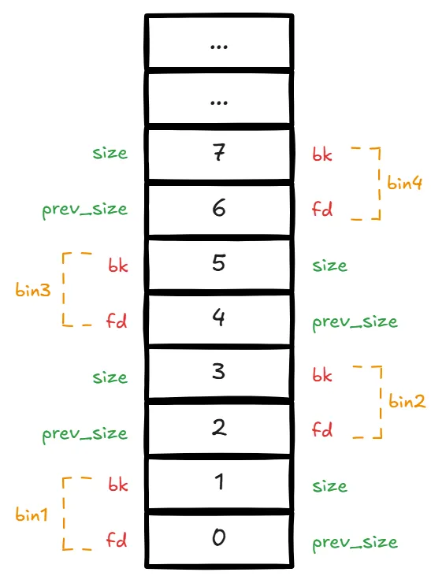

Code repository: [https://github.com/bminor/glibc/blob/glibc-2.27/](https://github.com/bminor/glibc/blob/glibc-2.27/), analysis is for 64-bit mode only.

## Key Concepts

### malloc_chunk

Memory blocks allocated by malloc are called chunks, represented by the [malloc_chunk](https://github.com/bminor/glibc/blob/glibc-2.27/malloc/malloc.c#L1060) struct:

```cpp
/*
  This struct declaration is misleading (but accurate and necessary).
  It declares a "view" into memory allowing access to necessary
  fields at known offsets from a given base. See explanation below.
*/
struct malloc_chunk {

  INTERNAL_SIZE_T      prev_size;  /* Size of previous chunk (if free).  */
  INTERNAL_SIZE_T      size;       /* Size in bytes, including overhead. */

  struct malloc_chunk* fd;         /* double links -- used only if free. */
  struct malloc_chunk* bk;

  /* Only used for large blocks: pointer to next larger size.  */
  struct malloc_chunk* fd_nextsize; /* double links -- used only if free. */
  struct malloc_chunk* bk_nextsize;
};
```

The `prev_size` field is only used when the previous chunk is in a free state; otherwise, it serves as user data space for the physically adjacent previous chunk.

As for a chunk's state, certain bits in `chunk->size` are used as flags. The flag-related macros are:

```cpp
/* size field is or'ed with PREV_INUSE when previous adjacent chunk in use */
#define PREV_INUSE 0x1

/* extract inuse bit of previous chunk */
#define prev_inuse(p) ((p)->mchunk_size & PREV_INUSE)

/* size field is or'ed with IS_MMAPPED if the chunk was obtained with mmap() */
#define IS_MMAPPED 0x2

/* check for mmap()'ed chunk */
#define chunk_is_mmapped(p) ((p)->mchunk_size & IS_MMAPPED)

/* size field is or'ed with NON_MAIN_ARENA if the chunk was obtained
   from a non-main arena.  This is only set immediately before handing
   the chunk to the user, if necessary.  */
#define NON_MAIN_ARENA 0x4

/* Check for chunk from main arena.  */
#define chunk_main_arena(p) (((p)->mchunk_size & NON_MAIN_ARENA) == 0)

/* Mark a chunk as not being on the main arena.  */
#define set_non_main_arena(p) ((p)->mchunk_size |= NON_MAIN_ARENA)

/*
   Bits to mask off when extracting size
   Note: IS_MMAPPED is intentionally not masked off from size field in
   macros for which mmapped chunks should never be seen. This should
   cause helpful core dumps to occur if it is tried by accident by
   people extending or adapting this malloc.
 */
#define SIZE_BITS (PREV_INUSE | IS_MMAPPED | NON_MAIN_ARENA)
```

The size must be a multiple of MALLOC_ALIGNMENT, with unused bits serving as flag bits:

```cpp
#define MALLOC_ALIGNMENT 16
```

The PREV_INUSE flag bit records whether the previous chunk is allocated. The first allocated chunk in the heap always has its PREV_INUSE bit set to 1 to prevent illegal backward memory access.

### arena

Each thread in a process has a corresponding linked list structure [heap_info](https://github.com/bminor/glibc/blob/glibc-2.27/malloc/arena.c#L53) for storing heap information:

```cpp
typedef struct _heap_info
{
  mstate ar_ptr; /* Arena for this heap. */
  struct _heap_info *prev; /* Previous heap. */
  size_t size;   /* Current size in bytes. */
  size_t mprotect_size; /* Size in bytes that has been mprotected
                           PROT_READ|PROT_WRITE.  */
  /* Make sure the following data is properly aligned, particularly
     that sizeof (heap_info) + 2 * SIZE_SZ is a multiple of
     MALLOC_ALIGNMENT. */
  char pad[-6 * SIZE_SZ & MALLOC_ALIGN_MASK];
} heap_info;
```

Each thread's heap memory is logically independent. Each heap is associated with an arena — the main thread's arena is called main_arena, and child threads' arenas are called thread_arenas.

An [arena](https://github.com/bminor/glibc/blob/glibc-2.27/include/malloc.h#L15) is a pointer to a [malloc_state](https://github.com/bminor/glibc/blob/glibc-2.27/malloc/malloc.c#L1674) structure:

```cpp
/*
   have_fastchunks indicates that there are probably some fastbin chunks.
   It is set true on entering a chunk into any fastbin, and cleared early in
   malloc_consolidate.  The value is approximate since it may be set when there
   are no fastbin chunks, or it may be clear even if there are fastbin chunks
   available.  Given it's sole purpose is to reduce number of redundant calls to
   malloc_consolidate, it does not affect correctness.  As a result we can safely
   use relaxed atomic accesses.
 */

struct malloc_state
{
  /* Serialize access.  */
  __libc_lock_define (, mutex);

  /* Flags (formerly in max_fast).  */
  int flags;

  /* Set if the fastbin chunks contain recently inserted free blocks.  */
  /* Note this is a bool but not all targets support atomics on booleans.  */
  int have_fastchunks;

  /* Fastbins */
  mfastbinptr fastbinsY[NFASTBINS];

  /* Base of the topmost chunk -- not otherwise kept in a bin */
  mchunkptr top;

  /* The remainder from the most recent split of a small request */
  mchunkptr last_remainder;

  /* Normal bins packed as described above */
  mchunkptr bins[NBINS * 2 - 2];

  /* Bitmap of bins */
  unsigned int binmap[BINMAPSIZE];

  /* Linked list */
  struct malloc_state *next;

  /* Linked list for free arenas.  Access to this field is serialized
     by free_list_lock in arena.c.  */
  struct malloc_state *next_free;

  /* Number of threads attached to this arena.  0 if the arena is on
     the free list.  Access to this field is serialized by
     free_list_lock in arena.c.  */
  INTERNAL_SIZE_T attached_threads;

  /* Memory allocated from the system in this arena.  */
  INTERNAL_SIZE_T system_mem;
  INTERNAL_SIZE_T max_system_mem;
};
```

The arena maintains key state information and linked lists. Related fields will be explained when they are used.

### tcache

If tcache is enabled (introduced in [2.26](https://sourceware.org/git/?p=glibc.git;a=commitdiff;h=d5c3fafc4307c9b7a4c7d5cb381fcdbfad340bcc), enabled by default), during memory allocation it first checks tcachebins for a suitable chunk.

First, the requested memory size is aligned to `MALLOC_ALIGNMENT`, which is 16-byte alignment. The alignment is done as follows:

```cpp
#define MALLOC_ALIGNMENT (2 * SIZE_SZ < __alignof__ (long double) \
              ? __alignof__ (long double) : 2 * SIZE_SZ)     // effectively 0x10

#define MALLOC_ALIGN_MASK (MALLOC_ALIGNMENT - 1)       // 0x0F

#define MIN_CHUNK_SIZE        (offsetof(struct malloc_chunk, fd_nextsize))  // 0x20

#define MINSIZE  \
  (unsigned long)(((MIN_CHUNK_SIZE+MALLOC_ALIGN_MASK) & ~MALLOC_ALIGN_MASK))  // 0x20
  
// Minimum allocation is MINSIZE, beyond that 16-byte aligned, sometimes an extra SIZE_SZ is needed
// (possibly to account for the next chunk's prev_size field while maintaining alignment)
// For example, the following two requests have different sizes but both allocate a 0x20 chunk:
//     Requesting 0x10 bytes:
//         (0x10 + 8 + 0x0f) & ~0x0f = 0x20    next chunk's prev_size is unused
//     Requesting 0x18 bytes:
//         (0x18 + 8 + 0x0f) & ~0x0f = 0x20    this uses the next chunk's prev_size
#define request2size(req)                                         \
  (((req) + SIZE_SZ + MALLOC_ALIGN_MASK < MINSIZE)  ?             \
   MINSIZE :                                                      \
   ((req) + SIZE_SZ + MALLOC_ALIGN_MASK) & ~MALLOC_ALIGN_MASK)

```

The [request2size](https://github.com/bminor/glibc/blob/glibc-2.27/malloc/malloc.c#L1219) macro converts the `bytes` parameter to the required chunk size. The chunk header occupies 0x10 bytes, with the rest used for user data.

tcache is a linked list structure with the related structs [tcache_entry](https://github.com/bminor/glibc/blob/glibc-2.27/malloc/malloc.c#L2904) and [tcache_perthread_struct](https://github.com/bminor/glibc/blob/glibc-2.27/malloc/malloc.c#L2914):

```cpp
# define TCACHE_MAX_BINS        64

typedef struct tcache_entry
{
  struct tcache_entry *next;
} tcache_entry;

typedef struct tcache_perthread_struct
{
  char counts[TCACHE_MAX_BINS];            // length of the linked list at each index
  tcache_entry *entries[TCACHE_MAX_BINS];
} tcache_perthread_struct;

static __thread tcache_perthread_struct *tcache = NULL;
```

Each thread has one tcache, and each tcache has 64 [tcache_entry](https://github.com/bminor/glibc/blob/glibc-2.27/malloc/malloc.c#L2904) slots. Each [tcache_entry](https://github.com/bminor/glibc/blob/glibc-2.27/malloc/malloc.c#L2904) is a singly linked list. Each tcache index stores a linked list of similarly sized chunks. Unlike other bins, [tcache_entry](https://github.com/bminor/glibc/blob/glibc-2.27/malloc/malloc.c#L2904) points directly to user data rather than the chunk header.

Chunks of different sizes are mapped to corresponding indices. Size-to-index conversion is done via [tidx2usize](https://github.com/bminor/glibc/blob/glibc-2.27/malloc/malloc.c#L308) and [csize2tidx](https://github.com/bminor/glibc/blob/glibc-2.27/malloc/malloc.c#L311):

```cpp
/* Result is only the maximum available user data size for this index */
# define tidx2usize(idx)    (((size_t) idx) * MALLOC_ALIGNMENT + MINSIZE - SIZE_SZ)

/* Get index from chunk size */
/* When "x" is from chunksize().  */
# define csize2tidx(x) (((x) - MINSIZE + MALLOC_ALIGNMENT - 1) / MALLOC_ALIGNMENT)
```

The mapping is as follows:

```plain
idx     chunk_size      data_range
0       0x20            0~24
1       0x30            25~40
2       0x40            41~56
3       0x50            57~72
4       0x60            73~88
5       0x70            89~104
6       0x80            105~120
7       0x90            121~136
8       0xa0            137~152
9       0xb0            153~168
10      0xc0            169~184
11      0xd0            185~200
12      0xe0            201~216
13      0xf0            217~232
14      0x100           233~248
15      0x110           249~264
16      0x120           265~280
17      0x130           281~296
18      0x140           297~312
19      0x150           313~328
20      0x160           329~344
21      0x170           345~360
22      0x180           361~376
23      0x190           377~392
24      0x1a0           393~408
25      0x1b0           409~424
26      0x1c0           425~440
27      0x1d0           441~456
28      0x1e0           457~472
29      0x1f0           473~488
30      0x200           489~504
31      0x210           505~520
32      0x220           521~536
33      0x230           537~552
34      0x240           553~568
35      0x250           569~584
36      0x260           585~600
37      0x270           601~616
38      0x280           617~632
39      0x290           633~648
40      0x2a0           649~664
41      0x2b0           665~680
42      0x2c0           681~696
43      0x2d0           697~712
44      0x2e0           713~728
45      0x2f0           729~744
46      0x300           745~760
47      0x310           761~776
48      0x320           777~792
49      0x330           793~808
50      0x340           809~824
51      0x350           825~840
52      0x360           841~856
53      0x370           857~872
54      0x380           873~888
55      0x390           889~904
56      0x3a0           905~920
57      0x3b0           921~936
58      0x3c0           937~952
59      0x3d0           953~968
60      0x3e0           969~984
61      0x3f0           985~1000
62      0x400           1001~1016
63      0x410           1017~1032
```

Each index's singly linked list holds at most 7 same-sized chunks:

```cpp
/* This is another arbitrary limit, which tunables can change.  Each
   tcache bin will hold at most this number of chunks.  */
# define TCACHE_FILL_COUNT 7
```

Storing and retrieving chunks from tcache bins is wrapped in two functions [tcache_put](https://github.com/bminor/glibc/blob/glibc-2.27/malloc/malloc.c#L2926) and [tcache_get](https://github.com/bminor/glibc/blob/glibc-2.27/malloc/malloc.c#L2938):

```cpp
/* Caller must ensure that we know tc_idx is valid and there's room
   for more chunks.  */
static __always_inline void
tcache_put (mchunkptr chunk, size_t tc_idx)
{
  tcache_entry *e = (tcache_entry *) chunk2mem (chunk);
  assert (tc_idx < TCACHE_MAX_BINS);
  e->next = tcache->entries[tc_idx];
  tcache->entries[tc_idx] = e;
  ++(tcache->counts[tc_idx]);
}

/* Caller must ensure that we know tc_idx is valid and there's
   available chunks to remove.  */
static __always_inline void *
tcache_get (size_t tc_idx)
{
  tcache_entry *e = tcache->entries[tc_idx];
  assert (tc_idx < TCACHE_MAX_BINS);
  assert (tcache->entries[tc_idx] > 0);
  tcache->entries[tc_idx] = e->next;
  --(tcache->counts[tc_idx]);
  return (void *) e;
}
```

From these two functions, we can see that chunks in tcachebins are allocated using a Last-In-First-Out (LIFO) principle.

When chunks enter tcache:

- During memory allocation:
  - When a suitable chunk is found in fastbins, other chunks in that bin are moved to tcache
  - When a suitable chunk is found in smallbins, other chunks in that bin are moved to tcache
- During memory deallocation:
  - If the size qualifies, the chunk is directly inserted into tcache

Chunks inserted into tcache do not undergo any consolidation operations.

### fastbins

If tcache doesn't have a suitable chunk, fastbins are searched.

Fastbins are stored in the arena's [fastbinsY](https://github.com/bminor/glibc/blob/glibc-2.27/malloc/malloc.c#L1687) field, which is a [malloc_chunk](https://github.com/bminor/glibc/blob/glibc-2.27/malloc/malloc.c#L1060) linked list with length [NFASTBINS](https://github.com/bminor/glibc/blob/glibc-2.27/malloc/malloc.c#L1598):

```cpp
typedef struct malloc_chunk *mfastbinptr;
#define fastbin(ar_ptr, idx) ((ar_ptr)->fastbinsY[idx])

/* offset 2 to use otherwise unindexable first 2 bins */
#define fastbin_index(sz) \
  ((((unsigned int) (sz)) >> (SIZE_SZ == 8 ? 4 : 3)) - 2)

/* The maximum fastbin request size we support */
#define MAX_FAST_SIZE     (80 * SIZE_SZ / 4)

#define NFASTBINS  (fastbin_index (request2size (MAX_FAST_SIZE)) + 1)
```

This means fastbins has a length of 10. [fastbin_index](https://github.com/bminor/glibc/blob/glibc-2.27/malloc/malloc.c#L1591) and [csize2tidx](https://github.com/bminor/glibc/blob/glibc-2.27/malloc/malloc.c#L311) handle index-to-chunk-size conversion. Refer to tcache's indices 0-9 for the mapping.

Looking at the [source code](https://github.com/bminor/glibc/blob/glibc-2.27/malloc/malloc.c#L1825), it appears that only the main thread has fastbins enabled by default:

```cpp
  if (av == &main_arena)
    set_max_fast (DEFAULT_MXFAST);
```

[DEFAULT_MXFAST](https://github.com/bminor/glibc/blob/glibc-2.27/malloc/malloc.c#L757) is only 128 bytes:

```cpp
#ifndef DEFAULT_MXFAST
#define DEFAULT_MXFAST     (64 * SIZE_SZ / 4)
#endif
```

In [_int_malloc](https://github.com/bminor/glibc/blob/glibc-2.27/malloc/malloc.c#L3520), the condition for searching fastbins is:

```cpp
if ((unsigned long) (nb) <= (unsigned long) (get_max_fast ()))
```

This means only chunks with size <= 128 are searched in fastbins, leaving the later fastbin indices unused.

Additionally, note that fastbins only use the `fd` field of [malloc_chunk](https://github.com/bminor/glibc/blob/glibc-2.27/malloc/malloc.c#L1060) to form the linked list, meaning the fastbin list is unidirectional (singly linked).

### bins

Besides tcache and fastbins which are stored separately, there are also smallbins, largebins, and unsortedbin, all stored in the arena's bins field:

```cpp
#define NBINS             128

/* Normal bins packed as described above */
  mchunkptr bins[NBINS * 2 - 2];
```

According to glibc's description, bin0 is unused, and bin1 is used for the unsortedbin:

```cpp
  Bin 0 does not exist.  Bin 1 is the unordered list; if that would be
  a valid chunk size the small bins are bumped up one.
```

Then smallbins follow immediately after.

The glibc source code also contains a longer description of bins:

```cpp
/*
   Bins

    An array of bin headers for free chunks. Each bin is doubly
    linked.  The bins are approximately proportionally (log) spaced.
    There are a lot of these bins (128). This may look excessive, but
    works very well in practice.  Most bins hold sizes that are
    unusual as malloc request sizes, but are more usual for fragments
    and consolidated sets of chunks, which is what these bins hold, so
    they can be found quickly.  All procedures maintain the invariant
    that no consolidated chunk physically borders another one, so each
    chunk in a list is known to be preceeded and followed by either
    inuse chunks or the ends of memory.

    Chunks in bins are kept in size order, with ties going to the
    approximately least recently used chunk. Ordering isn't needed
    for the small bins, which all contain the same-sized chunks, but
    facilitates best-fit allocation for larger chunks. These lists
    are just sequential. Keeping them in order almost never requires
    enough traversal to warrant using fancier ordered data
    structures.

    Chunks of the same size are linked with the most
    recently freed at the front, and allocations are taken from the
    back.  This results in LRU (FIFO) allocation order, which tends
    to give each chunk an equal opportunity to be consolidated with
    adjacent freed chunks, resulting in larger free chunks and less
    fragmentation.

    To simplify use in double-linked lists, each bin header acts
    as a malloc_chunk. This avoids special-casing for headers.
    But to conserve space and improve locality, we allocate
    only the fd/bk pointers of bins, and then use repositioning tricks
    to treat these as the fields of a malloc_chunk*.
 */
```

In summary: bins is an array of bin headers for all freed chunks. Each bin is doubly linked. There are 128 bins total. Some sizes aren't typical malloc request sizes, but they're mainly for storing and finding split or consolidated chunks. **No two physically adjacent chunks in a bin's linked list can both be free.**

Chunks in bins are sorted by size. Same-sized chunks follow FIFO (First-In-First-Out) ordering — most recently freed chunks are placed at the front, and allocations prioritize chunks from the back. Smallbin chunks are all the same size so no sorting is needed, but sorting is useful for largebin allocation. Traversal is rarely extensive enough to warrant fancier data structures.

To simplify the doubly linked list structure, a repositioning trick overlays [malloc_chunk](https://github.com/bminor/glibc/blob/glibc-2.27/malloc/malloc.c#L1060) structs across the bins array as bin headers, using only the `fd` and `bk` fields of [malloc_chunk](https://github.com/bminor/glibc/blob/glibc-2.27/malloc/malloc.c#L1060):



There are 128 bins total: no bin0, bin1 is the unsorted bin, bins 2-63 are smallbins, and bin64 onward is the largebins range.

#### Bin Linked List Structure

All bins share this structure:


#### smallbins

glibc uses [in_smallbin_range](https://github.com/bminor/glibc/blob/glibc-2.27/malloc/malloc.c#L1466) to check if a chunk size falls within the smallbins range:

```cpp
#define NBINS             128
#define NSMALLBINS         64
#define SMALLBIN_WIDTH    MALLOC_ALIGNMENT    // 0x10
#define SMALLBIN_CORRECTION (MALLOC_ALIGNMENT > 2 * SIZE_SZ) 
#define MIN_LARGE_SIZE    ((NSMALLBINS - SMALLBIN_CORRECTION) * SMALLBIN_WIDTH)

#define in_smallbin_range(sz)  \
  ((unsigned long) (sz) < (unsigned long) MIN_LARGE_SIZE)
```

From these macro definitions, smallbins occupy bins indices 2-63, with chunk sizes ranging from 0x20 to 0x3f0.

The [smallbin_index](https://github.com/bminor/glibc/blob/glibc-2.27/malloc/malloc.c#L1469) macro converts chunk size to the corresponding bins index:

```cpp
#define smallbin_index(sz) \
  ((SMALLBIN_WIDTH == 16 ? (((unsigned) (sz)) >> 4) : (((unsigned) (sz)) >> 3))\
   + SMALLBIN_CORRECTION)
```

The bins index to smallbin chunk size mapping is:

```cpp
idx     chunk_size
2       0x20
3       0x30
4       0x40
5       0x50
6       0x60
7       0x70
8       0x80
9       0x90
10      0xa0
11      0xb0
12      0xc0
13      0xd0
14      0xe0
15      0xf0
16      0x100
17      0x110
18      0x120
19      0x130
20      0x140
21      0x150
22      0x160
23      0x170
24      0x180
25      0x190
26      0x1a0
27      0x1b0
28      0x1c0
29      0x1d0
30      0x1e0
31      0x1f0
32      0x200
33      0x210
34      0x220
35      0x230
36      0x240
37      0x250
38      0x260
39      0x270
40      0x280
41      0x290
42      0x2a0
43      0x2b0
44      0x2c0
45      0x2d0
46      0x2e0
47      0x2f0
48      0x300
49      0x310
50      0x320
51      0x330
52      0x340
53      0x350
54      0x360
55      0x370
56      0x380
57      0x390
58      0x3a0
59      0x3b0
60      0x3c0
61      0x3d0
62      0x3e0
63      0x3f0
```

#### largebins

Starting from bin64, everything belongs to largebins. Chunks on each largebin are not the same size but fall within a range.

Let's first look at the chunk size to bin index conversion:

```cpp
#define largebin_index_32(sz)                                                \
  (((((unsigned long) (sz)) >> 6) <= 38) ?  56 + (((unsigned long) (sz)) >> 6) :\
   ((((unsigned long) (sz)) >> 9) <= 20) ?  91 + (((unsigned long) (sz)) >> 9) :\
   ((((unsigned long) (sz)) >> 12) <= 10) ? 110 + (((unsigned long) (sz)) >> 12) :\
   ((((unsigned long) (sz)) >> 15) <= 4) ? 119 + (((unsigned long) (sz)) >> 15) :\
   ((((unsigned long) (sz)) >> 18) <= 2) ? 124 + (((unsigned long) (sz)) >> 18) :\
   126)

#define largebin_index_32_big(sz)                                            \
  (((((unsigned long) (sz)) >> 6) <= 45) ?  49 + (((unsigned long) (sz)) >> 6) :\
   ((((unsigned long) (sz)) >> 9) <= 20) ?  91 + (((unsigned long) (sz)) >> 9) :\
   ((((unsigned long) (sz)) >> 12) <= 10) ? 110 + (((unsigned long) (sz)) >> 12) :\
   ((((unsigned long) (sz)) >> 15) <= 4) ? 119 + (((unsigned long) (sz)) >> 15) :\
   ((((unsigned long) (sz)) >> 18) <= 2) ? 124 + (((unsigned long) (sz)) >> 18) :\
   126)

// XXX It remains to be seen whether it is good to keep the widths of
// XXX the buckets the same or whether it should be scaled by a factor
// XXX of two as well.
#define largebin_index_64(sz)                                                \
  (((((unsigned long) (sz)) >> 6) <= 48) ?  48 + (((unsigned long) (sz)) >> 6) :\
   ((((unsigned long) (sz)) >> 9) <= 20) ?  91 + (((unsigned long) (sz)) >> 9) :\
   ((((unsigned long) (sz)) >> 12) <= 10) ? 110 + (((unsigned long) (sz)) >> 12) :\
   ((((unsigned long) (sz)) >> 15) <= 4) ? 119 + (((unsigned long) (sz)) >> 15) :\
   ((((unsigned long) (sz)) >> 18) <= 2) ? 124 + (((unsigned long) (sz)) >> 18) :\
   126)

#define largebin_index(sz) \
  (SIZE_SZ == 8 ? largebin_index_64 (sz)                                     \
   : MALLOC_ALIGNMENT == 16 ? largebin_index_32_big (sz)                     \
   : largebin_index_32 (sz))
```

In 64-bit mode, we only need to focus on [largebin_index_64](https://github.com/bminor/glibc/blob/glibc-2.27/malloc/malloc.c#L1492). The spacing between smallbins is a fixed 0x10, with the maximum chunk size being 0xf0. Therefore, the minimum largebin chunk size is 0x400. According to [largebin_index_64](https://github.com/bminor/glibc/blob/glibc-2.27/malloc/malloc.c#L1492), largebins are divided into 6 groups based on different chunk size intervals:

| n | Count | Interval (2^i) | i |
| --- | --- | --- | --- |
| 1 | 32 | 64 | 6 |
| 2 | 16 | 512 | 9 |
| 3 | 8 | 4096 | 12 |
| 4 | 4 | 32768 | 15 |
| 5 | 2 | 262144 | 18 |
| 6 | 1 |  |  |

The actual index to chunk size range mapping:

```cpp
64      0x400-0x430
65      0x440-0x470
66      0x480-0x4b0
67      0x4c0-0x4f0
68      0x500-0x530
69      0x540-0x570
70      0x580-0x5b0
71      0x5c0-0x5f0
72      0x600-0x630
73      0x640-0x670
74      0x680-0x6b0
75      0x6c0-0x6f0
76      0x700-0x730
77      0x740-0x770
78      0x780-0x7b0
79      0x7c0-0x7f0
80      0x800-0x830
81      0x840-0x870
82      0x880-0x8b0
83      0x8c0-0x8f0
84      0x900-0x930
85      0x940-0x970
86      0x980-0x9b0
87      0x9c0-0x9f0
88      0xa00-0xa30
89      0xa40-0xa70
90      0xa80-0xab0
91      0xac0-0xaf0
92      0xb00-0xb30
93      0xb40-0xb70
94      0xb80-0xbb0
95      0xbc0-0xbf0
96      0xc00-0xc30
97      0xc40-0xdf0
98      0xe00-0xff0
99      0x1000-0x11f0
100     0x1200-0x13f0
101     0x1400-0x15f0
102     0x1600-0x17f0
103     0x1800-0x19f0
104     0x1a00-0x1bf0
105     0x1c00-0x1df0
106     0x1e00-0x1ff0
107     0x2000-0x21f0
108     0x2200-0x23f0
109     0x2400-0x25f0
110     0x2600-0x27f0
111     0x2800-0x29f0
112     0x2a00-0x2ff0
113     0x3000-0x3ff0
114     0x4000-0x4ff0
115     0x5000-0x5ff0
116     0x6000-0x6ff0
117     0x7000-0x7ff0
118     0x8000-0x8ff0
119     0x9000-0x9ff0
120     0xa000-0xfff0
121     0x10000-0x17ff0
122     0x18000-0x1fff0
123     0x20000-0x27ff0
124     0x28000-0x3fff0
125     0x40000-0x7fff0
126     0x80000-∞
```

#### unsortedbin

Chunks that have not yet been categorized into smallbins or largebins are temporarily placed in the unsortedbin, located at the bin1 position. They don't need to be sorted by size.

Freshly freed chunks are not immediately categorized — they're first placed in the unsortedbin.

On the next `malloc` call, when tcache, fastbins, and smallbins don't have a same-sized (exact-fit) chunk, the unsortedbin is categorized.

## Memory Allocation

The entry point for programs calling glibc to allocate memory is [__libc_malloc](https://github.com/bminor/glibc/blob/glibc-2.27/malloc/malloc.c#L3027).

### __libc_malloc

Function signature:

```cpp
void *
__libc_malloc (size_t bytes)
```

`bytes` is the actual memory size requested by the program.

If [__malloc_hook](https://github.com/bminor/glibc/blob/glibc-2.27/malloc/malloc.h#L146) is not null, it is called and its result returned.

Based on the required chunk size, if tcachebins already has a same-sized chunk, that chunk is removed from the tcache linked list and returned.

If tcache doesn't have one, the thread's corresponding arena is found, and [_int_malloc](https://github.com/bminor/glibc/blob/glibc-2.27/malloc/malloc.c#L3520) is called to allocate memory.

### _int_malloc

Function signature:

```cpp
static void *
_int_malloc (mstate av, size_t bytes)
```

`av` is the thread's corresponding arena, and `bytes` is the actual memory size requested.

[request2size](https://github.com/bminor/glibc/blob/glibc-2.27/malloc/malloc.c#L1219) converts the `bytes` parameter to the required chunk size `nb`. The chunk header occupies 0x10 bytes, with the rest for user data.

If `av` is null (no available arena), [sysmalloc](https://github.com/bminor/glibc/blob/glibc-2.27/malloc/malloc.c#L2273) is called directly to allocate mmap-mapped memory and generate a chunk, which is marked as [IS_MMAPPED](https://github.com/bminor/glibc/blob/23158b08a0908f381459f273a984c6fd328363cb/malloc/malloc.c#L1253).

If an arena is available and `nb` falls within the fastbins range, the appropriate fastbin is found, one chunk is taken, and other same-sized chunks are moved to tcache (stopping when tcachebin reaches its limit of 7 chunks).

If nothing suitable is found in fastbins, it checks whether `nb` falls in the smallbin or largebin range.

If within smallbin range, the appropriate smallbin is found, one chunk is taken, and other same-sized chunks are transferred to tcache (stopping at the 7-chunk limit).

If within largebin range, [malloc_consolidate](https://github.com/bminor/glibc/blob/glibc-2.27/malloc/malloc.c#L4402) is called to consolidate fastbin chunks to avoid fragmentation.

Unsorted chunks are then iterated. If `nb` is in the smallbin range and the unsortedbin has only one chunk that is larger than `nb` and is the remainder from the last small chunk split (recorded in the arena's `last_remainder` field), a piece is carved from this remainder chunk:

```cpp
/*
   If a small request, try to use last remainder if it is the
   only chunk in unsorted bin.  This helps promote locality for
   runs of consecutive small requests. This is the only
   exception to best-fit, and applies only when there is
   no exact fit for a small chunk.
 */

if (in_smallbin_range (nb) &&
    bck == unsorted_chunks (av) &&
    victim == av->last_remainder &&
    (unsigned long) (size) > (unsigned long) (nb + MINSIZE))
  {
```

Otherwise, iteration continues over unsorted chunks, organizing them by transferring to smallbin or largebin (maintaining size order for largebin insertion).

During iteration, if a chunk exactly matches `nb` and tcache has room, it's stored in tcache (marked for later) and iteration continues. If it can't be stored in tcache, the chunk is returned directly to the program.

After unsorted chunk transfer, if the tcache processing limit was reached and suitable chunks were previously placed in tcache, a chunk is retrieved from tcache and returned. By default there's no limit, so this step is skipped.

If the iteration count reaches 10,000, iteration terminates.

If chunks were previously found and stored in tcache, a chunk is retrieved from tcache and returned.

If `nb` is in the largebin range, the smallest large chunk satisfying `nb` is found and split. The remainder goes into the unsortedbin and is recorded in the arena's `last_remainder` field. The chunk is returned.

If still nothing suitable, all bins are searched for the smallest chunk satisfying `nb`. If multiple same-sized chunks exist, LRU (Least Recently Used) selection applies for the split operation. The remainder goes to the unsortedbin.

If no bin has a satisfying chunk, the top chunk is carved. If the top chunk is insufficient, [sysmalloc](https://github.com/bminor/glibc/blob/glibc-2.27/malloc/malloc.c#L2273) expands top and allocates a chunk.

#### malloc_consolidate

Function signature:

```cpp
static void malloc_consolidate(mstate av)
```

This function iterates all chunks in fastbins.

If a chunk's `PREV_INUSE` flag is not 1, meaning the physically adjacent previous chunk is free, the current chunk is consolidated forward. Then it checks if the physically adjacent next chunk is also free — if so, it's consolidated too. The resulting new chunk has its `PREV_INUSE` flag set to 1.

If the consolidated chunk is physically adjacent to the top chunk, it becomes the new top chunk. Otherwise, it's linked to the unsortedbin.

The consolidation process involves removing chunks from bin linked lists, done through the [unlink](https://github.com/bminor/glibc/blob/glibc-2.27/malloc/malloc.c#L1404) function, defined as a macro since it's a common operation:

```cpp
/* Take a chunk off a bin list */
#define unlink(AV, P, BK, FD) {                                                 \
    if (__builtin_expect (chunksize(P) != prev_size (next_chunk(P)), 0))        \
      malloc_printerr ("corrupted size vs. prev_size");                         \
FD = P->fd;                                                                     \
    BK = P->bk;                                                                 \
    if (__builtin_expect (FD->bk != P || BK->fd != P, 0))                       \
      malloc_printerr ("corrupted double-linked list");                         \
    else {                                                                      \
        FD->bk = BK;                                                            \
        BK->fd = FD;                                                            \
        if (!in_smallbin_range (chunksize_nomask (P))                           \
            && __builtin_expect (P->fd_nextsize != NULL, 0)) {                  \
        if (__builtin_expect (P->fd_nextsize->bk_nextsize != P, 0)              \
        || __builtin_expect (P->bk_nextsize->fd_nextsize != P, 0))              \
          malloc_printerr ("corrupted double-linked list (not small)");         \
            if (FD->fd_nextsize == NULL) {                                      \
                if (P->fd_nextsize == P)                                        \
                  FD->fd_nextsize = FD->bk_nextsize = FD;                       \
                else {                                                          \
                    FD->fd_nextsize = P->fd_nextsize;                           \
                    FD->bk_nextsize = P->bk_nextsize;                           \
                    P->fd_nextsize->bk_nextsize = FD;                           \
                    P->bk_nextsize->fd_nextsize = FD;                           \
                  }                                                             \
        } else {                                                                \
                P->fd_nextsize->bk_nextsize = P->bk_nextsize;                   \
                P->bk_nextsize->fd_nextsize = P->fd_nextsize;                   \
              }                                                                 \
          }                                                                     \
      }                                                                         \
}
```

### sysmalloc

Function signature:

```cpp
static void *
sysmalloc (INTERNAL_SIZE_T nb, mstate av)
```

`nb` is the required chunk size, and `av` is the thread's corresponding arena.

When any of the following three conditions are met, mmap is called directly to allocate mapped memory chunks marked as [IS_MMAPPED](https://github.com/bminor/glibc/blob/23158b08a0908f381459f273a984c6fd328363cb/malloc/malloc.c#L1253), rather than extending existing heap memory:

1. `av` is null — no available arena
2. `nb` exceeds the threshold [DEFAULT_MMAP_THRESHOLD](https://github.com/bminor/glibc/blob/glibc-2.27/malloc/malloc.c#L976), which defaults to 128 * 1024 = 0x20000
3. The current number of mmap allocations hasn't exceeded [DEFAULT_MMAP_MAX](https://github.com/bminor/glibc/blob/glibc-2.27/malloc/malloc.c#L993), which defaults to 65536

Detailed mmap memory allocation analysis is skipped for now.

If there's no available arena and mmap allocation also fails, null is returned.

If `av` is not null (arena available), `av->top` is extended and a chunk is carved from it.

When a thread requests a memory chunk, it's actually carved from the arena's top chunk. [sysmalloc](https://github.com/bminor/glibc/blob/glibc-2.27/malloc/malloc.c#L2273) extends the top chunk before allocating.

If the top chunk still has sufficient space for the request, an assertion is triggered:

```cpp
/* Precondition: not enough current space to satisfy nb request */
assert ((unsigned long) (old_size) < (unsigned long) (nb + MINSIZE));
```

If `av` is a thread_arena, it first tries [grow_heap](https://github.com/bminor/glibc/blob/glibc-2.27/malloc/arena.c#L530) to extend the top heap. If that fails, [new_heap](https://github.com/bminor/glibc/blob/glibc-2.27/malloc/arena.c#L452) creates a new heap.

[new_heap](https://github.com/bminor/glibc/blob/glibc-2.27/malloc/arena.c#L452) actually uses mmap to allocate memory. It limits an mmap heap's maximum space to [HEAP_MAX_SIZE](https://github.com/bminor/glibc/blob/glibc-2.27/malloc/arena.c#L34) by default, with minimum heap size [HEAP_MIN_SIZE](https://github.com/bminor/glibc/blob/glibc-2.27/malloc/arena.c#L29):

```cpp
#define HEAP_MIN_SIZE (32 * 1024)
#ifndef HEAP_MAX_SIZE
# ifdef DEFAULT_MMAP_THRESHOLD_MAX
#  define HEAP_MAX_SIZE (2 * DEFAULT_MMAP_THRESHOLD_MAX)
# else
#  define HEAP_MAX_SIZE (1024 * 1024) /* must be a power of two */
# endif
#endif
```

If this limit is exceeded, allocation fails, and [sysmalloc](https://github.com/bminor/glibc/blob/glibc-2.27/malloc/malloc.c#L2273) then tries calling mmap directly to create a memory block of the required size.

If `av` is the main_arena, brk is used for allocation. If brk fails, mmap is used instead. This mixed brk/mmap usage can result in non-contiguous memory. Detailed brk allocation analysis is skipped for now.

Regardless of whether it's main_arena or thread_arena, due to top_pad:

```cpp
{ /* Request enough space for nb + pad + overhead */
  size = nb + mp_.top_pad + MINSIZE;
```

`nb` is the requested chunk size (minimum 0x20), and `mp_.top_pad` defaults to [DEFAULT_TOP_PAD](https://github.com/bminor/glibc/blob/glibc-2.27/sysdeps/generic/malloc-machine.h#L39), which is 0x20000:

```cpp
#ifndef DEFAULT_TOP_PAD
# define DEFAULT_TOP_PAD 131072
#endif
```

Therefore, the minimum top heap length is 0x20040, with no maximum limit. The top heap length is also aligned to the system's page_size.

Finally, the top heap expansion is completed, and a chunk of size `nb` is carved from the top and returned.

## Memory Deallocation

The entry point for programs calling glibc to free memory is [__libc_free](https://github.com/bminor/glibc/blob/glibc-2.27/malloc/malloc.c#L3085).

### __libc_free

Function signature:

```cpp
void
__libc_free (void *mem)
```

`mem` is the memory location to free.

If [__free_hook](https://github.com/bminor/glibc/blob/glibc-2.27/malloc/malloc.h#L143) is not null, it is called and returns.

[mem2chunk](https://github.com/bminor/glibc/blob/glibc-2.27/malloc/malloc.c#L1188) converts `mem` to a chunk.

If the chunk's `IS_MMAPPED` flag is 1, it indicates mmap-allocated large or temporary memory that needs immediate deallocation.

Otherwise, [_int_free](https://github.com/bminor/glibc/blob/glibc-2.27/malloc/malloc.c#L4138) is called to free the memory.

### _int_free

Function signature:

```cpp
static void
_int_free (mstate av, mchunkptr p, int have_lock)
```

If the chunk meets tcache insertion conditions, it's stored in tcache, completing the deallocation.

If the chunk meets fastbin insertion conditions, it's stored in fastbins.

If it can't go into fastbins, chunks with `IS_MMAPPED` set to 1 are released back to the system. Otherwise, the chunk is consolidated with physically adjacent free chunks.

If the consolidated chunk doesn't reach the top chunk boundary, it's placed in the unsorted bin. Otherwise, the top chunk is exhausted and the freed chunk becomes the new top chunk.

Finally, if the consolidated chunk's size exceeds `FASTBIN_CONSOLIDATION_THRESHOLD`, [malloc_consolidate](https://github.com/bminor/glibc/blob/glibc-2.27/malloc/malloc.c#L4402) is called to consolidate fastbin chunks:

```cpp
/*
   FASTBIN_CONSOLIDATION_THRESHOLD is the size of a chunk in free()
   that triggers automatic consolidation of possibly-surrounding
   fastbin chunks. This is a heuristic, so the exact value should not
   matter too much. It is defined at half the default trim threshold as a
   compromise heuristic to only attempt consolidation if it is likely
   to lead to trimming. However, it is not dynamically tunable, since
   consolidation reduces fragmentation surrounding large chunks even
   if trimming is not used.
 */

#define FASTBIN_CONSOLIDATION_THRESHOLD  (65536UL)

    /*
      If freeing a large space, consolidate possibly-surrounding
      chunks. Then, if the total unused topmost memory exceeds trim
      threshold, ask malloc_trim to reduce top.

      Unless max_fast is 0, we don't know if there are fastbins
      bordering top, so we cannot tell for sure whether threshold
      has been reached unless fastbins are consolidated.  But we
      don't want to consolidate on each free.  As a compromise,
      consolidation is performed if FASTBIN_CONSOLIDATION_THRESHOLD
      is reached.
    */

    if ((unsigned long)(size) >= FASTBIN_CONSOLIDATION_THRESHOLD) {
      if (atomic_load_relaxed (&av->have_fastchunks))
    malloc_consolidate(av);
```

## Summary

**Deallocation**: mmap temporary memory chunks are freed immediately. Other chunks are not freed immediately — they're stored as free chunks with priority tcache(64) > fastbins(10) > unsortedbin(1). Consolidation occurs before entering the unsortedbin.

**Allocation**: If there's no arena, mmap temporary memory chunks are allocated directly. Otherwise, suitable free chunks are searched with priority tcache(64) > fastbins(10) > smallbins(62) > unsortedbin(1) > largebins > topchunk. Same-sized chunks are preferred (exact-fit). If no exact-fit exists, the closest larger chunk is split. The top chunk serves as the fallback — if even the top chunk can't satisfy the request, a system call extends it before carving a piece for the program.

Key points:

1. tcache and fastbin are singly linked lists; all other bins are doubly linked.
2. Consecutive memory allocations are very likely to be contiguous memory segments due to the top chunk.
3. If several allocated memory segments are contiguous, a heap overflow will corrupt the chunk header of the subsequent contiguous chunk, causing free chunks and in-use chunks to overlap, or free chunks to be linked to arbitrary locations.
4. Consecutive allocation and deallocation of same-sized memory actually reuses the same memory behind the scenes. A UAF vulnerability allows free-state chunks to be linked to arbitrary locations.
5. If a free chunk can be linked to an arbitrary location, it enables memory allocation at arbitrary locations, achieving arbitrary read/write.
