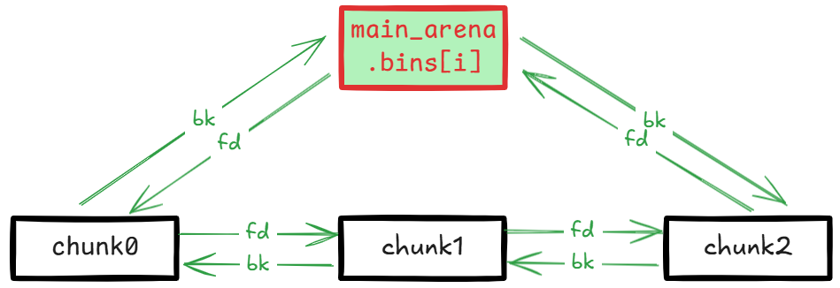

代码仓库：[https://github.com/bminor/glibc/blob/glibc-2.27/](https://github.com/bminor/glibc/blob/glibc-2.27/)，只分析 64 位模式下。

## 关键概念

### malloc_chunk

malloc 申请的内存块被称为 chunk，用 [malloc_chunk](https://github.com/bminor/glibc/blob/glibc-2.27/malloc/malloc.c#L1060) 结构体表示：

```cpp
/*
  This struct declaration is misleading (but accurate and necessary).
  It declares a "view" into memory allowing access to necessary
  fields at known offsets from a given base. See explanation below.
*/
struct malloc_chunk {

  INTERNAL_SIZE_T      prev_size;  /* Size of previous chunk (if free).  */
  INTERNAL_SIZE_T      size;       /* Size in bytes, including overhead. */

  struct malloc_chunk* fd;         /* double links -- used only if free. */
  struct malloc_chunk* bk;

  /* Only used for large blocks: pointer to next larger size.  */
  struct malloc_chunk* fd_nextsize; /* double links -- used only if free. */
  struct malloc_chunk* bk_nextsize;
};
```

其中 prev_size 只有在前一个 chunk 是 free 状态的时候被使用，否则给物理相邻的前一个 chunk 当用户数据块。

至于 chunk 是什么状态，使用 chunk→size 的某些位做标记，标志位相关的宏：

```cpp
/* size field is or'ed with PREV_INUSE when previous adjacent chunk in use */
#define PREV_INUSE 0x1

/* extract inuse bit of previous chunk */
#define prev_inuse(p) ((p)->mchunk_size & PREV_INUSE)

/* size field is or'ed with IS_MMAPPED if the chunk was obtained with mmap() */
#define IS_MMAPPED 0x2

/* check for mmap()'ed chunk */
#define chunk_is_mmapped(p) ((p)->mchunk_size & IS_MMAPPED)

/* size field is or'ed with NON_MAIN_ARENA if the chunk was obtained
   from a non-main arena.  This is only set immediately before handing
   the chunk to the user, if necessary.  */
#define NON_MAIN_ARENA 0x4

/* Check for chunk from main arena.  */
#define chunk_main_arena(p) (((p)->mchunk_size & NON_MAIN_ARENA) == 0)

/* Mark a chunk as not being on the main arena.  */
#define set_non_main_arena(p) ((p)->mchunk_size |= NON_MAIN_ARENA)

/*
   Bits to mask off when extracting size
   Note: IS_MMAPPED is intentionally not masked off from size field in
   macros for which mmapped chunks should never be seen. This should
   cause helpful core dumps to occur if it is tried by accident by
   people extending or adapting this malloc.
 */
#define SIZE_BITS (PREV_INUSE | IS_MMAPPED | NON_MAIN_ARENA)
```

size 大小必须是 MALLOC_ALIGNMENT 的整数倍，空闲的位用作标志位：

```cpp
#define MALLOC_ALIGNMENT 16
```

PREV_INUSE 标志位用于记录前一个 chunk 是否被分配，堆中第一个被分配的 chunk 的 PREV_INUSE 位都会被设置为 1，防止向前访问非法内存。

### arena

进程的每个线程都会有个对应的存储堆信息的链表结构 [heap_info](https://github.com/bminor/glibc/blob/glibc-2.27/malloc/arena.c#L53)：

```cpp
typedef struct _heap_info
{
  mstate ar_ptr; /* Arena for this heap. */
  struct _heap_info *prev; /* Previous heap. */
  size_t size;   /* Current size in bytes. */
  size_t mprotect_size; /* Size in bytes that has been mprotected
                           PROT_READ|PROT_WRITE.  */
  /* Make sure the following data is properly aligned, particularly
     that sizeof (heap_info) + 2 * SIZE_SZ is a multiple of
     MALLOC_ALIGNMENT. */
  char pad[-6 * SIZE_SZ & MALLOC_ALIGN_MASK];
} heap_info;
```

每个线程的堆内存是逻辑上互相独立的，每个堆都关联一个 arena，主线程的 arena 称为 main_arena，子线程的 arena 称为 thread_arena。

[arena](https://github.com/bminor/glibc/blob/glibc-2.27/include/malloc.h#L15) 是一个指向 [malloc_state](https://github.com/bminor/glibc/blob/glibc-2.27/malloc/malloc.c#L1674) 结构的指针：

```cpp
/*
   have_fastchunks indicates that there are probably some fastbin chunks.
   It is set true on entering a chunk into any fastbin, and cleared early in
   malloc_consolidate.  The value is approximate since it may be set when there
   are no fastbin chunks, or it may be clear even if there are fastbin chunks
   available.  Given it's sole purpose is to reduce number of redundant calls to
   malloc_consolidate, it does not affect correctness.  As a result we can safely
   use relaxed atomic accesses.
 */

struct malloc_state
{
  /* Serialize access.  */
  __libc_lock_define (, mutex);

  /* Flags (formerly in max_fast).  */
  int flags;

  /* Set if the fastbin chunks contain recently inserted free blocks.  */
  /* Note this is a bool but not all targets support atomics on booleans.  */
  int have_fastchunks;

  /* Fastbins */
  mfastbinptr fastbinsY[NFASTBINS];

  /* Base of the topmost chunk -- not otherwise kept in a bin */
  mchunkptr top;

  /* The remainder from the most recent split of a small request */
  mchunkptr last_remainder;

  /* Normal bins packed as described above */
  mchunkptr bins[NBINS * 2 - 2];

  /* Bitmap of bins */
  unsigned int binmap[BINMAPSIZE];

  /* Linked list */
  struct malloc_state *next;

  /* Linked list for free arenas.  Access to this field is serialized
     by free_list_lock in arena.c.  */
  struct malloc_state *next_free;

  /* Number of threads attached to this arena.  0 if the arena is on
     the free list.  Access to this field is serialized by
     free_list_lock in arena.c.  */
  INTERNAL_SIZE_T attached_threads;

  /* Memory allocated from the system in this arena.  */
  INTERNAL_SIZE_T system_mem;
  INTERNAL_SIZE_T max_system_mem;
};
```

arena 中维护了一些关键的状态信息和链表，相关字段在用到的时候再解释。

### tcache

如果启用 tcache（在 [2.26](https://sourceware.org/git/?p=glibc.git;a=commitdiff;h=d5c3fafc4307c9b7a4c7d5cb381fcdbfad340bcc) 引入，默认启用），在内存分配时首先在 tcachebins 里找有没有合适的 chunk。

先对申请的内存大小按 `MALLOC_ALIGNMENT` **对齐，也就是 16 字节对齐，对齐方式如下：

```cpp
#define MALLOC_ALIGNMENT (2 * SIZE_SZ < __alignof__ (long double) \
              ? __alignof__ (long double) : 2 * SIZE_SZ)     // 实际就是0x10

#define MALLOC_ALIGN_MASK (MALLOC_ALIGNMENT - 1)       // 0x0F

#define MIN_CHUNK_SIZE        (offsetof(struct malloc_chunk, fd_nextsize))  // 0x20

#define MINSIZE  \
  (unsigned long)(((MIN_CHUNK_SIZE+MALLOC_ALIGN_MASK) & ~MALLOC_ALIGN_MASK))  // 0x20
  
// 最小分配 MINSIZE，超过后按 16 位对齐，有时候要多申请 SIZE_SZ 大小的空间（可能是要算上下一个chunk的 prev_size 位置且保证对齐）
// 例如 下面两个例子申请的大小不同，但是实际分配的 chunk 大小都是 0x20：
//     申请 0x10 的空间：
//         (0x10 + 8 + 0x0f) & ~0x0f = 0x20    这时候下一个 chunk 用不到如果用到的话就不对齐了
//     申请 0x18 的空间：
//         (0x18 + 8 + 0x0f) & ~0x0f = 0x20    这时候就用到了下一个 chunk 的 prev_size 了
#define request2size(req)                                         \
  (((req) + SIZE_SZ + MALLOC_ALIGN_MASK < MINSIZE)  ?             \
   MINSIZE :                                                      \
   ((req) + SIZE_SZ + MALLOC_ALIGN_MASK) & ~MALLOC_ALIGN_MASK)

```

使用 [request2size](https://github.com/bminor/glibc/blob/glibc-2.27/malloc/malloc.c#L1219) 将 `bytes`  参数转换为所需 chunk 的大小，chunk 头占用 0x10 的空间，剩下的用来存储用户数据。

tcache 是一种链表结构，相关的结构体 [tcache_entry](https://github.com/bminor/glibc/blob/glibc-2.27/malloc/malloc.c#L2904) 和  [tcache_perthread_struct](https://github.com/bminor/glibc/blob/glibc-2.27/malloc/malloc.c#L2914)：

```cpp
# define TCACHE_MAX_BINS        64

typedef struct tcache_entry
{
  struct tcache_entry *next;
} tcache_entry;

typedef struct tcache_perthread_struct
{
  char counts[TCACHE_MAX_BINS];            // 表示每个索引下链表的长度
  tcache_entry *entries[TCACHE_MAX_BINS];
} tcache_perthread_struct;

static __thread tcache_perthread_struct *tcache = NULL;
```

每个线程一个 tcache，每个 tcache 有 64 个 [tcache_entry](https://github.com/bminor/glibc/blob/glibc-2.27/malloc/malloc.c#L2904)，每个 [tcache_entry](https://github.com/bminor/glibc/blob/glibc-2.27/malloc/malloc.c#L2904) 是个单向链表结构，tcache 的每个索引存储相似大小的 chunk 链表，和其他 bin 不一样 [tcache_entry](https://github.com/bminor/glibc/blob/glibc-2.27/malloc/malloc.c#L2904) 直接指向用户数据而不是 chunk 头。

不同的大小的 chunk 被划分到对应的索引里，大小和索引互相转换通过 [tidx2usize](https://github.com/bminor/glibc/blob/glibc-2.27/malloc/malloc.c#L308) 和  [csize2tidx](https://github.com/bminor/glibc/blob/glibc-2.27/malloc/malloc.c#L311) 完成：

```cpp
/* 结果仅为该索引下用户数据的最大可用大小 */
# define tidx2usize(idx)    (((size_t) idx) * MALLOC_ALIGNMENT + MINSIZE - SIZE_SZ)

/* 根据 chunk 大小获取索引 */
/* When "x" is from chunksize().  */
# define csize2tidx(x) (((x) - MINSIZE + MALLOC_ALIGNMENT - 1) / MALLOC_ALIGNMENT)
```

也就是这个关系：

```plain
idx     chunk_size      data_range
0       0x20            0~24
1       0x30            25~40
2       0x40            41~56
3       0x50            57~72
4       0x60            73~88
5       0x70            89~104
6       0x80            105~120
7       0x90            121~136
8       0xa0            137~152
9       0xb0            153~168
10      0xc0            169~184
11      0xd0            185~200
12      0xe0            201~216
13      0xf0            217~232
14      0x100           233~248
15      0x110           249~264
16      0x120           265~280
17      0x130           281~296
18      0x140           297~312
19      0x150           313~328
20      0x160           329~344
21      0x170           345~360
22      0x180           361~376
23      0x190           377~392
24      0x1a0           393~408
25      0x1b0           409~424
26      0x1c0           425~440
27      0x1d0           441~456
28      0x1e0           457~472
29      0x1f0           473~488
30      0x200           489~504
31      0x210           505~520
32      0x220           521~536
33      0x230           537~552
34      0x240           553~568
35      0x250           569~584
36      0x260           585~600
37      0x270           601~616
38      0x280           617~632
39      0x290           633~648
40      0x2a0           649~664
41      0x2b0           665~680
42      0x2c0           681~696
43      0x2d0           697~712
44      0x2e0           713~728
45      0x2f0           729~744
46      0x300           745~760
47      0x310           761~776
48      0x320           777~792
49      0x330           793~808
50      0x340           809~824
51      0x350           825~840
52      0x360           841~856
53      0x370           857~872
54      0x380           873~888
55      0x390           889~904
56      0x3a0           905~920
57      0x3b0           921~936
58      0x3c0           937~952
59      0x3d0           953~968
60      0x3e0           969~984
61      0x3f0           985~1000
62      0x400           1001~1016
63      0x410           1017~1032
```

每个索引下的单向链表最多有 7 个相同大小的 chunk：

```cpp
/* This is another arbitrary limit, which tunables can change.  Each
   tcache bin will hold at most this number of chunks.  */
# define TCACHE_FILL_COUNT 7
```

从 tcache bin 中存取 chunk 被包装成两个函数 [tcache_put](https://github.com/bminor/glibc/blob/glibc-2.27/malloc/malloc.c#L2926) 和 [tcache_get](https://github.com/bminor/glibc/blob/glibc-2.27/malloc/malloc.c#L2938)：

```cpp
/* Caller must ensure that we know tc_idx is valid and there's room
   for more chunks.  */
static __always_inline void
tcache_put (mchunkptr chunk, size_t tc_idx)
{
  tcache_entry *e = (tcache_entry *) chunk2mem (chunk);
  assert (tc_idx < TCACHE_MAX_BINS);
  e->next = tcache->entries[tc_idx];
  tcache->entries[tc_idx] = e;
  ++(tcache->counts[tc_idx]);
}

/* Caller must ensure that we know tc_idx is valid and there's
   available chunks to remove.  */
static __always_inline void *
tcache_get (size_t tc_idx)
{
  tcache_entry *e = tcache->entries[tc_idx];
  assert (tc_idx < TCACHE_MAX_BINS);
  assert (tcache->entries[tc_idx] > 0);
  tcache->entries[tc_idx] = e->next;
  --(tcache->counts[tc_idx]);
  return (void *) e;
}
```

从这两个函数可以知道 tcachebin 中的 chunk 采用后进先出的原则进行分配。

chunk 进入 tcache 的时机：

- 内存申请
  - 当在 fastbins 中找到合适的 chunk 时，将这个 chunk 所在 bin  的其他 chunk 放入 tcache
  - 当在 smallbins  中找到合适的 chunk 时，将这个 chunk 所在 bin 的其他 chunk 放入 tcache

### fastbins

如果 tcache 里没有合适的 chunk，会从 fastbins 里寻找。

fastbins 存储在 arena 的 [fastbinsY](https://github.com/bminor/glibc/blob/glibc-2.27/malloc/malloc.c#L1687) 字段，是一个 [malloc_chunk](https://github.com/bminor/glibc/blob/glibc-2.27/malloc/malloc.c#L1060) 链表，链表长度为 [NFASTBINS](https://github.com/bminor/glibc/blob/glibc-2.27/malloc/malloc.c#L1598)：

```cpp
typedef struct malloc_chunk *mfastbinptr;
#define fastbin(ar_ptr, idx) ((ar_ptr)->fastbinsY[idx])

/* offset 2 to use otherwise unindexable first 2 bins */
#define fastbin_index(sz) \
  ((((unsigned int) (sz)) >> (SIZE_SZ == 8 ? 4 : 3)) - 2)

/* The maximum fastbin request size we support */
#define MAX_FAST_SIZE     (80 * SIZE_SZ / 4)

#define NFASTBINS  (fastbin_index (request2size (MAX_FAST_SIZE)) + 1)
```

即 fastbins 长度为 10，使用 [fastbin_index](https://github.com/bminor/glibc/blob/glibc-2.27/malloc/malloc.c#L1591) 和 [csize2tidx](https://github.com/bminor/glibc/blob/glibc-2.27/malloc/malloc.c#L311) 完成索引和 chunk 大小的相互转换，对应关系参考 tcache 的 0 - 9。

看[源码](https://github.com/bminor/glibc/blob/glibc-2.27/malloc/malloc.c#L1825)好像默认只有主线程开启了 fastbins：

```cpp
  if (av == &main_arena)
    set_max_fast (DEFAULT_MXFAST);
```

[DEFAULT_MXFAST](https://github.com/bminor/glibc/blob/glibc-2.27/malloc/malloc.c#L757) 只有 128 字节：

```cpp
#ifndef DEFAULT_MXFAST
#define DEFAULT_MXFAST     (64 * SIZE_SZ / 4)
#endif
```

[_int_malloc](https://github.com/bminor/glibc/blob/glibc-2.27/malloc/malloc.c#L3520) 中对于是否在 fastbins 中寻找 chunk 的判断条件是：

```cpp
if ((unsigned long) (nb) <= (unsigned long) (get_max_fast ()))
```

也就是只在 fastbins 中寻找 chunk 大小 ≤ 128 的，导致 fastbins 后面几个索引是没有用的。

另外需要注意 fastbin 只使用了 [malloc_chunk](https://github.com/bminor/glibc/blob/glibc-2.27/malloc/malloc.c#L1060) 的 `fd` 字段组成链表，即 fastbin 链表是单向的。

### bins

除了 tcache 和 fastbins 是单独存储的之外，还有 smallbins、largebins、unsortedbin，它们都在 arena 的 bins 字段存储着：

```cpp
#define NBINS             128

/* Normal bins packed as described above */
  mchunkptr bins[NBINS * 2 - 2];
```

根据 glibc 中的描述，bin0 未使用，bin1 用于 unsortedbin：

```cpp
  Bin 0 does not exist.  Bin 1 is the unordered list; if that would be
  a valid chunk size the small bins are bumped up one.
```

然后紧接着是 smallbins。

glibc 源码中还有一段对 bins 比较长的一段描述：

```cpp
/*
   Bins

    An array of bin headers for free chunks. Each bin is doubly
    linked.  The bins are approximately proportionally (log) spaced.
    There are a lot of these bins (128). This may look excessive, but
    works very well in practice.  Most bins hold sizes that are
    unusual as malloc request sizes, but are more usual for fragments
    and consolidated sets of chunks, which is what these bins hold, so
    they can be found quickly.  All procedures maintain the invariant
    that no consolidated chunk physically borders another one, so each
    chunk in a list is known to be preceeded and followed by either
    inuse chunks or the ends of memory.

    Chunks in bins are kept in size order, with ties going to the
    approximately least recently used chunk. Ordering isn't needed
    for the small bins, which all contain the same-sized chunks, but
    facilitates best-fit allocation for larger chunks. These lists
    are just sequential. Keeping them in order almost never requires
    enough traversal to warrant using fancier ordered data
    structures.

    Chunks of the same size are linked with the most
    recently freed at the front, and allocations are taken from the
    back.  This results in LRU (FIFO) allocation order, which tends
    to give each chunk an equal opportunity to be consolidated with
    adjacent freed chunks, resulting in larger free chunks and less
    fragmentation.

    To simplify use in double-linked lists, each bin header acts
    as a malloc_chunk. This avoids special-casing for headers.
    But to conserve space and improve locality, we allocate
    only the fd/bk pointers of bins, and then use repositioning tricks
    to treat these as the fields of a malloc_chunk*.
 */
```

大致意思是 bins 是所有释放的 chunk 的 bin 头数组，每个 bin 是双向链接的。共有 128 个 bin，有一些不是 malloc 常见的分配大小，主要是为了方便存储和寻找拆分或合并后的 chunk，并且**每个 bin 链表中前后两个 chunk 不能是物理相连的内存块**。

bin 中的 chunk 按大小排序，相同大小的 chunk 按 FIFO t先进先出原则存储和使用，即最近释放的 chunk 放在链表前面，分配时优先使用后面的 chunk。smallbin 中的 chunk 大小都是相同的所以不需要排序，但排序对 largebin 的分配很有用，不需要很多次遍历就能很快找到合适大小的 chunk。

为了简化这个双向链表结构，使用 repositioning tricks 技术将 [malloc_chunk](https://github.com/bminor/glibc/blob/glibc-2.27/malloc/malloc.c#L1060) 重叠平铺在 bins 上作为 bin 头，实际只用到了 [malloc_chunk](https://github.com/bminor/glibc/blob/glibc-2.27/malloc/malloc.c#L1060) 中的 `fd` 和 `bk` 字段：


一共 128 个 bin，没有 bin0，bin1 是 unsorted bin，bin2~63 是 smallbins，bin64 开始是 largebins 范围。

#### bin 链表结构

所有的 bin 都是这个结构：



#### smallbins

glibc 使用 [in_smallbin_range](https://github.com/bminor/glibc/blob/glibc-2.27/malloc/malloc.c#L1466) 判断 chunk 大小是否在 smallbins 范围：

```cpp
#define NBINS             128
#define NSMALLBINS         64
#define SMALLBIN_WIDTH    MALLOC_ALIGNMENT    // 0x10
#define SMALLBIN_CORRECTION (MALLOC_ALIGNMENT > 2 * SIZE_SZ) 
#define MIN_LARGE_SIZE    ((NSMALLBINS - SMALLBIN_CORRECTION) * SMALLBIN_WIDTH)

#define in_smallbin_range(sz)  \
  ((unsigned long) (sz) < (unsigned long) MIN_LARGE_SIZE)
```

从这些宏定义可知，smallbins 在 bins 上索引范围在 2~63，chunk 大小范围在 0x20 ~ 0x3f0 之间。

使用 [smallbin_index](https://github.com/bminor/glibc/blob/glibc-2.27/malloc/malloc.c#L1469) 将 chunk 大小转换为对应的 bins 索引：

```cpp
#define smallbin_index(sz) \
  ((SMALLBIN_WIDTH == 16 ? (((unsigned) (sz)) >> 4) : (((unsigned) (sz)) >> 3))\
   + SMALLBIN_CORRECTION)
```

得到 bins 索引和 smallbin chunk 大小对应关系如下：

```cpp
idx     chunk_size
2       0x20
3       0x30
4       0x40
5       0x50
6       0x60
7       0x70
8       0x80
9       0x90
10      0xa0
11      0xb0
12      0xc0
13      0xd0
14      0xe0
15      0xf0
16      0x100
17      0x110
18      0x120
19      0x130
20      0x140
21      0x150
22      0x160
23      0x170
24      0x180
25      0x190
26      0x1a0
27      0x1b0
28      0x1c0
29      0x1d0
30      0x1e0
31      0x1f0
32      0x200
33      0x210
34      0x220
35      0x230
36      0x240
37      0x250
38      0x260
39      0x270
40      0x280
41      0x290
42      0x2a0
43      0x2b0
44      0x2c0
45      0x2d0
46      0x2e0
47      0x2f0
48      0x300
49      0x310
50      0x320
51      0x330
52      0x340
53      0x350
54      0x360
55      0x370
56      0x380
57      0x390
58      0x3a0
59      0x3b0
60      0x3c0
61      0x3d0
62      0x3e0
63      0x3f0
```

#### largebins

从 bin64 开始都属于 largebin，每个 largebin 上的 chunk 大小不是相同的，而是一个范围。

可以先看一下 chunk 大小和 bin 索引的转换关系：

```cpp
#define largebin_index_32(sz)                                                \
  (((((unsigned long) (sz)) >> 6) <= 38) ?  56 + (((unsigned long) (sz)) >> 6) :\
   ((((unsigned long) (sz)) >> 9) <= 20) ?  91 + (((unsigned long) (sz)) >> 9) :\
   ((((unsigned long) (sz)) >> 12) <= 10) ? 110 + (((unsigned long) (sz)) >> 12) :\
   ((((unsigned long) (sz)) >> 15) <= 4) ? 119 + (((unsigned long) (sz)) >> 15) :\
   ((((unsigned long) (sz)) >> 18) <= 2) ? 124 + (((unsigned long) (sz)) >> 18) :\
   126)

#define largebin_index_32_big(sz)                                            \
  (((((unsigned long) (sz)) >> 6) <= 45) ?  49 + (((unsigned long) (sz)) >> 6) :\
   ((((unsigned long) (sz)) >> 9) <= 20) ?  91 + (((unsigned long) (sz)) >> 9) :\
   ((((unsigned long) (sz)) >> 12) <= 10) ? 110 + (((unsigned long) (sz)) >> 12) :\
   ((((unsigned long) (sz)) >> 15) <= 4) ? 119 + (((unsigned long) (sz)) >> 15) :\
   ((((unsigned long) (sz)) >> 18) <= 2) ? 124 + (((unsigned long) (sz)) >> 18) :\
   126)

// XXX It remains to be seen whether it is good to keep the widths of
// XXX the buckets the same or whether it should be scaled by a factor
// XXX of two as well.
#define largebin_index_64(sz)                                                \
  (((((unsigned long) (sz)) >> 6) <= 48) ?  48 + (((unsigned long) (sz)) >> 6) :\
   ((((unsigned long) (sz)) >> 9) <= 20) ?  91 + (((unsigned long) (sz)) >> 9) :\
   ((((unsigned long) (sz)) >> 12) <= 10) ? 110 + (((unsigned long) (sz)) >> 12) :\
   ((((unsigned long) (sz)) >> 15) <= 4) ? 119 + (((unsigned long) (sz)) >> 15) :\
   ((((unsigned long) (sz)) >> 18) <= 2) ? 124 + (((unsigned long) (sz)) >> 18) :\
   126)

#define largebin_index(sz) \
  (SIZE_SZ == 8 ? largebin_index_64 (sz)                                     \
   : MALLOC_ALIGNMENT == 16 ? largebin_index_32_big (sz)                     \
   : largebin_index_32 (sz))
```

64 位模式下只需要关注 [largebin_index_64](https://github.com/bminor/glibc/blob/glibc-2.27/malloc/malloc.c#L1492)。smallbins 之间的大小间隔是固定的 0x10，最大的 chunk 大小是 0xf0，所以 largebin 最小 chunk 大小就是 0x400，根据 [largebin_index_64](https://github.com/bminor/glibc/blob/glibc-2.27/malloc/malloc.c#L1492) 可知，largebins 按 chunk 大小不同的间隔被分成了 6 组：

| n | 数量 | 间隔（2^i） | i |
| --- | --- | --- | --- |
| 1 | 32 | 64 | 6 |
| 2 | 16 | 512 | 9 |
| 3 | 8 | 4096 | 12 |
| 4 | 4 | 32768 | 15 |
| 5 | 2 | 262144 | 18 |
| 6 | 1 |  |  |

实际索引和 chunk 大小范围的对应关系：

```cpp
64      0x400-0x430
65      0x440-0x470
66      0x480-0x4b0
67      0x4c0-0x4f0
68      0x500-0x530
69      0x540-0x570
70      0x580-0x5b0
71      0x5c0-0x5f0
72      0x600-0x630
73      0x640-0x670
74      0x680-0x6b0
75      0x6c0-0x6f0
76      0x700-0x730
77      0x740-0x770
78      0x780-0x7b0
79      0x7c0-0x7f0
80      0x800-0x830
81      0x840-0x870
82      0x880-0x8b0
83      0x8c0-0x8f0
84      0x900-0x930
85      0x940-0x970
86      0x980-0x9b0
87      0x9c0-0x9f0
88      0xa00-0xa30
89      0xa40-0xa70
90      0xa80-0xab0
91      0xac0-0xaf0
92      0xb00-0xb30
93      0xb40-0xb70
94      0xb80-0xbb0
95      0xbc0-0xbf0
96      0xc00-0xc30
97      0xc40-0xdf0
98      0xe00-0xff0
99      0x1000-0x11f0
100     0x1200-0x13f0
101     0x1400-0x15f0
102     0x1600-0x17f0
103     0x1800-0x19f0
104     0x1a00-0x1bf0
105     0x1c00-0x1df0
106     0x1e00-0x1ff0
107     0x2000-0x21f0
108     0x2200-0x23f0
109     0x2400-0x25f0
110     0x2600-0x27f0
111     0x2800-0x29f0
112     0x2a00-0x2ff0
113     0x3000-0x3ff0
114     0x4000-0x4ff0
115     0x5000-0x5ff0
116     0x6000-0x6ff0
117     0x7000-0x7ff0
118     0x8000-0x8ff0
119     0x9000-0x9ff0
120     0xa000-0xfff0
121     0x10000-0x17ff0
122     0x18000-0x1fff0
123     0x20000-0x27ff0
124     0x28000-0x3fff0
125     0x40000-0x7fff0
126     0x80000-∞
```

#### unsortedbin

对于暂时未归类到 smallbins 或 largebins 的 chunk，暂时放到 unsortedbin 里，位于 bin1 位置，不需要按大小排序。

刚释放的 chunk 不会立刻进行归类，会先放到 unsortedbin 上。

等下次调用 malloc 分配内存时，当 tcache、fastbins、smallbins 没有相同大小（exact-fit）的 chunk 时，就会对 unsortedbin 归类。

## 内存分配

程序调用 glibc 分配内存的入口为 [__libc_malloc](https://github.com/bminor/glibc/blob/glibc-2.27/malloc/malloc.c#L3027)。

### __libc_malloc

函数原型：

```cpp
void *
__libc_malloc (size_t bytes)
```

`bytes` 是程序实际申请的内存大小。

如果 [__malloc_hook](https://github.com/bminor/glibc/blob/glibc-2.27/malloc/malloc.h#L146) 位置不是 null，则调用 [__malloc_hook](https://github.com/bminor/glibc/blob/glibc-2.27/malloc/malloc.h#L146) 返回。

根据所需 chunk 大小，在 tcachebins 中如果已有相同大小的 chunk，则将该 chunk 从 tcache 链表中取出后返回。

如果 tcache 中没有，则找到线程对应的 arena，调用 [_int_malloc](https://github.com/bminor/glibc/blob/glibc-2.27/malloc/malloc.c#L3520) 申请内存后返回。

### _int_malloc

函数原型：

```cpp
static void *
_int_malloc (mstate av, size_t bytes)
```

`av` 为线程对应的 arena，`bytes` 为程序实际申请的内存大小。

使用 [request2size](https://github.com/bminor/glibc/blob/glibc-2.27/malloc/malloc.c#L1219) 将 `bytes`  参数转换为所需 chunk 的大小 `nb`，chunk 头占用 0x10 的空间，剩下的用来存储用户数据。

如果 `av`  是空的，表示还没有可用的 arena，直接调用 [sysmalloc](https://github.com/bminor/glibc/blob/glibc-2.27/malloc/malloc.c#L2273) 申请 mmap 映射内存并生成 chunk，此 chunk 会被标记为  [IS_MMAPPED](https://github.com/bminor/glibc/blob/23158b08a0908f381459f273a984c6fd328363cb/malloc/malloc.c#L1253)。

如果 arena 可用且 `nb` 大小在 fastbins 范围内，则找到合适大小的 fastbin，取出一个 chunk 后将其他相同大小的 chunk 转移到 tcache 中，达到 tcachebin 上限（7个 chunk）后停止转移。

在 fastbins 中没找到合适的，再判断 `nb` 是 smallbin 范围还是 largebin 范围。

如果在 smallbins 范围，找到合适大小的 smallbin ，取出一个 chunk 后将其他相同大小的 chunk 转移到 tcache 中，达到 tcachebin 上限（7个 chunk）后停止转移。

如果在 largebins 范围则调用 [malloc_consolidate](https://github.com/bminor/glibc/blob/glibc-2.27/malloc/malloc.c#L4402) 合并 fastbins 中的 chunk 避免免空间碎片化。

遍历 unsorted chunk，如果 `nb` 在 smallbins 范围且 unsortedbin 只有一个 chunk，chunk 大小比 `nb` 大，并且这个 chunk 是最后一次拆分 small chunk 剩余的 chunk（由 arena 的 `last_remainder`  字段记录），则从这个剩余 chunk 中继续划分出一块：

```cpp
/*
   If a small request, try to use last remainder if it is the
   only chunk in unsorted bin.  This helps promote locality for
   runs of consecutive small requests. This is the only
   exception to best-fit, and applies only when there is
   no exact fit for a small chunk.
 */

if (in_smallbin_range (nb) &&
    bck == unsorted_chunks (av) &&
    victim == av->last_remainder &&
    (unsigned long) (size) > (unsigned long) (nb + MINSIZE))
  {
```

否则继续遍历 unsorted chunk，对所有 unsorted chunk 进行整理，即将 unsorted chunk 转移到 smallbin、largebin 中，转移到  largebin 时需要按大小顺序排列将 chunk 插入到对应位置。

遍历过程中如果遇到 chunk 大小正好是 `nb` ，且符合 tcache 要求 tcache chunk 且没达上限就先存入 tcahce 并标记然后继续遍历下一个 unsorted chunk，如果无法存入 tcache 则将 chunk 直接返回给程序，结束 unsorted chunk 遍历。

在 unsorted chunk 完成转移之后，如果到达了 tcache 处理上限且之前已经有合适的 chunk 被放入 tcache，则从 tcache 获取 chunk 返回给程序。默认无上限，即不会走这一步。

如果遍历次数到达 10000 次终止遍历。

如果之前找到了 chunk 并存入了 tcache，则从 tcache 获取 chunk 返回给程序。

如果`nb` 在 largebins 范围，则找到满足 `nb` 的最小的 large chunk 进行拆分操作，并将拆分后剩余的 chunk 放入 unsortedbin 并记录到 arena 的 `last_remainder` 字段，将 chunk 返回给程序。

如果还是没有合适的，则从所有 bins 中找到满足 `nb` 的最小 chunk，如果有多个相同大小的 chunk，则按最近最少使用的原则选取 chunk 进行拆分操作，并将拆分后剩余的 chunk 放入 unsortedbin 并记录到 arena 的 `last_remainder` 字段，将 chunk 返回给程序。

如果在 bins 中都没有满足需求的 chunk，就从 top chunk 中划分出一块，top chunk 不够的话调用 [sysmalloc](https://github.com/bminor/glibc/blob/glibc-2.27/malloc/malloc.c#L2273) 对 top 扩容并分配 chunk 返回给程序。

#### malloc_consolidate

函数原型：

```cpp
static void malloc_consolidate(mstate av)
```

该函数遍历所有 fastbin 中的 chunk。

如果 chunk 的 `PREV_INUSE` 标记位不是 1，说明物理相连的前一个 chunk 是空闲状态，就将当前 chunk 向前合并，再判断物理相连的后一个 chunk 是否是空闲，如果也是空闲就再合并，最后得到一个新的 chunk，新 chunk 的 `PREV_INSUE` 标志位置为 1。

如果合并后的新 chunk 和 top chunk 物理相连了，则直接设置为 top chunk。否则链到 unsortedbin 上。

在合并过程上涉及将 chunk 从 bin 链表上移除，这个操作通过 [unlink](https://github.com/bminor/glibc/blob/glibc-2.27/malloc/malloc.c#L1404) 函数完成，因为是一个常用操作，所以被定义为一个宏：

```cpp
/* Take a chunk off a bin list */
#define unlink(AV, P, BK, FD) {                                                 \
    if (__builtin_expect (chunksize(P) != prev_size (next_chunk(P)), 0))        \
      malloc_printerr ("corrupted size vs. prev_size");                         \
FD = P->fd;                                                                     \
    BK = P->bk;                                                                 \
    if (__builtin_expect (FD->bk != P || BK->fd != P, 0))                       \
      malloc_printerr ("corrupted double-linked list");                         \
    else {                                                                      \
        FD->bk = BK;                                                            \
        BK->fd = FD;                                                            \
        if (!in_smallbin_range (chunksize_nomask (P))                           \
            && __builtin_expect (P->fd_nextsize != NULL, 0)) {                  \
        if (__builtin_expect (P->fd_nextsize->bk_nextsize != P, 0)              \
        || __builtin_expect (P->bk_nextsize->fd_nextsize != P, 0))              \
          malloc_printerr ("corrupted double-linked list (not small)");         \
            if (FD->fd_nextsize == NULL) {                                      \
                if (P->fd_nextsize == P)                                        \
                  FD->fd_nextsize = FD->bk_nextsize = FD;                       \
                else {                                                          \
                    FD->fd_nextsize = P->fd_nextsize;                           \
                    FD->bk_nextsize = P->bk_nextsize;                           \
                    P->fd_nextsize->bk_nextsize = FD;                           \
                    P->bk_nextsize->fd_nextsize = FD;                           \
                  }                                                             \
        } else {                                                                \
                P->fd_nextsize->bk_nextsize = P->bk_nextsize;                   \
                P->bk_nextsize->fd_nextsize = P->fd_nextsize;                   \
              }                                                                 \
          }                                                                     \
      }                                                                         \
}
```

### sysmalloc

函数原型：

```cpp
static void *
sysmalloc (INTERNAL_SIZE_T nb, mstate av)
```

`nb` 参数表示所需 chunk 的大小，`av` 是线程对应的 arena。

当满足以下三个任一条件时，直接调用 mmap 申请映射内存 chunk 并被标记为  [IS_MMAPPED](https://github.com/bminor/glibc/blob/23158b08a0908f381459f273a984c6fd328363cb/malloc/malloc.c#L1253)，而不是扩展已有堆内存：

1. `av` 是空，表示没有可用的 arena
2. `nb` 超过了阈值 [DEFAULT_MMAP_THRESHOLD](https://github.com/bminor/glibc/blob/glibc-2.27/malloc/malloc.c#L976)，默认是 128 * 1024 = 0x20000
3. 当前申请的 mmap 内存数量没有超过 [DEFAULT_MMAP_MAX](https://github.com/bminor/glibc/blob/glibc-2.27/malloc/malloc.c#L993)，默认是 65536

mmap 内存申请暂不做具体分析，先跳过。

如果即没有可用的 arena 也没有申请到 mmap 内存，则直接返回空。

如果 `av` 不为空，则表示有可用的 arena，通过扩展 `av->top` 后从 `av->top` 中划分出所需 chunk 块。

线程申请的内存 chunk 时实际是从 arena 中的 top chunk 中划分出来的，[sysmalloc](https://github.com/bminor/glibc/blob/glibc-2.27/malloc/malloc.c#L2273) 函数用于扩展 topchunk 后分配 chunk。

如果topchunk对于申请的大小还有足够的空间，则直接触发异常：

```cpp
/* Precondition: not enough current space to satisfy nb request */
assert ((unsigned long) (old_size) < (unsigned long) (nb + MINSIZE));
```

如果 `av` 是 thread_arena，首先尝试调用 [grow_heap](https://github.com/bminor/glibc/blob/glibc-2.27/malloc/arena.c#L530) 扩展 top 堆，如果失败就调用 [new_heap](https://github.com/bminor/glibc/blob/glibc-2.27/malloc/arena.c#L452) 创建新堆。

[new_heap](https://github.com/bminor/glibc/blob/glibc-2.27/malloc/arena.c#L452) 中实际是利用 mmap 方式分配内存。[new_heap](https://github.com/bminor/glibc/blob/glibc-2.27/malloc/arena.c#L452) 中限制一个 mmap 堆的最大空间默认是 [HEAP_MAX_SIZE](https://github.com/bminor/glibc/blob/glibc-2.27/malloc/arena.c#L34)，分配的最小堆大小为 [HEAP_MIN_SIZE](https://github.com/bminor/glibc/blob/glibc-2.27/malloc/arena.c#L29)：

```cpp
#define HEAP_MIN_SIZE (32 * 1024)
#ifndef HEAP_MAX_SIZE
# ifdef DEFAULT_MMAP_THRESHOLD_MAX
#  define HEAP_MAX_SIZE (2 * DEFAULT_MMAP_THRESHOLD_MAX)
# else
#  define HEAP_MAX_SIZE (1024 * 1024) /* must be a power of two */
# endif
#endif
```

如果超过这个限制就会分配失败，[sysmalloc](https://github.com/bminor/glibc/blob/glibc-2.27/malloc/malloc.c#L2273) 再尝试直接调用 mmap 创建所需大小的映射内存块。

如果 `av` 是 main_arena，则利用 brk 方式分配内存，如果 brk 失败则调用 mmap 分配内存。因为这种 brk 和 mmap 混合使用的情况所以可能会造成内存无法连续，具体 brk 分配过程不再细做分析，先跳过。

不管是 main_arena 还是 thread_arena，因为 top_pad 的存在：

```cpp
{ /* Request enough space for nb + pad + overhead */
  size = nb + mp_.top_pad + MINSIZE;
```

`nb` 是请求 chunk 块的大小，最小 0x20，`mp_.top_pad` 默认是 [DEFAULT_TOP_PAD](https://github.com/bminor/glibc/blob/glibc-2.27/sysdeps/generic/malloc-machine.h#L39)，即 0x20000：

```cpp
#ifndef DEFAULT_TOP_PAD
# define DEFAULT_TOP_PAD 131072
#endif
```

所以 top 堆的最小长度为 0x20040，没有最大限制。另外 top 堆长度还要与系统 page_size 对齐。

最终 top 堆完成扩容操作。然后从 top 堆顶划分出 nb 长度的 chunk 块返回。

## 内存释放

程序调用 glibc 释放内存的入口为 [__libc_free](https://github.com/bminor/glibc/blob/glibc-2.27/malloc/malloc.c#L3085)。

### __libc_free

函数原型：

```cpp
void
__libc_free (void *mem)
```

`mem` 是要释放的内存位置。

如果 [__free_hook](https://github.com/bminor/glibc/blob/glibc-2.27/malloc/malloc.h#L143) 位置不是 null，则调用 [__free_hook](https://github.com/bminor/glibc/blob/glibc-2.27/malloc/malloc.h#L143) 返回。

调用 [mem2chunk](https://github.com/bminor/glibc/blob/glibc-2.27/malloc/malloc.c#L1188) 将 `mem` 转为  chunk。

如果 chunk 的 `IS_MMAPPED` 标记位为 1，表示为 map 申请的大内存或临时内存，需要立即释放。

否则调用 [_int_free](https://github.com/bminor/glibc/blob/glibc-2.27/malloc/malloc.c#L4138) 释放内存。

### _int_free

函数原型：

```cpp
static void
_int_free (mstate av, mchunkptr p, int have_lock)
```

如果 chunk 满足存入 tcache 的条件，则将 chunk 存入 tcache 中，完成释放。

如果 chunk 满足存入 fastbins 的条件，则将 chunk 存入 fastbins 中。

如果不能存入 fastbins，将 `IS_MMAPPED` 标记位为 1 的 chunk 释放归还给系统，否则对 chunk 物理连续的前后空闲 chunk 进行合并。

如果合并后的 chunk 没有到 top chunk 边界，就将 chunk 放入 unsorted bin 中，否则说明 top chunk 耗尽了直接该释放的 chunk 作为 top chunk。

最后对于经过合并操作后的 chunk 大小如果超过了 `FASTBIN_CONSOLIDATION_THRESHOLD` 阈值，则调用 [malloc_consolidate](https://github.com/bminor/glibc/blob/glibc-2.27/malloc/malloc.c#L4402) 合并 fastbin chunk：

```cpp
/*
   FASTBIN_CONSOLIDATION_THRESHOLD is the size of a chunk in free()
   that triggers automatic consolidation of possibly-surrounding
   fastbin chunks. This is a heuristic, so the exact value should not
   matter too much. It is defined at half the default trim threshold as a
   compromise heuristic to only attempt consolidation if it is likely
   to lead to trimming. However, it is not dynamically tunable, since
   consolidation reduces fragmentation surrounding large chunks even
   if trimming is not used.
 */

#define FASTBIN_CONSOLIDATION_THRESHOLD  (65536UL)

    /*
      If freeing a large space, consolidate possibly-surrounding
      chunks. Then, if the total unused topmost memory exceeds trim
      threshold, ask malloc_trim to reduce top.

      Unless max_fast is 0, we don't know if there are fastbins
      bordering top, so we cannot tell for sure whether threshold
      has been reached unless fastbins are consolidated.  But we
      don't want to consolidate on each free.  As a compromise,
      consolidation is performed if FASTBIN_CONSOLIDATION_THRESHOLD
      is reached.
    */

    if ((unsigned long)(size) >= FASTBIN_CONSOLIDATION_THRESHOLD) {
      if (atomic_load_relaxed (&av->have_fastchunks))
    malloc_consolidate(av);
```

## 总结

释放：将 mmap 临时内存 chunk 直接释放，其他 chunk 不会被立即释放，按 tcache(64) > fastbins(10) > unsortedbin(1) 的优先级存入作为空闲 chunk，进入到 unsortedbin 之前要先进行合并操作。

分配：如果没有 arena 直接分配 mmap 临时内存 chunk，否则按 tcache(64) > fastbins(10) > smallbins(62) > unsortedbin(1) > largebins > topchunk 的优先级寻找合适大小的空闲 chunk，优先寻找相同大小的 chunk，如果没有大小正合适（exact-fit）的 chunk 就从大小最接近的 chunk 上分隔出一块，topchunk 负责兜底，topchunk 也没办法就做系统调用扩展 topchunk 后再划分一块给程序。

几个重要点：

1. tcache、fastbin 都是单向链表，其他 bin 都是双向。
2. 程序连续申请内存分配，由于 topchunk 的存在，很大概率是连续的内存段
3. 几次申请到的内存段如果连续，发生堆溢出时会影响之后与其连续内存的 chunk 头形成畸形，导致 free chunk 和使用中 chunk 发生重叠或 free chunk 被链接到任意位置
4. 程序连续释放和分配相同大小的内存，背后实际都是同一段内存，如果程序存在 UAF 漏洞可导致 free 状态的 chunk 被链接到任意位置
5. 如果 free chunk 能被链接到任意位置，就可以实现在任意位置上分配内存，从而达到任意位置读写的目的
