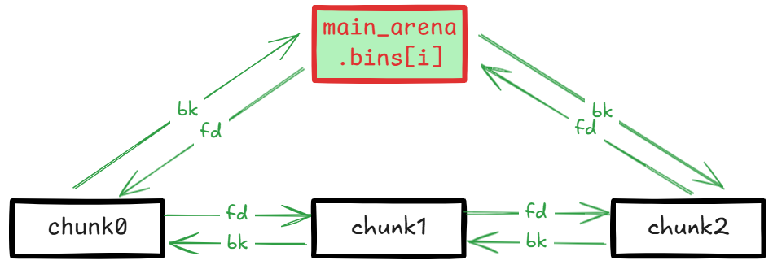
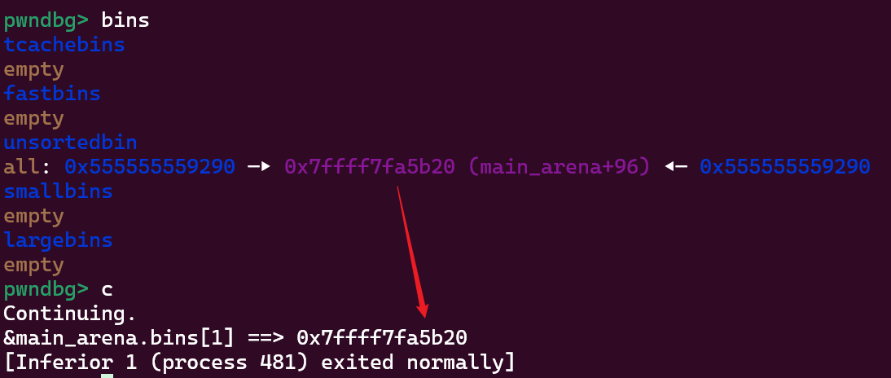

这篇记录下和 unsortedbin 相关的内容。未排序其实就是未归类，其他 bin 都是有固定大小或范围的，归类到对应 bin 上就相当于按大小排序了。 

之前在 [glibc malloc/free 源码分析](../glibc_malloc_free_source_analysis/) 中比较详细地分析过内存分配、释放的过程，malloc 按 exact-fit 优先原则进行分配，即优先找已有的相同大小 chunk，否则归类 unsortedbin 中的 chunk，同时再进行 exact-fit 匹配找到最合适的，归类后扔没有大小正好合适的就对稍大的 chunk 切割。

如果有 tcache，在归类过程中精确匹配到的 chunk 先存储到 tcache 里，到达阀值之后立即返回 chunk，如果没有 tcache 就立即返回 chunk。没有精确匹配的 chunk 会被分类到对应的 bin 上。

排除 tcache 的影响，unsorted chunk 只会被归类到 smallbin 或 larginbin 上，这块代码不多，直接贴代码看。

## 归类过程

这里贴的 2.27 版本代码。

### small chunk 归类过程

```cpp
while ((victim = unsorted_chunks (av)->bk) != unsorted_chunks (av))
{
    // ... (omitted)
    
    /* remove from unsorted list */
    unsorted_chunks (av)->bk = bck;
    bck->fd = unsorted_chunks (av);
    
    // ... (omitted)
    if (in_smallbin_range (size))
    {
      victim_index = smallbin_index (size);
      bck = bin_at (av, victim_index);
      fwd = bck->fd;
    }
    else
    {
        // ... large chunk (omitted)
    }
    
    mark_bin (av, victim_index);
    victim->bk = bck;
    victim->fd = fwd;
    fwd->bk = victim;
    bck->fd = victim;
    
    // ... (omitted)
    
#define MAX_ITERS       10000
  	if (++iters >= MAX_ITERS)
    	break;
}
    

```

没有什么特殊的，就是将 victim 链到 smallbin 上。

### large chunk 归类过程

```cpp
while ((victim = unsorted_chunks (av)->bk) != unsorted_chunks (av))
{
    // ... (omitted)

    /* remove from unsorted list */
    unsorted_chunks (av)->bk = bck;
    bck->fd = unsorted_chunks (av);

    // ... (omitted)
    if (in_smallbin_range (size))
    {
        // ... (omitted)
    }
    else
    {
        victim_index = largebin_index (size);
        bck = bin_at (av, victim_index);
        fwd = bck->fd;

        /* maintain large bins in sorted order */
        if (fwd != bck)
        {
            /* Or with inuse bit to speed comparisons */
            size |= PREV_INUSE;
            /* if smaller than smallest, bypass loop below */
            assert (chunk_main_arena (bck->bk));
            if ((unsigned long) (size)
                < (unsigned long) chunksize_nomask (bck->bk))
            {
                fwd = bck;
                bck = bck->bk;

                victim->fd_nextsize = fwd->fd;
                victim->bk_nextsize = fwd->fd->bk_nextsize;
                fwd->fd->bk_nextsize = victim->bk_nextsize->fd_nextsize = victim;
            }
            else
            {
                assert (chunk_main_arena (fwd));
                while ((unsigned long) size < chunksize_nomask (fwd))
                {
                    fwd = fwd->fd_nextsize;
                    assert (chunk_main_arena (fwd));
                }

                if ((unsigned long) size
                    == (unsigned long) chunksize_nomask (fwd))
                    /* Always insert in the second position.  */
                    fwd = fwd->fd;
                else
                {
                    victim->fd_nextsize = fwd;
                    victim->bk_nextsize = fwd->bk_nextsize;
                    fwd->bk_nextsize = victim;
                    victim->bk_nextsize->fd_nextsize = victim;
                }
                bck = fwd->bk;
            }
        }
        else
            victim->fd_nextsize = victim->bk_nextsize = victim;
    }

    mark_bin (av, victim_index);
    victim->bk = bck;
    victim->fd = fwd;
    fwd->bk = victim;
    bck->fd = victim;

    // ... (omitted)

    #define MAX_ITERS       10000
    if (++iters >= MAX_ITERS)
        break;
}
```

largebin 中的 chunk 都是已经按大小排好序的，`fd` 方向是大到小，`bk` 方向是小到大。large chunk 用到了 `fd_nextsize` 和 `bk_nextsize`，这两个指针是用来跳表用的，通过这两个指针可以快速跳过相同大小的 chunk 到达下一个大小的 chunk 位置。

largebin 头的 `bk` 指向的 chunk 是当前链表中最小的 chunk，如果需要插入的 chunk 大小比最小的还小，直接插入到 `bin` 和 `bin->bk` 中间。否则延 `fd_nextsize` 方向进行跳表遍历，即从大到小，找到合适的位置插入。

## 攻击利用

以 libc 2.27 版本为利用基础，新版本在后面分析。

### UAF 泄漏 libc

由于 bin 的结构：



bin 链表的头尾都是指向 `main_arena.bins[i]` 。`main_arena` 被静态存储在 libc 内存的 `.data` 段，所以如果存在 UAF，free 后打印头节点的 `bk` 或尾节点的 `fd` 即可得到 `main_arena` 地址，通过相对偏移即可计算出 libc 地址：

```cpp
#include <stdio.h>
#include <stdlib.h>

int main()
{
    // Allocate a large chunk to avoid tcache interference.
    char *p1 = (char *)malloc(0x430);
    printf("p1 chunk address: %p\n", p1-0x10);
    // Avoid to consolidating the large chunk with the top chunk during the free().
    malloc(0x90);
    asm("int3");
    // Free p1 chunk to unsortedbin
    free(p1);

    // fd/bk -> main_arena.bins[1]
    printf("&main_arena.bins[1] ==> %p\n", *((char **)p1));
}
```

这个代码中 `p1` 内存被释放后重用得到了 `main_arena.bins[1]` 地址：



### UAF 任意地址写

这种方式的利用点是 malloc 触发的 unsorted large chunk 归类过程，只有 large chunk 才可以，需要利用 chunk 插入时的 `bk_nextsize` 和 `fd_nextsize` 指向修正。有两种利用方式：

1. 在 unsorted chunk 大小比最小的 chunk 小时，会执行：

    ```cpp
    bck = fwd->bck

    victim->fd_nextsize = fwd->fd;
    victim->bk_nextsize = fwd->fd->bk_nextsize;
    fwd->fd->bk_nextsize = victim->bk_nextsize->fd_nextsize = victim;

    victim->bk = bck;
    victim->fd = fwd;
    fwd->bk = victim;
    bck->fd = victim;
    ```

    可使 `fwd->fd->bk_nextsize = fwd->fd->bk_nextsize->fd_nextsize = victim`、`fwd->bck->fd = victim`。这种情况 `fwd` 不可控，它永远指向 `main_arena.bin[1]`，所以只能是 `fwd->fd` 可控，即最大的 large chunk 可控时可实现将 unsorted chunk 地址写入 `fwd->fd->bk_nextsize + 0x20`。

2. 在 unsorted chunk 大小比最小的 chunk 大时，会执行：

    ```cpp
    bck = fwd->bck
    
    victim->fd_nextsize = fwd;
    victim->bk_nextsize = fwd->bk_nextsize;
    fwd->bk_nextsize = victim;
    victim->bk_nextsize->fd_nextsize = victim;
    
    victim->bk = bck;
    victim->fd = fwd;
    fwd->bk = victim;
    bck->fd = victim;
    ```

    可使 `fwd->fd->bk_nextsize = fwd->fd->bk_nextsize->fd_nextsize = victim`、`fwd->bck->fd = victim`。这种情况 `fwd` 指向前一个 large chunk，如果它可控即可实现将 unsorted chunk 地址写入 `fwd->bk_nextsize + 0x20` 和 `fwd->bck + 0x10`。
