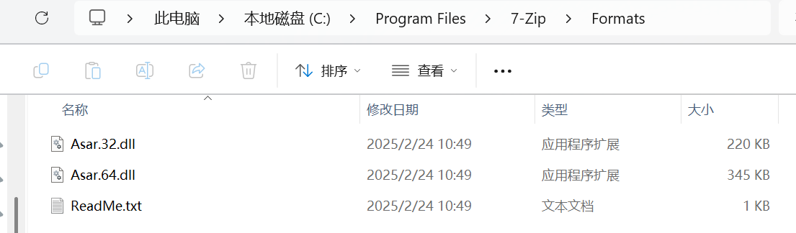
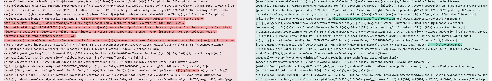
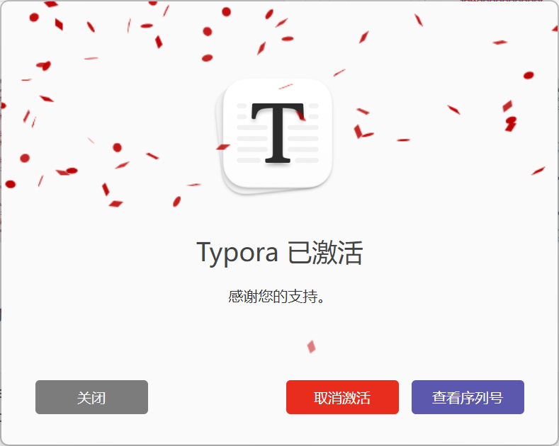

1. Locate and unpack the original `app.asar`

   There are three ways to unpack:

   1. Directly drag `app.asar` into VSCode to open it — this method doesn't require a Node.js environment but cannot repack

   2. Use the 7-zip asar plugin. Download the plugin from [here](https://www.tc4shell.com/en/7zip/asar/), place it in the `Formats` directory under the 7-zip installation path, then open `app.asar` with 7-zip. This method doesn't require Node.js and allows modifying files within the asar archive — recommended

      

   3. Install a `Node.js` environment and use the asar tool

       ```bash
       apt install nodejs
       npm install -g asar
       asar e ./app.asar ./app.asar.unpacked
       ```

       If unpacking reports an error about `main.node` not being accessible, copy one from the Typora directory to the path mentioned in the error.


   The extraction yields 2 files: `atom.js` and `package.json`. `atom.js` contains AES-encrypted base64 ciphertext that needs to be decrypted.

2. Decrypt `atom.js`

   AES encryption requires a KEY and IV. The `atom.js` encryption scheme is:

   - KEY is provided by `main.node`
   - IV is computed from the final `atom.js` length and the last byte of the file
   - The last byte does not participate in encryption
   - AES-256-CBC encrypted, then base64 encoded

   AES is symmetric — if you know the KEY and IV, simply reverse the process. The KEY is in `main.node`. In version 1.9.5, the extracted KEY is `0d8e841eb83ac8106208f45770bc39b9d8b8ab60b2fb4613284fb497b68b0c6a`. The original `atom.js` after base64 decoding has a total length of `140593`, with the last byte being `0x6a`. The IV is computed as `47a91ac73cfaa5af60e1e1d54301e848`. With all parameters ready, use [CyberChef](https://gchq.github.io/CyberChef/#recipe=From_Base64('A-Za-z0-9%2B/%3D',true,false)Take_bytes(0,140592,false)AES_Decrypt(%7B'option':'Hex','string':'0d8e841eb83ac8106208f45770bc39b9d8b8ab60b2fb4613284fb497b68b0c6a'%7D,%7B'option':'Hex','string':'47a91ac73cfaa5af60e1e1d54301e848'%7D,'CBC','Raw','Raw',%7B'option':'Hex','string':''%7D,%7B'option':'Hex','string':''%7D)&ieol=CRLF) to decrypt `atom.js`.

3. Modify `atom.js`

   

4. Re-encrypt `atom.js`

   After modification, first encrypt with an arbitrary IV to get the encrypted length `139968`. If the ciphertext is appended with `0xb7`, the new length becomes `139969`. Use these two values to recalculate the IV, yielding `b820f7c793af30da91e80c12c6b83395`. Re-encrypt `atom.js` with the KEY and new IV, then append `\xb7`. Encryption can be done using `openssl` or [CyberChef](https://gchq.github.io/CyberChef/#recipe=AES_Encrypt(%7B'option':'Hex','string':'0d8e841eb83ac8106208f45770bc39b9d8b8ab60b2fb4613284fb497b68b0c6a'%7D,%7B'option':'Hex','string':'b820f7c793af30da91e80c12c6b83395'%7D,'CBC','Raw','Raw',%7B'option':'Hex','string':''%7D)Find_/_Replace(%7B'option':'Regex','string':'$'%7D,'%5C%5Cxb7',true,false,false,true)To_Base64('A-Za-z0-9%2B/%3D')&oenc=65001&ieol=CRLF):

   ```bash
   openssl enc -aes-256-cbc -in ./atom.de.js -out atom.js -iv b820f7c793af30da91e80c12c6b83395 -K 0d8e841eb83ac8106208f45770bc39b9d8b8ab60b2fb4613284fb497b68b0c6a
   printf '\xb7' >> atom.js
   ```

5. Repack `app.asar`

   Place `atom.js`, `main.node`, and `package.json` into a directory (e.g., `new`), then use the asar tool to pack:

   ```bash
   asar pack ./new app.asar --unpack "main.node" 
   ```

6. Replace the original `app.asar` and restart

   

Locating the `app.asar` decryption code in `main.node`:

> Search for the string `app.asar`. The location near `indexOf` is the target. After some NAPI function calls, execution jumps to another function that performs the decryption — the `% 256` operation within that function is essentially computing the IV.
> 
> Key locations in version 1.9.5:
> 
> - `sub_180010BF0`: `app.asar` compilation
> - `sub_180004647`: `sub_18000B480` wrapper
> - `sub_18000B480`: `atom.js` decryption
> - `sub_180001992`: IV generation — 3 parameters: array to receive the IV, pseudo-random seed computed from the last byte and length, and generation length
> - `sub_1800044DF`: AES decryption
> 

IV computation:

> IV is generated by directly calling `sub_180001992` in `main.node`. ([code snippet](https://gist.github.com/0xlane/00e2749be0e7df34fa931715bf2958c3))

Reference: [Typora Latest Version Reverse Analysis](https://www.52pojie.cn/thread-1990569-1-1.html)
