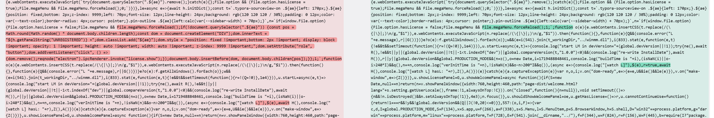
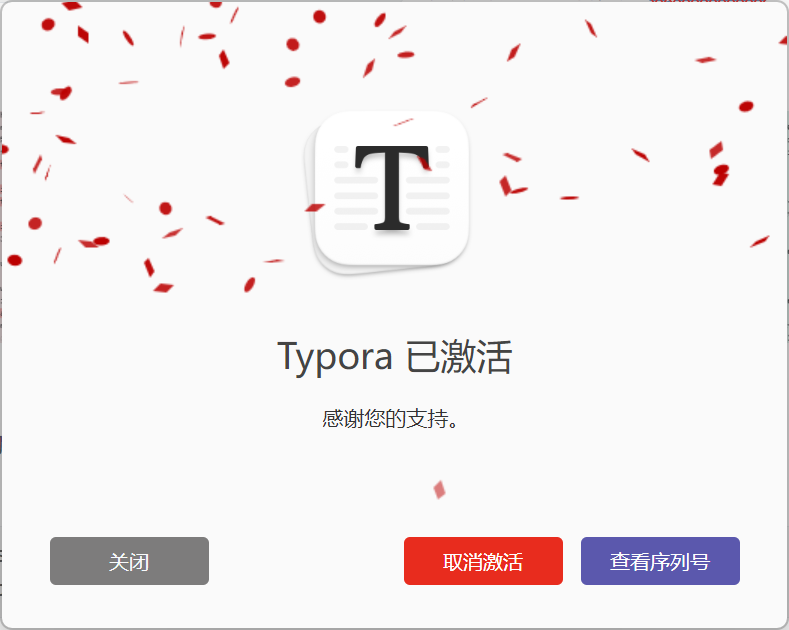

1. 找到原始的 `app.asar` 解包

   直接将 `app.asar` 拖到 vscode 里打开，或通过下面的方式：

   ```bash
   apt install nodejs
   npm install -g asar
   asar e ./app.asar ./app.asar.unpacked
   ```

   如果解包时报 `main.node` 打不开的报错，就从 typora 目录里复制一份放到报错中提到的对应位置。

   解包成功的话不算 `main.node` ，解出 2 个文件：`atom.js` 和 `package.json`。

   `atom.js` 是 AES 加密的 base64 密文，需要对 `atom.js` 解密。

2. 解密 `atom.js`

   AES 加密需要 KEY 和 IV，`atom.js` 加密方式是：

   - KEY 由 `main.node` 提供
   - IV 由最终 `atom.js` 长度和文件内容最后一个字节计算得来
   - 文件最后一个字节不参与加密
   - AES-256-CBC 加密后通过 base64 编码

   AES 是对称加密的，如果知道 KEY 和 IV 就按这个思路逆向解密即可。KEY 在 `main.node` 中，在 1.9.5 版本提取出的 KEY 是 `0d8e841eb83ac8106208f45770bc39b9d8b8ab60b2fb4613284fb497b68b0c6a`，原始 `atom.js` base64 解码后的总长度为 `140593`，最后 1 个字节 `0x6a`，IV 通过计算得出 `47a91ac73cfaa5af60e1e1d54301e848`。参数都齐了之后，用 [CyberChef](https://gchq.github.io/CyberChef/#recipe=From_Base64('A-Za-z0-9%2B/%3D',true,false)Take_bytes(0,140592,false)AES_Decrypt(%7B'option':'Hex','string':'0d8e841eb83ac8106208f45770bc39b9d8b8ab60b2fb4613284fb497b68b0c6a'%7D,%7B'option':'Hex','string':'47a91ac73cfaa5af60e1e1d54301e848'%7D,'CBC','Raw','Raw',%7B'option':'Hex','string':''%7D,%7B'option':'Hex','string':''%7D)&ieol=CRLF) 解密得到 `atom.js`。

3. 修改 `atom.js`

   

4. 重新加密 `atom.js`

   修改后先随便写个 IV 加密得到加密后长度 `139968`，假如加密后的密文向后追加的 `0xb7`，新长度就是 `139969`， 使用这两个值重新计算 IV，得到 `b820f7c793af30da91e80c12c6b83395`，使用 KEY 和新 IV 重新加密 `atom.js` 后追加 `\xb7`，加密可以使用 `openssl` 命令或 [CyberChef](https://gchq.github.io/CyberChef/#recipe=AES_Encrypt(%7B'option':'Hex','string':'0d8e841eb83ac8106208f45770bc39b9d8b8ab60b2fb4613284fb497b68b0c6a'%7D,%7B'option':'Hex','string':'b820f7c793af30da91e80c12c6b83395'%7D,'CBC','Raw','Raw',%7B'option':'Hex','string':''%7D)Find_/_Replace(%7B'option':'Regex','string':'$'%7D,'%5C%5Cxb7',true,false,false,true)To_Base64('A-Za-z0-9%2B/%3D')&oenc=65001&ieol=CRLF)：

   ```bash
   openssl enc -aes-256-cbc -in ./atom.de.js -out atom.js -iv b820f7c793af30da91e80c12c6b83395 -K 0d8e841eb83ac8106208f45770bc39b9d8b8ab60b2fb4613284fb497b68b0c6a
   printf '\xb7' >> atom.js
   ```

5. 重新打包 `app.asar`

   将 `atom.js`、`main.node`、`package.json` 都放到一个目录里，假如是 `new` 目录，使用 asar 工具打包：

   ```bash
   asar pack ./new app.asar --unpack "main.node" 
   ```

6. 覆盖原始 `app.asar` 后，重新启动即可

   

定位 `main.node` 中关于 `app.asar` 解密的位置：

> 搜索字符串 `app.asar`，附近有 `indexOf` 的位置就是了，在调用完一些 napi 函数后会跳到另外一个函数开始解密，这个函数里 `% 256` 的位置基本就是在计算 IV。
> 
> 这里给出 1.9.5 版本的一些关键位置：
> 
> - `sub_180010BF0`：`app.asar` 编译
> - `sub_180004647`：`sub_18000B480` wrapper
> - `sub_18000B480`：`atom.js` 解密
> - `sub_180001992`：IV 生成，3个参数分别是接收 IV 的数组，最后一个字节和长度计算得到的伪随机数种子，生成长度
> - `sub_1800044DF`：AES 解密
> 

IV 计算：

> IV 直接调用 `main.node` 的 `sub_180001992` 生成。([code snippet](https://gist.github.com/0xlane/00e2749be0e7df34fa931715bf2958c3))

参考：[Typora最新版逆向分析](https://www.52pojie.cn/thread-1990569-1-1.html)
