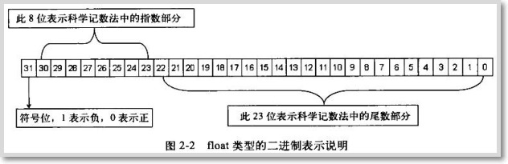
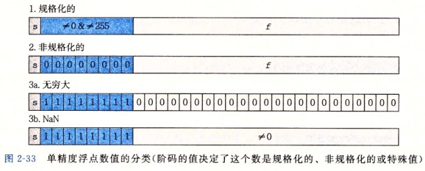
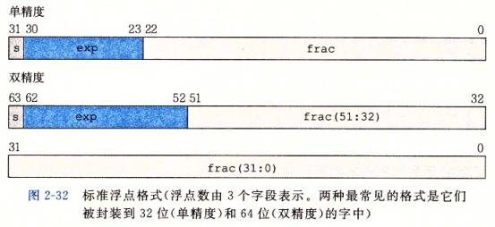
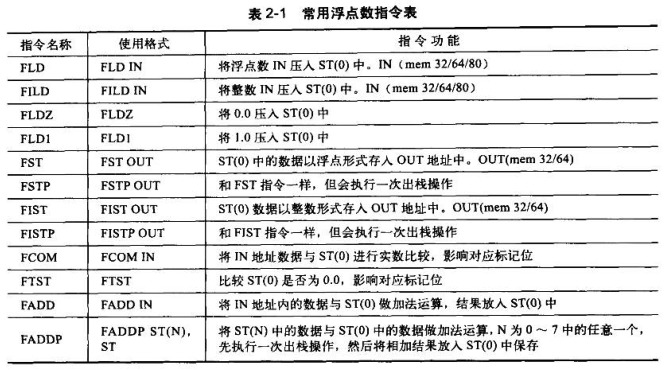
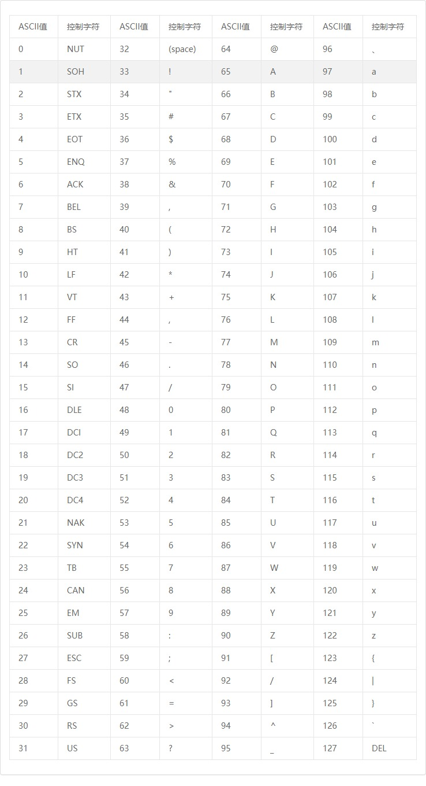
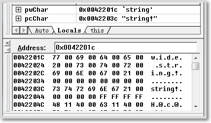

This section is summarized from "C++ Disassembly and Reverse Analysis", with floating-point content drawn from Chapter 2 of "Computer Systems: A Programmer's Perspective". Refer to the respective chapters in these books for detailed content.

## Integer Types

In 32-bit computers, data is stored in DWORD (double word) format. Different integer types have different storage mechanisms. For example, unsigned integers can represent values twice as large as signed integers, and the representation of negative and positive numbers differs in signed integers.

Regardless of whether they are signed or unsigned, values are stored in [little-endian](https://en.wikipedia.org/wiki/Endianness#Little-endian) format in memory — the high byte is placed at a higher address and the low byte at a lower address. Note that this is on a byte-by-byte basis, not bit-by-bit.

### Unsigned Integers

Unsigned integers are represented by the `unsigned int` keyword in C++, occupying 4 bytes. All 32 bits represent the numeric value, with a representable range of `0x00000000~0xFFFFFFFF`, or `0~4294967295` in decimal.

When an unsigned integer requires fewer than 32 bits, the remaining high bits are filled with zeros until the full 4-byte memory space is occupied.

Since every bit of an unsigned integer represents a numeric value, unsigned integers are stored in memory as their true values.

### Signed Integers

Signed integers are represented by the `int` keyword in C++, occupying 4 bytes. The most significant bit indicates the sign — it's called the sign bit. A 0 in the MSB means positive; a 1 means negative. Therefore, only 31 bits are used for the numeric value, with a representable range of `0x80000000~0x7FFFFFFF`, or `-2147483648~2147483647` in decimal.

Observant readers may notice a discrepancy: if the MSB is the sign bit, then 0x80000000 in binary is `1000 0000 0000 0000 0000 0000 0000 0000` — shouldn't that be `-0`?

Let's first explain how negative numbers are stored in memory. Negative numbers use two's complement representation. Both one's complement and two's complement are derived from the original code (sign-magnitude representation). The original code is the unmodified binary with the sign bit on the left. Two's complement is obtained by inverting all bits of the absolute value's binary representation and adding 1. Modern computers use two's complement for negative numbers because it eliminates the need for different computation methods for addition and subtraction based on the sign of the numbers.

Using two's complement, ignoring 0x80000000, the smallest negative number would be 0x80000001. Inverting and adding 1 gives the original code 0x7FFFFFFF, so 0x80000001 represents -2147483647.

Now looking at 0x80000000 — it could represent either -0 or 0x80000001 - 1. Since there's no need for two representations of zero, 0x80000000 is defined as 0x80000001 - 1, i.e., -2147483648.

In summary, the positive range is `0x00000000~0x7FFFFFFF`, and the negative range is `0x80000000~0xFFFFFFFF`.

## Floating-Point Types

Floating-point type storage can be divided into two approaches:

1. Fixed-point representation
   - The decimal point position is fixed. If 4 bytes are used to store a real number, 2 bytes store the integer part and 2 bytes store the fractional part.
   - While computationally efficient, it's inflexible — data exceeding 2 bytes cannot be stored.
2. Floating-point representation
   - The decimal point position is not fixed. Several binary bits indicate the decimal point position (the "exponent field"), while the remaining bits represent the "significand field" and "sign field". During computation, the exponent field is extracted, then the significand is split to obtain the true value. For example: 655.35 — the exponent field stores 10^(-2), the significand stores 65535, and the true value is computed at runtime.
   - The pros and cons are the opposite of fixed-point: less efficient but more flexible.

For modern computers, with continuous CPU improvements, floating-point representation has become standard. Fixed-point storage can only be found on some embedded devices today.

In C++, there are two ways to represent floating-point numbers: `float` uses 4 bytes, and `double` uses 8 bytes. Floating-point operations don't use general-purpose registers; instead, they use the floating-point registers provided by the floating-point coprocessor. In VC++ 6.0, the floating-point registers must be initialized before using floating-point numbers, otherwise errors occur. For example:

```cpp
int main(void)
{
    int nInt = 0;
    // In VC++ 6.0, entering a decimal will cause an error
    // because the floating-point registers haven't been initialized
    scanf("%f", &nInt);
    return 0;
}
```

If you define a floating-point variable anywhere in the code, the floating-point registers get initialized and the error won't occur.

Here's another code snippet — observe the output:

```cpp
#include <stdio.h>
void main(void){
    int num=9;
    float* pFloat=(float*)&num;
    printf("num value: %d\n",num);
    printf("*pFloat value: %f\n",*pFloat);
    *pFloat=9.0;
    printf("num value: %d\n",num);
    printf("*pFloat value: %f\n",*pFloat);
}
```

Output:

```cpp
num value: 9
*pFloat value: 0.000000
num value: 1091567616
*pFloat value: 9.000000
```

The results seem completely counterintuitive — why is there such a huge difference between the float and integer representations? To understand this, you must understand how floating-point numbers are represented internally in computers.

### Floating-Point Encoding

#### IEEE Encoding of float Type

The float type occupies 4 bytes (32 bits) in memory. The highest bit represents the sign, 8 bits represent the exponent, and the remaining bits represent the mantissa (significand), as shown below:



To convert a single-precision float to IEEE standard encoding, scientific notation is needed. For example, to store 12.25f in memory, first convert it to binary: 1100.01, then express it in scientific notation as 1.10001 << 3, i.e., shift the decimal point right by 3 positions to the highest 1-bit. So the exponent is 3, the sign is 0 (positive), and the significand is 110001. The formula is:

```cpp
V = (-1)*S*(M<<E)
```

Where V is the float, S is the sign (0 or 1), M is the mantissa (significand), and E is the exponent.

Since E in scientific notation can be negative, E cannot be stored directly in the computer. E uses 8 binary bits with a range of `0~255`. To accommodate negative values, IEEE 754 specifies that the midpoint 127 is treated as zero — `0~126` represents negative values, and `127~255` represents non-negative values.

Therefore, for 12.25f with exponent 3, the stored value is 127 + 3 = 130 (offset from the bias point), which is 1000 0010 in binary. When extracting the exponent, the reverse operation yields 3.

Additionally, the integer part of the significand M is always 1, so only the fractional part is stored to save one significant digit. In a 32-bit float, 23 bits represent M. With the leading 1 omitted, this effectively stores 24 significant digits.

In conclusion, the binary representation of 12.25f is: `0 10000010 10001000000000000000000`

- Sign bit: 0
- Exponent: 1000 0010
- Mantissa: 1000 1000 0000 0000 0000 000

Converting to hexadecimal: 0x41440000. In little-endian memory storage: `00 00 44 41`.

There are three cases for E:

(1) E is neither all zeros nor all ones. This is the normal representation. The floating-point number follows the rules above — subtract 127 from E's stored value (range: `-126~127`) to get the actual exponent, then prepend a leading 1 to the significand M. In this case, M is always a decimal between `1~2`. To represent 0, see case 2.

(2) E is all zeros. This is a denormalized representation. M is a decimal between `0~1`, and the actual exponent E is `1-127=-126`. The extra 1 compensates for the removed leading 1 in the mantissa, making it 0.xxxxxx. This case represents ±0.0 and very small numbers close to 0.0.

(3) E is all ones. These are special values. If M is all zeros, it represents ±infinity (sign determined by S). If M is not all zeros, it represents NaN (Not a Number).



### IEEE Encoding of double Type

The conversion process for double is the same as float, just with greater precision:



In double, the highest bit is the sign bit, followed by 11 bits for the exponent, and the remaining 52 bits for the mantissa. The conversion follows the same pattern as float.

### Basic Floating-Point Instructions

As mentioned earlier, floating-point numbers use dedicated floating-point registers rather than general-purpose registers. Therefore, floating-point operations have their own instruction set. Common floating-point instructions are listed below, where IN indicates operand push and OUT indicates operand pop:



Floating-point instructions all begin with `F`. There are also instructions similar to integer operations with an `F` prefix, such as `FSUB`, `FSUBP`, etc.

The floating-point register file is implemented as an 8-slot stack, designated ST(0) through ST(7). Each register is 8 bytes. ST(0) is the stack top. On push, data in ST(0) shifts toward ST(7). When the register file is full, pushing again causes ST(7)'s data to be discarded.

The following code demonstrates floating-point instruction usage. Compiled in VC++ 6.0 with optimizations disabled, this example converts int to float:

```cpp
#include <stdio.h>
void main(int argc){
    float fFloat = (float)argc;
    printf("%f\n", fFloat);
}
```

The resulting assembly:

```asm
00410940       push ebp
00410941       mov ebp,esp
00410943       push ecx
00410944       fild dword ptr ss:[ebp+0x8]       ; Convert integer at ebp+8 to float, push to FPU stack (variable argc)
00410947       fst dword ptr ss:[ebp-0x4]        ; Store float to ebp-4 in IEEE format (variable fFloat)
0041094A       sub esp,0x8                       ; Allocate double-sized space on stack
0041094D       fstp qword ptr ss:[esp]           ; float must be converted to double for variadic functions, store to esp
00410950       push ReverseT.00418E74            ; "%d\n"
00410955       call ReverseT.00401040            ; printf("%d\n", a)
0041095A       add esp,0xC                       ; __cdecl convention, caller cleans stack
0041095D       mov esp,ebp
0041095F       pop ebp                        
00410960       retn
```

Although float occupies 4 bytes, it's always processed as 8 bytes. When float is passed as a variadic function argument, it must be converted to double, as seen with printf() above.

The following code demonstrates converting float to int using __ftol:

```cpp
void main(int argc){
    float fFloat = (float)argc;
    printf("%f\n", fFloat);
 
    argc = (int)fFloat;
    printf("%d\n", argc);
}
```

Assembly:

```asm
;;; Code omitted, same as above ;;;;
0041095D       fld dword ptr ss:[ebp-0x4]        ; Load data at ebp-4 into FPU register (variable fFloat)
00410960       call ReverseT.00410910            ; Call __ftol
00410965       mov dword ptr ss:[ebp+0x8],eax    ; Store converted result to ebp+8 (variable argc)
00410968       mov eax,dword ptr ss:[ebp+0x8]    ; Following is the printf call
0041096B       push eax                         
0041096C       push ReverseT.00418E78
00410971       call ReverseT.00401040
00410976       add esp,0x8
```

When a floating-point number is passed as a parameter, it cannot be pushed onto the stack with PUSH, because PUSH only handles 4 bytes while floating-point numbers are processed as 8 bytes — this would cause 4 bytes of data loss. As shown in the examples above, stack space is typically allocated via SUB, then the FSTP instruction is used to place data onto the stack.

In the code above, converting int to float simply requires pushing the integer into the FPU register and retrieving it. However, converting float to int requires the __ftol function because the FPU register is 4 bytes larger than general-purpose registers.

When using printf to output a floating-point number as an integer, the result is completely wrong. This is because printf interprets the corresponding argument as 4-byte data in two's complement when outputting as an integer — not only is the encoding scheme incorrect, but 4 bytes of data are also lost. When outputting as a float, the argument is treated as 8-byte data interpreted with IEEE floating-point encoding.

The same applies to floating-point return values — data must first be placed into the FPU register, then retrieved after the function call:

```cpp
#include <stdio.h>
 
float GetFloat()
{
    return 12.05f;
}
 
void main(int argc){
    float fFloat = GetFloat();
    printf("%f\n", fFloat);
}
```

Assembly:

```asm
0040101B       push ebp
0040101C       mov ebp,esp
0040101E       push ecx
0040101F       call ReverseT.0040100A                   ; Call GetFloat
 
;;;;;;;;;;;;;;;call 0040100A;;;;;;;;;;;;;;;;
00401010       push ebp
00401011       mov ebp,esp
00401013       fld dword ptr ds:[0x416344]              ; Load float into FPU register
00401019       pop ebp                           
0040101A       retn
;;;;;;;;;;;;;;;end 0040100A;;;;;;;;;;;;;;;;;
 
00401024       fst dword ptr ss:[ebp-0x4]               ; Retrieve from FPU register to ebp-4 (variable fFloat)
00401027       sub esp,0x8                              ; Call printf
0040102A       fstp qword ptr ss:[esp]
0040102D       push ReverseT.00418A30                   ; "%f\n"
00401032       call ReverseT.00401040
00401037       add esp,0xC
0040103A       mov esp,ebp
0040103C       pop ebp                              
0040103D       retn
```

## Characters and Strings

A string is a sequence of characters. In C++, `\0` typically marks the end of a string. In memory, reading a 0 indicates string termination, where the size of the 0 depends on the character encoding (i.e., determined by the encoding scheme).

### Character Encoding

Common encodings fall into two categories: ASCII and Unicode. ASCII can represent only 256 characters using 1 byte. Unicode is a universal encoding with 65,536 characters using 2 bytes. The first 256 Unicode characters are compatible with ASCII. For example, the character 'a' is 0x61 in ASCII and 0x0061 in Unicode.

Here's an ASCII table from the web:



The table shows that ASCII doesn't include Chinese characters. However, trying printf in VC++ 6.0:

```cpp
char* s = "汉子文化";
printf("%s\n", s);
```

Based on the table, the result should be "?????", but instead:

```plain
汉子文化
Press any key to continue
```

It displays correctly because `char` indeed cannot store Chinese characters — the correct display occurs because printf hands the string to the system (the CMD console), which uses GBK encoding and can parse Chinese characters.

Modifying the program to store a Chinese character in a single char:

```cpp
char s = '汉';
printf("%c\n",s);
```

Output:

```plain
?
Press any key to continue
```

This demonstrates that using `char` to store Chinese characters is incorrect.

In C++ Windows development, `char` defines ASCII-encoded characters, while `wchar_t` stores Unicode-encoded characters.

### String Storage Methods

Strings are stored consecutively in memory. When a string is defined, the variable stores the address of the first character. To determine a string's size, you need the start and end addresses. There are two approaches for determining the end address: one stores the string length in n bytes before the string, the other uses a special terminator character at the end. Each has its pros and cons.

- Storing the total length
  
  Trading space for time.

  This approach is common in communication protocols. For example, the SOCKS protocol uses this method to transmit domain name information.
- Terminator character
  
  Trading time for space.

  This is the more common approach in software development. For instance, C++ uses `\0` as the terminator.

For string content storage, ASCII encoding uses 1 byte per character, while Unicode uses 2 bytes per character. Unicode characters are also called wide characters, which is why Windows API functions prefixed with 'w' are typically designed for wide characters (e.g., wprintf, wsprintf).

Using the VC++ 6.0 debugger, you can observe the difference between char and wchar_t in memory:

```cpp
#include <cstdio>
#include <cwchar>

int main(void)
{
    char* pcChar = "string!";
    wchar_t* pwChar = L"wide string!";
    return 0;
}
```

Two types of string storage in memory:



Here, pcChar starts at address 0042201Ch with each byte representing one character, while pwChar starts at address 0042203Ch with every two bytes representing one character.

If you want to output wide-character Chinese text in VC++ 6.0, use the setlocale function to configure locale information matching the current system settings (viewable in CMD properties):

```cpp
#include <cstdio>
#include <cwchar>
#include <clocale>

int main()
{
    setlocale(LC_ALL, ".936");

    wchar_t c = L'汉';
    wprintf(L"%lc\n", c);
    return 0;
}
```

## Boolean Type

Essentially just 0 and 1 — 0 means false, non-zero means true. The boolean type occupies 1 byte in C++ and is stored the same way as integers. It can be substituted with char, int, byte, etc.

## Addresses, Pointers, and References

- Address
  
  Generally refers to a logical memory address. For addressing modes, refer to assembly register knowledge. In C++, addresses are commonly represented in hexadecimal. The address-of operator `&` can be used to get a variable's address. Only variables can have their address taken — constants (including const-qualified values and immediates) cannot.
- Pointer
  
  Pointers are defined using `TYPE *`, where TYPE is the data type. A pointer is itself a data type with a fixed size not determined by TYPE. A pointer variable merely stores a variable's address. The type name in the definition enables proper interpretation of the data stored at that address.

  Every array variable name points to the first element's address, so array names are also pointer types.
- Reference
  
  Besides taking addresses, `&` can also create a reference (alias) for a variable. The definition syntax is similar to pointers: `TYPE &`. References must be initialized at definition and cannot be defined standalone.

### Relationship Between Addresses and Pointers

An address represents a memory location number — the position of a variable in memory — while a pointer is a variable that stores an address.

(108 characters omitted here.)

### Pointer Arithmetic

Pointers only support addition and subtraction. Pointers exist to store and interpret data addresses — other operators serve no purpose.

Pointer addition is used for address offset. Adding 1 to a pointer doesn't add 1 to the stored address but rather adds based on the type size. The following code demonstrates pointer traversal:

```cpp
#include <stdio.h>

int main()
{
    int array[] = {1,2,3,4,5};
    int * piArray = array;
    int i = 0;

    for(i = 0; i < 5; i++)
    {
        printf("%d\n", *piArray);
        piArray += 1;
    }
    return 0;
}
```

Compiled in VC++ 6.0 with the "Maximize speed" optimization option:

```asm
00401010       sub esp,0x14                        ; Allocate array space
00401013       push esi                        
00401014       push edi                        
00401015       mov edi,0x5                         ; Variable i, count-down loop
0040101A       mov dword ptr ss:[esp+0x8],0x1      ; Create array on stack
00401022       mov dword ptr ss:[esp+0xC],0x2  
0040102A       mov dword ptr ss:[esp+0x10],0x3 
00401032       mov dword ptr ss:[esp+0x14],0x4 
0040103A       mov dword ptr ss:[esp+0x18],edi 
0040103E       lea esi,dword ptr ss:[esp+0x8]      ; Point esi to array (variable piArray)
00401042       mov eax,dword ptr ds:[esi]          ; Call printf for output
00401044       push eax                          
00401045       push ReverseT.00414A30          
0040104A       call ReverseT.00401080          
0040104F       add esp,0x8                     
00401052       add esi,0x4                         ; Add by pointer type size, not 1
00401055       dec edi                         
00401056       jnz short ReverseT.00401042     
00401058       pop edi                           
00401059       xor eax,eax                       
0040105B       pop esi                           
0040105C       add esp,0x14                    
0040105F       retn
```

From the above, we can see that pointer addition is type-dependent, which is why adding two pointers together is meaningless.

### References

Some say references were invented after pointers as an alternative access method. References are implemented based on pointers and simplify pointer operations. This can be verified with the following code:

```cpp
#include <stdio.h>

int main()
{
    int iVar;
    scanf("%d", &iVar);
    printf("%d", iVar);
    return 0;
}
```

Compiled in VC++ 6.0 with "Maximize speed" optimization:

```asm
00401010       push ecx
00401011       lea eax,dword ptr ss:[esp]          ; Pointer to iVar
00401015       push eax                         
00401016       push ReverseT.00414A30
0040101B       call ReverseT.0040F890              ; Call scanf
00401020       mov ecx,dword ptr ss:[esp+0x8]
00401024       add esp,0x8
00401027       push ecx
00401028       push ReverseT.00414A30
0040102D       call ReverseT.00401080              ; Call printf
00401032       xor eax,eax                        
00401034       add esp,0xC
00401037       retn
```

This demonstrates that both references and pointers use the LEA instruction — they are essentially the same thing.

## Constants

Constants exist before program execution and are compiled directly into the executable. When the program starts, they are loaded into memory. This data is typically stored in the constant data section (.rdata/.idata), which lacks write permissions, so any attempt to modify constants will cause a program exception.

(108 characters omitted here.)

-------------

**Disclaimer:** Some of the code above is original, some is from the referenced books. All code has been tested. If something seems wrong, please try it yourself first. Some illustrations are from the books, with a few from the internet.
