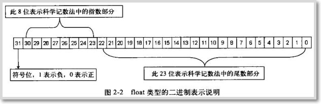
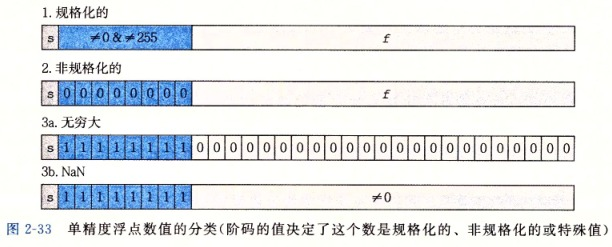
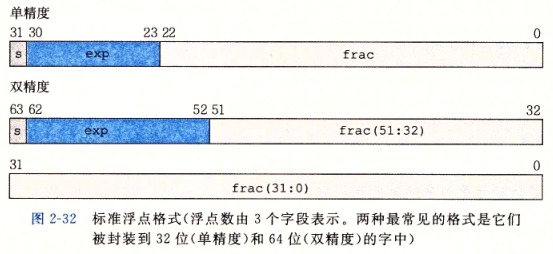
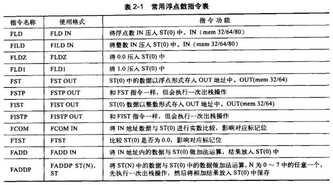
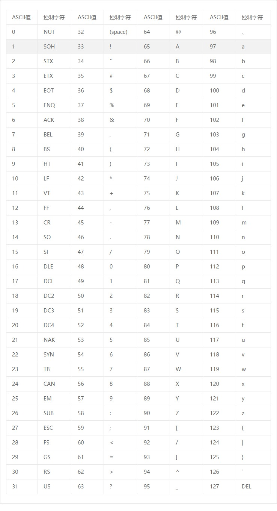
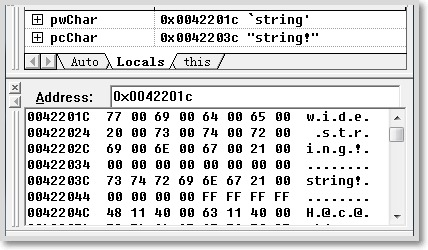

本节内容根据《C++反汇编与逆向分析技术揭秘》一书总结，其中还有穿插《深入理解计算机系统》第二章浮点数的内容，详细内容参见书中相关章节。

<!--more-->

## 整数类型

在32位计算机中，数据都是以DWORD（双字）的形式存储的。对于不同的整数类型有不同的存储机制，例如无符号整数的可表示的数值大小要比有符号整数大一倍，有符号整数中负数和正数的表示是不一样的。
不管是有符号还是无符号，在计算机内存中存储的时候都是“[小端序](https://zh.wikipedia.org/zh-hans/%E5%AD%97%E8%8A%82%E5%BA%8F#%E5%B0%8F%E7%AB%AF%E5%BA%8F)”形式存放的，即高字节放在高地址，低字节放在低地址，注意是以字节为单位，而不是以1个位。

### 无符号整数

无符号整数在C++中用unsigned int关键字表示，占4字节，32位上的每一位都表示数值，可表示数值范围为：`0x00000000~0xFFFFFFFF`，十进制表示为：`0~4294967295`。

当无符号整型不足32位时，用0来填充剩余高位，直到占满4字节内存空间为止。

因为无符号整数每一位都是用来表示数值的，所以无符号整数在内存中都是以真值的形式存放的。

### 有符号整数

有符号整数在C++中用int关键字表示，占4字节，有符号整数最高位用来表示符号，被称为符号位，最高位为0表示正数，反之表示负数。故被用来表示数值的只有31位，其表示的数值范围为：`0x80000000~0x7FFFFFFF`，对应二进制表示为：`-2147483648~2147483647`。

对于细心的同学可能发现了一个问题，最高位是符号位，0x80000000对应的二进制为 `1000 0000 0000 0000 0000 0000 0000 0000`，这么一看不应该是 `-0` 吗。

这里先说一下内存中负数是怎么存储的，负数的存储采用了补码的形式，不论是补码还是反码都是根据原码发展而来的，原码是未经更改的加上左边符号位的二进制码，而补码是数字的绝对值的原码基础上取反加1得到的，现代计算机中用补码表示负数，其优点是可以在加法或减法处理中，不需因为数字的正负而使用不同的计算方式。

按照补码的形式存储负数，如果不考虑0x80000000，最小的负数应该是0x80000001，取反加1后可得到原码为0x7FFFFFFF，故0x80000001表示 -2147483647。

这时候再看 0x80000000 ，他既可以表示 -0，又可以表示 0x80000001 - 1，因为没必要存在两个0的表示形式，所以规定 0x80000000 表示的是 0x80000000 -1 ，即 -2147483648。

综上，正数范围为 `0x00000000~0x7FFFFFFF`，负数范围为 `0x80000000~0xFFFFFFFF`。

## 浮点数类型

浮点数类型的存储方式可以分为两种：

1. 定点实数存储方式
   - 小数点的位置固定。如果用4字节存储实数，2字节用来存储整数部分，2字节用来存储小数部分。
   - 虽然运算效率高，但是不灵活，如果数据超出2字节就无法存储了。
2. 浮点实数存储方式
   - 小数点的位置不固定。利用几个二进制位表示小数点位置，称为“指数域”，剩下的表示“数据域”和“符号域”。在计算的时候，先取出指数域，然后分割数据域得到真值，例如：655.35，指数域存储10的-2次方，数据域存储65535，运算的时候拿出来算一下就得到了真值。
   - 这种方式的优缺点和定点恰相反，效率低但是灵活。

对于现代计算机，CPU的不断升级革新，浮点实数存储方式已经普及，只有一些嵌入式设备上还能看到定点存储。

在 C++ 中，有两种表示浮点数的方式，“float”用4字节表示浮点数，“double”用8字节表示浮点数。浮点数的运算不会用到通用寄存器，而是通过浮点协处理器提供的浮点寄存器对浮点数进行运算处理。VC++ 6.0 中在使用浮点数前，都要对浮点寄存器进行初始化，然后才能正常运行。未初始化的时候会报错，例如：

```cpp
int main(void)
{
    // 未使用到浮点数情况下，
    int nInt = 0;
    // 在VC++ 6.0 中输入小数会报错，因没有初始化浮点寄存器
    scanf("%f", &nInt);
    return 0;
}
```

如果在代码中任意位置定义一个浮点类型的变量，浮点寄存器初始化，就不会报错了。

再贴一段代码，看看运行结果：

```cpp
#include <stdio.h>
void main(void){
    int num=9; /* num是整型变量，设为9 */
    float* pFloat=(float*)&num; /* pFloat表示num的内存地址，但是设为浮点数 */
    printf("num的值为：%d\n",num); /* 显示num的整型值 */
    printf("*pFloat的值为：%f\n",*pFloat); /* 显示num的浮点值 */
    *pFloat=9.0; /* 将num的值改为浮点数 */
    printf("num的值为：%d\n",num); /* 显示num的整型值 */
    printf("*pFloat的值为：%f\n",*pFloat); /* 显示num的浮点值 */
}
```

运行结果如下：

```cpp
num的值为：9
*pFloat的值为：0.000000
num的值为：1091567616
*pFloat的值为：9.000000
```

完全不理解这个结果是怎么回事，为什么浮点数和整数结果差别这么大？要理解这个结果，一定要搞懂浮点数在计算机内部的表示方法。

### 浮点数的编码方式

#### float类型的IEEE编码

float类型在内存中占4字节（32位）。最高1位用于表示符号，8位用于表示指数，其余用于表示尾数（有效数位），如图所示。



单精度浮点数转换为IEEE规定的标准编码，需要借助科学计数法。例如将12.25f保存到内存中，需要先转换成对应的二进制数 1100.01，利用科学计数法表示就是 1.10001 << 3，即小数点右移3位到最高为1的位，所以指数为3，符号为0（正），数值110001，总结出公式如下：

```cpp
V = (-1)*S*(M<<E)
```

其中 V 是浮点数，S是符号数（0或1），M为尾数（有效数位），E为指数位。

科学计数法中的E是可以为负数的，所以E不能直接存入计算机中。E用8位二进制数表示，可表示范围为`0~255`，为了能够满足负数的情况，IEEE 754规定，要把中间数 127 当零点，即`0~126`表示负数，`127~255`表示非负数。

所以，12.25f的指数位为 3，存入计算机时要以127为零点向右偏移3，即127+3=130，转换为二进制为 1000 0010。当取出指数时再反向运算得到3即可。

并且浮点数的有效数位M的整数部分永远都是1，所以只保留小数部分以节省1位有效数字。在32位浮点数中，23位表示M，将第一位1省略之后，等于可以保存24位有效数字。

综上，可以得到12.25f的二进制存储为：`0 10000010 10001000000000000000000`

- 符号位：0
- 指数位：1000 0010
- 尾数位：1000 1000 0000 0000 0000 000

转换成十六进制数为 0x41440000，内存中以小端序方式存储，故为 `00 00 44 41`。

不难发现，E有三种情况：

（1）E不全为0或不全为1。这是正常表示数，浮点数就采用上面的规则表示，即指数E的计算值减去127（范围：`-126~127`），得到真实值，再将有效数字M前加上第一位的1，但这种情况M的值肯定是在`1~2`之间的小数，想要取到0就要看第2种情况。

（2）E全为0。这是非正常表示数，M的值为`0~1`之间的小数，真正指数E的取值为`1-127=-126`，多这么一个1是为了补偿尾数中去掉的1，尾数为0.xxxxxx的小数。这种情况是为了表示±0.0，以及接近于0.0的很小的数字。

（3）E全为1。这是特殊值，如果尾数M全为0，表示±无穷大（正负取决于符号位s）；如果尾数M不全为0，表示这个数不是一个数（NaN）。



### double类型的IEEE编码

double对于float来说，转换流程是一样的，只是精度变大了，如图所示：



double中最高1位表示符号位，接着11位表示指数位，剩余的52位表示尾数位。
对于double类型的转换，照猫画虎即可！

### 基本的浮点数指令

前面已经提到过，浮点数在计算机中单独使用浮点寄存器，并不占用通用寄存器。所以对于浮点数的操作其实又是一套新的指令，常用的浮点数指令如下，其中，IN表示操作数入栈，OUT表示操作数出栈：



可以发现，浮点数指令都是`F`开头的，还有一些与整数类似的指令，前面加`F`即可，例如：`FSUB`、`FSUBP`等。

浮点寄存器是通过8个栈空间实现的，这8个栈空间分别表示为ST(0)-ST(7)。每个浮点寄存器占8字节，栈顶为ST(0)，入栈时，ST(0)的数据向ST(7)方向顺序移动，当寄存器满时再压栈，ST(7)的数据将被丢弃。

下面的代码，用来熟悉一下浮点指令的使用流程，VC++6.0禁用优化编译，下面例子将int转成float：

```cpp
#include <stdio.h>
void main(int argc){
    float fFloat = (float)argc;
    printf("%f\n", fFloat);
}
```

得到的汇编代码如下：

```asm
00410940       push ebp
00410941       mov ebp,esp
00410943       push ecx
00410944       fild dword ptr ss:[ebp+0x8]       ; 把ebp+8处的整型转换为浮点型，压入浮点寄存器，对应变量argc
00410947       fst dword ptr ss:[ebp-0x4]        ; 取出浮点数，以浮点数编码形式存放在ebp-4中，对应变量fFloat
0041094A       sub esp,0x8                       ; 栈顶分配一个double空间
0041094D       fstp qword ptr ss:[esp]           ; float传入可变参函数中要先转换为double,以浮点编码形式存入esp中
00410950       push ReverseT.00418E74            ; "%d\n"
00410955       call ReverseT.00401040            ; printf("%d\n", a)
0041095A       add esp,0xC                       ; __cdelc约定，调用者平衡栈
0041095D       mov esp,ebp
0041095F       pop ebp                        
00410960       retn
```

float虽然占4个字节，但可以看到都是以8字节方式进行处理的。并且float作为变参函数的参数时需要转换为double，例如上面的printf()函数。

下面代码展示了用__ftol把float转成int，代码如下：

```cpp
void main(int argc){
    float fFloat = (float)argc;
    printf("%f\n", fFloat);
 
    argc = (int)fFloat;
    printf("%d\n", argc);
}
```

汇编代码如下：

```asm
;;; 省略代码同上 ;;;;
0041095D       fld dword ptr ss:[ebp-0x4]        ; 将ebp-4处的数据放入浮点寄存器，对应变量fFloat
00410960       call ReverseT.00410910            ; 调用__ftol
00410965       mov dword ptr ss:[ebp+0x8],eax    ; 把转换后的结果，放入ebp+8中，对应变量argc
00410968       mov eax,dword ptr ss:[ebp+0x8]    ; 下面是调用printf
0041096B       push eax                         
0041096C       push ReverseT.00418E78
00410971       call ReverseT.00401040
00410976       add esp,0x8
```

当浮点数作为参数的时候，不能push入栈，因为push指令只能传入4字节到栈中，但浮点数都是以8字节处理的，这样就会造成丢失4字节。所以通过上面的例子能够知道，一般都是通过sub分配栈空间，然后利用fstp指令将数据放入栈中。

在上面代码中，将int转换成float类型，直接将整数压入浮点寄存器中再取出来就行，但是float类型转int类型，由于浮点寄存器比通用寄存器多4字节，此时就需要通过__ftol函数来处理一下。

当使用printf把浮点数当整数输出时，结果完全不对，这是因为printf以整数方式输出时，将对应参数作为4字节数据，按补码方式解释，这样不仅编码方式不正确，而且丢失了4个字节数据；当以浮点数输出时，将对应参数作为8字节数据，按浮点编码方式解释。

浮点数作为返回值的情况也是如此，同样需要将数据先放入浮点寄存器，函数调用完毕之后从浮点寄存器中取出，示例代码如下：

```cpp
#include <stdio.h>
 
float GetFloat()
{
    return 12.05f;
}
 
void main(int argc){
    float fFloat = GetFloat();
    printf("%f\n", fFloat);
}
```

汇编代码如下：

```asm
0040101B       push ebp
0040101C       mov ebp,esp
0040101E       push ecx
0040101F       call ReverseT.0040100A                   ; 调用GetFloat
 
;;;;;;;;;;;;;;;call 0040100A;;;;;;;;;;;;;;;;
00401010       push ebp
00401011       mov ebp,esp
00401013       fld dword ptr ds:[0x416344]              ; 将浮点数放入浮点寄存器中
00401019       pop ebp                           
0040101A       retn
;;;;;;;;;;;;;;;end 0040100A;;;;;;;;;;;;;;;;;
 
00401024       fst dword ptr ss:[ebp-0x4]               ; 从浮点寄存器中取出数据放入ebp-4中，对应变量fFloat
00401027       sub esp,0x8                              ; 调用printf
0040102A       fstp qword ptr ss:[esp]
0040102D       push ReverseT.00418A30                   ; "%f\n"
00401032       call ReverseT.00401040
00401037       add esp,0xC
0040103A       mov esp,ebp
0040103C       pop ebp                              
0040103D       retn
```

## 字符和字符串

字符串就是由多个字符组成的序列，在C++中，一般用\0表示字符串的结束，在内存中，读到0处表示字符串终止，0的位数和每个字符占据空间决定（即由编码方式决定）。

### 字符的编码

关于编码的问题，常用的大致分为两类：ASCII和Unicode。ASCII只能表示256个字符，使用1个字节就能表示。Unicode编码是世界通用的编码，所以可表示字符范围比较广，有65536个字符，使用2个字节，其中前256个字符用来兼容ASCII，例如字符a用ASCII码表示为0x61，Unicode码表示为0x0061。

这里是从网上down的一份ASCII码对照表：



从表中可以看到，ASCII可表示的字符中并没有汉字，但是在VC++ 6.0中尝试printf，代码如下：

```cpp
char* s = "汉子文化";
printf("%s\n", s);
```

按照那个表格来看，结果应该是?????，但却是这样的：

```plain
汉子文化
Press any key to continue
```

看起来非常正常，这是因为程序中char确实保存不了汉字，能正常显示出来是因为printf函数把字符串交给了系统去处理，这里是cmd控制台，cmd控制台使用的是GBK编码，所以可以解析出汉字。
把程序改改，用一个char去存汉字，代码如下：

```cpp
char s = '汉';
printf("%c\n",s);
```

打印结果如下：

```plain
?
Press any key to continue
```

由此可见，char是存储汉字是错误的做法。

在C++做Windows开发中，使用char定义ASCII编码的字符，使用wchar_t来保存Unicode编码的字符。

### 字符串的存储方式

字符串在内存中是依次存储的，当定义了一个字符串的时候，变量存储的是第一个字符所在的地址。要确定字符串的大小，需要知道字符串的首地址和结束地址，结束地址的确定有两种方式：一种是在字符串之前拿出n个字节存储字符串长度，另一种是在字符串结尾设置一个特殊字符代表字符串结束，即结束符，两种方法各有优缺点。

- 保存总长度
  
  牺牲空间换取时间。

  这种方式常见于通信协议中，例如SOCKS协议，就会使用这种方式传递域名信息。
- 结束符
  
  牺牲时间换取空间。

  做程序开发的时候，常见的还是这种方式，例如C++中，就是使用\0作为结束符。

对于字符串内容的存储，ASCII编码存储每个字符占一个字节，Unicode编码存储每个字符占两个字节，Unicode字符又称宽字符，所以在Windows开发中常常看见的以w开头的函数通常是针对宽字符设计的，例如：wprintf、wsprintf等。

通过VC++6.0的调试器可以观察到内存中char字符和wchar_t字符的不同：

```cpp
#include <cstdio>
#include <cwchar>

int main(void)
{
    char* pcChar = "string!";
    wchar_t* pwChar = L"wide string!";
    return 0;
}
```

内存中的两种字符串存储：



其中，pcChar从地址0042201Ch开始，每个字节表示1个字符，pwChar从地址0042203Ch开始，每两个字节表示1个字符。

如果你想要在VC++6.0中输出宽字符的汉字，那么应该使用setlocale函数设置一下地域化信息，地域化信息应该和当前系统配置一致，在CMD属性窗口可查看，示例代码如下：

```cpp
#include <cstdio>
#include <cwchar>
#include <clocale>

int main()
{
    setlocale(LC_ALL, ".936");

    wchar_t c = L'汉';
    wprintf(L"%lc\n", c);
    return 0;
}
```

## 布尔类型

其实 就是0和1,0表示假，非0为真。布尔类型在C++中占1字节，且存储方式同整型一致，可用char、int、byte等代替。

## 地址、指针和引用

- 地址
  
  一般情况下，地址特指逻辑内存地址，寻址方式参考汇编寄存器知识，在C++中常用十六进制表示一个地址，获取一个变量的地址可以使用取地址符&，只有变量可以被取地址，常量（包括const指定的或者立即数）不可被取地址。
- 指针
  
  指针的定义使用“TYPE *”，TYPE为数据类型。指针也是一种数据类型，它的大小不是由TYPE类型决定的，而是大小固定的。指针变量仅仅存储了变量的地址，定义指针的时候要加上类型名，是为了能够对地址中存储的数据进行相应解释。

  每个数组的变量名都指向了数组的首元素的地址，所以数组名也是指针类型。
- 引用
  
  `&`除了可以取地址之外，还能为一个变量创建一个引用，即起别名，定义方法和指针类似：`TYPE &`，TYPE为数据类型。引用在定义的时候就要进行初始化，不可以单独定义。

### 地址和指针的关系

地址用来表示内存编号，即变量在内存中的位置，而指针是用来存储地址的变量。

此处略去108个字。

### 指针的加和减

指针支持的运算符号只有加法和减法，指针是为了保存数据地址、解释地址而存在的，其他运算符没有用。

指针的加法用于地址偏移，指针加1后并不是指针存储的地址加1，而是根据类型大小来判断地址要加多少，下面代码演示了利用指针进行：

```cpp
#include <stdio.h>

int main()
{
    int array[] = {1,2,3,4,5};
    int * piArray = array;
    int i = 0;

    for(i = 0; i < 5; i++)
    {
        printf("%d\n", *piArray);
        piArray += 1;
    }
    return 0;
}
```

在VC++6.0中打开优化编译选项“Maximize speed”，编译结果如下：

```asm
00401010       sub esp,0x14                        ; 分配数组空间
00401013       push esi                        
00401014       push edi                        
00401015       mov edi,0x5                         ; 对应变量i，这里是自减循环
0040101A       mov dword ptr ss:[esp+0x8],0x1      ; 在栈上创建数组
00401022       mov dword ptr ss:[esp+0xC],0x2  
0040102A       mov dword ptr ss:[esp+0x10],0x3 
00401032       mov dword ptr ss:[esp+0x14],0x4 
0040103A       mov dword ptr ss:[esp+0x18],edi 
0040103E       lea esi,dword ptr ss:[esp+0x8]      ; 让esi指向数组，对应变量piArray
00401042       mov eax,dword ptr ds:[esi]          ; 调用printf输出
00401044       push eax                          
00401045       push ReverseT.00414A30          
0040104A       call ReverseT.00401080          
0040104F       add esp,0x8                     
00401052       add esi,0x4                         ; 根据指针类型大小加，而不是加1
00401055       dec edi                         
00401056       jnz short ReverseT.00401042     
00401058       pop edi                           
00401059       xor eax,eax                       
0040105B       pop esi                           
0040105C       add esp,0x14                    
0040105F       retn
```

从上面可以知道，指针的加法是和类型有关的，所以两指针相加也是没有意义的。

### 引用

有人说，引用是在指针之后发明的另一种访问方式，引用是基于指针实现的，简化了指针操作，可以通过一段代码来证实一下：

```cpp
#include <stdio.h>

int main()
{
    int iVar;
    scanf("%d", &iVar);
    printf("%d", iVar);
    return 0;
}
```

在VC++6.0中打开优化编译选项“Maximize speed”，编译结果如下：

```asm
00401010       push ecx
00401011       lea eax,dword ptr ss:[esp]          ; iVar的指针
00401015       push eax                         
00401016       push ReverseT.00414A30
0040101B       call ReverseT.0040F890              ; 调用scanf
00401020       mov ecx,dword ptr ss:[esp+0x8]
00401024       add esp,0x8
00401027       push ecx
00401028       push ReverseT.00414A30
0040102D       call ReverseT.00401080              ; 调用printf
00401032       xor eax,eax                        
00401034       add esp,0xC
00401037       retn
```

由此可见，不论是引用还是指针，都是使用lea指令，所以他们其实是一类东西。

## 常量

常量在程序运行前就存在，直接被编译到可执行文件中，当程序启动之后，它们便会被加载进来。这些数据通常都在常量数据区(iData段)中保存，该区域没有可写权限，所以对常量进行修改就会引发程序异常。

此处略去108个字。

-------------

**声明**： 上面的代码有的是自己写的，有的是书上的，全部经过测试，如果感觉有问题请先动手尝试。其中一些插图来自书上，小部分来自网络。
