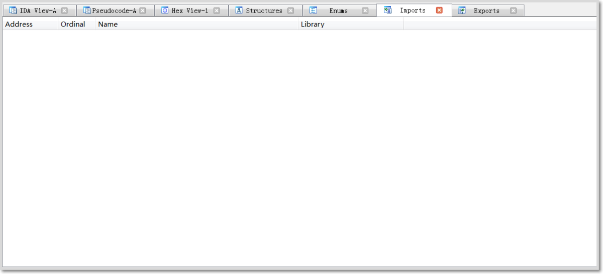
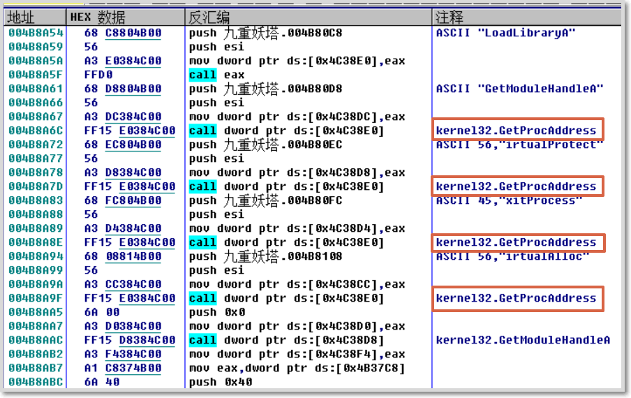
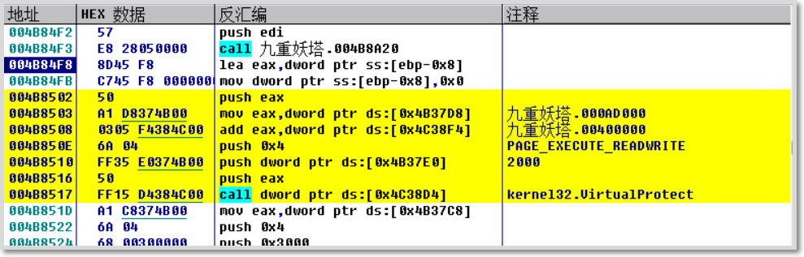
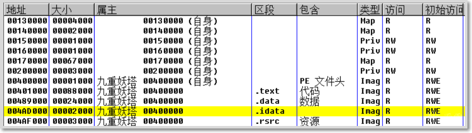
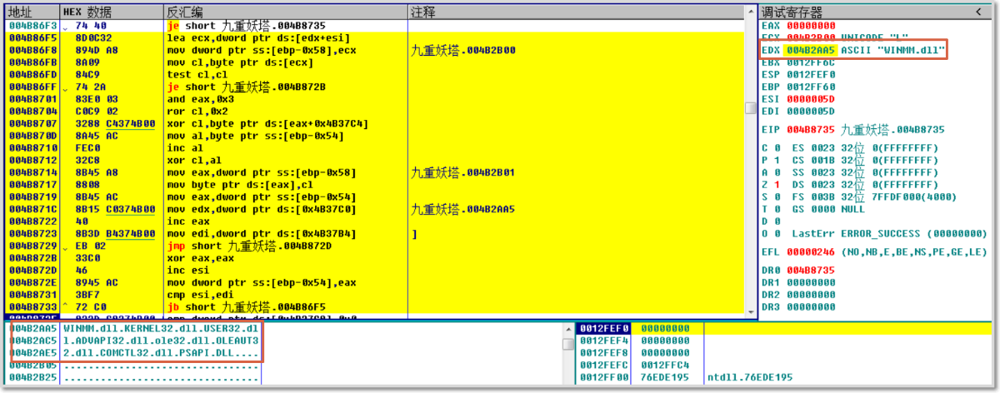
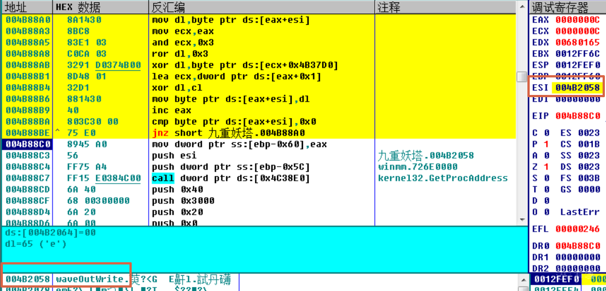
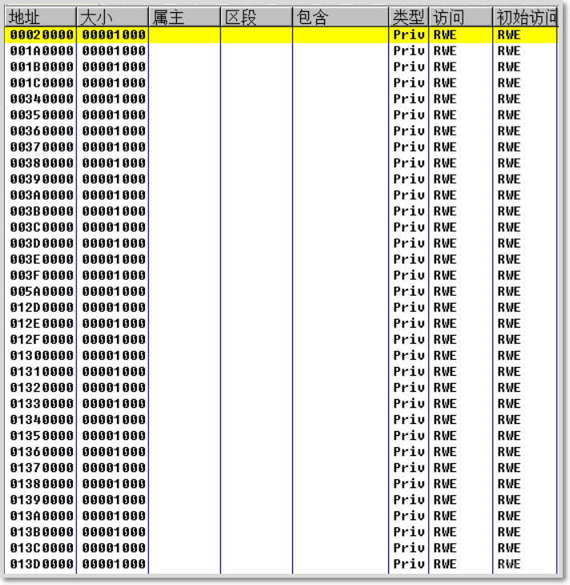
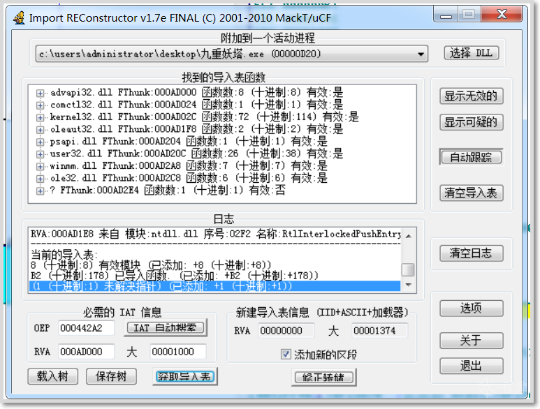
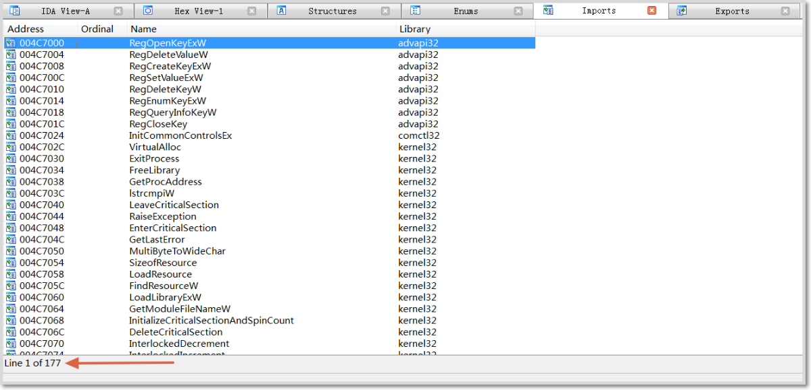
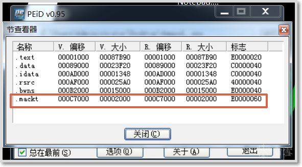

## Challenge Description

This is Challenge #9 "Nine-Layered Demonic Tower" from the Kanxue.TSRC 2017 CTF Autumn Competition: [Challenge Link](https://ctf.kanxue.com/game-fight-53.htm)

MD5 of the exe file: b8b6bfe47a9c40117e2c6bbd5839f198

<!--more-->

## Unpacking Record

1. Although PEID cannot identify the packer, opening it in IDA reveals an empty import table, indicating the author has applied custom protection.

    

2. Examining in OllyDbg, the entry point is at 004B84E0H. If the IAT is hidden and even the most basic kernel32 library is invisible, the program must dynamically resolve these APIs at startup. On Windows, dynamic DLL loading can be accomplished using GetProcAddress from kernel32. Refer to MSDN for usage details.
3. From the analysis above, the program must load essential APIs at startup. The first CALL instruction is located at 004B84F3H. Stepping into it reveals a call to GetProcAddress.

    

4. Tracing step by step, after the sub_4B8A20 function returns, we can see the VirtualProtect function being used. According to MSDN, this function changes the protection mechanism of a memory region. It takes four parameters, and with the typical right-to-left calling convention, the parameters observed in the disassembly window include (04AD000H, 00002000H, 04H, ...).

    

5. The parameter 04H represents the value of the memory protection constant PAGE_READWRITE. This function sets the memory region starting at 004AD000H with a size of 0x2000 to read-write access. Looking up address 004AD000H in the memory window, it points to the PE header's .idata section — the location where the IAT is stored.

    

6. Continuing to trace, after the function returns, VirtualAlloc allocates a region of size 177*4, with a start address of 00170000H. Note that this address may vary between runs. Pay attention to the registers — this table is used later as a marker during IAT population.

    ```asm
    004B851D    A1 C8374B00     mov eax,dword ptr ds:[0x4B37C8]          ; 177
    004B8522    6A 04           push 0x4                                 ; Memory RW
    004B8524    68 00300000     push 0x3000                              ; PAGE_RESERVE|PAGE_COMMIT
    004B8529    C1E0 02         shl eax,0x2                              ; 177*4
    004B852C    50              push eax
    004B852D    6A 00           push 0x0
    004B852F    FF15 D0384C00   call dword ptr ds:[0x4C38D0]             ; kernel32.VirtualAlloc
    ```

7. Setting the table aside for now, continuing downward into the sub_004B8690 function, which uses two shellcode segments to encrypt the IAT. Inside the function, the first loop mainly resolves required module names. By observing the highlighted EDX in the data window during the loop, you can see the data transforming from gibberish into module names.

    

8. Continuing execution, a conditional JE jump is observed. The code for both the taken and not-taken paths looks very similar — this is likely an if-else statement. The program first enters the else branch, which begins with a loop. Again, following the highlighted ESI register data reveals that this loop resolves API names within the module.

    

9. The program then allocates two memory regions with a series of ss:[] references, presumably storing two shellcode segments. Record the starting addresses: 001A0000H and 001B0000H. The memory access permission is RWE. These can be found in the memory window.

    

10. After allocating the space, the entry address of the second shellcode (001B0000H) and the real API address are XOR-encrypted. At this point, ESI holds the entry address of the first shellcode (001A0000H).

    ```asm
    004B8963    8BC8            mov ecx,eax                              ; eax=001B0000
    004B8965    81F7 26058919   xor edi,0x19890526                       ; edi is the API address
    004B896B    81F1 19061720   xor ecx,0x20170619                       ; ecx is the shellcode address
    004B8971    897D DB         mov dword ptr ss:[ebp-0x25],edi          ; Write encrypted API address
    004B8974    894D BB         mov dword ptr ss:[ebp-0x45],ecx          ; Write encrypted second shellcode entry address
    004B8977    0F1045 B0       movups xmm0,dqword ptr ss:[ebp-0x50]
    004B897B    8B4D AC         mov ecx,dword ptr ss:[ebp-0x54]
    004B897E    0F1106          movups dqword ptr ds:[esi],xmm0
    004B8981    0F1045 C0       movups xmm0,dqword ptr ss:[ebp-0x40]
    004B8985    0F1146 10       movups dqword ptr ds:[esi+0x10],xmm0
    004B8989    0F1045 D0       movups xmm0,dqword ptr ss:[ebp-0x30]
    004B898D    0F1100          movups dqword ptr ds:[eax],xmm0
    004B8990    0F1045 E0       movups xmm0,dqword ptr ss:[ebp-0x20]
    004B8994    0F1140 10       movups dqword ptr ds:[eax+0x10],xmm0
    004B8998    A1 E4384C00     mov eax,dword ptr ds:[0x4C38E4]
    004B899D    893488          mov dword ptr ds:[eax+ecx*4],esi          ; Store first shellcode entry address to the 00020000 segment
    ```

11. The above operations loop several times. After completion, the memory window shows a series of consecutive regions. The 00020000H segment stores the first shellcode addresses, while each other memory segment corresponds to an API. These can be filtered by RWE access permission and Priv type.

    

12. Examining any segment's data reveals the shellcode — a series of short jumps.

    ```asm
    001A0000    E8 01000000     call 001A0006                          ; First shellcode
    001A0005  - E9 58EB01E8     jmp E81BEB62
    001A0006    58              pop eax
    001A0007    EB 01           jmp short 001A000A
    001A000A    B8 19060C20     mov eax,0x200C0619
    001A000F    EB 01           jmp short 001A0012
    001A0012    35 19061720     xor eax,0x20170619                     ; Decrypt second shellcode address
    001A0017    EB 01           jmp short 001A001A
    001A001A    50              push eax
    001A001B    EB 02           jmp short 001A001F
    001A001F    C3              retn                                   ; Return to execute second shellcode
    001B0000    E8 01000000     call 001B0006                          ; Second shellcode
    001B0006    58              pop eax
    001B0007    EB 01           jmp short 001B000A
    001B000A    B8 5D4AE76B     mov eax,0x6BE74A5D
    001B000F    EB 01           jmp short 001B0012
    001B0012    35 26058919     xor eax,0x19890526                     ; Decrypt API address
    001B0017    EB 01           jmp short 001B001A
    001B001A    50              push eax
    001B001B    EB 02           jmp short 001B001F
    001B001F    C3              retn                                   ; Return to execute API
    ```

    After removing the junk instructions (obfuscation), the logic becomes clearer:

    ```asm
    001A000A    B8 19060C20     mov eax,0x200C0619                     ; Ciphertext
    001A0012    35 19061720     xor eax,0x20170619                     ; Decrypt second shellcode address
    001A001A    50              push eax
    001A001F    C3              retn                                   ; Return to execute second shellcode
    001B000A    B8 5D4AE76B     mov eax,0x6BE74A5D                     ; Ciphertext
    001B0012    35 26058919     xor eax,0x19890526                     ; Decrypt API address
    001B001A    50              push eax
    001B001F    C3              retn                                   ; Return to execute API
    ```

13. After sub_004B8690 returns to 004B853CH, four consecutive loops follow with roughly similar content. By observing the addresses, we can see this is populating the IAT. As mentioned earlier, the IAT is in the 000AD000H segment. The previously unused temporary table is used as markers to fill the entire IAT.

    ```asm
    004B8546   /74 43           je short 004B858B
    004B8548   |0f1f8400 000000>nop dword ptr ds:[eax+eax]
    004B8550   |A1 D4374B00     mov eax,dword ptr ds:[0x4B37D4]
    004B8555   |8BCE            mov ecx,esi
    004B8557   |3305 B4374B00   xor eax,dword ptr ds:[0x4B37B4]
    004B855D   |03C9            add ecx,ecx
    004B855F   |8904B3          mov dword ptr ds:[ebx+esi*4],eax        ; ebx=00170000, mark in the temp table that this position is filled
    004B8562   |A1 B8374B00     mov eax,dword ptr ds:[0x4B37B8]
    004B8567   |8B54C8 08       mov edx,dword ptr ds:[eax+ecx*8+0x8]
    004B856B   |A1 E4384C00     mov eax,dword ptr ds:[0x4C38E4]
    004B8570   |8B0CB0          mov ecx,dword ptr ds:[eax+esi*4]        ; Retrieve first shellcode address
    004B8573   |A1 F4384C00     mov eax,dword ptr ds:[0x4C38F4]
    004B8578   |890C10          mov dword ptr ds:[eax+edx],ecx          ; Fill into IAT
    004B857B   |0335 F0384C00   add esi,dword ptr ds:[0x4C38F0]
    004B8581   |8B0D C8374B00   mov ecx,dword ptr ds:[0x4B37C8]         ;
    ```

14. The four filling passes use different step sizes. After the fourth pass, some entries in the temporary table remain unmarked because the last pass doesn't mark the 00170000H segment.

    ```asm
    00170000  00000AF8
    00170004  00000000
    00170008  00000000
    0017000C  00000AF8
    00170010  00000000
    00170014  00000000
    00170018  00000AF8
    0017001C  00000AF8
    00170020  00000000
    00170024  00000AF8
    00170028  00000000
    0017002C  00000000
    00170030  00000AF8
    00170034  00000AF8
    00170038  00000AF8
    0017003C  00000AF8
    00170040  00000000
    00170044  00000000
    00170048  00000AF8
    0017004C  00000000
    ..........           .............
    ```

15. After the final RETN, execution jumps to the program's OEP at 004442A2H. It's evident this was written in VS2008.

    ```asm
    004442A2   .  E8 16050000   call 004447BD                            ;  Stepping into this call reveals API invocation via shellcode
    004442A7   .^ E9 5CFEFFFF   jmp 00444108
    004442AC  /.  55            push ebp
    004442AD  |.  8BEC          mov ebp,esp
    004442AF  |.  8361 04 00    and dword ptr ds:[ecx+0x4],0x0
    004442B3  |.  8361 08 00    and dword ptr ds:[ecx+0x8],0x0
    004442B7  |.  8B45 08       mov eax,[arg.1]
    004442BA  |.  8941 04       mov dword ptr ds:[ecx+0x4],eax           ;  004442A2
    004442BD  |.  8BC1          mov eax,ecx
    004442BF  |.  C701 C81F4000 mov dword ptr ds:[ecx],00401FC8
    004442C5  |.  5D            pop ebp
    004442C6  \.  C2 0400       retn 0x4
    ```

16. The entire packer's execution is now fully understood. To unpack, we need to remove the IAT encryption in the sub_004B8690 function and directly write the real API addresses into the IAT. The modifications are as follows:

    ```asm
    ;;;;;;;;;;;;;;IF;;;;;;;;;;;;;;;;;;
    004B882C    81F7 26058919   xor edi,0x19890526                       ; API address encryption
    NOP this out — edi contains the real API address
    004B885E    893488          mov dword ptr ds:[eax+ecx*4],esi         ; Writes first shellcode entry address
    Write the real API address instead: mov dword ptr ds:[eax+ecx*4],edi
    ;;;;;;;;;;;;;ELSE;;;;;;;;;;;;;;;;;
    004B8965    81F7 26058919   xor edi,0x19890526                       ; edi is the API address
    NOP this out — edi contains the real API address
    004B899D    893488          mov dword ptr ds:[eax+ecx*4],esi          ; Stores first shellcode entry address to the 00020000 segment
    Write the real API address instead: mov dword ptr ds:[eax+ecx*4],edi
    ```

17. Then change the entry point to 000442A2H, set RVA to 000AD000H with size 1000, retrieve the import table, delete invalid entries, and dump as dump_.exe.

    

18. Viewing the imports in IDA again shows 177 entries, exactly matching the count from step 6.

    

19. Unfortunately, the dumped executable doesn't run properly — possibly due to insufficient skill. After launching, there's only sound but no GUI. PEID reveals an extra `.mackt` section, which was automatically generated by ImpREC.

    

## Summary

The packer in this program employs SMC (Self-Modifying Code) techniques. For a systematic study of unpacking techniques, SMC, and shellcode writing, I recommend "Encryption and Decryption, 4th Edition" — it will help build a strong foundation in these areas.
