## 题目介绍

这是看雪.TSRC 2017CTF秋季赛的 第九题 九重妖塔：[题目链接](https://ctf.kanxue.com/game-fight-53.htm)

exe文件的md5：b8b6bfe47a9c40117e2c6bbd5839f198

<!--more-->

## 脱壳记录

1. 虽然使用PEID查壳查不出来，但是用IDA打开，看到import表是空的，证明作者特殊处理过。

    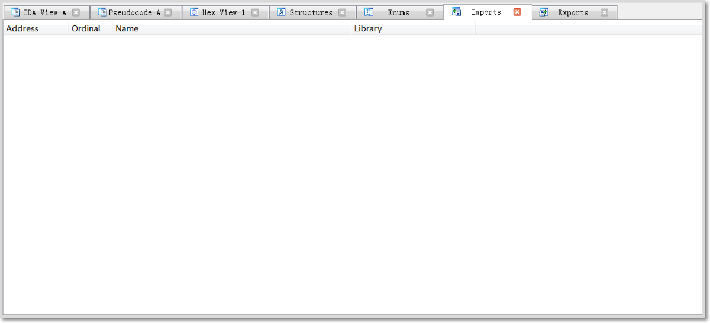

2. 在OD中查看，入口点是004B84E0H，如果IAT表被隐藏了，连最基本的kernel32库都看不见，那程序刚开始肯定得通过某种办法去动态的调用这些API，在windows中动态调用dll，可以使用kernel32中的GetProcAddres函数，具体用法参考msdn。
3. 通过上面的分析可知，程序刚开始肯定需要加载必要的API，所以找到第一个CALL语句的位置在004B84F3H，Enter进入里面看到了调用GetProcAddress。

    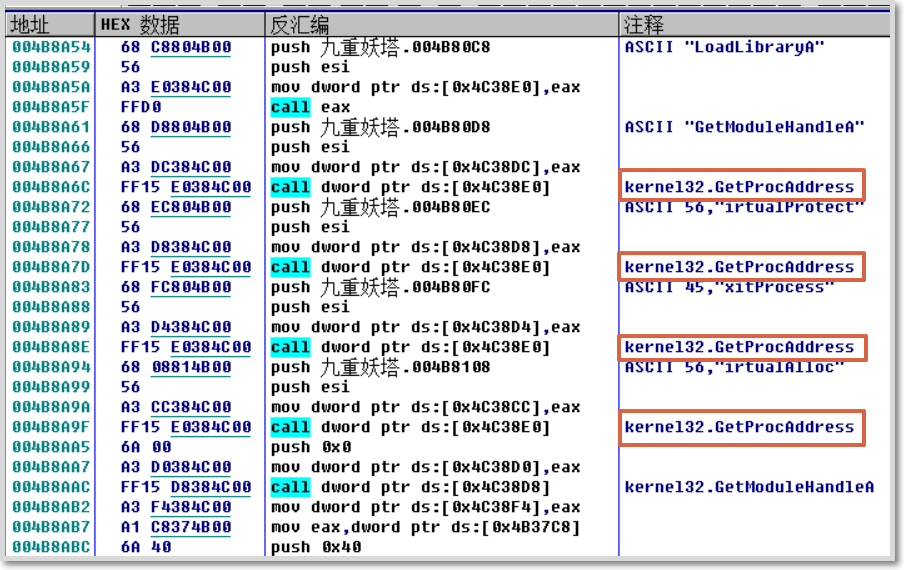

4. 单步跟踪，在sub_4B8A20函数返回之后，可以看到使用了VirtualProtect函数，从msdn中得知该函数是用来改变内存段的保护机制，参数共有四个，一般函数参数入站方式为从后向前依次入栈，从反汇编窗口中观察到传入的参数中包括了（04AD000H,00002000H,04H,...）

    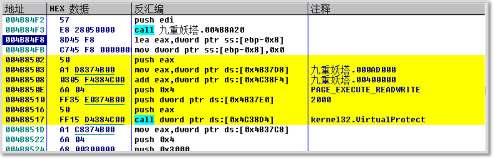

5. 参数中04H表示内存保护常量PAGE_READWRITE的值，该函数将004AD000H为起始，大小为2000的内存段权限设置为可读可写。努力的找到004AD000H地址是干嘛的，可以在内存窗口看到该地址指向PE头的.iDate段，即存放IAT的地方。

    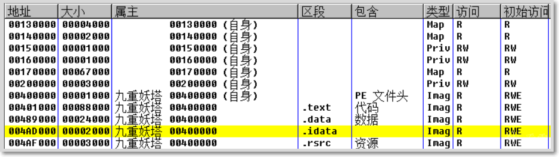

6. 继续跟进，函数返回之后使用VirtualAlloc申请了一段空间，大小为177*4，起始地址00170000H，注意这个地址每次运行可能都不一样，留意寄存器，这个表在后面用来填充IAT时用来做标记用的。

    ```asm
    004B851D    A1 C8374B00     mov eax,dword ptr ds:[0x4B37C8]          ; 177
    004B8522    6A 04           push 0x4                                 ; 内存RW
    004B8524    68 00300000     push 0x3000                              ; PAGE_REVERSE|PAGE_COMMIT
    004B8529    C1E0 02         shl eax,0x2                              ; 177*4
    004B852C    50              push eax
    004B852D    6A 00           push 0x0
    004B852F    FF15 D0384C00   call dword ptr ds:[0x4C38D0]             ; kernel32.VirtualAlloc
    ```

7. 先不管这个表，继续向下跟进，进入sub_004B8690这个函数，该函数利用两段shellcode来加密IAT。进入函数，第一个循环语句主要用来解析需要的模块名，可以通过观察循环过程中数据窗口跟随被高亮的EDX，能够看到这部分从乱码变成模块名的过程。

    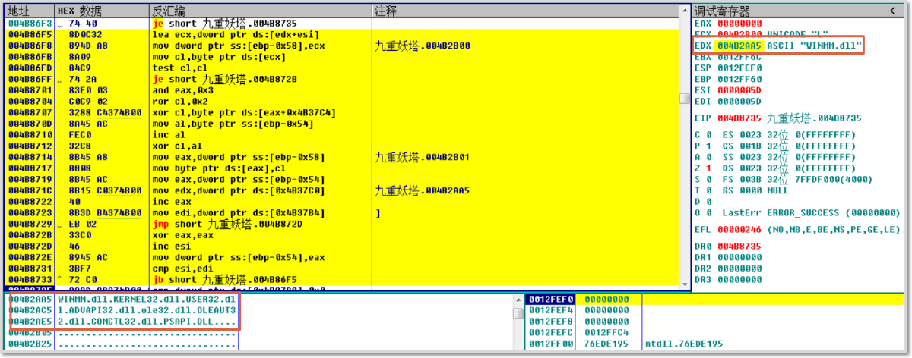

8. 接着执行，能够观察到有个je跳转，跳转成立执行的代码和跳转不成立执行的代码看起来非常相似，应该是个if语句，程序第一次先到了else部分，进去之后先是一个循环，这是依旧跟随并观察寄存器窗口被高亮的ESI数据，可以看出该循环在解析模块中的API名称。

    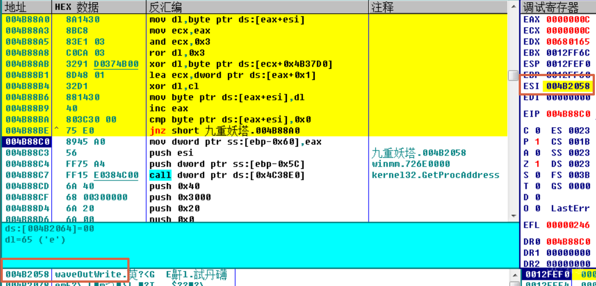

9. 程序下面申请了两段内存，并且带有一连串ss:[]，猜测存放了两段shellcode，记录下这两个段的起始地址001A0000H和001B0000H，内存访问权限为RWE，在内存窗口中可以找到它们。

    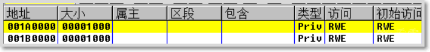

10. 申请空间之后，对第二段shellcode入口地址001B0000H和真实API地址进行异或加密，并且此时esi为第一段shellcode的入口地址001A0000H。

    ```asm
    004B8963    8BC8            mov ecx,eax                              ; eax=001B0000
    004B8965    81F7 26058919   xor edi,0x19890526                       ; edi为api地址
    004B896B    81F1 19061720   xor ecx,0x20170619                       ; ecx为shellcode地址
    004B8971    897D DB         mov dword ptr ss:[ebp-0x25],edi          ; 写入加密后的api地址
    004B8974    894D BB         mov dword ptr ss:[ebp-0x45],ecx          ; 写入加密后的第二段shellcode入口地址
    004B8977    0F1045 B0       movups xmm0,dqword ptr ss:[ebp-0x50]
    004B897B    8B4D AC         mov ecx,dword ptr ss:[ebp-0x54]
    004B897E    0F1106          movups dqword ptr ds:[esi],xmm0
    004B8981    0F1045 C0       movups xmm0,dqword ptr ss:[ebp-0x40]
    004B8985    0F1146 10       movups dqword ptr ds:[esi+0x10],xmm0
    004B8989    0F1045 D0       movups xmm0,dqword ptr ss:[ebp-0x30]
    004B898D    0F1100          movups dqword ptr ds:[eax],xmm0
    004B8990    0F1045 E0       movups xmm0,dqword ptr ss:[ebp-0x20]
    004B8994    0F1140 10       movups dqword ptr ds:[eax+0x10],xmm0
    004B8998    A1 E4384C00     mov eax,dword ptr ds:[0x4C38E4]
    004B899D    893488          mov dword ptr ds:[eax+ecx*4],esi          ; 将第一段shellcode入口地址存到00020000段
    ```

11. 上面的操作循环了好几遍，循环完毕之后，在内存窗口看到一堆连续的空间，00020000H存储第一段shellcode的地址，其他内存段每个都对应一个api，可通过访问权限RWE和类型Priv将这些内存段筛选出来。

    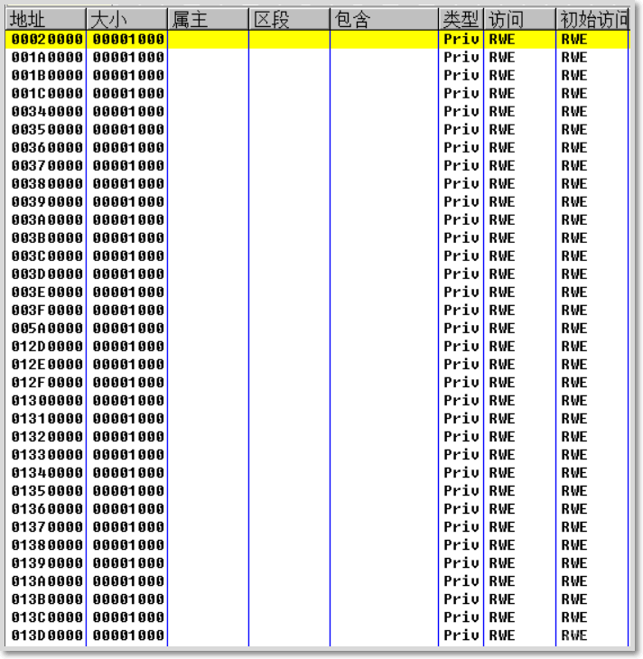

12. 随便找一个段查看数据，可以看到shellcode代码，一堆小跳。

    ```asm
    001A0000    E8 01000000     call 001A0006                          ; 第一段shellcode
    001A0005  - E9 58EB01E8     jmp E81BEB62
    001A0006    58              pop eax
    001A0007    EB 01           jmp short 001A000A
    001A000A    B8 19060C20     mov eax,0x200C0619
    001A000F    EB 01           jmp short 001A0012
    001A0012    35 19061720     xor eax,0x20170619                     ; 解密第二段shellcode地址
    001A0017    EB 01           jmp short 001A001A
    001A001A    50              push eax
    001A001B    EB 02           jmp short 001A001F
    001A001F    C3              retn                                   ; retn回去执行第二段shellcode
    001B0000    E8 01000000     call 001B0006                          ; 第二段shellcode
    001B0006    58              pop eax
    001B0007    EB 01           jmp short 001B000A
    001B000A    B8 5D4AE76B     mov eax,0x6BE74A5D
    001B000F    EB 01           jmp short 001B0012
    001B0012    35 26058919     xor eax,0x19890526                     ; 解密api地址
    001B0017    EB 01           jmp short 001B001A
    001B001A    50              push eax
    001B001B    EB 02           jmp short 001B001F
    001B001F    C3              retn                                   ; retn回去执行api
    ```

    去掉花指令之后，逻辑更清楚。

    ```asm
    001A000A    B8 19060C20     mov eax,0x200C0619                     ; 密文
    001A0012    35 19061720     xor eax,0x20170619                     ; 解密第二段shellcode地址
    001A001A    50              push eax
    001A001F    C3              retn                                   ; retn回去执行第二段shellcode
    001B000A    B8 5D4AE76B     mov eax,0x6BE74A5D                     ; 密文
    001B0012    35 26058919     xor eax,0x19890526                     ; 解密api地址
    001B001A    50              push eax
    001B001F    C3              retn                                   ; retn回去执行api
    ```

13. sub_004B8690执行完返回到004B853CH处，之后连续4个循环，每个循环内容大致相同，通过观察地址可以发现这是在填充IAT，之前说过IAT在000AD000H段，利用上面未用到的那个临时表做标记将IAT全部填充。

    ```asm
    004B8546   /74 43           je short 九重妖塔.004B858B
    004B8548   |0f1f8400 000000>nop dword ptr ds:[eax+eax]
    004B8550   |A1 D4374B00     mov eax,dword ptr ds:[0x4B37D4]
    004B8555   |8BCE            mov ecx,esi
    004B8557   |3305 B4374B00   xor eax,dword ptr ds:[0x4B37B4]
    004B855D   |03C9            add ecx,ecx
    004B855F   |8904B3          mov dword ptr ds:[ebx+esi*4],eax        ; ebx=00170000，在临时表对应位置标记此处已填充
    004B8562   |A1 B8374B00     mov eax,dword ptr ds:[0x4B37B8]
    004B8567   |8B54C8 08       mov edx,dword ptr ds:[eax+ecx*8+0x8]
    004B856B   |A1 E4384C00     mov eax,dword ptr ds:[0x4C38E4]
    004B8570   |8B0CB0          mov ecx,dword ptr ds:[eax+esi*4]        ; 取出第一段shellcode的地址
    004B8573   |A1 F4384C00     mov eax,dword ptr ds:[0x4C38F4]
    004B8578   |890C10          mov dword ptr ds:[eax+edx],ecx          ; 填充到IAT
    004B857B   |0335 F0384C00   add esi,dword ptr ds:[0x4C38F0]
    004B8581   |8B0D C8374B00   mov ecx,dword ptr ds:[0x4B37C8]         ;
    ```

14. 四个填充设置的步长不一样，填充了四遍，当第四遍完成后临时表此时有的未被标记是因为在最后一遍填充中没有看到对00170000H段再进行标记。

    ```asm
    00170000  00000AF8
    00170004  00000000
    00170008  00000000
    0017000C  00000AF8
    00170010  00000000
    00170014  00000000
    00170018  00000AF8
    0017001C  00000AF8
    00170020  00000000
    00170024  00000AF8
    00170028  00000000
    0017002C  00000000
    00170030  00000AF8
    00170034  00000AF8
    00170038  00000AF8
    0017003C  00000AF8
    00170040  00000000
    00170044  00000000
    00170048  00000AF8
    0017004C  00000000
    ..........           .............
    ```

15. retn之后跳到了程序的OEP位置004442A2H，可以看出来这是用vs2008写的。

    ```asm
    004442A2   .  E8 16050000   call 九重妖塔.004447BD                   ;  这个call f7进去能看到利用shellcode调用api
    004442A7   .^ E9 5CFEFFFF   jmp 九重妖塔.00444108
    004442AC  /.  55            push ebp
    004442AD  |.  8BEC          mov ebp,esp
    004442AF  |.  8361 04 00    and dword ptr ds:[ecx+0x4],0x0
    004442B3  |.  8361 08 00    and dword ptr ds:[ecx+0x8],0x0
    004442B7  |.  8B45 08       mov eax,[arg.1]
    004442BA  |.  8941 04       mov dword ptr ds:[ecx+0x4],eax           ;  九重妖塔.004442A2
    004442BD  |.  8BC1          mov eax,ecx
    004442BF  |.  C701 C81F4000 mov dword ptr ds:[ecx],九重妖塔.00401FC8
    004442C5  |.  5D            pop ebp
    004442C6  \.  C2 0400       retn 0x4
    ```

16. 整个壳的运行已经一览无余，脱壳需要将sub_004B8690函数中的IAT加密部分去掉，直接将真实API地址写入到IAT中，改动方法如下：

    ```asm
    ;;;;;;;;;;;;;;IF;;;;;;;;;;;;;;;;;;
    004B882C    81F7 26058919   xor edi,0x19890526                       ; API地址加密
    NOP掉，edi里面是真实api
    004B885E    893488          mov dword ptr ds:[eax+ecx*4],esi         ; 写入第一段shellcode的入口地址
    直接存储真实api地址，所以改为：mov dword ptr ds:[eax+ecx*4],edi
    ;;;;;;;;;;;;;ELSE;;;;;;;;;;;;;;;;;
    004B8965    81F7 26058919   xor edi,0x19890526                       ; edi为api地址
    NOP掉，edi里面是真实api
    004B899D    893488          mov dword ptr ds:[eax+ecx*4],esi          ; 将第一段shellcode入口地址存到00020000段
    直接存储真实api地址，所以改为：mov dword ptr ds:[eax+ecx*4],edi
    ```

17. 然后入口点改为000442A2H，RVA改为000AD000H，大小为1000，获取导入表后把无效的删除，dump下来得到dump_.exe。

    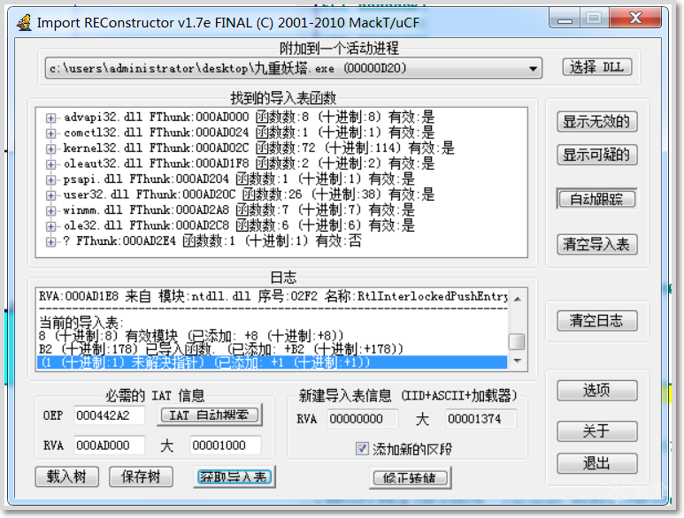

18. 用IDA再次查看import，可以看到177个，和第6步的数量刚好对应。

    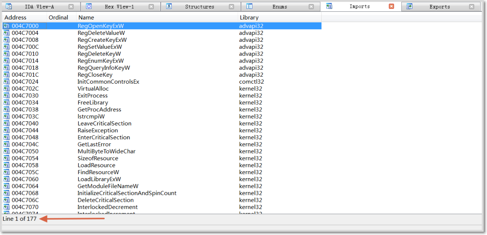

19. 但是很遗憾，不知道为什么运行不了，可能功力不够，后劲不足。运行后只有声音，没有界面。使用PEID查壳发现区段多了一个.mackt段，这是impREC之后自动生成的。

    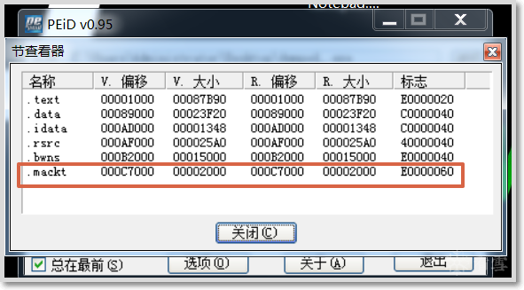

## 小结

这个程序的壳部分使用了SMC技术，可通过一本《加密与解密 第四版》系统学习脱壳技术和SMC以及编写shellcode代码，让自己的内力犹如九阳神功，后劲充足。
