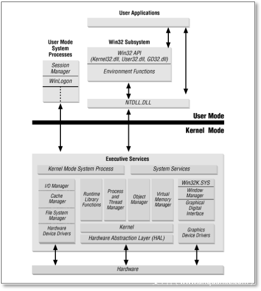
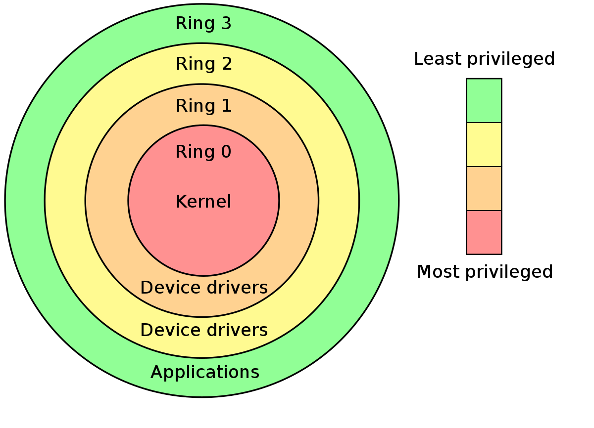
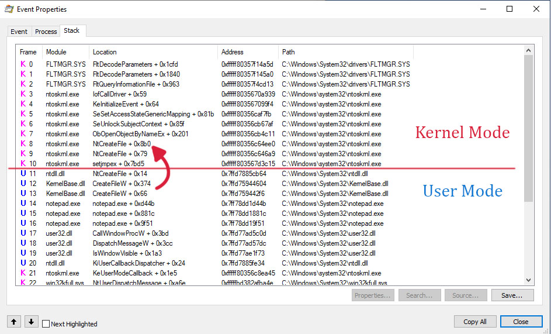
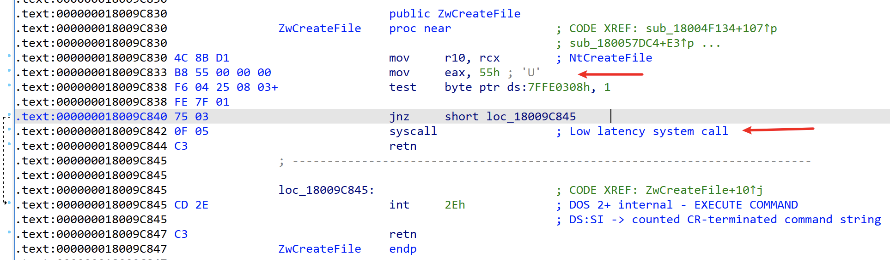
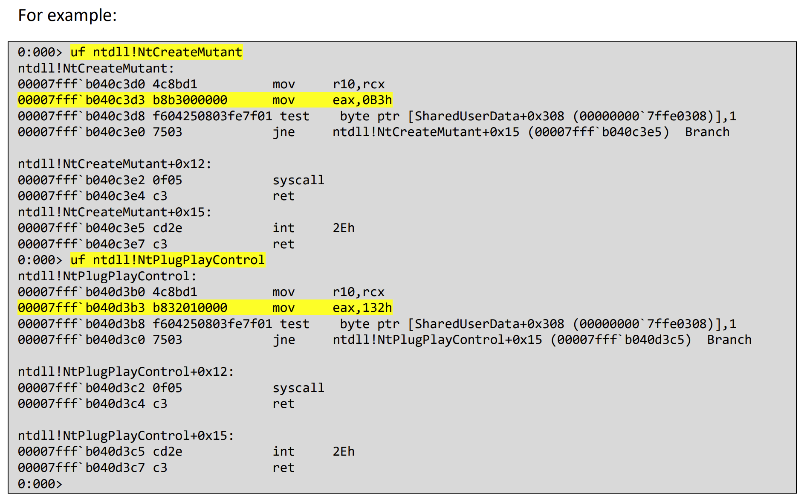

## 0x01 Introduction

Hell's Gate is a direct syscall technique on Windows that can bypass most EDR hooks at the Ring3 layer.

As early as 1997, there were techniques that programmatically resolved required function addresses by parsing the Export Address Table (EAT) of kernel32.dll, without relying on hardcoded function addresses.

In June 2019, Cornelis de Plaa (@cneelis) published an article titled "[Red Team Tactics: Combining Direct System Calls and sRDI to Bypass AV/EDR](https://outflank.nl/blog/2019/06/19/red-team-tactics-combining-direct-system-calls-and-srdi-to-bypass-av-edr/)." This article popularized the use of syscalls and introduced this method for enhancing defense evasion capabilities.

Shortly after, Jackson (@jackson) released the [SysWhispers](https://github.com/jthuraisamy/SysWhispers) Python script on GitHub. However, there was a problem — SysWhispers relied entirely on statically defined syscall numbers, which were heavily dependent on Mateusz Jurczyk's (@j00ru) [Windows X86-64 System Call Table](https://j00ru.vexillium.org/syscalls/nt/64/).

Subsequently, a series of variants emerged with further improvements to the technique.

## 0x02 Recommended Projects

Here are several direct syscall projects, each with unique characteristics:

- [https://github.com/jthuraisamy/SysWhispers](https://github.com/jthuraisamy/SysWhispers): Python script that generates assembly stubs for direct syscalls; hardcoded, requires specifying the Windows version
- [https://github.com/jthuraisamy/SysWhispers2](https://github.com/jthuraisamy/SysWhispers2): Unlike v1, non-hardcoded; resolves ntdll from PEB→LDR, sorts by API address, where the sorted position corresponds to the syscall number, reducing stub size
- [https://github.com/mai1zhi2/SysWhispers2_x86](https://github.com/mai1zhi2/SysWhispers2_x86): x86 version of syscall, as well as 64-bit compatible 32-bit (WOW64) syscall
- [https://github.com/N4kedTurtle/HellsGatePoC](https://github.com/N4kedTurtle/HellsGatePoC): Parses ntdll.dll from disk to extract the specified API's syscall stub for direct syscalls (avoids the in-process ntdll being replaced by EDR)
- [https://github.com/am0nsec/SharpHellsGate](https://github.com/am0nsec/SharpHellsGate): C# version, syscall numbers are non-hardcoded, resolved from disk parsing
- [https://github.com/am0nsec/HellsGate](https://github.com/am0nsec/HellsGate): C version, non-hardcoded, resolved from PEB→LDR

## 0x03 Technical Principles

First, it's essential to understand the concept of system calls in Windows:

> In Windows, the process architecture is divided into two processor access modes — **user mode** and **kernel mode**. These two modes protect user applications from accessing and modifying critical system data. User applications (such as Chrome, Word, etc.) run in user mode, while system code (such as system services and device drivers) runs in kernel mode.
>
> 
>
> In kernel mode, the processor **allows programs to access all system memory and all CPU instructions**. Some x86 and x64 processors also use the term **Ring Levels** to distinguish between these two modes.
>
> Processors that use Ring Level privilege modes define four privilege levels (**Rings**) to protect system code and data. The following diagram illustrates Ring Levels:
>
> 
>
> Windows only uses Ring 0 and Ring 3. Each program running at Ring 3 is assigned an independent virtual address space, isolated from one another, so one program cannot arbitrarily modify another program's data. Ring 0 represents the kernel layer, where drivers and the Windows kernel operate, sharing a single memory space that stores a large number of internal data structures (such as handle tables). Processes, files, registry entries, threads, etc. can all be referred to as handles. To access these handles, one must first transition from user mode to kernel mode — this is where syscall instructions come in. In 64-bit mode, the syscall instruction is `syscall`; in 32-bit mode, it's `sysenter`.

Here's how a user-mode process specifically transitions to kernel mode. For example, when notepad.exe creates a text file, a user-to-kernel mode transition occurs:



When notepad.exe calls kernel32!CreateFileW for file creation, it internally jumps to ntdll!NtCreateFile, using ntdll to implement the transition between user and kernel mode. Let's examine the implementation of ntdll!NtCreateFile:



This function is only 24 bytes long. 0x55 is the syscall number for NtCreateFile. After calling `syscall` to enter kernel mode, the corresponding kernel-mode function ntoskrnl!NtCreateFile is invoked based on the syscall number to complete the handle object access operation.

Therefore, based on ntdll's implementation, the direct syscall approach can be simply summarized as:

```asm
mov r10,rcx
mov eax, 0x55  ; NtCreateFile
syscall
retn
```

Syscall numbers may change with each system update. You can look up the syscall numbers for specific systems in the [Windows X86-64 System Call Table](https://j00ru.vexillium.org/syscalls/nt/64/) maintained by [j00ru](https://twitter.com/j00ru) from Google Project Zero, or dynamically obtain syscall numbers by parsing the ntdll stored on disk or in loaded memory modules.

## 0x04 Technical Challenges

### 1. Syscall Numbers Differ Across Windows Versions

This can be resolved by directly parsing the export table of the on-disk ntdll.dll file, or by parsing the ntdll module loaded in memory via PEB→LDR:

```cpp
#include <windows.h>
#include "peb.h"
int main(VOID) {
    PPEB Peb = (PPEB)__readgsqword(0x60);
    PLDR_MODULE pLoadModule;
    PBYTE ImageBase;
    PIMAGE_DOS_HEADER Dos = NULL;
    PIMAGE_NT_HEADERS Nt = NULL;
    PIMAGE_FILE_HEADER File = NULL;
    PIMAGE_OPTIONAL_HEADER Optional = NULL;
    PIMAGE_EXPORT_DIRECTORY ExportTable = NULL;
    pLoadModule = (PLDR_MODULE)((PBYTE)Peb->LoaderData->InMemoryOrderModuleList.Flink->Flink - 16);
    ImageBase = (PBYTE)pLoadModule->BaseAddress;
    Dos = (PIMAGE_DOS_HEADER)ImageBase;
    if (Dos->e_magic != IMAGE_DOS_SIGNATURE)
    return 1;
    Nt = (PIMAGE_NT_HEADERS)((PBYTE)Dos + Dos->e_lfanew);
    File = (PIMAGE_FILE_HEADER)(ImageBase + (Dos->e_lfanew + sizeof(DWORD));
    Optional = (PIMAGE_OPTIONAL_HEADER)((PBYTE)File + sizeof(IMAGE_FILE_HEADER));
    ExportTable = (PIMAGE_EXPORT_DIRECTORY)(ImageBase + Optional->DataDirectory[0].VirtualAddress);
    return ERROR_SUCCESS;
}
```

By locating the function in the export table and disassembling it, we can determine the syscall number through the machine code:



### 2. How to Implement Direct Syscalls in 32-bit Programs

If running a 32-bit program on a 32-bit machine, it's straightforward and basically the same as 64-bit. However, when implementing 32-bit compatibility on 64-bit systems, there's an unavoidable issue: WOW64. For technical details and exploitation ideas regarding WOW64, refer to [this presentation](https://s.itho.me/ccms_slides/2021/5/13/a23144e3-4313-4b9b-89c2-985fb3832b4e.pdf). POC project: [https://github.com/aaaddress1/wowGrail](https://github.com/aaaddress1/wowGrail).

There's also a simpler method for quick 32-bit to 64-bit transition, see:

- [https://zhuanlan.zhihu.com/p/297691297](https://zhuanlan.zhihu.com/p/297691297)
- [https://www.zybuluo.com/zoand/note/733427](https://www.zybuluo.com/zoand/note/733427)

In short, on 64-bit systems there's a call to fs:[0xC0] (wow64cpu!X86SwitchTo64BitMode), replacing the standard call to ntdll.KiFastSystemCall. Therefore, 64-bit syscalls can directly call this address:

```asm
internal_cleancall_wow64_gate = (void*)__readfsdword(0xC0);
 
EXTERN SW2_GetSyscallNumber: PROC
 
EXTERN internal_cleancall_wow64_gate: PROC
 
NtAccessCheck PROC
    push ebp
    mov ebp, esp
    push 0C45B3507h        ; Load function hash into ECX.
    call SW2_GetSyscallNumber
    lea esp, [esp+4]
    mov ecx, 8h
push_argument:
    dec ecx
    push [ebp + 08h + ecx * 4]
    jnz push_argument
    push ret_address_epilog ;ret address
    call dword ptr internal_cleancall_wow64_gate ; call KiFastSystemCall
    lea esp, [esp+4]
ret_address_epilog:
    mov esp, ebp
    pop ebp
    ret
NtAccessCheck ENDP
```

## 0x05 Recommended Reading

- [https://vxug.fakedoma.in/papers/VXUG/Exclusive/HellsGate.pdf](https://vxug.fakedoma.in/papers/VXUG/Exclusive/HellsGate.pdf)
- [https://outflank.nl/blog/2019/06/19/red-team-tactics-combining-direct-system-calls-and-srdi-to-bypass-av-edr/](https://outflank.nl/blog/2019/06/19/red-team-tactics-combining-direct-system-calls-and-srdi-to-bypass-av-edr/) (The 2019 article that popularized syscalls, followed shortly by SysWhispers)
- [https://www.anquanke.com/post/id/207046](https://www.anquanke.com/post/id/207046), translated from [https://jhalon.github.io/utilizing-syscalls-in-csharp-1/](https://jhalon.github.io/utilizing-syscalls-in-csharp-1/)
- [https://iwantmore.pizza/posts/PEzor.html](https://iwantmore.pizza/posts/PEzor.html)
- [https://s.itho.me/ccms_slides/2021/5/13/a23144e3-4313-4b9b-89c2-985fb3832b4e.pdf](https://s.itho.me/ccms_slides/2021/5/13/a23144e3-4313-4b9b-89c2-985fb3832b4e.pdf)
