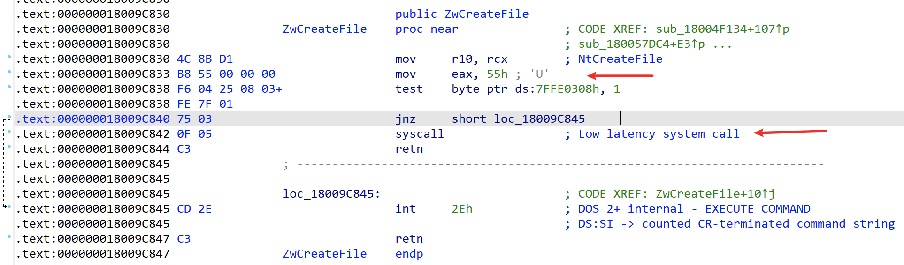

## 0x01 技术简介

地狱之门，是一种在 Windows 下直接做系统调用技术，可用于绕过 Ring3 层的大多数 EDR hook。

在1997年，就有通过解析kernal32.dll的Export Address Table(EAT)，以编程的方式解析所需的函数地址，它不依赖于硬编码的函数地址。

2019年6月，Cornelis de Plaa (@cneelis)发表了一篇题为《[红队战术: 结合直接系统调用和 sRDI 来绕过 AV/EDR](https://outflank.nl/blog/2019/06/19/red-team-tactics-combining-direct-system-calls-and-srdi-to-bypass-av-edr/)》的文章。这篇文章普及了系统调用的使用，介绍了这种增强防御/规避能力的方法。

不久之后，Jackson([@jackson)在 GitHub 上发布了 [SysWhisper](https://github.com/jthuraisamy/SysWhispers) python 脚本，但是有一个问题，syswhisper 完全依赖静态定义的系统调用编号，它们非常依赖 Mateusz Jurczyk (@j00ru) : [Windows X86-64 System Call Table](https://j00ru.vexillium.org/syscalls/nt/64/)。

之后出现一系列变体，对该技术实现做了进一步改进。

## 0x02 项目推荐

找了几个都有各自特点的直接系统调用项目：

- [https://github.com/jthuraisamy/SysWhispers](https://github.com/jthuraisamy/SysWhispers)：python脚本生成直接系统调用的汇编指令，硬编码，使用需要指定windows版本
- [https://github.com/jthuraisamy/SysWhispers2](https://github.com/jthuraisamy/SysWhispers2)：相较于1的区别，非硬编码，改为解析peb-ldr中的ntdll，根据api地址排序，排序后的位置即为系统调用号，减小了存根的大小
- [https://github.com/mai1zhi2/SysWhispers2_x86](https://github.com/mai1zhi2/SysWhispers2_x86)：x86版本的syscall，以及64位兼容32位版本（WOW64）的syscall
- [https://github.com/N4kedTurtle/HellsGatePoC](https://github.com/N4kedTurtle/HellsGatePoC)：从磁盘解析ntdll.dll提取指定api的syscall stub 做直接系统调用（避免进程当前加载的ntdll被edr替换）
- [https://github.com/am0nsec/SharpHellsGate](https://github.com/am0nsec/SharpHellsGate)：csharp版本，syscall调用号非硬编码，来自磁盘解析
- [https://github.com/am0nsec/HellsGate](https://github.com/am0nsec/HellsGate)：c版本，非硬编码，来自peb→ldr

## 0x03 技术原理

首先需要理解的是 Windows 系统下系统调用的概念：

> 在 Windows 中，进程的体系结构分为两种处理器访问模式——**用户模式(user mode)**和**内核模式(kernel mode)**。 这两种模式是为了保护用户应用程序免于访问和修改任何重要的系统数据。 用户应用程序（例如 Chrome，Word 等）均在用户模式下运行，而系统代码（例如系统服务和设备驱动程序）均在内核模式下运行。
>
> 
>
> 在内核模式下，处理器**允许程序访问所有系统内存以及所有 CPU 指令**。有一些x86和x64的处理器也使用 **Ring Levels** 这样的术语来区分这两种模式。
>
> 使用 Ring Level 特权模式的处理器定义了四个特权级别（**Rings**）来保护系统代码和数据。下图是一个 Ring Levels 的示例：
>
> 
>
> Windows 里只使用了 Ring0 和 Ring3 层，每个 Ring3 层运行的程序都会分配一块独立的虚拟空间，互相独立，所以一个程序不能随意修改另外一个程序的数据，而 Ring0 层表示内核层，驱动程序和 Windows 内核都工作在这一层，且共享一个内存空间，该空间存放了系统中大量的内部数据结构（例如句柄表），进程、文件、注册表、线程等都可以称为句柄，如果想要访问这些句柄，必须先从用户态切换到内核态中，这里就要用到系统调用指令了。在 64 位模式下系统调用指令为 syscall，32 位模式为 sysenter。

用户层进程具体是如何切换到内核态的，举个例子，notepad.exe 创建一个文本文件时，就会发生用户态到内核态的转换：


notepad.exe 调用 kernel32!CreateFileW 进行文件创建操作时，内部将跳转到 ntdll!NtCreateFile，利用 ntdll 实现用户和内核模式的切换，可以观察 ntdll!NtCreateFile 的实现：



该函数实现仅有 24 个字节的长度，0x55 即 NtCreateFile 的系统调用号，调用 syscall 进入内核态后将根据调用号调用对应的内核态函数 ntoskrnl!NtCreateFile 完成句柄对象访问操作。

所以，根据 ntdll 的实现原理，直接系统调用的方式就可以简单概括成：

```asm
mov r10,rcx
mov eax, 0x55  ; NtCreateFile
syscall
retn
```

系统调用号可能会在每次系统更新后发生变化，可以在 Google Project Zero 的 [j00ru](https://twitter.com/j00ru) 整理的 [Windows X86-64 System Call Table](https://j00ru.vexillium.org/syscalls/nt/64/) 中查询对应系统的调用号，也可以直接解析磁盘或内存模块中保存的 ntdll 实现动态获取调用号。

## 0x04 技术难点

### 1. 每个Windows版本的系统调用号不一样

这个可以通过直接解析磁盘 ntdll.dll 文件的导出表，或者通过解析 peb→ldr 获取内存中已加载的 ntdll 模块：

```cpp
#include <windows.h>
#include "peb.h"
int main(VOID) {
    PPEB Peb = (PPEB)__readgsqword(0x60);
    PLDR_MODULE pLoadModule;
    PBYTE ImageBase;
    PIMAGE_DOS_HEADER Dos = NULL;
    PIMAGE_NT_HEADERS Nt = NULL;
    PIMAGE_FILE_HEADER File = NULL;
    PIMAGE_OPTIONAL_HEADER Optional = NULL;
    PIMAGE_EXPORT_DIRECTORY ExportTable = NULL;
    pLoadModule = (PLDR_MODULE)((PBYTE)Peb->LoaderData->InMemoryOrderModuleList.Flink->Flink - 16);
    ImageBase = (PBYTE)pLoadModule->BaseAddress;
    Dos = (PIMAGE_DOS_HEADER)ImageBase;
    if (Dos->e_magic != IMAGE_DOS_SIGNATURE)
    return 1;
    Nt = (PIMAGE_NT_HEADERS)((PBYTE)Dos + Dos->e_lfanew);
    File = (PIMAGE_FILE_HEADER)(ImageBase + (Dos->e_lfanew + sizeof(DWORD));
    Optional = (PIMAGE_OPTIONAL_HEADER)((PBYTE)File + sizeof(IMAGE_FILE_HEADER));
    ExportTable = (PIMAGE_EXPORT_DIRECTORY)(ImageBase + Optional->DataDirectory[0].VirtualAddress);
    return ERROR_SUCCESS;
}
```

通过导出表的函数位置，反汇编，可以通过机器码确定 syscall 的调用号：


### 2. 32位程序如何实现直接系统调用

如果实在32位的机器上运行32位程序还好说，基本和64位一致。但是如果要实现 64 位中兼容 32 位，就会遇到一个不可避免的问题：WOW64，关于 WOW64 的技术细节以及利用思路可以参考 [https://s.itho.me/ccms_slides/2021/5/13/a23144e3-4313-4b9b-89c2-985fb3832b4e.pdf](https://s.itho.me/ccms_slides/2021/5/13/a23144e3-4313-4b9b-89c2-985fb3832b4e.pdf)，POC 项目：[https://github.com/aaaddress1/wowGrail](https://github.com/aaaddress1/wowGrail)。

另外还有一种简单的方式进行 32 位 和 64 位快速转换，参考：

- [https://zhuanlan.zhihu.com/p/297691297](https://zhuanlan.zhihu.com/p/297691297)
- [https://www.zybuluo.com/zoand/note/733427](https://www.zybuluo.com/zoand/note/733427)

简言之，在 64 位系统上有一个到 fs:[0xC0]（wow64cpu!X86SwitchTo64BitMode）的调用，替代了到 ntdll.KiFastSystemCall 的标准调用，所以，64 位的 syscall 可以直接 call 这个地址：

```asm
internal_cleancall_wow64_gate = (void*)__readfsdword(0xC0);
 
EXTERN SW2_GetSyscallNumber: PROC
 
EXTERN internal_cleancall_wow64_gate: PROC
 
NtAccessCheck PROC
    push ebp
    mov ebp, esp
    push 0C45B3507h        ; Load function hash into ECX.
    call SW2_GetSyscallNumber
    lea esp, [esp+4]
    mov ecx, 8h
push_argument:
    dec ecx
    push [ebp + 08h + ecx * 4]
    jnz push_argument
    push ret_address_epilog ;ret address
    call dword ptr internal_cleancall_wow64_gate ; call KiFastSystemCall
    lea esp, [esp+4]
ret_address_epilog:
    mov esp, ebp
    pop ebp
    ret
NtAccessCheck ENDP
```

## 0x05 推荐阅读

- [https://vxug.fakedoma.in/papers/VXUG/Exclusive/HellsGate.pdf](https://vxug.fakedoma.in/papers/VXUG/Exclusive/HellsGate.pdf)
- [https://outflank.nl/blog/2019/06/19/red-team-tactics-combining-direct-system-calls-and-srdi-to-bypass-av-edr/](https://outflank.nl/blog/2019/06/19/red-team-tactics-combining-direct-system-calls-and-srdi-to-bypass-av-edr/) （2019年syscall普及之作，不久后出现SysWhispers）
- [https://www.anquanke.com/post/id/207046](https://www.anquanke.com/post/id/207046)，该文章翻译自 [https://jhalon.github.io/utilizing-syscalls-in-csharp-1/](https://jhalon.github.io/utilizing-syscalls-in-csharp-1/)
- [https://iwantmore.pizza/posts/PEzor.html](https://iwantmore.pizza/posts/PEzor.html)
- [https://s.itho.me/ccms_slides/2021/5/13/a23144e3-4313-4b9b-89c2-985fb3832b4e.pdf](https://s.itho.me/ccms_slides/2021/5/13/a23144e3-4313-4b9b-89c2-985fb3832b4e.pdf)
