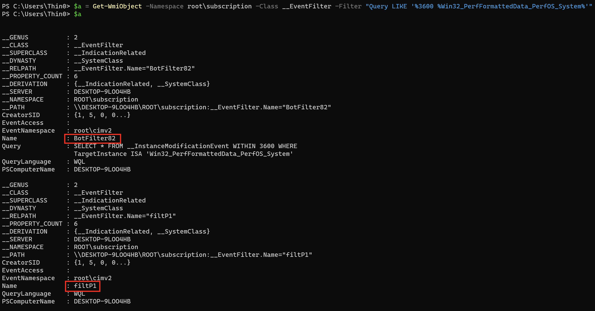
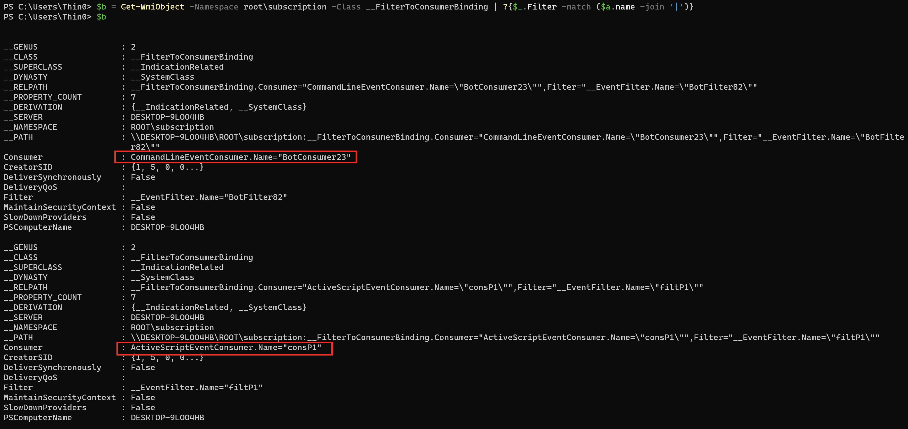
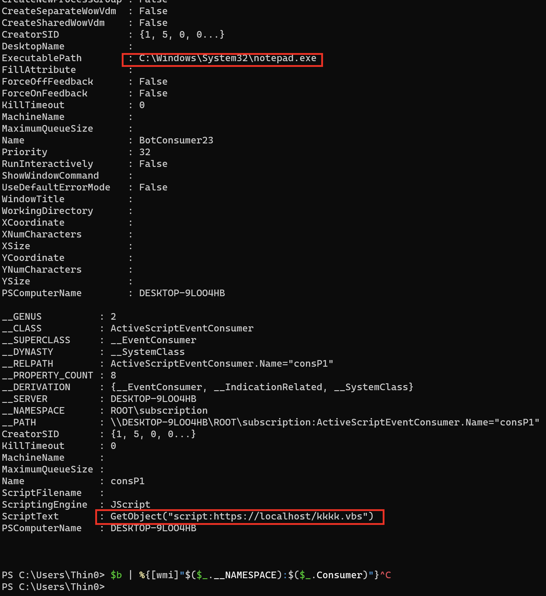
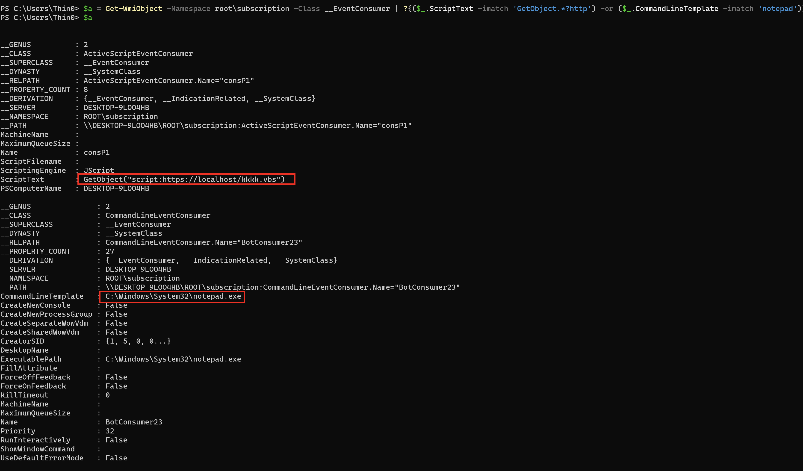
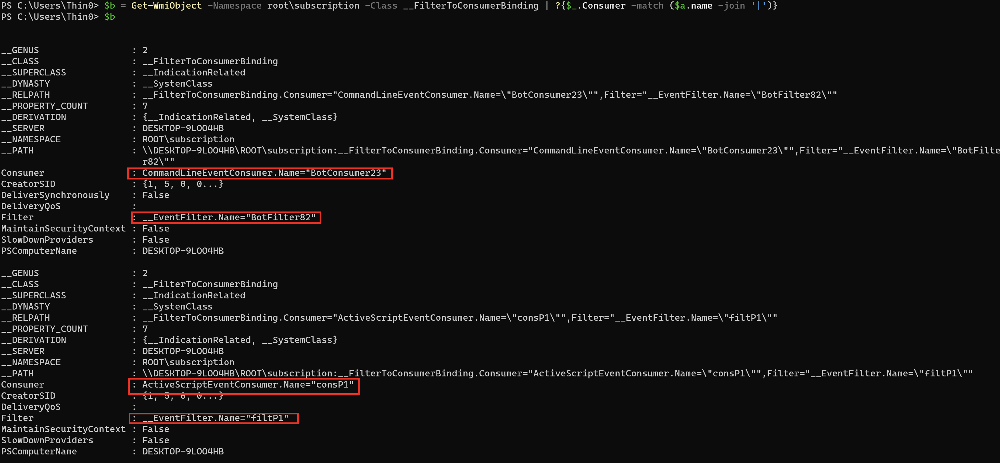
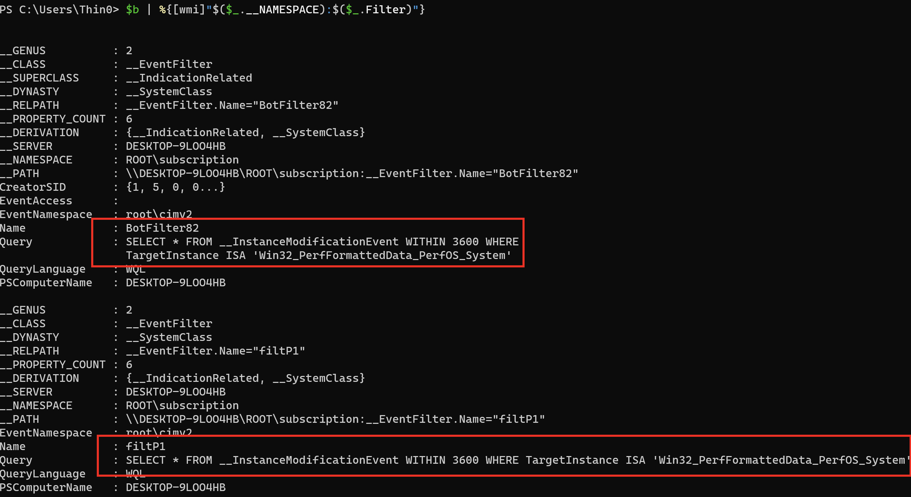

一些挖矿勒索还有某些流氓软件，经常利用 计划任务 和 wmi 定时执行无文件后门或劫持浏览器主页，利用 powershell 怎么排查？

<!--more-->

## 常见持久化进程树

```plain
a. services.exe  服务
b. svchost.exe -k netsvcs -p -s Schedule/taskeng.exe/dllhost.exe/taskhost.exe   计划任务
c. WmiPreSE.exe  wmic process create cmd /powershell 横向移动 
              wmi事件订阅 持久化 cmdline
d. scrcons.exe
              wmi事件订阅 持久化 vbs脚本
```

## 计划任务

一般的计划任务，名字比较固定，或者就放在根路径，不需要花里胡哨的东西，直接到 taskschd.msc 里找。

如果藏得比较深又比较多，懒得找，或者计划任务名字随机的，又或者修改了当前已有的计划任务启动命令为恶意命令，利用 powershell 会让这个事情变简单一些。

以执行程序作为过滤条件，例如过滤出执行 powershell 的计划任务（低版本没有 Get-ScheduledTask cmdlet）：

```powershell
Get-ScheduledTask | ?{$_.Actions.execute -imatch ".*?powershell.exe['`"]?$" } | %{[PSCustomObject]@{name = $_.taskname; path = $_.taskpath; exe = $_.Actions.execute; cmdline = $_.Actions.arguments; user = $_.Principal.UserId}} | Format-Table
```

以任务状态作为过滤条件，查找所有运行中的任务（低版本没有 Get-ScheduledTask cmdlet）：

```powershell
Get-ScheduledTask | ?{$_.State -imatch "running" } | %{[PSCustomObject]@{name = $_.taskname; path = $_.taskpath; exe = $_.Actions.execute; cmdline = $_.Actions.arguments; user = $_.Principal.UserId; status = $_.State}} | ft
```

遇到 [深入理解 Windows 计划任务及其恶意隐藏方式探究](../windows_schedule_task_internal) 中提到的任务隐藏姿势，上面的命令查不到，可以通过注册表筛选计划任务会显示更全一些，比如筛选出所有执行 powershell 的任务（2008不可以用）：

```powershell
Get-ChildItem -Recurse -Path 'HKLM:\SOFTWARE\Microsoft\Windows NT\CurrentVersion\Schedule\TaskCache\Tree\' | ?{ $_.Property -contains "Id" } | Get-ItemProperty | %{$actions = (Get-ItemProperty -Path ('HKLM:\SOFTWARE\Microsoft\Windows NT\CurrentVersion\Schedule\TaskCache\Tasks\'+$_.Id) -ea 0).Actions;if($actions){$actions = [System.Text.Encoding]::Unicode.GetString($actions, 0, $actions.Length)}; [PSCustomObject]@{name = $_.PSChildName; path = ($_.PSPath -replace '.*?\\TaskCache\\Tree\\',''); id = $_.Id; index = $_.Index; actions = ($actions -replace "[^a-z0-9A-Z:\\\._ %$\/'""]",'')}} | ?{$_.actions -imatch '.*?powershell.*?'}
```

如果已经有恶意进程的 PID，想找到与之对应的计划任务项是哪个，可以通过 COM 接口来查：

```powershell
# Evil PID
$ePid = 8372

# Initiate a COM object and connect
$TaskService = New-Object -ComObject('Schedule.Service')
$TaskService.Connect()

# Query for currently running tasks 
# 0 - the user is permitted to see. 
# 1 - 0 + Hidden
$runningTasks = $TaskService.GetRunningTasks(1)

# Get the task associated to a certain PID
$runningTasks | Where-Object{$_.EnginePID -eq $ePid} | Select-Object -ExpandProperty Path
```

其他查找恶意计划任务的命令：

```powershell
# Search TaskCache Tasks
Get-ChildItem -Path 'HKLM:\SOFTWARE\Microsoft\Windows NT\CurrentVersion\Schedule\TaskCache\Tasks\'| Get-ItemProperty | %{$actions=[System.Text.Encoding]::Unicode.GetString($_.actions, 0, $_.actions.Length); [PSCustomObject]@{path = $_.path; id = $_.PSChildName; URI = $_.URI; actions = ($actions -replace "[^a-z0-9A-Z:\\\._ %$\/'""]",'')}} | ?{$_.actions -imatch '.*?powershell.*?'}

# use COM Object
($TaskScheduler = New-Object -ComObject Schedule.Service).Connect();$TaskScheduler.GetFolder('\Microsoft\Windows').GetTasks(0) | Select Name, State, Enabled, LastRunTime, LastTaskResult

# use WMI query
GWMI -Namespace Root/Microsoft/Windows/TaskScheduler -class MSFT_ScheduledTask -Recurse | ?{$_.TaskName -imatch "Bluetool"}
```

从注册表中找到包含恶意动作的计划任务注册表项，可查隐藏计划任务（win8以上适用）：

```powershell
Get-ChildItem -Path 'HKLM:\SOFTWARE\Microsoft\Windows NT\CurrentVersion\Schedule\TaskCache\Tasks\'| %{$item = ($_|Get-ItemProperty); $actions = $item.Actions; if($actions){$actions = [System.Text.Encoding]::Unicode.GetString($actions, 0, $actions.Length)}; [PSCustomObject]@{name = $_.PSChildName; path = $item.Path; actions = ($actions -replace "[^a-z0-9A-Z:\\\._ %$\/'""]",'')}} |  ?{$_.actions -imatch '.*?(notepad|calc|powershell|wmic|regsvr).*?'}
```

win 2008 r2 比较比较老的系统中查找恶意计划任务（如果是排查隐藏任务建议system权限运行）：

```powershell
schtasks.exe /query /v /fo csv |convertfrom-csv | select @{ label = "ComputerName"; expression = { $computername } }, @{ label = "Name"; expression = { $_.TaskName } }, @{ label = "Action"; expression = {$_."Task To Run"} }, @{ label = "LastRunTime"; expression = {$_."Last Run Time"} }, @{ label = "NextRunTime"; expression = {$_."Next Run Time"} }, "Status", "Author"|?{$_.action -imatch "http|wmic|regsvr|powershell"}|%{echo $_.Name}
```

win 2008 r2 比较老的系统中查找并清理残留的计划任务注册表项（system权限运行，不要在win8以上版本运行会误删）：

```powershell
Get-ChildItem -Path 'HKLM:\SOFTWARE\Microsoft\Windows NT\CurrentVersion\Schedule\TaskCache\Tasks\'| %{$item = ($_|Get-ItemProperty); $actions = $item.Actions; if($actions){$actions = [System.Text.Encoding]::Unicode.GetString($actions, 0, $actions.Length)}; [PSCustomObject]@{name = $_.PSChildName; path = $item.Path; actions = ($actions -replace "[^a-z0-9A-Z:\\\._ %$\/'""]",'')}} |%{if (-not(test-path -path (join-path "C:\Windows\System32\Tasks" $_.path) -PathType Leaf)) { remove-item -force -path (join-path 'HKLM:\SOFTWARE\Microsoft\Windows NT\CurrentVersion\Schedule\TaskCache\Tree\' $_.path)  -erroraction SilentlyContinue; remove-item -force -path (join-path 'HKLM:\SOFTWARE\Microsoft\Windows NT\CurrentVersion\Schedule\TaskCache\Tasks\' $_.name) -erroraction SilentlyContinue;echo $_};}
```

win 2008 r2 比较老的系统中查找残留的计划任务注册表项（不建议在win8以上系统使用）：

```powershell
Get-ChildItem -Path 'HKLM:\SOFTWARE\Microsoft\Windows NT\CurrentVersion\Schedule\TaskCache\Tasks\'| %{$item = ($_|Get-ItemProperty); $actions = $item.Actions; if($actions){$actions = [System.Text.Encoding]::Unicode.GetString($actions, 0, $actions.Length)}; [PSCustomObject]@{name = $_.PSChildName; path = $item.Path; actions = ($actions -replace "[^a-z0-9A-Z:\\\._ %$\/'""]",'')}} |%{if (-not(test-path -path (join-path "C:\Windows\System32\Tasks" $_.path) -PathType Leaf)) {echo $_.path};}
```

win10 以上批量清理任务动作为*/temp/*.exe这个模式的计划任务：（清理前先在regedit中导出HKLM:\SOFTWARE\Microsoft\Windows NT\CurrentVersion\Schedule\TaskCache备份）

```powershell
Get-ChildItem -Path 'HKLM:\SOFTWARE\Microsoft\Windows NT\CurrentVersion\Schedule\TaskCache\Tasks\'| %{$item = ($_|Get-ItemProperty); $actions = $item.Actions; if($actions){$actions = [System.Text.Encoding]::Unicode.GetString($actions, 0, $actions.Length)}; [PSCustomObject]@{name = $_.PSChildName; path = $item.Path; actions = ($actions -replace "[^a-z0-9A-Z:\\\._ %$\/'""]",'')}}|?{$_.actions -ilike "*\temp\*.exe"}|?{$_.name -ne '' -or $_.path -ne ''}|%{remove-item -Force -Recurse "HKLM:\SOFTWARE\Microsoft\Windows NT\CurrentVersion\Schedule\TaskCache\Tasks\$($_.name)";Remove-Item -Force -Recurse "HKLM:\SOFTWARE\Microsoft\Windows NT\CurrentVersion\Schedule\TaskCache\Tree$($_.path)"}
```

如果已经确定存在恶意计划任务，但是通过以上这些手段就是找不到怎么办（当然前提是你会用这些命令），我建议你想办法重启服务器，如果没办法重启服务器，使用 psexec 切换到 system 账户重启 Task Schedule 服务也可以。

> 快速获取SYSTEM权限交互式cmd终端：
>
> ```cmd
> sc create testsvc binpath= "cmd /K start" type= own type= interact
> sc start testsvc
> ```

## 服务

寻找可疑的服务项：

```powershell
Get-ChildItem -Path 'HKLM:\SYSTEM\CurrentControlSet\Services\'| %{$item = ($_|Get-ItemProperty); $actions = $item.ImagePath; if ($actions -imatch "wmic|http|powershell|cmd|notepad|ProgramData|Download|rundll32|regsvr") {echo $_;}}
```

## WMI 事件订阅

这里先给几个测试用例：

用例1：1小时启动一次 notepad

```powershell
$filterName = 'BotFilter82'
$consumerName = 'BotConsumer23'
$exePath = 'C:\Windows\System32\notepad.exe'
$Query = "SELECT * FROM __InstanceModificationEvent WITHIN 3600 WHERE TargetInstance ISA 'Win32_PerfFormattedData_PerfOS_System'"
$WMIEventFilter = Set-WmiInstance -Class __EventFilter -NameSpace "root\subscription" -Arguments @{Name= $filterName;EventNameSpace="root\cimv2";QueryLanguage="WQL";Query=$Query} -ErrorAction Stop
$WMIEventConsumer = Set-WmiInstance -Class CommandLineEventConsumer -Namespace "root\subscription" -Arguments @{ Name=$consumerName;ExecutablePath=$exePath;CommandLineTemplate=$exePath}
Set-WmiInstance -Class __FilterToConsumerBinding -Namespace "root\subscription" -Arguments @{Filter=$WMIEventFilter;Consumer=$WMIEventConsumer}
```

用例2：1小时执行一次用来远程下载的脚本

```powershell
$filterName = 'filtP1'
$consumerName = 'consP1'
$Command ="GetObject(""script:https://localhost/kkkk.vbs"")"    
$Query = "SELECT * FROM __InstanceModificationEvent WITHIN 3600 WHERE TargetInstance ISA 'Win32_PerfFormattedData_PerfOS_System'"    
$WMIEventFilter = Set-WmiInstance -Class __EventFilter -NameSpace "root\subscription" -Arguments @{Name=$filterName;EventNameSpace="root\cimv2";QueryLanguage="WQL";Query=$Query} -ErrorAction Stop    
$WMIEventConsumer = Set-WmiInstance -Class ActiveScriptEventConsumer -Namespace "root\subscription" -Arguments @{Name=$consumerName;ScriptingEngine='JScript';ScriptText=$Command}    
Set-WmiInstance -Class __FilterToConsumerBinding -Namespace "root\subscription" -Arguments @{Filter=$WMIEventFilter;Consumer=$WMIEventConsumer}
```

### 排查思路 1

适合已知 `__EventFilter` 的某些特征，例如 Query 语句，或者 Name。

根据 Query 查询 `__EventFilter：`

```powershell
$a = Get-WmiObject -Namespace root\subscription -Class __EventFilter -Filter "Query LIKE '%Win32_PerfFormattedData_PerfOS_System%'"
```



根据 `__EventFilter` 查询 `__FilterToConsumerBinding：`

```powershell
$b = Get-WmiObject -Namespace root\subscription -Class __FilterToConsumerBinding | ?{$_.Filter -match ($a.name -join '|')}
```



根据 `__FilterToConsomerBinding` 查询 `__EventConsumer：`

```powershell
$b | %{Get-WmiObject -Namespace root\subscription -Class __EventConsumer -Filter "__RELPATH = '$($_.Consumer)'"}

# OR

$b | %{[wmi]"$($_.__NAMESPACE):$($_.Consumer)"}
```



### 排查思路 2

适合一切未知，想排查一下恶意软件是否利用 wmi 事件进行了持久化。

持久化，必然需要创建三个类对象：`__EventFilter`、`__FilterToConsumerBinding`、`__EventConsumer`，其中 `__EventFilter` 定义了事件过滤查询的语句（比如每 10s 查询一次名为 ss 的服务），`__FilterToConsumerBinding` 负责将 `__EventConsumer` 和 `__EventFilter` 绑定，Filter 负责提供数据，Consumer 负责指定消费数据的动作。

`__EventConsumer` 根据 [MSDN](https://docs.microsoft.com/en-us/windows/win32/wmisdk/standard-consumer-classes) 可知，有 5 种：`ActiveScriptEventConsumer`、`CommandLineEventConsumer`、`LogFileEventConsumer`、`NTEventLogEventConsumer`、`SMTPEventConsumer`。

`ActiveScriptEventConsumer` 可以指定当 Filter 中的事件被触发时执行一个预定义的 vbs 脚本，而 `CommandLineEventConsumer` 可以指定事件触发时启动的进程命令行。这两个 Consumer 经常被用来做持久化。

所以可以直接排查注册的 `ActiveScriptEventConsumer` 和 `CommandLineEventConsumer`，排查是否有持久化动作。

根据一些脚本或命令行特征，查询 `__EventConsumer`：

```powershell
$a = Get-WmiObject -Namespace root\subscription -Class __EventConsumer | ?{($_.ScriptText -imatch 'GetObject.*?http') -or ($_.CommandLineTemplate -imatch 'notepad|powershell|cmd')}
```



根据查询到的 __EventConsumer 查询 __FilterToConsomerBinding：

```powershell
$b = Get-WmiObject -Namespace root\subscription -Class __FilterToConsumerBinding | ?{$_.Consumer -match ($a.name -join '|')}
```



根据查询到的 `__FilterToConsomerBinding` 查询 `__EventFilter`：

```powershell
$b | %{Get-WmiObject -Namespace root\subscription -Class __EventFilter -Filter "__RELPATH = '$($_.Filter)'"}

# OR

$b | %{[wmi]"$($_.__NAMESPACE):$($_.Filter)"}
```


