Malware and attackers commonly use scheduled tasks as their persistence mechanism.

From a threat detection perspective, understanding how scheduled tasks run and are created, as well as the processes associated with them, is essential.

Additionally, this article investigates and explores an undisclosed scheduled task hiding technique.

<!--more-->

Now, let's begin understanding everything about scheduled tasks.

## About Scheduled Tasks

MSDN describes the details of scheduled tasks very thoroughly, including the APIs used and working mechanisms. So I won't repeat the explanation, just reference some essential information:

> The Task Scheduler service allows you to perform automated tasks on a chosen computer. With this service, you can schedule any program to run at a convenient time for you or when a specific event occurs. The Task Scheduler monitors the time or event criteria that you choose and then executes the task when those criteria are met. — [MSDN](https://docs.microsoft.com/en-us/windows/win32/taskschd/about-the-task-scheduler)

The Task Scheduler triggers tasks based on their definitions at specified times. It contains the following components:

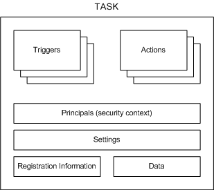

- **Triggers**: Conditions that trigger the task
- **Actions**: Actions executed when the task runs
- **Principals**: Specifies the user or user group information for running the task
- **Settings**: Specifies additional settings that affect task behavior
- **Registration Information**: Contains information such as task creation time and creator
- **Data**: Additional information used when executing the task

More information can be found on [MSDN](https://docs.microsoft.com/en-us/windows/win32/taskschd/task-scheduler-start-page).

Let's learn about the ways to create tasks.

## Creating Tasks via Command Line

### At.exe

Creating scheduled tasks using the `at` command:

```cmd
at 11:11 /every:Sunday,Monday,Tuesday "malware.exe"
```

The above command creates a scheduled task that executes malware.exe at 11:11 every Sunday, Monday, and Tuesday.

You can also use `\\ComputerName` to run on a specified computer. For more parameter information, refer to [MSDN](https://docs.microsoft.com/en-us/previous-versions/windows/it-pro/windows-xp/bb490866%28v=technet.10%29).

The following information may help investigate `at.exe`-generated scheduled tasks:

- Path: %SystemRoot%\System32\at.exe
- Privileges: Must be an administrator group user
- Investigation: Check the command line content when creating the task to see if the executable or command is malicious.
- Other:
  - Task files created by at are located at: %SystemRoot%\Tasks. Look for At[x].job files, where x represents the task ID
  - Task-related XML files are located at: %SystemRoot%\System32\Tasks
  - If task logging is enabled, check the "Applications and Services Logs/Microsoft/Windows/TaskScheduler/Operational" event log.

### schtasks.exe

`at.exe` was deprecated starting from Windows 8. Later systems use `schtasks.exe` to create scheduled tasks. The command parameters are:

```cmd
SCHTASKS /Create [/S system [/U username [/P [password]]]]
    [/RU username [/RP password]] /SC schedule [/MO modifier] [/D day]
    [/M months] [/I idletime] /TN taskname /TR taskrun [/ST starttime]
    [/RI interval] [ {/ET endtime | /DU duration} [/K] [/XML xmlfile] [/V1]]
    [/SD startdate] [/ED enddate] [/IT | /NP] [/Z] [/F] [/HRESULT] [/?]
```

schtasks is more powerful than at, providing many parameters needed for customizing tasks.

When investigating scheduled tasks, we are likely more concerned with the task execution content, which is related to the `TR` parameter.

A typical command for creating a malicious scheduled task looks like this:

```cmd
"c:\Windows\System32\schtasks.exe" /Create /SC ONCE /TN KglN9I99 /TR "cmd /c \"start /min C:\ProgramData\KglN9I99.bat\"" /ST 20:21
```

This command uses `/TN` to specify the task name as `KglN9I99`, the `/TR` parameter specifies the malicious command to run, `/ST` specifies the run time, `/SC` specifies the run schedule, and `/ED` can be used to specify the task end date, etc.

For more about `schtasks.exe` usage, refer to [MSDN](https://docs.microsoft.com/en-us/windows/win32/taskschd/schtasks).

The following information may help investigate `schtasks.exe`-generated scheduled tasks:

- Path: %SystemRoot%\System32\schtasks.exe
- Privileges: Regular user. To explicitly specify a high-privilege user to run the task, the account name and password are required.
- Investigation:
  - Check the parent process information calling schtasks to see if it has permission to create tasks
  - Check the `/TR` parameter value to see if the executable or command is malicious
- Other:
  - Task-related XML files are located at: %SystemRoot%\System32\Tasks
  - If task logging is enabled, check the "Applications and Services Logs/Microsoft/Windows/TaskScheduler/Operational" event log.

Once a task is created, a descriptive XML file about the task is automatically generated in the `%SystemRoot%\System32\Tasks` directory, containing all task information.

Note that tasks created through `taskschd.msc` are spawned directly from the `svchost.exe` process hosting the `Task Scheduler` service.

## Other Ways to Create Scheduled Tasks

### Creating via schtasks.exe and at.exe Commands

Creating tasks through system commands is the most common approach.

Creating a scheduled task running with default privileges:

```cmd
schtasks.exe /create /tn test /tr "calc.exe" /sc minute /mo 1 /f
schtasks.exe /run /tn test
schtasks.exe /end /tn test
schtasks.exe /delete /tn test /f

schtasks /create /xml c:\test\1.xml /tn test2
schtasks.exe /run /tn test2
schtasks.exe /end /tn test2
schtasks.exe /delete /tn test2 /f
```

Creating a scheduled task running with elevated privileges:

```cmd
schtasks.exe /create /tn test /tr "cmd.exe" /sc minute /mo 1 /ru "SYSTEM" /rl HIGHEST /f
schtasks.exe /run /tn test
schtasks.exe /end /tn test
schtasks.exe /delete /tn test /f
```

Tasks created by at also run with elevated privileges:

```cmd
at 00:00 cmd.exe
at {taskid} /delete /yes
```

at is not as powerful as schtasks — for example, it cannot execute every minute, nor can it specify the user under which the task runs.

### Creating via GUI taskschd.msc

Launch taskschd.msc via Win+R:

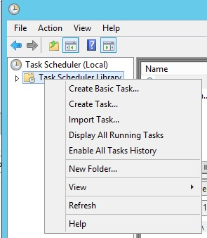

The mmc program elevates to administrator privileges upon launch, so regular users can create high-privilege tasks:

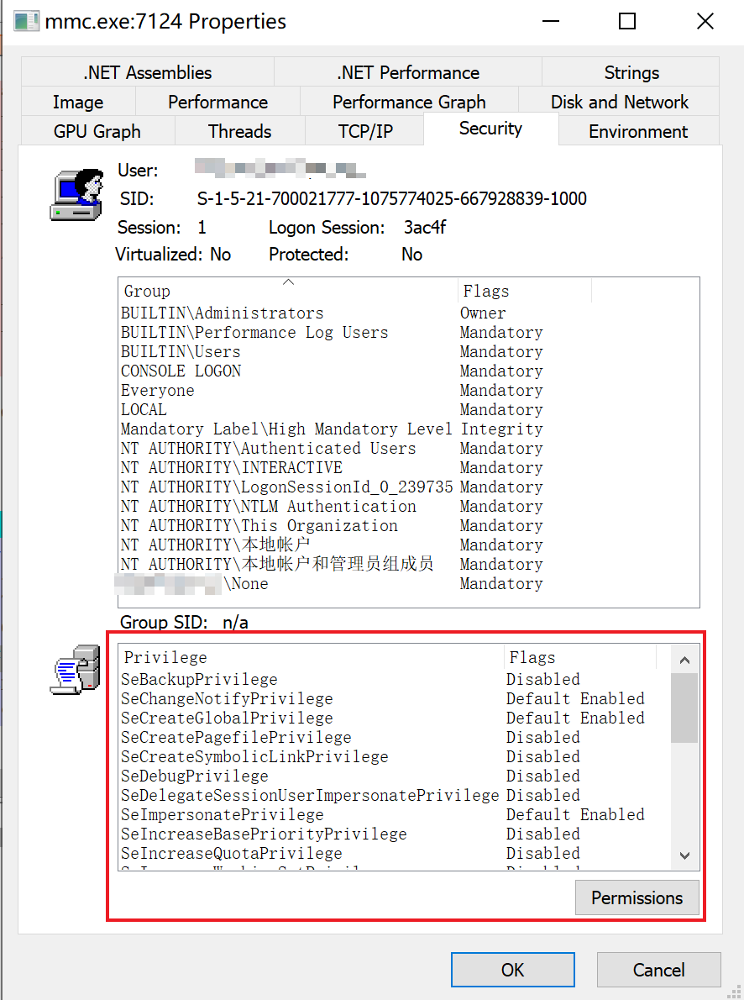

Select Task Scheduler Library, right-click -> Create Task...
A dialog appears where you can configure each setting:

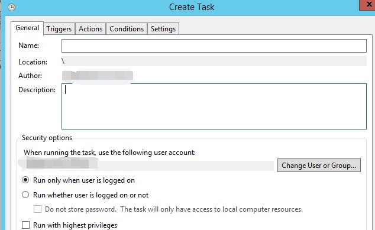

### Creating Tasks Programmatically

All code ultimately interacts with the COM service provided by `c:\windows\system32\taskschd.dll`:

- GUID: `0F87369F-A4E5-4CFC-BD3E-73E6154572DD`
- Registry path: `HKEY_LOCAL_MACHINE\SOFTWARE\Classes\CLSID\{0f87369f-a4e5-4cfc-bd3e-73e6154572dd}`

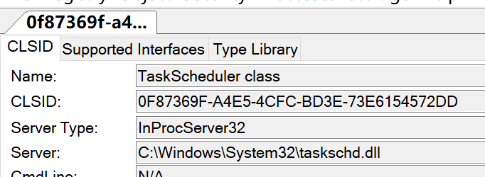

This COM component does not support Elevation and cannot auto-elevate.

Below are 2 code examples for creating scheduled tasks:

#### C#

For C# implementation, the [TaskScheduler](https://github.com/dahall/TaskScheduler) project is used for convenience:

```csharp
using System;
using System.Security.Principal;
using System.Security.AccessControl;
using Microsoft.Win32.TaskScheduler;
using System.Text.RegularExpressions;

namespace SchtaskHidden
{
    class Program
    {
        static void Main(string[] args)
        {
            //TaskCollection tt = TaskService.Instance.RootFolder.GetTasks(new Regex("test"));
            //foreach(Task ti in tt)
            //{
            //    Console.WriteLine(ti.Name);
            //}
            //System.Environment.Exit(0);
            TaskDefinition td = TaskService.Instance.NewTask();
            td.RegistrationInfo.Description = "do something";
            //td.Principal.RunLevel = TaskRunLevel.Highest;
            //td.Principal.LogonType = TaskLogonType.ServiceAccount;
            //td.Principal.UserId = "SYSTEM";

            TimeTrigger dt = new TimeTrigger();
            dt.StartBoundary = DateTime.Now;
            dt.Repetition.Interval = TimeSpan.FromMinutes(1);

            td.Triggers.Add(dt);
            td.Actions.Add("cmd.exe", "/c \"calc.exe\"", null);
            Task t = TaskService.Instance.RootFolder.RegisterTaskDefinition(path: "testxxx", definition: td, TaskCreation.CreateOrUpdate, null, null, 0);
            Console.WriteLine("success!!");
            //TaskSecurity ts = new TaskSecurity(t);
            //ts.RemoveAccessRuleAll(new TaskAccessRule(new SecurityIdentifier(WellKnownSidType.ServiceSid, null), TaskRights.Read | TaskRights.Write | TaskRights.ReadAttributes, AccessControlType.Allow));

            //t.SetAccessControl(ts);

            //Console.WriteLine("success!!");
        }
    }
}
```

#### PowerShell

```powershell
$TaskDescr = "test task"
$Author = "reinject"
$TaskName = "test"
$TaskStartTime = [datetime]::Now
$TaskCommand = "cmd.exe"
$TaskArg = "/c calc.exe"
$UserAcct = "$env:userdomain\$env:username"
# $UserAcct = "SYSTEM"

$ScheduleObject = new-object -ComObject("Schedule.Service")
# connect to the local machine. 
$ScheduleObject.Connect("localhost")
$rootFolder = $ScheduleObject.GetFolder("\")

$TaskDefinition = $ScheduleObject.NewTask(0) 
$TaskDefinition.RegistrationInfo.Description = "$TaskDescr"
$TaskDefinition.RegistrationInfo.Author = "$Author"
#$TaskDefinition.Principal.RunLevel = 1
$TaskDefinition.Settings.Enabled = $true
$TaskDefinition.Settings.AllowDemandStart = $true
$TaskDefinition.Settings.DisallowStartIfOnBatteries = $false
$TaskDefinition.Settings.ExecutionTimeLimit = "PT0S"  # See Note Below

$triggers = $TaskDefinition.Triggers
$trigger = $triggers.Create(1) # Creates a "time-based" trigger, 8: system startup
$trigger.StartBoundary = $TaskStartTime.ToString("yyyy-MM-dd'T'HH:mm:ss")
$trigger.Repetition.Interval = 1
$trigger.Enabled = $true

$Action = $TaskDefinition.Actions.Create(0)
$action.Path = "$TaskCommand"
$action.Arguments = "$TaskArg"

$rootFolder.RegisterTaskDefinition($TaskName,$TaskDefinition,6,$UserAcct,$null,3)
```

PowerShell doesn't need to be this complicated; there are built-in cmdlets:

```powershell
$taskname = "test"
$cmd = "cmd.exe"
$cmdargs = "/c calc.exe"
$username = "$env:username"
#$username = "SYSTEM"
$taskdescription = "test task"

$action = New-ScheduledTaskAction -Execute $cmd -Argument $cmdargs
$trigger = New-ScheduledTaskTrigger -Once -At (Get-Date) -RepetitionInterval (New-TimeSpan -minutes 1)
$settings = New-ScheduledTaskSettingsSet -ExecutionTimeLimit (New-TimeSpan -Minutes 0) -RestartCount 3 -RestartInterval (New-TimeSpan -Minutes 1)
Register-ScheduledTask -Action $action -Trigger $trigger -TaskName $taskname -Description $taskdescription -Settings $settings -User $username -RunLevel 1 # 1 for highest, 0 for low
```

Delete command: `Unregister-ScheduledTask -TaskName test -Confirm:$false`

## Parent Process of Spawned Task Processes (svchost.exe/taskeng.exe/taskhostw.exe)

The related service for running scheduled tasks is: `Task Scheduler`. This service is hosted using the `netsvcs` group of `SVCHOST.exe`.

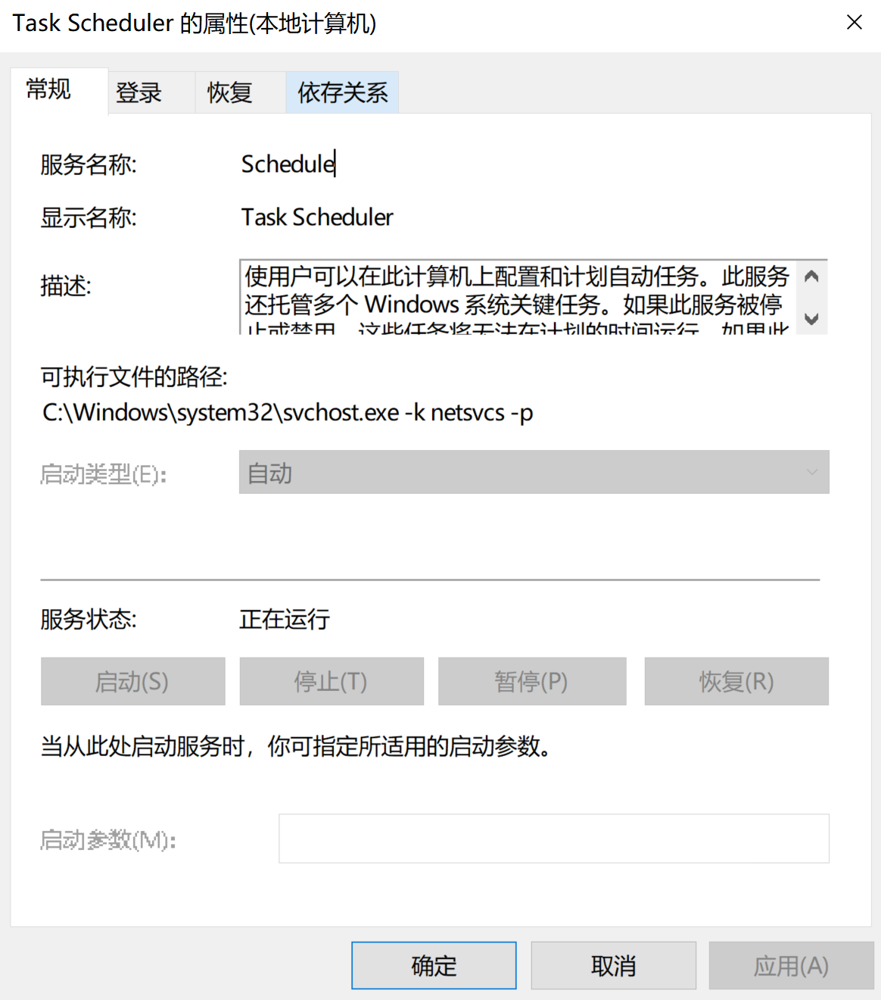

Through the process tree, the `svchost.exe` process command line is: `svchost.exe -k netsvcs -p -s Schedule`. On Windows 10.1703 and below, the `-s Schedule` parameter may not be visible.

### taskeng.exe

On older systems, the process spawning order for scheduled tasks is: svchost.exe -> taskeng.exe -> [SpecialTaskProcess], for example:

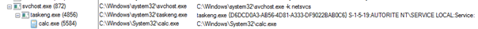

The `taskeng.exe` process parameter syntax is:

```cmd
taskeng.exe {GUID} [User SID]:[Domain]\[User Name]:[Options]
```

In some cases, there may only be a single `{GUID}` parameter. The `Options` parameter may indicate additional information such as privilege information. If a task runs in elevated mode, the `Options` content will be:

```plain
Interactive:Highest[1]
```

So on older systems, you can examine the process tree to investigate malicious processes — for example, find `taskeng.exe`'s process tree where its parent process is `svchost.exe -k netsvcs`, and the child processes are the processes for running tasks. Investigating child processes can identify malicious processes.

### svchost.exe -k netsvcs -p

Starting from Windows 10.1511, `taskeng.exe` no longer exists. On newer system versions this program cannot be found, and task processes run directly under the `svchost.exe` process hosting the `Task Scheduler` service:

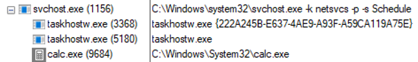

So on higher version systems, we can investigate child processes of `svchost.exe -k netsvcs` to identify malicious or suspicious programs.

### taskhostw.exe

In the image above, you can clearly notice a process named `taskhostw.exe` under `svchost.exe -k netsvcs`.

On Windows 7, this process is named: `taskhost.exe`.

On Windows 8, this process is named: `taskhostex.exe`.

This process functions similarly to `dllhost.exe` and `svchost.exe`, serving as a DLL host.

By searching the `%SystemRoot%\System32\Tasks` folder, we can find some tasks whose actions are not `Exec` but `ComHandler`.

Let's find some task XMLs for comparison, with some unnecessary fields hidden.

This is the task XML created using the `schtasks.exe` command:

```xml
<?xml version="1.0" encoding="UTF-16"?>
<Task version="1.2" xmlns="http://schemas.microsoft.com/windows/2004/02/mit/task">
  <Actions Context="Author">
    <Exec>
      <Command>"C:\Program Files (x86)\IObit\Advanced SystemCare\ASC.exe"</Command>
      <Arguments>/SkipUac</Arguments>
    </Exec>
  </Actions>
</Task>
```

This is the system `.NET Framework` scheduled task XML content, which can be found in `%SystemRoot%\System32\Tasks\Microsoft\Windows\.NET Framework` if the .NET framework is installed:

```xml
<?xml version="1.0" encoding="UTF-16"?>
<Task version="1.6" xmlns="http://schemas.microsoft.com/windows/2004/02/mit/task">
  <Actions Context="Author">
    <ComHandler>
      <ClassId>{84F0FAE1-C27B-4F6F-807B-28CF6F96287D}</ClassId>
      <Data><![CDATA[/RuntimeWide]]></Data>
    </ComHandler>
  </Actions>
</Task>
```

Manually triggering the `.NET Framework` task, which calls `ngentasklauncher.dll`, the process tree observed through ProcExp.exe:

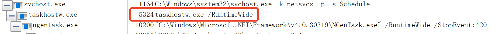

Notice that `taskhostw.exe`'s parameter `/RuntimeWide` matches what's specified in the XML's `<Data>` tag.

#### $(Arg0) Parameter

While observing the `taskhostw.exe` process tree, the following command line parameter was found:

```cmd
taskhosw.exe Install $(Arg0)
```

This is documented in [MSDN](https://docs.microsoft.com/en-us/windows/win32/taskschd/task-actions):

> Some action properties that are of type BSTR can contain $(Arg0), $(Arg1), …, $(Arg32) variables in their string values. These variables are replaced with the values that are specified in the params parameter of the IRegisteredTask::Run and IRegisteredTask::RunEx methods or are contained within the event trigger for the task.

From this we know that `$(Arg0)` and similar parameters are dynamically specified when running tasks through the `IRegisteredTask::Run[Ex]` interface. They are commonly seen in some Windows default tasks:

\Microsoft\Windows\Workplace Join\Automatic-Device-Join task:

```xml
<?xml version="1.0" encoding="UTF-16"?>
<Task xmlns="http://schemas.microsoft.com/windows/2004/02/mit/task">
  <Actions Context="LocalSystem">
    <Exec>
      <Command>%SystemRoot%\System32\dsregcmd.exe</Command>
      <Arguments>$(Arg0) $(Arg1) $(Arg2)</Arguments>
    </Exec>
  </Actions>
</Task>
```

\Microsoft\Windows\Maps\MapsToastTask task:

```xml
<?xml version="1.0" encoding="UTF-16"?>
<Task xmlns="http://schemas.microsoft.com/windows/2004/02/mit/task">
  <Actions Context="Users">
    <ComHandler>
      <ClassId>{9885AEF2-BD9F-41E0-B15E-B3141395E803}</ClassId>
      <Data><![CDATA[$(Arg0);$(Arg1);$(Arg2);$(Arg3);$(Arg4);$(Arg5);$(Arg6);$(Arg7)]]></Data>
    </ComHandler>
  </Actions>
</Task>
```

According to [MSDN](https://docs.microsoft.com/en-us/windows/win32/taskschd/task-scheduler-start-page), this parameter can be passed through the following APIs:

- [ITaskHandler::Start](https://docs.microsoft.com/en-us/windows/win32/api/taskschd/nf-taskschd-itaskhandler-start)
- [IRegisteredTask::Run](https://docs.microsoft.com/en-us/windows/win32/api/taskschd/nf-taskschd-iregisteredtask-run)
- [IRegisteredTask::RunEx](https://docs.microsoft.com/en-us/windows/win32/api/taskschd/nf-taskschd-iregisteredtask-runex)
- [IExecAction::put_Arguments](https://docs.microsoft.com/en-us/windows/win32/api/taskschd/nf-taskschd-iexecaction-put_arguments)
- [ITask::SetParameters](https://docs.microsoft.com/en-us/windows/win32/api/mstask/nf-mstask-itask-setparameters)

## Scheduled Task Registry Keys

During an incident response investigation, a malicious scheduled task was observed executing periodically in the task scheduler logs, but could not be found through `taskschd.msc` or `schtasks /query`, and even after inspecting the `%SystemRoot%\System32\Tasks` directory, it remained elusive.

Through testing, I discovered that after creating a scheduled task `test`, whether manually modifying the task XML file or deleting it, the task's execution was not affected. So I monitored the registry and found changes at `HKEY_LOCAL_MACHINE\Software\Microsoft\Windows NT\CurrentVersion\Schedule` after task creation.

Below is information about this registry path from the [winreg-kb](https://github.com/libyal/winreg-kb/blob/master/documentation/Task%20Scheduler%20Keys.asciidoc) project:

On XP, the scheduled task registry path was `HKEY_LOCAL_MACHINE\Software\Microsoft\SchedulingAgent`.

After Win7, it changed to `HKEY_LOCAL_MACHINE\Software\Microsoft\Windows NT\CurrentVersion\Schedule`, with subkeys:

|Name|Description|
|:---|:---|
|Aliases|Stores AtServiceAccount, defaults to NT AUTHORITY\System|
|CompatibilityAdapter||
|Configuration||
|CredWom||
|Handlers||
|Handshake||
|TaskCache|Stores task item information|

Task item information exists both on disk at `%SystemRoot%\System32\Tasks` and in the registry at `HKEY_LOCAL_MACHINE\Software\Microsoft\Windows NT\CurrentVersion\Schedule\TaskCache`:

`Schedule\TaskCache`:

|Name|Description|
|:---|:---|
|Boot||
|Logon||
|Plain||
|Plain||
|Tree||

`TaskCache\Tree` subkeys are named after task names. Each task's Value structure:

|Name|Type|Description|
|:---|:---|:---|
|Id|REG_SZ|{GUID}, the task's corresponding GUID|
|Index|REG_DWORD|Generally 3 for regular tasks; other values are unknown|
|SD|REG_BINARY|Security descriptor information for this task item, binary value, structure unknown|

Each `Schedule\TaskCache\Tasks\%GUID%` corresponds to a task with these Values:

|Name|Type|Description|
|:---|:---|:---|
|Actions|REG_BINARY|Binary value, action information, containing UNICODE COMMAND information|
|Date|REG_SZ|Task creation date?|
|Description|REG_SZ|Task description|
|DynamicInfo|REG_BINARY|28 bytes on Win7 and below, 32 bytes on Win8 and above|
|Hash|REG_BINARY|SHA-256 or CRC32, possibly the hash of the corresponding XML file|
|Path|REG_SZ|Task path in TaskCache\Tree|
|Schema|REG_DWORD||
|Triggers|REG_BINARY|Binary, trigger information|
|URI|REG_SZ|Task path|

For scheduled tasks created by the at command, the corresponding registry location is `Microsoft\Windows NT\CurrentVersion\Schedule\TaskCache\Tree\At1`.

## Scheduled Task Security Descriptors (SD)

The SD configuration for scheduled tasks is located in the registry at: `HKEY_LOCAL_MACHINE\Software\Microsoft\Windows NT\CurrentVersion\Schedule\TaskCache\Tree\{TaskName}\SD`, in a non-human-readable binary format:

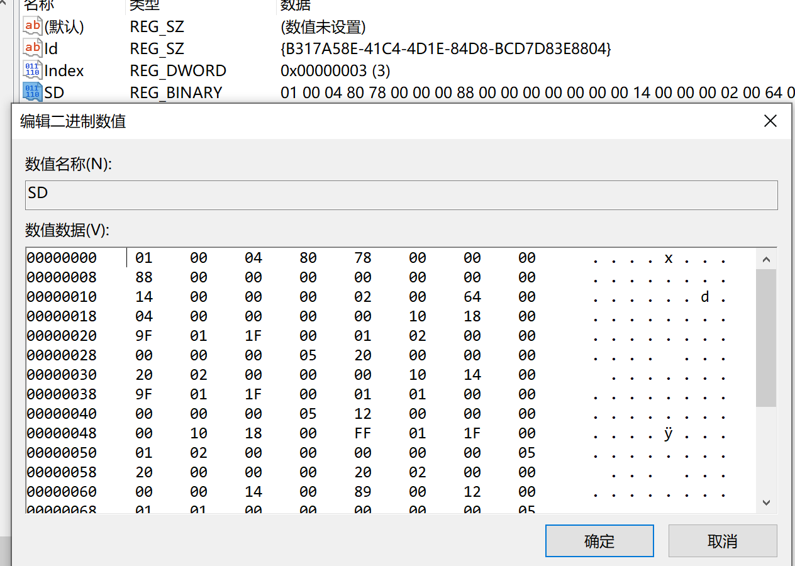

In an article about hiding Windows services, I learned that modifying an object's security descriptor information can achieve hiding. By analogy, scheduled task hiding should also be achievable by changing the security descriptor (SD).

The built-in schtasks.exe tool does not support SD configuration; it needs to be done through APIs. Searching MSDN, I didn't find documentation on how to write SDDL for TASKs. Related API list:

- [IRegistrationInfo::put_SecurityDescriptor](https://docs.microsoft.com/en-us/windows/win32/api/taskschd/nf-taskschd-iregistrationinfo-put_securitydescriptor)
- [ITaskFolder::CreateFolder](https://docs.microsoft.com/en-us/windows/win32/api/taskschd/nf-taskschd-itaskfolder-createfolder)
- [ITaskFolder::CreateFolder](https://docs.microsoft.com/en-us/windows/win32/api/taskschd/nf-taskschd-itaskfolder-registertask)
- [ITaskFolder::RegisterTaskDefinition](https://docs.microsoft.com/en-us/windows/win32/api/taskschd/nf-taskschd-itaskfolder-registertaskdefinition)
- [ITaskFolder::SetSecurityDescriptor](https://docs.microsoft.com/en-us/windows/win32/api/taskschd/nf-taskschd-itaskfolder-setsecuritydescriptor)
- [IRegisteredTask::SetSecurityDescriptor](https://docs.microsoft.com/en-us/windows/win32/api/taskschd/nf-taskschd-iregisteredtask-setsecuritydescriptor)

These APIs can be used to set the SD of a TASK. I attempted to use the [TaskScheduler](https://github.com/dahall/TaskScheduler) project for task creation, as it is more convenient:

```csharp
using System;
using System.Security.Principal;
using System.Security.AccessControl;
using Microsoft.Win32.TaskScheduler;

namespace SchTaskOpt
{
    class Program
    {
        static void Main(string[] args)
        {
            TaskDefinition td = TaskService.Instance.NewTask();
            td.RegistrationInfo.Description = "do something";
            td.Principal.RunLevel = TaskRunLevel.Highest;
            td.Principal.LogonType = TaskLogonType.ServiceAccount;
            td.Principal.UserId = "SYSTEM";
            td.RegistrationInfo.SecurityDescriptorSddlForm = @"D:P(D;;DCLCWPDTSD;;;IU)(A;;CCLCSWLOCRRC;;;IU)(A;;CCLCSWLOCRRC;;;SU)(A;;CCLCSWRPWPDTLOCRRC;;;SY)";

            DailyTrigger dt = new DailyTrigger();
            dt.StartBoundary = DateTime.Now;
            dt.DaysInterval = 1;
            dt.Repetition.Interval = TimeSpan.FromMinutes(1);

            //td.Triggers.Add(dt);
            td.Actions.Add("notepad", null, null);
            Task t =  TaskService.Instance.RootFolder.RegisterTaskDefinition(path:"test2", definition:td, TaskCreation.CreateOrUpdate, null, null, TaskLogonType.ServiceAccount);
            Console.WriteLine("success!!");
            //TaskSecurity ts = new TaskSecurity(t);
            //ts.AddAccessRule(new TaskAccessRule(new SecurityIdentifier(WellKnownSidType.AuthenticatedUserSid, null), TaskRights.Read | TaskRights.Write | TaskRights.ReadAttributes, AccessControlType.Deny));

            //t.SetAccessControl(ts);

            Console.WriteLine("success!!");
        }
    }
}
```

Unfortunately, it threw an error. Whether running as an administrator or as SYSTEM, it failed to work properly:

```powershell
PS C:\source\SchTaskOpt\bin\> .\SchTaskOpt.exe

Unhandled Exception: System.Runtime.InteropServices.COMException: Exception from HRESULT: 0xD0000061
   at Microsoft.Win32.TaskScheduler.V2Interop.ITaskFolder.RegisterTaskDefinition(String Path, ITaskDefinition pDefinition, Int32 flags, Object UserId, Object password, TaskLogonType LogonType, Object sddl)
   at Microsoft.Win32.TaskScheduler.TaskFolder.RegisterTaskDefinition(String path, TaskDefinition definition, TaskCreation createType, String userId, String password, TaskLogonType logonType, String sddl)
```

Let's set this question aside for now. We need to clearly understand the SD format auto-generated for each task in the registry to make progress. This [type structure inventory](https://docs.microsoft.com/en-us/openspecs/windows_protocols/ms-dtyp/) may be useful.

## Investigating Scheduled Task Hiding Techniques

Imagine that if we knew all the structure formats and meanings in the registry, we could manually create scheduled tasks by adding registry entries. In practice, I haven't attempted to figure out the meaning of all field values, so for now I can only use the registry for hiding and deleting scheduled tasks.

I deeply investigated scheduled task hiding techniques. Through continuous testing, I discovered two methods for hiding tasks:

### Partial Hiding

To hide a scheduled task, you can modify the `Index` value of the corresponding task in `Schedule\TaskCache\Tree`. The default value is normally 3; changing it to 0 achieves hiding. Steps:

- Launch a SYSTEM-privilege cmd: `psexec64 -i -s cmd.exe`
- Run regedit to launch the Registry Editor with SYSTEM privileges
- Modify the Index value of the corresponding task under `HKEY_LOCAL_MACHINE\Software\Microsoft\Windows NT\CurrentVersion\Schedule\TaskCache\Tree` to `0`
- Delete the corresponding XML file under `%SystemRoot%\System32\Tasks`

Advantages:

- The task is invisible when querying through `taskschd.msc`, `schtasks /query`, or even system APIs

Disadvantages:

- Not fully hidden — if you know the task name, you can still find it via `schtasks /query /tn {TaskName}`
- Requires SYSTEM privileges regardless of whether the task is low or high privilege (tested on Win10; older versions may not have this requirement — needs testing)

#### Test Case

```powershell
PS C:\> schtasks.exe /create /tn test /tr "calc.exe" /sc minute /mo 1 /ru "administrator"
SUCCESS: Successfully created scheduled task "test".
PS C:\> schtasks.exe /query /tn test

Folder: \
TaskName                                 Next Run Time          Status
======================================== ====================== ===============
test                                     2021/1/11 14:54:00     Ready
PS C:\> schtasks.exe /query|findstr test
test                                     2021/1/11 14:55:00     Ready
PS C:\> Set-ItemProperty -Path "HKLM:\Software\Microsoft\Windows NT\CurrentVersion\Schedule\TaskCache\Tree\test" -Name "Index" -Value 0
PS C:\> schtasks.exe /query|findstr test
PS C:\> schtasks.exe /delete /tn test /f
SUCCESS: The scheduled task "test" was successfully deleted.
PS C:\>
```

#### Investigation of the Principle

The meaning of `Index` is unknown and won't be discussed for now.

### Complete Hiding

In theory, hiding should be achievable by configuring the task SD, but I was unable to succeed. However, during a test, I accidentally deleted the SD entry directly from the registry and discovered that the task information could not be found by any means — achieving complete hiding:

- Launch a SYSTEM-privilege cmd: `psexec64 -i -s cmd.exe`
- Run regedit to launch the Registry Editor with SYSTEM privileges
- Delete `HKEY_LOCAL_MACHINE\Software\Microsoft\Windows NT\CurrentVersion\Schedule\TaskCache\Tree\{TaskName}\SD`
- Delete the corresponding XML file under `%SystemRoot%\System32\Tasks`

Advantages:

- The task cannot be found by any method (except through the registry), making it quite thorough

Disadvantages:

- Requires SYSTEM privileges regardless of whether the task is low or high privilege (tested on Win10; older versions may not have this requirement — needs testing)

#### Test Case

Below is PowerShell code used for testing (not universal — the binary content needs to be dumped from a normally created task first):

```powershell
$taskname = "test"
$uuid = "{3EC79FBB-0533-4356-89B3-8CE2003F1CD8}"
$cmd = "calc.exe"

New-Item -Path "HKLM:\SOFTWARE\Microsoft\Windows NT\CurrentVersion\Schedule\TaskCache\Tasks\" -Name $uuid
New-ItemProperty -Path "HKLM:\SOFTWARE\Microsoft\Windows NT\CurrentVersion\Schedule\TaskCache\Tasks\$uuid\" -Name "Path" -Value "\$taskname" -Type String -Force
New-ItemProperty -Path "HKLM:\SOFTWARE\Microsoft\Windows NT\CurrentVersion\Schedule\TaskCache\Tasks\$uuid\" -Name "URI" -Value "\$taskname" -Type String -Force
New-ItemProperty -Path "HKLM:\SOFTWARE\Microsoft\Windows NT\CurrentVersion\Schedule\TaskCache\Tasks\$uuid\" -Name "Schema" -Value 0x00010002 -Type DWORD -Force

$triggerstring = "FwAAAAAAAAABBwEAAAAIAAAI/NDz5dYBAAcBAAAACAD//////////zghQUNISEhI38PL80hISEgOAAAASEhISEEAdQB0AGgAbwByAAAASEgAAAAASEhISABISEhISEhIAEhISEhISEgBAAAASEhISBwAAABISEhIAQUAAAAAAAUVAAAAEXy5KUkCH0AHyc8n6AMAAEhISEgsAAAASEhISFQARQBDAEgATABJAFUAMQAwADUANwBcAHQAZQBjAGgAbABpAHUAAAAAAAAASEhISCwAAABISEhIWAIAABAOAACA9AMA/////wcAAAAAAAAAAAAAAAAAAAAAAAAAAAAAAAAAAABISEhI3d0AAAAAAAABBwEAAAAIAAAI/NDz5dYBAAAAAAAAAAAAAAAAAAAAAAAAAAAAAAAAAAAAAAAAAAA8AAAAAAAAAP////8AAAAAAAAAAAAAAAAAAcVLAQAAAAAAAAB2oQAAAAAAAEhISEg="
$triggerbytes = [System.Convert]::FromBase64String($triggerstring)
$actionbytes = [byte[]](0x03,0x00,0x0c,0x00,0x00,0x00,0x41,0x00,0x75,0x00,0x74,0x00,0x68,0x00,0x6f,0x00,0x72,0x00,0x66,0x66,0x00,0x00,0x00,0x00,0x10,0x00,0x00,0x00) + [System.Text.Encoding]::Unicode.GetBytes($cmd) + [byte[]](0x00,0x00,0x00,0x00,0x00,0x00,0x00,0x00,0x00,0x00)

New-ItemProperty -Path "HKLM:\SOFTWARE\Microsoft\Windows NT\CurrentVersion\Schedule\TaskCache\Tasks\$uuid\" -Name "Triggers" -Value $triggerbytes -Type binary -Force
New-ItemProperty -Path "HKLM:\SOFTWARE\Microsoft\Windows NT\CurrentVersion\Schedule\TaskCache\Tasks\$uuid\" -Name "Actions" -Value $actionbytes -Type binary -Force

New-Item -Path "HKLM:\SOFTWARE\Microsoft\Windows NT\CurrentVersion\Schedule\TaskCache\Tree" -Name $taskname -Force
New-ItemProperty -Path "HKLM:\SOFTWARE\Microsoft\Windows NT\CurrentVersion\Schedule\TaskCache\Tree\$taskname" -Name "Id" -Value "{3EC79FBB-0533-4356-89B3-8CE2003F1CD8}" -Type string -Force
New-ItemProperty -Path "HKLM:\SOFTWARE\Microsoft\Windows NT\CurrentVersion\Schedule\TaskCache\Tree\$taskname" -Name "Index" -Value 0x3 -Type DWORD -Force

#Remove-Item -Path "HKLM:\SOFTWARE\Microsoft\Windows NT\CurrentVersion\Schedule\TaskCache\Tree\$taskname" -Force
#Remove-Item -Path "HKLM:\SOFTWARE\Microsoft\Windows NT\CurrentVersion\Schedule\TaskCache\Tasks\$uuid" -Force
```

A more universal test case:

```powershell
PS C:\> schtasks.exe /create /tn test /tr "calc.exe" /sc minute /mo 1 /ru "administrator"
SUCCESS: Successfully created scheduled task "test".
PS C:\> schtasks.exe /query /tn test

Folder: \
TaskName                                 Next Run Time          Status
======================================== ====================== ===============
test                                     2021/1/11 14:56:00     Ready
PS C:\> schtasks.exe /query|findstr test
test                                     2021/1/11 14:56:00     Ready
PS C:\> Remove-ItemProperty -Path "HKLM:\SOFTWARE\Microsoft\Windows NT\CurrentVersion\Schedule\TaskCache\Tree\test" -Name "SD"
PS C:\> schtasks.exe /query /tn test
ERROR: The system cannot find the file specified.
PS C:\> schtasks.exe /query|findstr test
PS C:\>
```

Deleting tasks created this way is more involved:

```powershell
$taskname = "test"
$uuid = (Get-ItemProperty -Path "HKLM:\SOFTWARE\Microsoft\Windows NT\CurrentVersion\Schedule\TaskCache\Tree\$taskname" -Name "Id").Id
Remove-Item -Path "HKLM:\SOFTWARE\Microsoft\Windows NT\CurrentVersion\Schedule\TaskCache\Tasks\$uuid"
Remove-Item -Path "HKLM:\SOFTWARE\Microsoft\Windows NT\CurrentVersion\Schedule\TaskCache\Tree\$taskname"

sc.exe stop schedule
sc.exe start schedule
```

#### Investigation of the Principle

Through process monitoring, I found the following flow during scheduled task information queries (steps 3 and 4 are inferred):

1. Query `HKLM\SOFTWARE\Microsoft\Windows NT\CurrentVersion\Schedule\TaskCache\Tree\SD` — continue if found, terminate if not
2. Enumerate `HKLM\SOFTWARE\Microsoft\Windows NT\CurrentVersion\Schedule\TaskCache\Tree\{TaskName}`, querying values like `Id`, `Index`, `SD`, etc.
3. The queried `SD` value affects whether the user has permission to view the task information — whether the task can be found is closely tied to this value
4. Permission check based on the `SD` value
   - If permission passes, format and output the task details from `HKLM\SOFTWARE\Microsoft\Windows NT\CurrentVersion\Schedule\TaskCache\Tasks\{TaskId}`
   - If permission fails, proceed to query the next task

Normal task query:

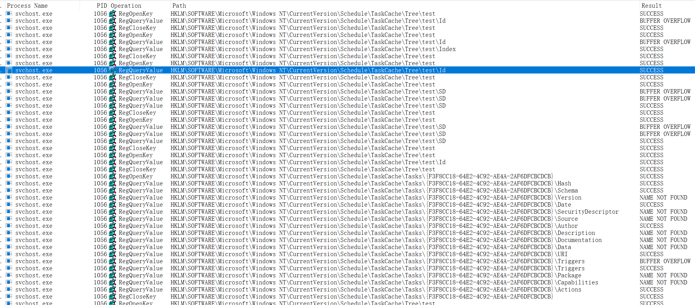

Task query after deleting SD:

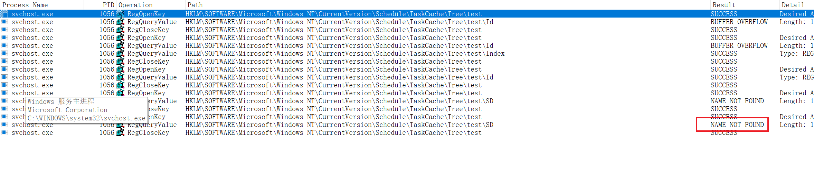

As shown, because the task's SD information cannot be found and the system cannot determine whether the user has permission to view the task, the system directly denies access:

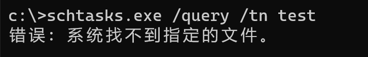

## Defending Against Malicious Use of Scheduled Tasks

1. Configure scheduled tasks to only run under authenticated users, preventing execution under the SYSTEM account. This can be configured in GPO — refer to [Allow server operators to schedule tasks](https://docs.microsoft.com/en-us/previous-versions/windows/it-pro/windows-server-2012-R2-and-2012/jj852168(v=ws.11)?redirectedfrom=MSDN)
2. Configure process priority modification to only be allowed by the administrators user group. This can be configured in GPO — refer to [Increase scheduling priority](https://docs.microsoft.com/en-us/previous-versions/windows/it-pro/windows-server-2012-R2-and-2012/dn221960(v=ws.11)?redirectedfrom=MSDN)

## Summary

This article covered the following topics:

- Scheduled task item structure information
- Various methods for creating scheduled tasks
- Scheduled task locations on disk and in the registry
- Scheduled task security descriptor configuration methods
- Parent-child process analysis during task scheduling
- Process parameters of `taskeng.exe` and `taskhostw.exe`
- Scheduled task hiding techniques

## Follow-up

After participating in several incident response cases related to hidden scheduled tasks in 2021, I published [Deep Dive into Windows Scheduled Tasks and Malicious Hiding Techniques](./深入理解计划任务及其恶意隐藏方式探究.pdf). Subsequently, as related exploitation samples increased, Defender for Endpoint added detection support for hidden scheduled tasks in 2022 ([post](https://www.microsoft.com/en-us/security/blog/2022/04/12/tarrask-malware-uses-scheduled-tasks-for-defense-evasion/)).

## References

- [https://docs.microsoft.com/en-us/windows/win32/taskschd/task-scheduler-start-page](https://docs.microsoft.com/en-us/windows/win32/taskschd/task-scheduler-start-page)
- [https://docs.microsoft.com/en-us/previous-versions/windows/desktop/automat/bstr](https://docs.microsoft.com/en-us/previous-versions/windows/desktop/automat/bstr)
- [https://docs.microsoft.com/en-us/windows/application-management/svchost-service-refactoring](https://docs.microsoft.com/en-us/windows/application-management/svchost-service-refactoring)
- [https://nasbench.medium.com/a-deep-dive-into-windows-scheduled-tasks-and-the-processes-running-them-218d1eed4cce](https://nasbench.medium.com/a-deep-dive-into-windows-scheduled-tasks-and-the-processes-running-them-218d1eed4cce)
- [https://attack.mitre.org/techniques/T1053/002/](https://attack.mitre.org/techniques/T1053/002/)
- [https://attack.mitre.org/techniques/T1053/005/](https://attack.mitre.org/techniques/T1053/005/)
- [https://github.com/libyal/winreg-kb/blob/master/documentation/Task%20Scheduler%20Keys.asciidoc](https://github.com/libyal/winreg-kb/blob/master/documentation/Task%20Scheduler%20Keys.asciidoc)
- [https://docs.microsoft.com/en-us/openspecs/windows_protocols/ms-dtyp/](https://docs.microsoft.com/en-us/openspecs/windows_protocols/ms-dtyp/)
- [https://github.com/dahall/TaskScheduler](https://github.com/dahall/TaskScheduler)
- [https://docs.microsoft.com/en-us/windows/win32/taskschd/task-scheduler-start-page](https://docs.microsoft.com/en-us/windows/win32/taskschd/task-scheduler-start-page)
