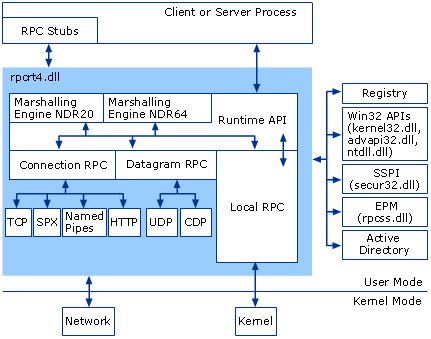
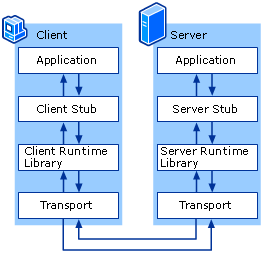
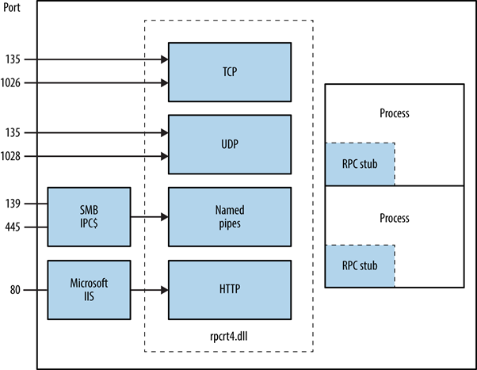
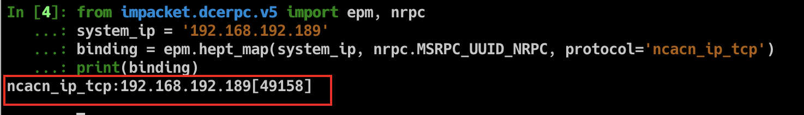
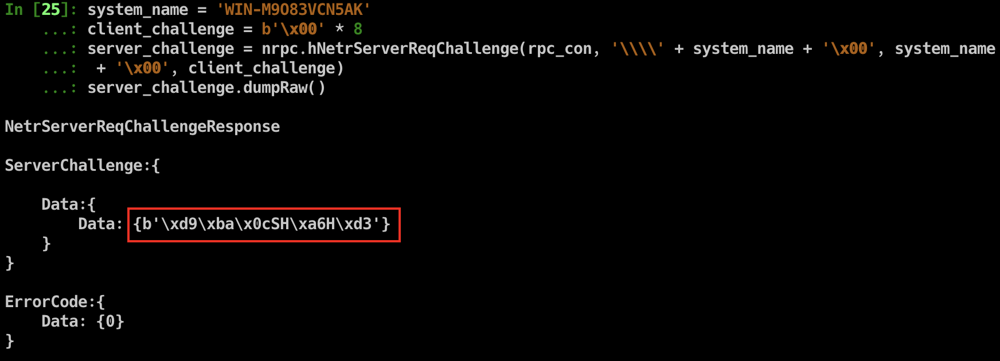

## Introduction to RPC

Microsoft Remote Procedure Call (RPC) is a remote procedure call protocol that implements distributed inter-process communication, based on DCE/RPC.

Many services in current Windows systems rely on RPC for remote services, such as: Printer, DNS, DCOM, Scheduled Tasks, WINRM, WMI, etc.

In a complete RPC system, there are the following roles:

- **Client**: The client program that sends requests to the server.
- **Server**: The server program that responds to client requests.
- **Endpoint**: The port listened on by the server to receive inbound requests.
- **Endpoint Mapper (EPM)**: Dynamically allocates ports (Endpoints) for the Server and provides Endpoint query resolution services for the Client, similar to DNS.
- **Client Stub**: The function parameter data stub required to initiate a remote procedure call to an interface or program.
- **Server Stub**: The result data stub for the server program's response to the client request.

Reference: [MSDN](https://docs.microsoft.com/zh-cn/previous-versions/windows/it-pro/windows-server-2003/cc787851(v=ws.10))

## How RPC Works

### RPC Architecture



RPC runtime functionality is provided by rpcrt4.dll. Through the functions provided by this DLL, you can register RPC services or communicate with RPC services. My focus is mainly on the client-server communication process.

### RPC Client/Server Interaction





- **Application**: Refers to C/S programs.
- **Stub**: Parameters or response results need to be packed into binary data transmittable over the network according to the interface's data constraints, called stubs. The data structures for pack/unpack must ultimately satisfy the Network Data Representation (NDR) format.
- **Runtime Library**: Refers to rpcrt4.dll.
- **Transport**: RPC only defines the binary data format for interface I/O. Data can be transmitted over different network protocols: TCP, UDP, SMB, HTTP, etc.

Note: There are two NDR engines in the RPC runtime library: NDR20 and NDR64. 32-bit clients use NDR20 for packing stubs; 64-bit clients can use either NDR20 or NDR64. Before initiating a request, the client needs to negotiate the NDR version with the server, so a Bind is sent before all RPC requests.

Depending on the Transport, RPC types are divided into connection-oriented and connectionless:

|Transport Protocol|RPC Type|
|----|----|
|UDP|Connectionless|
|TCP|Connection-oriented|
|SPX|Connection-oriented|
|SMB|Connection-oriented|
|HTTP|Connection-oriented|
|CDP|Connectionless|

The commonly used Transports are TCP, SMB, and HTTP. Whether the RPC communication is encrypted depends on the Transport used. For example, if TCP is used, the communication is in plaintext.

### Ports Used by RPC Services

Windows has many RPC services, and they don't all use the same listening port. Instead, dynamic allocation is used. When registering, an RPC service provides a UUID identifier and data transport type to register with EPM. EPM provides RPC service and port query functionality to clients. The following table lists the ports normally used by RPC:

|Service Name|UDP|TCP|
|----|----|----|
|HTTP|80,443,593|80,443,593|
|Named Pipes (SMB)|445|445|
|RPC Endpoint Mapper (EPM)|135|135|
|RPC Server Programs|Dynamically Allocated|Dynamically Allocated|

Note: Not all RPC services provide TCP or HTTP transport.

Reference: [MSDN](https://docs.microsoft.com/zh-cn/previous-versions/windows/it-pro/windows-server-2003/cc738291(v=ws.10)#network-ports-used-by-rpc)

### Packet Structure

Every RPC packet follows this format:

```cpp
// +--------------------------+
// |                          |
// |         PDU Header       |
// |                          |
// +--------------------------+
// |                          |
// |          PDU Body        |
// |                          |
// +--------------------------+
// |                          |
// |        sec_trailer       |
// |                          |
// +--------------------------+
// |                          |
// |   authentication token   |
// |                          |
// +--------------------------+

// +--------------+--------------+------------+-------------+--------------------+------------+------------+--------+------+----------+-----------+
// | MajorVersion | MinorVersion | PacketType | PacketFlags | DataRepresentation | FragLength | AuthLength | CallId | Body | AuthInfo | AuthDatas |
// +--------------+--------------+------------+-------------+--------------------+------------+------------+--------+------+----------+-----------+
```

## Interacting with RPC Using impacket

There are generally two ways to interact with RPC:

1. Use Microsoft-provided IDL files to generate corresponding RPC interface client functions
   - Pros: Can directly generate cpp, compiled into native programs
   - Cons: Some communication data cannot be modified, and MIDL-generated C files require extensive debugging before they can compile properly
2. Use third-party tools to send requests, such as impacket
    - Pros: Writing tools with it is very smooth thanks to Python's language features
    - Cons: Since it's written in Python, in some cases you may need to transfer the tool to the target environment, which requires Python installed or packaging it as an exe

Most Windows RPC vulnerability tools leverage impacket, so here's a brief introduction on how to use it.

impacket is a mature Python library that implements multiple network protocols: SMB, DCERPC, NTLM, Kerberos, etc. With the many high-level methods provided by this library, you can quickly perform network protocol testing. Many current RPC, SMB, and Kerberos vulnerability exploits use it.

Project: [https://github.com/SecureAuthCorp/impacket](https://github.com/SecureAuthCorp/impacket)

Suppose we need to interact with the NETLOGON service. We first need to interact with the RPC Endpoint Mapper (EPM) service to get the communication address (IP, port) of the target RPC service:

```python
from impacket.dcerpc.v5 import epm, nrpc, transport
system_ip = '192.168.192.189'
binding = epm.hept_map(system_ip, nrpc.MSRPC_UUID_NRPC, protocol='ncacn_ip_tcp')
print(binding)
```

From the epm.hept_map parameters, we need to provide the target IP, the UUID that uniquely identifies the target service, and the underlying communication protocol. impacket provides UUIDs for most RPC services. nrpc.MSRPC_UUID_NRPC represents the NETLOGON service UUID, and ncacn_ip_tcp indicates TCP as the underlying protocol.

Result:



NETLOGON communication address: 192.168.192.189:49158.

Next, impacket further wraps sockets. Based on the binding_string, it automatically generates the corresponding socket for easier connection:

```python
rpc_con = transport.DCERPCTransportFactory(binding).get_dce_rpc()
rpc_con.connect()
```

By sending a bind request, the client handshakes with the target RPC service. This process requires providing interface version and NDR version information to negotiate how communication data will be parsed:

```python
rpc_con.bind(nrpc.MSRPC_UUID_NRPC)
```

After a successful handshake, you can call the methods provided by the RPC service. For example, using NetrServerReqChallenge to get the server_challenge:

```python
system_name = 'WIN-M9O83VCN5AK'
client_challenge = b'\x00' * 8
server_challenge = nrpc.hNetrServerReqChallenge(rpc_con, '\\\\' + system_name + '\x00', system_name + '\x00', client_challenge)
server_challenge.dumpRaw()
```

Result:



The ZeroLogon vulnerability targets the NETLOGON service. For further operations, refer to [zerologon_tester.py](https://github.com/SecuraBV/CVE-2020-1472/blob/master/zerologon_tester.py).

## References

- [https://docs.microsoft.com/zh-cn/previous-versions/windows/it-pro/windows-server-2003/cc738291(v=ws.10)#network-ports-used-by-rpc](https://docs.microsoft.com/zh-cn/previous-versions/windows/it-pro/windows-server-2003/cc738291(v=ws.10)#network-ports-used-by-rpc)
- [https://docs.microsoft.com/zh-cn/previous-versions/windows/it-pro/windows-server-2003/cc787851(v=ws.10)](https://docs.microsoft.com/zh-cn/previous-versions/windows/it-pro/windows-server-2003/cc787851(v=ws.10))
