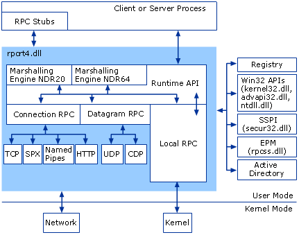
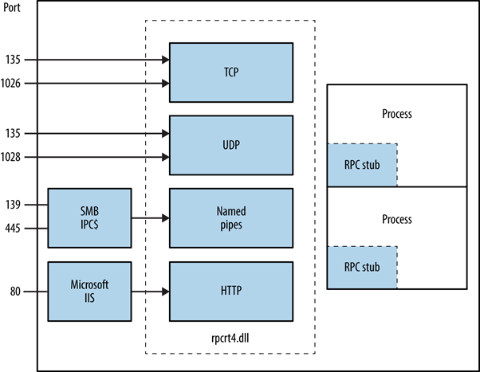
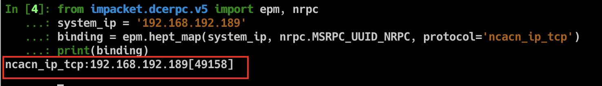
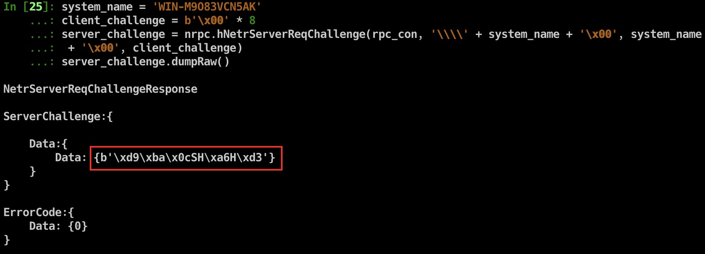

## RPC 简介

Microsoft Remote Procedure Call (RPC) 是一种实现分布式进程间通信的远程过程调用协议，基于 DCE/RPC 实现。

当前 Windows 系统中有很多服务依赖于 RPC 进行远程服务，例如：打印机、DNS、DCOM、计划任务、WINRM、WMI 等。

在一个完整的 RPC 系统中，有以下角色：

- **Client**：客户端程序，向服务端发起请求。
- **Server**：服务端程序，响应来自客户端的请求。
- **Endpoint**：被服务端监听用来接收入站请求的端口。
- **Endpoint Mapper (EPM)**：为 Server 动态分配端口 (Endpoint)，并为 Client 提供 Endpoint 查询解析服务，有点类似于 DNS。
- **Client Stub**：对某个接口或程序发起远程过程调用请求必须要包含的函数参数数据存根。
- **Server Stub**：服务程序响应客户端请求的结果数据存根。

参考：[MSDN](https://docs.microsoft.com/zh-cn/previous-versions/windows/it-pro/windows-server-2003/cc787851(v=ws.10))

## RPC 工作方式

### RPC 架构



RPC 运行时功能由 rpcrt4.dll 提供实现，通过该 dll 提供的功能可以实现注册 RPC 服务或者和 RPC 服务通信。我的关注点主要在客户端和服务端通信过程。

### RPC C/S 交互




- **Application**：指的是 C/S 程序。
- **Stub**：需要按照该接口的数据约束将 参数或响应结果 pack 成可在网络中传输的二进制体，称为存根。pack/unpack 的数据结构最终都要满足 Network Data Representation (NDR) 格式。
- **Runtime Library**：指的就是 rpcrt4.dll。
- **Transport**：RPC 仅定义接口IO的二进制数据格式，数据可以基于不同的网络协议进行传输：TCP、UDP、SMB、HTTP 等。

注：在 RPC 运行库中有两种 NDR 引擎：NDR20 和 NDR64。32 位客户端 pack stub 用 NDR20；64 位客户端既可以用 NDR20 也可以 NDR64。客户端发起请求前需要先和服务端约定一下使用的 NDR 版本，故在所有 RPC 请求开始之前会先发起 Bind。

根据 Transport 的不同，RPC 的类型也分 有连接 和 无连接两种：

|Transport 协议|RPC 类型|
|----|----|
|UDP|无连接|
|TCP|有连接|
|SPX|有连接|
|SMB|有连接|
|HTTP|有连接|
|CDP|无连接|

常用的 Transport 有 TCP、SMB、HTTP 这三种。RPC 通信过程是否加密就取决于使用的 Transport，例如如果使用 TCP，通信过程就是明文可见的。

### RPC 服务使用的端口

Windows RPC 服务很多，所有服务并不是使用的同一个监听端口，而是采用动态分配的原则。RPC 服务注册时会提供一个 UUID 标识和数据传输类型向 EPM 注册。EPM 向客户端提供 RPC 服务和端口的查询功能。下面这个表格提供了正常情况下被 RPC 使用的端口列表：

|服务名称|UDP|TCP|
|----|----|----|
|HTTP|80,443,593|80,443,593|
|Named Pipes (SMB)|445|445|
|RPC Endpoint Mapper (EPM)|135|135|
|RPC Server Programs|动态分配|动态分配|

注：并不是所有的 RPC 服务都会提供 TCP、HTTP 传输方式。

参考：[MSDN](https://docs.microsoft.com/zh-cn/previous-versions/windows/it-pro/windows-server-2003/cc738291(v=ws.10)#network-ports-used-by-rpc)

### Packet Structure

每个 RPC 包的格式都是如此：

```cpp
// +--------------------------+
// |                          |
// |         PDU Header       |
// |                          |
// +--------------------------+
// |                          |
// |          PDU Body        |
// |                          |
// +--------------------------+
// |                          |
// |        sec_trailer       |
// |                          |
// +--------------------------+
// |                          |
// |   authentication token   |
// |                          |
// +--------------------------+

// +--------------+--------------+------------+-------------+--------------------+------------+------------+--------+------+----------+-----------+
// | MajorVersion | MinorVersion | PacketType | PacketFlags | DataRepresentation | FragLength | AuthLength | CallId | Body | AuthInfo | AuthDatas |
// +--------------+--------------+------------+-------------+--------------------+------------+------------+--------+------+----------+-----------+
```

## 利用 impacket 和 RPC 交互

一般和 RPC 交互的方式有两种：

1. 利用微软提供的 IDL 文件生成对应的 RPC 接口客户端函数
   - 优点：可直接生成cpp，编译成native程序
   - 缺点：某些通信的数据没有办法修改，而且MIDL生成的c文件需要排很多错之后才能正常编译
2. 利用第三方工具发起请求，例如 impacket
    - 优点：借助它编写工具，基于python语言特性，实现过程会非常的顺畅
    - 缺点：因为是python写的，在某些地方可能需要将工具传到目标环境运行，目标环境需要安装python/否则需要打包成一个exe

大多数 Windows RPC 服务漏洞工具都是借助了 impacket，所以这里简单介绍一下怎么用 impacket。

impacket 是一个成熟的 python 库，实现了多种网络协议：smb、dcerpc、ntlm、kerberos 等。基于这个库提供的很多上层方法，可以快速的进行网络协议测试工作，当前已经有许多 rpc、smb、kerberos 类型的漏洞 exp 中基本都有用到它。

项目地址：[https://github.com/SecureAuthCorp/impacket](https://github.com/SecureAuthCorp/impacket)（从代码架构看得出，大佬的开发功底66的）

假如我们需要和 NETLOGON 服务进行交互，需要先和 RPC Endpoint Mapper（EPM） 服务进行交互，获取到目标 RPC 服务的通信地址（IP、端口），实现代码如下：

```python
from impacket.dcerpc.v5 import epm, nrpc, transport
system_ip = '192.168.192.189'
binding = epm.hept_map(system_ip, nrpc.MSRPC_UUID_NRPC, protocol='ncacn_ip_tcp')
print(binding)
```

由 epm.hept_map 参数可知，需要提供 目标IP、用来唯一标识目标服务的 UUID、底层通信协议，impacket 提供了大多数 RPC 服务的 UUID，nrpc.MSRPC_UUID_NRPC 就表示 NETLOGON 服务的 UUID，ncacn_ip_tcp 表示底层通信协议为 TCP。

运行结果：



NETLOGON 通信地址为：192.168.192.189:49158。

后续，impacket 库对 socket 做了进一步封装，根据 binding_string 自动生成对应的 socket，可以更方便的和目标建立连接：

```python
rpc_con = transport.DCERPCTransportFactory(binding).get_dce_rpc()
rpc_con.connect()
```

通过发送 bind 请求，和目标 RPC 服务握手，此过程要提供 接口版本 和 NDR 版本信息，目的是和服务端约定后期通信数据如何解析：

```python
rpc_con.bind(nrpc.MSRPC_UUID_NRPC)
```

握手成功之后，就可以调用 RPC 服务提供的方法了，比如通过 NetrServerReqChallenge 向服务器获取 server_challenge：

```python
system_name = 'WIN-M9O83VCN5AK'
client_challenge = b'\x00' * 8
server_challenge = nrpc.hNetrServerReqChallenge(rpc_con, '\\\\' + system_name + '\x00', system_name + '\x00', client_challenge)
server_challenge.dumpRaw()
```

运行结果：



ZeroLogon 漏洞就是打的 NETLOGON 服务，后续操作可以继续参考 [zerologon_tester.py](https://github.com/SecuraBV/CVE-2020-1472/blob/master/zerologon_tester.py)。

## 参考链接

- [https://docs.microsoft.com/zh-cn/previous-versions/windows/it-pro/windows-server-2003/cc738291(v=ws.10)#network-ports-used-by-rpc](https://docs.microsoft.com/zh-cn/previous-versions/windows/it-pro/windows-server-2003/cc738291(v=ws.10)#network-ports-used-by-rpc)
- [https://docs.microsoft.com/zh-cn/previous-versions/windows/it-pro/windows-server-2003/cc787851(v=ws.10)](https://docs.microsoft.com/zh-cn/previous-versions/windows/it-pro/windows-server-2003/cc787851(v=ws.10))
