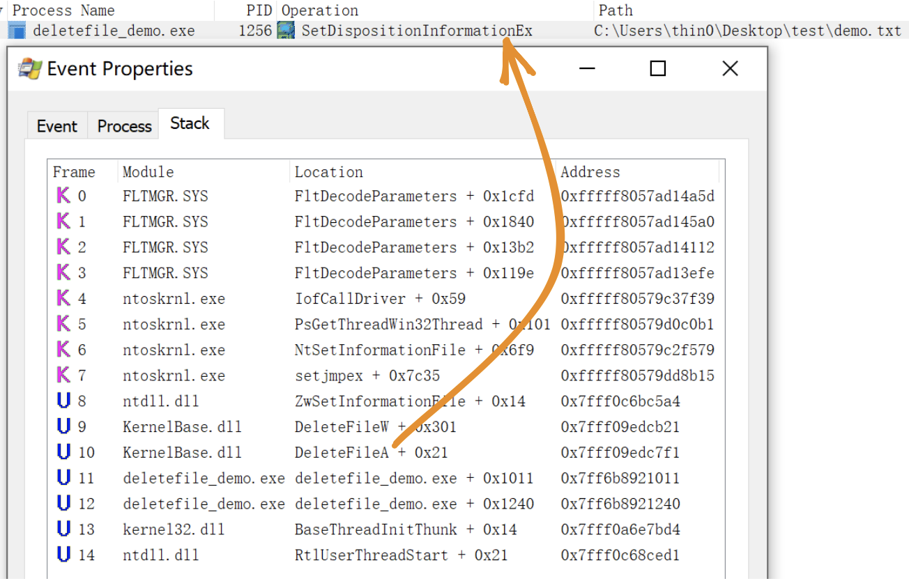
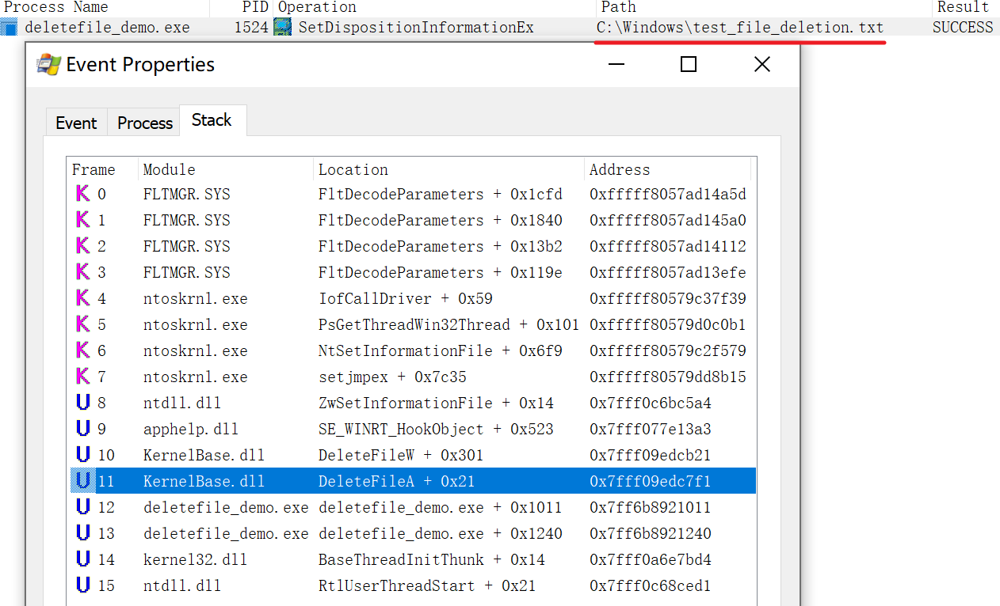
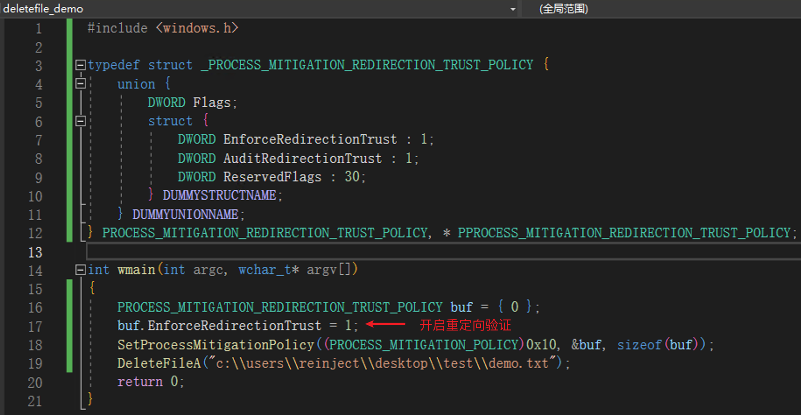
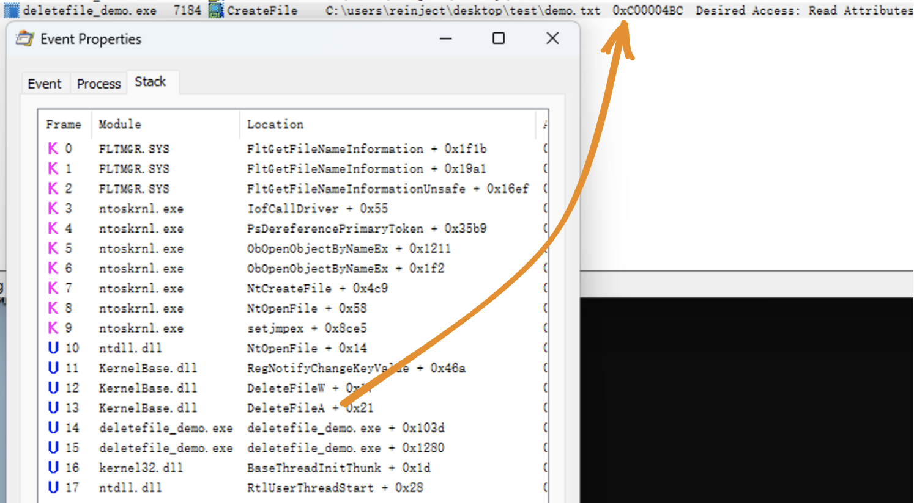

I recently saw a [tweet](https://twitter.com/AndrewOliveau/status/1701236395237392752) from [@AndrewOliveau](https://twitter.com/AndrewOliveau). Just reading the description "arbitrary file deletions to SYSTEM" felt magical — an arbitrary file deletion vulnerability that can be turned into local privilege escalation. After reading through it with questions in mind, I found that the general approach leverages Windows' MSI installation rollback mechanism. Seeing "Config.Msi" felt very familiar, because two or three years ago I had deeply studied this and even crafted a custom MSI package to test it — it was awesome, but I didn't take notes and forgot about it after having fun, so now this topic has resurfaced. However, this isn't the main focus of the article; rather, it's about "how to turn a fixed ordinary user file deletion into an arbitrary file deletion vulnerability."

<!--more-->

NTFS is the most commonly used file system format in Windows today, and it has many interesting features: [NTFS junctions](https://learn.microsoft.com/en-us/windows/win32/fileio/hard-links-and-junctions#junctions), [hardlinks](https://learn.microsoft.com/en-us/windows/win32/fileio/hard-links-and-junctions#hard-links), [symlinks](https://learn.microsoft.com/en-us/windows/win32/fileio/symbolic-links), [ADS](https://learn.microsoft.com/en-us/openspecs/windows_protocols/ms-fscc/c54dec26-1551-4d3a-a0ea-4fa40f848eb3). As early as six or seven years ago, [James Forshaw](https://tyranidslair.blogspot.com/) conducted a series of related research:

- [Windows 10^H^H Symbolic Link Mitigations](https://googleprojectzero.blogspot.com/2015/08/windows-10hh-symbolic-link-mitigations.html)
- [The Definitive Guide on Win32 to NT Path Conversion](https://googleprojectzero.blogspot.com/2016/02/the-definitive-guide-on-win32-to-nt.html)
- [Between a Rock and a Hard Link](https://googleprojectzero.blogspot.com/2015/12/between-rock-and-hard-link.html)
- [Windows Exploitation Tricks: Arbitrary Directory Creation to Arbitrary File Read](https://googleprojectzero.blogspot.com/2017/08/windows-exploitation-tricks-arbitrary.html)
- [Windows Exploitation Tricks: Exploiting Arbitrary File Writes for Local Elevation of Privilege](https://googleprojectzero.blogspot.com/2018/04/windows-exploitation-tricks-exploiting.html)
- [Windows Kernel Logic Bug Class: Access Mode Mismatch in IO Manager](https://googleprojectzero.blogspot.com/2019/03/windows-kernel-logic-bug-class-access.html)

He also open-sourced a toolkit for researching symbolic link related issues: [symboliclink-testing-tools](https://github.com/googleprojectzero/symboliclink-testing-tools).

Alright, let's save those masterpieces for another time. Now back to the main topic: "how to turn a fixed ordinary user file deletion into an arbitrary file deletion vulnerability."

## DeleteFileA() -> Arbitrary File/Directory Deletion

Let's briefly introduce two symlink concepts in Windows:

### NTFS Junctions

Similar to Linux's mount, which can mount a device to a local directory — reading and writing to this directory is equivalent to reading and writing to the target device. In Windows, each device is mapped to a path on the Object Manager, so junctions actually point to object directories. Characteristics:

- Can be used across partitions, and can directly mount an object directory to a local disk
- Can be created by regular users
- Requires the mount target directory to be empty

No built-in command is available; you need to use [CreateMountPoint](https://github.com/googleprojectzero/symboliclink-testing-tools/tree/main/CreateMountPoint).

### Symlink

Similar to Linux's ln soft link, which can point A to B. By default, any operation on A — including create, delete, modify, and read — is applied to the B file. Characteristics:

- Requires [SeCreateSymbolicLinkPrivilege](https://docs.microsoft.com/en-us/windows/security/threat-protection/security-policy-settings/create-symbolic-links) privilege, which only administrators have by default
- Unlike Linux, operations like deletion and ACL modification are also applied to the target file

However, there is an exception: when creating a symlink in an object directory, the system does not require administrator privileges — only write access to the object directory is needed. The Object Manager has a user-writable object directory `\RPC CONTROL\`, which, combined with NTFS junctions, effectively allows creating a file in the file system that points to any file.

No built-in command is available; you need to use [CreateSymlink](https://github.com/googleprojectzero/symboliclink-testing-tools/tree/main/CreateSymlink).

You can learn more details by reading [An introduction to privileged file operation abuse on Windows](https://offsec.almond.consulting/intro-to-file-operation-abuse-on-Windows.html).

Ultimately, with a controllable empty folder, you can achieve the effect shown in [@clavoillotte](https://offsec.almond.consulting/intro-to-file-operation-abuse-on-Windows.html)'s diagram:

### DeleteFileA()

Some details are omitted here.

Using the [procmon](https://learn.microsoft.com/en-us/sysinternals/downloads/procmon) tool, observe a demo program that calls DeleteFileA ([source code](https://github.com/0xlane/repo/blob/main/code/arbitrary_file_into_eop/DeleteFileDemo/main.cpp)):

The actual operation called is `SetDispositionInformationEx`. In [procmon](https://learn.microsoft.com/en-us/sysinternals/downloads/procmon), delete operations can be monitored using this condition.

### Demo

Using the demo program above as an example, it deletes the `test\demo.txt` file on the desktop when run.

First, empty the test directory, then use the approach described earlier to point the test directory to `\RPC CONTROL\`, and finally link `\RPC CONTROL\demo.txt` to any file — for example, `C:\Windows\test_file_deletion.txt` that I created beforehand as an administrator:

Now, if the demo program runs, it will delete `C:\Windows\test_file_deletion.txt`. This operation can be monitored through [procmon](https://learn.microsoft.com/en-us/sysinternals/downloads/procmon):

### Exploitation Conditions

From the previous demo, the following exploitation conditions can be summarized:

1. The application deletes a file in a regular user's directory, and the directory can be deleted and recreated by the attacker
2. The content of the deleted file is not validated — this depends on the situation; sometimes a race condition between validation and deletion can provide an opportunity to replace the validated file

There don't seem to be any other special conditions, making the feasibility quite high.

## From Arbitrary File Deletion to Privilege Escalation

Combined with the MSI rollback mechanism, arbitrary file deletion can be turned into local privilege escalation, implemented by the [FolderOrFileDeleteToSystem](https://github.com/0xlane/repo/blob/main/code/arbitrary_file_into_eop/FolderOrFileDeleteToSystem/FolderOrFileDeleteToSystem.cpp) project in the repository.

Principle: [Abusing Arbitrary File Deletes to Escalate Privilege and Other Great Tricks](https://www.zerodayinitiative.com/blog/2022/3/16/abusing-arbitrary-file-deletes-to-escalate-privilege-and-other-great-tricks)

## Mitigation

> In October 2022 Microsoft shipped a new feature called Redirection Guard on Windows 10 and Windows 11. The update introduced a new type of mitigation called ProcessRedirectionTrustPolicy and the corresponding PROCESS_MITIGATION_REDIRECTION_TRUST_POLICY structure. If the mitigation is enabled for a given process, all processed junctions are additionally verified. The verification first checks if the filesystem junction was created by non-admin users and, if so, if the policy prevents following them. If the operation is prevented, the error 0xC00004BC is returned. The junctions created by admin users are explicitly allowed as having a higher trust-level label.

On Windows 22H2 [10.0.22621] or newer systems, enabling the [ProcessRedirectionTrustPolicy](https://learn.microsoft.com/en-us/windows/win32/api/winnt/ne-winnt-process_mitigation_policy) can mitigate this issue:

The NTFS driver calls the kernel function `nt!IoCheckRedirectionTrustLevel` when attempting to open a file object. When the policy is enabled, if an NTFS junction was created by a non-SYSTEM user, error 0xC00004BC is returned. (This was only briefly tested — administrator group users were also restricted.)

On older versions, file pre-locking and file type verification may be used as targeted mitigations for this class of vulnerabilities.

## Related Resources

- [Deleting Your Way Into SYSTEM: Why Arbitrary File Deletion Vulnerabilities Matter](https://www.mandiant.com/resources/blog/arbitrary-file-deletion-vulnerabilities)
- [https://medium.com/csis-techblog/cve-2020-1088-yet-another-arbitrary-delete-eop-a00b97d8c3e2](https://medium.com/csis-techblog/cve-2020-1088-yet-another-arbitrary-delete-eop-a00b97d8c3e2)
- [Windows Backup Service Local Privilege Escalation Vulnerability (CVE-2023-21752) Analysis](https://paper.seebug.org/2045/)
- [An introduction to privileged file operation abuse on Windows](https://offsec.almond.consulting/intro-to-file-operation-abuse-on-Windows.html)
- [Windows Installer EOP (CVE-2023-21800)](https://blog.doyensec.com//2023/03/21/windows-installer.html)
