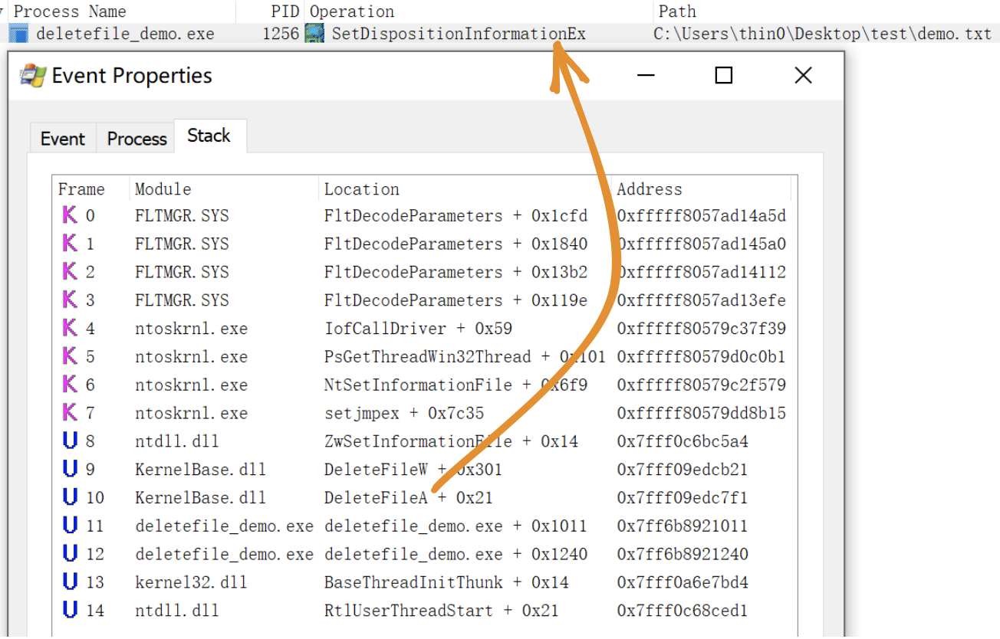

最近看到了 [@AndrewOliveau](https://twitter.com/AndrewOliveau) 发的 [tweet](https://twitter.com/AndrewOliveau/status/1701236395237392752)，只看那句描述 “arbitrary file deletions to SYSTEM” 我就感觉很神奇的样子，任意文件删除的洞还能变成本地提权。我带着问号看完之后，我发现这个大概思路是利用 Windows 的 MSI 安装回滚机制，看到 “Config.Msi” 我就觉得很熟悉，因为两三年前深入学习过还记得当时自制了一个 MSI 包试了一下酷毙了，没记笔记爽完就忘了还有这么个点，现在算是又被点到了。不过这并不是文章重点，而是 “如何把一个固定的普通用户文件删除变成一个任意文件删除漏洞”。

<!--more-->

NTFS 是 Windows 现在最常用的文件系统格式，它有很多神奇的特性：[NTFS junctions](https://learn.microsoft.com/en-us/windows/win32/fileio/hard-links-and-junctions#junctions)、[hardlinks](https://learn.microsoft.com/en-us/windows/win32/fileio/hard-links-and-junctions#hard-links)、[symlinks](https://learn.microsoft.com/en-us/windows/win32/fileio/symbolic-links)、[ADS](https://learn.microsoft.com/en-us/openspecs/windows_protocols/ms-fscc/c54dec26-1551-4d3a-a0ea-4fa40f848eb3)，早在六七年前开始 [James Forshaw](https://tyranidslair.blogspot.com/) 就做过一系列相关研究：

- [Windows 10^H^H Symbolic Link Mitigations](https://googleprojectzero.blogspot.com/2015/08/windows-10hh-symbolic-link-mitigations.html)
- [The Definitive Guide on Win32 to NT Path Conversion](https://googleprojectzero.blogspot.com/2016/02/the-definitive-guide-on-win32-to-nt.html)
- [Between a Rock and a Hard Link](https://googleprojectzero.blogspot.com/2015/12/between-rock-and-hard-link.html)
- [Windows Exploitation Tricks: Arbitrary Directory Creation to Arbitrary File Read](https://googleprojectzero.blogspot.com/2017/08/windows-exploitation-tricks-arbitrary.html)
- [Windows Exploitation Tricks: Exploiting Arbitrary File Writes for Local Elevation of Privilege](https://googleprojectzero.blogspot.com/2018/04/windows-exploitation-tricks-exploiting.html)
- [Windows Kernel Logic Bug Class: Access Mode Mismatch in IO Manager](https://googleprojectzero.blogspot.com/2019/03/windows-kernel-logic-bug-class-access.html)

还开源了一套用于研究符号链接相关问题的工具包：[symboliclink-testing-tools](https://github.com/googleprojectzero/symboliclink-testing-tools)。

好，这些巨作留着过年再看吧，现在回正题：“如何把一个固定的普通用户文件删除变成一个任意文件删除漏洞”。

## DeleteFileA() -> 任意文件/目录删除

先简单介绍一下 Windows 下两个 symlink 的概念：

### NTFS jouctions

相当于 Linux 的 mount 可以把一个设备挂载到一个本地目录上，读写这个目录中的内容相当于读写目标设备，在 Windows 上每个设备都会被映射到对象管理器上的一个路径，故 jouctions 指向的实际是对象目录。特点：

- 可以跨分区用，还能直接挂载一个对象目录到本地磁盘
- 普通用户可建
- 要求挂载目录为空

无自带命令，需要使用 [CreateMountPoint](https://github.com/googleprojectzero/symboliclink-testing-tools/tree/main/CreateMountPoint)。

### symlink

相当于 Linux 的 ln 制作的软链接，可将 A 指向 B，默认对 A 的任何操作，包括增、删、改、查都会应用到 B 文件。特点：

- 需要具有 [SeCreateSymbolicLinkPrivilege](https://docs.microsoft.com/en-us/windows/security/threat-protection/security-policy-settings/create-symbolic-links) 权限，默认只有管理员才有这项权限
- 与 Linux 不一样的是 删除、修改 ACL 等操作也会应用到目标文件上

不过有一个例外，在对象目录中创建 symlink 时系统并不要求管理员权限，只需要操作者拥有对象目录写权限。而 Object Manager 上正好存在一个普通用户可写的对象目录 `\RPC CONTROL\`，这样结合 NTFS jouctions 实际上可以将在文件系统中创建一个文件指向任意文件。

无自带命令，需要使用 [CreateSymlink](https://github.com/googleprojectzero/symboliclink-testing-tools/tree/main/CreateSymlink)。

可以通过阅读 [An introduction to privileged file operation abuse on Windows](https://offsec.almond.consulting/intro-to-file-operation-abuse-on-Windows.html) 了解更多细节。

最终就可以用一个可控的空文件夹实现 [@clavoillotte](https://offsec.almond.consulting/intro-to-file-operation-abuse-on-Windows.html) 给的配图里展示的效果：

### DeleteFileA()

省略一些细节的东西。

通过 [procmon](https://learn.microsoft.com/en-us/sysinternals/downloads/procmon) 工具，观察一个调用 DeteleFileA 的 demo 程序（[源码](https://github.com/0xlane/repo/blob/main/code/arbitrary_file_into_eop/DeleteFileDemo/main.cpp)）：

最终实际调用的是 `SetDispositionInformationEx` 操作，在 [procmon](https://learn.microsoft.com/en-us/sysinternals/downloads/procmon) 中可以通过这个条件监控删除操作。

### demo

以上面的 demo 程序为例，它在运行时会删除桌面下的 `test\demo.txt` 文件。

首先将 test 目录清空，然后通过之前说的方式将 test 目录先指向 `\RPC CONTROL\`，最后将 `\RPC CONTROL\demo.txt` 链接到任意文件，比如我事先用管理员创建的 `C:\Windows\test_file_deletion.txt`：

此时，如果 demo 程序运行后将会删除 `C:\Windows\test_file_deletion.txt`，可以通过 [procmon](https://learn.microsoft.com/en-us/sysinternals/downloads/procmon) 监控到这个操作：

### 利用条件

通过之前的 demo 可以总结出以下利用条件：

1. 应用删除普通用户目录里的文件，目录可被攻击者删除新建
2. 不验证被删除的文件内容，这个看情况，有的时候在验证和删除操作中间可能发生条件竞争替换已验证的文件也有机会成功

别的好像也没啥特殊条件，感觉可行性很高呀。

## 从任意文件删除到提权

结合 MSI 回滚机制，可以把任意文件删除变成本地提权，由仓库中 [FolderOrFileDeleteToSystem](https://github.com/0xlane/repo/blob/main/code/arbitrary_file_into_eop/FolderOrFileDeleteToSystem/FolderOrFileDeleteToSystem.cpp) 项目实现。

原理：[Abusing Arbitrary File Deletes to Escalate Privilege and Other Great Tricks](https://www.zerodayinitiative.com/blog/2022/3/16/abusing-arbitrary-file-deletes-to-escalate-privilege-and-other-great-tricks)

## 缓解措施

> In October 2022 Microsoft shipped a new feature called Redirection Guard on Windows 10 and Windows 11. The update introduced a new type of mitigation called ProcessRedirectionTrustPolicy and the corresponding PROCESS_MITIGATION_REDIRECTION_TRUST_POLICY structure. If the mitigation is enabled for a given process, all processed junctions are additionally verified. The verification first checks if the filesystem junction was created by non-admin users and, if so, if the policy prevents following them. If the operation is prevented, the error 0xC00004BC is returned. The junctions created by admin users are explicitly allowed as having a higher trust-level label.

如果在 Windows 22H2 [10.0.22621] 或更新的系统中，可以开启 [ProcessRedirectionTrustPolicy](https://learn.microsoft.com/en-us/windows/win32/api/winnt/ne-winnt-process_mitigation_policy) 策略后可缓解该问题：

NTFS 驱动在尝试打开文件对象时调用内核函数 `nt!IoCheckRedirectionTrustLevel` 检查令牌上下文中设置的策略值，当开启策略时，若 NTFS jouctions 由非 SYSTEM 用户创建，则返回 0xC00004BC 错误。（这里只简单测试了一下，管理员组用户也限制了）

在低版本中或许要使用文件提前上锁以及检验文件类型等方式针对性地缓解此类漏洞。

## 相关资料

- [Deleting Your Way Into SYSTEM: Why Arbitrary File Deletion Vulnerabilities Matter](https://www.mandiant.com/resources/blog/arbitrary-file-deletion-vulnerabilities)
- [https://medium.com/csis-techblog/cve-2020-1088-yet-another-arbitrary-delete-eop-a00b97d8c3e2](https://medium.com/csis-techblog/cve-2020-1088-yet-another-arbitrary-delete-eop-a00b97d8c3e2)
- [Windows Backup Service 本地提权漏洞（CVE-2023-21752）分析](https://paper.seebug.org/2045/)
- [An introduction to privileged file operation abuse on Windows](https://offsec.almond.consulting/intro-to-file-operation-abuse-on-Windows.html)
- [Windows Installer EOP (CVE-2023-21800)](https://blog.doyensec.com//2023/03/21/windows-installer.html)
