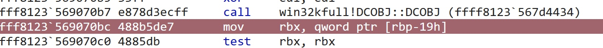
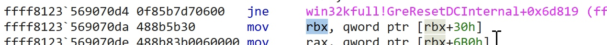
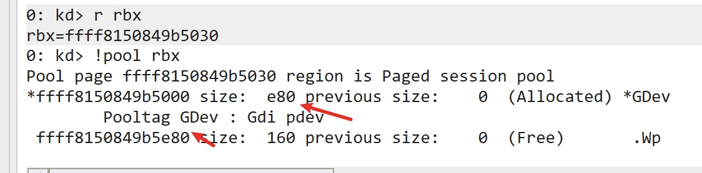
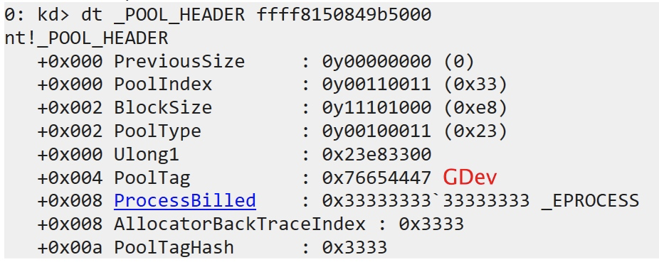
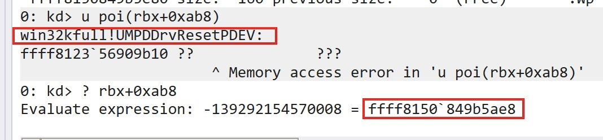
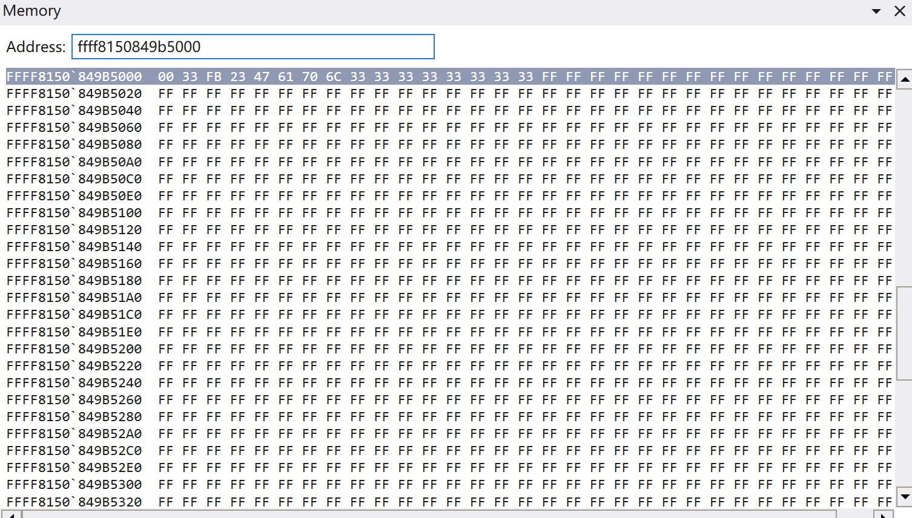
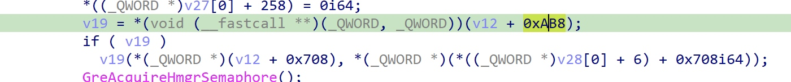
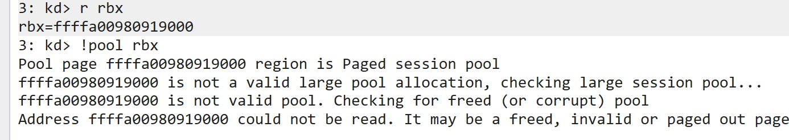

## 0x01 TLDR

Existing exploits share roughly the same implementation approach, differing only in some details and coding style:

- [https://github.com/KaLendsi/CVE-2021-40449-Exploit](https://github.com/KaLendsi/CVE-2021-40449-Exploit)
- [https://github.com/hakivvi/CVE-2021-40449/blob/main/CVE-2021-40449/exploit.cpp](https://github.com/hakivvi/CVE-2021-40449/blob/main/CVE-2021-40449/exploit.cpp)
- [https://github.com/ly4k/CallbackHell](https://github.com/ly4k/CallbackHell)

You can refer to the following vulnerability analysis articles for a detailed understanding of the vulnerability:

- [https://securelist.com/mysterysnail-attacks-with-windows-zero-day/104509/](https://securelist.com/mysterysnail-attacks-with-windows-zero-day/104509/)
- [https://bbs.pediy.com/thread-269930.htm](https://bbs.pediy.com/thread-269930.htm)
- [https://mp.weixin.qq.com/s/AcFS0Yn9SDuYxFnzbBqhkQ](https://mp.weixin.qq.com/s/AcFS0Yn9SDuYxFnzbBqhkQ)

Brief root cause of the vulnerability:

> When calling `gdi32full!ResetDC`, it goes through the system call `NtGdiResetDC` and eventually enters `win32kfull!GreResetDCInternal`. This function obtains a `DCOBJ` object via an `HDC` handle, but fails to check whether the object has already been freed during use. This allows a regular user to tamper with the object data through certain means, which is then reused by the function, resulting in privilege escalation — a classic Use-After-Free (UAF) vulnerability.

The exploit's vulnerability trigger process:

1. Leak some critical kernel addresses: `ntoskrnl`, token, and the `RtlSetAllBits` function address
2. Forge a `BitMap` containing a token, and obtain the kernel address via `SystemBigPoolInformation`
3. Hook the printer driver's user-mode callback function `DrvEnablePDEV`
4. Call `CreateDCA` to create a new printer device context object (`DCOBJ`) containing the hooked callback function pointer
5. Call `ResetDC` to release the `dco` created in the previous step. When it internally calls `hdcOpenDcW` to obtain a new `DC`, it triggers the user callback and enters the hook function
6. Inside the hook function, call `ResetDC` again to free the old `dco`
7. Then use `Palette`, a GDI object, to construct pool space approximately the same size as the original `dco`, placing `RtlSetAllBits` and the forged `bitmap` address at specified offsets. Multiple rounds of pool spraying are performed, with some probability of reclaiming the freed dco pool
8. Finally, after the hook function completes and returns to `ResetDC`, the dco pool has been corrupted. The `win32kfull!UMPDDrvResetPDEV` function pointer stored in the `dco` object and its arguments have been overwritten
9. Triggering the call to `RtlSetAllBits` resets the 16 bytes at `token+0x40` to 1, enabling the process's `SE_DEBUG_PRIVILEGE` privilege
10. Inject shellcode into a high-privilege process to complete the privilege escalation

Some details in the exploit were not very clear, mainly in the pool spray part:

1. How the constructed Palette pool chunk size of 0xe2c was determined — after tweaking the value, the exploit still worked, suggesting it's not a fixed calculated value but rather a range
2. Why the chunk size subtracts 0x90 — 0x90 should be the size of the Palette's internal object itself; the specific reason requires analysis of the creation process, skipping for now
3. The positions of `RtlSetAllBits` and `fakedBitmap` — the several exploits I examined don't use the same values, which are related to the OS version

The third issue is the most significant, as it directly relates to the OS version. The aforementioned exploits all failed on the 20H2 version, so to adapt to other versions, the offset determination method needs to be understood.

## 0x02 Solving the Problem

The offset positions are closely related to the vulnerability trigger point. Using IDA to examine the vulnerable function:

```cpp
DCOBJ::DCOBJ((XDCOBJ *)_pdco, hdc);
dco = _pdco[0];
if ( !_pdco[0] )
{
    EngSetLastError(6u);
    v13 = _pdco[0];
    LABEL_38:
    v16 = v26;
    goto LABEL_19;
}
v7 = *((_DWORD *)_pdco[0] + 9) & 0x800;
if ( v7 )
{
    DC::bMakeInfoDC(_pdco[0], 0);
    dco = _pdco[0];
}
pDev = *((_QWORD *)dco + 6);    //  pdo = dco + 0x30
v12 = *(_QWORD *)(pDev + 1712);
*(_QWORD *)(pDev + 1712) = 0i64;
v13 = _pdco[0];
v26 = v12;
if ( (*((_DWORD *)_pdco[0] + 9) & 0x100) != 0
    || *((_DWORD *)_pdco[0] + 8) == 1
    || (*(_DWORD *)(pDev + 40) & 0x80u) == 0 )
{
    goto LABEL_38;
}
v14 = *((_DWORD *)_pdco[0] + 27);
v15 = *((_QWORD *)_pdco[0] + 62) != 0i64;
v16 = v15;
if ( XDCOBJ::bCleanDC((XDCOBJ *)_pdco, 0) )
{
    if ( *(_DWORD *)(pDev + 8) == 1 )
    {
        v17 = hdcOpenDCW(&word_1C02C5498, a2, 0i64, 0i64, *(_QWORD *)(pDev + 2560), v26, a4, a5, 0);
        v8 = v17;
        if ( v17 )
        {
            *(_QWORD *)(pDev + 2560) = 0i64;
            DCOBJ::DCOBJ((XDCOBJ *)_newPdco, v17);
            newDco = _newPdco[0];
            if ( newDco )
            {
            PFN_DrvResetPDEV rfn = *(void (__fastcall **)(_QWORD, _QWORD))(pDev + 0xAB8);        // Function address obtained from pdo + 0xab8
            if ( rfn )
            {
                PDEVOBJ newPDEV = *((_QWORD *)newDco + 6);
                rfn(*(_QWORD *)(pDev + 0x708), *(_QWORD *)(newPDEV + 0x708));   // trigger execute, argument at pdo + 0x708
            }
        }
    }
}
```

As we can see, the function's original intent is to execute `PFN_DrvResetPDEV` to release `dco->pdev`, but the function address is stored at `pdev+0xab8`. It takes two arguments: argument 1 is taken from `pdev+0x708`, and argument 2 is taken from the new `pdev`. The exploit uses pool spraying to replace `RtlSetAllBits` and the `fakedBitmap` pointer at these positions to achieve token modification.

Since `pdev` is taken from `dco+0x30`:

- rfn = dco+0xae8
- arg1= dco+0x738

Taking [https://github.com/KaLendsi/CVE-2021-40449-Exploit](https://github.com/KaLendsi/CVE-2021-40449-Exploit) as an example, the Palette construction method:

```cpp
HPALETTE createPaletteofSize2(int size) {
	int pal_cnt = (size - 0x90) / 4;
	int palsize = sizeof(LOGPALETTE) + (pal_cnt - 1) * sizeof(PALETTEENTRY);
	LOGPALETTE* lPalette = (LOGPALETTE*)malloc(palsize);
	DWORD64* p = (DWORD64*)((DWORD64)lPalette + 4);
	memset(lPalette, 0xff, palsize);

	p[0x15B] = GadgetAddr;

	p[0xE5] = Fake_RtlBitMapAddr;


	lPalette->palNumEntries = pal_cnt;
	lPalette->palVersion = 0x300;
	return CreatePalette(lPalette);
}
```

p is a `DWORD64` type pointer, so let's do the offset conversion:

- rfn = p[0x15B] = p+0xad8
- arg1 = p[0xE5] = p+0x728

The calculated values are each 0x10 less than the offsets relative to `dco` computed earlier. The difference is the `_POOL_HEADER` — each pool has a 0x10-byte header at the beginning that stores metadata about the current pool.

Setting a breakpoint at `win32kfull!GreResetDCInternal` and single-stepping, the `dco` pointer after `DCOBJ::DCOBJ` initialization is stored in `rbx`:



Then the `dco->pDev` pointer is placed in `rbx`:



Let's examine the pool information at the `rbx` address:



The pool type is `PagedPool`, the pool tag is `GDev`, and the pool block size is 0xe80. This information is stored in the first 0x10 bytes, which can be viewed via `dt _POOL_HEADER ffff8150849b5000`:



The difference between the base address `ffff8150849b5000` and the `dco->pDev` address is exactly 0x30, indicating this is also the `dco` address.

Let's directly examine the function pointed to at offset 0xab8:



After multiple rounds of spraying with the Palette constructed above, this memory location can be successfully overwritten:



From the positions filled with 0xff, we can see that the offset calculation in the exploit needs to subtract 0x10 from the actual offset:

- (0xab8+0x30-0x10)/8 = 0x15b
- (0x708+0x30-0x10)/8 = 0xe5

Thus we derive the offsets for placing `RtlSetAllBits` and `fakedBitmap` in the exploit:

```cpp
p[0x15B] = GadgetAddr;
p[0xE5] = Fake_RtlBitMapAddr;
```

At this point, the test system is Win10 1809 (build 17763.1577).

## 0x03 Exploitation Failure on 20H2

On the 20H2 version, the offsets are the same as observed on 1809:



However, the exploitation was unsuccessful. Testing revealed that on 20H2, `DCOBJ` does not allocate a `GDev` pool:



This renders the pool spray in the exploit ineffective.
