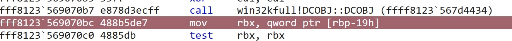
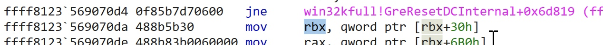
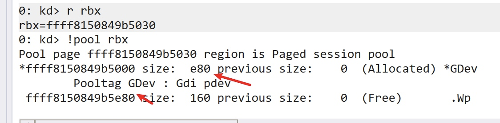
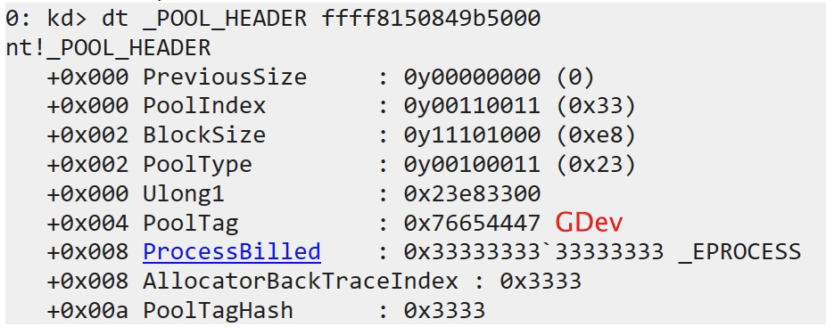
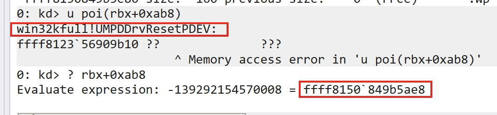
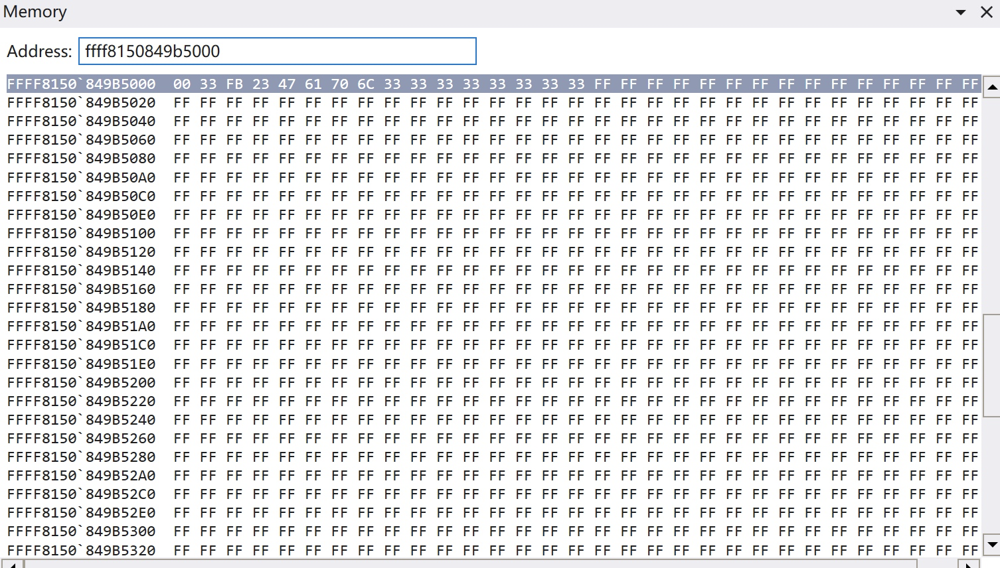
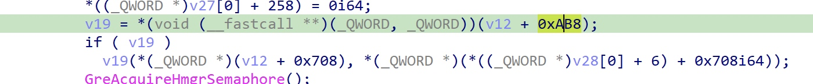
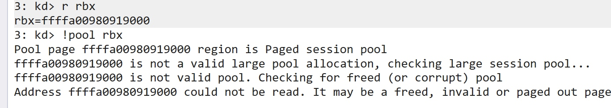

## 0x01 TLDR

现有的 EXP，实现思路大致相同，只不过在一些细节的地方以及编码风格上稍有不同:

- [https://github.com/KaLendsi/CVE-2021-40449-Exploit](https://github.com/KaLendsi/CVE-2021-40449-Exploit)
- [https://github.com/hakivvi/CVE-2021-40449/blob/main/CVE-2021-40449/exploit.cpp](https://github.com/hakivvi/CVE-2021-40449/blob/main/CVE-2021-40449/exploit.cpp)
- [https://github.com/ly4k/CallbackHell](https://github.com/ly4k/CallbackHell)

可以参考下面的漏洞分析文章详细了解漏洞原理：

- [https://securelist.com/mysterysnail-attacks-with-windows-zero-day/104509/](https://securelist.com/mysterysnail-attacks-with-windows-zero-day/104509/)
- [https://bbs.pediy.com/thread-269930.htm](https://bbs.pediy.com/thread-269930.htm)
- [https://mp.weixin.qq.com/s/AcFS0Yn9SDuYxFnzbBqhkQ](https://mp.weixin.qq.com/s/AcFS0Yn9SDuYxFnzbBqhkQ)

大致的漏洞成因：

> 在调用 `gdi32full!ReserDC` 时经系统调用 `NtGdiResetDC` 后最终进入 `win32kfull!GreResetDCInternal` 内，此函数通过 `HDC` 句柄获取 `DCOBJ` 对象，在使用过程中未检查该对象是否已经释放，导致普通用户通过某种方式篡改对象数据后被该函数重用发生提权，典型的 UAF 漏洞。

EXP 的漏洞触发过程：

1. 泄露一些关键的内核地址：`ntoskrnl`、token 以及 `RtlSetAllBits` 函数地址
2. 伪造一个包含 token 的 `BitMap`，通过 `SystemBigPoolInformation` 拿到内核地址
3. Hook 打印机驱动的用户模式回调函数 `DrvEnablePDEV`
4. 调用 `CreateDCA` 创建一个新的包含 hook 回调函数指针的打印机设备上下文对象（`DCOBJ`）
5. 调用 `ResetDC` 释放上一步创建的 `dco`，当内部在调用 `hdcOpenDcW` 获取新的 `DC` 时会调用用户回调进入 hook 函数
6. hook 函数中再次调用 `ResetDC` 将旧的 `dco` 释放掉
7. 后利用 `Palette` 这个 GDI 对象构造与原 `dco` 大小差不多的 pool 空间，分别将 `RtlSetAllBits` 和 伪造的 `bitmap` 地址放到指定的偏移处，多次进行 pool spray，有几率将已经释放掉的 dco pool 回收利用
8. 最终 hook 函数调用完毕之后，返回 `ResetDC`，此时 dco pool 已经被破坏，`dco` 对象中保存的 `win32kfull!UMPDDrvResetPDEV` 函数指针及其参数都被覆盖
9. 触发调用 `RtlSetAllBits` 将 `token+0x40` 位置的 16 字节重置为 1，此时进程的 `SE_DEBUG_PRIVILEGE` 权限被打开
10. 将 shellcode 注入到高权限进程完成提权

在 exp 中一些细节的地方看的不是很明白，主要在 pool spray 部分：

1. 构造的 Palette pool chunk 大小 0xe2c 是怎么确定的，随便改了改还能利用，感觉不是计算出来的固定值，在一个范围里即可
2. 为什么 chunk size 要 -0x90，0x90 应该是 Palette 内部对象本身的大小，具体原因需要分析创建过程，先跳过
3. `RtlSetAllBits` 和 `fakedBitmap` 放的位置，我看那几个 exp 里写的都不是一样的，跟系统版本有关系

问题比较大的是第 3 个，因为和系统版本有直接联系，前面的 exp 在 20H2 版本测试均失败，所以为了适配其他版本这里需要确定偏移是如何确定的。

## 0x02 解决问题

偏移位置和漏洞触发点脱不开关系，使用 ida 查看漏洞函数如下：

```cpp
DCOBJ::DCOBJ((XDCOBJ *)_pdco, hdc);
dco = _pdco[0];
if ( !_pdco[0] )
{
    EngSetLastError(6u);
    v13 = _pdco[0];
    LABEL_38:
    v16 = v26;
    goto LABEL_19;
}
v7 = *((_DWORD *)_pdco[0] + 9) & 0x800;
if ( v7 )
{
    DC::bMakeInfoDC(_pdco[0], 0);
    dco = _pdco[0];
}
pDev = *((_QWORD *)dco + 6);    //  pdo = dco + 0x30
v12 = *(_QWORD *)(pDev + 1712);
*(_QWORD *)(pDev + 1712) = 0i64;
v13 = _pdco[0];
v26 = v12;
if ( (*((_DWORD *)_pdco[0] + 9) & 0x100) != 0
    || *((_DWORD *)_pdco[0] + 8) == 1
    || (*(_DWORD *)(pDev + 40) & 0x80u) == 0 )
{
    goto LABEL_38;
}
v14 = *((_DWORD *)_pdco[0] + 27);
v15 = *((_QWORD *)_pdco[0] + 62) != 0i64;
v16 = v15;
if ( XDCOBJ::bCleanDC((XDCOBJ *)_pdco, 0) )
{
    if ( *(_DWORD *)(pDev + 8) == 1 )
    {
        v17 = hdcOpenDCW(&word_1C02C5498, a2, 0i64, 0i64, *(_QWORD *)(pDev + 2560), v26, a4, a5, 0);
        v8 = v17;
        if ( v17 )
        {
            *(_QWORD *)(pDev + 2560) = 0i64;
            DCOBJ::DCOBJ((XDCOBJ *)_newPdco, v17);
            newDco = _newPdco[0];
            if ( newDco )
            {
            PFN_DrvResetPDEV rfn = *(void (__fastcall **)(_QWORD, _QWORD))(pDev + 0xAB8);        // 从 pdo + 0xab8 位置获取到的函数地址
            if ( rfn )
            {
                PDEVOBJ newPDEV = *((_QWORD *)newDco + 6);
                rfn(*(_QWORD *)(pDev + 0x708), *(_QWORD *)(newPDEV + 0x708));   // trigger execute, 参数在 pdo + 0x708 位置
            }
        }
    }
}
```

可以看到，函数本意是要执行 `PFN_DrvResetPDEV` 释放 `dco->pdev`，但是该函数地址保存在 `pdev+0xab8` 位置，参数有两个，参数 1 取自 `pdev+0x708` 位置，参数 2 取自新的 `pdev`，exp 中就是利用池喷将这里替换 `RtlSetAllBits` 和 `fakedBitmap` 的指针达到修改 token 的目的。

因为 `pdev` 取自 `dco+0x30` 位置，所以：

- rfn = dco+0xae8
- arg1= dco+0x738

以 [https://github.com/KaLendsi/CVE-2021-40449-Exploit](https://github.com/KaLendsi/CVE-2021-40449-Exploit) 这个 exp 为例，其中构造 Palette 的方式：

```cpp
HPALETTE createPaletteofSize2(int size) {
	int pal_cnt = (size - 0x90) / 4;
	int palsize = sizeof(LOGPALETTE) + (pal_cnt - 1) * sizeof(PALETTEENTRY);
	LOGPALETTE* lPalette = (LOGPALETTE*)malloc(palsize);
	DWORD64* p = (DWORD64*)((DWORD64)lPalette + 4);
	memset(lPalette, 0xff, palsize);

	p[0x15B] = GadgetAddr;

	p[0xE5] = Fake_RtlBitMapAddr;


	lPalette->palNumEntries = pal_cnt;
	lPalette->palVersion = 0x300;
	return CreatePalette(lPalette);
}
```

p 是一个 `DWORD64` 类型指针，所以做一下偏移换算：

- rfn = p[0x15B] = p+0xad8
- arg1 = p[0xE5] = p+0x728

算出来的竟然与之前相对 `dco` 的偏移各自差 0x10，差出来的是 `_POOL_HEADER`，每个池开头都会有 0x10 字节的头，保存了当前池的元数据信息。

在 `win32kfull!GreResetDCInternal` 位置下断单步跟，调用 `DCOBJ::DCOBJ` 初始化后的 `dco` 指针放在 `rbx` 里：



之后将 `dco->pDev` 指针放在 `rbx`：



看一下 `rbx` 地址所在的 pool 信息：



池类型为 `PagedPool`，池标签为 `GDev`，池块大小为 0xe80，这些信息就保存在开头的 0x10 字节里，通过 `dt _POOL_HEADER ffff8150849b5000` 查看：



首地址 `ffff8150849b5000` 和 `dco->pDev` 地址差正好 0x30，说明这也是 `dco` 的地址。

直接看一下 0xab8 偏移处指向的函数：



在利用上面构造的 `Palette` 多次喷射之后，可以成功覆盖此处内存：



通过 0xff 填充的位置可以看出来 exp 中的偏移计算需要将实际的偏移 -0x10，即：

- (0xab8+0x30-0x10)/8 = 0x15b
- (0x708+0x30-0x10)/8 = 0xe5

故得到 exp 中放置 `RtlSetAllBits` 和 `fakedBitmap` 的偏移：

```cpp
p[0x15B] = GadgetAddr;
p[0xE5] = Fake_RtlBitMapAddr;
```

此时，测试的系统是 win10 1809(build 17763.1577)。

## 0x03 20H2 无法利用

在 20H2 版本上，偏移和 1809 上看到的一样：



但是发现利用不成功，测试后发现在 20H2 上 `DCOBJ` 并没有分配 `GDev` 池：



导致 exp 中 pool spray 无效。
