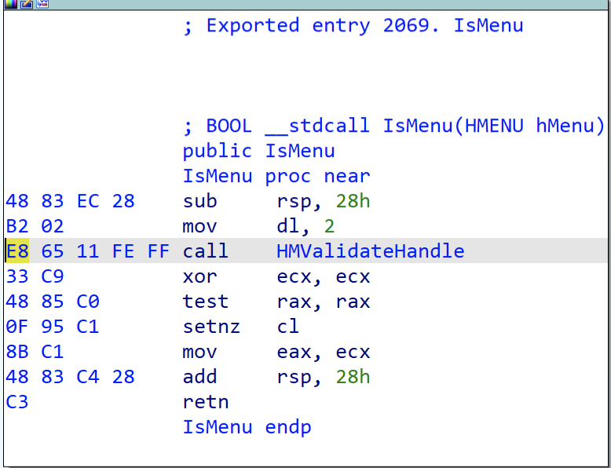
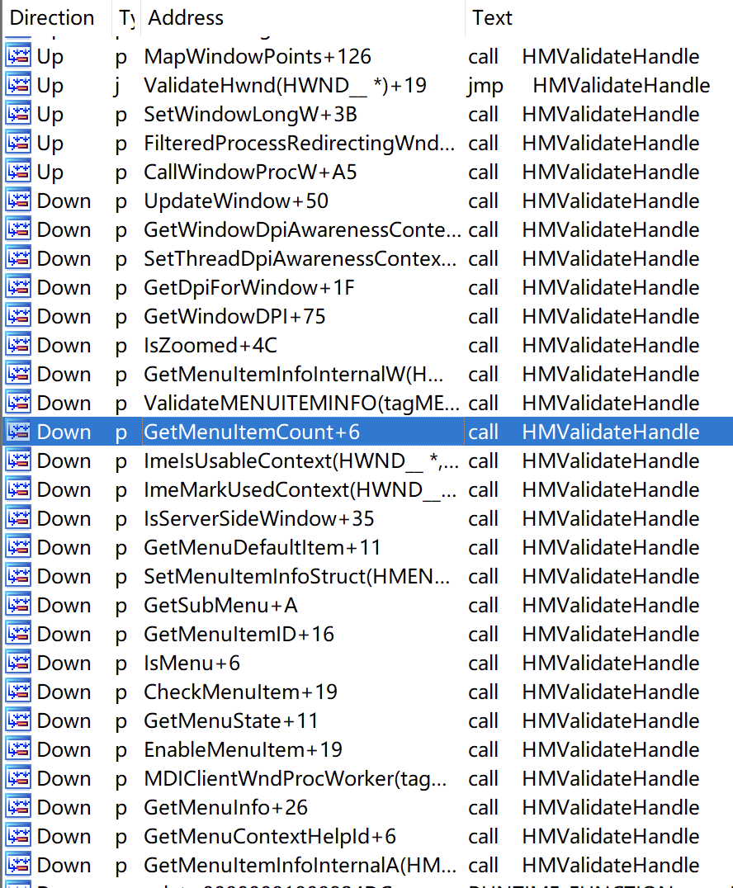
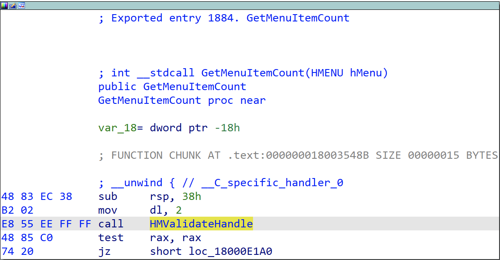

The main content of this article is translated from: [https://theevilbit.github.io/posts/a_simple_protection_against_hmvalidatehandle_technique/](https://theevilbit.github.io/posts/a_simple_protection_against_hmvalidatehandle_technique/)

Looking at win32k exploitation techniques in recent years, the HMValidateHandle technique is used almost everywhere. I had an idea about how to prevent this type of exploitation, and this article discusses it.

<!--more-->

## 1. What is HMValidateHandle?

HMValidateHandle is an internal undocumented function in user32.dll. It takes two parameters — a handle and a handle type — and looks up the handle table. If the handle and handle type match, it copies the object to user memory. If the object is a pointer, similar to tagWND, it will leak the kernel memory address. This is a long-known technique; I believe it was first presented at BlackHat 2011, and you can find the PDF here: [https://media.blackhat.com/bh-us-11/Mandt/BH_US_11_Mandt_win32k_WP.pdf](https://media.blackhat.com/bh-us-11/Mandt/BH_US_11_Mandt_win32k_WP.pdf). This function is very useful and is frequently abused in Windows kernel exploits to leak kernel object addresses, so Microsoft decided to close it. Therefore, this technique no longer works after Windows 10 RS4.

## 2. Obtaining the Address of HMValidateHandle

This function is frequently called internally within user32.dll, so we just need to resolve and calculate the function's address through it. The most commonly used technique is to locate IsMenu in user32.dll:

```cpp
HMODULE hUser32 = LoadLibraryA("user32.dll");
BYTE* pIsMenu = (BYTE *)GetProcAddress(hUser32, "IsMenu");
```

The first call instruction in this function is the call to HMValidateHandle. The machine code for the call instruction is E8, and we will use this marker to locate it.

```cpp
unsigned int uiHMValidateHandleOffset = 0;
    for (unsigned int i = 0; i < 0x1000; i++) {
        BYTE* test = pIsMenu + i;
        if (*test == 0xE8) {
            uiHMValidateHandleOffset = i + 1;
            break;
        }
    }
    unsigned int addr = *(unsigned int *)(pIsMenu + uiHMValidateHandleOffset);
    unsigned int offset = ((unsigned int)pIsMenu - (unsigned int)hUser32) + addr;
    //The +11 is to skip the padding bytes as on Windows 10 these aren't nops
    pHmValidateHandle = (lHMValidateHandle)((ULONG_PTR)hUser32 + offset + 11);
```

Note: 11 refers to the offset of the instruction following the call relative to the IsMenu function address, with a hexadecimal value of 0xB.

The complete code can be obtained from: [windows_kernel_address_leaks/HMValidateHandle](https://github.com/sam-b/windows_kernel_address_leaks/tree/master/HMValidateHandle)

You can also test with the following code:

```cpp
#include <Windows.h>
#include <stdio.h>
 
typedef PVOID(WINAPI* FHMValidateHandle)(HANDLE h, BYTE byType);
 
bool FindHMValidateHandle(FHMValidateHandle* pfOutHMValidateHandle)
{
    HMODULE hUser32 = LoadLibraryW(L"user32.dll");
    if (!hUser32)
    {
        return false;
    }
    PBYTE pIsMenu = (PBYTE)GetProcAddress(hUser32, "IsMenu");
    if (pIsMenu)
    {
        fprintf(stdout, "Addr of IsMenu is 0x%p\n", pIsMenu);
 
        unsigned int uiHMValidateHandleOffset = 0;
        for (int i = 0; i < 0x100; i++)
        {
            if (0xe8 == *(pIsMenu + i))
            {
                uiHMValidateHandleOffset = i + 1;
                break;
            }
        }
 
        if (0 == uiHMValidateHandleOffset)
        {
            return false;
        }
 
        unsigned int addr = *(unsigned int*)(pIsMenu + uiHMValidateHandleOffset);
        unsigned int offset = ((unsigned int)pIsMenu - (unsigned int)hUser32) + addr;
        //The +11 is to skip the padding bytes as on Windows 10 these aren't nops
        *pfOutHMValidateHandle = (FHMValidateHandle)((ULONG_PTR)hUser32 + offset + 11);
 
        return true;
    }
 
    return false;
}
 
FHMValidateHandle fHMValidateHandle = NULL;
 
int APIENTRY wWinMain(_In_ HINSTANCE hInstance,
    _In_opt_ HINSTANCE hPrevInstance,
    _In_ LPWSTR lpCmdLine,
    _In_ int nCmdShow)
{
    // suppress warning C4100
    UNREFERENCED_PARAMETER(hPrevInstance);
    UNREFERENCED_PARAMETER(nCmdShow);
 
    // redirection stdin and stdout to console
    AllocConsole();
    FILE* tempFile = nullptr;
    freopen_s(&tempFile, "conin$", "r+t", stdin);
    freopen_s(&tempFile, "conout$", "w+t", stdout);
 
    bool bFound = FindHMValidateHandle(&fHMValidateHandle);
    if (!bFound)
    {
        fprintf(stdout, "Failed to locate HMValidateHandle, exiting\n");
        return 1;
    }
 
    fprintf(stdout, "Found location of HMValidateHandle in user32.dll\n");
    fprintf(stdout, "Addr of HMValidateHandle is 0x%p\n", fHMValidateHandle);
    system("pause");
}
```

Here is the disassembly detail of the IsMenu function in Windows 10 1809:



Once you understand the principle, you can also use other functions:



It appears that functions with smaller call relative offsets are better. For example, GetMenuItemCount also looks straightforward:



Simply change this line in the code:

```cpp
BYTE* pIsMenu = (BYTE *)GetProcAddress(hUser32, "IsMenu");
```

to:

```cpp
BYTE* pGetMenuItemCount = (BYTE *)GetProcAddress(hUser32, "GetMenuItemCount");
```

In the above call address calculation method, the next instruction address uses a hardcoded offset of 11. A more flexible approach is to use the call instruction address + 5, then extend the offset 0xFFFFEE55 after the call instruction to the corresponding system bit width — here it's 64-bit, so it becomes 0xFFFFFFFFFFFFEE55 — then add it to the next instruction address to get the final function offset:

```cpp
typedef PVOID(WINAPI* FHMValidateHandle)(HANDLE h, BYTE byType);
 
bool FindHMValidateHandle(FHMValidateHandle *pfOutHMValidateHandle)
{
    *pfOutHMValidateHandle = NULL;
    HMODULE hUser32 = GetModuleHandle(L"user32.dll");
    PBYTE pMenuFunc = (PBYTE)GetProcAddress(hUser32, "IsMenu");
    if (pMenuFunc) {
        for (int i = 0; i < 0x100; ++i) {
            if (0xe8 == *pMenuFunc++) {
                DWORD ulOffset = *(PINT)pMenuFunc;
                *pfOutHMValidateHandle = (FHMValidateHandle)(pMenuFunc + 5 + (ulOffset & 0xffff) - 0x10000  - ((ulOffset >> 16 ^ 0xffff) * 0x10000) );
                break;
            }
        }
    }
    return *pfOutHMValidateHandle != NULL ? true : false;
}
```

## 3. Prevention and Detection

Although this issue was fixed in Windows 10 RS4, a large number of machines are still affected. The idea is very simple: under normal circumstances, HMValidateHandle is only called internally within user32.dll. If we hook this function in user mode and then check the call stack, we can easily determine whether the call is legitimate or an exploit originating from outside user32.dll. Most AV products implement user-mode hooks because you cannot hook everything in kernel mode (like this case), so adding one more is not difficult and it would significantly prevent this type of exploitation.

I personally have not implemented hooks on Windows before, so I wanted to see if my idea would work. I saw earlier that some AV products use Microsoft's Detours, so I thought it would be a good idea to try it out.
