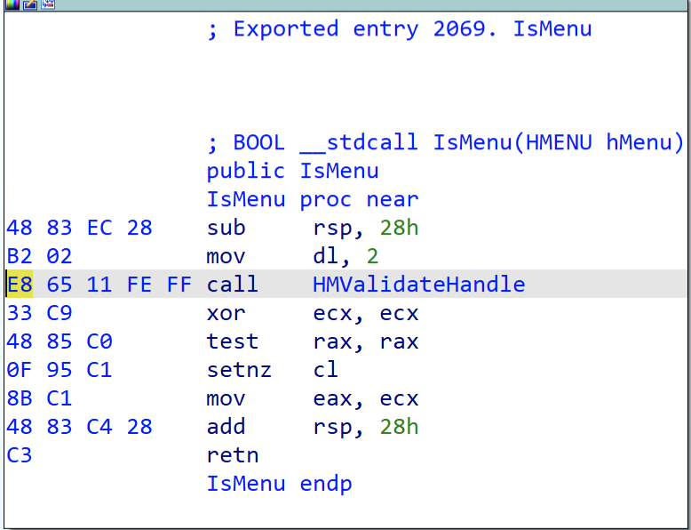
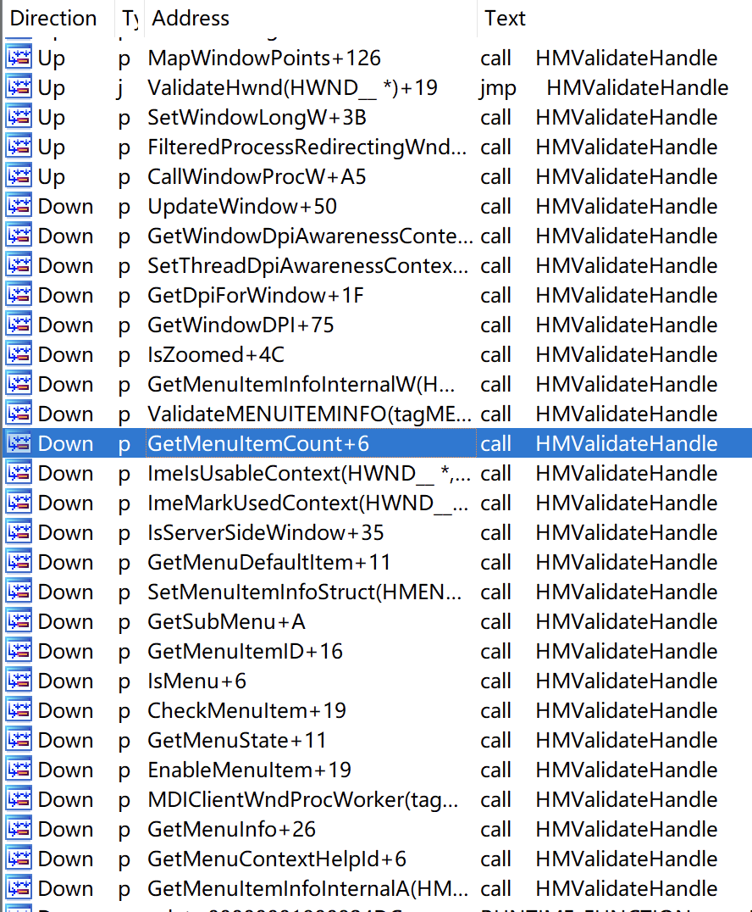
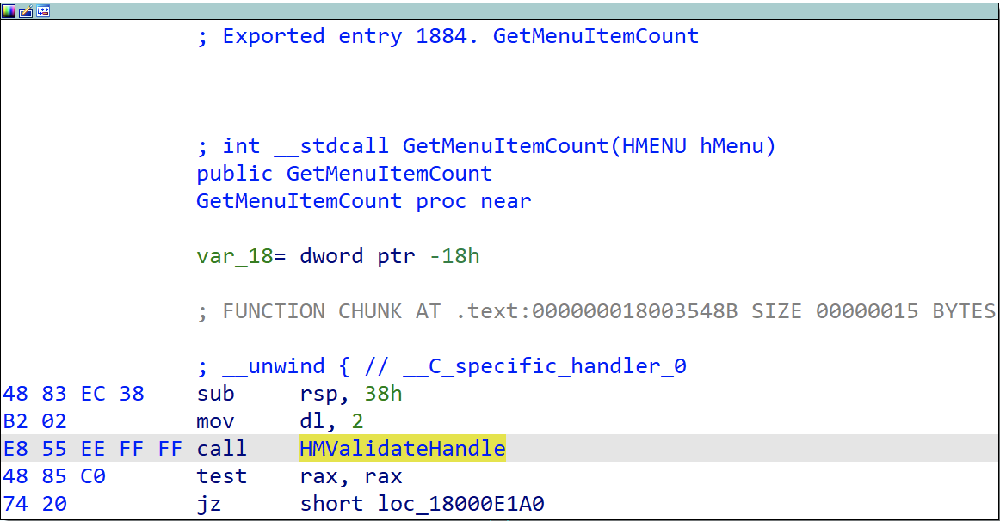

本文主要内容翻译自：[https://theevilbit.github.io/posts/a_simple_protection_against_hmvalidatehandle_technique/](https://theevilbit.github.io/posts/a_simple_protection_against_hmvalidatehandle_technique/)

观察最近几年 win32k 漏洞利用的技术中，HMValidateHandle 技术几乎到处都在用。然后我有一个关于如何防止此类利用的想法，这篇文章就讨论一下这个。

<!--more-->

## 一、什么是 HMValidateHandle？

HMValidateHandle 是 user32.dll 中一个内部未公开的函数。它需要两个参数 handle 和 handle type，通过查找 handle table，如果 handle 和 handle type 匹配它将复制对象到用户内存。如果对象是一个指针，类似于 tagWND，它将从内核中泄漏出内存地址。这是很久之前就已知的技术，我认为首次提出是在 2011 年的 BlackHat 大会上，你可以从这里找到 PDF：[https://media.blackhat.com/bh-us-11/Mandt/BH_US_11_Mandt_win32k_WP.pdf](https://media.blackhat.com/bh-us-11/Mandt/BH_US_11_Mandt_win32k_WP.pdf)。这个函数是非常有用的，经常在 Windows 内核漏洞中滥用来泄漏内核对象地址，因此微软决定关闭它，所以这个技术在 Windows 10 RS4 之后不再使用。

## 二、得到 HMValidateHandle 的地址

这个函数在 user32.dll 内部被频繁调用，所以我们只需要通过它去解析计算这个函数的地址。最常用的技术是在 user32.dll 中定位 IsMenu：

```cpp
HMODULE hUser32 = LoadLibraryA("user32.dll");
BYTE* pIsMenu = (BYTE *)GetProcAddress(hUser32, "IsMenu");
```

这个函数中的第一次 call 指令就是在调用 HMValidateHandle，call 指令的机器码为 E8，我们将通过这个标识进行定位。

```cpp
unsigned int uiHMValidateHandleOffset = 0;
    for (unsigned int i = 0; i < 0x1000; i++) {
        BYTE* test = pIsMenu + i;
        if (*test == 0xE8) {
            uiHMValidateHandleOffset = i + 1;
            break;
        }
    }
    unsigned int addr = *(unsigned int *)(pIsMenu + uiHMValidateHandleOffset);
    unsigned int offset = ((unsigned int)pIsMenu - (unsigned int)hUser32) + addr;
    //The +11 is to skip the padding bytes as on Windows 10 these aren't nops
    pHmValidateHandle = (lHMValidateHandle)((ULONG_PTR)hUser32 + offset + 11);
```

注：11 指的是 call 下一条指令相对于 IsMenu 函数地址的偏移，16 进制值为 0xB。

完整的代码可以从这里获取：[windows_kernel_address_leaks/HMValidateHandle](https://github.com/sam-b/windows_kernel_address_leaks/tree/master/HMValidateHandle)

也可以用下面的代码测试：

```cpp
#include <Windows.h>
#include <stdio.h>
 
typedef PVOID(WINAPI* FHMValidateHandle)(HANDLE h, BYTE byType);
 
bool FindHMValidateHandle(FHMValidateHandle* pfOutHMValidateHandle)
{
    HMODULE hUser32 = LoadLibraryW(L"user32.dll");
    if (!hUser32)
    {
        return false;
    }
    PBYTE pIsMenu = (PBYTE)GetProcAddress(hUser32, "IsMenu");
    if (pIsMenu)
    {
        fprintf(stdout, "Addr of IsMenu is 0x%p\n", pIsMenu);
 
        unsigned int uiHMValidateHandleOffset = 0;
        for (int i = 0; i < 0x100; i++)
        {
            if (0xe8 == *(pIsMenu + i))
            {
                uiHMValidateHandleOffset = i + 1;
                break;
            }
        }
 
        if (0 == uiHMValidateHandleOffset)
        {
            return false;
        }
 
        unsigned int addr = *(unsigned int*)(pIsMenu + uiHMValidateHandleOffset);
        unsigned int offset = ((unsigned int)pIsMenu - (unsigned int)hUser32) + addr;
        //The +11 is to skip the padding bytes as on Windows 10 these aren't nops
        *pfOutHMValidateHandle = (FHMValidateHandle)((ULONG_PTR)hUser32 + offset + 11);
 
        return true;
    }
 
    return false;
}
 
FHMValidateHandle fHMValidateHandle = NULL;
 
int APIENTRY wWinMain(_In_ HINSTANCE hInstance,
    _In_opt_ HINSTANCE hPrevInstance,
    _In_ LPWSTR lpCmdLine,
    _In_ int nCmdShow)
{
    // suppress warning C4100
    UNREFERENCED_PARAMETER(hPrevInstance);
    UNREFERENCED_PARAMETER(nCmdShow);
 
    // redirection stdin and stdout to console
    AllocConsole();
    FILE* tempFile = nullptr;
    freopen_s(&tempFile, "conin$", "r+t", stdin);
    freopen_s(&tempFile, "conout$", "w+t", stdout);
 
    bool bFound = FindHMValidateHandle(&fHMValidateHandle);
    if (!bFound)
    {
        fprintf(stdout, "Failed to locate HMValidateHandle, exiting\n");
        return 1;
    }
 
    fprintf(stdout, "Found location of HMValidateHandle in user32.dll\n");
    fprintf(stdout, "Addr of HMValidateHandle is 0x%p\n", fHMValidateHandle);
    system("pause");
}
```

这是 IsMenu 函数在 Windows 10 1809 版本中的反编译细节：



明白原理之后，当然也可以使用其他函数：



看起来 call 相对偏移越小的越好，比如 GetMenuItemCount 看起来也很简单：



只需要将代码中这句：

```cpp
BYTE* pIsMenu = (BYTE *)GetProcAddress(hUser32, "IsMenu");
```

改成：

```cpp
BYTE* pGetMenuItemCount = (BYTE *)GetProcAddress(hUser32, "GetMenuItemCount");
```

上述 call 地址计算方式中下条指令地址直接使用写死了偏移量 11，更灵活的方式应该是 call 指令地址 + 5，然后把 call 指令后面的偏移量 0xFFFFEE55 补充为对应系统位数，这里是 64 位将补充为 0xFFFFFFFFFFFFEE55，然后和下条指令地址相加得到最终的函数偏移量：

```cpp
typedef PVOID(WINAPI* FHMValidateHandle)(HANDLE h, BYTE byType);
 
bool FindHMValidateHandle(FHMValidateHandle *pfOutHMValidateHandle)
{
    *pfOutHMValidateHandle = NULL;
    HMODULE hUser32 = GetModuleHandle(L"user32.dll");
    PBYTE pMenuFunc = (PBYTE)GetProcAddress(hUser32, "IsMenu");
    if (pMenuFunc) {
        for (int i = 0; i < 0x100; ++i) {
            if (0xe8 == *pMenuFunc++) {
                DWORD ulOffset = *(PINT)pMenuFunc;
                *pfOutHMValidateHandle = (FHMValidateHandle)(pMenuFunc + 5 + (ulOffset & 0xffff) - 0x10000  - ((ulOffset >> 16 ^ 0xffff) * 0x10000) );
                break;
            }
        }
    }
    return *pfOutHMValidateHandle != NULL ? true : false;
}
```

## 三、防范及检测

尽管在 Windows 10 RS4 这个问题解决了，但是仍然有大量机器受影响的。思路是非常简单的，正常情况下 HMValidateHandle 只会在 user32.dll 内部调用。如果我们在用户模式下 hook 这个函数，然后检查调用栈，我们能容易的看出该调用是有效的还是来自 user32.dll 外部的漏洞利用。大多数 AV 都实现了用户层 hook，因为你不能在内核模式下 hook 所有东西（就像这个），所以再加一个，实际上不是困难的并且它将显著防止此类利用。

我个人并没有在 Windows 上实现过 hook，所以想看看我的想法是否能成功。我早些时候看到一些 AV 使用微软的 Detours，所以我想试试它也是不错的。
